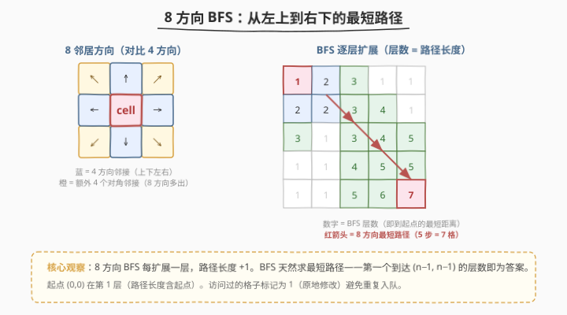
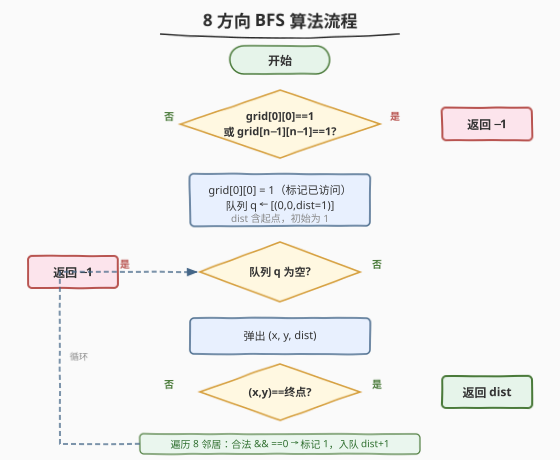
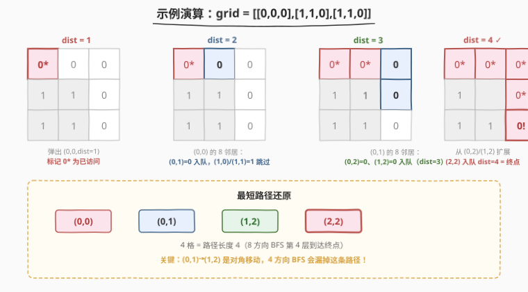

# LeetCode 二进制矩阵中的最短路径 题解

## 1. 题目概述

- **标题 / 题号**：二进制矩阵中的最短路径（#1091，medium）
- **链接**：https://leetcode.cn/problems/shortest-path-in-binary-matrix/
- **难度**：中等
- **标签**：广度优先搜索、矩阵、最短路径

**题意**：给定一个 $n \times n$ 的二进制矩阵 `grid`，返回从左上角 `(0, 0)` 到右下角 `(n - 1, n - 1)` 的最短**畅通路径**的长度。如果不存在这样的路径，返回 `-1`。

**畅通路径**定义：

- 路径上所有格子的值均为 `0`
- 路径中相邻的格子是 **8 方向连通**的（共享边或角，即上下左右 + 四个对角线方向）
- 路径长度 = 路径上访问的格子数（包含起点和终点）

**示例 1**：

```text
输入：grid = [[0,1],[1,0]]
输出：2
解释：路径 (0,0) → (1,1)，对角线一步到位，长度 2。
```

**示例 2**：

```text
输入：grid = [[0,0,0],[1,1,0],[1,1,0]]
输出：4
解释：路径 (0,0) → (0,1) → (1,2) → (2,2)，其中 (0,1)→(1,2) 是对角移动。
```

**示例 3**：

```text
输入：grid = [[1,0,0],[1,1,0],[1,1,0]]
输出：-1
解释：起点 (0,0) 为 1，无法出发。
```

**约束**：

- `n == grid.length`
- `n == grid[i].length`
- `1 <= n <= 100`
- `grid[i][j]` 为 `0` 或 `1`

## 2. 解题思路

### 2.1 暴力思路（DFS 全枚举）

从 `(0, 0)` 出发 DFS 枚举所有 8 方向路径，记录到达 `(n - 1, n - 1)` 的最短长度。问题：DFS 不保证先找到最短路径，需要枚举所有路径后取最小值，最坏 `O(8^{n^2})`，指数爆炸。

### 2.2 核心观察：8 方向 BFS



关键洞察：**BFS 按层扩展**，每扩展一层路径长度 `+1`。第一个到达 `(n - 1, n - 1)` 的层数即为最短路径长度——这是 BFS 求无权图最短路径的经典性质。

本题与普通网格 BFS 的区别在于 **8 方向连通**（而非 4 方向）。对角线移动使得路径可以"斜着走"，缩短最短路径长度。例如示例 2 中 `(0,1) → (1,2)` 的对角跳转是 4 方向 BFS 会漏掉的关键一步。

> 💡 **起点即终点**：若 `n == 1` 且 `grid[0][0] == 0`，路径长度为 1（起点本身就是终点）。

### 2.3 算法流程



1. **边界检查**：若 `grid[0][0] == 1` 或 `grid[n-1][n-1] == 1`，直接返回 `-1`
2. **初始化**：将 `(0, 0)` 入队，`dist = 1`（路径含起点），标记 `grid[0][0] = 1`（原地修改当作 visited）
3. **BFS 循环**：
   - 弹出 `(x, y, dist)`
   - 若 `(x, y) == (n - 1, n - 1)`，返回 `dist`
   - 遍历 8 个方向邻居 `(nx, ny)`：若在界内且 `grid[nx][ny] == 0`，标记为 `1`，入队 `(nx, ny, dist + 1)`
4. 队列空仍未到达终点，返回 `-1`

### 2.4 示例演算



以 `grid = [[0,0,0],[1,1,0],[1,1,0]]` 为例：

| dist | 弹出格子 | 入队的新邻居 | 说明 |
|------|----------|-------------|------|
| 1 | (0,0) | (0,1) | (1,0)=1、(1,1)=1 被跳过 |
| 2 | (0,1) | (0,2)、(1,2) | 8 方向：(0,2) 右方、(1,2) 对角 |
| 3 | (0,2) | 无新格子 | 邻居均已访问或为 1 |
| 3 | (1,2) | (2,2) | (2,2) 对角下方 |
| 4 | (2,2) | — | **(2,2) == 终点，返回 4** |

> ⚠️ **对角线是关键**：`(0,1) → (1,2)` 这一步是对角移动（行列各 `+1`），4 方向 BFS 需要 `(0,1) → (0,2) → (1,2)` 两步，而 8 方向只需一步。

## 3. 参考代码

### C++

```cpp
class Solution {
  public:
    int shortestPathBinaryMatrix(vector<vector<int>>& grid) {
        int n = grid.size();
        if (grid[0][0] == 1 || grid[n - 1][n - 1] == 1)
            return -1;
        if (n == 1)
            return 1;

        int dirs[8][2] = {{-1,-1},{-1,0},{-1,1},{0,-1},{0,1},{1,-1},{1,0},{1,1}};
        queue<tuple<int,int,int>> q;
        q.push({0, 0, 1});
        grid[0][0] = 1;

        while (!q.empty()) {
            auto [x, y, dist] = q.front();
            q.pop();
            for (auto& d : dirs) {
                int nx = x + d[0], ny = y + d[1];
                if (nx >= 0 && nx < n && ny >= 0 && ny < n && grid[nx][ny] == 0) {
                    if (nx == n - 1 && ny == n - 1)
                        return dist + 1;
                    grid[nx][ny] = 1;
                    q.push({nx, ny, dist + 1});
                }
            }
        }
        return -1;
    }
};
```

### Python

```python
class Solution:
    def shortestPathBinaryMatrix(self, grid: List[List[int]]) -> int:
        n = len(grid)
        if grid[0][0] == 1 or grid[n - 1][n - 1] == 1:
            return -1
        if n == 1:
            return 1

        dirs = [(-1,-1),(-1,0),(-1,1),(0,-1),(0,1),(1,-1),(1,0),(1,1)]
        q = collections.deque([(0, 0, 1)])
        grid[0][0] = 1

        while q:
            x, y, dist = q.popleft()
            for dx, dy in dirs:
                nx, ny = x + dx, y + dy
                if 0 <= nx < n and 0 <= ny < n and grid[nx][ny] == 0:
                    if nx == n - 1 and ny == n - 1:
                        return dist + 1
                    grid[nx][ny] = 1
                    q.append((nx, ny, dist + 1))
        return -1
```

## 4. 复杂度分析

| 维度 | 复杂度 | 说明 |
|------|--------|------|
| 时间复杂度 | $O(n^2)$ | 每个格子最多入队一次，8 方向邻居检查 $O(1)$ |
| 空间复杂度 | $O(n^2)$ | 队列最坏存所有格子；原地修改 grid 无需额外 visited |

## 5. 扩展：A\* 优化与双向 BFS

当 $n$ 较大且障碍稀疏时，朴素 BFS 可能扩展大量无关格子。两种优化思路：

- **A\* 搜索**：用启发式函数 $h = \max(|x - (n-1)|, |y - (n-1)|)$（8 方向切比雪夫距离）引导搜索朝终点方向优先扩展，减少无关格子的访问。优先队列按 $f = g + h$ 排序，其中 $g$ 为已走步数。
- **双向 BFS**：从起点和终点同时 BFS，当两端的访问集合相交时即找到最短路径。适用于终点位置固定且矩阵较大的场景。

> 💡 8 方向下的启发式距离必须用**切比雪夫距离** $\max(|dx|, |dy|)$ 而非曼哈顿距离 $|dx| + |dy|$，因为对角线移动一步可同时改变行列。

## 6. 面试要点

1. **为什么用 BFS 而不是 DFS？**

   - BFS 按层扩展，第一次到达终点的层数即为最短路径长度
   - DFS 需要枚举所有路径取最小值，指数级复杂度
   - 无权图最短路径 = BFS 的经典应用场景

2. **8 方向和 4 方向 BFS 的区别是什么？**

   - 4 方向只有上下左右，8 方向多了 4 个对角线方向
   - 8 方向下对角移动一步可同时改变行列，最短路径可能更短
   - 启发式距离也要相应改为切比雪夫距离

3. **为什么原地修改 grid 就能替代 visited 数组？**

   - 将访问过的 `0` 格子标记为 `1`，等价于"堵死"该格子
   - BFS 保证第一次访问某格子时路径最短，后续重复访问无意义
   - 节省 $O(n^2)$ 的 visited 数组空间（若要求不修改输入则需单独建 visited）

4. **起点或终点为 1 时怎么处理？**

   - 直接返回 `-1`，因为路径必须经过值为 0 的格子
   - 特判 `n == 1` 且 `grid[0][0] == 0` 时返回 1（起点即终点）

5. **dist 的初始值为什么是 1 而不是 0？**

   - 题目定义路径长度 = 访问的格子数（含起点）
   - 起点本身算 1 格，所以初始 `dist = 1`
   - 每扩展一层 `dist + 1`，对应多走一个格子

## 同类练习题

| # | 题目 | 与本题的关联 |
|---|------|-------------|
| 994 | [腐烂的橘子](https://leetcode.cn/problems/rotting-oranges/) | 多源 BFS 逐层扩展，本题的单源版本思路一致 |
| 1926 | [网格图中递增路径的数目](https://leetcode.cn/problems/number-of-increasing-paths-in-a-grid/) | 网格 DFS + 记忆化，对比 BFS 的适用场景 |
| 542 | [01 矩阵](https://leetcode.cn/problems/01-matrix/) | 多源 BFS 求每个 0 到最近 1 的距离，BFS 模板的另一变体 |
| 1293 | [网格中的最短路径](https://leetcode.cn/problems/shortest-path-in-a-grid-with-obstacles-elimination/) | BFS + 状态压缩（允许消除 k 个障碍），1091 的进阶版 |
