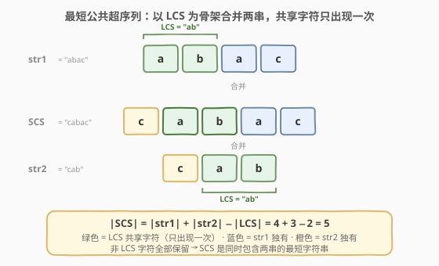
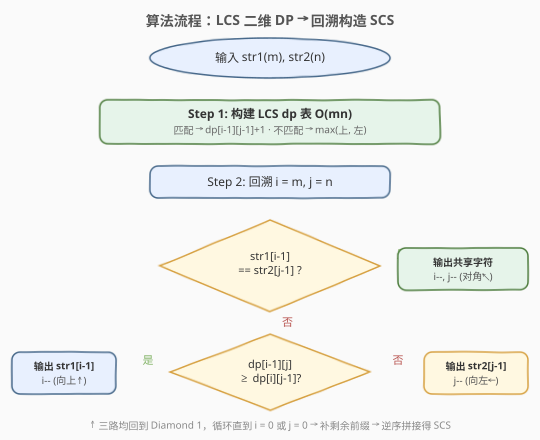
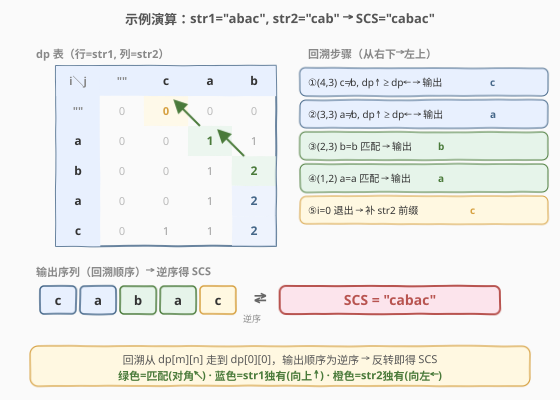

# 最短公共超序列

- **题目名称**：最短公共超序列
- **链接**：[1092. 最短公共超序列](https://leetcode.cn/problems/shortest-common-supersequence/)
- **难度**：困难
- **标签**：动态规划、字符串、LCS

## 1. 题目概述

给定两个字符串 `str1` 和 `str2`，返回**最短字符串**，该字符串同时以 `str1` 和 `str2` 作为子序列。如果存在多个有效答案，返回任意一个即可。

**超序列**：字符串 `s` 是字符串 `t` 的超序列，当且仅当 `t` 是 `s` 的子序列（即从 `s` 中删除若干字符可以得到 `t`）。

**示例 1**：

```text
输入：str1 = "abac", str2 = "cab"
输出："cabac"
解释："cabac" 是包含 "abac" 和 "cab" 的最短字符串。
     "abac" 是 "cabac" 的子序列（取下标 1,2,3,4）。
     "cab"  是 "cabac" 的子序列（取下标 0,1,2）。
```

**示例 2**：

```text
输入：str1 = "aaaaaaaa", str2 = "aaaaaaaa"
输出："aaaaaaaa"
```

**约束条件**：

- `1 <= str1.length, str2.length <= 1000`
- `str1` 和 `str2` 仅由小写英文字母组成

> 💡 本题是 [1143. 最长公共子序列](../1101-1200/1143_最长公共子序列.md) 的**构造升级版**：不仅要求 LCS 的长度，还要还原出实际的 SCS 字符串。核心公式 $|\text{SCS}| = m + n - |\text{LCS}|$，LCS 中的字符被两串「共享」只出现一次，非 LCS 字符全部保留。

---

## 2. 解题思路

### 2.1 暴力思路

枚举 `str1` 和 `str2` 的所有公共子序列，对每个公共子序列尝试构造超序列。时间复杂度指数级，必然超时。

### 2.2 核心观察：LCS 为骨架 + 回溯构造



关键直觉是：**最短公共超序列 = 两串合并，其中 LCS 部分只出现一次**。

- LCS 中的字符是两串「共享」的，在 SCS 中只需出现一次。
- 非 LCS 字符（两串各自独有的）必须全部保留，否则无法作为子序列被匹配。

因此：

$$|\text{SCS}| = |\text{str1}| + |\text{str2}| - |\text{LCS}|$$

**构造方法**：先构建 LCS 的 DP 表（同 1143），再从 `dp[m][n]` 回溯到 `dp[0][0]`，回溯过程中逐步拼出 SCS：

| 情况 | 条件 | 操作 | 输出 |
|------|------|------|------|
| **字符匹配** | `str1[i-1] == str2[j-1]` | 对角走 `i--, j--` | 该字符（共享，只输出一次） |
| **不匹配，走上** | `dp[i-1][j] >= dp[i][j-1]` | 向上 `i--` | `str1[i-1]`（str1 独有） |
| **不匹配，走左** | `dp[i-1][j] < dp[i][j-1]` | 向左 `j--` | `str2[j-1]`（str2 独有） |

回溯结束后，若某串还有剩余前缀（`i > 0` 或 `j > 0`），补上即可。

> 💡 **为什么字符匹配时输出一次就够了？** 匹配意味着该字符属于 LCS，两串都「用掉」这个字符。对角走 `i--, j--` 表示两串同步前进一步，该字符在 SCS 中只需出现一次即可同时满足两串的子序列匹配。

> ⚠️ **回溯方向与输出顺序**：回溯从 `(m, n)` 走向 `(0, 0)`，输出的字符是**逆序**的（先输出 SCS 的末尾字符）。因此最终需要反转拼接结果。

### 2.3 算法流程图



**完整步骤**：

1. **Step 1**：构建 LCS 的 `(m+1)×(n+1)` DP 表（同 1143 模板），$O(mn)$
2. **Step 2**：从 `i=m, j=n` 开始回溯，循环直到 `i=0` 或 `j=0`：
   - 字符匹配 → 输出该字符，`i--, j--`
   - 不匹配且 `dp[i-1][j] >= dp[i][j-1]` → 输出 `str1[i-1]`，`i--`
   - 不匹配且 `dp[i-1][j] < dp[i][j-1]` → 输出 `str2[j-1]`，`j--`
3. **Step 3**：补上 `str1[0..i-1]` 和 `str2[0..j-1]` 的剩余前缀
4. **Step 4**：逆序拼接 → SCS

### 2.4 示例演算

以 `str1 = "abac"`, `str2 = "cab"` 为例：



**LCS dp 表**（行 = str1，列 = str2，首行/首列为空串边界）：

| | `""` | `c` | `a` | `b` |
|------|------|-----|-----|-----|
| `""` | 0 | 0 | 0 | 0 |
| `a` | 0 | 0 | **1** | 1 |
| `b` | 0 | 0 | 1 | **2** |
| `a` | 0 | 0 | 1 | **2** |
| `c` | 0 | **1** | 1 | **2** |

LCS 长度 = `dp[4][3] = 2`，SCS 长度 = $4 + 3 - 2 = 5$。

**回溯路径**（从 `(4,3)` 到 `(0,0)`）：

| 步骤 | 位置 | 字符比较 | 判定 | 输出 | 方向 |
|------|------|----------|------|------|------|
| ① | (4,3) | `c` ≠ `b` | `dp[3][3]=2 ≥ dp[4][2]=1` | `c` (str1) | ↑ |
| ② | (3,3) | `a` ≠ `b` | `dp[2][3]=2 ≥ dp[3][2]=1` | `a` (str1) | ↑ |
| ③ | (2,3) | `b` == `b` | 匹配 | `b` (LCS) | ↖ |
| ④ | (1,2) | `a` == `a` | 匹配 | `a` (LCS) | ↖ |
| ⑤ | (0,1) | `i=0` 退出 | 补 str2 前缀 | `c` (str2) | ← |

输出序列（回溯顺序）：`c, a, b, a, c` → 逆序 → **`"cabac"`**

验证：`"cabac"` 包含 `"abac"`（下标 1,2,3,4）✓，包含 `"cab"`（下标 0,1,2）✓，长度 5 = $4+3-2$ ✓。

---

## 3. 参考代码

### C++

```cpp
class Solution {
public:
    string shortestCommonSupersequence(string str1, string str2) {
        int m = str1.size(), n = str2.size();
        // Step 1: 构建 LCS dp 表
        vector<vector<int>> dp(m + 1, vector<int>(n + 1, 0));
        for (int i = 1; i <= m; i++) {
            for (int j = 1; j <= n; j++) {
                if (str1[i - 1] == str2[j - 1]) {
                    dp[i][j] = dp[i - 1][j - 1] + 1;
                } else {
                    dp[i][j] = max(dp[i - 1][j], dp[i][j - 1]);
                }
            }
        }

        // Step 2: 回溯构造 SCS（逆序收集，最后反转）
        int i = m, j = n;
        string result;
        while (i > 0 && j > 0) {
            if (str1[i - 1] == str2[j - 1]) {
                result.push_back(str1[i - 1]);
                i--; j--;
            } else if (dp[i - 1][j] >= dp[i][j - 1]) {
                result.push_back(str1[i - 1]);
                i--;
            } else {
                result.push_back(str2[j - 1]);
                j--;
            }
        }
        // Step 3: 补剩余前缀
        while (i > 0) {
            result.push_back(str1[i - 1]);
            i--;
        }
        while (j > 0) {
            result.push_back(str2[j - 1]);
            j--;
        }
        // Step 4: 逆序
        reverse(result.begin(), result.end());
        return result;
    }
};
```

### Python

```python
class Solution:
    def shortestCommonSupersequence(self, str1: str, str2: str) -> str:
        m, n = len(str1), len(str2)
        # Step 1: 构建 LCS dp 表
        dp = [[0] * (n + 1) for _ in range(m + 1)]
        for i in range(1, m + 1):
            for j in range(1, n + 1):
                if str1[i - 1] == str2[j - 1]:
                    dp[i][j] = dp[i - 1][j - 1] + 1
                else:
                    dp[i][j] = max(dp[i - 1][j], dp[i][j - 1])

        # Step 2: 回溯构造 SCS（逆序收集）
        i, j = m, n
        result = []
        while i > 0 and j > 0:
            if str1[i - 1] == str2[j - 1]:
                result.append(str1[i - 1])
                i -= 1
                j -= 1
            elif dp[i - 1][j] >= dp[i][j - 1]:
                result.append(str1[i - 1])
                i -= 1
            else:
                result.append(str2[j - 1])
                j -= 1
        # Step 3: 补剩余前缀
        while i > 0:
            result.append(str1[i - 1])
            i -= 1
        while j > 0:
            result.append(str2[j - 1])
            j -= 1
        # Step 4: 逆序
        return ''.join(reversed(result))
```

> ⚠️ **两个易错点**：
> 1. **回溯方向判断必须用 `>=` 而非 `>`**：当 `dp[i-1][j] == dp[i][j-1]` 时，走上和走左都合法，取任一方向即可。用 `>=` 保证有确定走向，避免边界漏判。
> 2. **最终必须反转**：回溯从末尾向前收集字符，`result` 中字符顺序与 SCS 相反。忘记 `reverse` 是最常见的 bug。

---

## 4. 复杂度分析

| 维度 | 复杂度 | 说明 |
|------|--------|------|
| 时间复杂度 | $O(m \times n)$ | 构建 DP 表 $O(mn)$ + 回溯 $O(m+n)$，前者主导 |
| 空间复杂度 | $O(m \times n)$ | 需要完整二维 DP 表供回溯，无法用滚动数组压缩 |

> ⚠️ **为什么不能用滚动数组？** 回溯需要访问 `dp[i-1][j]` 和 `dp[i][j-1]` 的历史值来决定走向，滚动数组只保留当前行，丢失了历史信息。必须保留完整二维表。这与 1143 LCS（只求长度可用滚动数组）形成对照。

---

## 5. 扩展：SCS 长度的直接公式

如果不要求构造 SCS 字符串、只求长度，可以直接用：

$$|\text{SCS}| = m + n - |\text{LCS}|$$

这是因为 SCS = 两串所有字符的并集，其中 LCS 字符被「去重」（共享一次），非 LCS 字符各出现一次。

相关题目 [583. 两个字符串的删除操作](https://leetcode.cn/problems/delete-operation-for-two-strings/) 本质相同：最少删除操作数 = $m + n - 2 \times |\text{LCS}|$（两串各自删到 LCS），而 SCS 是「不删而是合并」的对偶问题。

### 回溯方向的选择不影响正确性

当 `dp[i-1][j] == dp[i][j-1]` 时，走上（输出 `str1[i-1]`）或走左（输出 `str2[j-1]`）都能构造出长度相同的合法 SCS，只是具体字符串不同。题目允许返回任意一个，所以取 `>=` 任选一个方向即可。

---

## 6. 面试要点

1. **SCS 和 LCS 的关系是什么？**

   > $|\text{SCS}| = m + n - |\text{LCS}|$。LCS 是两串共享的部分，在 SCS 中只出现一次；非 LCS 字符全部保留。SCS 就是「以 LCS 为骨架，把两串各自的独有字符穿插进去」。

2. **回溯时如何决定走向？**

   > 字符匹配 → 对角走（输出共享字符一次）。不匹配时比较 `dp[i-1][j]` 和 `dp[i][j-1]`：哪个大就走哪个方向，并输出对应串的字符。相等时任选，用 `>=` 统一选走上。

3. **为什么结果需要反转？**

   > 回溯从 `(m, n)` 走向 `(0, 0)`，先碰到的是字符串末尾。收集顺序是 SCS 的逆序，反转后才得到正序。

4. **为什么不能用滚动数组优化空间？**

   > 回溯需要根据 `dp[i-1][j]` 和 `dp[i][j-1]` 的大小关系决定走向，这要求完整的历史行数据。滚动数组只保留当前行，无法回溯。求长度（1143）可用滚动数组，构造 SCS 不行。

5. **时间复杂度为什么是 O(mn)？**

   > 构建 DP 表是双重循环 $O(mn)$。回溯从 `(m,n)` 走到 `(0,0)`，每步 `i` 或 `j` 至少减 1，最多 $m+n$ 步。$O(mn)$ 主导。

> 💡 **一句话总结**：1092 是 LCS 的构造应用题——先用 1143 模板建 DP 表，再从右下回溯到左上，匹配时输出一次、不匹配时输出非 LCS 字符，逆序即得 SCS。核心公式 $|\text{SCS}| = m + n - |\text{LCS}|$。

---

## 7. 同类练习题

- [1143. 最长公共子序列](https://leetcode.cn/problems/longest-common-subsequence/)（[题解](../1101-1200/1143_最长公共子序列.md)）：本题的前置模板，只求 LCS 长度，二维 DP
- [583. 两个字符串的删除操作](https://leetcode.cn/problems/delete-operation-for-two-strings/)：LCS 直接应用，$\text{answer} = m + n - 2 \times |\text{LCS}|$
- [72. 编辑距离](https://leetcode.cn/problems/edit-distance/)（[题解](../0001-0100/72_编辑距离.md)）：同构二维 DP，回溯可还原操作序列
- [97. 交错字符串](https://leetcode.cn/problems/interleaving-string/)：二维布尔 DP + 回溯判定，SCS 的「交错」变体
- [718. 最长重复子数组](https://leetcode.cn/problems/maximum-length-of-repeated-subarray/)：改求最长公共子串（连续），不匹配时 `dp=0`
