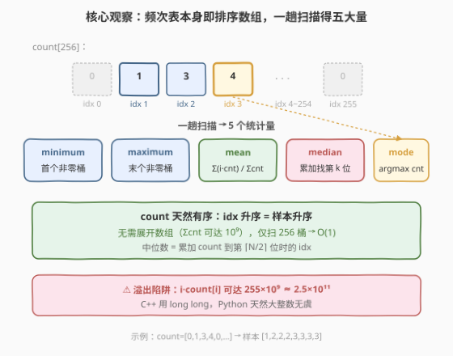
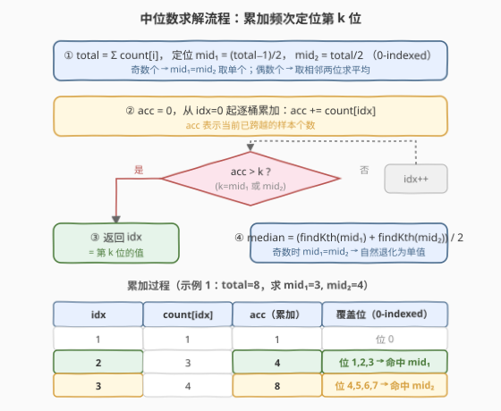

# LeetCode 大样本统计 题解

## 1. 题目概述

- **标题 / 题号**：大样本统计（#1093，medium）
- **链接**：https://leetcode.cn/problems/statistics-from-a-large-sample/
- **难度**：中等
- **标签**：数组、数学、统计

**题意**：对 `0` 到 `255` 之间的整数进行采样，结果存储在长度为 256 的数组 `count` 中：`count[k]` 表示整数 $k$ 在样本中出现的次数。要求计算以下五项统计量并以浮点数数组 $[\text{minimum},\ \text{maximum},\ \text{mean},\ \text{median},\ \text{mode}]$ 返回。

| 统计量 | 定义 |
|--------|------|
| **minimum** | 样本中的最小元素 |
| **maximum** | 样本中的最大元素 |
| **mean** | 所有元素之和除以元素总数 |
| **median** | 奇数个取排序后正中元素；偶数个取中间两元素的平均值 |
| **mode** | 出现次数最多的数字（题目保证唯一） |

**示例 1**：

```text
输入：count = [0,1,3,4,0,0,...,0]   （仅 count[1]=1, count[2]=3, count[3]=4，其余为 0）
输出：[1.00000,3.00000,2.37500,2.50000,3.00000]
解释：展开样本 = [1,2,2,2,3,3,3,3]，共 8 个元素。
  minimum=1, maximum=3
  mean = (1+2+2+2+3+3+3+3)/8 = 19/8 = 2.375
  median = (2+3)/2 = 2.5（偶数个，取第 4、5 个的平均）
  mode = 3（count[3]=4 最大）
```

**示例 2**：

```text
输入：count = [0,4,3,2,2,0,...,0]   （count[1]=4, count[2]=3, count[3]=2, count[4]=2）
输出：[1.00000,4.00000,2.18182,2.00000,1.00000]
解释：展开样本 = [1,1,1,1,2,2,2,3,3,4,4]，共 11 个元素。
  minimum=1, maximum=4
  mean = 24/11 ≈ 2.18182
  median = 2（奇数个，取第 6 个）
  mode = 1（count[1]=4 最大）
```

**约束**：

- $\text{count.length} = 256$
- $0 \le \text{count[i]} \le 10^9$
- $1 \le \sum(\text{count}) \le 10^9$
- `count` 的众数是**唯一**的

> 💡 **关键直觉**：`count` 是一个**频次表**——下标 $i$ 升序天然对应样本值升序。我们不需要把 $10^9$ 个样本展开，只需在 256 个桶上做一趟累加扫描即可得出全部统计量。

## 2. 解题思路

### 2.1 暴力思路：展开样本数组

最直白的做法是按 `count` 展开「完整样本数组」：对每个 $i$ 追加 `count[i]` 个 $i$ 到一个列表中，再对这个有序列表求 min/max/mean/median/mode。

然而 $\sum(\text{count})$ 可达 $10^9$，展开数组需要 $O(N)$ 时间与 $O(N)$ 空间（$N = 10^9$），内存直接超限。这条路走不通。

> 💡 暴力的浪费在于：**样本已经是有序的**——`count` 的下标顺序就是值的升序。展开只是把压缩信息无意义地铺开，所有统计量都能在压缩态上直接读取。

### 2.2 核心观察：频次表上直接统计



`count` 数组是一个**已排序的频次表**：下标 $i$ 从 $0$ 到 $255$ 递增，对应样本值也递增。这意味着：

1. **minimum** = 第一个 $\text{count}[i] > 0$ 的下标 $i$。
2. **maximum** = 最后一个 $\text{count}[i] > 0$ 的下标 $i$。
3. **mean** = $\dfrac{\sum_{i=0}^{255} i \cdot \text{count}[i]}{\sum_{i=0}^{255} \text{count}[i]}$。
4. **mode** = $\arg\max_i \text{count}[i]$（使 $\text{count}[i]$ 最大的 $i$）。
5. **median** = 累加 $\text{count}$ 到「越过中点位置」时的下标 $i$。

五项统计量都只需要一趟 $O(256)$ 扫描，等效 $O(1)$。

> ⚠️ **溢出陷阱**：$i \cdot \text{count}[i]$ 最大可达 $255 \times 10^9 \approx 2.55 \times 10^{11}$，超过 32 位 `int` 范围（$\approx 2.1 \times 10^9$）。C++ 中必须用 `long long` 累加；Python 原生大整数无此问题，但最终除法需转 `float`。

### 2.3 中位数求解流程



中位数是本题唯一需要稍作设计的部分。设 $N = \sum(\text{count})$，采用 **0-indexed** 定位：

- $\text{mid}_1 = \lfloor (N - 1) / 2 \rfloor$（左中位位置）
- $\text{mid}_2 = \lfloor N / 2 \rfloor$（右中位位置）
- $N$ 为奇数时 $\text{mid}_1 = \text{mid}_2$，二者指向同一元素，中位数即该值。
- $N$ 为偶数时 $\text{mid}_1$ 与 $\text{mid}_2$ 相邻，中位数 = 两位值之平均。

**查找第 $k$ 位（0-indexed）的值**：从 $i = 0$ 起累加 `acc += count[i]`，当 `acc > k` 时，当前 $i$ 即为第 $k$ 位的值——因为累加到 $i$ 时 `acc` 已覆盖了位 $0$ 到 $\text{acc}-1$，`acc > k` 意味着第 $k$ 位落在当前桶内。

> 💡 **统一奇偶**：用 $\text{mid}_1$ 和 $\text{mid}_2$ 两次查找再求平均，奇数时二者相等自然退化为单值，无需写 `if (N % 2)` 分支。

### 2.4 示例演算

以示例 1 `count = [0,1,3,4,0,…,0]` 为例，展开样本 $= [1,2,2,2,3,3,3,3]$，$N = 8$。

![示例演算：count=[0,1,3,4] 五大量逐项计算](../images/sample_stats_example_walkthrough.svg)

| 统计量 | 计算过程 | 结果 |
|--------|----------|------|
| minimum | 首个 $\text{count}[i]>0$ → $i=1$ | $1.00000$ |
| maximum | 末个 $\text{count}[i]>0$ → $i=3$ | $3.00000$ |
| mean | $(1{\cdot}1 + 2{\cdot}3 + 3{\cdot}4) / 8 = 19/8$ | $2.37500$ |
| median | $\text{mid}_1{=}3,\ \text{mid}_2{=}4$；累加到 $i{=}2$ 时 $\text{acc}{=}4>3$ → 值 $2$；累加到 $i{=}3$ 时 $\text{acc}{=}8>4$ → 值 $3$；$(2{+}3)/2$ | $2.50000$ |
| mode | $\text{count}[3]=4$ 最大 | $3.00000$ |

> 💡 **对照示例 2**：$N=11$（奇数），$\text{mid}_1 = \text{mid}_2 = 5$，两次查找都定位到 $i=1$（累加 $\text{count}[1]=4$ 覆盖位 0–3，$\text{count}[2]=3$ 覆盖位 4–6，位 5 落在 $i=2$），中位数 $= 2$。

## 3. 参考代码

### C++

```cpp
class Solution {
  public:
    vector<double> sampleStats(vector<int>& count) {
        int n = 256;
        long long total = 0;
        long long sumVal = 0;
        int minimum = -1, maximum = 0;
        int mode = 0, maxCnt = 0;
        for (int i = 0; i < n; ++i) {
            if (count[i] == 0) continue;
            if (minimum == -1) minimum = i;
            maximum = i;
            total += count[i];
            sumVal += (long long)i * count[i];
            if (count[i] > maxCnt) {
                maxCnt = count[i];
                mode = i;
            }
        }
        double mean = (double)sumVal / total;

        auto findKth = [&](long long k) -> int {
            long long acc = 0;
            for (int i = 0; i < n; ++i) {
                acc += count[i];
                if (acc > k) return i;
            }
            return 255;
        };
        long long mid1 = (total - 1) / 2;
        long long mid2 = total / 2;
        double median = (findKth(mid1) + findKth(mid2)) / 2.0;

        return {(double)minimum, (double)maximum, mean, median, (double)mode};
    }
};
```

### Python

```python
class Solution:
    def sampleStats(self, count: List[int]) -> List[float]:
        total = sum(count)
        sum_val = sum(i * count[i] for i in range(256))
        minimum = next(i for i in range(256) if count[i] > 0)
        maximum = next(i for i in range(255, -1, -1) if count[i] > 0)
        mean = sum_val / total
        mode = max(range(256), key=lambda i: count[i])

        def find_kth(k: int) -> int:
            acc = 0
            for i in range(256):
                acc += count[i]
                if acc > k:
                    return i
            return 255

        mid1 = (total - 1) // 2
        mid2 = total // 2
        median = (find_kth(mid1) + find_kth(mid2)) / 2.0
        return [float(minimum), float(maximum), mean, median, float(mode)]
```

> ⚠️ **易错点**：
> - C++ 中 `i * count[i]` 须先强转 `long long`，否则 `int × int` 在 $i=255,\ \text{count}[i]=10^9$ 时溢出。
> - `findKth` 的判定条件是 `acc > k`（严格大于），不是 `acc >= k`。因为 `acc` 是「已覆盖位数」，覆盖到第 `acc - 1` 位，第 $k$ 位需要 `acc > k` 才命中。
> - 返回值全部为 `double`/`float`，五个量都要显式转换。

## 4. 复杂度分析

| 维度 | 复杂度 | 说明 |
|------|--------|------|
| 时间复杂度 | $O(256) = O(1)$ | 一趟主扫描 256 桶 + 两次 `findKth` 各最多 256 桶，常数级 |
| 空间复杂度 | $O(1)$ | 仅用几个标量变量，无额外数组 |

> 💡 本题的「大规模」体现在样本总数 $N$ 可达 $10^9$，但频次表只有 256 个桶。巧妙之处在于**在压缩表示上直接统计**，把 $O(N)$ 降为 $O(256)$，这是频次表/直方图类问题的通用降维思路。

## 5. 扩展：加权中位数与流式中位数

**加权中位数**：本题的 `findKth` 本质上是在频次表上求**加权中位数**——每个值 $i$ 带权重 $\text{count}[i]$，找累积权重越过 $N/2$ 的位置。这一思想在「带权图的最优选址」「一维 L1 中位数问题」中反复出现：求 $\arg\min_x \sum w_i |x - x_i|$ 时，最优 $x$ 恰为加权中位数。

**流式中位数**：若样本不是一次性给定的频次表，而是**数据流**（不断有新元素到达），则需用「大顶堆 + 小顶堆」维护动态中位数（对顶堆法）：大顶堆存较小半部分、小顶堆存较大半部分，两堆规模差 $\le 1$，堆顶即为中位数。本题的频次表是静态的，无需此结构，但面试官可能追问「数据流版怎么办」。

> 💡 **频次表 vs 数据流**：频次表是「已聚合的静态数据」→ 累加扫描即可；数据流是「未聚合的动态数据」→ 对顶堆维护。识别数据形态选择对应工具。

## 6. 面试要点

1. **为什么不直接展开样本数组？**

   - $\sum(\text{count})$ 可达 $10^9$，展开需 $O(N)$ 时间和空间，内存超限。频次表本身就是压缩的有序表示，在桶上累加即可，$O(256)$ 常数级。

2. **中位数的 0-indexed 定位公式如何推导？**

   - $N$ 个元素的 0-indexed 位置为 $0$ 到 $N-1$。奇数 $N$：中位位置 $(N-1)/2$；偶数 $N$：中间两位为 $N/2 - 1$ 和 $N/2$。统一为 $\text{mid}_1 = (N-1)//2$、$\text{mid}_2 = N//2$，奇数时二者相等。

3. **`findKth` 的判定为什么是 `acc > k` 而非 `acc >= k`？**

   - `acc` 累加到桶 $i$ 时，表示前 $i+1$ 个桶共覆盖了 `acc` 个元素，位置 $0$ 到 $\text{acc}-1$。第 $k$ 位需要 $\text{acc} - 1 \ge k$，即 $\text{acc} > k$（或 $\text{acc} \ge k + 1$）。用 `acc > k` 最简洁。

4. **C++ 中哪些地方会溢出？**

   - `i * count[i]`：$255 \times 10^9 \approx 2.55 \times 10^{11}$，超 `int` 上限 $\approx 2.1 \times 10^9$，须 `(long long)i * count[i]`。`total` 和 `sumVal` 也须用 `long long`。`mid1`/`mid2` 涉及 $10^9$ 量级的 `total`，同样用 `long long`。

5. **能否只调用一次 `findKth`？**

   - 偶数 $N$ 时 $\text{mid}_1$ 和 $\text{mid}_2$ 相邻，若 $\text{mid}_1$ 命中桶 $i$ 且该桶覆盖范围也包含 $\text{mid}_2$，则一次即可。但若 $\text{mid}_1$ 恰是某桶的最后一个位置、$\text{mid}_2$ 在下一桶，则仍需两次查找。两次调用 $O(256)$ 代价可忽略，代码更简洁，无需为此优化。

## 同类练习题

| # | 题目 | 与本题的关联 |
|---|------|-------------|
| 704 | [二分查找](https://leetcode.cn/problems/binary-search/)（[题解](../0601-0700/704_二分查找.md)） | 在有序结构上定位目标值，本题 `findKth` 是频次表上的「累加二分」变体 |
| 347 | [前 K 个高频元素](https://leetcode.cn/problems/top-k-frequent-elements/) | 频次表 + Top-K，同样在压缩频次上做统计而非展开 |
| 295 | [数据流的中位数](https://leetcode.cn/problems/find-median-from-data-stream/) | 动态流式中位数（对顶堆），对照本题静态频次表中位数 |
| 162 | [寻找峰值](https://leetcode.cn/problems/find-peak-element/) | $\arg\max$ 型定位，本题 mode 即频次表上的峰值 |
| 528 | [按权重随机选择](https://leetcode.cn/problems/random-pick-with-weight/)（[题解](../0501-0600/528_按权重随机选择.md)） | 前缀和 + 二分定位，与本题累加定位中位数思想同源 |
