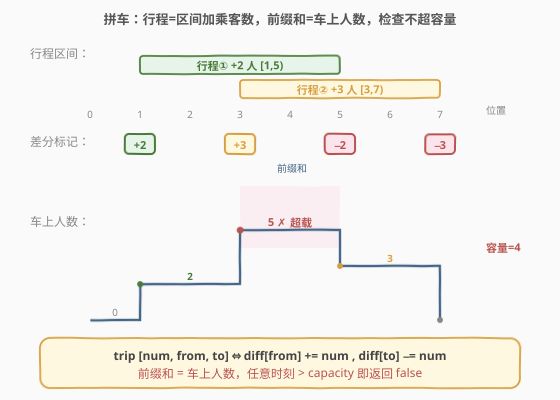
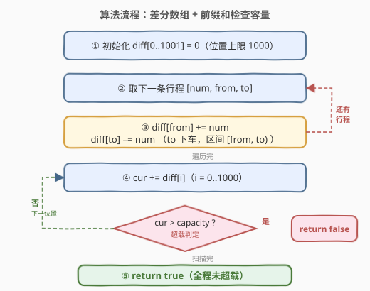
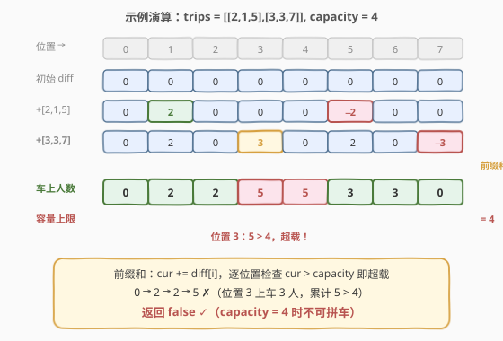

# 拼车

- **题目名称**：拼车
- **链接**：[1094. 拼车](https://leetcode.cn/problems/car-pooling/)
- **难度**：中等
- **标签**：差分数组、前缀和、数组、模拟

## 1. 题目概述

你驾驶一辆初始空座位为 `capacity` 的车辆向东行驶（不可掉头）。给定一组行程 `trips`，其中 `trips[i] = [numPassengers_i, from_i, to_i]` 表示第 $i$ 趟行程需在位置 `from_i` 接上 `numPassengers_i` 名乘客，并在位置 `to_i` 将他们放下。位置以东向距离（公里数）给出。问：能否**全程不超载**地接完所有行程的所有乘客？

**示例 1**：

```text
输入：trips = [[2,1,5],[3,3,7]], capacity = 4
输出：false
解释：位置 1 上 2 人（车上 2），位置 3 再上 3 人（车上 5 > 4），超载。
```

**示例 2**：

```text
输入：trips = [[2,1,5],[3,3,7]], capacity = 5
输出：true
解释：最大瞬时人数 5（位置 3~4），恰好等于容量 5，合法。
```

**示例 3**：

```text
输入：trips = [[2,1,5],[3,5,7]], capacity = 3
输出：true
解释：位置 5 时行程①的 2 人下车、行程②的 3 人上车，净 +1，车上 3 ≤ 3，合法。
```

**约束条件**：

- $1 \le \text{trips.length} \le 1000$
- $\text{trips[i].length} == 3$
- $1 \le \text{numPassengers}_i \le 100$
- $0 \le \text{from}_i < \text{to}_i \le 1000$
- $1 \le \text{capacity} \le 10^5$

> 💡 **关键直觉**：每趟行程是「在一段位置区间内、车上多了若干人」——上车点 `from` 净增 `num`，下车点 `to` 净减 `num`。这正是**差分数组**的区间加模型；只需一趟前缀和还原「每个位置的车上人数」，再检查是否任意时刻超过 `capacity`。

---

## 2. 解题思路

### 2.1 暴力思路：逐位置累加

开一个长度为 $1001$ 的数组 `cnt[0..1000]` 表示每个位置的车上人数。对每趟行程 `[num, from, to]`，循环把 `cnt[from..to-1]` 每个位置都加 `num`。全部处理完后，扫描 `cnt` 取最大值与 `capacity` 比较。共 $m$ 趟行程、每趟最长 $O(1000)$，总时间 $O(m \cdot 1000)$；$m = 1000$ 时约 $10^6$，勉强能过但浪费——每趟行程对一大段位置做**重复的逐点加法**。

> 💡 暴力的浪费在于：一趟行程覆盖的整段区间里，**每个位置的增量都相同**。只需在「起点」和「终点」各标记一次，最后统一还原即可——这正是差分数组的本质。

### 2.2 核心观察：差分数组 + 前缀和检查容量



差分数组 `diff` 与原数组 `cnt`（每位置车上人数）互为前缀和/差分关系。一趟行程 `[num, from, to]` 表示乘客**从 `from` 上车、到 `to` 下车**，即他们在车上的位置区间是**半开区间** $[\text{from},\ \text{to})$——`to` 处他们已下车，不再占座。于是这趟行程对 `cnt` 的区间加 $[\text{from},\ \text{to})$ 可拆成两处**点修改**：

$$
\text{diff}[\text{from}]\;{+}{=}\;\text{num},\qquad \text{diff}[\text{to}]\;{-}{=}\;\text{num}
$$

直观理解：在 `from` 处「开启」一个 $+\text{num}$ 的贡献，它在后续前缀和里一直生效；到 `to` 处「关闭」，用一个 $-\text{num}$ 把它抵消。这样 `from..to-1` 之间每个位置的前缀和都多了 `num`，而 `to` 及以后恢复原值。

> ⚠️ **与 370/1109 的关键区别：半开区间无需 +1**。[370. 区间加法](../0301-0400/370_区间加法.md) 与 [1109. 航班预订统计](../1101-1200/1109_航班预订统计.md) 的区间是**闭区间** $[l, r]$，必须在 $r+1$ 处关闭贡献；而本题的 `to` 是乘客**下车点**，本身就不含该趟乘客（半开 $[\text{from},\ \text{to})$），故直接在 `to` 处减 `num`，**不需要再 +1**。这是本题最易踩的坑。

> 💡 **同时刻上下车自动净结算**：若同一位置既有下车（$-\text{num}_1$）又有上车（$+\text{num}_2$），差分数组在该位置累加为净变化 $\text{num}_2 - \text{num}_1$。前缀和还原时用的是这个净值，恰好对应「先下后上」的物理过程——下车腾出的座位立刻供上车者使用。示例 3 中位置 5 同时 $-2+3=+1$，车上 $2+1=3$，正确判合法。

最终对所有 `diff` 求一趟前缀和，得到每个位置的「车上人数」`cur`；只要任意位置 `cur > capacity` 即超载，返回 `false`；全程未超则返回 `true`。还可以**提前终止**：一旦某位置 `cur` 超容量，立即返回，无需扫描剩余位置。

### 2.3 算法流程图



流程要点：

- **第一步**：初始化 `diff[0..1000] = 0`（位置上限 $1000$，故数组长度 $1001$）。
- **第二步**：遍历每趟行程 `[num, from, to]`，做两处点修改：`diff[from] += num`、`diff[to] -= num`。
- **第三步**：从位置 $0$ 起求前缀和 `cur += diff[i]`；若 `cur > capacity` 立即返回 `false`。
- **第四步**：扫完全部位置未超载，返回 `true`。

> 💡 **提前终止**：与 370/1109「必须还原整个数组」不同，本题只关心「是否超载」，故前缀和扫描中一旦发现 `cur > capacity` 即可 `return false`，平均情况可省去尾部扫描。最坏情况（合法或超载点靠后）仍扫满 $1001$ 个位置，但常数极小。

### 2.4 示例演算

以示例 1 `trips = [[2,1,5],[3,3,7]], capacity = 4` 为例，差分数组取位置 $0..7$：



| 步骤 | 操作 | diff[1] | diff[3] | diff[5] | diff[7] | 说明 |
|------|------|---------|---------|---------|---------|------|
| 初始 | — | 0 | 0 | 0 | 0 | 全 0 |
| 1 | 行程① [2,1,5]：diff[1]+=2, diff[5]−=2 | 2 | 0 | −2 | 0 | 行程①区间 [1,5) |
| 2 | 行程② [3,3,7]：diff[3]+=3, diff[7]−=3 | 2 | 3 | −2 | −3 | 行程②区间 [3,7) |

最后对 `diff[0..7]` 求前缀和（`cur += diff[i]`）并逐位置检查容量：

- 位置 0：`cur = 0`
- 位置 1：`cur = 0 + 2 = 2`（行程①上车 2 人）
- 位置 2：`cur = 2 + 0 = 2`
- 位置 3：`cur = 2 + 3 = 5` → $5 > 4$ **超载！立即返回 `false`**

> 💡 **对照示例 3**：`trips = [[2,1,5],[3,5,7]], capacity = 3`。位置 5 处 `diff[5] = -2 + 3 = +1`（行程①下车 2、行程②上车 3，净值 +1），`cur = 2 + 1 = 3 ≤ 3`，全程最大瞬时人数恰为 3，返回 `true`。这验证了「同时刻上下车按净值结算」的正确性——若误把下车点写成 `to+1`（闭区间），位置 5 会先变成 $2+3=5$ 触发误报超载，再在 6 处减 2，得到错误结论。

---

## 3. 参考代码

### C++

```cpp
class Solution {
  public:
    bool carPooling(vector<vector<int>>& trips, int capacity) {
        vector<int> diff(1001, 0); // 位置范围 0..1000
        for (auto& t : trips) {
            int num = t[0], start = t[1], end = t[2];
            diff[start] += num; // start 上车
            diff[end] -= num;   // end 下车（半开区间 [start, end) ）
        }
        int cur = 0;
        for (int i = 0; i <= 1000; ++i) {
            cur += diff[i];
            if (cur > capacity) return false;
        }
        return true;
    }
};
```

### Python

```python
class Solution:
    def carPooling(self, trips: List[List[int]], capacity: int) -> bool:
        diff = [0] * 1001  # 位置范围 0..1000
        for num, start, end in trips:
            diff[start] += num  # start 上车
            diff[end] -= num    # end 下车（半开区间 [start, end) ）
        cur = 0
        for d in diff:
            cur += d
            if cur > capacity:
                return False
        return True
```

> ⚠️ **易错点**：下车点写 `diff[end] -= num`（直接用 `end`），**不要**写成 `diff[end + 1] -= num`。前者对应半开区间 $[\text{start},\ \text{end})$，乘客在 `end` 下车后即不占座；后者会误把 `end` 位置也算入该趟乘客，导致容量虚高、合法行程被判超载。

> 💡 Python 也可用 `itertools.accumulate` 一行还原前缀和，但本题需逐位置检查容量并提前终止，显式循环更直观且能及时 `return`。

---

## 4. 复杂度分析

| 维度 | 复杂度 | 说明 |
|------|--------|------|
| 时间复杂度 | $O(m + L)$ | $m = \text{len(trips)}$：遍历行程做 $2m$ 次点修改 $O(m)$；再扫一遍 `diff` 求前缀和 $O(L)$，$L = 1001$（位置上限） |
| 空间复杂度 | $O(L)$ | 差分数组长度 $1001$；位置上限固定，与 $m$ 无关 |

> 💡 位置上限 $L = 1001$ 是常数，故时间/空间均为 $O(m)$ 级别。$m \le 1000$，总操作量约 $3000$ 次，极快。

---

## 5. 扩展：位置范围很大时——扫描线 + 排序事件

本题位置上限仅 $1000$，定长 `diff` 数组最简洁。若把约束改为 $0 \le \text{to}_i \le 10^9$（位置稀疏且跨度大），开 $10^9$ 长度的数组不可行，应改用**扫描线 + 排序事件**：

- 每趟行程拆成两个事件：`(from, +num)`（上车）、`(to, -num)`（下车）。
- 所有事件按位置升序排序；**同位置下车在前**（保证先腾座再上客，与差分净值语义一致）。
- 顺序扫描事件，维护 `cur`，遇到 `cur > capacity` 即返回 `false`。

时间 $O(m \log m)$（排序主导），空间 $O(m)$。这与差分数组是同一思想的两种实现：差分数组用「定长数组 + 下标即位置」适配稠密小范围坐标；扫描线用「排序事件」适配稀疏大范围坐标。

> 💡 **选择信号**：坐标范围小（$\le 10^5$）且稠密 → 差分数组 $O(m + L)$；坐标范围大或稀疏 → 扫描线 $O(m \log m)$。本题属于前者。

---

## 6. 面试要点

1. **为什么用 `diff[end] -= num` 而不是 `diff[end + 1]`？**

   - 乘客在 `end` 下车，`end` 处已不占座，故区间是半开的 $[\text{start},\ \text{end})$，关闭点就是 `end` 本身。对比 370/1109 的闭区间 $[l, r]$ 需在 $r+1$ 关闭，本题的 `end` 天然是「第一个不含该趟乘客的位置」，无需 +1。

2. **同一位置既有下车又有上车，顺序重要吗？**

   - 差分数组在同一位置累加所有事件的净变化，前缀和还原时用的是净值。这等价于「先下后上」——下车腾出的座位立即可用。若题意改为「必须先上车再下车」（不允许同时刻腾座），则差分数组不再适用，需按严格顺序逐事件模拟。

3. **能否提前终止？何时最坏？**

   - 可以。前缀和扫描中一旦 `cur > capacity` 立即返回 `false`。最坏情况是合法行程（全程不超载），需扫满 $1001$ 个位置；超载点越靠后，扫描越长，但仍为 $O(L)$。

4. **差分数组长度为何是 1001？**

   - 位置范围 $0..1000$ 共 $1001$ 个值，`diff[end]` 最大访问下标 $1000$，故数组长度 $1001$ 即可（下标 $0..1000$），无需多开一位。对比 370 需开 $n+1$ 容纳 $r+1$，本题因半开区间直接用 `end` 而省去了这一位。

5. **与 1109 航班预订统计有何异同？**

   - 同：都是差分数组 + 前缀和还原。异：1109 返回每个航班的预订数（**输出完整数组**），区间是 1-indexed 闭区间需 $r+1$；1094 只返回布尔（**检查最大值是否超阈值**），区间是 0-indexed 半开区间直接用 `to`。二者是同一模板的两种查询模式。

---

## 7. 同类练习题

- [370. 区间加法](https://leetcode.cn/problems/range-addition/)（[题解](../0301-0400/370_区间加法.md)）：差分数组母题（0-indexed 闭区间），对比 $r+1$ 与本题半开区间 `end` 的下标差异
- [1109. 航班预订统计](https://leetcode.cn/problems/corporate-flight-bookings/)（[题解](../1101-1200/1109_航班预订统计.md)）：差分数组 1-indexed 版本，输出完整数组 vs 本题只查最大值
- [1854. 人口最多的年份](https://leetcode.cn/problems/maximum-population-year/)：出生 +1、死亡 −1，差分后前缀和取最大值，与本题「求最大瞬时人数」完全同套路
- [1893. 检查是否区域内所有整数都被覆盖](https://leetcode.cn/problems/check-if-all-the-integers-in-a-range-are-covered/)：区间标记 + 前缀和判全覆盖，对照「判最大值」与「判全覆盖」两种查询
- [732. 我的日程安排表 III](https://leetcode.cn/problems/my-calendar-iii/)：扫描线求最大重叠层数，即「最大瞬时并发数」，是本题位置范围放大后的扫描线版本
