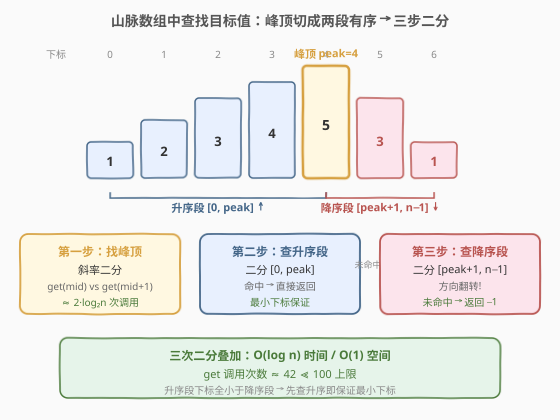
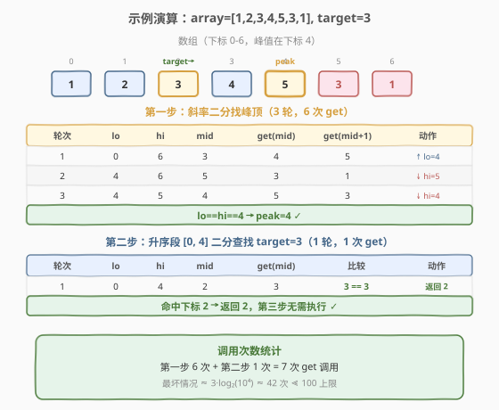

# LeetCode 山脉数组中查找目标值 题解

## 1. 题目概述

- **标题 / 题号**：山脉数组中查找目标值（#1095，hard）
- **链接**：https://leetcode.cn/problems/find-in-mountain-array/
- **难度**：困难
- **标签**：数组、二分查找、交互

**题意**：给定一个 **山脉数组** `mountainArr`（即存在唯一峰顶，峰顶左侧严格递增、右侧严格递减），以及一个目标值 `target`。要求在山脉数组中查找 `target`，若存在返回其**最小下标**，不存在返回 $-1$。

本题是**交互题**：不能直接访问整个数组，只能通过 `MountainArray` 接口的两个方法获取数据：

- `get(index)`：返回下标 `index` 处的元素值。
- `length()`：返回数组长度。

> ⚠️ **核心限制**：对 `get` 的调用次数有上限（**至多 100 次**），超过即判错。因此必须用 $O(\log n)$ 级别的调用次数完成查找，线性扫描 $O(n)$ 不可行。

**示例 1**：

```text
输入：array = [1,2,3,4,5,3,1], target = 3
输出：2
解释：3 出现在下标 2（升序段）和下标 5（降序段），返回最小下标 2。
```

**示例 2**：

```text
输入：array = [0,1,2,4,2,1], target = 3
输出：-1
解释：3 在数组中不存在。
```

**约束**：

- $3 \le \text{mountain\_arr.length()} \le 10^4$
- $0 \le \text{target} \le 10^9$
- $0 \le \text{mountain\_arr.get(index)} \le 10^9$
- 对 `get` 的调用次数不超过 100

> 💡 **关键直觉**：山脉数组虽然整体无序，但被峰顶切成**两段各自有序**的子数组——左段升序、右段降序。因此只需先定位峰顶（852 的斜率二分），再在两段分别做常规二分查找即可。三次二分叠加，调用次数 $\approx 3\log_2 n \approx 42 \ll 100$。

## 2. 解题思路

### 2.1 暴力思路：线性扫描

从下标 $0$ 到 $n-1$ 逐个调用 `get(i)`，与 `target` 比较，返回首个匹配下标。调用次数 $O(n)$，当 $n = 10^4$ 时约需 $10^4$ 次调用，远超 100 次上限，**必然判错**。

> ⚠️ 暴力的浪费在于：把山脉数组当成普通无序数组处理，完全没有利用「先增后减」的结构性。一旦意识到峰顶将数组切成两段有序区间，就能用二分把调用次数压到对数级。

### 2.2 核心观察：三步二分



山脉数组的结构性可以用三个性质刻画：

1. **唯一峰顶**：存在下标 $\text{peak}$，使左段 $[0, \text{peak}]$ 严格递增、右段 $[\text{peak}, n-1]$ 严格递减。
2. **峰顶可二分定位**：对任意 `mid`，比较 `get(mid)` 与 `get(mid+1)` 即可判定 `mid` 在上升坡还是下降坡（同 [852. 山脉数组的峰顶索引](../0801-0900/852_山脉数组的峰顶索引.md)），$O(\log n)$ 次调用锁定 `peak`。
3. **两段各自有序**：左段升序可做标准二分查找；右段降序做「翻转比较」的二分查找。

因此整体策略为**三步二分**：

> **第一步**（找峰顶）：斜率二分，在 $[0, n-1]$ 上比较 `get(mid)` 与 `get(mid+1)`，上升坡向右、下降坡向左，收敛到峰顶 $\text{peak}$。
>
> **第二步**（查升序段）：在 $[0, \text{peak}]$ 上做升序二分查找 `target`。若命中则**直接返回**（升序段下标更小，必然是最小下标）。
>
> **第三步**（查降序段）：若第二步未命中，在 $[\text{peak}+1, n-1]$ 上做降序二分查找 `target`。若命中返回该下标，否则返回 $-1$。

> 💡 **为什么先查升序段能保证最小下标？** 升序段的下标范围 $[0, \text{peak}]$ 全部小于降序段 $[\text{peak}+1, n-1]$ 的下标。若 `target` 出现在升序段，其下标必然小于降序段中任何出现的下标。因此升序段命中即可直接返回，无需再查降序段。

> ⚠️ **降序二分的方向翻转**：右段严格递减，`get(mid) > target` 时 `target` 更小、在 `mid` 右侧（值继续下降），故 `lo = mid + 1`；`get(mid) < target` 时 `target` 更大、在 `mid` 左侧，故 `hi = mid - 1`。与升序二分恰好相反，这是本题最易写反的地方。

### 2.3 算法流程图


**完整步骤**：

1. **找峰顶**：`lo = 0, hi = n - 1`，`while lo < hi`：`mid = lo + (hi-lo)/2`，若 `get(mid) < get(mid+1)` 则 `lo = mid + 1`（上升坡），否则 `hi = mid`（下降坡）。循环结束时 `peak = lo`。
2. **升序二分**：`lo = 0, hi = peak`，`while lo <= hi`：`mid = lo + (hi-lo)/2`，`val = get(mid)`。若 `val == target` 返回 `mid`；`val < target` 则 `lo = mid + 1`；`val > target` 则 `hi = mid - 1`。
3. **降序二分**：`lo = peak + 1, hi = n - 1`，`while lo <= hi`：`mid = lo + (hi-lo)/2`，`val = get(mid)`。若 `val == target` 返回 `mid`；`val > target` 则 `lo = mid + 1`（翻转！）；`val < target` 则 `hi = mid - 1`。
4. **未命中**：返回 $-1$。

> 💡 **调用次数预算**：$n \le 10^4$，$\log_2 10^4 \approx 14$。第一步每轮 2 次调用 $\approx 28$，第二、三步各 $\approx 14$，总计 $\approx 56$ 次，远低于 100 次上限。即使 $n$ 取到 $10^4$ 上限，仍有充足余量。

### 2.4 示例演算

以示例 1 `array = [1,2,3,4,5,3,1]`（$n = 7$，峰顶在下标 4）、`target = 3` 为例：



**第一步——斜率二分找峰顶**：

| 轮次 | lo | hi | mid | get(mid) | get(mid+1) | 斜率 | 动作 |
|------|----|----|-----|----------|------------|------|------|
| 1 | 0 | 6 | 3 | 4 | 5 | 上升 ↑ | `lo = mid+1 = 4` |
| 2 | 4 | 6 | 5 | 3 | 1 | 下降 ↓ | `hi = mid = 5` |
| 3 | 4 | 5 | 4 | 5 | 3 | 下降 ↓ | `hi = mid = 4` |
| 结束 | 4 | 4 | — | — | — | — | `peak = 4` ✓ |

**第二步——升序段 $[0, 4]$ 二分查找 `target = 3`**：

| 轮次 | lo | hi | mid | get(mid) | 比较 | 动作 |
|------|----|----|-----|----------|------|------|
| 1 | 0 | 4 | 2 | 3 | $3 == 3$ | 返回 2 ✓ |

`get(2) = 3 == target`，命中下标 2，直接返回。第三步无需执行。

> 💡 **若 `target = 1` 会怎样？** 升序段 $[0,4]$ 二分查找 1：`mid=2` 得 3 > 1 → `hi=1`；`mid=0` 得 1 == 1 → 返回 0。虽然 1 也出现在降序段下标 6，但升序段的下标 0 更小，先命中即返回，符合「最小下标」要求。

> 💡 **若 `target = 3` 但升序段没有呢？** 考虑 `array = [1,2,4,5,3,2,0]`、`target = 2`。升序段 $[0,3] = [1,2,4,5]$ 中二分查找 2 命中下标 1，返回。只有当 `target` 仅出现在降序段时（如 `target = 0` 仅在下标 6），升序段二分失败后才会进入第三步降序二分。

## 3. 参考代码

### C++

```cpp
/**
 * // This is MountainArray's API interface.
 * // You should not implement it, or speculate about its implementation
 * class MountainArray {
 *   public:
 *     int get(int index);
 *     int length();
 * };
 */

class Solution {
  public:
    int findInMountainArray(int target, MountainArray &mountainArr) {
        int n = mountainArr.length();

        // 第一步：斜率二分找峰顶
        int lo = 0, hi = n - 1;
        while (lo < hi) {
            int mid = lo + (hi - lo) / 2;
            if (mountainArr.get(mid) < mountainArr.get(mid + 1)) {
                lo = mid + 1;          // 上升坡：峰在右
            } else {
                hi = mid;              // 下降坡：峰在左含 mid
            }
        }
        int peak = lo;

        // 第二步：升序段 [0, peak] 二分查找
        lo = 0;
        hi = peak;
        while (lo <= hi) {
            int mid = lo + (hi - lo) / 2;
            int val = mountainArr.get(mid);
            if (val == target) return mid;
            else if (val < target) lo = mid + 1;
            else hi = mid - 1;
        }

        // 第三步：降序段 [peak+1, n-1] 二分查找
        lo = peak + 1;
        hi = n - 1;
        while (lo <= hi) {
            int mid = lo + (hi - lo) / 2;
            int val = mountainArr.get(mid);
            if (val == target) return mid;
            else if (val > target) lo = mid + 1;   // 递减：更小值在右
            else hi = mid - 1;                      // 更大值在左
        }

        return -1;
    }
};
```

### Python

```python
# """
# This is MountainArray's API interface.
# # You should not implement it, or speculate about its implementation
# """
# class MountainArray:
#    def get(self, index: int) -> int:
#    def length(self) -> int:

class Solution:
    def findInMountainArray(self, target: int, mountain_arr: 'MountainArray') -> int:
        n = mountain_arr.length()

        # 第一步：斜率二分找峰顶
        lo, hi = 0, n - 1
        while lo < hi:
            mid = (lo + hi) // 2
            if mountain_arr.get(mid) < mountain_arr.get(mid + 1):
                lo = mid + 1          # 上升坡：峰在右
            else:
                hi = mid              # 下降坡：峰在左含 mid
        peak = lo

        # 第二步：升序段 [0, peak] 二分查找
        lo, hi = 0, peak
        while lo <= hi:
            mid = (lo + hi) // 2
            val = mountain_arr.get(mid)
            if val == target:
                return mid
            elif val < target:
                lo = mid + 1
            else:
                hi = mid - 1

        # 第三步：降序段 [peak+1, n-1] 二分查找
        lo, hi = peak + 1, n - 1
        while lo <= hi:
            mid = (lo + hi) // 2
            val = mountain_arr.get(mid)
            if val == target:
                return mid
            elif val > target:        # 递减：更小值在右
                lo = mid + 1
            else:                      # 更大值在左
                hi = mid - 1

        return -1
```

> ⚠️ **降序二分的方向是最常见 bug**：升序段中 `val > target` 要向左找（`hi = mid - 1`），降序段中 `val > target` 要向**右**找（`lo = mid + 1`），因为降序段更大的值在左边、更小的值在右边。建议写完降序二分后用 `target` 仅出现在降序段的用例验证（如 `array = [0,5,3,1], target = 1`，应返回 3）。

## 4. 复杂度分析

| 维度 | 复杂度 | 说明 |
|------|--------|------|
| **时间复杂度** | $O(\log n)$ | 三次二分叠加：找峰顶 $O(\log n)$ + 升序二分 $O(\log n)$ + 降序二分 $O(\log n)$，总计 $O(\log n)$ |
| **空间复杂度** | $O(1)$ | 仅 `lo` / `hi` / `mid` / `peak` 等常数变量，无额外空间 |
| **`get` 调用次数** | $\le 3\lceil\log_2 n\rceil \approx 42$ | 找峰顶每轮 2 次调用（$\le 2\lceil\log_2 n\rceil$），两段二分各 $\le \lceil\log_2 n\rceil$ 次；$n = 10^4$ 时约 42 次，远低于 100 上限 |

> 💡 **调用次数精确上界**：设 $n = 10^4$，$\lceil\log_2 10^4\rceil = 14$。找峰顶最多 $2 \times 13 = 26$ 次（`lo < hi` 循环至多 $\lceil\log_2 n\rceil - 1$ 轮，每轮 2 次），升序二分至多 14 次，降序二分至多 14 次，总计 $\le 54$ 次。若加入 `get` 结果缓存（哈希表记录已查询下标），可进一步消除重复调用，但本题余量充足，无需缓存。

## 5. 扩展：调用次数优化与交互题范式

### 5.1 缓存 `get` 结果

找峰顶时，`get(mid+1)` 在下一轮可能成为 `get(mid)`，产生重复调用。可用哈希表缓存已查询的下标：

```cpp
unordered_map<int, int> cache;
auto cached_get = [&](int i) -> int {
    auto it = cache.find(i);
    if (it != cache.end()) return it->second;
    int v = mountainArr.get(i);
    cache[i] = v;
    return v;
};
```

缓存后最坏调用次数降至 $\approx \lceil\log_2 n\rceil + 1 \approx 15$ 次（找峰顶的 `mid` 与 `mid+1` 序列高度重叠）。本题 $n \le 10^4$ 时不缓存也远低于 100，但若题目将上限收紧到 20 次调用，缓存即为必须。

### 5.2 交互题的二分范式

1095 是**交互型二分**的典型：数据隐藏在接口后，核心约束是「查询次数」。同类题的共同解法是**将问题分解为若干次独立二分**，每次二分消耗 $O(\log n)$ 次查询：

- **单峰函数求极值**（三分查找）：如 [162. 寻找峰值](../0101-0200/162_寻找峰值.md)、[852. 山脉数组的峰顶索引](../0801-0900/852_山脉数组的峰顶索引.md)。
- **有序序列查找**：如 [704. 二分查找](../0701-0800/704_二分查找.md)。
- **复合结构**：本题将两者组合——先二分定位结构边界（峰顶），再在两段有序区间分别二分查找。

> 💡 **识别信号**：题目给出 `get(index)` / `query()` 式接口 + 查询次数上限 → 几乎一定是二分。思路是「我的算法能做多少次查询」反推「每次查询要排除多少搜索空间」，$100$ 次查询对应 $\log_2(\text{搜索空间}) \le 100$，即搜索空间可达 $2^{100}$，远超任何实际数据规模。

## 6. 面试要点

1. **为什么先查升序段就能保证返回最小下标？**

   - 升序段 $[0, \text{peak}]$ 的所有下标都小于降序段 $[\text{peak}+1, n-1]$ 的下标。若 `target` 在升序段出现，其下标必然严格小于降序段中的任何出现。因此升序段命中即可直接返回，无需再查降序段；只有升序段未命中时才进入降序段查找。

2. **降序二分和升序二分有什么区别？**

   - 唯一区别是比较后的收缩方向翻转。升序段中 `val > target` 表示 `target` 在左（更小值在左），`hi = mid - 1`；降序段中 `val > target` 表示 `target` 在**右**（降序段更小值在右），`lo = mid + 1`。等号判定和返回逻辑不变。这是本题最易写反的细节。

3. **三步二分各自用哪种循环模板？为什么不同？**

   - 找峰顶用 `while lo < hi`（`hi = mid` 不减 1）：这是「找满足条件的下标」型，`mid` 本身可能是峰顶需保留，`lo == hi` 时区间缩为一点直接返回。
   - 升/降序二分用 `while lo <= hi`（`hi = mid - 1`、`lo = mid + 1`）：这是「精确匹配值」型，命中即返回，未命中则排除 `mid` 后继续，`lo > hi` 表示搜索空间耗尽。两种模板对应不同语义，混用会出错。

4. **不缓存 `get` 结果，调用次数够吗？**

   - $n \le 10^4$，$\lceil\log_2 10^4\rceil = 14$。找峰顶至多 $2 \times 13 = 26$ 次，两段二分各至多 14 次，总计 $\le 54 \ll 100$，余量充足。缓存可进一步压到 $\approx 15$ 次，但本题非必需。

5. **如果山脉数组有多个峰（不保证唯一峰），还能用这套方法吗？**

   - 不能。多峰数组的「斜率二分」只能定位某个局部峰，无法保证该峰两侧整体有序。此时需退化为 [162. 寻找峰值](../0101-0200/162_寻找峰值.md) 的思路找局部峰，且峰两侧不一定单调，二分查找失效。本题的「三步二分」严格依赖**唯一峰**保证两段整体有序这一前提。

> 💡 **一句话总结**：1095 = 852（斜率二分找峰顶）+ 704（升序二分）+ 704 的镜像（降序二分）。三步 $O(\log n)$ 叠加，调用次数 $\approx 42 \ll 100$。核心难点是降序二分的方向翻转与两种二分模板的区分使用。

## 同类练习题

| # | 题目 | 与本题的关联 |
|---|------|-------------|
| 852 | [山脉数组的峰顶索引](https://leetcode.cn/problems/peak-index-in-a-mountain-array/)（[题解](../0801-0900/852_山脉数组的峰顶索引.md)） | 本题第一步的母题——斜率二分定位唯一峰顶，`arr[mid]` 与 `arr[mid+1]` 比较判方向 |
| 162 | [寻找峰值](https://leetcode.cn/problems/find-peak-element/)（[题解](../0101-0200/162_寻找峰值.md)） | 852 的泛化版——任意数组找任意局部峰，同套斜率二分但需 $-\infty$ 边界论证 |
| 704 | [二分查找](https://leetcode.cn/problems/binary-search/)（[题解](../0701-0800/704_二分查找.md)） | 一切二分的母题——有序数组精确匹配，本题第二、三步的标准模板 |
| 153 | [寻找旋转排序数组中的最小值](https://leetcode.cn/problems/find-minimum-in-rotated-sorted-array/)（[题解](../0101-0200/153_寻找旋转排序数组中的最小值.md)） | 同样「整体无序但局部有序」的结构——旋转点将数组切成两段升序，二分缩区间定位旋转点 |
| 33 | [搜索旋转排序数组](https://leetcode.cn/problems/search-in-rotated-sorted-array/) | 与本题同构的复合二分——先二分定位旋转点（结构边界），再在两段升序区间分别二分查找 `target` |
