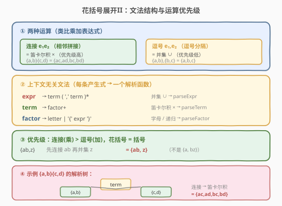
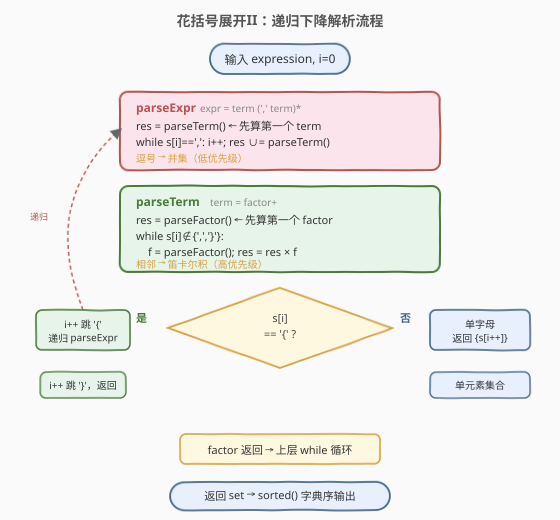
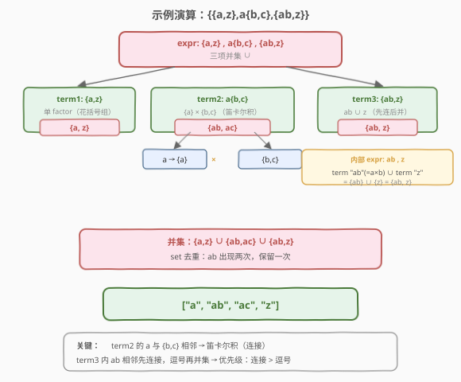

# LeetCode 花括号展开II 题解

## 1. 题目概述

- **标题 / 题号**：花括号展开II（#1096，hard）
- **链接**：https://leetcode.cn/problems/brace-expansion-ii/
- **难度**：困难
- **标签**：字符串、栈、递归下降解析、广度优先搜索

**题意**：给定一个由 **花括号** `{}`、**逗号** `,` 和 **小写字母** 组成的表达式，按以下语法规则展开成所有字符串：

| 规则 | 语义 | 示例 |
|------|------|------|
| 单一元素 `x` | $R(x) = \{x\}$ | `"a"` → `{"a"}` |
| 逗号分隔 `{e1,e2,…}` | $R(\{e_1,e_2,\dots\}) = R(e_1) \cup R(e_2) \cup \dots$（**并集**） | `"{a,b,c}"` → `{"a","b","c"}` |
| 相邻拼接 `e1 e2` | $R(e_1 + e_2) = \{a+b \mid a \in R(e_1), b \in R(e_2)\}$（**笛卡尔积**） | `"{a,b}{c,d}"` → `{"ac","ad","bc","bd"}` |
| 嵌套 | 表达式可任意嵌套，单字母与表达式也可拼接 | `"a{b,c}{d,e}f{g,h}"` → 8 个串 |

返回所有字符串组成的**有序（字典序）列表**，**去重**。

**示例 1**：

```text
输入：expression = "{a,b}{c,{d,e}}"
输出：["ac","ad","ae","bc","bd","be"]
解释：{a,b} = {a,b}；{c,{d,e}} = {c} ∪ {d,e} = {c,d,e}；笛卡尔积 = {a,b}×{c,d,e}
```

**示例 2**：

```text
输入：expression = "{{a,z},a{b,c},{ab,z}}"
输出：["a","ab","ac","z"]
解释：{a,z} ∪ a{b,c} ∪ {ab,z} = {a,z} ∪ {ab,ac} ∪ {ab,z} = {a,ab,ac,z}（去重后）
```

**约束**：

- $1 \leq \text{expression.length} \leq 60$
- `expression[i]` 由 `{`、`}`、`,` 或小写字母组成
- 表达式基于上述语法规则构造（合法输入）

> 💡 关键点：与 [1087. 花括号展开](../1001-1100/1087_花括号展开.md) 相比，本题多了两个特性——**花括号可嵌套**、**逗号可在花括号外表示并集**。1087 的线性扫描模板不再适用，需要更通用的解析方法。

## 2. 解题思路

### 2.1 朴素思路：能否复用 1087 的线性扫描？

[1087](../1001-1100/1087_花括号展开.md) 的做法是线性扫描：遇到 `{` 收集括号内字母作为一个**选项组**，单字母也归一化为一组，最后做笛卡尔积。但 1096 有两个 1087 不具备的特性：

1. **嵌套**：花括号可任意嵌套（`{a,{b,c}}`），线性扫描无法处理未知深度的括号嵌套。
2. **顶层并集**：逗号不仅出现在花括号内分隔选项（`{a,b}`），还能出现在花括号外表示集合并集（`{a,b},{b,c}`）。

因此直接套用「分组 + 笛卡尔积」模板会失败。需要一种能同时处理**嵌套**和**两种运算**的解析方法。

> ⚠️ 1087 的逗号**只在花括号内**分隔同组选项，结构是纯笛卡尔积；1096 的逗号还在花括号外表示并集，且支持嵌套，必须区分「乘」（相邻连接）与「加」（逗号并集）两种运算及其优先级。

### 2.2 核心观察：文法结构 + 递归下降解析



关键观察：整个表达式遵循一个**上下文无关文法**，只有两种运算——

- **连接**（隐式，相邻即连接）：对应**笛卡尔积**，优先级**高**（类比算术中的「乘法」）
- **并集**（逗号分隔）：对应**集合并集**，优先级**低**（类比算术中的「加法」）
- **花括号** `{}`：改变运算分组（类比算术中的「括号」），内部是一个完整的子表达式

形式化文法如下（每个非终结符返回一个**字符串集合**）：

$$
\begin{aligned}
\text{expr} &\to \text{term}\ (\text{','}\ \text{term})^* && \text{并集（逗号，低优先级）} \\
\text{term} &\to \text{factor}^+ && \text{连接（笛卡尔积，高优先级）} \\
\text{factor} &\to \text{letter} \mid \text{'\{'}\ \text{expr}\ \text{'\}'} && \text{单字母或花括号分组}
\end{aligned}
$$

这本质就是一道**「乘加表达式求值」**题——连接是「乘」，逗号是「加」，花括号是「括号」，字母是「操作数」（值为单元素集合）。因此可以用**递归下降解析**：三个函数 `parseExpr` / `parseTerm` / `parseFactor` 分别对应三条产生式，每个函数返回一个 `set<string>`。

> 💡 **一句话**：把花括号展开 II 当成「集合版的乘加表达式求值」——连接=乘（笛卡尔积），逗号=加（并集），用递归下降三函数解析，每个函数返回字符串集合。

**三个函数的职责**：

| 函数 | 对应产生式 | 运算 | 返回值 |
|------|-----------|------|--------|
| `parseExpr` | `term (',' term)*` | 并集 $\cup$ | 所有 term 的并集 |
| `parseTerm` | `factor+` | 笛卡尔积 $\times$ | 所有 factor 的笛卡尔积 |
| `parseFactor` | `letter \| '{' expr '}'` | — | `{字母}` 或递归求 `expr` |

### 2.3 算法流程图



```text
parseExpr(s, i):                         # expr = term (',' term)*
  res = parseTerm(s, i)                   # 先解析第一个 term
  while s[i] == ',':
    i += 1                                # 跳过逗号
    res ∪= parseTerm(s, i)                # 并集：合并下一个 term
  return res

parseTerm(s, i):                         # term = factor+
  res = parseFactor(s, i)                 # 先解析第一个 factor
  while s[i] ∉ {',', '}'}:                # 不是逗号/右括号 → 还有相邻 factor
    f = parseFactor(s, i)                 # 解析下一个 factor
    res = {a+b for a∈res for b∈f}         # 笛卡尔积
  return res

parseFactor(s, i):                       # factor = letter | '{' expr '}'
  if s[i] == '{':
    i += 1                                # 跳过 '{'
    res = parseExpr(s, i)                 # 递归解析内部表达式
    i += 1                                # 跳过 '}'
    return res
  else:
    return {s[i++]}                       # 单字母 → 单元素集合
```

> 💡 优先级由**调用层次**天然保证：`parseExpr` 调 `parseTerm`（先算连接/乘法），再在逗号处并集（后算加法）；`parseFactor` 遇 `{` 递归回 `parseExpr`（括号提升优先级）。无需显式建优先级表。

### 2.4 示例演算



以示例 2 `{{a,z},a{b,c},{ab,z}}` 为例，递归下降的求值过程如下（自底向上标注每步返回的集合）：

| 步骤 | 子表达式 | 调用 | 返回集合 | 说明 |
|------|---------|------|---------|------|
| ① | `{a,z}` | parseFactor→parseExpr | $\{a, z\}$ | 内部 `a,z` 并集 |
| ② | `{a,z}` (外层第1项) | parseTerm→parseFactor | $\{a, z\}$ | 单 factor，原样返回 |
| ③ | `a{b,c}` (第2项) | parseTerm | $\{ab, ac\}$ | factor `a`×factor `{b,c}` |
| ④ | `{ab,z}` (第3项) | parseTerm | $\{ab, z\}$ | factor `{ab,z}`：内部 `ab` 连接、`,z` 并集 |
| ⑤ | 外层 `{...}` | parseExpr | $\{a,z\} \cup \{ab,ac\} \cup \{ab,z\}$ | 三项并集 |
| ⑥ | 去重 + 排序 | — | `["a","ab","ac","z"]` | set 去重，sorted 字典序 |

> ⚠️ 注意步骤④：`{ab,z}` 内部 `ab` 是两个相邻字母（连接→`{ab}`），逗号后 `z` 是并集，故结果 $\{ab, z\}$ 而非 $\{abz\}$。这正是「连接优先级高于逗号」的体现。

## 3. 参考代码

### C++（递归下降解析）

```cpp
class Solution {
public:
    vector<string> braceExpansionII(string expression) {
        int i = 0, n = expression.size();
        set<string> res = parseExpr(expression, i, n);
        return vector<string>(res.begin(), res.end());
    }

private:
    set<string> parseExpr(const string& s, int& i, int n) {
        set<string> res = parseTerm(s, i, n);
        while (i < n && s[i] == ',') {
            i++;
            set<string> t = parseTerm(s, i, n);
            res.insert(t.begin(), t.end());
        }
        return res;
    }

    set<string> parseTerm(const string& s, int& i, int n) {
        set<string> res = parseFactor(s, i, n);
        while (i < n && s[i] != ',' && s[i] != '}') {
            set<string> f = parseFactor(s, i, n);
            set<string> tmp;
            for (const string& a : res)
                for (const string& b : f)
                    tmp.insert(a + b);
            res = tmp;
        }
        return res;
    }

    set<string> parseFactor(const string& s, int& i, int n) {
        if (s[i] == '{') {
            i++;
            set<string> res = parseExpr(s, i, n);
            i++;
            return res;
        }
        return {string(1, s[i++])};
    }
};
```

### Python（递归下降解析）

```python
class Solution:
    def braceExpansionII(self, expression: str) -> List[str]:
        i, n = 0, len(expression)

        def parse_expr():
            nonlocal i
            res = parse_term()
            while i < n and expression[i] == ',':
                i += 1
                res |= parse_term()
            return res

        def parse_term():
            nonlocal i
            res = parse_factor()
            while i < n and expression[i] not in ',}':
                nxt = parse_factor()
                res = {a + b for a in res for b in nxt}
            return res

        def parse_factor():
            nonlocal i
            if expression[i] == '{':
                i += 1
                res = parse_expr()
                i += 1
                return res
            ch = expression[i]
            i += 1
            return {ch}

        return sorted(parse_expr())
```

> 💡 代码要点：① `parseExpr` / `parseTerm` / `parseFactor` 一一对应文法三条产生式，结构清晰；② 全程用 `set` 存储中间结果，天然去重；③ C++ `set<string>` 有序，构造 `vector` 时已是字典序，无需再 `sort`；Python 用 `sorted()` 最后排序。④ `i` 以引用/`nonlocal` 传递，三个函数共享游标，扫描一遍即可。

## 4. 复杂度分析

设 $|s|$ 为表达式长度，$N$ 为最终输出字符串总数，$L$ 为最长字符串长度（$L \leq |s|$）。

| 维度 | 复杂度 | 说明 |
|------|--------|------|
| **时间** | $O(N \cdot L \cdot \log N)$ | 笛卡尔积生成 $N$ 个长 $L$ 的串；`set` 插入去重每次 $O(L\log M)$；最终排序 $O(N \log N \cdot L)$。$N$ 最坏指数级（如 $k$ 个 `{a,b}` 连接 → $2^k$ 个串），但 $|s| \leq 60$ 时 $N$ 有上界 |
| **空间** | $O(N \cdot L)$ | `set` 存所有输出串 + 递归栈 $O(|s|)$（嵌套深度 $\leq |s|$），被输出主导 |

> 💡 与 1087 对照：1087 无嵌套无顶层并集，线性扫描 $O(|s| + m \cdot N)$ 即可；1096 需递归下降，多了 $\log$ 因子来自 `set` 去重。若能保证无重复可换 `vector` + 末尾排序，但本题并集天然产生重复（如示例 2 的 `ab`），`set` 去重更稳妥。

## 5. 扩展：栈解法（迭代）

递归下降用调用栈处理嵌套，也可以用一个**显式栈**模拟。思路是逐字符扫描，遇到字母/`}` 时检查栈顶是否为集合——若是则做**笛卡尔积**（处理相邻连接）；遇到 `}` 时弹栈到 `{`，把逗号分隔的集合做**并集**。

```python
class Solution:
    def braceExpansionII(self, expression: str) -> List[str]:
        stack = []

        def concat(s1, s2):
            return {a + b for a in s1 for b in s2}

        for ch in expression:
            if ch in '{,':
                stack.append(ch)                      # 标记符入栈
            elif ch != '}':
                cur = {ch}                            # 单字母 → 集合
                if stack and isinstance(stack[-1], set):
                    cur = concat(stack.pop(), cur)    # 相邻连接：笛卡尔积
                stack.append(cur)
            else:  # ch == '}'
                cur = set()
                while stack[-1] != '{':               # 弹到 '{'，并集逗号分隔的集合
                    top = stack.pop()
                    if isinstance(top, set):
                        cur |= top
                        if stack and stack[-1] == ',':
                            stack.pop()               # 弹掉逗号
                stack.pop()                           # 弹掉 '{'
                if stack and isinstance(stack[-1], set):
                    cur = concat(stack.pop(), cur)    # 与左邻集合连接
                stack.append(cur)

        result = set()
        for item in stack:                            # 栈中残留集合做最终并集
            if isinstance(item, set):
                result |= item
        return sorted(result)
```

> 💡 栈解法与递归下降等价，区别在于：递归下降用**函数调用栈**处理嵌套（更直观、贴近文法），栈解法用**显式数据栈**（避免递归深度限制，但连接/并集的处理逻辑分散在多处）。面试中推荐先写递归下降（易讲清优先级），再提栈解法作为迭代替代。

## 6. 面试要点

**Q1：为什么连接的优先级高于逗号？**

> 由题目语义决定。看 `{ab,z}`：`ab` 相邻即连接为 `ab`，逗号才表示并集。若逗号优先级更高，`ab,z` 会被解读为 `a` ∪ `b,z`，语义错误。实际上连接类比乘法、逗号类比加法——乘法优先级高于加法是自然约定，题目用 `a{b,c}`（`a` 与 `{b,c}` 连接而非并集）也印证了这一点。

**Q2：递归下降如何保证运算优先级？**

> 通过**调用层次**。`parseExpr` 先调用 `parseTerm` 把所有相邻 factor 连接（乘法）算完，再在逗号处并集（加法）。`parseFactor` 遇 `{` 递归回 `parseExpr`，括号内的整体先算完再参与外层运算。这种「低优先级函数调高优先级函数」的结构天然保证优先级，无需显式优先级表或运算符栈。

**Q3：为什么要全程用 set 而非 vector？**

> 并集运算天然产生重复。如示例 2 `{{a,z},a{b,c},{ab,z}}` 中 `ab` 出现在 `{ab,ac}` 和 `{ab,z}` 两处，并集后需去重。用 `set` 在插入时去重，避免末尾额外 `unique` 处理。C++ `set<string>` 还自带有序性，省去最终排序。代价是插入 $O(L\log M)$，但本题规模下可接受。

**Q4：parseTerm 的 while 循环条件为什么是 `s[i] != ',' && s[i] != '}'`？**

> term 由相邻 factor 连接而成，当遇到逗号（说明进入并集，属于 `parseExpr`）或右括号（说明当前花括号组结束）时，term 解析完成。其余字符（字母或 `{`）都意味着下一个 factor 开始，继续连接。这保证了连接只作用于「真正相邻」的 factor，不会越界吞掉逗号/括号。

**Q5：本题与 1087 的本质区别是什么？**

> 1087 是**纯笛卡尔积**：逗号只在花括号内分隔同组选项，花括号不嵌套，线性扫描分组即可。1096 是**乘加表达式**：引入了嵌套（需递归/栈）和顶层并集（逗号有两种语义），必须用递归下降或栈区分连接与并集的优先级。可以说 1087 是 1096 的「无嵌套、无顶层并集」特例。

## 同类练习题

| # | 题目 | 与本题的关联 |
|---|------|-------------|
| 1087 | [花括号展开](https://leetcode.cn/problems/brace-expansion/)（[题解](../1001-1100/1087_花括号展开.md)） | 无嵌套、无顶层并集的特例，线性扫描 + 笛卡尔积即可，是本题的最佳入门对照 |
| 224 | [基本计算器](https://leetcode.cn/problems/basic-calculator/)（[题解](../0201-0300/224_基本计算器.md)） | 经典「加减表达式 + 括号」求值，与本题的「并集(加) + 连接(乘) + 花括号(括号)」结构同构，递归下降 / 栈两种解法完全对应 |
| 227 | [基本计算器 II](https://leetcode.cn/problems/basic-calculator-ii/) | 「乘除优先于加减」的双优先级表达式求值，对照理解本题连接(乘)与逗号(加)的优先级处理 |
| 394 | [字符串解码](https://leetcode.cn/problems/decode-string/) | 嵌套括号 + 栈处理，对照「显式栈处理嵌套结构」的思路 |
| 17 | [电话号码的字母组合](https://leetcode.cn/problems/letter-combinations-of-a-phone-number/)（[题解](../0001-0100/17_电话号码的字母组合.md)） | 逐位选取做笛卡尔积，是本题「连接=笛卡尔积」运算的单点对照 |
