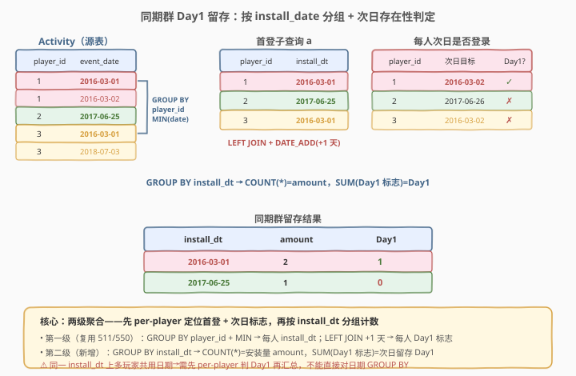
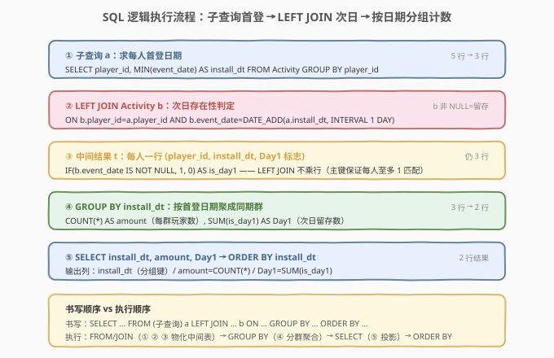
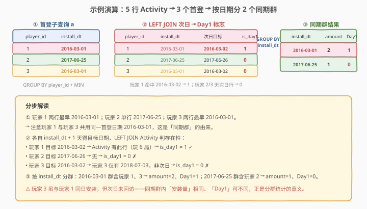

# 游戏玩法分析 V

- **题目名称**：游戏玩法分析 V
- **链接**：[1097. 游戏玩法分析 V](https://leetcode.cn/problems/game-play-analysis-v/)
- **难度**：困难
- **标签**：SQL、数据库、留存分析、子查询、LEFT JOIN、DATE_ADD、GROUP BY、聚合、同期群

> ⚠️ **注意**：本题是 LeetCode 数据库（SQL）类题目，在 leetcode.cn 上为 **Plus 会员专享题**，[leetcode.com](https://leetcode.com/problems/game-play-analysis-v/) 同样为付费题。本文代码部分使用 SQL（及 pandas 对照）而非 C++/Python。

## 1. 题目概述

给定 `Activity` 表（结构与 [511. 游戏玩法分析 I](../0501-0600/511_游戏玩法分析I.md)、[512. 游戏玩法分析 II](../0501-0600/512_游戏玩法分析II.md)、[534. 游戏玩法分析 III](../0501-0600/534_游戏玩法分析III.md)、[550. 游戏玩法分析 IV](../0501-0600/550_游戏玩法分析IV.md) 完全相同），每行记录一名玩家在某个日期使用某台设备登录并玩过若干局游戏。我们定义 **安装日期（install date）** 为玩家的首次登录日期。编写 SQL 查询，**按安装日期分组**报告：每个安装日期上当**天安装的玩家数**（`amount`），以及其中在**安装后次日**再次登录的玩家数（`Day1`）。

**表结构**：

```text
Table: Activity
+--------------+---------+
| Column Name  | Type    |
+--------------+---------+
| player_id    | int     |  ← 主键之一
| device_id    | int     |
| event_date   | date    |  ← 主键之一
| games_played | int     |
+--------------+---------+
(player_id, event_date) 是该表的复合主键。
```

> 💡 **与 550 的差异**：[550. 游戏玩法分析 IV](../0501-0600/550_游戏玩法分析IV.md) 把全部玩家视为一个整体，算**一个全局**次日留存比率（标量 `0.33`）。本题把玩家**按首登日期分成若干同期群（cohort）**，对每个安装日期各算一组 `amount` / `Day1`——输出是一张**多行**的同期群留存表。从「全局留存率」到「分群留存表」，正是留存分析从单值指标走向按日维度拆解的升级。

**示例 1**：

```text
输入：
Activity 表:
+-----------+-----------+------------+--------------+
| player_id | device_id | event_date | games_played |
+-----------+-----------+------------+--------------+
| 1         | 2         | 2016-03-01 | 5            |
| 1         | 2         | 2016-03-02 | 6            |
| 2         | 3         | 2017-06-25 | 1            |
| 3         | 1         | 2016-03-01 | 0            |
| 3         | 4         | 2018-07-03 | 5            |
+-----------+-----------+------------+--------------+

输出：
+-------------+--------+------+
| install_dt  | amount | Day1 |
+-------------+--------+------+
| 2016-03-01  | 2      | 1    |
| 2017-06-25  | 1      | 0    |
+-------------+--------+------+
```

**解释**：

- 玩家 1 首登 `2016-03-01`，次日 `2016-03-02` 有登录记录 → **Day1 留存** ✓
- 玩家 2 首登 `2017-06-25`，次日 `2017-06-26` 无记录 → 未留存 ✗
- 玩家 3 首登 `2016-03-01`，次日 `2016-03-02` 无记录（其另一行是 `2018-07-03`，非次日）→ 未留存 ✗

按 `install_dt` 分群：

| install_dt | 同群玩家 | amount | Day1（次日回访者） |
|------------|----------|--------|--------------------|
| 2016-03-01 | 1, 3     | 2      | 1（仅玩家 1）      |
| 2017-06-25 | 2        | 1      | 0                  |

**约束条件**：

- `Activity` 表的复合主键为 `(player_id, event_date)`——同一玩家同一天不会有两条记录。
- 一个玩家可能只有一次登录（首登即末登），此时次日必无记录，`Day1 = 0`。
- 结果含三列 `install_dt`、`amount`、`Day1`，可按任意顺序返回（下文代码按 `install_dt` 升序输出以便阅读）。

> 💡 本题是 SQL **同期群留存分析**的母题——它把「求首登日期 + 判定次日是否回访 + 按首登日期分群计数」这条工业级留存分析管线压缩在一个查询里。掌握了 `GROUP BY + MIN` 子查询 + `LEFT JOIN` + `DATE_ADD` + 二次 `GROUP BY`，所有「按安装日期/注册日的 N 日留存表」类业务需求都能直接迁移。

---

## 2. 解题思路

### 2.1 暴力思路：过程式逐玩家再逐群统计

最直觉的做法是用过程式语言两遍处理：

```text
# 第一遍：算每人首登 + 次日是否回访
for each player_id in DISTINCT(player_id):
    d0 = MIN(event_date of player_id)
    is_day1 = EXISTS(event_date == d0 + 1 day for player_id)
    record (player_id, d0, is_day1)

# 第二遍：按首登日期分群汇总
for each d0 group:
    amount = count of players in group
    Day1   = count of players with is_day1 == 1
    emit (d0, amount, Day1)
```

但**纯 SQL 没有显式循环与变量**——SQL 的思维是「集合 + 声明式」。上述「每人算首登与次日标志 → 按首登日期分群 → 计数」的两级聚合管线，在 SQL 里对应两个嵌套的 `GROUP BY`：第一级 `GROUP BY player_id` 算每人首登（并借 `LEFT JOIN` 附加次日标志），第二级 `GROUP BY install_dt` 把人均行聚成同期群行。

> ⚠️ 关键转换：本题是 **550 的留存判定 × 511 的首登定位 × 二次 GROUP BY 分群** 的复合。难点不在任一单个构件，而在把「per-player 的次日标志」**正确地汇入 per-安装日期 的分群聚合**——必须先 per-player 判定 Day1，再按 `install_dt` 分组求和，顺序不可颠倒。

### 2.2 核心观察：两级聚合——先 per-player 定位，再 per-date 分群



本题可拆成**两级聚合**：

| 级别 | 粒度 | SQL 手段 | 产出 |
|------|------|----------|------|
| 第一级 | **每个玩家**一行 | 子查询 `GROUP BY player_id` + `MIN(event_date)` 算首登；`LEFT JOIN` + `DATE_ADD(+1 天)` 判次日存在性 | `(player_id, install_dt, is_day1)` |
| 第二级 | **每个安装日期**一行 | `GROUP BY install_dt` + `COUNT(*)` + `SUM(is_day1)` | `(install_dt, amount, Day1)` |

**为什么不能直接对 `event_date` 分组？** 因为「安装日期」不是源表里的现成列，而是每个玩家 `MIN(event_date)` 的结果——同一个 `event_date` 上，既可能有「这天首登的玩家」，也可能有「这天回访的老玩家」。直接 `GROUP BY event_date` 会把两类行混在一起，`amount` 与 `Day1` 都会错。必须**先按玩家求出首登日期**，把每个玩家归一到唯一一个 `install_dt`，再对这个归一后的列分群。

**关键陷阱与对策**：

- **`amount` = 同群玩家数**：第一级子查询保证每个玩家恰好一行（一个 `install_dt`），所以第二级 `COUNT(*)` 就是该安装日期上的安装人数。`COUNT(*)` 不会因 `LEFT JOIN` 而膨胀——`(player_id, event_date)` 主键保证每个 `(player_id, install_dt+1天)` 至多匹配一行 `Activity`，左表行不被乘开。
- **`Day1` = 同群中次日回访人数**：`LEFT JOIN` 匹配上则 `b.event_date` 非 NULL（回访），未匹配则 NULL（未回访）。用 `SUM(IF(b.event_date IS NOT NULL, 1, 0))` 把「是否回访」转成 0/1 指示变量再求和，即得留存人数。

$$\text{amount}(d) = \#\{p \mid \text{install\_dt}(p) = d\}, \qquad \text{Day1}(d) = \#\{p \mid \text{install\_dt}(p) = d \,\land\, \exists\, r.\text{event\_date} = d+1\text{天}\}$$

> 💡 **为什么用 `LEFT JOIN` 而非 `INNER JOIN`**：与 550 同理——`INNER JOIN` 只保留「次日匹配上的行」，会把未回访玩家整行丢掉，导致 `amount` 塌缩成回访人数、`Day1` 恒等于 `amount`。`LEFT JOIN` 保留左表（首登子查询）的每一行，未回访玩家在右表列填 `NULL`——`COUNT(*)` 仍数全部安装者、`SUM(IF(... IS NOT NULL,...))` 只数回访者，二者才各自正确。

### 2.3 算法流程图



**逻辑执行顺序**（注意 SQL 书写顺序与执行顺序的差异）：

| 步骤 | 子句 | 作用 |
|------|------|------|
| ① | `FROM (SELECT player_id, MIN(event_date) ... GROUP BY player_id) a` | 子查询：每人首登日期，结果每人一行（复用 511 范式） |
| ② | `LEFT JOIN Activity b ON ... DATE_ADD(a.install_dt, INTERVAL 1 DAY)` | 次日存在性判定：对齐上则 `b` 非 NULL |
| ③ | 中间结果 `t` | 每人一行 `(player_id, install_dt, b.event_date)`，`b.event_date` NULL 即未回访 |
| ④ | `GROUP BY a.install_dt` | 按首登日期聚成同期群 |
| ⑤ | `COUNT(*) AS amount, SUM(IF(b.event_date IS NOT NULL,1,0)) AS Day1` | 投影：安装量 + 次日留存数 |

> 💡 与 550 的根本区别：550 在步骤 ④ 用 `COUNT(b)/COUNT(a)` 算一个**全局比率**（不分群、输出 1 行）；本题在步骤 ④ `GROUP BY install_dt` 算**每个安装日期一组的 amount 与 Day1**（分群、输出多行）。前者是「全表压成一个标量」，后者是「按日期维度拆成一张表」。

### 2.4 示例演算



以示例数据为例，观察两级聚合如何把 5 行原表压缩成 2 行同期群留存表：

**第 ① 步：子查询求首登日期**（`GROUP BY + MIN`，5 行压成 3 行）

| player_id | install_dt（MIN event_date） |
|-----------|------------------------------|
| 1 | 2016-03-01 |
| 2 | 2017-06-25 |
| 3 | 2016-03-01 |

> 💡 玩家 1 与玩家 3 共享同一首登日期 `2016-03-01`——这正是「同期群」的由来：同日安装的玩家被归入同一群，便于对比不同群落的留存表现。

**第 ② 步：LEFT JOIN 次日存在性判定**（`DATE_ADD(install_dt, INTERVAL 1 DAY)` 作为目标日期）

| player_id | install_dt | 次日目标 | Activity 是否存在 | is_day1 |
|-----------|------------|----------|-------------------|---------|
| 1 | 2016-03-01 | 2016-03-02 | ✓ 存在（玩家 1 有此行，玩 6 局） | 1 |
| 2 | 2017-06-25 | 2017-06-26 | ✗ 不存在 | 0 |
| 3 | 2016-03-01 | 2016-03-02 | ✗ 玩家 3 仅有 2018-07-03，非次日 | 0 |

**第 ③ 步：按 install_dt 分群汇总**

| install_dt | 同群 player_id | COUNT(*) = amount | SUM(is_day1) = Day1 |
|------------|----------------|-------------------|---------------------|
| 2016-03-01 | 1, 3 | 2 | 1 |
| 2017-06-25 | 2 | 1 | 0 |

> ⚠️ **玩家 3 的陷阱**：它与玩家 1 同日安装（`2016-03-01`），但次日 `2016-03-02` 未回访——其另一行 `2018-07-03` 距首登两年多，绝非「次日」。`DATE_ADD` 严格只匹配 `+1` 天的那一天，任何更晚的日期都不算 Day1 留存。这说明同期群内「安装量」相同、「Day1」可不同——分群统计的意义正在于此：把同日安装的玩家放在一起，观察他们后续行为的差异。

---

## 3. 参考代码

### SQL（解法 A：子查询 + LEFT JOIN + GROUP BY，推荐）

```sql
SELECT
    a.install_dt,
    COUNT(*) AS amount,
    SUM(IF(b.event_date IS NOT NULL, 1, 0)) AS Day1
FROM (
    SELECT player_id, MIN(event_date) AS install_dt
    FROM Activity
    GROUP BY player_id
) a
LEFT JOIN Activity b
    ON b.player_id = a.player_id
    AND b.event_date = DATE_ADD(a.install_dt, INTERVAL 1 DAY)
GROUP BY a.install_dt
ORDER BY a.install_dt;
```

> 💡 **写法要点**：
> - 子查询 `a` 复用 511 的 `GROUP BY + MIN` 求每人首登日期——每人恰好一行，`install_dt` 唯一。
> - `LEFT JOIN` 连接条件用 `DATE_ADD(a.install_dt, INTERVAL 1 DAY)` 把首登日期往后推 1 天得目标日期，与原表 `event_date` 等值匹配。复合主键 `(player_id, event_date)` 保证每个左表行至多匹配 1 行右表行，故 `COUNT(*)` 不被乘开，等于该安装日期上的安装人数。
> - `SUM(IF(b.event_date IS NOT NULL, 1, 0))` 把「次日是否回访」转成 0/1 指示变量再求和，即同群中次日回访人数。`IF` 是 MySQL 语法糖，标准写法为 `CASE WHEN b.event_date IS NOT NULL THEN 1 ELSE 0 END`。
> - `GROUP BY a.install_dt` 把人均行聚成同期群行；`ORDER BY a.install_dt` 仅便于阅读，题目允许任意顺序。

### SQL（解法 B：COUNT(非NULL) 写法，免指示变量）

```sql
SELECT
    install_dt,
    COUNT(player_id) AS amount,
    COUNT(next_date) AS Day1
FROM (
    SELECT a.player_id,
           a.install_dt,
           b.event_date AS next_date
    FROM (
        SELECT player_id, MIN(event_date) AS install_dt
        FROM Activity
        GROUP BY player_id
    ) a
    LEFT JOIN Activity b
        ON b.player_id = a.player_id
        AND b.event_date = DATE_ADD(a.install_dt, INTERVAL 1 DAY)
) t
GROUP BY install_dt
ORDER BY install_dt;
```

> 💡 **`COUNT(列)` 数非 NULL 的特性**：`COUNT(next_date)` 等价于「数 `b.event_date` 非 NULL 的行」= 次日回访人数；`COUNT(player_id)` 数左表全部行（`a.player_id` 恒非 NULL）= 安装人数。这与解法 A 的 `COUNT(*)` + `SUM(IF(...))` 数学等价，但语义更贴近 550 的 `COUNT(b.player_id)/COUNT(a.player_id)` 写法。多包一层子查询 `t` 是为了让外层 `GROUP BY` 直接引用 `install_dt`、`next_date` 两个别名（部分引擎不允许在 `GROUP BY` 里直接引用 `SELECT` 别名，包一层更通用）。

### SQL（解法 C：EXISTS 相关子查询，无 JOIN）

```sql
SELECT
    install_dt,
    COUNT(*) AS amount,
    SUM(is_day1) AS Day1
FROM (
    SELECT
        a.player_id,
        a.install_dt,
        IF(EXISTS(
            SELECT 1 FROM Activity b
            WHERE b.player_id = a.player_id
              AND b.event_date = DATE_ADD(a.install_dt, INTERVAL 1 DAY)
        ), 1, 0) AS is_day1
    FROM (
        SELECT player_id, MIN(event_date) AS install_dt
        FROM Activity
        GROUP BY player_id
    ) a
) t
GROUP BY install_dt
ORDER BY install_dt;
```

> 💡 **EXISTS 写法**：不显式 JOIN，用相关子查询 `EXISTS(...)` 逐玩家判定次日是否存在记录——「存在即回访」。语义最直观（「存在即留存」），但每个玩家触发一次子查询，MySQL 优化器通常将其改写为半连接（semi-join）以避免逐行执行。注意 `EXISTS` 必须在**第一级子查询 `t` 内部**完成（per-player 判定），外层才能安全 `GROUP BY install_dt`——不能把 `EXISTS` 直接写到 `GROUP BY` 之后的 `SELECT` 里（分组后 `player_id` 不再是分组键，无法逐行引用）。

### Python（pandas）

```python
import pandas as pd

def gameplay_analysis(activity: pd.DataFrame) -> pd.DataFrame:
    activity['event_date'] = pd.to_datetime(activity['event_date'])
    install = (
        activity.groupby('player_id', as_index=False)['event_date']
        .min()
        .rename(columns={'event_date': 'install_dt'})
    )
    install['next_day'] = install['install_dt'] + pd.Timedelta(days=1)
    merged = install.merge(
        activity[['player_id', 'event_date']],
        left_on=['player_id', 'next_day'],
        right_on=['player_id', 'event_date'],
        how='left',
    )
    merged['is_day1'] = merged['event_date'].notna().astype(int)
    res = (
        merged.groupby('install_dt', as_index=False)
        .agg(amount=('player_id', 'size'), Day1=('is_day1', 'sum'))
        .sort_values('install_dt')
        .reset_index(drop=True)
    )
    res['install_dt'] = res['install_dt'].dt.date
    return res
```

> 💡 **pandas 对照**：`groupby('player_id')['event_date'].min()` 对应子查询 `GROUP BY + MIN`；`+ pd.Timedelta(days=1)` 对应 `DATE_ADD(..., INTERVAL 1 DAY)`；`merge(how='left')` 对应 `LEFT JOIN`（左表 `install` 每行至多匹配一行 `activity`，不乘行）；`notna().astype(int)` 对应 `IF(... IS NOT NULL, 1, 0)` 指示变量；第二级 `groupby('install_dt').agg(amount=('player_id','size'), Day1=('is_day1','sum'))` 对应 `GROUP BY install_dt` + `COUNT(*)` + `SUM(is_day1)`。`dt.date` 把 `datetime64` 转回 `date` 以匹配题目输出类型。

---

## 4. 复杂度分析

| 维度 | 复杂度 | 说明 |
|------|--------|------|
| **时间** | $O(n \log n)$ | $n$ = `Activity` 行数。第一级子查询 `GROUP BY + MIN` 分组 $O(n)$~$O(n \log n)$（主键索引近似 $O(n)$）；`LEFT JOIN` 在 `(player_id, event_date)` 主键上等值匹配，每人至多一次 $O(\log n)$，总计 $O(k \log n)$，$k$ = 玩家数 $\le n$；第二级 `GROUP BY install_dt` 对 $k$ 行分组 $O(k \log k)$。整体由第一级分组主导 |
| **空间** | $O(k)$ | 第一级子查询中间结果每人一行 $O(k)$；JOIN 结果同样 $O(k)$ 行（不乘行）；第二级结果 $O(d)$ 行，$d$ = 不同安装日期数 $\le k$ |
| **结果行数** | $O(d)$ | 每个安装日期一行，$d$ = 不同 `install_dt` 数量 |

> ⚠️ 本题代价略高于 550——550 输出一个标量（$O(1)$ 行），本题输出一张 $O(d)$ 行的同期群表，且多一层 `GROUP BY install_dt`。但两级聚合都建立在 `(player_id, event_date)` 聚簇主键上：第一级 `GROUP BY player_id` 可走索引有序扫描，`LEFT JOIN` 走主键等值查找，第二级分组规模仅 $k$ 行。面试中说明「两级 GROUP BY + 主键等值 JOIN，整体 $O(n \log n)$，主键索引可加速到接近 $O(n)$」即可。

---

## 5. 扩展

### 5.1 从全局留存率到同期群留存表：550 → 1097


| 题号 | 输出形态 | 聚合层级 | 输出行数 |
|------|----------|----------|----------|
| [550](../0501-0600/550_游戏玩法分析IV.md) | 单个比率 `fraction` | 全表压成一个标量：`COUNT(b)/COUNT(a)` | $O(1)$ |
| **1097** | 同期群表 `(install_dt, amount, Day1)` | 按首登日期分群：`GROUP BY install_dt` + `COUNT(*)` + `SUM(is_day1)` | $O(d)$ |

> 💡 **从指标到报表**：550 回答「**整体**次日留存率是多少？」——一个 KPI 数字；1097 回答「**每个安装日期**的安装量与次日留存各是多少？」——一张按日拆解的报表。工业级留存分析通常需要后者：业务方要看「某次拉新活动（某天安装）带来的用户次日回访情况」，必须按安装日期分群。1097 正是 550 的「按日维度拆解版」——把 550 的全局 `COUNT` 拆成 `GROUP BY install_dt` 后的 per-group `COUNT`。

### 5.2 从 Day1 到 Day7/Day30：N 日同期群留存

把 `INTERVAL 1 DAY` 换成 `INTERVAL N DAY`，即得「N 日同期群留存」：

```sql
-- 同期群 7 日留存（精确第 7 天回访）
SELECT
    a.install_dt,
    COUNT(*) AS amount,
    SUM(IF(b.event_date IS NOT NULL, 1, 0)) AS Day7
FROM (
    SELECT player_id, MIN(event_date) AS install_dt
    FROM Activity
    GROUP BY player_id
) a
LEFT JOIN Activity b
    ON b.player_id = a.player_id
    AND b.event_date = DATE_ADD(a.install_dt, INTERVAL 7 DAY)
GROUP BY a.install_dt
ORDER BY a.install_dt;
```

> 💡 **工业级扩展：窗口留存**。实际业务中「7 日留存」常指「首登后 7 天内**任意一天**回访」，而非精确第 7 天。此时连接条件改为范围 `b.event_date BETWEEN DATE_ADD(a.install_dt, INTERVAL 1 DAY) AND DATE_ADD(a.install_dt, INTERVAL 7 DAY)`，并需 `COUNT(DISTINCT a.player_id)` 防止一个玩家在窗口内多次回访导致 `LEFT JOIN` 行数膨胀（进而 `amount` 也需改为对子查询 `a` 单独计数或 `COUNT(DISTINCT a.player_id)`）。更常见的是一张**留存矩阵**：行=安装日期，列=Day1/Day3/Day7/Day30，用条件聚合 `SUM(IF(DATEDIFF(b.event_date, a.install_dt)=N, 1, 0))` 一次算多列——这是 1097 范式向报表矩阵的自然延伸。

### 5.3 为什么 `COUNT(*)` 不会因 LEFT JOIN 膨胀

`LEFT JOIN` 的一个常见陷阱是「左表行被右表多行匹配而乘开」。本题安全，原因在于连接条件的**唯一性**：

- 连接条件 `b.player_id = a.player_id AND b.event_date = DATE_ADD(a.install_dt, INTERVAL 1 DAY)` 锁定了一个**具体的 `(player_id, 目标日期)` 组合**。
- `(player_id, event_date)` 是 `Activity` 的主键——每个 `(player_id, 目标日期)` 在 `Activity` 中**至多一行**。
- 因此每个左表行（一个玩家）至多匹配 1 行右表行，`COUNT(*)` 恰好等于左表行数 = 该安装日期上的安装人数。

> ⚠️ 若连接条件是范围（如 `b.event_date > a.install_dt`），一个玩家可能匹配多行回访记录，`LEFT JOIN` 会把左表行乘开，`COUNT(*)` 不再等于安装人数——此时必须改用 `COUNT(DISTINCT a.player_id)` 或在第一级子查询里先把 `is_day1` 算成单值再分群（解法 C 的 EXISTS 写法天然避免乘行）。

### 5.4 游戏玩法分析系列的全景

| 题号 | 要求 | 核心范式 | 输出行数 |
|------|------|----------|----------|
| [511](../0501-0600/511_游戏玩法分析I.md) | 每人首登**日期** | `GROUP BY + MIN`（分组压一行取最值） | $O(k)$ |
| [512](../0501-0600/512_游戏玩法分析II.md) | 每人首登**设备** | `GROUP BY + MIN` + JOIN 回原表 / `ROW_NUMBER`（定位最值所在行） | $O(k)$ |
| [534](../0501-0600/534_游戏玩法分析III.md) | 每人**截至每天的累计局数** | `SUM OVER (PARTITION BY ... ORDER BY ...)`（窗口累计，留行 + 跨行聚合） | $O(n)$ |
| [550](../0501-0600/550_游戏玩法分析IV.md) | **全局次日留存率** | 511 的首登子查询 + `LEFT JOIN` 次日存在性判定 + `COUNT` 比率 | $O(1)$ |
| **1097** | **同期群次日留存表** | 550 的 per-player 留存判定 + 二次 `GROUP BY install_dt` 分群计数 | $O(d)$ |

> 💡 这五题共享同一张 `Activity` 表和 `player_id` 分组骨架，差异只在「对每组做什么操作」——从「分组取最值」到「定位最值所在行」到「窗口跨行累计」到「全局留存率」到「同期群留存表」。1097 是其中**唯一按非主键派生列（install_dt）二次分群**的一题，也是把 550 的单值留存指标拆解成按日报表的代表作——体现了 SQL「简单查询管道拼接成复杂分析」的组合思维。

---

## 6. 面试要点

1. **本题和 550 有什么区别？**

   - 550 把全部玩家视为一个整体，算**一个全局**次日留存比率（标量 `fraction`），输出 1 行；本题把玩家**按首登日期分群**，对每个安装日期各算一组 `amount`（安装量）与 `Day1`（次日回访数），输出多行的同期群留存表。从 SQL 构件看，本题比 550 多一层 `GROUP BY install_dt`：550 在 per-player 留存标志上用 `COUNT(b)/COUNT(a)` 压成一个标量，本题在同样的人均标志上 `GROUP BY install_dt` 拆成 per-date 多行。

2. **为什么不能直接对 `Activity.event_date` 做 `GROUP BY`？**

   - 「安装日期」不是源表现成列，而是每个玩家 `MIN(event_date)` 的派生结果。同一个 `event_date` 上，既可能有「这天首登的新玩家」，也可能有「这天回访的老玩家」。直接 `GROUP BY event_date` 会把两类行混在一起，`amount` 会把老玩家的回访行也算进安装量、`Day1` 也会错乱。必须**先按 `player_id` 求出每人唯一的首登日期**，把每个玩家归一到唯一一个 `install_dt`，再对这个归一后的列分群——这就是「两级聚合」的必要性。

3. **`COUNT(*)` 会不会因为 `LEFT JOIN` 而膨胀？**

   - 本题不会。连接条件 `b.player_id = a.player_id AND b.event_date = DATE_ADD(a.install_dt, INTERVAL 1 DAY)` 锁定了一个具体的 `(player_id, 目标日期)` 组合，而 `(player_id, event_date)` 是 `Activity` 的主键——每个左表行（一个玩家）至多匹配 1 行右表行，故 `COUNT(*)` 恰等于左表行数 = 该安装日期上的安装人数。若连接条件改为范围（如 `b.event_date > a.install_dt`），一个玩家可能匹配多行回访记录，`LEFT JOIN` 会乘开左表行，此时须改用 `COUNT(DISTINCT a.player_id)` 或在第一级子查询里先把 `is_day1` 算成单值再分群（见第 5.3 节）。

4. **`SUM(IF(... IS NOT NULL, 1, 0))` 和 `COUNT(b.event_date)` 等价吗？**

   - 在本题等价。`COUNT(b.event_date)` 数**非 NULL** 值——`LEFT JOIN` 未匹配的行 `b.event_date` 为 NULL 被跳过，故等于次日回访人数；`SUM(IF(b.event_date IS NOT NULL, 1, 0))` 把「是否回访」转 0/1 再求和，结果相同。`COUNT(列)` 写法更简洁（解法 B），`SUM(IF(...))` 写法更灵活——当判定条件不只是「是否 NULL」（如「`games_played > 0` 才算有效回访」）时，`SUM(IF(复杂条件, 1, 0))` 可直接扩展，而 `COUNT(列)` 做不到。

5. **为什么必须用 `LEFT JOIN` 而不是 `INNER JOIN`？**

   - `amount` 必须数**全部安装者**（含未回访的）。`INNER JOIN` 只保留「次日匹配上的行」，会把未回访玩家整行丢掉——`amount` 塌缩成回访人数、`Day1` 恒等于 `amount`，分群统计失去意义。`LEFT JOIN` 保留左表（首登子查询）的每一行，未回访玩家在右表列填 `NULL`——`COUNT(*)` 仍数全部安装者、`SUM(IF(... IS NOT NULL,...))` 只数回访者，二者才各自正确。这与 550 的「LEFT JOIN 做存在性判定需保留全集」同构。

> 💡 **一句话总结**：1097 是 SQL **同期群留存分析**的母题——核心是 550 的 per-player 留存判定（`GROUP BY + MIN` 子查询 + `LEFT JOIN` + `DATE_ADD`）再叠一层 `GROUP BY install_dt` 分群计数。考点不在任一单个构件，而在理解「先 per-player 判 Day1、再 per-date 分群求和」的两级聚合顺序，以及「派生列 `install_dt` 必须先归一后分群」「`LEFT JOIN` 保留全集使 `amount`/`Day1` 各自正确」这三条 SQL 组合思维。

---

## 7. 同类练习题

- [550. 游戏玩法分析 IV](https://leetcode.cn/problems/game-play-analysis-iv/)（[题解](../0501-0600/550_游戏玩法分析IV.md)）：系列前置——同样用首登子查询 + `LEFT JOIN` + `DATE_ADD` 判次日留存，但输出全局单值比率；对照 1097 理解「全局标量 vs 同期群分群」的差异
- [511. 游戏玩法分析 I](https://leetcode.cn/problems/game-play-analysis-i/)（[题解](../0501-0600/511_游戏玩法分析I.md)）：系列母题——`GROUP BY player_id` + `MIN(event_date)` 求首登日期，本题第一级子查询的直接来源
- [534. 游戏玩法分析 III](https://leetcode.cn/problems/game-play-analysis-iii/)（[题解](../0501-0600/534_游戏玩法分析III.md)）：系列窗口题——`SUM OVER (PARTITION BY player_id ORDER BY event_date)` 留行累计，对照 1097 理解「窗口留行聚合 vs 两级 GROUP BY 压行聚合」
- [262. 行程和用户](../0201-0300/262_行程和用户.md)：`GROUP BY` + 条件聚合（`SUM(IF(...))`）的 Hard 升级版——同样按日期分组 + 指示变量统计比率，是 1097「分群 + 0/1 指示变量」范式的复杂变体
- [180. 连续出现的数字](https://leetcode.cn/problems/consecutive-numbers/)：`LAG` 窗口 / 自连接判「连续日期」关系，另一类跨行日期判定，对照 1097 的「`DATE_ADD` 精确次日」匹配
