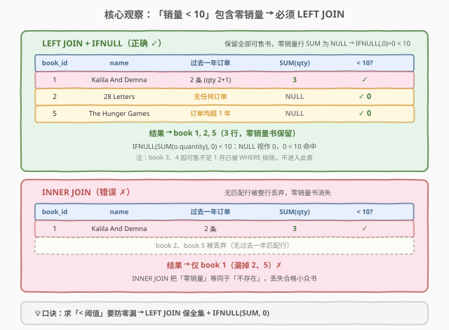
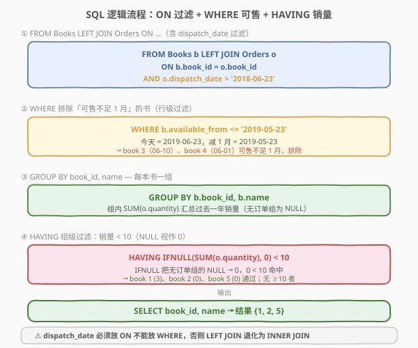
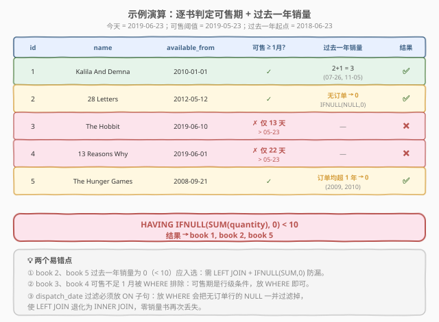

# 小众书籍

- **题目名称**：小众书籍
- **链接**：[1098. Unpopular Books](https://leetcode.cn/problems/unpopular-books/)
- **难度**：中等
- **标签**：SQL、数据库、LEFT JOIN、GROUP BY、HAVING、IFNULL/COALESCE、日期函数、反连接

> ⚠️ **注意**：本题是 LeetCode **Plus 会员专享**题，需登录 Plus 账号才能查看题面与提交。本文依据官方表结构与测试用例编写，代码部分使用 SQL 而非 C++/Python。

## 1. 题目概述

给定 `Books` 表（书籍信息）与 `Orders` 表（订单记录），编写 SQL 查询，报告**过去一年内售出不足 10 本**的书籍，并**排除上架不足一个月**的书。今天（today）固定为 `2019-06-23`。「过去一年」即从 `2018-06-23`（含）起向前回溯的 365 天。

**表结构**：

```text
表：Books
+----------------+---------+
| 列名           | 类型    |
+----------------+---------+
| book_id        | int     |  ← 主键
| name           | varchar |
| available_from | date    |
+----------------+---------+
book_id 是该表的主键。
每行表示一本书的名称与上架日期。

表：Orders
+----------------+---------+
| 列名           | 类型    |
+----------------+---------+
| order_id       | int     |  ← 主键
| book_id        | int     |  ← 外键 → Books.book_id
| quantity       | int     |
| dispatch_date  | date    |
+----------------+---------+
order_id 是该表的主键。
book_id 是 Books 表的外键。
每行表示一笔订单的发货数量与发货日期。
```

**示例 1**：

```text
输入：
Books 表
+---------+----------------------------------+----------------+
| book_id | name                             | available_from |
+---------+----------------------------------+----------------+
| 1       | Kalila And Demna                 | 2010-01-01     |
| 2       | 28 Letters                       | 2012-05-12     |
| 3       | The Hobbit                       | 2019-06-10     |
| 4       | 13 Reasons Why                   | 2019-06-01     |
| 5       | The Hunger Games                 | 2008-09-21     |
+---------+----------------------------------+----------------+
Orders 表
+----------+---------+----------+--------------+
| order_id | book_id | quantity | dispatch_date |
+----------+---------+----------+--------------+
| 1        | 1       | 2        | 2018-07-26    |
| 2        | 1       | 1        | 2018-11-05    |
| 3        | 3       | 8        | 2019-06-11    |
| 4        | 4       | 6        | 2019-06-05    |
| 5        | 4       | 5        | 2019-06-20    |
| 6        | 5       | 9        | 2009-02-02    |
| 7        | 5       | 8        | 2010-04-13    |
+----------+---------+----------+--------------+
输出：
+---------+------------------+
| book_id | name             |
+---------+------------------+
| 1       | Kalila And Demna |
| 2       | 28 Letters       |
| 5       | The Hunger Games |
+---------+------------------+
解释：
book 1：可售自 2010-01-01（远超 1 月）✓，过去一年销量 2+1=3 < 10 → 入选
book 2：可售自 2012-05-12 ✓，过去一年「无任何订单」→ 销量 0 < 10 → 入选
book 3：可售自 2019-06-10，距今仅 13 天 < 1 月 → 排除（不看点销量）
book 4：可售自 2019-06-01，距今仅 22 天 < 1 月 → 排除（不看点销量）
book 5：可售自 2008-09-21 ✓，订单均在 2009/2010（超 1 年）→ 过去一年销量 0 < 10 → 入选
```

**约束条件**：

- `book_id` 为 `Books` 表主键，`Orders.book_id` 为外键
- `order_id` 为 `Orders` 表主键，同一 `book_id` 可对应多笔订单
- 一本书可能**完全没有订单**（如示例中的 book 2），也可能订单全部落在过去一年之外（如 book 5）
- 结果列须为 `book_id`、`name`

> 💡 本题的题眼有两个：「**不足 10 本**」与「**排除上架不足 1 月**」。前者隐藏了「零销量也算不足」的陷阱——一本没有任何订单的书销量为 0，0 < 10，**应当入选**；这决定了连接方式必须是 **LEFT JOIN**。后者是对 `Books` 表的行级过滤，可直接用 `WHERE`。

---

## 2. 解题思路

### 2.1 暴力思路：应用层逐书统计

用应用层代码读出 `Books` 与 `Orders` 两张表，对每本书收集其过去一年的订单，累加 `quantity`，再判断是否 `< 10`。这能解决问题，但把本该由数据库引擎高效完成的聚合搬到了应用层——既低效也违背 SQL 的声明式哲学。更糟的是，应用层很容易忘记「无订单的书销量为 0」这一情形，写成 `INNER JOIN` 语义而漏掉零销量书。

### 2.2 核心观察：「不足 10」包含零销量 → 必须 LEFT JOIN



关键洞察是：「过去一年售出**不足** 10 本」是一个**上界**判定，**包含 0 本**。一本书如果过去一年内**没有任何订单**——无论是从来没有订单（book 2），还是订单全部落在一年以前（book 5）——它的销量都是 0，而 $0 < 10$ 成立，**应当入选**。

这带来两个直接推论：

1. **连接必须用 `LEFT JOIN`**：以 `Books` 为左表保留全集，`Orders` 中无匹配行时右表列填 `NULL`。若用 `INNER JOIN`，零销量的书会被整行丢弃，**漏选**。

2. **聚合必须兜底 `NULL`**：零销量书在 `LEFT JOIN` 后，组内 `SUM(o.quantity)` 为 `NULL`（不是 0）。`NULL < 10` 在 SQL 中结果为 `NULL`（即假），会导致零销量书**被 `HAVING` 误排除**。必须用 `IFNULL(SUM(o.quantity), 0)`（或 `COALESCE(SUM(o.quantity), 0)`）把 `NULL` 转成 0。

> ⚠️ **为什么 `SUM` 会是 `NULL` 而不是 0？** `SUM` 在组内**所有行**的聚合列均为 `NULL`（LEFT JOIN 未匹配行右表列全为 `NULL`）时返回 `NULL`，而非 0。这是 SQL 标准行为：聚合函数忽略 `NULL`，但若没有非 `NULL` 输入，`SUM`/`AVG` 返回 `NULL`（`COUNT(*)` 例外，它计行数）。因此 `HAVING SUM(o.quantity) < 10` 会把零销量书的 `NULL` 判为假而漏选——这是本题最隐蔽的坑。

> 💡 **对照 `COUNT(*)` vs `COUNT(o.quantity)`**：若改用「订单笔数 < 某值」判定，`COUNT(o.quantity)` 对零销量组返回 0（`COUNT` 对全 `NULL` 组返回 0），看似安全；但题目问的是**销量（数量之和）**而非笔数，故仍需 `SUM` + `IFNULL`。

### 2.3 算法流程图



完整的 SQL 书写与逻辑执行流程如下：

```text
书写顺序：SELECT → FROM → LEFT JOIN ... ON → WHERE → GROUP BY → HAVING
执行顺序：FROM → LEFT JOIN ON → WHERE → GROUP BY → HAVING → SELECT
```

1. **FROM Books b LEFT JOIN Orders o ON b.book_id = o.book_id AND o.dispatch_date > '2018-06-23'**：左连接保留全部书籍；`dispatch_date` 过滤写在 **ON 子句**里，只约束右表匹配，未匹配书仍以 `NULL` 保留。
2. **WHERE b.available_from <= '2019-05-23'**：排除上架不足 1 月的书。这是对左表 `Books` 的行级过滤，放 `WHERE` 合适（减 1 月 = 今天 `2019-06-23` 往前推 30 天）。
3. **GROUP BY b.book_id, b.name**：按书分组，组内可计算 `SUM(o.quantity)`。
4. **HAVING IFNULL(SUM(o.quantity), 0) < 10**：组级过滤，零销量组的 `NULL` 兜底为 0，命中 `< 10`。
5. **SELECT b.book_id, b.name**：投影输出。

> ⚠️ **`dispatch_date` 过滤为什么必须放 ON 而非 WHERE？** 若写成 `WHERE o.dispatch_date > '2018-06-23'`，由于 `NULL > '2018-06-23'` 结果为 `NULL`（即假），LEFT JOIN 未匹配行（右表列全 `NULL`）会被 WHERE 一并滤掉——**LEFT JOIN 退化为 INNER JOIN**，零销量书再次丢失。把日期过滤放进 ON 子句，它只影响「右表如何匹配」，不影响「左表行是否保留」，才能保住全集。

### 2.4 示例演算



以示例数据跟踪完整判定过程（今天 = `2019-06-23`，可售阈值 = `2019-05-23`，过去一年起点 = `2018-06-23`）：

| 步骤 | 书 | available_from | 可售≥1月? | 过去一年订单 | SUM(qty) | 兜底后 | < 10? | 结果 |
|------|----|----------------|----------|-------------|----------|--------|-------|------|
| ① | Kalila And Demna | 2010-01-01 | ✓ | 2 条 (07-26, 11-05) | 3 | 3 | ✓ | ✅ 入选 |
| ② | 28 Letters | 2012-05-12 | ✓ | 无任何订单 | NULL | 0 | ✓ | ✅ 入选 |
| ③ | The Hobbit | 2019-06-10 | ✗ 仅 13 天 | — | — | — | — | ❌ 排除 |
| ④ | 13 Reasons Why | 2019-06-01 | ✗ 仅 22 天 | — | — | — | — | ❌ 排除 |
| ⑤ | The Hunger Games | 2008-09-21 | ✓ | 订单均超 1 年 | NULL | 0 | ✓ | ✅ 入选 |

> 💡 **三个易错点一览**：
> - **book 2 / book 5** 过去一年销量为 0（`< 10`）应入选 → 需 `LEFT JOIN` + `IFNULL(SUM, 0)` 防漏。
> - **book 3 / book 4** 可售不足 1 月被 `WHERE` 排除 → 可售期是左表行级条件，放 `WHERE` 即可。
> - **`dispatch_date` 过滤放 ON 不放 WHERE** → 否则 `NULL` 行被滤掉，LEFT JOIN 退化为 INNER JOIN。

---

## 3. 参考代码

### SQL（解法 A：LEFT JOIN + ON + HAVING IFNULL，推荐）

```sql
SELECT b.book_id, b.name
FROM Books b
LEFT JOIN Orders o
  ON b.book_id = o.book_id
 AND o.dispatch_date > DATE_SUB('2019-06-23', INTERVAL 1 YEAR)
WHERE b.available_from <= DATE_SUB('2019-06-23', INTERVAL 1 MONTH)
GROUP BY b.book_id, b.name
HAVING IFNULL(SUM(o.quantity), 0) < 10;
```

> 💡 **写法要点**：
> - `LEFT JOIN ... ON b.book_id = o.book_id AND o.dispatch_date > ...`：`dispatch_date` 过滤写进 ON，只约束右表匹配，左表全集保留。`DATE_SUB('2019-06-23', INTERVAL 1 YEAR)` = `'2018-06-23'`。
> - `WHERE b.available_from <= DATE_SUB('2019-06-23', INTERVAL 1 MONTH)`：减 1 月 = `'2019-05-23'`，排除上架不足 1 月的书。这是左表行级过滤，放 WHERE 正确。
> - `GROUP BY b.book_id, b.name`：按书分组。`name` 函数依赖于 `book_id`（主键），显式写出满足 SQL 标准。
> - `HAVING IFNULL(SUM(o.quantity), 0) < 10`：组级聚合过滤。`IFNULL` 把零销量组的 `NULL` 兜底为 0，使 `0 < 10` 成立。`COALESCE(SUM(o.quantity), 0)` 等价且为 SQL 标准，可互换。

### SQL（解法 B：子查询聚合 + NOT IN 反连接）

```sql
SELECT book_id, name
FROM Books
WHERE available_from <= DATE_SUB('2019-06-23', INTERVAL 1 MONTH)
  AND book_id NOT IN (
      SELECT book_id
      FROM (
          SELECT book_id, SUM(quantity) AS total
          FROM Orders
          WHERE dispatch_date > DATE_SUB('2019-06-23', INTERVAL 1 YEAR)
          GROUP BY book_id
          HAVING SUM(quantity) >= 10
      ) AS hot
  );
```

> 💡 **写法要点**：内层子查询先在过去一年订单中聚合出「销量 ≥ 10」的热门书，外层用 `NOT IN` 排除它们。由于只聚合有订单的书，零销量书**天然不在热门集合中**，自动被 `NOT IN` 保留——无需显式 LEFT JOIN。代价是子查询多扫一次 `Orders` 表，且 `NOT IN` 在结果含 `NULL` 时有陷阱（本题 `book_id` 为外键非空，安全）。语义与解法 A 等价。

### SQL（解法 C：LEFT JOIN 显式聚合列）

```sql
SELECT b.book_id, b.name
FROM Books b
LEFT JOIN (
    SELECT book_id, SUM(quantity) AS sold
    FROM Orders
    WHERE dispatch_date > DATE_SUB('2019-06-23', INTERVAL 1 YEAR)
    GROUP BY book_id
) s ON b.book_id = s.book_id
WHERE b.available_from <= DATE_SUB('2019-06-23', INTERVAL 1 MONTH)
  AND IFNULL(s.sold, 0) < 10;
```

> 💡 **写法要点**：先把过去一年订单聚合成「每书销量」的派生表，再 LEFT JOIN 回 `Books`。聚合下推到子查询后，每本书最多匹配一行，`sold` 为 `NULL` 表示无过去一年销量，`IFNULL(s.sold, 0) < 10` 在 WHERE 中判定即可（此处不再是组级聚合过滤，故可用 WHERE）。可读性好，但多一次子查询扫描。

### Python（pandas）

```python
import pandas as pd

def unpopular_books(books: pd.DataFrame, orders: pd.DataFrame) -> pd.DataFrame:
    today = pd.Timestamp('2019-06-23')
    past_year = today - pd.DateOffset(years=1)
    past_month = today - pd.DateOffset(months=1)

    recent = orders[orders['dispatch_date'] > past_year]
    sold = recent.groupby('book_id')['quantity'].sum().reset_index().rename(columns={'quantity': 'sold'})

    eligible = books[books['available_from'] <= past_month]
    merged = eligible.merge(sold, on='book_id', how='left')
    merged['sold'] = merged['sold'].fillna(0)

    return merged.loc[merged['sold'] < 10, ['book_id', 'name']]
```

> 💡 **pandas 对照**：`merge(..., how='left')` 对应 SQL 的 `LEFT JOIN`；`fillna(0)` 对应 `IFNULL(SUM, 0)`；`available_from <= past_month` 对应 `WHERE` 可售过滤；`sold < 10` 对应 `HAVING`。注意 `dispatch_date > past_year` 的过滤放在聚合 `groupby` 之前（对 `recent` 切片），等价于 SQL 中对 `Orders` 的 WHERE，因这里聚合的是右表派生表而非左表全集，不存在「退化」问题。

---

## 4. 复杂度分析

| 维度 | 复杂度 | 说明 |
|------|--------|------|
| **时间（解法 A）** | $O(n + m)$ | 扫 `Books`（$m$ 行）+ `Orders`（$n$ 行）做 LEFT JOIN 与分组聚合；`Orders.book_id` 上有索引时 JOIN 可走索引 |
| **时间（解法 B/C）** | $O(n \log n)$ ~ $O(n)$ | 子查询对 `Orders` 聚合一次，外层 `NOT IN`/JOIN 再扫 `Books`；哈希聚合接近线性，排序聚合需 $O(n \log n)$ |
| **空间** | $O(m)$ | 分组聚合的哈希表 / 派生表，按不同 `book_id` 数量计 |
| **结果行数** | $O(k)$ | $k$ = 销量不足 10 且可售满 1 月的书数 |

> ⚠️ SQL 复杂度取决于**执行计划与索引**：`Orders.book_id` 上建索引可使 JOIN 与聚合走索引-only 扫描；`dispatch_date` 上建索引可加速过去一年订单的筛选。面试中说明「首选 LEFT JOIN + IFNULL 一次聚合，避免多次扫表」即可。

---

## 5. 扩展：ON 与 WHERE 在 LEFT JOIN 中的本质区别

### 5.1 ON 约束右表匹配，WHERE 约束最终行

| 维度 | `ON` 子句 | `WHERE` 子句 |
|------|----------|--------------|
| **作用对象** | 右表「如何匹配」左表 | JOIN 后的最终行 |
| **对 LEFT JOIN 影响** | 不影响左表行保留（未匹配行右表填 NULL） | **会影响**：未匹配行的右表列为 NULL，被 WHERE 条件过滤后整行消失 |
| **本题 dispatch_date** | 放 ON ✓：零销量书以 NULL 保留 | 放 WHERE ✗：NULL 行被滤掉，退化为 INNER JOIN |
| **本题 available_from** | 放 ON 可行但不自然 | 放 WHERE ✓：左表行级条件 |

### 5.2 退化演示

若误把 `dispatch_date` 过滤放进 WHERE：

```sql
-- ✗ 错误写法：LEFT JOIN 退化为 INNER JOIN
SELECT b.book_id, b.name
FROM Books b
LEFT JOIN Orders o ON b.book_id = o.book_id
WHERE b.available_from <= DATE_SUB('2019-06-23', INTERVAL 1 MONTH)
  AND o.dispatch_date > DATE_SUB('2019-06-23', INTERVAL 1 YEAR);  -- ✗
```

`o.dispatch_date` 在未匹配行为 `NULL`，`NULL > '2018-06-23'` 结果为 `NULL`（假），整行被 WHERE 滤掉。book 2（无订单）、book 5（订单超 1 年）的行全部消失，结果只剩 book 1——**漏掉两本零销量小众书**。

> 💡 **口诀**：「LEFT JOIN 的右表条件放 ON，左表条件放 WHERE」。凡是对右表列做过滤且希望保留无匹配左表行，必须放 ON。

### 5.3 IFNULL 与 COALESCE 的取舍

- `IFNULL(x, 0)`：MySQL 专有，两参数，简洁。
- `COALESCE(x, 0)`：SQL 标准，可多参数，可移植到 PostgreSQL / SQL Server / SQLite。

二者对 `SUM` 的 `NULL` 兜底效果一致。面试中写 `COALESCE` 更显标准素养，写 `IFNULL` 在 MySQL 环境下更简洁，均可接受。

---

## 6. 面试要点

1. **为什么必须用 LEFT JOIN 而不是 INNER JOIN？**

   > 「不足 10 本」是上界判定，**包含 0 本**。一本书若过去一年无任何订单（如 book 2 从未售出、book 5 订单全在一年前），销量为 0，0 < 10 应入选。`INNER JOIN` 会把无匹配行的书整行丢弃，漏选零销量书；`LEFT JOIN` 保留左表全集，未匹配行右表填 NULL，再配合 `IFNULL(SUM, 0)` 即可正确判定。

2. **SUM 为什么是 NULL 而不是 0？IFNULL 在这里起什么作用？**

   > `LEFT JOIN` 未匹配行右表列全为 NULL，`SUM` 聚合时若组内所有行的该列均为 NULL，按 SQL 标准 `SUM` 返回 NULL（不是 0）。`NULL < 10` 结果为 NULL（假），零销量书会被 `HAVING` 误排除。`IFNULL(SUM(o.quantity), 0)` 把 NULL 转成 0，使 `0 < 10` 成立，零销量书正确入选。

3. **dispatch_date 的过滤为什么放 ON 而不放 WHERE？**

   > 放 WHERE 会把 LEFT JOIN 未匹配行（右表 dispatch_date 为 NULL）一并滤掉——`NULL > '2018-06-23'` 为 NULL 即假——使 LEFT JOIN 退化为 INNER JOIN，零销量书再次丢失。放 ON 子句则只约束「右表如何匹配左表」，不影响左表行是否保留，才能保住全集。

4. **available_from 的过滤为什么可以放 WHERE？**

   > `available_from` 是左表 `Books` 的列，对它做行级过滤不涉及右表 NULL 问题。放 WHERE 在 GROUP BY 之前先剔除上架不足 1 月的书，既正确又高效（减少后续分组的数据量）。它不是组级聚合条件，无需 HAVING。

5. **如果要把「不足 10」改成「恰好 0」（完全没卖出）怎么写？**

   > 把 `HAVING IFNULL(SUM(o.quantity), 0) < 10` 改为 `HAVING IFNULL(SUM(o.quantity), 0) = 0` 即可。此时只保留过去一年零销量的书，LEFT JOIN + IFNULL 的设计依然不可省——正是它保证了零销量书不被漏掉。

> 💡 **一句话总结**：1098 的灵魂是「**不足阈值包含零，零需 LEFT JOIN 兜底**」——`LEFT JOIN` 保全集、`dispatch_date` 过滤放 ON 防退化、`IFNULL(SUM, 0)` 兜 NULL，三件套缺一不可，共同守护「零销量也算小众」的语义。

---

## 7. 同类练习题

- [1084. 销售分析 III](https://leetcode.cn/problems/sales-analysis-iii/)（[题解](1084_销售分析III.md)）：同 `Sales`/`Product` 表系列的 `GROUP BY` + `HAVING` 组级过滤，与 1098 共享「聚合后判定」范式，区别在 1084 用 MIN/MAX 双边界、1098 用 SUM + LEFT JOIN 兜零
- [183. 从不订购的客户](https://leetcode.cn/problems/customers-never-order/)（[题解](../0101-0200/183_从不订购的客户.md)）：`LEFT JOIN + IS NULL` 找「从未出现」的行，与 1098 的「零销量也入选」同属 LEFT JOIN 保全集思想，一个用 IS NULL 取无匹配、一个用 IFNULL(SUM,0) 聚合无匹配
- [550. 游戏玩法分析 IV](https://leetcode.cn/problems/game-play-analysis-iv/)：`LEFT JOIN` 求留存率，分母必须保留全部玩家（含无次日登录者），与 1098 的「分母/候选集不能漏零」同理，是 LEFT JOIN 防退化的经典应用
- [175. 组合两个表](https://leetcode.cn/problems/combine-two-tables/)：`LEFT JOIN` 基础题，保留无地址的 person 行，是 1098 LEFT JOIN 全集思想的入门版
- [1068. 产品销售分析 I](https://leetcode.cn/problems/product-sales-analysis-i/)（[题解](1068_产品销售分析I.md)）：同 `Sales`/`Product` 表的 `JOIN` + 聚合，对照 1098 学习「先关联再分组」与「左连接保全集」的配合
