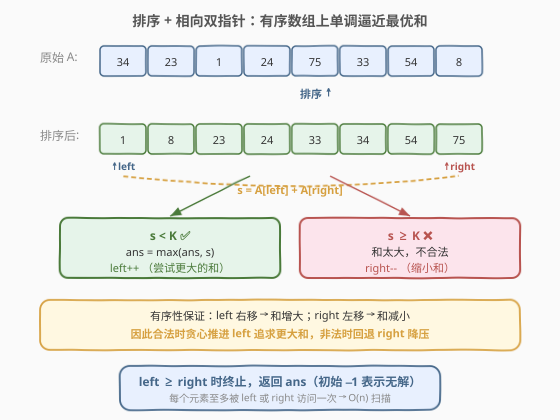

# 小于 K 的两数之和

- **题目名称**：小于 K 的两数之和
- **链接**：[1099. 小于 K 的两数之和](https://leetcode.cn/problems/two-sum-less-than-k/)
- **难度**：中等
- **标签**：数组、排序、双指针

## 1. 题目概述

给定一个整数数组 `A` 和一个整数 `K`，返回满足以下条件的最大整数 `S`：存在下标 `i < j` 使得 `A[i] + A[j] = S` 且 `S < K`。如果不存在这样的 `S`，返回 `-1`。

**示例 1**：

```text
输入：A = [34,23,1,24,75,33,54,8], K = 60
输出：58
解释：34 + 24 = 58 < 60，是所有合法两数之和中最大的。
```

**示例 2**：

```text
输入：A = [10,20,30], K = 15
输出：-1
解释：不存在两数之和小于 15 的配对，最小和 10+20=30 ≥ 15。
```

**约束条件**：

- $1 \le \text{A.length} \le 100$
- $1 \le \text{A[i]} \le 1000$
- $1 \le K \le 2000$

> 💡 **关键直觉**：题目要的是「**小于 K 的最大和**」，而非「等于目标的精确和」。这意味着我们不能像 [1. 两数之和](../0001-0100/1_两数之和.md) 那样用哈希查精确互补值——目标是**一个上界不等式**而非等式。排序后数组的**单调性**天然适配这种「逼近上界」的需求：相向双指针可以高效地扫描所有有希望的配对。

---

## 2. 解题思路

### 2.1 暴力思路：枚举所有配对

枚举所有下标对 $(i, j)$（$i < j$），计算 $A[i] + A[j]$，若 $< K$ 则更新最大值。两重循环共 $O(n^2)$，$n = 100$ 时约 $5000$ 次运算，数据规模虽小能过，但缺乏启发性。

> 💡 暴力的浪费在于：**无序数组下每个配对独立**，无法利用大小关系剪枝。一旦排序，和的单调性立刻暴露——小元素配大元素的和介于两者之间，可以**有方向地逼近** $K$。

### 2.2 核心观察：排序 + 相向双指针



将数组**升序排序**后，用两个指针 `left = 0`、`right = n - 1` 从两端相向移动。关键性质：

- 排序后 $A[\text{left}]$ 是当前最小值、$A[\text{right}]$ 是当前最大值。
- $s = A[\text{left}] + A[\text{right}]$ 是这两个指针所指配对的和。
- **若 $s < K$**：这是一个合法配对，记录 $\text{ans} = \max(\text{ans}, s)$。此时固定 `right`、把 `left` 右移，和会**增大**——可能找到更接近 $K$ 的合法和。而固定 `left`、左移 `right` 只会让和更小，不可能更优。
- **若 $s \geq K$**：和太大不合法。固定 `left`、右移 `right` 只会更大，无意义；必须**左移 `right`** 来缩小和。

> ⚠️ **为什么不会遗漏最优解？** 核心在于「**排除法**」：每次指针移动都**安全排除了不可能更优的配对**。
> - 当 $s \geq K$ 时，对于当前 `right`，任何 $\text{left}' \geq \text{left}$ 都有 $A[\text{left}'] + A[\text{right}] \geq s \geq K$（因为 $A[\text{left}'] \geq A[\text{left}]$），全部非法。所以 `right` 的所有可能配对已穷尽，安全左移。
> - 当 $s < K$ 时，对于当前 `left`，任何 $\text{right}' \leq \text{right}$ 都有 $A[\text{left}] + A[\text{right}'] \leq s < K$（合法但和更小），不会比当前 $s$ 更优。所以 `left` 与更大的 `right` 的配对无需再查（已被当前 `right` 覆盖了该 `left` 的最优），安全右移 `left`。
>
> 每一步排除一整行或一整列配对，总共至多 $n$ 步即可覆盖所有「有希望」的配对。

### 2.3 算法流程图


流程要点：

1. **排序**：对数组 `A` 升序排序。
2. **初始化**：`left = 0`，`right = n - 1`，`ans = -1`（初始为 -1 表示尚无合法解）。
3. **循环**（`left < right`）：
   - 计算 $s = A[\text{left}] + A[\text{right}]$。
   - 若 $s < K$：`ans = max(ans, s)`，`left++`（尝试更大的和）。
   - 若 $s \geq K$：`right--`（缩小和）。
4. **终止**：`left >= right` 时退出，返回 `ans`。

> 💡 **初始 `ans = -1` 的设计**：若整个循环中从未遇到 $s < K$（如示例 2），`ans` 保持 `-1`，直接返回，无需额外判断。这是「哨兵初值」的典型用法——用不可能的合法值标记「未找到」状态。

### 2.4 示例演算

以示例 1 `A = [34,23,1,24,75,33,54,8], K = 60` 为例，排序后为 `[1, 8, 23, 24, 33, 34, 54, 75]`：


| 步骤 | left | right | A[left] | A[right] | s | s < K? | 动作 | ans |
|------|------|-------|---------|----------|-----|--------|------|-----|
| ① | 0 | 7 | 1 | 75 | 76 | ❌ | right-- | -1 |
| ② | 0 | 6 | 1 | 54 | 55 | ✅ | ans=max(-1,55), left++ | 55 |
| ③ | 1 | 6 | 8 | 54 | 62 | ❌ | right-- | 55 |
| ④ | 1 | 5 | 8 | 34 | 42 | ✅ | ans=max(55,42), left++ | 55 |
| ⑤ | 2 | 5 | 23 | 34 | 57 | ✅ | ans=max(55,57), left++ | 57 |
| ⑥ | 3 | 5 | 24 | 34 | 58 | ✅ | ans=max(57,58), left++ | 58 |
| ⑦ | 4 | 5 | 33 | 34 | 67 | ❌ | right-- | 58 |
| ⑧ | 4 | 4 | — | — | — | — | left ≥ right，终止 | 58 |

最终答案为 **58**（$24 + 34$），是所有满足 $< 60$ 的两数之和中最大的。

> 💡 **观察轨迹**：`left` 单调右移、`right` 单调左移，两者交替推进，总共 7 步即覆盖了所有有希望的配对。注意第④步虽然合法（$42 < 60$）但比已有的 $55$ 更小，`ans` 不变——`left++` 是为了尝试**更大**的和，而非接受这个较小的值。

---

## 3. 参考代码

### C++

```cpp
class Solution {
  public:
    int twoSumLessThanK(vector<int>& A, int K) {
        sort(A.begin(), A.end());
        int ans = -1;
        int left = 0, right = A.size() - 1;
        while (left < right) {
            int s = A[left] + A[right];
            if (s < K) {
                ans = max(ans, s);
                left++;
            } else {
                right--;
            }
        }
        return ans;
    }
};
```

### Python

```python
class Solution:
    def twoSumLessThanK(self, A: List[int], K: int) -> int:
        A.sort()
        ans = -1
        left, right = 0, len(A) - 1
        while left < right:
            s = A[left] + A[right]
            if s < K:
                ans = max(ans, s)
                left += 1
            else:
                right -= 1
        return ans
```

> ⚠️ **易错点**：
> 1. **合法时 `left++` 而非 `right--`**：$s < K$ 时应右移 `left` 追求更大和，若误移 `right` 则和只会更小，永远找不到最优。
> 2. **初始 `ans = -1`**：不要初始化为 $0$ 或 `INT_MIN`。$-1$ 既是「无解」返回值，又小于任何合法和（元素均 $\geq 1$，合法和 $\geq 2$），保证 `max` 正确更新。
> 3. **循环条件 `left < right`**：不含等号，因为需要 $i < j$ 即两个不同元素，`left == right` 时指向同一元素无意义。

---

## 4. 复杂度分析

| 维度 | 复杂度 | 说明 |
|------|--------|------|
| 时间复杂度 | $O(n \log n)$ | 排序主导 $O(n \log n)$；双指针扫描 $O(n)$ |
| 空间复杂度 | $O(\log n)$ | 排序的栈空间（C++ `sort` 内省排序）；双指针 $O(1)$ 额外空间 |

> 💡 $n \le 100$，$n \log n \approx 100 \times 7 = 700$，极快。即使 $n$ 放大到 $10^5$，$O(n \log n)$ 依然轻松通过。

---

## 5. 扩展：暴力计数与二分查找视角

除双指针外，本题还有两种等价视角：

**二分查找法**：排序后，对每个 $i$，在 $A[i+1:]$ 中二分查找**最大的** $A[j] < K - A[i]$（即 `upper_bound(K - A[i] - 1)` 的前一个元素）。若存在，则 $A[i] + A[j]$ 是以 $A[i]$ 为较小元素时的最优配对，取所有 $i$ 的最大值。复杂度 $O(n \log n)$，与双指针同级但常数更大。

> 💡 **双指针 vs 二分**：双指针利用了「两个指针协同移动」的对称性，一轮扫描同时处理所有 $i$；二分法则对每个 $i$ 独立查找，需 $n$ 次二分。两者复杂度同级，但双指针实现更简洁、常数更小，是面试首选。

**暴力计数法**（值域小时的特殊优化）：由于 $A[i] \in [1, 1000]$，可用计数排序思路统计每个值的出现次数，然后枚举所有值对 $(v_1, v_2)$ 检查 $v_1 + v_2 < K$。复杂度 $O(n + V^2)$，$V = 1000$ 时约 $10^6$，在值域受限的场景下可行。此法可推广到 [2824. 统计和小于 K 的整数对数目](https://leetcode.cn/problems/count-pairs-whose-sum-is-less-than-k/)（统计配对**数量**而非最大和）。

> ⚠️ **变体提示**：若题目改为「统计和小于 $K$ 的配对**数目**」（而非最大和），双指针法同样适用——当 $s < K$ 时，`A[left..right-1]` 中任意元素与 `A[right]` 配对都合法，贡献 `right - left` 对，然后 `left++`；否则 `right--`。这是 [15. 三数之和](../0001-0100/15_三数之和.md) 双指针计数的同类技巧。

---

## 6. 面试要点

1. **为什么排序后双指针不会遗漏最优解？**

   - 排除法：$s \geq K$ 时，当前 `right` 与所有 $\text{left}' \geq \text{left}$ 的配对都 $\geq K$（单调性），全部非法，安全左移 `right`；$s < K$ 时，当前 `left` 与所有 $\text{right}' \leq \text{right}$ 的配对都合法但和 $\leq s$，不会更优，安全右移 `left`。每步排除一整行/列，至多 $n$ 步覆盖所有有希望的配对。

2. **为什么合法时移动 `left` 而不是 `right`？**

   - 目标是**最大化**合法和。$s < K$ 时右移 `left` 会增大和（可能更接近 $K$），而左移 `right` 只会减小和（必然更差）。贪心方向由优化目标决定——求最大就朝「增大」方向走。

3. **与 [1. 两数之和](../0001-0100/1_两数之和.md) 的区别？**

   - 1 题目标是**精确等于** `target`，用哈希表 $O(n)$ 查互补值即可，无需排序。本题目标是**小于 $K$ 的最大值**（不等式 + 最优化），哈希表无法高效回答「小于某上界的最大和」，必须借助排序的单调性用双指针逼近。两者同属「两数之和」家族但解法范式不同。

4. **初始 `ans = -1` 的作用？**

   - 双重身份：既是「无合法配对」时的返回值（如示例 2），又作为 `max` 的初始哨兵——合法和 $\geq 2$（元素 $\geq 1$），$-1$ 小于任何合法值，保证首次命中即更新。若误设为 $0$，当所有合法和均 $> 0$ 时结果正确，但语义不清且依赖元素正值假设。

5. **能否不排序用哈希表做？**

   - 求最大合法和时，哈希表无法高效回答「哪些配对的和 $< K$ 且最大」。可对每个元素用平衡树/有序结构查「小于 $K - A[i]$ 的最大值」，复杂度 $O(n \log n)$，但实现远比排序 + 双指针复杂。排序双指针是本题的最自然解法。

---

## 7. 同类练习题

- [1. 两数之和](https://leetcode.cn/problems/two-sum/)（[题解](../0001-0100/1_两数之和.md)）：两数之和家族母题，精确等于目标的哈希解法，对照本题的不等式双指针解法
- [15. 三数之和](https://leetcode.cn/problems/3sum/)（[题解](../0001-0100/15_三数之和.md))：排序 + 双指针的计数型招牌题，固定一个 + 双指针扫剩余两个
- [16. 最接近的三数之和](https://leetcode.cn/problems/3sum-closest/)（[题解](../0001-0100/16_最接近的三数之和.md))：排序 + 双指针维护「最接近目标」的和，与本题「最接近上界 $K$」的逼近思路同构
- [2824. 统计和小于 K 的整数对数目](https://leetcode.cn/problems/count-pairs-whose-sum-is-less-than-k/)：本题的计数变体——双指针在 $s < K$ 时贡献 `right - left` 对，同一框架求数量而非最大值
- [719. 找出第 K 小的数对距离](https://leetcode.cn/problems/find-k-th-smallest-pair-distance/)（[题解](../0601-0700/719_找出第K小的数对距离.md))：二分答案 + 双指针计数，将「小于某阈值的配对数」作为判定函数，是本题计数思路的进阶应用
