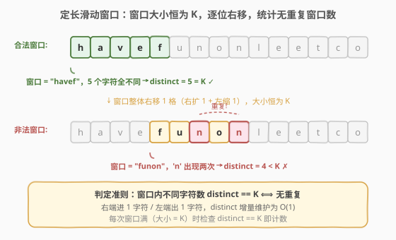
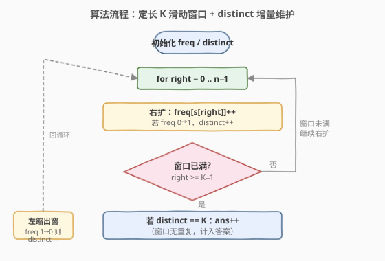
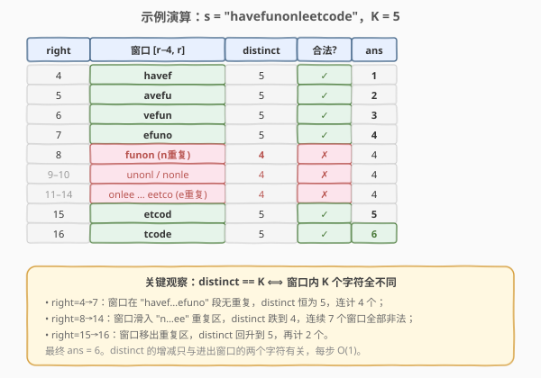

# 长度为K的无重复字符的子串

- **题目名称**：长度为 K 的无重复字符的子串
- **链接**：[1100. 长度为 K 的无重复字符的子串](https://leetcode.cn/problems/find-k-length-substrings-with-no-repeated-characters/)
- **难度**：中等
- **标签**：字符串、滑动窗口、哈希表

## 1. 题目概述

给定一个字符串 `s` 和一个整数 `k`，请你返回 `s` 中**长度为 `k` 且无重复字符**的子串的个数。

**示例 1**：

```text
输入：s = "havefunonleetcode", k = 5
输出：6
解释：长度为 5 且无重复字符的子串共有 6 个：
      "havef"、"avefu"、"vefun"、"efuno"、"etcod"、"tcode"。
```

**示例 2**：

```text
输入：s = "home", k = 5
输出：0
解释：字符串长度 4 < k = 5，不存在长度为 5 的子串。
```

**约束条件**：

- $1 \leq \text{s.length} \leq 10^4$
- `s` 由小写英文字母组成
- $1 \leq k \leq 10^4$

> 💡 **与 [3. 无重复字符的最长子串](../0001-0100/3_无重复字符的最长子串.md) 的对照**：3 题是「**变长**窗口求最长」，本题是「**定长** $k$ 窗口求个数」。两者维护的都是「无重复字符」这一性质，只是 3 题用 `left` 跳跃收缩来扩张窗口、记录最大宽度；本题窗口大小恒为 $k$，只需统计其中满足无重复的窗口数。

---

## 2. 解题思路

### 2.1 暴力思路

枚举每一个长度为 $k$ 的子串 $s[i..i+k-1]$（共 $n-k+1$ 个），用集合判断其中是否有重复字符。时间复杂度 $O(n \cdot k)$，当 $n, k$ 同为 $10^4$ 时达 $10^8$，会超时。

> 💡 暴力的浪费在于：相邻两个窗口 $s[i..i+k-1]$ 与 $s[i+1..i+k]$ 只差「出 1 个旧字符、入 1 个新字符」，却重新扫描整个窗口。只需**增量维护**窗口内的字符频次，判定就能降到 $O(1)$。

### 2.2 核心观察：定长滑动窗口 + distinct 增量维护



关键直觉是维护一个**大小恒为 $k$ 的窗口**，并用一个计数器 `distinct` 跟踪窗口内**不同字符的个数**：

- 判定准则：**`distinct == k` $\iff$ 窗口内 $k$ 个字符全不同**（无重复）。因为窗口大小固定为 $k$，若 $k$ 个位置各不相同，则不同字符数恰为 $k$；一旦有重复，不同字符数必小于 $k$。
- **右扩** `right`：把 `s[right]` 加入频次表。若该字符频次由 $0 \to 1$（首次出现），`distinct += 1`。
- **左缩**：当窗口已满（`right >= k - 1`）并完成判定后，把窗口最左端 `s[right - k + 1]` 移出。若该字符频次由 $1 \to 0$（彻底离开窗口），`distinct -= 1`，为下一个窗口做准备。

> 为什么能用 `distinct == k` 一锤定音？因为窗口大小被钉死在 $k$。变长窗口里「不同字符数等于窗口长度」意味着无重复、且长度恰为此值；定长窗口里窗口长度恒为 $k$，所以 `distinct == k` 直接等价于「无重复」。这把「查重复」从 $O(k)$ 的集合扫描压缩成了 $O(1)$ 的整数比较。

### 2.3 算法流程图



维护变量：

- `freq[26]`：当前窗口内各小写字母的出现次数；
- `distinct`：当前窗口内不同字符的个数；
- `ans`：满足条件的窗口计数。

**主循环**（`right` 从 $0$ 到 $n-1$）：

1. **右扩**：`c = s[right]`，`freq[c] += 1`；若 `freq[c] == 1`（即由 $0$ 变 $1$），`distinct += 1`。
2. **窗口满判定**：若 `right >= k - 1`：
   - 若 `distinct == k`，`ans += 1`。
   - **左缩出窗**：`out = s[right - k + 1]`，`freq[out] -= 1`；若 `freq[out] == 0`（即由 $1$ 变 $0$），`distinct -= 1`。

循环结束返回 `ans`。若 $k > n$，循环中 `right` 始终达不到 $k-1$，`ans` 保持 $0$，无需特判。

> ⚠️ **左缩的时机**：必须在「判定之后」才移出最左端，否则当前窗口会被破坏。移出操作是为**下一个** `right` 准备窗口，保证下一轮 `right+1` 时窗口恰好覆盖 `[right-k+2, right+1]`。

### 2.4 示例演算

以 `s = "havefunonleetcode", k = 5` 为例（下标 `0..16`，共 13 个长度为 5 的窗口）：



关键阶段：

- **`right = 4..7`**：窗口分别在 `"havef"`、`"avefu"`、`"vefun"`、`"efuno"`，均无重复，`distinct` 恒为 $5 = k$，连计 $4$ 个。
- **`right = 8..14`**：窗口滑入 `"n…ee"` 重复区，`'n'` 或 `'e'` 重复，`distinct` 跌到 $4 < k$，连续 $7$ 个窗口全部非法。
- **`right = 15..16`**：窗口移出重复区，`distinct` 回升到 $5$，`"etcod"`、`"tcode"` 再计 $2$ 个。

最终 `ans = 6`。`distinct` 的每次增减只取决于进出窗口的两个字符，整趟扫描 $O(n)$。

> 💡 **为什么 `distinct` 能在「重复区」里自动恢复？** 重复区的 `'n'`、`'e'` 随窗口右移逐个被左缩移出；当窗口右端越过最后一个重复 `'e'`（下标 11）后，窗口里不再有任何频次 $\geq 2$ 的字符，`distinct` 自然回到 $k$。这正是「增量维护」的力量——无需重新扫描，进出即更新。

---

## 3. 参考代码

### C++（频次数组 + distinct 计数）

```cpp
class Solution {
  public:
    int numKLenSubstrNoRepeats(string s, int k) {
        int n = s.size();
        if (k > n || k > 26) return 0;   // 小写字母仅 26 个，k>26 必有重复
        int freq[26] = {0};
        int distinct = 0, ans = 0;
        for (int right = 0; right < n; ++right) {
            int in = s[right] - 'a';
            if (++freq[in] == 1) ++distinct;        // 右扩：0→1 计入
            if (right >= k - 1) {                   // 窗口已满
                if (distinct == k) ++ans;           // 无重复则计数
                int out = s[right - k + 1] - 'a';
                if (--freq[out] == 0) --distinct;   // 左缩：1→0 移出
            }
        }
        return ans;
    }
};
```

### Python

```python
class Solution:
    def numKLenSubstrNoRepeats(self, s: str, k: int) -> int:
        n = len(s)
        if k > n or k > 26:
            return 0
        freq = [0] * 26
        distinct = ans = 0
        for right, ch in enumerate(s):
            idx = ord(ch) - 97
            freq[idx] += 1
            if freq[idx] == 1:              # 右扩：0→1 计入
                distinct += 1
            if right >= k - 1:              # 窗口已满
                if distinct == k:
                    ans += 1                # 无重复则计数
                out = ord(s[right - k + 1]) - 97
                freq[out] -= 1
                if freq[out] == 0:          # 左缩：1→0 移出
                    distinct -= 1
        return ans
```

> ⚠️ **两个边界**：
> - `k > n` 直接返回 $0$（无足够长度的子串）；
> - `k > 26` 也返回 $0$——小写字母只有 $26$ 个，长度超过 $26$ 的窗口**必含重复**（鸽巢原理），无需运行窗口。这把 $k$ 很大时的无效计算直接剪掉。

---

## 4. 复杂度分析

| 维度 | 复杂度 | 说明 |
|------|--------|------|
| 时间复杂度 | $O(n)$ | `right` 单趟遍历 $n$ 步，每步进出窗口各 $O(1)$，`distinct` 增减 $O(1)$ |
| 空间复杂度 | $O(1)$ | `freq[26]` 固定大小，与 $n$、$k$ 无关（字符集为常数 $26$） |

> 💡 相比暴力的 $O(n \cdot k)$，提升来自「相邻窗口只差两个字符」的增量性：判定从 $O(k)$ 扫描降为 $O(1)$ 比较。这是**所有定长滑动窗口**的通用优化范式。

---

## 5. 扩展：变长窗口视角与「至多 K」家族

### 5.1 用变长窗口也能解

本题也可沿用 [3 题](../0001-0100/3_无重复字符的最长子串.md) 的变长窗口思路：维护一个**无重复字符的变长窗口** `[left, right]`（遇重复则 `left` 跳到旧位置之后），每当窗口长度 $\geq k$ 时，**以 `right` 为右端、长度恰为 $k$ 的窗口**必然无重复，可计入答案。实现上每步累加「当前无重复窗口长度是否 $\geq k$」即可。两种视角等价，定长窗口写法更直白、变量更少。

### 5.2 「定长窗口计数」与「至多 K 计数」的区别

| 维度 | 本题（1100） | [992. K 个不同整数的子数组](../0901-1000/992_K个不同整数的子数组.md) / [1248](../1201-1300/1248_统计优美子数组.md) |
|------|--------------|-------------------------------------------------------------------------------------------------------------------|
| 窗口 | **定长** $k$ | **变长**，求「恰好 $k$」的子数组个数 |
| 判定 | `distinct == k`（窗口满即查） | `exactly(k) = atMost(k) − atMost(k−1)` 做差 |
| 计数对象 | 每个定长窗口 | 每个合法左端点对应的若干子数组 |

> ⚠️ 不要把本题套进「`atMost(k) − atMost(k−1)`」模板：那是为「变长 + 恰好 $k$ 个」设计的计数公式，会把一个变长窗口对应多个子数组的情况算清楚。本题窗口长度被钉死，每个 `right` 对应**唯一**一个窗口，直接判 `distinct == k` 即可，做差反而引入冗余。

---

## 6. 面试要点

1. **为什么 `distinct == k` 等价于「无重复」？**

   - 窗口大小恒为 $k$。若 $k$ 个字符互不相同，不同字符数恰为 $k$；若存在重复，不同字符数必小于 $k$（鸽巢）。因此 `distinct == k` 一锤定音，无需额外查重。

2. **为什么先判定再左缩，顺序不能反？**

   - 判定针对的是当前窗口 `[right-k+1, right]`。若先左缩，窗口就被破坏成 `[right-k+2, right]`（长度 $k-1$），`distinct` 也已变化，判定就错位到了「下一个窗口」。左缩是为下一轮做准备，必须在当前窗口的判定完成之后。

3. **`k > 26` 为什么要直接返回 0？**

   - 小写字母只有 $26$ 个。长度 $k > 26$ 的窗口由鸽巢原理必含重复字符，不可能满足「无重复」，提前剪枝可省掉 $O(n)$ 的无效遍历。若字符集更大（如 Unicode），该剪枝不成立，但仍可用哈希表替代频次数组。

4. **定长窗口和变长窗口（3 题）的指针移动有何不同？**

   - 3 题是变长：`right` 扩张、`left` 在遇重复时**跳跃收缩**，窗口大小随条件变化，记录最大宽度。本题是定长：`left` 随 `right` **同步右移**（右扩 1 同时左缩 1），窗口大小恒为 $k$，只统计合法窗口数，没有 `while` 收缩循环。

5. **如果把题意改成「最长无重复子串长度」呢？**

   - 即退化为 [3 题](../0001-0100/3_无重复字符的最长子串.md)：去掉定长约束，改为变长窗口，遇重复收缩 `left`，答案取 `max(right - left + 1)`。可见 3 题与本题是同一性质在「变长求最长」与「定长求个数」两个维度上的映射。

---

## 7. 同类练习题

- [3. 无重复字符的最长子串](https://leetcode.cn/problems/longest-substring-without-repeating-characters/)（[题解](../0001-0100/3_无重复字符的最长子串.md)）：变长窗口求最长，本题的「变长版」母题，对照指针移动差异
- [438. 找到字符串中所有字母异位词](https://leetcode.cn/problems/find-all-anagrams-in-a-string/)：定长窗口 + 字符频次匹配，同为定长滑窗计数
- [992. K 个不同整数的子数组](https://leetcode.cn/problems/subarrays-with-k-different-integers/)（[题解](../0901-1000/992_K个不同整数的子数组.md)）：变长窗口「恰好 $k$」计数，`atMost(k) − atMost(k−1)`，对照本题为何不做差
- [1248. 统计「优美子数组」](https://leetcode.cn/problems/count-number-of-nice-subarrays/)（[题解](../1201-1300/1248_统计优美子数组.md)）：恰好 $k$ 个奇数的子数组计数，同为「恰好 = 至多 − 至多」模板
- [219. 存在重复元素 II](https://leetcode.cn/problems/contains-duplicate-ii/)：定长窗口内查等值重复，判定版而非计数版，可视为本题 $k$ 固定且只判存在性的退化
