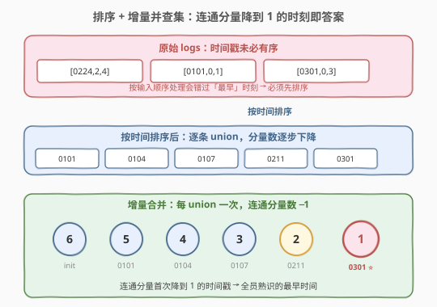
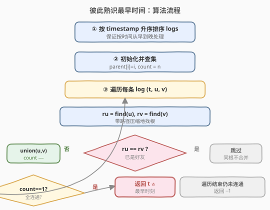
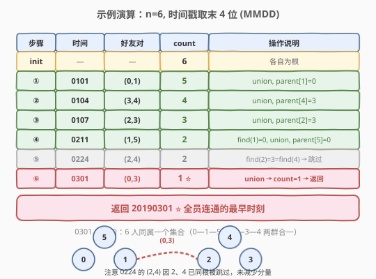

# LeetCode 彼此熟识的最早时间 题解

## 1. 题目概述

- **标题 / 题号**：彼此熟识的最早时间（#1101，medium）
- **链接**：https://leetcode.cn/problems/the-earliest-moment-when-everyone-become-friends/
- **难度**：中等
- **标签**：并查集、排序、图

**题意**：在一个社交群体中，有 `n` 个人，编号从 `0` 到 `n-1`。给你一份日志 `logs`，其中每条 `logs[i] = [timestamp_i, x_i, y_i]` 表示在时间 `timestamp_i` 时，人 `x_i` 和人 `y_i` 成为好友。

好友关系具有**传递性**：若 A 和 B 是好友、B 和 C 是好友，则 A 和 C 也算好友（即同一连通分量内的人彼此熟识）。

请你返回**所有人都彼此熟识的最早时间**——即整个群体首次连成一个连通分量的最小时间戳。如果不存在这样的时刻，返回 `-1`。

**示例 1**：

```text
输入：logs = [[20190101,0,1],[20190104,3,4],[20190107,2,3],[20190211,1,5],[20190224,2,4],[20190301,0,3],[20190312,1,2]], n = 6
输出：20190301
解释：
最早所有人成为好友的时刻是 20190301：此时 (0,3) 合并把 {0,1,5} 与 {2,3,4} 两群连为一体。
注意 20190224 的 (2,4) 因 2、4 此时已同属一群被跳过。
```

**示例 2**：

```text
输入：logs = [[1,0,1],[2,1,2],[3,2,3]], n = 5
输出：-1
解释：
经过三次合并后 0、1、2、3 连通，但编号 4 的人从未出现，始终孤立，故返回 -1。
```

**约束**：

- `1 <= n <= 100`
- `2 <= logs.length <= 4 * 10^4`
- `logs[i].length == 3`
- `0 <= timestamp_i <= 10^9`
- `0 <= x_i, y_i < n`，`x_i != y_i`
- 所有时间戳各不相同
- 同一对好友关系至多出现一次

> ⚠️ 注意：好友关系的传递性意味着只需关注**连通分量**的数量；要求「最早」时刻，意味着必须按时间**从早到晚**处理事件——这正是排序 + 并查集增量合并的典型场景。

## 2. 解题思路

### 2.1 暴力思路

枚举每个时间戳 `t` 作为候选答案，把所有 `timestamp <= t` 的好友关系建成图，跑一次 BFS/DFS 判断是否全连通。共 `m` 个时间戳、每次建图 + 遍历 `O(n + m)`，总时间 $O(m(n + m))$。在 `m = 4 \times 10^4` 时可达 $10^9$ 量级，会超时；且每次重建图**重复利用不到前一次的结果**。

### 2.2 核心观察：排序 + 增量并查集



两个关键观察让问题从暴力降到近线性：

1. **「最早」要求按时间序处理**：`logs` 的输入顺序未必按时间排列，必须先按 `timestamp` **升序排序**，这样逐条处理时，第一次让全图连通的日志就是答案。

2. **好友关系只增不减，适合增量并查集**：每条日志只是「新增一条边」，不会撤销。用并查集 `union` 一次合并两个集合，连通分量数 `count` 减一；当 `count` 首次降到 `1` 时，当前日志的时间戳即为答案。

> 💡 **关键转化**：把「在时刻 `t` 是否全连通」的**反复判定**问题，转化为「按时间序逐条合并，盯住分量数何时归一」的**单趟扫描**问题。并查集每次合并 $O(\alpha(n))$ 近似常数，总时间由排序主导。

这与 [684. 冗余连接](../0601-0700/684_冗余连接.md) 的并查集模板同源：684 用「`union` 失败」判环边，本题用「`union` 成功后 `count == 1`」判全连通。

### 2.3 算法流程图



流程要点：

1. **排序**：按 `timestamp` 升序排 `logs`，保证按时间从早到晚处理。
2. **初始化**：`parent[i] = i`，`rank` 全 0，连通分量数 `count = n`。
3. **逐条合并**：对每条 `(t, u, v)`，`find` 两端根；不同根则 `union` 并 `count--`。
4. **命中即返回**：合并后若 `count == 1`，立即返回 `t`（已保证是最早时刻，因为按时间序处理）。
5. **兜底**：遍历结束仍未连通，返回 `-1`。

> ⚠️ **为什么命中即是最早？** 因为日志已按时间升序排列，第一次让 `count` 降到 `1` 的日志时间戳严格不大于其后任何日志。无需继续扫描，直接返回即可——这是**提前终止**的依据。

### 2.4 示例演算



以 `n = 6` 的示例 1 为例（时间戳取末 4 位 MMDD 便于展示），初始 `count = 6`：

| 步骤 | 时间 | 好友对 | count | 操作说明 |
|------|------|--------|-------|----------|
| init | — | — | 6 | `parent=[0,1,2,3,4,5]`，各自为根 |
| ① | 0101 | (0,1) | 5 | `union`，`parent[1]=0` |
| ② | 0104 | (3,4) | 4 | `union`，`parent[4]=3` |
| ③ | 0107 | (2,3) | 3 | `union`，`parent[2]=3` |
| ④ | 0211 | (1,5) | 2 | `find(1)=0`，`union`，`parent[5]=0` |
| ⑤ | 0224 | (2,4) | 2 | `find(2)=3=find(4)` → **跳过** |
| ⑥ | 0301 | (0,3) | 1 | `union` → `count=1` → **返回 20190301** |

第 ⑤ 步 `(2,4)`：此时 `2 → 3`，`4 → 3`，两端已同根，这条边是「多余的好友关系」（两人早已通过 `2-3-4` 间接熟识），跳过不减分量。第 ⑥ 步 `(0,3)` 才把 `{0,1,5}` 与 `{2,3,4}` 两群合一，`count` 首次降到 `1`。

## 3. 参考代码

### C++（并查集 + 路径压缩 + 按秩合并 + 分量计数）

```cpp
class Solution {
  public:
    int find(vector<int>& parent, int x) {
        if (parent[x] != x) parent[x] = find(parent, parent[x]);   // 路径压缩
        return parent[x];
    }

    int earliestAcq(vector<vector<int>>& logs, int n) {
        // 1. 按时间戳升序排序
        sort(logs.begin(), logs.end(),
             [](const auto& a, const auto& b) { return a[0] < b[0]; });

        // 2. 初始化并查集
        vector<int> parent(n), rank_(n, 0);
        for (int i = 0; i < n; ++i) parent[i] = i;
        int count = n;                                            // 连通分量数

        // 3. 按时间序逐条合并
        for (auto& log : logs) {
            int t = log[0], u = log[1], v = log[2];
            int ru = find(parent, u), rv = find(parent, v);
            if (ru == rv) continue;                               // 已同根，跳过
            // 按秩合并
            if (rank_[ru] < rank_[rv]) parent[ru] = rv;
            else if (rank_[ru] > rank_[rv]) parent[rv] = ru;
            else { parent[rv] = ru; rank_[ru]++; }
            if (--count == 1) return t;                           // 全连通，命中即返回
        }
        return -1;                                                // 始终未全连通
    }
};
```

### Python（并查集 + 路径压缩 + 按秩合并 + 分量计数）

```python
class Solution:
    def earliestAcq(self, logs: List[List[int]], n: int) -> int:
        # 1. 按时间戳升序排序
        logs.sort(key=lambda x: x[0])

        # 2. 初始化并查集
        parent = list(range(n))
        rank_ = [0] * n
        count = n

        def find(x: int) -> int:
            while parent[x] != x:
                parent[x] = parent[parent[x]]                     # 隔代压缩
                x = parent[x]
            return x

        # 3. 按时间序逐条合并
        for t, u, v in logs:
            ru, rv = find(u), find(v)
            if ru == rv:
                continue                                          # 已同根，跳过
            if rank_[ru] < rank_[rv]:
                parent[ru] = rv
            elif rank_[ru] > rank_[rv]:
                parent[rv] = ru
            else:
                parent[rv] = ru
                rank_[ru] += 1
            count -= 1
            if count == 1:                                        # 全连通，命中即返回
                return t
        return -1                                                 # 始终未全连通
```

## 4. 复杂度分析

| 维度 | 复杂度 | 说明 |
|------|--------|------|
| 时间复杂度 | $O(m \log m + m \, \alpha(n))$ | 排序 $O(m \log m)$ 为主导；$m$ 次合并每次 $O(\alpha(n))$ 近似常数，总计 $O(m \, \alpha(n))$ |
| 空间复杂度 | $O(n)$ | `parent` 与 `rank_` 数组各 $O(n)$；排序额外 $O(\log m)$ 栈空间（不计输出） |

> 💡 $\alpha(n) \le 5$（本题 $n \le 100$ 范围内），并查集部分实际等同于 $O(m)$，整体瓶颈在排序 $O(m \log m)$。$m = 4 \times 10^4$ 时约 $6 \times 10^5$ 次比较，远低于时限。

## 5. 扩展：提前终止与连通判定

1. **提前终止的可行性**：因为日志已按时间升序排列，第一次让 `count` 降到 `1` 的时间戳必然是最小的——无需扫描剩余日志。最坏情况下（全连通发生在最后一条、或始终不连通）仍需遍历全部 `m` 条，但平均可省去尾部无用扫描。

2. **与 Kruskal 最小生成树的关系**：本题本质是 Kruskal 算法的「判停」变体——Kruskal 按边权排序、逐条合并、合并 `n−1` 次即得 MST；本题按时间戳排序、逐条合并、`count` 归一即停。可参考 [1584. 连接所有点的最小费用](../1501-1584/1584_连接所有点的最小费用.md) 的 Prim/Kruskal 写法。

3. **为何不用 BFS 反复重建图**：好友关系只增不减，并查集的增量合并能 $O(\alpha)$ 复用前序状态；BFS 每次需 $O(n + m)$ 重建，且无法利用「上一时刻已连通」的信息。这类「在线加边 + 周期性连通判定」正是并查集的舒适区。

> 💡 判断是否该用「排序 + 增量并查集」的信号：事件带时间戳、关系只增不减、要求首次满足某连通条件——三者齐备即为此模板。

## 6. 面试要点

1. **为什么要先排序？**

   - 题目求「最早」时刻，而 `logs` 输入顺序未必按时间排列。若不排序，先处理到的一条让全连通的日志时间戳可能并非最小。按 `timestamp` 升序排序后，首次让 `count == 1` 的日志天然就是答案。

2. **如何判断「所有人都熟识」？**

   - 维护连通分量数 `count`，初始为 `n`。每次成功 `union`（两端不同根）让 `count--`。当 `count == 1` 时，所有人在同一集合，即彼此熟识。这比每次遍历 `parent` 数根更高效（$O(1)$ 判定 vs $O(n)$ 数根）。

3. **为什么 `union` 成功后 `count` 一定减一？**

   - `union` 前先 `find` 两端根 `ru`、`rv`，只在 `ru != rv` 时合并——把两个不同集合并为一个，连通分量数恰减一。若 `ru == rv`（已同根），跳过，`count` 不变。

4. **时间戳可能很大（$10^9$），需要离散化吗？**

   - 不需要。我们只把时间戳作为排序键和返回值，不把它当作数组下标。排序直接比较整数即可，无需值域数组或离散化。

5. **为什么提前返回 `t` 是正确的？**

   - 日志已按时间升序排列，当前 `t` 不大于其后任何日志的时间戳。既然 `count` 已降到 `1`，更早的时刻无法满足全连通（前面所有日志都已处理过），故 `t` 就是最小答案，立即返回即可。

## 同类练习题

| # | 题目 | 与本题的关联 |
|---|------|-------------|
| 547 | [省份数量](https://leetcode.cn/problems/number-of-provinces/)（[题解](../0501-0600/547_省份数量.md)） | 同一并查集模板，统计最终连通分量个数，与本题「盯住分量归一」对照 |
| 684 | [冗余连接](https://leetcode.cn/problems/redundant-connection/)（[题解](../0601-0700/684_冗余连接.md)） | 并查集逐条加边，用「union 失败」判环边，与本题「union 成功判全连通」互补 |
| 1319 | [连通网络的操作次数](https://leetcode.cn/problems/number-of-operations-to-make-network-connected/) | 并查集数连通分量 + 冗余线缆数，求最少操作使全连通 |
| 1584 | [连接所有点的最小费用](https://leetcode.cn/problems/min-cost-to-connect-all-points/)（[题解](../1501-1584/1584_连接所有点的最小费用.md)） | Kruskal 按边权排序 + 并查集，本题按时间戳排序的「MST 判停」变体 |
| 721 | [账户合并](https://leetcode.cn/problems/accounts-merge/) | 并查集合并字符串键（邮箱），模板进阶到「哈希映射 + 并查集」 |
