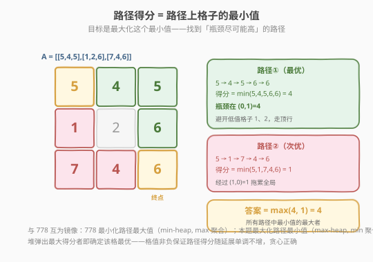
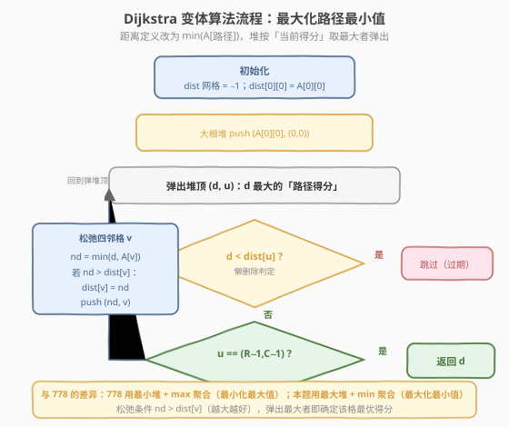
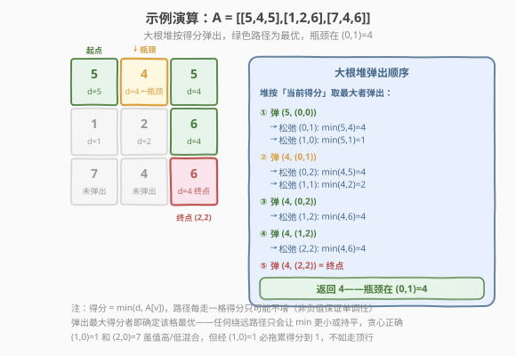

# 得分最高的路径

- **题目名称**：得分最高的路径
- **链接**：[1102. 得分最高的路径](https://leetcode.cn/problems/path-with-maximum-minimum-value/)
- **难度**：中等
- **标签**：图、最短路径、Dijkstra、堆/优先队列、并查集、二分查找、矩阵

## 1. 题目概述

给定一个 $R \times C$ 的整数矩阵 `A`，从左上角 $(0, 0)$ 出发，每步可以向上、下、左、右四个方向移动，目标是到达右下角 $(R-1,\ C-1)$。

一条路径的**得分**定义为该路径上所有格子值的**最小值**。请你返回所有路径中得分的**最大值**。

**示例 1**：

```text
输入：A = [[5,4,5],[1,2,6],[7,4,6]]
输出：4
解释：最优路径为 (0,0)→(0,1)→(0,2)→(1,2)→(2,2)
      经过的值为 5→4→5→6→6，最小值为 4。
      其他路径必经 (1,0)=1 或 (1,1)=2，得分更低。
```

**示例 2**：

```text
输入：A = [[2,2,1,2,2,2],[1,2,2,2,1,2]]
输出：2
解释：最优路径 (0,0)→(0,1)→(1,1)→(1,2)→(1,3)→(0,3)→(0,4)→(0,5)→(1,5)
      全程值为 2，最小值为 2。任何经过 1 的路径得分都会降到 1。
```

**约束条件**：

- $R == \text{A.length}$
- $C == \text{A}[i].\text{length}$
- $1 \le R,\ C \le 100$
- $0 \le \text{A}[i][j] \le 10^9$

> ⚠️ 注意：本题是 [778. 水位上升的泳池中游泳](../0701-0800/778_水位上升的泳池中游泳.md) 的**镜像变体**——778 求「最小化路径最大值」，本题求「最大化路径最小值」。两者仅差在聚合方向（max↔min）和堆的取向（min-heap↔max-heap），模板完全对称。

---

## 2. 解题思路

### 2.1 暴力思路

枚举从 $(0,0)$ 到 $(R-1,C-1)$ 的所有路径，对每条路径取最小值，再取所有路径最小值的最大。但网格路径数量是指数级的（$4^{R \times C}$），完全不可行。

退一步：固定一个阈值 $t$，用 BFS/DFS 判定「只走值 $\ge t$ 的格子，能否从起点到达终点」。枚举所有可能的 $t$ 取最大可行者。每次验证 $O(R \times C)$，若对所有 $0 \sim 10^9$ 逐一枚举则不可接受，但可结合二分优化（见第 5 节）。

### 2.2 核心观察：Dijkstra 变体——最大化路径最小值



把每个格子看作图中的节点，相邻格子之间有无权边。定义**路径得分**为路径上所有格子值的最小值：

$$\text{score}(\text{路径}) = \min_{(i,j) \in \text{路径}} \text{A}[i][j]$$

目标是求所有 $(0,0)\to(R-1,C-1)$ 路径中得分最大者。这与 [743. 网络延迟时间](../0701-0800/743_网络延迟时间.md) 的标准 Dijkstra（路径代价 = 边权之和）仅差在「聚合方式」：**累加 → 取最小**，且堆从「最小堆」翻转为「最大堆」。

- 维护 `dist[i][j]` = 从 $(0,0)$ 到 $(i,j)$ 的「最大最小值」估计，初始 `dist[0][0] = A[0][0]`，其余为 $-1$。
- **最大堆**存放 `(当前路径得分, r, c)`，每次取出得分最大的格子 `u`。
- **松弛**邻格 $v$：`nd = min(d, A[v])`；若 `nd > dist[v]`，更新并入堆。
- 当首次弹出 $(R-1,C-1)$ 时，其 `d` 即为答案。

> 💡 **贪心正确性**：格值非负，路径得分 `min(d, A[v])` 关于路径延展**单调不增**——走得越远，min 只会持平或变小。被最大堆弹出的 `d` 最大的格子，其 `dist` 已不可能被更大的值更新——任何"绕远"的路径只会让 `min` 更小或持平。所以弹出的格子得分就此确定，与标准 Dijkstra 同理。

> ⚠️ 注意 `dist` 初始化为 $-1$ 而非 $0$：格值可以为 $0$，用 $-1$ 表示"未访问"避免与合法得分 $0$ 混淆。松弛条件是 `nd > dist[v]`（越大越好），与 778 的 `nd < dist[v]`（越小越好）方向相反。

### 2.3 算法流程图



### 2.4 示例演算

以示例 1 的 $3 \times 3$ 网格 `[[5,4,5],[1,2,6],[7,4,6]]` 为例。大根堆从 $(0,0)=5$ 出发，按得分从大到小逐格扩散：



| 步骤 | 弹出 (d, 格子) | 松弛邻格 | 关键 dist 变化 |
|------|---------------|---------|---------------|
| 1 | (5, (0,0)) | (0,1): min(5,4)=4; (1,0): min(5,1)=1 | (0,1)=4, (1,0)=1 |
| 2 | (4, (0,1)) | (0,2): min(4,5)=4; (1,1): min(4,2)=2 | (0,2)=4, (1,1)=2 |
| 3 | (4, (0,2)) | (1,2): min(4,6)=4 | (1,2)=4 |
| 4 | (4, (1,2)) | (2,2): min(4,6)=4; (1,1): min(4,2)=2（无更新） | (2,2)=4 |
| 5 | (4, (2,2)) | 到达终点 | 返回 4 |

> 💡 观察第 1 步：$(0,1)=4$ 的得分高于 $(1,0)=1$（因为经过 $(1,0)=1$ 会把得分拖到 $1$），所以大根堆优先弹出 $(0,1)$。后续沿顶行扩散，得分始终维持在 $4$——瓶颈就是 $(0,1)=4$ 这一个"低洼"格子。任意经过 $(1,0)=1$ 的路径得分最多为 $1$，远不如走顶行。

---

## 3. 参考代码

### 方法一：Dijkstra 变体（推荐）

### C++

```cpp
class Solution {
  public:
    int maximumMinimumPath(vector<vector<int>>& A) {
        int R = A.size(), C = A[0].size();
        vector<vector<int>> dist(R, vector<int>(C, -1));
        dist[0][0] = A[0][0];

        // 大根堆：(当前路径得分, r, c)
        priority_queue<tuple<int, int, int>> pq;
        pq.push({A[0][0], 0, 0});

        int dr[] = {1, -1, 0, 0};
        int dc[] = {0, 0, 1, -1};
        while (!pq.empty()) {
            auto [d, r, c] = pq.top();
            pq.pop();
            if (d < dist[r][c]) continue;          // 懒删除：旧记录已失效
            if (r == R - 1 && c == C - 1) return d;
            for (int k = 0; k < 4; ++k) {
                int nr = r + dr[k], nc = c + dc[k];
                if (nr < 0 || nr >= R || nc < 0 || nc >= C) continue;
                int nd = min(d, A[nr][nc]);        // 路径得分取最小值
                if (nd > dist[nr][nc]) {           // 越大越好
                    dist[nr][nc] = nd;
                    pq.push({nd, nr, nc});
                }
            }
        }
        return -1;                                 // 本题保证可达
    }
};
```

### Python

```python
class Solution:
    def maximumMinimumPath(self, A: List[List[int]]) -> int:
        R, C = len(A), len(A[0])
        dist = [[-1] * C for _ in range(R)]
        dist[0][0] = A[0][0]

        pq = [(-A[0][0], 0, 0)]  # 大根堆：取负模拟
        while pq:
            d, r, c = heapq.heappop(pq)
            d = -d
            if d < dist[r][c]:          # 懒删除：旧记录已失效
                continue
            if (r, c) == (R - 1, C - 1):
                return d
            for nr, nc in ((r + 1, c), (r - 1, c), (r, c + 1), (r, c - 1)):
                if 0 <= nr < R and 0 <= nc < C:
                    nd = min(d, A[nr][nc])   # 路径得分取最小值
                    if nd > dist[nr][nc]:    # 越大越好
                        dist[nr][nc] = nd
                        heapq.heappush(pq, (-nd, nr, nc))
        return -1
```

> 💡 **与 778 的唯一差异**：松弛时把 `nd = max(d, grid[v])` 换成 `nd = min(d, A[v])`，堆从最小堆换成最大堆，松弛条件从 `nd < dist[v]` 换成 `nd > dist[v]`。模板完全复用 [743](../0701-0800/743_网络延迟时间.md) 的懒删除写法。Python 无内置大根堆，用取负 trick 模拟。

---

## 4. 复杂度分析

| 维度 | 复杂度 | 说明 |
|------|--------|------|
| 时间复杂度 | $O(R \cdot C \cdot \log(R \cdot C))$ | 共 $R \times C$ 个格子，每个最多入堆 4 次（四邻格各松弛一次），堆操作 $O(\log(R \cdot C))$ |
| 空间复杂度 | $O(R \cdot C)$ | `dist` 网格 $O(R \cdot C)$、堆最坏 $O(R \cdot C)$ |

> ⚠️ 本题 $R, C \le 100$，$R \times C \le 10^4$，$\log \approx 14$，总计约 $5.6 \times 10^4$ 次堆操作，非常快。**面试首选 Dijkstra 变体**：单趟扫描、无需二分外层、且模板可迁移到 778/1631 等同类题。

---

## 5. 扩展：并查集 / 二分答案

本题有三种主流解法，思路同源（都围绕「路径得分 = 路径最小值」的转化），但实现路径不同。

### 方法二：并查集（按值降序激活）

把所有格子按值**降序排序**，依次"激活"（从最高值开始）。每激活一个格子，就把它与**已激活**的相邻格子 `union`。当首次出现 `find(0) == find(R*C - 1)`（起点与终点连通）时，当前格子的值即为答案。

这是 [778](../0701-0800/778_水位上升的泳池中游泳.md) 方法三「水位上升」的镜像：778 按高度**升序**激活（求最小淹没水位），本题按值**降序**激活（求最大可行阈值）。承接 [547. 省份数量](../0501-0600/547_省份数量.md) 的并查集模板。

```python
class Solution:
    def maximumMinimumPath(self, A: List[List[int]]) -> int:
        R, C = len(A), len(A[0])
        parent = list(range(R * C))

        def find(x):
            while parent[x] != x:
                parent[x] = parent[parent[x]]  # 路径压缩
                x = parent[x]
            return x

        def union(a, b):
            ra, rb = find(a), find(b)
            if ra != rb:
                parent[ra] = rb

        # 按值降序排序
        cells = sorted(((A[r][c], r, c) for r in range(R) for c in range(C)),
                       reverse=True)
        seen = [[False] * C for _ in range(R)]
        for v, r, c in cells:
            seen[r][c] = True
            for nr, nc in ((r + 1, c), (r - 1, c), (r, c + 1), (r, c - 1)):
                if 0 <= nr < R and 0 <= nc < C and seen[nr][nc]:
                    union(r * C + c, nr * C + nc)
            if seen[0][0] and seen[R - 1][C - 1] and find(0) == find(R * C - 1):
                return v
        return -1
```

复杂度 $O(R \cdot C \cdot \log(R \cdot C))$（排序主导）。优点是直观：从高值往低值"拆墙"，拆到刚好连通时的阈值就是答案。

### 方法三：二分答案 + BFS

答案落在 $[0,\ \max(\text{A})]$ 上。对候选阈值 `mid`，用 BFS 判定只走 `A[i][j] >= mid` 的格子能否到达终点——这是 [二分答案](../0801-0900/875_爱吃香蕉的珂珂.md) 的标准信号：`can(mid)` 关于 `mid` 单调（阈值越低，可达区域越大）。

```python
class Solution:
    def maximumMinimumPath(self, A: List[List[int]]) -> int:
        R, C = len(A), len(A[0])
        # 去重排序所有可能值，缩小二分范围
        vals = sorted(set(A[r][c] for r in range(R) for c in range(C)))

        def can(t: int) -> bool:
            if A[0][0] < t or A[R - 1][C - 1] < t:
                return False
            seen = [[False] * C for _ in range(R)]
            q = deque([(0, 0)])
            seen[0][0] = True
            while q:
                r, c = q.popleft()
                if (r, c) == (R - 1, C - 1):
                    return True
                for nr, nc in ((r + 1, c), (r - 1, c), (r, c + 1), (r, c - 1)):
                    if 0 <= nr < R and 0 <= nc < C and not seen[nr][nc] and A[nr][nc] >= t:
                        seen[nr][nc] = True
                        q.append((nr, nc))
            return False

        lo, hi = 0, len(vals) - 1
        while lo < hi:
            mid = (lo + hi + 1) // 2  # 上取整防死循环
            if can(vals[mid]):
                lo = mid
            else:
                hi = mid - 1
        return vals[lo]
```

复杂度 $O(R \cdot C \cdot \log(R \cdot C))$，与 Dijkstra 变体同阶，但常数更大（多次 BFS）。优点是思路最直白。

三种方法对照：

| 方法 | 核心思想 | 优势 |
|------|---------|------|
| **Dijkstra 变体** | 最大化路径最小值 | 单趟扫描、模板通用（推荐） |
| 并查集 | 按值降序增量激活 + 连通性 | 贴合"拆墙"直觉 |
| 二分 + BFS | 单调判定 + 连通性 | 思路最直白 |

---

## 6. 面试要点

1. **为什么能转化为「最大化路径最小值」的最短路？**

   - 一条路径的得分 = 路径上所有格子值的最小值。求所有路径中得分的最大值，就是「最大化路径最小值」——这正是 Dijkstra 变体的适用场景：把距离的聚合方式从求和改为取 min，堆从最小堆改为最大堆。

2. **Dijkstra 变体与标准 Dijkstra 有何异同？为什么贪心仍正确？**

   - 相同：都用堆 + 懒删除，弹出最优者即确定其最短路。
   - 不同：松弛时代价由 `d + w` 改为 `min(d, A[v])`；堆从最小堆改为最大堆；松弛条件从 `nd < dist[v]` 改为 `nd > dist[v]`。
   - 正确性：格值非负 ⟹ 路径得分随延展单调不增 ⟹ 弹出的最大得分者不会被更大值更新，贪心假设成立。

3. **与 778 的具体差异是什么？**

   - 778 求「最小化路径最大值」：最小堆，`nd = max(d, grid[v])`，松弛条件 `nd < dist[v]`，`dist` 初始化为 $\infty$。
   - 本题求「最大化路径最小值」：最大堆，`nd = min(d, A[v])`，松弛条件 `nd > dist[v]`，`dist` 初始化为 $-1$。
   - 两者的代码结构完全对称，只是 max/min、堆方向、不等号方向三者同时翻转。

4. **为什么 `dist` 初始化为 $-1$ 而不是 $0$？**

   - 格值可以为 $0$（约束 $0 \le \text{A}[i][j]$）。若用 $0$ 表示"未访问"，则无法区分"未访问"与"合法得分 $0$"。用 $-1$ 作为哨兵可以避免歧义。

5. **二分答案 + BFS 与 Dijkstra 变体复杂度都是 $O(R \cdot C \cdot \log(R \cdot C))$，如何选？**

   - Dijkstra 变体单趟扫描、常数小、且模板可迁移到 778/1631 等同类题，面试首选。
   - 二分 + BFS 思路最直白，适合作为引出问题的第一步分析，或当堆实现不熟时的稳妥退路。
   - 并查集适合强调"按值降序拆墙"的物理直觉，或题目变体涉及"连通时刻"查询时。

6. **并查集解法中，为什么按值降序激活能保证答案正确？**

   - 激活到值为 $v$ 的格子时，所有值 $\ge v$ 的格子都已入连通块。第一次出现 `find(0) == find(R*C-1)` 的 $v$，恰是使起点终点连通的"最大可行阈值"——即路径得分的最大值。因为从高到低激活，越早连通说明阈值越高（越优）。

---

## 7. 同类练习题

- [778. 水位上升的泳池中游泳](https://leetcode.cn/problems/swim-in-rising-water/)（[题解](../0701-0800/778_水位上升的泳池中游泳.md)）：镜像母题——最小化路径最大值，最小堆 + max 聚合，模板完全对称
- [1631. 最小体力消耗路径](https://leetcode.cn/problems/path-with-minimum-effort/)：同一 Dijkstra 变体，路径代价改为「相邻格高度差的最大值」，模板完全复用
- [743. 网络延迟时间](https://leetcode.cn/problems/network-delay-time/)（[题解](../0701-0800/743_网络延迟时间.md)）：标准堆优化 Dijkstra（代价 = 边权和），本题的母模板
- [407. 接雨水 II](https://leetcode.cn/problems/trapping-rain-water-ii/)：3D 接雨水，同样用最小堆按"当前最低边界"扩展，与本题堆思路相通
- [547. 省份数量](https://leetcode.cn/problems/number-of-provinces/)（[题解](../0501-0600/547_省份数量.md)）：并查集模板，为方法二的增量连通提供基础
