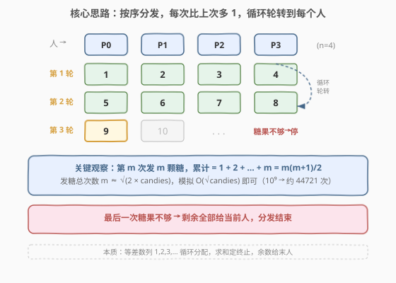
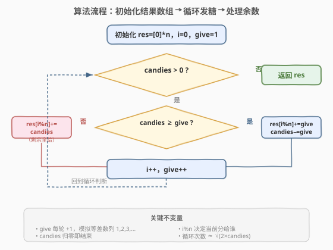

# 分糖果 II

- **题目名称**：分糖果 II
- **链接**：[1103. 分糖果 II](https://leetcode.cn/problems/distribute-candies-to-people/)
- **难度**：简单
- **标签**：数组、数学、模拟

## 1. 题目概述

我们有 `candies` 颗糖果，要分给排成一行的 `num_people = n` 个人。分发规则如下：

- 第 1 次给第 1 个人分 **1** 颗，第 2 次给第 2 个人分 **2** 颗，……，第 $n$ 次给第 $n$ 个人分 $n$ 颗；
- 然后循环回到第 1 个人，第 $n+1$ 次分 $n+1$ 颗，第 $n+2$ 次分 $n+2$ 颗，……；
- 如此反复，**每次比上一次多分 1 颗**，直到糖果不够下一次的完整数量——剩余的糖果全部给当前这个人，分发结束。

返回一个长度为 `num_people` 的数组，表示每个人最终得到的糖果数。

**示例 1**：

```text
输入：candies = 7, num_people = 4
输出：[1,2,3,1]
解释：
第 1 次给第 1 人 1 颗（剩 6），第 2 次给第 2 人 2 颗（剩 4），
第 3 次给第 3 人 3 颗（剩 1），第 4 次需 4 颗但仅剩 1 → 第 4 人得 1 颗。
```

**示例 2**：

```text
输入：candies = 10, num_people = 3
输出：[5,2,3]
解释：
第 1 次给第 1 人 1 颗（剩 9），第 2 次给第 2 人 2 颗（剩 7），
第 3 次给第 3 人 3 颗（剩 4），第 4 次给第 1 人 4 颗（剩 0）。
第 1 人共得 1+4=5 颗。
```

**约束条件**：

- $1 \le \text{candies} \le 10^9$
- $1 \le \text{num\_people} \le 1000$

> 💡 candies 高达 $10^9$，但**每次分发的数量是递增的**（1, 2, 3, …），所以分发次数 $m$ 满足 $\frac{m(m+1)}{2} \approx \text{candies}$，即 $m \approx \sqrt{2 \times \text{candies}} \approx 44721$。这个量级**直接模拟就够快**，无需复杂优化。

---

## 2. 解题思路

### 2.1 暴力思路：逐次模拟

最直觉的做法就是**忠实模拟分发过程**：维护一个结果数组 `res`，从第 1 次开始，每次给第 `i % n` 个人分发 `give` 颗糖果（`give` 从 1 开始每次 +1），糖果不够时把剩余全给当前人。关键在于判断这个模拟是否够快——由上面的分析，循环次数约为 $\sqrt{2 \times \text{candies}}$，对 $10^9$ 级别只需约 44721 次，完全可以接受。

### 2.2 核心观察：等差数列求和定终止



分发的糖果数量构成等差数列 $1, 2, 3, \ldots, m$，其中第 $m$ 次分发 $m$ 颗。关键观察：

- **累计分发量**：前 $m$ 次共分发 $\sum_{i=1}^{m} i = \frac{m(m+1)}{2}$ 颗糖果。
- **终止条件**：找到最大的 $m$ 使得 $\frac{m(m+1)}{2} \le \text{candies}$，此时前 $m$ 次能完整发放，剩余 $\text{candies} - \frac{m(m+1)}{2}$ 颗给第 $m+1$ 次对应的人。
- **循环轮转**：第 $i$ 次（从 0 开始）分给第 $i \bmod n$ 个人，天然实现循环轮转。

> 💡 **为什么模拟是 $O(\sqrt{\text{candies}})$ 而非 $O(\text{candies})$**：每次分发的数量线性增长，累计分发量是**二次**增长（$\frac{m(m+1)}{2}$），所以追上 candies 只需 $\sqrt{2 \times \text{candies}}$ 步。这与 [441. 排列硬币](../0401-0500/441_排列硬币.md) 的「阶梯求和定行数」、[754. 到达终点数字](../0701-0800/754_到达终点数字.md) 的「累加 $S_k$ 追 target」是同一个 $\sqrt{n}$ 降维思想。

### 2.3 算法流程图



**完整步骤**：

1. **初始化**：`res = [0] * n`，分发计数 `i = 0`，当前分发量 `give = 1`
2. **循环分发**（`while candies > 0`）：
   - 若 `candies >= give`：`res[i % n] += give`，`candies -= give`（完整发放）
   - 若 `candies < give`：`res[i % n] += candies`，`candies = 0`（余数全给）
   - `i += 1`，`give += 1`
3. **返回** `res`

> ⚠️ **余数处理**：当 `candies < give` 时，不需要分发 `give` 颗，而是把**剩余的全部**给当前人。这保证了糖果恰好分完，不会多也不会少。

### 2.4 示例演算

以 `candies = 7, num_people = 4` 为例：

![示例演算：candies=7, n=4 → [1, 2, 3, 1]](../images/distribute_candies_ii_walkthrough.svg)

| 步骤 | 分给谁 | give | 操作 | res 状态 | 剩余 candies |
|------|--------|------|------|----------|-------------|
| 初始 | — | 1 | 开始分发 | `[0, 0, 0, 0]` | 7 |
| 第 1 次 | P0 (i=0) | 1 | 7 ≥ 1，完整给 1 | `[1, 0, 0, 0]` | 6 |
| 第 2 次 | P1 (i=1) | 2 | 6 ≥ 2，完整给 2 | `[1, 2, 0, 0]` | 4 |
| 第 3 次 | P2 (i=2) | 3 | 4 ≥ 3，完整给 3 | `[1, 2, 3, 0]` | 1 |
| 第 4 次 | P3 (i=3) | 4 | 1 < 4，**余数全给** | `[1, 2, 3, 1]` | 0 |

验证：前 3 次完整发放 $1+2+3 = 6 \le 7$，第 4 次需 4 但仅剩 1 → P3 得 1 颗。最终 `[1, 2, 3, 1]` ✓

> 💡 **`i % n` 的作用**：第 $i$ 次（从 0 计数）分给第 $i \bmod n$ 个人。$i=0 \to \text{P0}$，$i=1 \to \text{P1}$，…，$i=n \to \text{P0}$（第二轮），天然实现循环轮转，无需显式管理"第几轮"。

---

## 3. 参考代码

### C++

```cpp
// 分糖果II.cpp —— 模拟分发
// 编译: g++ -O2 -std=c++17 分糖果II.cpp -o candies
class Solution {
public:
    vector<int> distributeCandies(int candies, int num_people) {
        vector<int> res(num_people, 0);
        int i = 0, give = 1;
        while (candies > 0) {
            if (candies >= give) {
                res[i % num_people] += give;    // 完整发放
                candies -= give;
            } else {
                res[i % num_people] += candies; // 余数全给
                candies = 0;
            }
            i++;
            give++;
        }
        return res;
    }
};
```

### Python

```python
class Solution:
    def distributeCandies(self, candies: int, num_people: int) -> List[int]:
        res = [0] * num_people
        i, give = 0, 1
        while candies > 0:
            if candies >= give:
                res[i % num_people] += give     # 完整发放
                candies -= give
            else:
                res[i % num_people] += candies  # 余数全给
                candies = 0
            i += 1
            give += 1
        return res
```

> 💡 **写法要点**：① `give` 从 1 开始，每轮 `+1`，模拟等差数列 $1, 2, 3, \ldots$。② `i % num_people` 自动循环定位当前人，无需显式跟踪轮次。③ `candies < give` 时把剩余全给当前人后置 `candies = 0`，循环自然终止。④ 也可以用 `min(candies, give)` 合并两个分支：`actual = min(candies, give); res[i % n] += actual; candies -= actual`，更简洁但可读性略降。

---

## 4. 复杂度分析

| 维度 | 模拟法 | 数学公式法 |
|------|--------|-----------|
| **时间** | $O(\sqrt{\text{candies}})$ | $O(n)$ |
| **空间** | $O(n)$ | $O(n)$ |
| **思路复杂度** | 简单直观 | 需推导等差数列求和 |

> ⚠️ **时间 $O(\sqrt{\text{candies}})$**：循环次数 $m$ 满足 $\frac{m(m+1)}{2} \le \text{candies}$，故 $m \approx \sqrt{2 \times \text{candies}}$。当 $\text{candies} = 10^9$ 时 $m \approx 44721$，远低于超时阈值。空间 $O(n)$ 为结果数组，不计额外开销。

---

## 5. 扩展：数学公式法 $O(n)$

模拟法虽然够快，但当 $n$ 远小于 $\sqrt{\text{candies}}$ 时（如 $n = 1$，candies = $10^9$），模拟需 44721 次循环而结果数组只有 1 个元素。可以用**等差数列求和公式**直接算出每个人得到的糖果数，做到 $O(n)$ 时间。

### 5.1 推导

设完整分发了 $m$ 次（第 1 到第 $m$ 次都能完整发放），则：

$$\frac{m(m+1)}{2} \le \text{candies} < \frac{(m+1)(m+2)}{2}$$

用求根公式解出 $m$：

$$m = \left\lfloor \frac{-1 + \sqrt{1 + 8 \times \text{candies}}}{2} \right\rfloor$$

剩余余数 $r = \text{candies} - \frac{m(m+1)}{2}$，给第 $m$ 次（从 0 计数）对应的人 $m \bmod n$。

对于第 $i$ 个人（$0 \le i < n$），其收到的完整发放出现在第 $i, i+n, i+2n, \ldots$ 次，构成首项 $a = i+1$、公差 $d = n$ 的等差数列。完整轮数 $\text{full} = m // n$，额外发放的人数为 $\text{extra} = m \% n$：

- 若 $i < \text{extra}$：该人得到 $\text{full} + 1$ 次完整发放
- 若 $i \ge \text{extra}$：该人得到 $\text{full}$ 次完整发放

等差数列求和（$c$ 项，首项 $a$，公差 $d$）：$S = c \cdot a + d \cdot \frac{c(c-1)}{2}$

### 5.2 代码

```python
import math

class Solution:
    def distributeCandies(self, candies: int, num_people: int) -> List[int]:
        n = num_people
        # 求完整发放次数 m：m(m+1)/2 <= candies
        m = (math.isqrt(1 + 8 * candies) - 1) // 2
        r = candies - m * (m + 1) // 2      # 余数

        full = m // n                        # 完整轮数
        extra = m % n                        # 额外发放人数

        res = []
        for i in range(n):
            c = full + 1 if i < extra else full
            # 等差数列求和：c 项，首项 i+1，公差 n
            total = c * (i + 1) + n * c * (c - 1) // 2
            res.append(total)

        if r > 0:                             # 余数给第 m % n 个人
            res[extra] += r
        return res
```

> 💡 **`math.isqrt` 的精度**：Python 的 `math.isqrt` 返回整数平方根（精确），无浮点误差。C++ 中需用 `(long long)sqrt(1.0 + 8.0 * c)` 并做 `±1` 修正以防浮点误差。注意 $8 \times \text{candies}$ 可达 $8 \times 10^9$，超过 32 位 `int` 范围，必须用 `long long`（C++）或 Python 原生大整数。

### 5.3 验证

以 `candies = 10, n = 3` 为例：

- $m = \lfloor\frac{-1 + \sqrt{81}}{2}\rfloor = \lfloor\frac{8}{2}\rfloor = 4$，$r = 10 - 10 = 0$
- $\text{full} = 4 // 3 = 1$，$\text{extra} = 4 \% 3 = 1$
- P0（$i=0 < 1$）：$c=2$，$S = 2 \times 1 + 3 \times \frac{2 \times 1}{2} = 2 + 3 = 5$ ✓
- P1（$i=1 \ge 1$）：$c=1$，$S = 1 \times 2 + 0 = 2$ ✓
- P2（$i=2 \ge 1$）：$c=1$，$S = 1 \times 3 + 0 = 3$ ✓
- 结果 `[5, 2, 3]` ✓

---

## 6. 面试要点

1. **candies 高达 $10^9$，模拟会不会超时？**

   > 不会。每次分发的数量递增（1, 2, 3, …），累计分发量是二次增长 $\frac{m(m+1)}{2}$，所以循环次数 $m \approx \sqrt{2 \times \text{candies}} \approx 44721$，远低于超时阈值。关键在于识别「分发量递增」这一条件，将表观的 $O(\text{candies})$ 降为 $O(\sqrt{\text{candies}})$。

2. **余数怎么处理？**

   > 当剩余糖果不足以发放当前次的完整数量时（`candies < give`），把剩余的**全部**给当前人，然后置 `candies = 0` 结束循环。这保证糖果恰好分完。也可以用 `min(candies, give)` 统一处理：实际发放量 = `min(candies, give)`。

3. **`i % n` 的作用是什么？为什么不需要显式管理轮次？**

   > 第 $i$ 次（从 0 计数）分给第 $i \bmod n$ 个人。取模运算天然实现循环轮转：$i = 0 \to$ P0，$i = n \to$ P0（第二轮），$i = 2n \to$ P0（第三轮）… 无需维护「当前是第几轮」的状态，代码更简洁。

4. **数学公式法什么时候比模拟更优？**

   > 当 $n \ll \sqrt{\text{candies}}$ 时。例如 $n = 1$，candies = $10^9$：模拟需 44721 次循环，而公式法只需 1 次计算。公式法用等差数列求和直接算出每个人的总量，时间为 $O(n)$。但公式法推导复杂、容易出错，面试中除非明确要求 $O(n)$，否则模拟法更稳妥。

5. **C++ 中计算 $m$ 时的溢出问题？**

   > $8 \times \text{candies}$ 可达 $8 \times 10^9$，超过 32 位 `int` 上界（约 $2.1 \times 10^9$）。必须用 `long long` 计算，且 `sqrt` 返回浮点数可能有精度误差，需在结果上做 `±1` 修正：`while ((m+1)*(m+2)/2 <= c) m++; while (m*(m+1)/2 > c) m--;`。Python 的 `math.isqrt` 是整数运算，无此问题。

> 💡 **一句话总结**：1103 的核心是识别「分发量递增」使模拟降为 $O(\sqrt{\text{candies}})$——等差数列 $1,2,3,\ldots$ 循环分配，取模定位当前人，余数全给末人。需要 $O(n)$ 时可用等差数列求和公式直接计算。与 [441. 排列硬币](../0401-0500/441_排列硬币.md) 共享 $\frac{m(m+1)}{2}$ 求和定终止的数学结构。

---

## 7. 同类练习题

- [441. 排列硬币](https://leetcode.cn/problems/arranging-coins/)（[题解](../0401-0500/441_排列硬币.md)）：同享 $\frac{m(m+1)}{2} \le n$ 求和定终止结构，求最大完整行数，$O(\log n)$ 二分或 $O(1)$ 求根公式
- [135. 分发糖果](https://leetcode.cn/problems/candy/)（[题解](../0101-0200/135_分发糖果.md)）：同为糖果分发主题，但规则不同（相邻评分需更多），考察两次贪心遍历，难度更高
- [575. 分糖果](https://leetcode.cn/problems/distribute-candies/)（[题解](../0501-0600/575_分糖果.md)）：糖果主题的简化版，用哈希集合求姐妹糖果对的最大种类数
- [400. 第 N 位数字](https://leetcode.cn/problems/nth-digit/)（[题解](../0301-0400/400_第N位数字.md)）：同为「用数学结构降维取代逐个枚举」——按位数分层定位第 $n$ 位，$O(\log n)$
- [754. 到达终点数字](https://leetcode.cn/problems/reach-a-number/)（[题解](../0701-0800/754_到达终点数字.md)）：累加 $S_k = \frac{k(k+1)}{2}$ 追赶 target，同为 $\sqrt{n}$ 级别的等差数列求和定位
