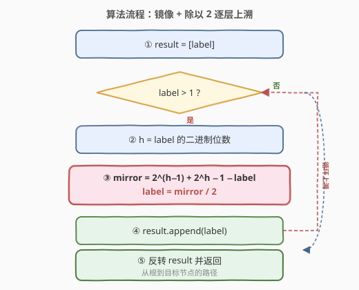
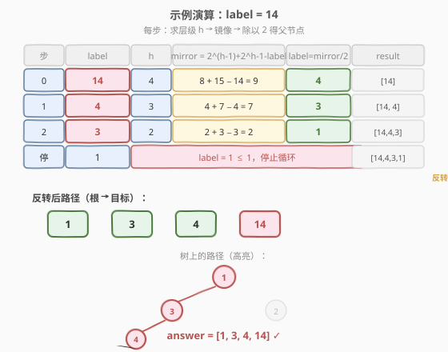

# LeetCode 二叉树寻路 题解

## 1. 题目概述

- **标题 / 题号**：二叉树寻路（#1104，medium）
- **链接**：https://leetcode.cn/problems/path-in-zigzag-labelled-binary-tree/
- **难度**：中等
- **标签**：数学、树、位运算

**题意**：在一棵**无限完全二叉树**中，每个节点都有两个子节点。节点按**行序**编号：第 1 层（根）只有 `1` 个节点，第 2 层 `2` 个，第 `h` 层 $2^{h-1}$ 个。

**Zigzag 编号规则**：奇数层（第 1、3、5…层）从左到右编号，偶数层（第 2、4、6…层）从右到左编号。即：

```text
第 1 层（奇）：              1
第 2 层（偶）：        3,          2
第 3 层（奇）：    4,    5,    6,    7
第 4 层（偶）：15,14,...,9, 8
第 5 层（奇）：16,17,...,31
...
```

给定一个节点标签 `label`，返回从**根节点到该节点**的路径上所有节点的标签列表。

**示例 1**：

```text
输入：label = 14
输出：[1,3,4,14]
解释：14 在第 4 层，路径 1 → 3 → 4 → 14
```

**示例 2**：

```text
输入：label = 26
输出：[1,2,6,10,26]
解释：26 在第 5 层，路径 1 → 2 → 6 → 10 → 26
```

**约束**：

- `1 <= label <= 10^6`

> 💡 关键在于偶数层的编号是**逆序**的，不能直接用「父节点 = label / 2」这条完全二叉树的常规公式。需要引入**镜像**操作，把 zigzag 标签与「正常顺序标签」互相转换。

## 2. 解题思路

### 2.1 暴力思路：模拟建树

直接按层模拟构建这棵无限二叉树，逐层生成节点标签并记录父子关系，直到覆盖 `label` 所在的层，再从 `label` 回溯到根。时间 $O(\text{label})$（要生成到 `label` 为止的所有节点），`label = 10^6` 时约生成百万节点，虽不超时但空间浪费大，且完全没有利用编号的数学规律。

### 2.2 核心观察：镜像 + 除以 2


**完全二叉树的编号规律**：在**正常顺序**（每层都从左到右）的完全二叉树中，节点 `x` 的父节点是 $\lfloor x / 2 \rfloor$，所在层 $h = \lfloor \log_2 x \rfloor + 1$。

**Zigzag 树的唯一干扰**：偶数层的编号被翻转了。如果能消除这层翻转，就能套用常规的 `x / 2` 求父公式。

**镜像操作**：第 $h$ 层的标签范围是 $[2^{h-1},\; 2^h - 1]$，共 $2^{h-1}$ 个节点。翻转前后的位置关于区间中心对称，因此「镜像标签」为：

$$
\text{mirror}(x, h) = 2^{h-1} + 2^h - 1 - x = 3 \times 2^{h-1} - 1 - x
$$

**镜像的物理意义**：镜像操作把 zigzag 标签转换为正常顺序标签（偶数层时），或把正常顺序标签转回 zigzag 标签。它是一个**对合**（involution）——镜像两次还原原值。

**求父节点的统一公式**：对当前 zigzag 标签 `label`（所在层 `h`），执行一次镜像再除以 2：

$$
\text{parent} = \lfloor \text{mirror}(\text{label}, h) / 2 \rfloor
$$

> 💡 **为什么 `mirror / 2` 直接就是父节点的 zigzag 标签？** 因为镜像和除以 2 的组合恰好覆盖了层间奇偶切换：
>
> | 当前层 `h` | 镜像的作用 | `/2` 后到达层 `h−1` | 再需镜像？ |
> |-----------|-----------|-------------------|-----------|
> | **偶数**（逆序） | zigzag → 正序 | 得正序父节点 | `h−1` 为奇数（正序），无需镜像 ✓ |
> | **奇数**（正序） | 正序 → 逆序镜像 | 得镜像父 | `h−1` 为偶数（逆序），镜像即 zigzag ✓ |
>
> 两种情况都恰好得到父节点的 zigzag 标签。本质上，镜像操作把奇偶层的差异「吸收」了——每一步交替翻转，使得 `mirror / 2` 始终指向正确的 zigzag 父节点。

### 2.3 算法流程图



**完整步骤**：

1. **初始化**：`result = [label]`，从目标节点开始向上回溯
2. **循环**（`label > 1` 时）：
   - 计算 `h = label 的二进制位数`（即 `bit_length`，等价于 $\lfloor \log_2 \text{label} \rfloor + 1$）
   - 镜像：`mirror = (1 << h) + (1 << (h-1)) - 1 - label`，即 $2^h + 2^{h-1} - 1 - \text{label}$
   - 上溯：`label = mirror // 2`
   - 追加：`result.append(label)`
3. **反转** `result` 并返回（回溯是从叶到根，需要反转为根到叶）

> ⚠️ **层级计算**：`h = label.bit_length()` 利用了一个性质——第 $h$ 层的标签范围是 $[2^{h-1}, 2^h-1]$，而 `bit_length` 返回的正是 $\lfloor \log_2 x \rfloor + 1$。例如 `14` 的二进制是 `1110`（4 位），`bit_length = 4`，确实在第 4 层。

### 2.4 示例演算

以 `label = 14` 为例，逐层上溯：



| 步 | label | h | mirror = $2^{h-1}+2^h-1-\text{label}$ | label = mirror / 2 | result |
|----|-------|---|--------------------------------------|---------------------|--------|
| 0 | 14 | 4 | $8 + 15 - 14 = 9$ | 4 | [14] |
| 1 | 4 | 3 | $4 + 7 - 4 = 7$ | 3 | [14, 4] |
| 2 | 3 | 2 | $2 + 3 - 3 = 2$ | 1 | [14, 4, 3] |
| 停 | 1 | — | label = 1 ≤ 1，停止 | — | [14, 4, 3, 1] |

反转后：`[1, 3, 4, 14]` ✓

> 💡 **逐步验证**：
> - 14 在第 4 层（偶数/逆序），镜像 9 是其正序位置，`9 / 2 = 4` 是正序父节点。第 3 层是奇数（正序），所以 4 就是 zigzag 父标签。
> - 4 在第 3 层（奇数/正序），镜像 7，`7 / 2 = 3`。第 2 层是偶数（逆序），3 正是第 2 层的 zigzag 标签（逆序排列为 3, 2）。
> - 3 在第 2 层（偶数/逆序），镜像 2，`2 / 2 = 1`。第 1 层是根，标签 1。

## 3. 参考代码

### C++

```cpp
// 二叉树寻路.cpp —— 镜像 + 除以 2 逐层上溯
// 编译: g++ -O2 -std=c++17 二叉树寻路.cpp -o zigzag
class Solution {
public:
    vector<int> pathInZigZagTree(int label) {
        vector<int> result = {label};
        while (label > 1) {
            int h = 32 - __builtin_clz(label);          // label 的二进制位数 = 层级
            int mirror = (1 << h) + (1 << (h - 1)) - 1 - label;
            label = mirror / 2;
            result.push_back(label);
        }
        reverse(result.begin(), result.end());
        return result;
    }
};
```

### Python

```python
class Solution:
    def pathInZigZagTree(self, label: int) -> list[int]:
        result = [label]
        while label > 1:
            h = label.bit_length()                       # 层级 = 二进制位数
            mirror = (1 << h) + (1 << (h - 1)) - 1 - label
            label = mirror // 2
            result.append(label)
        return result[::-1]
```

> 💡 **实现细节**：① `bit_length()` / `__builtin_clz` 求 $\lfloor \log_2 x \rfloor + 1$，比浮点 `log2` 更精确、无精度问题。② `mirror = (1 << h) + (1 << (h-1)) - 1 - label` 即 $2^h + 2^{h-1} - 1 - \text{label}$。③ `mirror` 必为偶数（因为 $3 \times 2^{h-1}$ 在 $h \geq 2$ 时为偶数，减 1 得奇数，再减 `label` 时 `label` 与奇数的奇偶性使差为偶数），所以 `// 2` 是精确整除。

## 4. 复杂度分析

| 维度 | 复杂度 | 说明 |
|------|--------|------|
| 时间 | $O(\log \text{label})$ | 每次循环 `label` 缩小一半（上溯一层），循环次数 = 树高 = $\log_2 \text{label}$；每步 $O(1)$ |
| 空间 | $O(\log \text{label})$ | 结果数组存 $\log_2 \text{label}$ 个路径节点（不计返回值则为 $O(1)$） |

> ⚠️ `label ≤ 10^6`，$\log_2 10^6 \approx 20$，循环最多 20 次，极其高效。

## 5. 扩展：为什么 `mirror / 2` 恒为父节点

镜像操作的代数恒等式保证了正确性。记 $M_h(x) = 3 \times 2^{h-1} - 1 - x$（第 $h$ 层的镜像），可证明：

$$
\left\lfloor \frac{M_h(x)}{2} \right\rfloor = M_{h-1}\!\left(\left\lfloor \frac{x}{2} \right\rfloor\right)
$$

**证明**（分奇偶讨论 $x$）：

- **$x$ 为偶数**：$M_h(x) = 3 \times 2^{h-1} - 1 - x$，其中 $3 \times 2^{h-1}$ 为偶数，减 1 得奇数，再减偶数仍为奇数。故 $M_h(x)$ 为奇数，$\lfloor M_h(x)/2 \rfloor = (M_h(x) - 1)/2 = (3 \times 2^{h-1} - 2 - x)/2 = 3 \times 2^{h-2} - 1 - x/2 = M_{h-1}(x/2)$。
- **$x$ 为奇数**：$M_h(x)$ 为偶数，$\lfloor M_h(x)/2 \rfloor = M_h(x)/2 = (3 \times 2^{h-1} - 1 - x)/2$。因 $x$ 奇，$x = 2\lfloor x/2 \rfloor + 1$，代入得 $= (3 \times 2^{h-1} - 2 - 2\lfloor x/2 \rfloor)/2 = 3 \times 2^{h-2} - 1 - \lfloor x/2 \rfloor = M_{h-1}(\lfloor x/2 \rfloor)$。

这意味着：**镜像后除以 2** = **除以 2 后再镜像下一层**。于是无论当前层奇偶，`mirror / 2` 都恰好给出上一层（翻转状态已切换）的正确 zigzag 标签。

## 6. 面试要点

1. **为什么不能直接 `label / 2` 求父节点？**

   > 在正常完全二叉树中父节点确实是 `label / 2`。但 zigzag 树的偶数层编号被翻转了，直接除以 2 得到的是「镜像父」而非真正的父节点。必须先做镜像修正。

2. **镜像公式 `2^(h-1) + 2^h - 1 - label` 怎么推导的？**

   > 第 $h$ 层范围 $[2^{h-1}, 2^h - 1]$，共 $2^{h-1}$ 个节点。翻转就是把位置 $i$（从左数）映射到 $2^{h-1} - 1 - i$（从右数）。标签 $x$ 的位置是 $x - 2^{h-1}$，翻转后位置 $2^{h-1} - 1 - (x - 2^{h-1})$，对应标签 $2^{h-1} + 2^{h-1} - 1 - (x - 2^{h-1}) = 2^{h-1} + 2^h - 1 - x$。

3. **`bit_length()` 和层级的对应关系？**

   > 第 $h$ 层的标签范围是 $[2^{h-1}, 2^h - 1]$。$2^{h-1}$ 是最小的 $h$ 位二进制数，$2^h - 1$ 是最大的 $h$ 位二进制数。所以该层所有标签的二进制位数恰好都是 $h$。`bit_length()` 直接给出层级。

4. **为什么反转结果？**

   > 算法从目标节点（叶端）向上回溯到根，`result` 是从叶到根的顺序。题目要求从根到叶的路径，所以最后要 `reverse`。

5. **镜像是对合操作吗？为什么这点很重要？**

   > 是。$M_h(M_h(x)) = 2^{h-1} + 2^h - 1 - (2^{h-1} + 2^h - 1 - x) = x$。这意味着镜像可以双向使用：zigzag 转正常、正常转 zigzag 用的是同一个公式，无需区分方向，简化了实现。

> 💡 **一句话总结**：1104 的核心是**镜像消翻转**——用 $2^{h-1} + 2^h - 1 - \text{label}$ 把 zigzag 标签与正常标签互转，再套用完全二叉树的 `x/2` 求父公式。每步 $O(1)$，总 $O(\log \text{label})$，是一道披着树外衣的数学/位运算题。

## 同类练习题

| # | 题目 | 与本题的关联 |
|---|------|-------------|
| 662 | [二叉树最大宽度](https://leetcode.cn/problems/maximum-width-of-binary-tree/)（[题解](../0601-0700/662_二叉树最大宽度.md)） | 同样利用完全二叉树的节点编号性质（左孩子 `2i`、右孩子 `2i+1`），用编号差求宽度 |
| 222 | [完全二叉树的节点个数](https://leetcode.cn/problems/count-complete-tree-nodes/)（[题解](../0201-0300/222_完全二叉树的节点个数.md)） | 利用完全二叉树每层 $2^{h-1}$ 个节点的性质 + 二分 |
| 89 | [格雷编码](https://leetcode.cn/problems/gray-code/)（[题解](../0001-0100/89_格雷编码.md)） | 同样是「镜像/翻转」思想构建序列，公式 $G(i) = i \oplus (i \gg 1)$ |
| 400 | [第 N 位数字](https://leetcode.cn/problems/nth-digit/)（[题解](../0301-0400/400_第N位数字.md)） | 按位数分层定位，与本题「按 $2^h$ 分层」的思路同构 |
| 231 | [2 的幂](https://leetcode.cn/problems/power-of-two/) | 判断 $2$ 的幂的位运算技巧，是本题层级计算 `bit_length` 的基础 |
