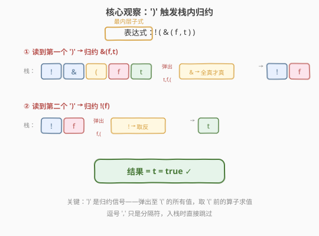
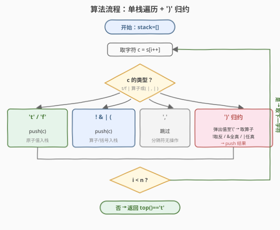
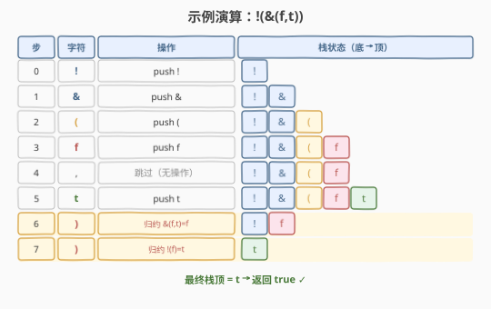

# 解析布尔表达式

- **题目名称**：解析布尔表达式
- **链接**：[1106. 解析布尔表达式](https://leetcode.cn/problems/parsing-a-boolean-expression/)
- **难度**：困难
- **标签**：栈、递归、字符串解析

## 1. 题目概述

给定一个以字符串形式表述的**布尔表达式** `expression`，返回该式的运算结果（`true` / `false`）。有效表达式遵循以下约定：

- `'t'` → `true`
- `'f'` → `false`
- `'!(subExpr)'` → 对内部表达式取**逻辑非**（NOT）
- `'&(subExpr1, subExpr2, ..., subExprn)'` → 对 2 个或以上内部表达式取**逻辑与**（AND）
- `'|(subExpr1, subExpr2, ..., subExprn)'` → 对 2 个或以上内部表达式取**逻辑或**（OR）

**示例 1**：

```text
输入：expression = "&(|(f))"
输出：false
解释：|(f) --> f，&(f) --> f，返回 false。
```

**示例 2**：

```text
输入：expression = "|(f,f,f,t)"
输出：true
解释：false OR false OR false OR true = true。
```

**示例 3**：

```text
输入：expression = "!(&(f,t))"
输出：true
解释：&(f,t) --> false，!(false) --> true。
```

**约束条件**：

- `1 <= expression.length <= 2 * 10^4`
- `expression[i]` 为 `'('`、`')'`、`'&'`、`'|'`、`'!'`、`'t'`、`'f'`、`','` 之一

> 💡 这是**表达式求值**家族的一员，与 [224. 基本计算器](../0201-0300/224_基本计算器.md)、[394. 字符串解码](../0301-0400/394_字符串解码.md) 同构——都是「括号嵌套 + 右括号触发归约」的栈模型。区别在于：计算器在括号内做算术，解码器在 `]` 处做字符串重复，而本题在 `)` 处做布尔运算。掌握这套「单栈 + 右界符归约」模板，就能通吃一整类嵌套求值题。

---

## 2. 解题思路

### 2.1 暴力思路：字符串反复替换

每次找到最内层的 `op(...)` 子表达式（即不含嵌套括号的子式），求值后用 `'t'`/`'f'` 替换它，重复直到整个表达式化为单字符。每轮扫描 $O(n)$，最多嵌套 $O(n)$ 层，总时间 $O(n^2)$。能过但不够优雅，且需要反复拷贝字符串。

### 2.2 核心观察：单栈 + ')' 归约



**关键洞察**：表达式的嵌套结构由括号界定，而**右括号 `)` 是天然的最内层求值信号**——遇到 `)` 时，栈中从栈顶到最近的 `(` 之间的所有值，恰好构成一个完整的、已求值完毕的操作数序列，`(` 紧下方就是它们对应的算子。

**栈中存什么**：直接存字符——算子 `!`/`&`/`|`、左括号 `(`、原子值 `t`/`f` 全部入栈。**逗号 `,` 跳过**（它只是分隔符，不影响栈的归约逻辑）。

**归约规则**（遇 `)` 时）：

| 算子 | 操作数个数 | 求值规则 |
|------|-----------|----------|
| `!` | 恰 1 个 | `t→f`, `f→t`（取反） |
| `&` | $\geq 2$ 个 | 全为 `t` 才 `t`，否则 `f`（全真才真） |
| `\|` | $\geq 2$ 个 | 有 `t` 即 `t`，否则 `f`（任真即真） |

> 💡 **为什么 `&`/`|` 能统一收集所有操作数再求值？** 因为逗号被跳过，所以 `&(f,t)` 入栈后栈顶区域是 `[... ( f t]`（无逗号干扰），遇到 `)` 时弹出 `t`、`f` 直到 `(`，正好拿到全部操作数。无需关心操作数个数——弹到 `(` 为止即可。

### 2.3 算法流程图



**完整步骤**：

1. **初始化**空栈
2. **逐字符遍历** `expression`：
   - `t` / `f` → **push** 该字符（原子值）
   - `!` / `&` / `|` / `(` → **push** 该字符（算子或括号）
   - `,` → **跳过**（分隔符，无操作）
   - `)` → **归约**：
     ① 弹出栈顶值，收集到 `vals`，直到遇到 `(`
     ② 弹出 `(`（丢弃）
     ③ 弹出算子 `op`（`(` 紧下方）
     ④ 按 `op` 求值，**push** 结果（`'t'` 或 `'f'`）
3. **返回** `栈顶 == 't'`

> ⚠️ **归约时的弹出顺序**：栈是 LIFO，所以 `vals` 收集到的是**从右到左**的操作数。但对 `&`（全真）和 `|`（任真）而言顺序无关；对 `!` 只有单操作数更无关。因此无需反转。

### 2.4 示例演算

以 `expression = "!(&(f,t))"` 为例（对应示例 3）：



**逐步栈状态**：

| 步 | 字符 | 操作 | 栈（底→顶） |
|----|------|------|-------------|
| 0 | `!` | push | `!` |
| 1 | `&` | push | `! &` |
| 2 | `(` | push | `! & (` |
| 3 | `f` | push | `! & ( f` |
| 4 | `,` | 跳过 | `! & ( f` |
| 5 | `t` | push | `! & ( f t` |
| 6 | `)` | 归约 `&(f,t)` → `f` | `! f` |
| 7 | `)` | 归约 `!(f)` → `t` | `t` |

最终栈顶为 `t` → 返回 `true`。

> 💡 **归约步骤详解**（步 6）：遇到 `)`，弹出 `t`、`f` 直到 `(`，得 `vals=[t,f]`；弹出 `(`；弹出算子 `&`；`&` 要求全真，`f` 在内 → 结果 `f`；push `f`。栈变为 `! f`。步 7 同理：弹出 `f`，算子 `!`，取反 → `t`。

---

## 3. 参考代码

### C++

```cpp
// 解析布尔表达式.cpp —— 单栈 + ')' 归约
// 编译: g++ -O2 -std=c++17 解析布尔表达式.cpp -o boolparse
class Solution {
public:
    bool parseBoolExpr(string expression) {
        stack<char> st;
        for (char c : expression) {
            if (c == ',') continue;          // 分隔符跳过
            if (c != ')') {
                st.push(c);                  // 算子/括号/原子值统统入栈
            } else {
                vector<char> vals;
                while (st.top() != '(') {    // 弹出操作数直到 '('
                    vals.push_back(st.top());
                    st.pop();
                }
                st.pop();                    // 弹出 '('
                char op = st.top();          // '(' 紧下方就是算子
                st.pop();

                char res;
                if (op == '!') {
                    res = (vals[0] == 't') ? 'f' : 't';      // 取反
                } else if (op == '&') {
                    res = 't';
                    for (char v : vals) if (v == 'f') { res = 'f'; break; }  // 全真才真
                } else { // '|'
                    res = 'f';
                    for (char v : vals) if (v == 't') { res = 't'; break; }  // 任真即真
                }
                st.push(res);
            }
        }
        return st.top() == 't';
    }
};
```

### Python

```python
class Solution:
    def parseBoolExpr(self, expression: str) -> bool:
        st = []
        for c in expression:
            if c == ',':
                continue                       # 分隔符跳过
            if c != ')':
                st.append(c)                   # 算子/括号/原子值统统入栈
            else:
                vals = []
                while st[-1] != '(':           # 弹出操作数直到 '('
                    vals.append(st.pop())
                st.pop()                       # 弹出 '('
                op = st.pop()                  # '(' 紧下方就是算子

                if op == '!':
                    res = 'f' if vals[0] == 't' else 't'      # 取反
                elif op == '&':
                    res = 'f' if 'f' in vals else 't'         # 全真才真
                else:  # '|'
                    res = 't' if 't' in vals else 'f'         # 任真即真
                st.append(res)
        return st[-1] == 't'
```

> 💡 **实现细节**：① Python 用 `'f' in vals` / `'t' in vals` 一行搞定 `&` / `|`，因为 `in` 操作天然短路。② 栈里存字符 `'t'`/`'f'` 而非布尔值 `True`/`False`——这样算子和值统一为 `char`/`str` 类型，代码更简洁。③ 题目保证表达式合法，故 `vals` 非空、`(` 下方必有算子，无需额外判空。

---

## 4. 复杂度分析

| 维度 | 单栈迭代 | 递归下降 |
|------|---------|---------|
| **时间** | $O(n)$ | $O(n)$ |
| **空间** | $O(n)$ | $O(n)$（含递归栈） |
| **思路** | 显式栈模拟 | 隐式调用栈 |

> ⚠️ **时间 $O(n)$ 的证明**：每个字符恰好被处理一次（入栈一次）。归约时每个值被弹出一次，一生一灭，总弹出次数 $\leq$ 总入栈次数 $= O(n)$。因此整体线性。

---

## 5. 扩展：递归下降解析

除栈迭代外，**递归下降**是另一种自然写法——把 `parse()` 定义为「解析当前位置的一个完整子表达式，返回布尔值并推进游标」：

```python
class Solution:
    def parseBoolExpr(self, expression: str) -> bool:
        i = 0
        def parse():
            nonlocal i
            c = expression[i]
            if c == 't':
                i += 1
                return True
            if c == 'f':
                i += 1
                return False
            # 复合表达式：op(subExpr1, subExpr2, ...)
            op = c
            i += 2                        # 跳过 op 和 '('
            vals = [parse()]              # 至少一个操作数
            while expression[i] == ',':
                i += 1                    # 跳过逗号
                vals.append(parse())
            i += 1                        # 跳过 ')'
            if op == '!':
                return not vals[0]
            if op == '&':
                return all(vals)
            return any(vals)              # '|'
        return parse()
```

> 💡 **两种写法对比**：递归下降用**调用栈**代替显式栈，代码更接近表达式本身的语法结构（`op(args)` → 读算子、读参数列表、求值）。迭代版用显式栈，避免了递归深度限制（本题 $n \leq 2 \times 10^4$，Python 默认递归上限 1000 可能不够，需 `sys.setrecursionlimit`）。**面试中迭代版更稳妥**。

---

## 6. 面试要点

1. **为什么用栈？`')'` 的作用是什么？**

   > 表达式嵌套由括号界定。`'('` 标记一个子式的开始，`')'` 标记其结束——遇到 `)` 时，栈顶到最近 `(` 之间的值恰好是该子式**全部已求值的操作数**，`(` 下方紧邻的就是算子。`)` 是天然的「最内层求值触发器」。

2. **逗号 `','` 怎么处理？为什么可以直接跳过？**

   > 逗号只是操作数之间的分隔符，不携带语义。跳过后，`&(f,t)` 入栈为 `& ( f t`，归约时弹到 `(` 自然拿到所有操作数，逗号的存在与否不影响弹出逻辑。

3. **栈里存字符还是布尔值？为什么选字符？**

   > 存字符 `'t'`/`'f'`。这样算子（`!`/`&`/`|`）、括号、值统一为同一类型，一个栈搞定，代码最简。若值用 `bool`，则需要区分栈元素类型或用两个栈（算子栈 + 值栈），反而复杂。

4. **`!` 只有一个操作数，`&`/`|` 有多个，如何统一处理？**

   > 归约时不预设操作数个数——一律「弹到 `(` 为止」收集所有值。`!` 时 `vals` 恰好 1 个元素，取 `vals[0]` 取反；`&`/`|` 遍历 `vals` 做全真/任真判定。统一逻辑无需分支特判个数。

5. **与基本计算器（224）、字符串解码（394）的异同？**

   > 三者同属「括号嵌套 + 右界符归约」栈模型。224 在 `)` 处做算术归约（加减法），394 在 `]` 处做字符串重复归约（`prev + cur × k`），本题在 `)` 处做布尔归约。核心模板一致：左界符入栈、右界符触发弹出+求值+回压结果。

> 💡 **一句话总结**：1106 是「单栈 + 右括号归约」模板在布尔运算上的应用——算子、括号、原子值统一入栈，遇 `)` 弹出到 `(` 的全部操作数、取算子求值、回压结果。$O(n)$ 时间、$O(n)$ 空间。这套模板可迁移到基本计算器、字符串解码、Lisp 解析等一整类嵌套求值问题。

---

## 7. 同类练习题

- [224. 基本计算器](https://leetcode.cn/problems/basic-calculator/)（[题解](../0201-0300/224_基本计算器.md)）：同构栈模型，`)` 处做算术加减归约，处理一元符号与嵌套括号
- [394. 字符串解码](https://leetcode.cn/problems/decode-string/)（[题解](../0301-0400/394_字符串解码.md)）：双栈嵌套展开，`]` 触发归约（`prev + cur × k`），与本题 `)` 对称
- [150. 逆波兰表达式求值](https://leetcode.cn/problems/evaluate-reverse-polish-notation/)（[题解](../0101-0200/150_逆波兰表达式求值.md)）：栈求值经典题，后缀表达式遇运算符即归约（无括号版）
- [736. Lisp 语法解析](https://leetcode.cn/problems/parse-lisp-expression/)（[题解](../0701-0800/736_Lisp语法解析.md)）：递归下降解析更复杂的表达式语言（add/mult/let 三种算子 + 变量作用域）
