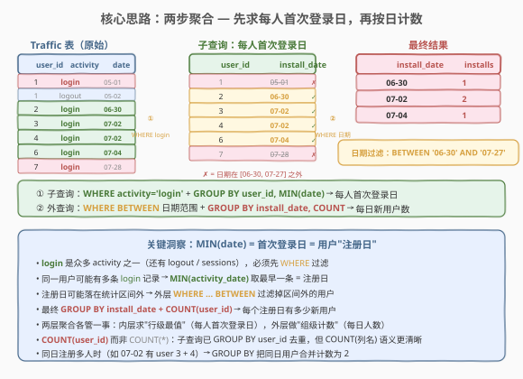
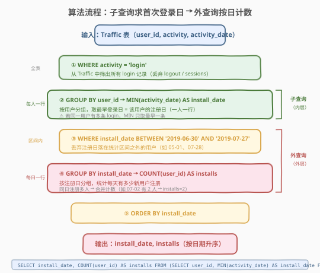
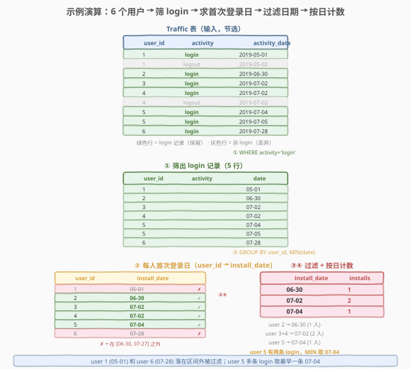

# LeetCode 每日新用户统计 题解

## 1. 题目概述

- **标题 / 题号**：每日新用户统计（#1107，medium）
- **链接**：https://leetcode.cn/problems/new-users-daily-count/
- **难度**：中等
- **标签**：SQL、子查询、GROUP BY、MIN 聚合、日期过滤、两步聚合

**题意**：给定 `Traffic` 表，记录用户的各种活动（登录、登出、会话等）。编写 SQL 查询，统计**每天有多少新用户注册**。一个用户的"注册日"（install_date）是其**首次登录**的日期。只统计注册日落在 `2019-06-30` 至 `2019-07-27`（含）区间内的用户。

**表结构**：

```text
Table: Traffic
+---------------+---------+
| Column Name   | Type    |
+---------------+---------+
| user_id       | int     |
| activity      | enum    |  ← ('login', 'logout', 'sessions')
| activity_date | date    |
+---------------+---------+
```

> ⚠️ 该表**无主键**，可能存在重复行。`activity` 是 ENUM 类型，取值包括 `'login'`、`'logout'`、`'sessions'` 等。

**示例 1**：

```text
输入：
Traffic 表
+---------+----------+---------------+
| user_id | activity | activity_date |
+---------+----------+---------------+
| 1       | login    | 2019-05-01    |
| 1       | logout   | 2019-05-02    |
| 2       | login    | 2019-06-30    |
| 2       | logout   | 2019-06-30    |
| 3       | login    | 2019-07-02    |
| 4       | login    | 2019-07-02    |
| 4       | logout   | 2019-07-02    |
| 5       | login    | 2019-07-04    |
| 5       | login    | 2019-07-05    |
| 5       | logout   | 2019-07-05    |
| 6       | login    | 2019-07-28    |
| 6       | logout   | 2019-07-28    |
+---------+----------+---------------+

输出：
+--------------+---------+
| install_date | installs|
+--------------+---------+
| 2019-06-30   | 1       |
| 2019-07-02   | 2       |
| 2019-07-04   | 1       |
+--------------+---------+
```

**解释**：

| user_id | 首次 login 日期 | 是否在 [06-30, 07-27] 内 | 说明 |
|---------|----------------|--------------------------|------|
| 1 | 2019-05-01 | ✗ | 区间前，排除 |
| 2 | 2019-06-30 | ✓ | 计入 06-30 |
| 3 | 2019-07-02 | ✓ | 计入 07-02 |
| 4 | 2019-07-02 | ✓ | 计入 07-02（同日 2 人） |
| 5 | 2019-07-04 | ✓ | 有两条 login，MIN 取 07-04 |
| 6 | 2019-07-28 | ✗ | 区间后，排除 |

**约束**：

- `Traffic` 表无主键，可能存在重复行
- `activity` 列为 ENUM 类型（`'login'`、`'logout'`、`'sessions'` 等）
- 只统计注册日（首次登录日）在 `2019-06-30` 到 `2019-07-27`（含）之间的用户
- 结果按 `install_date` 升序排列
- 输出列名：`install_date`、`installs`

> 💡 本题是 SQL **"两层聚合"经典模板**——内层 `GROUP BY user_id + MIN(date)` 求"行级最值"（每人首次登录日），外层 `GROUP BY install_date + COUNT` 做"组级计数"（每日人数）。核心难点在于：① `activity` 有多种值，需先 `WHERE` 过滤出 `login`；② 同一用户可能有多条 `login` 记录，需用 `MIN` 取最早一条；③ 注册日可能落在统计区间外，需在外层 `WHERE ... BETWEEN` 过滤。

## 2. 解题思路

### 2.1 暴力思路：逐用户扫描

对每个 `user_id`，遍历其所有 `activity = 'login'` 的记录，找到最早日期作为注册日，再按注册日分组计数。这在过程式语言里是两层嵌套循环，但**纯 SQL 没有逐行循环语句**——需要换成"集合式"表达：子查询先算每人首次登录日，外层再按日分组计数。

> ⚠️ 过程式思维（"对每个用户找最早登录日"）在 SQL 中表达为子查询 + `GROUP BY` + `MIN` 的组合，这是"行级最值 → 组级聚合"的标准两步法。

### 2.2 核心观察：两步聚合解耦



**关键洞察**："每人首次登录日"是一个**行级最值**（每个用户一个 MIN），而"每日新用户数"是一个**组级计数**（每个日期一个 COUNT）。两者不在同一层——`GROUP BY user_id` 后只能拿到 `user_id` 和 `MIN(date)`，拿不到"每天有多少人"。解法是**两步解耦**：

1. **内层子查询**：`WHERE activity = 'login'` 过滤出登录记录，再 `GROUP BY user_id, MIN(activity_date)` 求每人首次登录日 → 得到一张 `(user_id, install_date)` 二维表；
2. **外层主查询**：`WHERE install_date BETWEEN '2019-06-30' AND '2019-07-27'` 过滤区间外的用户，再 `GROUP BY install_date, COUNT(user_id)` 按日计数。

$$\text{每日新用户数} = \text{COUNT}\big(\text{user\_id} \;\big|\; \text{MIN}(\text{activity\_date} \mid \text{activity='login'}) \in [\text{06-30}, \text{07-27}]\big) \text{ grouped by install\_date}$$

> 💡 **为何分两层而非一层**：`GROUP BY user_id` 和 `GROUP BY install_date` 是两个**不同粒度**的分组——前者按用户（每人一行），后者按日期（每日一行）。一层 `GROUP BY` 只能做一个粒度的聚合。内层按 `user_id` 分组求 `MIN(date)`（行级最值），外层按 `install_date` 分组求 `COUNT`（组级计数），两层各管一事，这正是 SQL "嵌套聚合"的标准模式。

> ⚠️ **三个易错点**：
> - **必须先 `WHERE activity = 'login'`**：`Traffic` 表含 `logout`、`sessions` 等多种活动，若不过滤，`MIN(activity_date)` 会取到所有活动的最早日期（可能是 `logout` 而非 `login`），导致注册日错误。
> - **`MIN` 而非任意一条**：同一用户可能有多条 `login` 记录（如示例中 user 5 有 07-04 和 07-05 两条），必须取 `MIN`（最早一条）才是"首次登录日"。
> - **日期过滤在外层而非内层**：`WHERE install_date BETWEEN ...` 必须放在外层（对子查询结果过滤），不能放在内层子查询中——否则会先过滤掉区间外的 `activity_date`，导致原本在区间外首次登录的用户"丢失"其真正的首次登录记录，可能误把区间内的某次重复登录当作首次登录。

### 2.3 算法流程图



**完整步骤**：

1. **`WHERE activity = 'login'`**：从 `Traffic` 中筛出所有登录记录，丢弃 `logout`、`sessions` 等非登录活动
2. **`GROUP BY user_id → MIN(activity_date) AS install_date`**：按用户分组，取最早登录日作为注册日（一人一行）
3. **`WHERE install_date BETWEEN '2019-06-30' AND '2019-07-27'`**：丢弃注册日落在统计区间之外的用户
4. **`GROUP BY install_date → COUNT(user_id) AS installs`**：按注册日分组，统计每天有多少新用户
5. **`ORDER BY install_date`**：按日期升序输出

> ⚠️ **步骤 2 与步骤 3 的顺序**：必须先求出每人的首次登录日（步骤 2），再按日期过滤（步骤 3）。若反过来——先过滤 `activity_date` 在区间内，再求 `MIN`——会丢掉区间外的首次登录记录，导致某些用户的"首次登录日"被错误地设为区间内的第二次登录。例如 user 1 在 05-01 首次登录，若先过滤掉 05-01，则 user 1 可能消失（无区间内 login 记录），或被误记为区间内某次重复登录的日期。

### 2.4 示例演算

以示例 1 数据为例，观察逐步执行过程：



**步骤 ①：筛出 `login` 记录**

从 `Traffic` 表中 `WHERE activity = 'login'`，得到 6 条登录记录（丢弃 `logout` 行）：

| user_id | activity | activity_date |
|---------|----------|---------------|
| 1 | login | 2019-05-01 |
| 2 | login | 2019-06-30 |
| 3 | login | 2019-07-02 |
| 4 | login | 2019-07-02 |
| 5 | login | 2019-07-04 |
| 5 | login | 2019-07-05 |
| 6 | login | 2019-07-28 |

**步骤 ②：`GROUP BY user_id, MIN(activity_date)`**

按用户分组取最早登录日 → 每人一行：

| user_id | install_date | 在区间内？ |
|---------|-------------|-----------|
| 1 | 2019-05-01 | ✗（区间前） |
| 2 | 2019-06-30 | ✓ |
| 3 | 2019-07-02 | ✓ |
| 4 | 2019-07-02 | ✓ |
| 5 | 2019-07-04 | ✓（MIN 取 07-04，忽略 07-05） |
| 6 | 2019-07-28 | ✗（区间后） |

> 💡 **user 5 有两条 login 记录**（07-04 和 07-05），`MIN` 取较早的 07-04 作为注册日。这正是 `MIN` 的作用——同一用户多次登录只认第一次。

**步骤 ③④：`WHERE BETWEEN` + `GROUP BY install_date, COUNT`**

过滤掉 user 1（05-01）和 user 6（07-28），剩余 4 个用户按注册日分组计数：

| install_date | 用户 | installs |
|-------------|------|---------|
| 2019-06-30 | user 2 | 1 |
| 2019-07-02 | user 3, user 4 | 2 |
| 2019-07-04 | user 5 | 1 |

最终输出按 `install_date` 升序排列，正是示例 1 的结果。

## 3. 参考代码

### SQL（解法 A：子查询 + 两步聚合，推荐）

```sql
SELECT install_date, COUNT(user_id) AS installs
FROM (
    SELECT user_id, MIN(activity_date) AS install_date
    FROM Traffic
    WHERE activity = 'login'
    GROUP BY user_id
) t
WHERE install_date BETWEEN '2019-06-30' AND '2019-07-27'
GROUP BY install_date
ORDER BY install_date;
```

> 💡 **写法要点**：
> - 内层子查询 `WHERE activity = 'login'` 先过滤出登录记录，再 `GROUP BY user_id, MIN(activity_date)` 求每人首次登录日。
> - 外层 `WHERE install_date BETWEEN ...` 过滤区间外的用户，再 `GROUP BY install_date, COUNT(user_id)` 按日计数。
> - `COUNT(user_id)` 而非 `COUNT(*)`：子查询已 `GROUP BY user_id` 去重，两者结果相同，但 `COUNT(user_id)` 语义更清晰（计数的是用户数）。
> - `ORDER BY install_date` 保证结果按日期升序。

### SQL（解法 B：CASE WHEN 内嵌 MIN）

```sql
SELECT install_date, COUNT(user_id) AS installs
FROM (
    SELECT user_id,
           MIN(CASE WHEN activity = 'login' THEN activity_date END) AS install_date
    FROM Traffic
    GROUP BY user_id
) t
WHERE install_date BETWEEN '2019-06-30' AND '2019-07-27'
GROUP BY install_date
ORDER BY install_date;
```

> 💡 **与解法 A 的区别**：不在子查询中 `WHERE activity = 'login'`，而是在 `MIN` 内部用 `CASE WHEN activity = 'login' THEN activity_date END` 条件聚合。`CASE` 不匹配时返回 `NULL`，`MIN` 自动忽略 `NULL`，等效于先过滤再聚合。这种写法只需扫一遍表（无需先过滤），在需要同时求多种活动的最值时可避免多次子查询。但可读性略逊于解法 A。

### SQL（解法 C：DENSE_RANK 窗口函数）

```sql
SELECT install_date, COUNT(user_id) AS installs
FROM (
    SELECT user_id, activity_date AS install_date
    FROM (
        SELECT user_id, activity_date,
               DENSE_RANK() OVER (PARTITION BY user_id ORDER BY activity_date) AS rk
        FROM Traffic
        WHERE activity = 'login'
    ) ranked
    WHERE rk = 1
) first_login
WHERE install_date BETWEEN '2019-06-30' AND '2019-07-27'
GROUP BY install_date
ORDER BY install_date;
```

> 💡 **写法要点**：用 `DENSE_RANK() OVER (PARTITION BY user_id ORDER BY activity_date)` 给每个用户的登录记录按日期升序排名，`rk = 1` 即首次登录。与 `MIN` 等价但更繁琐——适用于需要同时取首次登录的**完整行信息**（不止日期）时。本题只需日期，`MIN` 更简洁。需 MySQL 8.0+ 支持窗口函数。

### Python（pandas）

```python
import pandas as pd

def new_users_daily_count(traffic: pd.DataFrame) -> pd.DataFrame:
    logins = traffic[traffic['activity'] == 'login']
    install_dates = logins.groupby('user_id')['activity_date'].min().reset_index()
    install_dates.columns = ['user_id', 'install_date']
    start = pd.Timestamp('2019-06-30')
    end = pd.Timestamp('2019-07-27')
    filtered = install_dates[
        (install_dates['install_date'] >= start) &
        (install_dates['install_date'] <= end)
    ]
    result = filtered.groupby('install_date').size().reset_index(name='installs')
    return result.sort_values('install_date').reset_index(drop=True)
```

> 💡 **pandas 对照**：`groupby('user_id')['activity_date'].min()` 对应 SQL 内层子查询的 `GROUP BY user_id, MIN(activity_date)`；布尔掩码 `(>= start) & (<= end)` 对应外层 `WHERE ... BETWEEN`；`groupby('install_date').size()` 对应外层 `GROUP BY install_date, COUNT`。`size()` 返回每组行数（含 NaN），等价于 `COUNT(*)`；若用 `.count()` 则不统计 NaN 列，效果相同（因为 `install_date` 已非空）。

## 4. 复杂度分析

| 维度 | 解法 A（子查询 MIN） | 解法 B（CASE MIN） | 解法 C（DENSE_RANK） |
|------|---------------------|-------------------|---------------------|
| **时间** | $O(n)$ | $O(n)$ | $O(n \log n)$ |
| **空间** | $O(u)$ | $O(u)$ | $O(n)$ |
| **扫描次数** | 1 次（WHERE 过滤后聚合） | 1 次（全表 CASE 聚合） | 1 次（过滤 + 排序） |
| **推荐度** | ✓ **首选**，语义直观 | ✓ 备选，条件聚合 | △ 过重，仅备用 |

> - $n$ = `Traffic` 表行数，$u$ = 不同 `user_id` 数量（$u \leq n$）
> - 解法 A/B：内层 `GROUP BY` 哈希聚合 $O(n)$，外层 `GROUP BY` $O(u)$，总计 $O(n)$
> - 解法 C：`DENSE_RANK` 需对每个用户的登录记录排序，$O(n \log n)$
> - 空间：子查询物化 $O(u)$ 行（每人一行）；窗口函数需排序缓冲 $O(n)$

## 5. 扩展：日期补零与递归 CTE

### 5.1 需求变体——补全区间内所有日期（含 0 注册日）

本题只输出有新用户的日期。若需求变为"输出 `[06-30, 07-27]` 区间内**每一天**的新用户数（无新用户的日期显示 0）"，则需要**生成日期序列**再 LEFT JOIN：

```sql
WITH RECURSIVE date_range AS (
    SELECT DATE('2019-06-30') AS d
    UNION ALL
    SELECT DATE_ADD(d, INTERVAL 1 DAY) FROM date_range WHERE d < '2019-07-27'
)
SELECT dr.d AS install_date,
       COUNT(t.user_id) AS installs
FROM date_range dr
LEFT JOIN (
    SELECT user_id, MIN(activity_date) AS install_date
    FROM Traffic
    WHERE activity = 'login'
    GROUP BY user_id
) t ON t.install_date = dr.d
GROUP BY dr.d
ORDER BY dr.d;
```

> 💡 **关键变化**：用递归 CTE 生成 `[06-30, 07-27]` 共 28 天的日期序列，再 `LEFT JOIN` 子查询结果——没有匹配的日期 `user_id` 为 `NULL`，`COUNT(user_id)` 自动计为 0（`COUNT` 忽略 `NULL`）。⚠️ `COUNT(t.user_id)` 而非 `COUNT(*)`——后者会把 `LEFT JOIN` 的 `NULL` 行也计为 1，得到 1 而非 0。

### 5.2 同类"首次事件"模式

本题的"首次登录日"与 1174（即时食物配送 II）的"首次订单日"是同一个模式——`GROUP BY 实体 + MIN(时间) + 外层 WHERE 过滤`。所有"每个实体的首次发生事件"类 SQL 题都是这个模板的实例：

```sql
-- 泛化模板：每个实体的首次事件
SELECT first_event_date, COUNT(entity_id) AS cnt
FROM (
    SELECT entity_id, MIN(event_date) AS first_event_date
    FROM Events
    WHERE event_type = '目标类型'
    GROUP BY entity_id
) t
WHERE first_event_date BETWEEN '开始日期' AND '结束日期'
GROUP BY first_event_date
ORDER BY first_event_date;
```

## 6. 面试要点

1. **为什么要在子查询中先 `WHERE activity = 'login'` 而非直接 `MIN(activity_date)`？**

   > `Traffic` 表有多种 `activity`（`login`、`logout`、`sessions`），若不过滤，`MIN(activity_date)` 会取到所有活动中最早的一条——可能是 `logout` 而非 `login`，导致注册日错误。必须先 `WHERE activity = 'login'` 过滤出登录记录，再求 `MIN`，确保"首次登录日"语义正确。

2. **日期过滤 `WHERE BETWEEN` 为什么放在外层而非内层子查询？**

   > 内层子查询的 `MIN(activity_date)` 需要从**全部** login 记录中取最早一条，才能得到真正的首次登录日。若在内层就 `WHERE activity_date BETWEEN ...`，会先丢掉区间外的记录，导致某些用户的"首次登录日"被错误地设为区间内的某次重复登录（而非真正的第一次）。正确做法是先求出完整的首次登录日，再在外层按 `install_date` 过滤区间。

3. **同一用户有多条 `login` 记录时如何处理？**

   > `GROUP BY user_id + MIN(activity_date)` 自动取最早一条。例如 user 5 有 07-04 和 07-05 两条 login，`MIN` 返回 07-04。即使表有重复行（同一 `user_id + login + date` 出现多次），`MIN` 也只取一个最小值，不受重复影响。

4. **`COUNT(user_id)` 和 `COUNT(*)` 有什么区别？**

   > 本题中两者结果相同——内层子查询 `GROUP BY user_id` 保证每个 `user_id` 只出现一次，无 `NULL`。但 `COUNT(user_id)` 语义更清晰（计数的是用户数），且在第 5 节"补零"场景中必须用 `COUNT(user_id)`（`LEFT JOIN` 产生 `NULL` 行时 `COUNT(*)` 会误计为 1）。面试中答："标准解法两者等价，但 `COUNT(列名)` 在 `LEFT JOIN` 补零场景下能正确忽略 `NULL`，是更安全的选择。"

5. **解法 A（子查询 MIN）和解法 C（DENSE_RANK）如何选择？**

   > 本题只需取首次登录的**日期**，`MIN` 最简洁直接，$O(n)$ 时间。`DENSE_RANK` 适用于需要取首次登录的**完整行信息**（如同时需要该日的 `activity` 详情）时——`rk = 1` 的行保留全部列。但本题只需日期，用 `DENSE_RANK` 是"杀鸡用牛刀"，且多一层嵌套、$O(n \log n)$ 时间。面试答："首选 MIN 子查询——简洁高效；仅当需要首条记录的完整行信息时才用窗口函数。"

> 💡 **一句话总结**：1107 是 SQL **"两层聚合"经典模板**——内层 `GROUP BY user_id + MIN(activity_date)` 求每人首次登录日（行级最值），外层 `WHERE BETWEEN + GROUP BY install_date + COUNT` 按日计数（组级计数）。三个易错点：① 先 `WHERE activity = 'login'` 过滤非登录活动；② `MIN` 取最早一条（同一用户多次登录）；③ 日期过滤在外层（先求完整首次登录日再过滤区间）。记住"行级最值 → 组级计数"这条公式，所有"每个实体的首次事件 + 按时间统计"类 SQL 题都能套用。

## 同类练习题

| # | 题目 | 与本题的关联 |
|---|------|-------------|
| 1174 | [即时食物配送 II](https://leetcode.cn/problems/immediate-food-delivery-ii/) | 同一模板的姐妹题——`GROUP BY customer_id + MIN(order_date)` 求每位顾客首次订单日，再计算"首次订单即时配送"的比例。与 1107 共享"首次事件"模式 |
| 511 | [游戏玩法分析 I](https://leetcode.cn/problems/game-play-analysis-i/) | `GROUP BY player_id + MIN(event_date)` 求每位玩家首次登录日期，是 1107 的简化版（无日期区间过滤） |
| 550 | [游戏玩法分析 IV](https://leetcode.cn/problems/game-play-analysis-iv/) | 在 511 基础上进一步计算"首次登录次日也登录"的比例，叠加了自连接/日期差判断 |
| 1141 | [查询近 30 天活跃用户数](https://leetcode.cn/problems/user-activity-for-the-past-30-days-i/) | `WHERE activity_date BETWEEN` 日期过滤 + `GROUP BY activity_date, COUNT(DISTINCT user_id)`，对比 1107 的"按日计数"与"按日去重计数" |
| 1084 | [销售分析 III](https://leetcode.cn/problems/sales-analysis-iii/) | `WHERE sale_date BETWEEN` 过滤区间 + `GROUP BY product_id` 聚合，共享"日期区间过滤 + 分组聚合"的骨架 |
