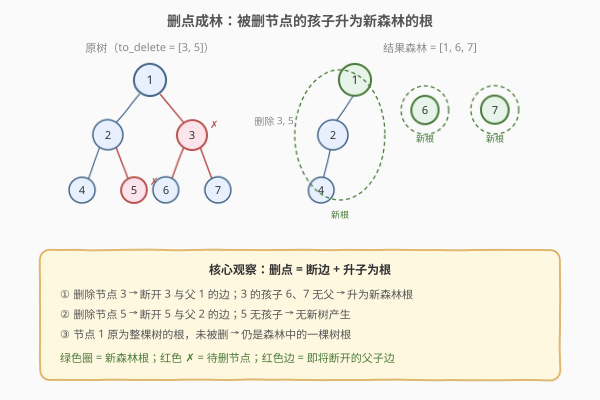
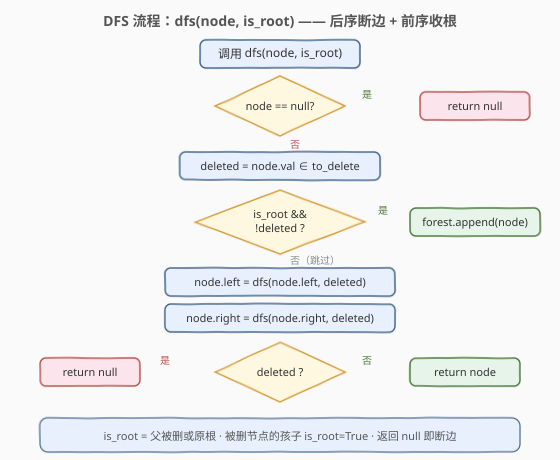
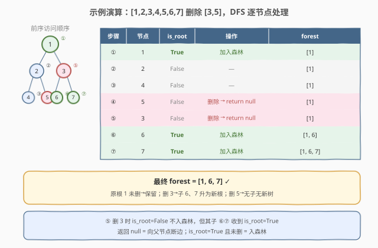

# LeetCode 删点成林 题解

## 1. 题目概述

- **标题 / 题号**：删点成林（#1110，medium）
- **链接**：https://leetcode.cn/problems/delete-nodes-and-return-forest/
- **难度**：中等
- **标签**：树、二叉树、深度优先搜索、后序遍历

**题意**：给定一棵二叉树的根节点 `root` 和一个整数数组 `to_delete`，删除树中所有**值出现在 `to_delete` 中**的节点。删除后，原树会断裂成多棵独立的树（即一片**森林**）。请你返回剩余树的**根节点列表**，顺序不限。

> **删除的含义**：把被删节点从其父节点的子指针上摘除（断边），被删节点本身不再属于任何树。但它**非空的孩子**会脱离出来，各自成为新森林中的独立树根。

**示例 1**：

```text
输入：root = [1,2,3,4,5,6,7], to_delete = [3,5]
输出：[[1,2,4],[6],[7]]

        1                  1
       / \                /
      2   3      →       2        6      7
     / \ / \            /
    4  5 6  7          4
```

删除值为 3 和 5 的节点：节点 3 的孩子 6、7 脱离为新树；节点 5 是叶子无孩子；节点 1 作为原根未被删，仍保留。最终森林为 `[1, 6, 7]` 三棵树。

**示例 2**：

```text
输入：root = [1,2,4,null,3], to_delete = [3]
输出：[[1,2,4]]

        1              1
       /              /
      2      →       2
       \            /
        4          4
       /
      3
```

删除值为 3 的叶子节点（无孩子），节点 4 的右指针置空，树整体结构保留，森林仍只有原根 `[1]`。

**约束**：

- 树中节点数目范围 `[0, 1000]`
- 每个节点的值互不相同（$1 \le \text{Node.val} \le 1000$）
- `to_delete` 中的值各不相同
- `to_delete` 中的值均存在于树中

> 💡 本题的关键不在「删除」本身，而在「**删除后如何正确收集新森林的根**」。一个节点成为新森林根的条件是：它没被删除，且它的父节点被删除了（或它本身就是原树的根）。这天然对应一次 DFS，只需在递归中传递一个 `is_root` 标记。

## 2. 解题思路

### 2.1 暴力思路：逐层标记 + 重建

先把 `to_delete` 中的值存入哈希集合，遍历树标记所有待删节点。然后再次遍历：对每个待删节点，把其非空且未删的孩子加入结果列表，并把父节点指向它的指针置空。需要两次遍历，且第一次遍历时还要记录父节点引用，逻辑较繁。虽然能过，但完全可以合并为**一次 DFS**。

### 2.2 核心观察：后序断边 + is_root 标记



**关键洞察**：一个节点是否应该被加入森林，取决于两个条件——

> **它是森林根** ⟺ （它没被删除）∧（它的父节点被删除了 ∨ 它是原树的根）

把这个判断融入 DFS：给 `dfs` 增加一个布尔参数 `is_root`，表示「当前节点的父是否被删（或当前是原根）」。在递归孩子时，把 `deleted` 作为孩子的 `is_root` 传入——若当前节点被删，它的孩子就升为新根。

**返回值**：`dfs` 返回处理后的子树根（供父节点重连）。若当前节点被删，返回 `null`（等于向父节点「断边」）；否则返回自身。

> ⚠️ **处理顺序**：先判定 `is_root && !deleted` 并收集，再递归左右孩子并重连，最后返回。收集在前（前序时机），断边在后（后序时机）——一次遍历同时完成「收根」和「断边」。

### 2.3 算法流程图



**`dfs(node, is_root)` 完整步骤**：

1. **空节点**：返回 `null`；
2. **标记**：`deleted = node.val ∈ to_delete_set`；
3. **收根**：若 `is_root && !deleted`，则 `forest.append(node)`（当前节点是一棵新树的根）；
4. **递归重连**：
   - `node.left = dfs(node.left, deleted)`——把 `deleted` 作为孩子的 `is_root`；
   - `node.right = dfs(node.right, deleted)`；
5. **返回**：`deleted ? null : node`——被删则返回 `null`（断边），否则返回自身。

> 💡 **`is_root` 的传递逻辑**：当前节点被删 → 孩子失去父 → 孩子的 `is_root = true`；当前节点未删 → 孩子仍有父 → 孩子的 `is_root = false`。这正好用 `deleted` 作为下一层的 `is_root` 参数，无需额外状态。

### 2.4 示例演算

以 `root = [1,2,3,4,5,6,7]`, `to_delete = [3,5]` 为例：



**前序访问顺序与森林变化**：

| 步骤 | 节点 | is_root | in to_delete? | 操作 | forest |
|------|------|---------|---------------|------|--------|
| ① | 1 | `True`（原根） | 否 | 加入森林 | `[1]` |
| ② | 2 | `False` | 否 | — | `[1]` |
| ③ | 4 | `False` | 否 | — | `[1]` |
| ④ | 5 | `False` | 是 | 删除 → return null | `[1]` |
| ⑤ | 3 | `False` | 是 | 删除 → return null | `[1]` |
| ⑥ | 6 | `True`（父 3 被删） | 否 | 加入森林 | `[1, 6]` |
| ⑦ | 7 | `True`（父 3 被删） | 否 | 加入森林 | `[1, 6, 7]` |

> 💡 **观察步骤 ⑤→⑥⑦**：节点 3 被删（`deleted=true`），所以递归其孩子 6、7 时传入 `is_root=true`。6、7 未被删且 `is_root=true`，于是各自加入森林。这正是「删点→升子为根」的代码体现。

## 3. 参考代码

### C++

```cpp
class Solution {
public:
    vector<TreeNode*> delNodes(TreeNode* root, vector<int>& to_delete) {
        unordered_set<int> del(to_delete.begin(), to_delete.end());
        vector<TreeNode*> forest;
        dfs(root, true, del, forest);
        return forest;
    }

    TreeNode* dfs(TreeNode* node, bool is_root,
                  unordered_set<int>& del, vector<TreeNode*>& forest) {
        if (!node) return nullptr;
        bool deleted = del.count(node->val);
        if (is_root && !deleted) forest.push_back(node);   // 收根
        node->left  = dfs(node->left,  deleted, del, forest);
        node->right = dfs(node->right, deleted, del, forest);
        return deleted ? nullptr : node;                    // 断边 / 保留
    }
};
```

### Python

```python
class Solution:
    def delNodes(self, root: Optional[TreeNode], to_delete: List[int]) -> List[Optional[TreeNode]]:
        del_set = set(to_delete)
        forest = []

        def dfs(node: Optional[TreeNode], is_root: bool) -> Optional[TreeNode]:
            if not node:
                return None
            deleted = node.val in del_set
            if is_root and not deleted:
                forest.append(node)                    # 收根
            node.left  = dfs(node.left,  deleted)      # deleted 作为孩子的 is_root
            node.right = dfs(node.right, deleted)
            return None if deleted else node           # 断边 / 保留

        dfs(root, True)
        return forest
```

> 💡 **实现细节**：① `to_delete` 转为哈希集合，$O(1)$ 查询。② `dfs` 的返回值双重用途：供父节点重连指针（被删返回 `None` 即自动断边），同时驱动递归。③ `is_root` 参数由父层 `deleted` 直接传入，无需额外标记数组。④ 原根调用 `dfs(root, True)`，保证未被删的原根也能进入森林。

## 4. 复杂度分析

| 维度 | 复杂度 | 说明 |
|------|--------|------|
| 时间复杂度 | $O(n)$ | 每个节点只访问一次，哈希集合查询 $O(1)$ |
| 空间复杂度 | $O(n + h)$ | `to_delete` 集合 $O(d)$（$d$ = 删除数）+ 递归栈 $O(h)$（$h$ = 树高），平衡树 $O(\log n)$，退化链 $O(n)$ |
| 最坏情况 | $O(n)$ 空间 | 树退化为单侧链时递归深度达 $n$ |

> ⚠️ 暴力法需要两次遍历且记录父引用。本解法在一次 DFS 中同时完成「收根」（前序时机）和「断边」（后序返回值），省去了第二次遍历和父指针存储。

## 5. 扩展：迭代法后序遍历

递归写法在树极深时有栈溢出风险。用显式栈模拟后序遍历，难点在于「拿到孩子返回值后再重连」。可以用 `visited` 标记区分第一次入栈与回溯阶段：

```python
class Solution:
    def delNodes(self, root: Optional[TreeNode], to_delete: List[int]) -> List[Optional[TreeNode]]:
        if not root:
            return []
        del_set = set(to_delete)
        forest = []
        # 栈元素：(node, is_root, visited)
        stack = [(root, True, False)]
        ret = {}  # id(node) -> 处理后的返回值

        while stack:
            node, is_root, visited = stack.pop()
            if visited:
                deleted = node.val in del_set
                if is_root and not deleted:
                    forest.append(node)
                node.left  = ret.get(id(node.left), node.left)
                node.right = ret.get(id(node.right), node.right)
                ret[id(node)] = None if deleted else node
            else:
                stack.append((node, is_root, True))   # 后序：根最后处理
                if node.right:
                    stack.append((node.right, node.val in del_set, False))
                if node.left:
                    stack.append((node.left, node.val in del_set, False))
                # 注意：孩子的 is_root = 当前节点是否被删
        return forest
```

> 💡 **迭代 vs 递归**：迭代版逻辑更繁——需手动维护 `is_root` 的传递（入栈时计算 `node.val in del_set` 作为孩子的 `is_root`）和返回值字典。**面试推荐递归版**——简洁且能体现对「`is_root` 传递 + 返回值断边」的理解。迭代版仅在树极深时才有实际优势。

## 6. 面试要点

1. **为什么需要 `is_root` 参数？不能只靠返回值吗？**

   > 返回值 `null` 能告诉父节点「孩子被删了，断边」，但无法告诉子节点「你的父被删了，你是新根」。`is_root` 正是自顶向下传递这一信息：父被删时 `deleted=true`，作为孩子的 `is_root` 传入，孩子据此决定是否加入森林。这是「自顶向下信息」与「自底向上信息」的双向配合。

2. **为什么「收根」在前序时机、「断边」在后序时机？**

   > 收根需要 `is_root`（来自父层，进入节点时已知），所以在递归体开头判定。断边需要孩子已处理完毕（左右指针已更新为处理后的子树），所以在递归返回时完成。一次遍历的两个时机各司其职，互不干扰。

3. **被删节点的孩子如何成为新树根？**

   > 被删节点返回 `null`，其父指针自动断开。同时，递归孩子时传入 `is_root=true`（因为 `deleted=true`），孩子若未被删就会在 `is_root && !deleted` 条件下加入森林。这两步共同实现了「删点→断边→升子为根」。

4. **如果原根也被删除怎么办？**

   > 原根调用 `dfs(root, True)`，若 `root.val ∈ to_delete`，则 `deleted=true`，`is_root && !deleted` 不成立，原根不入森林。其孩子收到 `is_root=true`，各自成为新森林根。原根返回 `null`，但因为没人接收（它没有父节点），自然消亡。完全正确。

5. **节点值互不相同这一条件的作用？**

   > 保证 `to_delete` 中的每个值对应唯一节点，用哈希集合 $O(1)$ 查询即可定位。若有重复值，则需要用节点引用而非值来标识待删节点，哈希集合改为 `set<TreeNode*>`。

> 💡 **一句话总结**：1110 的灵魂是「**`is_root` 自顶向下传递 + 返回值自底向上断边**」——`dfs(node, is_root)` 在前序时机收根（`is_root && !deleted` → 入森林），在后序返回时断边（`deleted ? null : node`），一次遍历 $O(n)$ 完成删除与森林收集。这个「标记参数 + 返回值」的双向信息流是所有树形删除/分裂题的核心套路。

## 同类练习题

| # | 题目 | 与本题的关联 |
|---|------|-------------|
| 814 | [二叉树剪枝](https://leetcode.cn/problems/binary-tree-pruning/) | 后序删除全为 0 的子树，返回值 `null` 即剪枝，同套「后序返回值断边」模板（无 `is_root`，单树返回） |
| 1325 | [删除给定值的叶子节点](https://leetcode.cn/problems/delete-leaves-with-a-given-value/) | 后序递归删除值为 target 的叶子，递归返回时自然「先删子叶再删父叶」，同套后序断边 |
| 1080 | [根到叶路径上的不足节点](https://leetcode.cn/problems/insufficient-nodes-in-root-to-leaf-path/) | 后序判断子树所有路径是否都不足，不足则返回 `null` 删节点，同套「后序返回值断边」 |
| 236 | [二叉树的最近公共祖先](https://leetcode.cn/problems/lowest-common-ancestor-of-a-binary-tree/)（[题解](../0101-0200/236_二叉树的最近公共祖先.md)） | 后序传递「子树是否含 p/q」，在节点处聚合判定，同套后序布尔传递骨架 |
| 250 | [统计同值子树](https://leetcode.cn/problems/count-univalue-subtrees/)（[题解](../0201-0300/250_统计同值子树.md)） | 后序布尔返回值传递子结构结论 + 副作用计数，同套「后序返回值 + 副作用」模板 |
