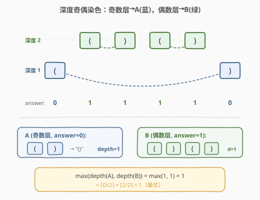

# LeetCode 有效括号的嵌套深度 题解

## 1. 题目概述

- **标题 / 题号**：有效括号的嵌套深度（#1111，medium）
- **链接**：https://leetcode.cn/problems/maximum-nesting-depth-of-two-valid-parentheses-strings/
- **难度**：中等
- **标签**：栈、贪心、字符串

**题意**：给定一个有效括号字符串（VPS）`seq`，将其拆分成两个**不相交的子序列** `A` 和 `B`（`A` 和 `B` 都必须是 VPS，且 `A.length + B.length = seq.length`）。子序列不需要连续。

目标是选择 `A` 和 `B`，使得 $\max(\text{depth}(A), \text{depth}(B))$ **最小**。

返回 `answer` 数组：`answer[i] = 0` 表示 `seq[i]` 属于 `A`，`answer[i] = 1` 表示属于 `B`。答案不唯一，返回任意一种即可。

**示例 1**：

```text
输入：seq = "(()())"
输出：[0,1,1,1,1,0]
```

**示例 2**：

```text
输入：seq = "()(())()"
输出：[0,0,0,1,1,0,1,1]
解释：本示例答案不唯一。按此输出 A = "()()", B = "()()", max(depth(A), depth(B)) = 1。
```

**约束**：

- `1 < seq.size <= 10000`
- `seq` 只包含 `'('` 和 `')'`，且是有效括号字符串

> ⚠️ 关键约束：`A` 和 `B` 是**子序列**（可不连续），但各自必须是**合法 VPS**——即每个 `'('` 都能在同组中找到匹配的 `')'`。

## 2. 解题思路

### 2.1 暴力思路

枚举所有 $2^n$ 种拆分方式，对每种拆分验证 `A` 和 `B` 是否都是 VPS，再计算深度取最小。$n = 10000$ 时完全不可行。

### 2.2 核心观察：按深度奇偶性拆分



**第一步：计算每个括号的深度。**

遍历 `seq`，维护一个计数器 `depth`（初始为 0）：

- 遇到 `'('`：`depth++`，该括号的深度 = 新的 `depth` 值
- 遇到 `')'`：该括号的深度 = 当前 `depth` 值，然后 `depth--`

这样，**匹配的 `'('` 和 `')'` 拥有相同的深度**——因为 `'('` 进入第 $d$ 层，对应的 `')'` 离开第 $d$ 层。

**第二步：按深度奇偶性分组。**

- 深度为**奇数**的括号 → 分给 `A`（`answer = 0`）
- 深度为**偶数**的括号 → 分给 `B`（`answer = 1`）

即 `answer[i] = 1 - depth % 2`（奇数层 → 0，偶数层 → 1）。

> 💡 **为什么这样分能保证 A 和 B 都是合法 VPS？** 因为匹配的 `'('` 和 `')'` 同层，同层同奇偶，所以一定被分到同一组。每组内部的括号天然两两配对，构成合法 VPS。

**第三步：为什么这样分是最优的？**

设原串最大深度为 $D$。奇偶分组后：

- `A`（奇数层）的深度为 $\lceil D/2 \rceil$（奇数层 $1, 3, 5, \ldots$ 压缩为 $1, 2, 3, \ldots$）
- `B`（偶数层）的深度为 $\lfloor D/2 \rfloor$（偶数层 $2, 4, 6, \ldots$ 压缩为 $1, 2, 3, \ldots$）

$\max(\lceil D/2 \rceil, \lfloor D/2 \rfloor) = \lceil D/2 \rceil$。

而 $\lceil D/2 \rceil$ 也是**理论下界**：最内层 $D$ 个嵌套括号必须分到两组中，鸽巢原理要求至少一组拿到 $\lceil D/2 \rceil$ 层。因此奇偶分组达到最优。

### 2.3 算法流程图


### 2.4 示例演算

以 `seq = "(()())"` 为例，逐字符追踪 `depth` 变化与 `answer` 赋值：


| 步骤 | i | char | depth(操作前) | 操作 | depth(操作后) | answer |
|------|---|------|--------------|------|--------------|--------|
| 1 | 0 | `(` | 0 | depth++ | 1 | 0（奇数层→A） |
| 2 | 1 | `(` | 1 | depth++ | 2 | 1（偶数层→B） |
| 3 | 2 | `)` | 2 | 用 depth=2, depth-- | 1 | 1（偶数层→B） |
| 4 | 3 | `(` | 1 | depth++ | 2 | 1（偶数层→B） |
| 5 | 4 | `)` | 2 | 用 depth=2, depth-- | 1 | 1（偶数层→B） |
| 6 | 5 | `)` | 1 | 用 depth=1, depth-- | 0 | 0（奇数层→A） |

最终 `answer = [0,1,1,1,1,0]`：

- `A` = 位置 0, 5 → `"()"` → depth = 1
- `B` = 位置 1, 2, 3, 4 → `"()()"` → depth = 1
- $\max(1, 1) = 1 = \lceil 2/2 \rceil$ ✓

## 3. 参考代码

### C++

```cpp
class Solution {
  public:
    vector<int> maxDepthAfterSplit(string seq) {
        int depth = 0;
        vector<int> answer(seq.size());
        for (int i = 0; i < seq.size(); ++i) {
            if (seq[i] == '(') {
                depth++;
                answer[i] = 1 - depth % 2; // 奇数层→0(A)，偶数层→1(B)
            } else {
                answer[i] = 1 - depth % 2; // 先用当前 depth 判定
                depth--;
            }
        }
        return answer;
    }
};
```

### Python

```python
class Solution:
    def maxDepthAfterSplit(self, seq: str) -> List[int]:
        depth = 0
        answer = []
        for c in seq:
            if c == '(':
                depth += 1
                answer.append(1 - depth % 2)  # 奇数层→0(A)，偶数层→1(B)
            else:
                answer.append(1 - depth % 2)  # 先用当前 depth 判定
                depth -= 1
        return answer
```

> 💡 **注意**：`'('` 是先 `depth++` 再取值（新深度），`')'` 是先取值再 `depth--`（旧深度）。这保证匹配的括号对取到相同的深度值，从而分到同一组。`1 - depth % 2` 也可以写成 `(depth & 1) == 0`（偶数→1，奇数→0），两种写法等价；甚至直接 `depth % 2`（奇数→1，偶数→0）也是合法答案，只是 A/B 互换。

## 4. 复杂度分析

| 维度 | 复杂度 | 说明 |
|------|--------|------|
| 时间复杂度 | $O(n)$ | 一趟遍历，每个字符 O(1) 处理 |
| 空间复杂度 | $O(1)$ | 仅常数变量 `depth`（返回数组不计额外空间） |

## 5. 扩展：为什么 $\lceil D/2 \rceil$ 是下界？

考虑原串中最深的嵌套链：第 1 层到第 $D$ 层各有一个 `'('`，形成 $D$ 个嵌套的 `'('`。这些 `'('` 必须分到 `A` 或 `B`。

- 若 `A` 拿到其中 $k$ 个，则 `depth(A) ≥ k`（这 $k$ 个 `'('` 在 `A` 中仍保持嵌套关系）。
- 同理 `B` 拿到 $D - k$ 个，`depth(B) ≥ D - k`。
- $\max(k, D-k) \geq \lceil D/2 \rceil$（鸽巢原理）。

因此无论如何拆分，$\max(\text{depth}(A), \text{depth}(B)) \geq \lceil D/2 \rceil$。奇偶分组恰好达到此下界，故为最优。

## 6. 面试要点

1. **为什么匹配的括号对有相同深度？**
   - `'('` 进入第 $d$ 层（`depth++` 后取值），对应的 `')'` 离开第 $d$ 层（`depth--` 前取值）。两者深度相同，奇偶性相同，分到同一组。

2. **为什么奇偶分组后 A 和 B 都是合法 VPS？**
   - 每对匹配括号同层同奇偶 → 同组。每组内的括号两两配对，且嵌套关系合法（深度单调递增再递减），构成合法 VPS。

3. **`answer = depth % 2` 和 `answer = 1 - depth % 2` 都对吗？**
   - 都对。两者只是 A/B 互换，不影响 $\max(\text{depth}(A), \text{depth}(B))$ 的值。题目允许任意合法答案。

4. **为什么不用栈来匹配括号？**
   - 本题不需要显式匹配括号对。`depth` 计数器天然编码了嵌套层级，奇偶性即可决定分组，无需栈。

5. **如果题目改为拆成 K 个子序列呢？**
   - 按 `depth % K` 分组即可。每组深度约为 $\lceil D/K \rceil$，达到下界 $\lceil D/K \rceil$。

## 同类练习题

| # | 题目 | 与本题的关联 |
|---|------|-------------|
| 1614 | [括号的最大嵌套深度](https://leetcode.cn/problems/maximum-nesting-depth-of-the-parentheses/) | 直接求 VPS 的最大深度，即本题 `depth` 计数器的最大值 |
| 20 | [有效的括号](https://leetcode.cn/problems/valid-parentheses/) | 用栈验证括号合法性，对比本题只需计数器即可 |
| 1021 | [删除最外层的括号](https://leetcode.cn/problems/remove-outermost-parentheses/) | 同样用深度计数器，去掉深度为 1 的最外层括号 |
| 921 | [使括号有效的最少插入](https://leetcode.cn/problems/minimum-add-to-make-parentheses-valid/) | 用深度计数器统计需要补的括号数 |
| 1249 | [移除无效的括号](https://leetcode.cn/problems/minimum-remove-to-make-valid-parentheses/) | 栈/计数器标记无效括号并删除 |
