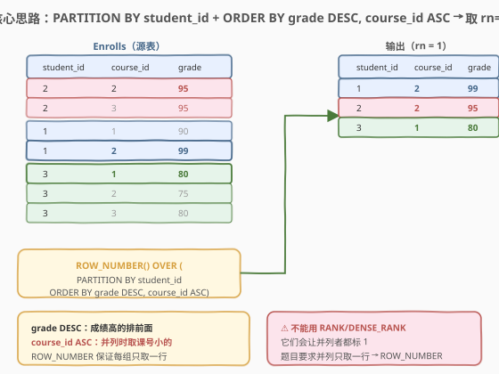
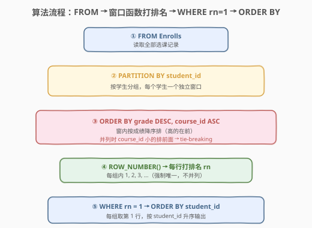
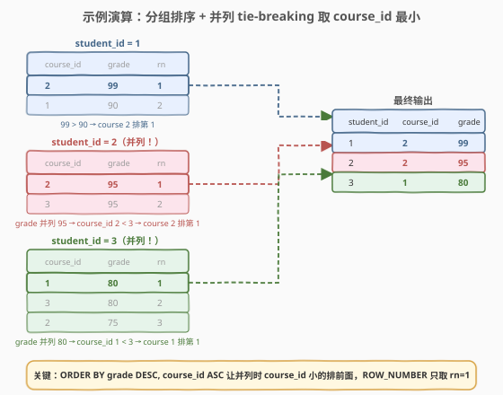

# 每位学生的最高成绩

- **题目名称**：每位学生的最高成绩
- **链接**：[1112. 每位学生的最高成绩](https://leetcode.cn/problems/highest-grade-for-each-student/)
- **难度**：中等
- **标签**：SQL、窗口函数、ROW_NUMBER、GROUP BY、子查询、分组求最值、tie-breaking

## 1. 题目概述

给定 `Enrolls` 表，每行记录一名学生在某门课程中获得的成绩。编写 SQL 查询，找出**每个学生成绩最高的那门课**。如果某学生有多门课并列最高分，则返回 `course_id` 最小的那一门。结果按 `student_id` 升序排列。

**表结构**：

```text
Table: Enrolls
+-------------+---------+
| Column Name | Type    |
+-------------+---------+
| student_id  | int     |  ← 主键之一
| course_id   | int     |  ← 主键之一
| grade       | int     |
+-------------+---------+
```

> 💡 **关键约束**：`(student_id, course_id)` 是复合主键——同一个学生在同一门课不会有两条记录，但**一个学生可以选修多门课**（即一个 `student_id` 对应多行）。题目要的是「每个学生的所有行里 `grade` 最大的那一行」，且**并列时只取一行**（`course_id` 最小的）。

**示例 1**：

```text
输入：
Enrolls 表:
+------------+-----------+-------+
| student_id | course_id | grade |
+------------+-----------+-------+
| 2          | 2         | 95    |
| 2          | 3         | 95    |
| 1          | 1         | 90    |
| 1          | 2         | 99    |
| 3          | 1         | 80    |
| 3          | 2         | 75    |
| 3          | 3         | 80    |
+------------+-----------+-------+

输出：
+------------+-----------+-------+
| student_id | course_id | grade |
+------------+-----------+-------+
| 1          | 2         | 99    |
| 2          | 2         | 95    |
| 3          | 1         | 80    |
+------------+-----------+-------+
```

**解释**：

- 学生 1：课程 1 得 90 分、课程 2 得 99 分，最高 99 → `course_id = 2`
- 学生 2：课程 2 和课程 3 **并列** 95 分（最高），取 `course_id` 最小 → `course_id = 2`
- 学生 3：课程 1 得 80 分、课程 2 得 75 分、课程 3 得 80 分，课程 1 和课程 3 **并列** 80 分（最高），取 `course_id` 最小 → `course_id = 1`

**约束条件**：

- `Enrolls` 表的复合主键为 `(student_id, course_id)`
- `grade` 为整数，可能存在并列最高分
- 并列最高分时只返回 `course_id` 最小的一行
- 结果按 `student_id` 升序排列

> 💡 本题是 [512. 游戏玩法分析 II](../0501-0600/512_游戏玩法分析II.md) 和 [184. 部门工资最高的员工](../0101-0200/184_部门工资最高的员工.md) 的同族变体——都是「分组取最值所在行」。区别在于：184 **并列全返回**（用 `RANK`），512 取首登且无并列（主键保证唯一），而**本题并列只取一行**（需 `ROW_NUMBER` + 多键排序做 tie-breaking）。这一差异正是窗口函数三兄弟 `ROW_NUMBER` / `RANK` / `DENSE_RANK` 选取的关键分水岭。

---

## 2. 解题思路

### 2.1 暴力思路：过程式逐学生扫描

最直觉的过程式思路是：对每个 `student_id`，取出其所有行，找到 `grade` 最大的那一行；若有多行 `grade` 相同且均为最大值，再在其中取 `course_id` 最小的。伪代码如下：

```text
for each student_id in DISTINCT(student_id):
    max_grade = MAX(grade) among rows of this student
    candidates = rows where grade == max_grade
    min_course = MIN(course_id) among candidates
    emit (student_id, min_course, max_grade)
```

但**纯 SQL 没有显式循环语句**——需要换成集合式表达。上述「分组 + 组内求最值 + 并列去重」的模式，有两种 SQL 范式：

1. **窗口函数**：`ROW_NUMBER() OVER (PARTITION BY student_id ORDER BY grade DESC, course_id ASC)` 给每行打组内排名，取 `rn = 1`。
2. **子查询 JOIN**：先用 `GROUP BY` 求每人最高分，再 `JOIN` 回原表定位到行，最后处理并列取 `MIN(course_id)`。

> ⚠️ **关键转换**：tie-breaking（并列时取 `course_id` 最小）是本题的核心难点。过程式思维里「先取最大值，再在最大值中取最小 course_id」是两步；而在窗口函数里，`ORDER BY grade DESC, course_id ASC` 用**多键排序一步到位**——先按成绩降序，成绩相同再按课号升序，`rn = 1` 自然就是「成绩最高且并列时课号最小」的那一行。

### 2.2 核心观察：ROW_NUMBER + 多键 ORDER BY 一步到位



**问题本质**：本题是「每组取最值所在行」+「并列时用第二键打破平局」。`GROUP BY + MAX(grade)` 只能给出每人最高分是多少，**不知道是哪门课**；而且并列时 `MAX` 无法区分——两行 `grade` 都是最大值，`GROUP BY` 压成一行后不知道选哪个 `course_id`。

**窗口函数一步到位**：

$$\text{rn}(r) = \text{ROW\_NUMBER}\Big(\text{PARTITION BY student\_id ORDER BY grade DESC, course\_id ASC}\Big)$$

- `PARTITION BY student_id`：按学生分窗，每个学生一个独立的排名序列
- `ORDER BY grade DESC`：窗内按成绩降序，分数高的排前面
- `ORDER BY course_id ASC`：**tie-breaker**——成绩相同时，课号小的排前面
- `ROW_NUMBER()`：强制唯一编号 1, 2, 3, ...（不并列），取 `rn = 1` 即「最高分 + 并列时课号最小」

> 💡 **为什么用 `ROW_NUMBER` 而非 `RANK`/`DENSE_RANK`？** 因为题目要求并列时**只取一行**（`course_id` 最小的）。`RANK` 和 `DENSE_RANK` 给并列者相同排名（都是 1），`WHERE rk = 1` 会把所有并列行都返回——这对 [184. 部门工资最高的员工](../0101-0200/184_部门工资最高的员工.md)（并列全返回）是对的，但对本题（并列只取一行）是错的。`ROW_NUMBER` 强制每行唯一编号，`rn = 1` 严格只取一行，配合 `ORDER BY grade DESC, course_id ASC` 确保「并列时取 `course_id` 最小的那一行」。

### 2.3 算法流程图



**逻辑执行步骤**：

| 步骤 | 子句 | 作用 |
|------|------|------|
| ① | `FROM Enrolls` | 读取全部选课记录 |
| ② | `PARTITION BY student_id` | 按学生分窗，每个学生独立排名 |
| ③ | `ORDER BY grade DESC, course_id ASC` | 窗内排序：成绩降序，并列时课号升序 |
| ④ | `ROW_NUMBER()` | 每行打排名 rn（强制唯一，不并列） |
| ⑤ | `WHERE rn = 1` | 每组取第 1 行 |
| ⑥ | `ORDER BY student_id` | 按 `student_id` 升序输出 |

> 💡 **窗口函数的执行位置**：窗口函数在 `GROUP BY`/`HAVING` 之后、`ORDER BY`/`LIMIT` 之前计算。因为窗口函数是「行级」操作（给每行附加一个值），所以必须放在子查询里——先在子查询中打好 `rn`，外层再 `WHERE rn = 1` 筛选。不能直接在 `WHERE` 里写 `ROW_NUMBER() = 1`，因为 `WHERE` 执行时窗口函数还没计算。

### 2.4 示例演算

以示例数据为例，观察 `PARTITION BY student_id ORDER BY grade DESC, course_id ASC` 如何给每个学生的行打排名：



| student_id | course_id | grade | rn | 说明 |
|------------|-----------|-------|----|------|
| 1 | 2 | 99 | **1** | 99 > 90，最高分，rn = 1 ✓ |
| 1 | 1 | 90 | 2 | 90 < 99，排第 2 |
| 2 | 2 | 95 | **1** | grade 并列 95，course_id 2 < 3，rn = 1 ✓ |
| 2 | 3 | 95 | 2 | grade 并列 95，course_id 3 > 2，rn = 2 |
| 3 | 1 | 80 | **1** | grade 并列 80，course_id 1 < 3，rn = 1 ✓ |
| 3 | 3 | 80 | 2 | grade 并列 80，course_id 3 > 1，rn = 2 |
| 3 | 2 | 75 | 3 | 75 < 80，排第 3 |

> 💡 **注意学生 2 和学生 3 的并列场景**：`grade` 相同时，`ORDER BY course_id ASC` 让课号小的排在前面，获得 `rn = 1`。这正是 `ROW_NUMBER` 配合多键排序的威力——tie-breaking 被编码在 `ORDER BY` 的第二排序键里，无需额外去重步骤。若误用 `RANK()`，学生 2 的两行都会标 `rn = 1`，输出两行，违反「只取一行」的要求。

---

## 3. 参考代码

### SQL（解法 A：窗口函数 ROW_NUMBER，推荐）

```sql
SELECT student_id, course_id, grade
FROM (
    SELECT student_id, course_id, grade,
           ROW_NUMBER() OVER (
               PARTITION BY student_id
               ORDER BY grade DESC, course_id ASC
           ) AS rn
    FROM Enrolls
) t
WHERE rn = 1
ORDER BY student_id;
```

> 💡 **写法要点**：
> - `PARTITION BY student_id` 按学生分窗，每个学生独立排名序列。
> - `ORDER BY grade DESC` 成绩高的排前面；`course_id ASC` 成绩并列时课号小的排前面——**多键排序一步实现 tie-breaking**。
> - `ROW_NUMBER()` 强制唯一编号，`rn = 1` 严格取每组一行。
> - 子查询 `t` 打好 `rn` 后，外层 `WHERE rn = 1` 筛选，最后 `ORDER BY student_id` 满足题目要求的输出顺序。
> - ✓ **最优雅**：tie-breaking 逻辑完全编码在 `ORDER BY` 里，无需额外子查询或 `MIN(course_id)` 嵌套。

### SQL（解法 B：子查询 JOIN + MIN 处理并列）

```sql
SELECT e.student_id, MIN(e.course_id) AS course_id, e.grade
FROM Enrolls e
JOIN (
    SELECT student_id, MAX(grade) AS max_grade
    FROM Enrolls
    GROUP BY student_id
) m ON e.student_id = m.student_id AND e.grade = m.max_grade
GROUP BY e.student_id, e.grade
ORDER BY e.student_id;
```

> 💡 **写法要点**：
> - 子查询 `m` 用 `GROUP BY student_id` + `MAX(grade)` 求每人最高分。
> - `JOIN ... ON e.student_id = m.student_id AND e.grade = m.max_grade` 定位到「最高分所在行」——但并列时会匹配多行。
> - 外层再 `GROUP BY e.student_id, e.grade` + `MIN(e.course_id)` 在并列行中取课号最小——**两层聚合处理并列**。
> - ⚠️ 比解法 A 啰嗦：先 `MAX(grade)` 求最高分，再 `MIN(course_id)` 在并列中取最小，两步聚合。但不需要窗口函数，兼容老版本数据库。

### Python（pandas）

```python
import pandas as pd

def highest_grade(enrolls: pd.DataFrame) -> pd.DataFrame:
    enrolls = enrolls.sort_values(
        ['student_id', 'grade', 'course_id'],
        ascending=[True, False, True]
    )
    result = enrolls.drop_duplicates('student_id', keep='first')
    return result[['student_id', 'course_id', 'grade']].reset_index(drop=True)
```

> 💡 **pandas 对照**：`sort_values(['student_id', 'grade', 'course_id'], ascending=[True, False, True])` 对应 SQL 的 `PARTITION BY student_id ORDER BY grade DESC, course_id ASC`——先按学生分组（排序保证同学生连续），再按成绩降序、课号升序。`drop_duplicates('student_id', keep='first')` 取每个学生排序后的第一行，对应 `WHERE rn = 1`。`keep='first'` 保证了并列时取排序靠前（即 `course_id` 小）的那一行。

---

## 4. 复杂度分析

| 维度 | 复杂度 | 说明 |
|------|--------|------|
| **时间（窗口函数）** | $O(n \log n)$ | `PARTITION BY ... ORDER BY` 需对每个分区排序，总计 $O(n \log n)$；外层过滤 $O(n)$。$n$ = `Enrolls` 行数 |
| **时间（子查询 JOIN）** | $O(n \log n)$ | 子查询 `GROUP BY` 排序 $O(n \log n)$；`JOIN` 匹配 $O(n)$（主键索引）；外层 `GROUP BY + MIN` 再排序 $O(k \log k)$，$k$ = 并列行数 |
| **空间** | $O(n)$ | 窗口函数排序缓冲区 / 子查询物化中间结果 |
| **结果行数** | $O(m)$ | $m$ = 不同 `student_id` 数（每人恰好一行，$m \le n$） |

> ⚠️ SQL 复杂度取决于**执行计划与索引**：`(student_id, course_id)` 是主键（MySQL 聚簇索引），`PARTITION BY student_id` 可利用主键有序性加速分区。窗口函数需窗内排序，整体 $O(n \log n)$。解法 B 两次聚合 + JOIN，常数因子略大，但复杂度量级相同。面试中说明「窗口函数单次排序 $O(n \log n)$，主键索引加速分区」即可。

---

## 5. 扩展：ROW_NUMBER vs RANK vs DENSE_RANK 在 tie-breaking 中的取舍

### 5.1 三者的并列处理行为

| 函数 | 并列处理 | 示例（grade: 95, 95, 90） | 取 `rn = 1` 的行数 |
|------|----------|--------------------------|-------------------|
| `ROW_NUMBER()` | 强制唯一编号 1, 2, 3 | 1, 2, 3 | **1 行**（排序第一的那行） |
| `RANK()` | 并列同秩，跳号 | 1, 1, 3 | 2 行（两个并列者都返回） |
| `DENSE_RANK()` | 并列同秩，不跳号 | 1, 1, 2 | 2 行（两个并列者都返回） |

> 💡 **本题要求并列只取一行 → 必须用 `ROW_NUMBER`**。`RANK` 和 `DENSE_RANK` 都会把并列者标为 1，`WHERE rn = 1` 会返回多行，违反题意。而 `ROW_NUMBER` 配合 `ORDER BY grade DESC, course_id ASC` 的第二排序键，让 `course_id` 小的排在前面获得 `rn = 1`，自然实现 tie-breaking。

### 5.2 对比 184：何时用 RANK，何时用 ROW_NUMBER

| 题目 | 并列要求 | 选用函数 | 原因 |
|------|----------|----------|------|
| [184. 部门工资最高的员工](../0101-0200/184_部门工资最高的员工.md) | **并列全返回** | `RANK` / `DENSE_RANK` | 并列者都标 1，`WHERE rk = 1` 全取 |
| **1112. 每位学生的最高成绩** | **并列只取一行** | `ROW_NUMBER` | 强制唯一编号，只取排序第一行 |
| [512. 游戏玩法分析 II](../0501-0600/512_游戏玩法分析II.md) | 无并列（主键保证） | 三者等价 | 首登日期唯一，无并列场景 |
| [185. 部门工资前三高](https://leetcode.cn/problems/department-top-three-salaries/) | 并列全返回 + Top-K | `DENSE_RANK` | 不跳号，`rk <= 3` 取前三档 |

> 💡 **选择口诀**：**并列全返回用 `RANK`/`DENSE_RANK`，并列只取一行用 `ROW_NUMBER`**。`RANK` 与 `DENSE_RANK` 的区别只在 Top-K 场景（跳号与否），Top-1 时两者等价。`ROW_NUMBER` 的 tie-breaking 完全由 `ORDER BY` 的后续排序键决定——这是它相对 `RANK` 的独特优势：**把「并列时怎么选」编码在排序键里，而非让并列者都返回再事后筛选**。

### 5.3 从 511/512 到 1112：分组取最值的三层进阶

| 题号 | 要求 | 核心范式 | 并列处理 |
|------|------|----------|----------|
| [511](../0501-0600/511_游戏玩法分析I.md) | 每人首登**日期** | `GROUP BY + MIN` | 无（只要标量值） |
| [512](../0501-0600/512_游戏玩法分析II.md) | 每人首登**设备** | `GROUP BY + MIN` + JOIN 回原表 / 窗口函数 | 无（主键保证唯一） |
| [184](../0101-0200/184_部门工资最高的员工.md) | 每部门最高薪**员工** | `GROUP BY + MAX` + IN / `RANK()` | **并列全返回** |
| **1112** | 每学生最高分**课程** | `ROW_NUMBER()` + 多键 ORDER BY | **并列只取一行** |

> 💡 这四题共享「分组取最值所在行」的骨架，差异在并列处理策略：511/512 无并列（主键保证），184 并列全返回（`RANK`），1112 并列取一行（`ROW_NUMBER` + tie-breaker）。理解这三种并列策略，所有「每组取最值行」SQL 题都能覆盖。

---

## 6. 面试要点

1. **为什么用 `ROW_NUMBER` 而非 `RANK`/`DENSE_RANK`？**

   - 题目要求并列最高分时**只返回一行**（`course_id` 最小的）。`RANK` 和 `DENSE_RANK` 给并列者相同排名（都是 1），`WHERE rk = 1` 会返回所有并列行——这对 184（并列全返回）是对的，但对本题是错的。`ROW_NUMBER` 强制每行唯一编号（1, 2, 3...），`rn = 1` 严格只取一行，配合 `ORDER BY grade DESC, course_id ASC` 让 `course_id` 小的排在前面，自然实现 tie-breaking。

2. **`ORDER BY grade DESC, course_id ASC` 的第二排序键有什么作用？**

   - 第一排序键 `grade DESC` 让成绩高的排前面；第二排序键 `course_id ASC` 是 **tie-breaker**——当 `grade` 相同时（并列最高分），`course_id` 小的排在前面，获得 `rn = 1`。这把「并列时取 `course_id` 最小」的需求直接编码在排序键里，无需额外子查询或 `MIN` 聚合。如果去掉第二排序键，`ROW_NUMBER` 在并列时会**随机**选一行（数据库实现相关），结果不确定。

3. **解法 B 为什么需要两层聚合？**

   - 第一层 `MAX(grade)` 求每人最高分，`JOIN` 回原表定位到「最高分所在行」——但并列时匹配多行。第二层 `MIN(course_id)` 在并列行中取课号最小。两步聚合对应过程式思维里「先取最大值，再在最大值中取最小 course_id」。比窗口函数啰嗦，但兼容不支持窗口函数的老版本数据库。

4. **窗口函数为什么必须放在子查询里？**

   - 窗口函数在 `GROUP BY`/`HAVING` 之后、`ORDER BY`/`LIMIT` 之前计算，是「行级」操作——给每行附加一个排名值。`WHERE` 子句在窗口函数之前执行，所以不能直接写 `WHERE ROW_NUMBER() = 1`。必须先在子查询中计算 `rn`，外层再 `WHERE rn = 1` 筛选。这是所有窗口函数 + 行筛选题目的通用模式。

5. **复合主键 `(student_id, course_id)` 对本题有什么影响？**

   - 它保证同一学生在同一门课不会有两条记录，但不同课可以有相同的 `grade`（并列）。主键在 MySQL 中是聚簇索引，`PARTITION BY student_id` 能利用主键有序性高效分区。若主键不含 `course_id`（同一学生同一门课可多条记录），并列场景会更复杂——可能同课同分多行，需额外定义 tie-breaking 规则。

> 💡 **一句话总结**：1112 是「分组取最值行 + 并列 tie-breaking」的招牌题——核心就一句 `ROW_NUMBER() OVER (PARTITION BY student_id ORDER BY grade DESC, course_id ASC)` + `WHERE rn = 1`。考点不在查询难度，而在理解「并列只取一行 → `ROW_NUMBER`；并列全返回 → `RANK`/`DENSE_RANK`」这条选择准则，以及「tie-breaking 编码在 `ORDER BY` 多键排序里」这一优雅技巧。

---

## 7. 同类练习题

- [512. 游戏玩法分析 II](https://leetcode.cn/problems/game-play-analysis-ii/)：同族前置题——分组取最值所在行，但无并列（主键保证唯一），`ROW_NUMBER`/`JOIN` 均可；对比 1112 理解「有并列时需额外 tie-breaking」
- [184. 部门工资最高的员工](https://leetcode.cn/problems/department-highest-salary/)：同族对比题——同样是分组取最高分/工资所在行，但**并列全返回**（用 `RANK`），与 1112 的**并列只取一行**（用 `ROW_NUMBER`）形成鲜明对照
- [185. 部门工资前三高的所有员工](https://leetcode.cn/problems/department-top-three-salaries/)：Top-K 进阶版——把「取最高」扩展为「取前三高」，必须用 `DENSE_RANK` 处理跨名次并列，与 1112 的 `ROW_NUMBER` 取 Top-1 互补
- [511. 游戏玩法分析 I](https://leetcode.cn/problems/game-play-analysis-i/)：分组聚合母题——`GROUP BY + MIN` 只取标量最值（不取所在行），是 1112/512/184 的最小子问题
- [602. 好友申请 II 谁有最多的好友](https://leetcode.cn/problems/friend-requests-ii-who-has-the-most-friends/)：另一道「分组取最值 + 并列处理」题，需用 `RANK` 或子查询取计数最大者，与 1112 共享「分组排名 + 行筛选」骨架
