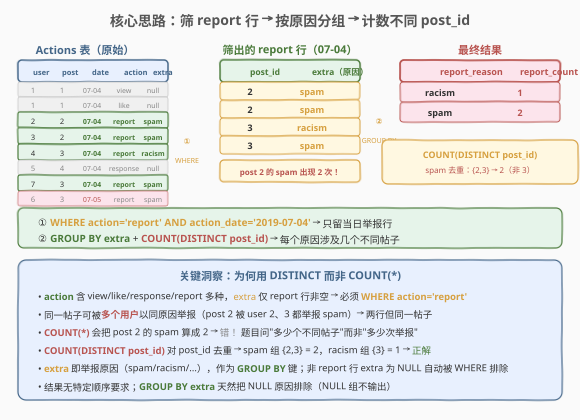
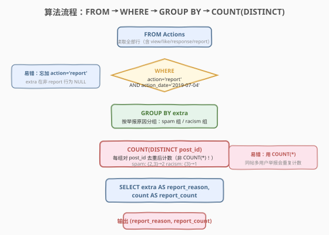
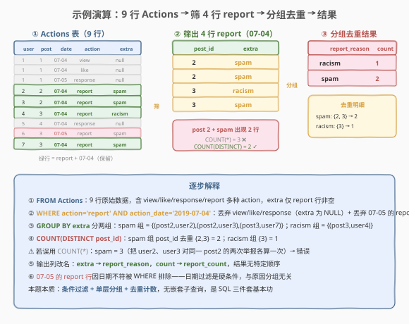

# LeetCode 报告的记录 题解

## 1. 题目概述

- **标题 / 题号**：报告的记录（#1113，easy）
- **链接**：https://leetcode.cn/problems/reported-posts/
- **难度**：简单
- **标签**：SQL、WHERE 过滤、GROUP BY、COUNT(DISTINCT)、聚合去重

**题意**：给定 `Actions` 表，记录用户对帖子的各类操作（浏览、点赞、回复、举报）。编写 SQL 查询，统计 **2019-07-04 当天每个举报原因涉及多少个不同帖子**。

> ⚠️ 该题为 **🔒 Plus 会员专享题**。`Actions` 表**无主键**，可能存在重复行。`action` 是 ENUM 类型，取值包括 `'view'`、`'like'`、`'response'`、`'report'`；`extra` 是 ENUM 类型，存放举报原因（如 `'spam'`、`'racism'` 等），**仅当 `action = 'report'` 时非空**，其余情况为 `NULL`。

**表结构**：

```text
Table: Actions
+---------------+---------+
| Column Name   | Type    |
+---------------+---------+
| user_id       | int     |
| post_id       | int     |
| action_date   | date    |
| action        | enum    |  ← ('view', 'like', 'response', 'report')
| extra         | enum    |  ← 举报原因；action != 'report' 时为 NULL
+---------------+---------+
```

> 💡 该表无主键，可能包含重复行。同一帖子可被**多个不同用户**以**相同原因**举报——此时会产生多行 `post_id` 相同、`extra` 相同但 `user_id` 不同的记录。这正是本题必须用 `COUNT(DISTINCT post_id)` 而非 `COUNT(*)` 的根源。

**示例 1**：

```text
输入：
Actions 表
+---------+---------+-------------+----------+--------+
| user_id | post_id | action_date | action   | extra  |
+---------+---------+-------------+----------+--------+
| 1       | 1       | 2019-07-04  | view     | null   |
| 1       | 1       | 2019-07-04  | like     | null   |
| 1       | 1       | 2019-07-05  | response | null   |
| 2       | 2       | 2019-07-04  | report   | spam   |
| 3       | 2       | 2019-07-04  | report   | spam   |
| 4       | 3       | 2019-07-04  | report   | racism |
| 5       | 4       | 2019-07-04  | response | null   |
| 6       | 3       | 2019-07-05  | report   | spam   |
| 7       | 3       | 2019-07-04  | report   | spam   |
+---------+---------+-------------+----------+--------+

输出：
+---------------+--------------+
| report_reason | report_count |
+---------------+--------------+
| racism        | 1            |
| spam          | 2            |
+---------------+--------------+
```

**解释**：

| 步骤 | 筛选后的 report 行（07-04） | 归组 | post_id 去重集合 | report_count |
|------|------------------------------|------|------------------|--------------|
| ① | (post 2, spam) by user 2 | spam | {2} | — |
| ② | (post 2, spam) by user 3 | spam | {2} | — |
| ③ | (post 3, racism) by user 4 | racism | {3} | 1 |
| ④ | (post 3, spam) by user 7 | spam | {2, 3} | 2 |

- `spam` 组：post 2 被两个用户（2、3）举报，post 3 被用户 7 举报 → 去重后不同帖子 {2, 3} → **2**
- `racism` 组：仅 post 3 被用户 4 举报 → 不同帖子 {3} → **1**
- 07-05 的 report 行（user 6）因日期不符被排除；view/like/response 行因 `action != 'report'` 被排除

**约束**：

- `Actions` 表无主键，可能存在重复行
- `action` 为 ENUM（`'view'`、`'like'`、`'response'`、`'report'`）
- `extra` 为 ENUM（举报原因），仅 `action = 'report'` 时非空，否则为 `NULL`
- 只统计 `action_date = '2019-07-04'` 当天的举报
- 输出列名：`report_reason`、`report_count`
- 结果**无特定顺序要求**

> 💡 本题是 SQL **"条件过滤 + 分组去重计数"三件套基本功**——`WHERE` 双条件过滤（`action='report'` + 日期）、`GROUP BY extra` 按原因分组、`COUNT(DISTINCT post_id)` 去重计数。核心难点只有一个：识别"同一帖子被多人同原因举报"导致的重复，从而选用 `DISTINCT` 而非 `COUNT(*)`。

## 2. 解题思路

### 2.1 暴力思路：逐行扫描累加

对 `Actions` 表逐行扫描，凡是 `action = 'report' AND action_date = '2019-07-04'` 的行，按 `extra` 维护一个"已见 post_id 集合"，遇到集合中未出现的 `post_id` 才计数 +1。这在过程式语言里是一个哈希集合 + 计数器的循环。但**纯 SQL 没有逐行循环语句**——需要换成"集合式"表达：先 `WHERE` 过滤，再 `GROUP BY` 分组，最后用 `COUNT(DISTINCT)` 一步完成去重计数。

> ⚠️ 过程式思维（"遍历每行、查集合去重、累加"）在 SQL 中浓缩为 `COUNT(DISTINCT post_id)` 一个聚合函数——`DISTINCT` 关键字正是"集合去重"的声明式表达。

### 2.2 核心观察：WHERE 过滤 + GROUP BY + COUNT(DISTINCT)



**关键洞察**：题目问的是"每个原因涉及**多少个不同帖子**"，而非"多少次举报"。两者区别在于：同一帖子被多个用户以相同原因举报时，会产生多行 `(post_id, extra)` 相同的记录——`COUNT(*)` 会重复计数，`COUNT(DISTINCT post_id)` 则按帖子去重。解法分三步：

1. **`WHERE action = 'report' AND action_date = '2019-07-04'`**：双条件过滤——`action` 条件丢弃 view/like/response（其 `extra` 为 `NULL`），日期条件丢弃非 07-04 的举报；
2. **`GROUP BY extra`**：按举报原因分组，`extra` 即原因（spam/racism/...）；
3. **`COUNT(DISTINCT post_id)`**：每组对 `post_id` 去重后计数。

$$\text{report\_count}(\text{reason}) = \big|\,\text{DISTINCT post\_id} \;\big|\; \text{s.t. } \text{action}=\text{'report'} \,\wedge\, \text{action\_date}=\text{'2019-07-04'} \,\wedge\, \text{extra}=\text{reason}\,$$

> 💡 **为何 `COUNT(DISTINCT)` 而非 `COUNT(*)`**：示例中 post 2 被 user 2 和 user 3 都以 `spam` 举报，产生两行 `(post 2, spam)`。`COUNT(*)` 会算成 2，但它们是**同一个帖子**，应只算 1 个不同帖子。`COUNT(DISTINCT post_id)` 对组内 `post_id` 取唯一值后再计数，spam 组 {2, 3} = 2，racism 组 {3} = 1，正是期望结果。

> ⚠️ **三个易错点**：
> - **必须 `WHERE action = 'report'`**：`extra` 在非 report 行为 `NULL`，若不过滤直接 `GROUP BY extra`，会产生一个 `NULL` 原因组（汇总所有非举报行），污染结果。
> - **`COUNT(DISTINCT post_id)` 而非 `COUNT(*)` 或 `COUNT(post_id)`**：`COUNT(post_id)` 等价于 `COUNT(*)`（`post_id` 非 NULL），都不去重。唯有 `DISTINCT` 才能消除"同帖多用户举报"的重复。
> - **日期是硬条件 `action_date = '2019-07-04'`**：不是"过去 30 天"等范围，而是精确等于某一天，用 `=` 而非 `BETWEEN`。

### 2.3 算法流程图



**完整步骤**：

1. **`FROM Actions`**：读取全部行（含 view/like/response/report 四种 action）
2. **`WHERE action = 'report' AND action_date = '2019-07-04'`**：丢弃非举报行（`extra` 为 NULL）+ 丢弃非当日举报 → 只剩当日举报行
3. **`GROUP BY extra`**：按举报原因分组（spam 组 / racism 组 / ...）
4. **`COUNT(DISTINCT post_id) AS report_count`**：每组对 `post_id` 去重后计数
5. **`SELECT extra AS report_reason, ...`**：输出列改名，结果无特定顺序

> ⚠️ **`GROUP BY extra` 自动排除 `NULL` 原因吗**：本题中 `WHERE action = 'report'` 已先过滤掉 `extra` 为 `NULL` 的行，故 `GROUP BY extra` 不会产生 `NULL` 组。即便没有 `WHERE`，MySQL 的 `GROUP BY` 会把 `NULL` 视为一个独立分组（`NULL` 组）输出——这是另一个必须先 `WHERE` 过滤的理由。

### 2.4 示例演算

以示例 1 数据为例，观察逐步执行过程：



**步骤 ①：`FROM Actions`** 得到 9 行原始数据（含 view/like/response/report）。

**步骤 ②：`WHERE action = 'report' AND action_date = '2019-07-04'`**

丢弃 5 行（3 行非 report：view/like/response；1 行 07-05 的 report；1 行 07-05 的 response），剩 4 行当日举报：

| post_id | extra |
|---------|-------|
| 2 | spam |
| 2 | spam |
| 3 | racism |
| 3 | spam |

> 💡 **post 2 + spam 出现两行**（user 2 和 user 3 各举报一次）。这是 `DISTINCT` 发挥作用的关键场景——两行同一个帖子，去重后只算 1 个。

**步骤 ③④：`GROUP BY extra` + `COUNT(DISTINCT post_id)`**

| 组 (extra) | 组内 post_id | 去重集合 | report_count |
|------------|--------------|----------|--------------|
| spam | 2, 2, 3 | {2, 3} | 2 |
| racism | 3 | {3} | 1 |

最终输出（顺序不限）即示例 1 的结果。

## 3. 参考代码

### SQL（解法 A：WHERE + GROUP BY + COUNT(DISTINCT)，推荐）

```sql
SELECT extra                   AS report_reason,
       COUNT(DISTINCT post_id) AS report_count
FROM Actions
WHERE action = 'report'
  AND action_date = '2019-07-04'
GROUP BY extra;
```

> 💡 **写法要点**：
> - `WHERE` 双条件过滤：`action = 'report'` 排除非举报行（顺带排除 `extra` 为 `NULL` 的行）；`action_date = '2019-07-04'` 锁定当天。
> - `GROUP BY extra` 按举报原因分组，`extra` 即原因字段。
> - **`COUNT(DISTINCT post_id)`** 是本题灵魂——对组内 `post_id` 去重，消除"同帖被多用户同原因举报"的重复。
> - 输出列改名 `extra AS report_reason`、`... AS report_count` 以匹配期望列名。
> - 不加 `ORDER BY`：题目对结果顺序无要求，省去排序开销。

### SQL（解法 B：子查询预过滤 + 外层分组）

```sql
SELECT extra AS report_reason,
       COUNT(DISTINCT post_id) AS report_count
FROM (
    SELECT post_id, extra
    FROM Actions
    WHERE action = 'report'
      AND action_date = '2019-07-04'
) t
GROUP BY extra;
```

> 💡 **与解法 A 的区别**：把 `WHERE` 过滤下推到子查询 `t`，外层只做 `GROUP BY + COUNT(DISTINCT)`。语义完全等价，但结构上将"过滤"与"聚合"分到两层，可读性更分层式——适合过滤条件复杂（多表 JOIN、多层条件）时把数据清洗与聚合解耦。本题过滤简单，解法 A 更直接。

### Python（pandas）

```python
import pandas as pd

def reported_posts(actions: pd.DataFrame) -> pd.DataFrame:
    mask = (actions['action'] == 'report') & (actions['action_date'] == '2019-07-04')
    reports = actions[mask]
    result = (reports.groupby('extra')['post_id']
              .nunique()
              .reset_index()
              .rename(columns={'extra': 'report_reason', 'post_id': 'report_count'}))
    return result.sort_values('report_reason').reset_index(drop=True)
```

> 💡 **pandas 对照**：布尔掩码 `(action=='report') & (action_date=='07-04')` 对应 SQL `WHERE` 双条件；`groupby('extra')['post_id'].nunique()` 对应 `GROUP BY extra` + `COUNT(DISTINCT post_id)`——`.nunique()` 即"唯一值个数"，是 pandas 版的 `COUNT(DISTINCT)`。注意用 `.nunique()` 而非 `.count()`：后者统计非空值个数（不去重），等价于 SQL 的 `COUNT(post_id)`，会把同帖多次举报重复计数。`.rename` 对应 `AS` 列改名。

## 4. 复杂度分析

| 维度 | 解法 A（直接 WHERE） | 解法 B（子查询预过滤） | pandas |
|------|---------------------|----------------------|--------|
| **时间** | $O(n)$ | $O(n)$ | $O(n)$ |
| **空间** | $O(r \cdot p)$ | $O(r \cdot p)$ | $O(n)$ |
| **扫描次数** | 1 次（过滤 + 聚合一趟完成） | 1 次（子查询物化后聚合，优化器常合并） | 1 次（掩码 + groupby） |
| **推荐度** | ✓ **首选**，简洁直接 | ✓ 备选，分层清晰 | △ 仅用于离线分析 |

> - $n$ = `Actions` 表行数，$r$ = 不同举报原因数（很小，通常 < 10），$p$ = 每组内不同 `post_id` 数
> - 时间 $O(n)$：单趟扫描 + 哈希分组；`COUNT(DISTINCT)` 在每组内维护一个 `post_id` 哈希集合，去重开销 $O(p)$，总计 $O(n)$
> - 空间 $O(r \cdot p)$：每组维护一个 `post_id` 去重集合；解法 B 额外物化子查询结果，但优化器通常将其与外层合并为一次扫描
> - **为何不是 $O(n \log n)$**：`COUNT(DISTINCT)` 在 MySQL 中对每组用临时哈希表去重（非排序），无需排序；仅当数据量极大触发 sort 时才退化

## 5. 扩展：COUNT(DISTINCT) 与变体

### 5.1 需求变体——统计每天的举报次数（不限日期）

若需求改为"统计**每个日期**每个原因的举报**次数**（不去重帖子）"，则去掉日期过滤、改用 `COUNT(*)`，并按 `(action_date, extra)` 复合分组：

```sql
SELECT action_date,
       extra AS report_reason,
       COUNT(*) AS report_count
FROM Actions
WHERE action = 'report'
GROUP BY action_date, extra
ORDER BY action_date, report_reason;
```

> 💡 **与原题对比**：① 去掉 `action_date = '2019-07-04'`，改为 `GROUP BY action_date` 把日期作为分组键之一；② `COUNT(*)` 而非 `COUNT(DISTINCT post_id)`——因为问的是"次数"而非"不同帖子数"，每次举报都算一次。这揭示了**聚合函数的选择由业务语义决定**："多少个不同实体"用 `COUNT(DISTINCT)`，"多少次事件"用 `COUNT(*)`。

### 5.2 同表进阶——1132 报告的记录 II

本题的姐妹题 [1132. 报告的记录 II](https://leetcode.cn/problems/reported-posts-ii/) 共用 `Actions` 表并引入 `Removals` 表，要求计算"每天被举报为 `spam` 的帖子中**被删除的比例百分比**"，需 `LEFT JOIN` + `COUNT(DISTINCT) / COUNT(DISTINCT) * 100` + `AVG` + `ROUND`。1132 是本题的"多表 + 比率聚合"升级版——先掌握本题的 `COUNT(DISTINCT)` 去重计数，再叠加 JOIN 与比率计算即可。

## 6. 面试要点

1. **为什么用 `COUNT(DISTINCT post_id)` 而不是 `COUNT(*)`？**

   > 题目问"每个原因涉及**多少个不同帖子**"而非"多少次举报"。同一帖子可被多个用户以相同原因举报（如示例中 post 2 被 user 2、3 都举报 spam），产生多行 `(post_id, extra)` 相同的记录。`COUNT(*)` 会把每次举报各算一次（spam = 3），重复计数；`COUNT(DISTINCT post_id)` 对组内 `post_id` 取唯一值后再计数（spam = {2,3} = 2），才是"不同帖子数"。

2. **`WHERE action = 'report'` 可以省略吗？只用 `WHERE extra IS NOT NULL` 行不行？**

   > 本题中两者等价——`extra` 仅在 `action = 'report'` 时非空，所以 `extra IS NOT NULL` 隐含 `action = 'report'`。但用 `action = 'report'` 语义更直观（"过滤出举报行"），且不依赖"`extra` 非空当且仅当 `action = 'report'`"这一隐含约束，更稳健。面试答："两者结果相同，但 `action = 'report'` 表意更清晰，推荐用它。"

3. **`GROUP BY extra` 会不会产生 `NULL` 原因组？**

   > 本题不会——`WHERE action = 'report'` 已先过滤掉 `extra` 为 `NULL` 的行，进入 `GROUP BY` 的行 `extra` 均非空。但若**忘加 `WHERE`**，MySQL 会把所有 `extra` 为 `NULL` 的非举报行归入一个 `NULL` 组输出，污染结果。这是必须先 `WHERE` 过滤的又一理由。SQL 标准中 `GROUP BY` 把 `NULL` 视为一个独立分组（`NULL` 组），与"忽略 `NULL`"的聚合函数（`COUNT(col)` 忽略 `NULL`）行为不同。

4. **`COUNT(post_id)`、`COUNT(*)`、`COUNT(DISTINCT post_id)` 三者区别？**

   > `COUNT(*)` 统计组内**所有行数**（含 `NULL`）；`COUNT(post_id)` 统计 `post_id` **非空**的行数——本题中 `post_id` 恒非空，故两者等价，都不去重。`COUNT(DISTINCT post_id)` 先对 `post_id` 取唯一值再计数，是唯一能消除"同帖多次举报"重复的写法。三者的关系：`COUNT(*) = COUNT(post_id) ≥ COUNT(DISTINCT post_id)`，仅当组内 `post_id` 全唯一时等号成立。

5. **如果 `Actions` 表有主键 `(user_id, post_id, action_date)`，还需要 `DISTINCT` 吗？**

   > **需要**。该主键只保证"同一用户同一天对同一帖子只有一行"，但不限制"不同用户同一天对同一帖子各举报一次"。示例中 user 2 和 user 3 同在 07-04 举报 post 2 为 spam，两行主键不同（`user_id` 不同）但 `post_id` 相同——`COUNT(*)` 仍会算 2，`COUNT(DISTINCT post_id)` 才正确算 1。主键的存在与是否需要 `DISTINCT` 无关，关键看"分组键 (`extra`) 与计数列 (`post_id`) 是否一一对应"——只要一个 `extra` 值可能对应多个相同 `post_id`，就需要 `DISTINCT`。

> 💡 **一句话总结**：1113 是 SQL **"条件过滤 + 分组去重计数"三件套**入门题——`WHERE action='report' AND action_date='2019-07-04'` 双条件过滤、`GROUP BY extra` 按原因分组、`COUNT(DISTINCT post_id)` 去重计数。唯一考点：识别"同帖被多用户同原因举报"的重复，选用 `DISTINCT` 而非 `COUNT(*)`。记住判断公式——"问多少个不同实体用 `COUNT(DISTINCT)`，问多少次事件用 `COUNT(*)`"。

## 同类练习题

| # | 题目 | 与本题的关联 |
|---|------|-------------|
| 1132 | [报告的记录 II](https://leetcode.cn/problems/reported-posts-ii/) | 共用 `Actions` 表的姐妹题，叠加 `Removals` 表 JOIN + 比率百分比 `COUNT(DISTINCT)/COUNT(DISTINCT)` + `ROUND(AVG)`，是本题的多表升级版 |
| 1141 | [查询近 30 天活跃用户数](https://leetcode.cn/problems/user-activity-for-the-past-30-days-i/) | `WHERE activity_date BETWEEN` 日期过滤 + `GROUP BY activity_date, COUNT(DISTINCT user_id)`，对比 1113 的"按日去重计数用户" |
| 1173 | [即时食物配送 I](https://leetcode.cn/problems/immediate-food-delivery-ii/) | `COUNT` + 条件判定（`SUM(order_date = customer_pref_delivery_date)`），对比 1113 的纯 `COUNT(DISTINCT)`，体会条件聚合 vs 去重聚合的差异 |
| 596 | [超过 5 名学生的课](https://leetcode.cn/problems/classes-with-at-least-5-students/) | `GROUP BY class + COUNT(*)` 基础分组计数 + `HAVING` 过滤，是 1113 去掉 DISTINCT 与日期过滤的更朴素版本，适合对照理解 GROUP BY 骨架 |
