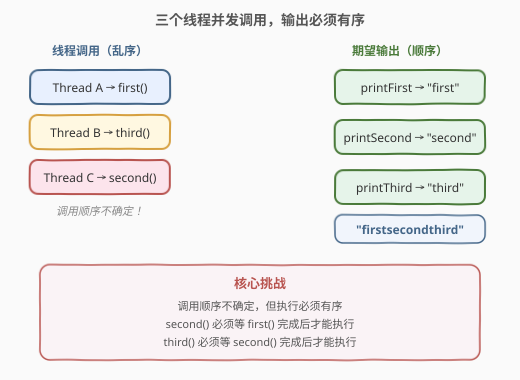
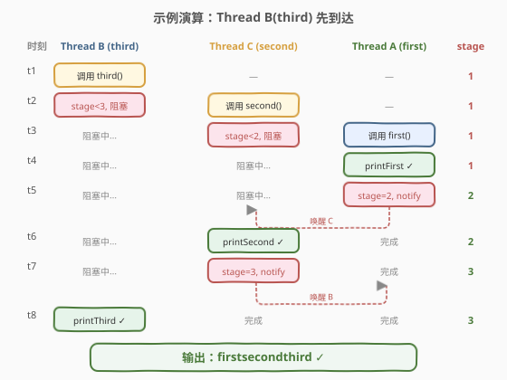

# 按序打印

- **题目名称**：按序打印
- **链接**：[1114. 按序打印](https://leetcode.cn/problems/print-in-order/)
- **难度**：中等
- **标签**：并发、多线程、同步原语

## 1. 题目概述

给定一个类 `Foo`，有三个方法 `first()`、`second()`、`third()`。三个不同的线程会**并发**调用这三个方法，但调用顺序不确定。

要求保证三个方法内部的 `printFirst`、`printSecond`、`printThird` **按顺序执行**，最终输出 `"firstsecondthird"`。

```cpp
class Foo {
public:
    Foo() {}
    void first(function<void()> printFirst) {
        // printFirst() outputs "first".
        printFirst();
    }
    void second(function<void()> printSecond) {
        // printSecond() outputs "second".
        printSecond();
    }
    void third(function<void()> printThird) {
        // printThird() outputs "third".
        printThird();
    }
};
```

**示例 1**：

```text
输入：[3, 1, 2]   // 线程 B 调用 third()，线程 A 调用 first()，线程 C 调用 second()
输出："firstsecondthird"
解释：
  线程 A 执行 first() → 输出 "first"
  线程 C 执行 second() → 输出 "second"
  线程 B 执行 third() → 输出 "third"
```

**示例 2**：

```text
输入：[1, 3, 2]   // 线程 A 调用 first()，线程 B 调用 third()，线程 C 调用 second()
输出："firstsecondthird"
```

**约束条件**：

- `printFirst`、`printSecond`、`printThird` 各被调用一次
- 三个方法的调用顺序由测试用例决定，是任意的
- 必须保证实际输出为 `"firstsecondthird"`

> ⚠️ **关键约束**：调用顺序不确定，但执行顺序必须确定。这是一个经典的**线程同步**问题——需要在无序的调用中建立有序的执行依赖。

---

## 2. 解题思路

### 2.1 暴力思路

不加任何同步，直接在三个方法中调用 `printXxx()`。但线程调度顺序不可控，`third()` 可能先于 `first()` 执行，导致输出 `"thirdfirstsecond"` 之类的乱序结果。

> ❌ 暴力不加锁是错误的，必须引入同步机制。

### 2.2 核心观察：stage 计数器 + 条件变量



**问题本质**：需要在三个线程之间建立 **happens-before** 依赖——`first` 完成后 `second` 才能执行，`second` 完成后 `third` 才能执行。

**解决方案**：用一个共享的 `stage` 计数器标记当前进展，配合条件变量让提前到达的线程阻塞等待。

- `stage` 初始为 1（表示 `first` 可以执行）
- `first()` 直接执行，完成后 `stage = 2`，唤醒等待者
- `second()` 调用时检查 `stage >= 2`，不满足则阻塞，完成后 `stage = 3`
- `third()` 调用时检查 `stage >= 3`，不满足则阻塞

> 💡 **条件变量的经典用法**：`cv.wait(lock, predicate)` 在 `predicate` 为 `false` 时释放锁并阻塞，被 `notify` 唤醒后重新加锁并再次检查 `predicate`。这天然实现了「等待某条件成立」的语义，且能防止**虚假唤醒**。

### 2.3 算法流程图


### 2.4 示例演算

以 `输入 [3, 1, 2]` 为例——Thread B(third) 最先到达，Thread A(first) 最后到达：



| 时刻 | Thread B (third) | Thread C (second) | Thread A (first) | stage |
|------|-------------------|---------------------|-------------------|-------|
| t1 | 调用 third() | — | — | 1 |
| t2 | stage<3, **阻塞** | 调用 second() | — | 1 |
| t3 | 阻塞中... | stage<2, **阻塞** | 调用 first() | 1 |
| t4 | 阻塞中... | 阻塞中... | printFirst ✓ | 1 |
| t5 | 阻塞中... | 阻塞中... | stage=2, notify → **唤醒 C** | 2 |
| t6 | 阻塞中... | printSecond ✓ | 完成 | 2 |
| t7 | 阻塞中... | stage=3, notify → **唤醒 B** | 完成 | 3 |
| t8 | printThird ✓ | 完成 | 完成 | 3 |

最终输出：`"firstsecondthird"` ✓

---

## 3. 参考代码

### C++

```cpp
#include <functional>
#include <mutex>
#include <condition_variable>

class Foo {
private:
    std::mutex mtx;
    std::condition_variable cv;
    int stage = 1;

public:
    Foo() {}

    void first(function<void()> printFirst) {
        std::unique_lock<std::mutex> lock(mtx);
        printFirst();
        stage = 2;
        cv.notify_one();
    }

    void second(function<void()> printSecond) {
        std::unique_lock<std::mutex> lock(mtx);
        cv.wait(lock, [this] { return stage >= 2; });
        printSecond();
        stage = 3;
        cv.notify_one();
    }

    void third(function<void()> printThird) {
        std::unique_lock<std::mutex> lock(mtx);
        cv.wait(lock, [this] { return stage >= 3; });
        printThird();
    }
};
```

### Python

```python
import threading

class Foo:
    def __init__(self):
        self.lock = threading.Lock()
        self.cv = threading.Condition(self.lock)
        self.stage = 1

    def first(self, printFirst: 'Callable[[], None]') -> None:
        with self.cv:
            printFirst()
            self.stage = 2
            self.cv.notify()

    def second(self, printSecond: 'Callable[[], None]') -> None:
        with self.cv:
            self.cv.wait_for(lambda: self.stage >= 2)
            printSecond()
            self.stage = 3
            self.cv.notify()

    def third(self, printThird: 'Callable[[], None]') -> None:
        with self.cv:
            self.cv.wait_for(lambda: self.stage >= 3)
            printThird()
```

> 💡 **C++ vs Python 注意点**：C++ 的 `cv.wait(lock, predicate)` 内部是 `while(!predicate) cv.wait(lock)` 循环，天然防虚假唤醒。Python 的 `Condition.wait_for(predicate)` 同样如此。两者语义完全对应。

---

## 4. 复杂度分析

| 维度 | 复杂度 | 说明 |
|------|--------|------|
| 时间复杂度 | $O(1)$ | 每个方法最多等待一次唤醒，同步操作均为常数时间 |
| 空间复杂度 | $O(1)$ | 仅 `mutex` + `condition_variable` + `stage` 计数器 |

---

## 5. 扩展：其他同步方案

### 5.1 双 Lock 方案（Python 最简）

用两个 `Lock`，初始时 `lock2` 和 `lock3` 处于锁定状态。`second` 等 `lock2`，`third` 等 `lock3`；`first` 完成后释放 `lock2`，`second` 完成后释放 `lock3`。

```python
class Foo:
    def __init__(self):
        self.lock2 = threading.Lock()
        self.lock3 = threading.Lock()
        self.lock2.acquire()
        self.lock3.acquire()

    def first(self, printFirst):
        printFirst()
        self.lock2.release()

    def second(self, printSecond):
        with self.lock2:
            printSecond()
            self.lock3.release()

    def third(self, printThird):
        with self.lock3:
            printThird()
```

> ⚠️ 此方案依赖「`with lock` 在已释放的锁上会阻塞」的特性。C++ 的 `mutex` 不能用此模式（`mutex::lock()` 在已锁定的 mutex 上是未定义行为），需用 `unique_lock` + `condition_variable` 或信号量。

### 5.2 信号量方案（C++20）

C++20 引入了 `counting_semaphore`，初始计数为 0 表示阻塞，`release()` 增加计数，`acquire()` 消耗计数。

```cpp
#include <semaphore>
class Foo {
    std::binary_semaphore sem2{0}, sem3{0};
public:
    void first(function<void()> printFirst) {
        printFirst();
        sem2.release();
    }
    void second(function<void()> printSecond) {
        sem2.acquire();
        printSecond();
        sem3.release();
    }
    void third(function<void()> printThird) {
        sem3.acquire();
        printThird();
    }
};
```

### 5.3 原子计数 + 自旋（不推荐用于生产）

用 `std::atomic<int>` 做计数器，在 `second`/`third` 中自旋等待 `stage` 达标。**缺点**：浪费 CPU，不适合长时间等待，但实现简单且无锁。

```cpp
class Foo {
    std::atomic<int> stage{1};
public:
    void first(function<void()> printFirst) {
        printFirst();
        stage.store(2);
    }
    void second(function<void()> printSecond) {
        while (stage.load() < 2) std::this_thread::yield();
        printSecond();
        stage.store(3);
    }
    void third(function<void()> printThird) {
        while (stage.load() < 3) std::this_thread::yield();
        printThird();
    }
};
```

| 方案 | 优点 | 缺点 |
|------|------|------|
| **mutex + cv** | 通用、不浪费 CPU、跨语言通用 | 代码稍长 |
| **双 Lock** | Python 下最简洁 | C++ 不适用，语义依赖 Lock 阻塞行为 |
| **信号量** | 语义最贴合「等待-通知」 | 需要 C++20 |
| **自旋** | 无锁、实现最短 | 浪费 CPU，不适合长等待 |

---

## 6. 面试要点

1. **为什么用条件变量而不是自旋？**
   - 自旋（`while` 循环检查 `stage`）会持续占用 CPU，在等待时间长时浪费资源。条件变量让线程在等待时**挂起**（进入内核等待队列），被 `notify` 唤醒后才重新调度，CPU 友好。

2. **`cv.wait(lock, predicate)` 中的 lambda 谓词有什么用？**
   - 防止**虚假唤醒**（spurious wakeup）——操作系统可能在没有 `notify` 的情况下唤醒线程。带谓词的 `wait` 内部等价于 `while(!predicate) cv.wait(lock);`，每次被唤醒都重新检查条件，只有条件成立才返回。

3. **`notify_one` 还是 `notify_all`？**
   - 本题每个阶段最多有一个线程在等待（`second` 等 `stage>=2`，`third` 等 `stage>=3`），`notify_one` 足矣。`notify_all` 也可以但会多唤醒一次（被唤醒后发现条件不满足又继续阻塞），效率略低。

4. **能不能用一个 `atomic<int>` 代替所有同步原语？**
   - 可以（见 5.3），但只能用**自旋等待**，因为原子变量没有「阻塞-唤醒」机制。适合等待极短的场景（如本题），不适合生产环境的通用同步。

5. **如果改为 N 个线程按序打印呢？**
   - 扩展 `stage` 计数器到 $N$，每个方法 $i$ 检查 `stage >= i` 并在完成后 `stage = i+1` 并 `notify`。核心模式不变，条件变量方案天然可扩展。

---

## 7. 同类练习题

- [1115. 交替打印 FooBar](https://leetcode.cn/problems/print-foobar-alternately/)：两个线程交替打印 Foo 和 Bar，同样用条件变量或信号量，但需循环交替
- [1116. 打印零与奇偶数](https://leetcode.cn/problems/print-zero-even-odd/)：三个线程协作打印数字序列，条件变量 + 多阶段协调
- [1117. 构建 H2O](https://leetcode.cn/problems/building-h2o/)：两个 H 线程和一个 O 线程同步，信号量或条件变量协调比例
- [1226. 哲学家进餐](https://leetcode.cn/problems/the-dining-philosophers/)：五个线程竞争共享资源，mutex + 避免死锁的经典并发题
- [1195. 交替打印字符串](https://leetcode.cn/problems/fizz-buzz-multithreaded/)：多线程按规则打印 Fizz/Buzz/FizzBuzz/数字，条件变量协调
