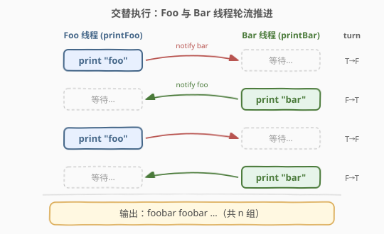
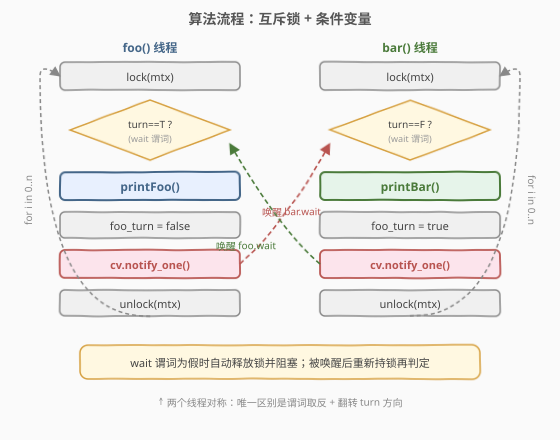
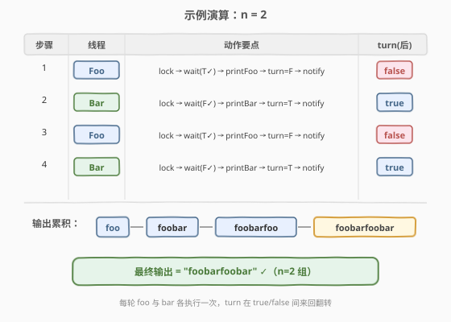

# LeetCode 交替打印 FooBar 题解

## 1. 题目概述

- **标题 / 题号**：交替打印 FooBar（#1115，medium）
- **链接**：https://leetcode.cn/problems/print-foobar-alternately/
- **难度**：中等
- **标签**：并发、多线程、互斥锁、条件变量、信号量

**题意**：现有两个线程，一个 `foo` 线程、一个 `bar` 线程。给类 `FooBar` 传入整数 `n`，两个线程会被分别调用 `n` 次：

- `foo(function printFoo)` 会被调用 `n` 次，每次执行 `printFoo()` 输出 `"foo"`
- `bar(function printBar)` 会被调用 `n` 次，每次执行 `printBar()` 输出 `"bar"`

请修改 `FooBar`，保证输出恰好为 `"foobar"` 重复 `n` 次，即 `foobarfoobar...`（共 `n` 组），不发生交错或乱序。

**示例 1**：

```text
输入：n = 1
输出："foobar"
解释：两个线程各被调用一次，输出 "foo" 后再输出 "bar"，拼接为 "foobar"。
```

**示例 2**：

```text
输入：n = 2
输出："foobarfoobar"
解释：输出 "foo" → "bar" → "foo" → "bar"。
```

**约束**：

- `1 <= n <= 1000`
- 两个线程并发执行，调度顺序由操作系统决定，**不能假设**谁先获得执行权

> ⚠️ 关键约束：题目只要求**最终输出顺序**正确，对调度次数、是否忙等等不做限制。但若用纯自旋（busy wait）会让一个线程空转占用 CPU，属于可用但不够优雅的解法。

## 2. 解题思路

### 2.1 暴力思路

不加任何同步，直接让两个线程各自循环调用 `printFoo` / `printBar`。由于 OS 调度顺序不确定，输出可能变成 `foofoobarbar`、`barfoo...` 等任意交错。这种做法完全不可控，显然不满足题意。

要保证「先 foo 后 bar」的严格交替，必须引入**同步原语**：让后打印的一方在先打印的一方完成前被阻塞，完成后再被唤醒。

### 2.2 核心观察：用一个 turn 标志 + 条件变量做「乒乓」交替



把问题抽象成**乒乓（ping-pong）模型**：

- 维护一个共享的 `turn` 标志（`bool foo_turn`），初值 `true`，表示「当前该 foo 线程打印」。
- foo 线程：拿到锁后，若 `foo_turn` 不为 `true` 就在条件变量上**等待**；为 `true` 时打印 `"foo"`，把 `foo_turn` 翻成 `false`，再 `notify_one` 唤醒 bar 线程。
- bar 线程：对称地，等 `foo_turn == false` 时打印 `"bar"`，把 `foo_turn` 翻回 `true`，再 `notify_one` 唤醒 foo 线程。

这样两者就像打乒乓球一样轮流「发球」：foo 打完递给 bar，bar 打完递回 foo，循环 `n` 次后双双退出。

> 💡 **为什么用条件变量而不是单纯自旋 `while(!foo_turn);`？** 条件变量在 `wait` 期间会**自动释放互斥锁并阻塞线程**（不占 CPU），被 `notify` 唤醒后再重新持锁并重新检查谓词。这比忙等更高效，也避免了在单核机器上的死锁（自旋线程占着 CPU 不放，另一线程得不到调度无法翻转标志）。

### 2.3 算法流程图



两个线程的流程**完全对称**，唯一区别是 `wait` 的谓词取反（foo 等 `true`、bar 等 `false`），以及翻转 `turn` 的方向。`wait` 用**带谓词**的形式 `cv.wait(lock, pred)`，能自动处理「虚假唤醒（spurious wakeup）」——即使没被真正唤醒也可能返回，谓词会再判一次，不满足就继续等。

### 2.4 示例演算

以 `n = 2` 为例，逐步追踪 `turn` 的变化与输出累积：



| 步骤 | 线程 | 动作要点 | turn(操作后) |
|------|------|----------|--------------|
| 1 | Foo | lock → wait(T✓) → printFoo → turn=F → notify | false |
| 2 | Bar | lock → wait(F✓) → printBar → turn=T → notify | true |
| 3 | Foo | lock → wait(T✓) → printFoo → turn=F → notify | false |
| 4 | Bar | lock → wait(F✓) → printBar → turn=T → notify | true |

最终输出 `"foobarfoobar"`，共 `n=2` 组 ✓。

## 3. 参考代码

### C++

```cpp
#include <functional>
#include <mutex>
#include <condition_variable>

class FooBar {
  private:
    int n;
    std::mutex mtx;
    std::condition_variable cv;
    bool foo_turn = true; // foo 线程先打印

  public:
    FooBar(int n) : n(n) {}

    void foo(std::function<void()> printFoo) {
        for (int i = 0; i < n; ++i) {
            std::unique_lock<std::mutex> lock(mtx);
            cv.wait(lock, [&] { return foo_turn; }); // 谓词为假时自动释放锁并阻塞
            printFoo();
            foo_turn = false;
            cv.notify_one(); // 唤醒 bar
        }
    }

    void bar(std::function<void()> printBar) {
        for (int i = 0; i < n; ++i) {
            std::unique_lock<std::mutex> lock(mtx);
            cv.wait(lock, [&] { return !foo_turn; });
            printBar();
            foo_turn = true;
            cv.notify_one(); // 唤醒 foo
        }
    }
};
```

### Python

```python
from threading import Condition


class FooBar:
    def __init__(self, n: int):
        self.n = n
        self.cv = Condition()
        self.foo_turn = True  # foo 线程先打印

    def foo(self, printFoo):
        for i in range(self.n):
            with self.cv:
                self.cv.wait_for(lambda: self.foo_turn)  # 谓词为假时释放锁并阻塞
                printFoo()
                self.foo_turn = False
                self.cv.notify()  # 唤醒 bar

    def bar(self, printBar):
        for i in range(self.n):
            with self.cv:
                self.cv.wait_for(lambda: not self.foo_turn)
                printBar()
                self.foo_turn = True
                self.cv.notify()  # 唤醒 foo
```

> 💡 **注意**：C++ 的 `cv.wait(lock, pred)` 与 Python 的 `cv.wait_for(pred)` 都是**带谓词**的等待，内部等价于 `while (!pred) cv.wait()`，能自动抵御虚假唤醒。务必使用这种形式，而不是裸 `cv.wait()` + 手动 `if` 判断——后者在虚假唤醒下会出错。

## 4. 复杂度分析

| 维度 | 复杂度 | 说明 |
|------|--------|------|
| 时间复杂度 | $O(n)$ | foo、bar 各执行 `n` 次打印，每次打印前后同步开销为 $O(1)$（加锁/解锁/唤醒均摊常数） |
| 空间复杂度 | $O(1)$ | 仅常数个同步对象（互斥锁、条件变量、turn 标志），不随 `n` 增长 |

> ⚠️ 严格来说线程调度开销不是 $O(1)$（涉及内核态切换），但与 `n` 仍是线性关系，不改变整体 $O(n)$ 的规模。

## 5. 扩展：其他同步方案

本题为并发题，解法不唯一。下面给出信号量与原子自旋两种替代方案，并对比优劣。

### 5.1 信号量方案（C++20 / Python）

用两个信号量做「接力棒」：`semFoo` 初值 1（foo 可立即拿），`semBar` 初值 0（bar 必须等）。foo 拿 `semFoo` 打印后释放 `semBar`，bar 拿 `semBar` 打印后释放 `semFoo`，天然交替，无需显式 `turn` 变量。


```cpp
#include <functional>
#include <semaphore> // C++20

class FooBar {
    int n;
    std::binary_semaphore semFoo{1}; // foo 先行
    std::binary_semaphore semBar{0}; // bar 等待
public:
    FooBar(int n) : n(n) {}

    void foo(std::function<void()> printFoo) {
        for (int i = 0; i < n; ++i) {
            semFoo.acquire();
            printFoo();
            semBar.release();
        }
    }
    void bar(std::function<void()> printBar) {
        for (int i = 0; i < n; ++i) {
            semBar.acquire();
            printBar();
            semFoo.release();
        }
    }
};
```

```python
from threading import Semaphore


class FooBar:
    def __init__(self, n: int):
        self.n = n
        self.foo_sem = Semaphore(1)  # foo 先行
        self.bar_sem = Semaphore(0)  # bar 等待

    def foo(self, printFoo):
        for i in range(self.n):
            self.foo_sem.acquire()
            printFoo()
            self.bar_sem.release()

    def bar(self, printBar):
        for i in range(self.n):
            self.bar_sem.acquire()
            printBar()
            self.foo_sem.release()
```

### 5.2 原子自旋方案（C++）

用 `std::atomic<bool>` 当 turn 标志，配合 `yield()` 让出 CPU。无锁、极简，但忙等会空耗一个 CPU 核，仅作对比，面试不推荐作为首选。

```cpp
#include <functional>
#include <atomic>
#include <thread>

class FooBar {
    int n;
    std::atomic<bool> foo_turn{true};
public:
    FooBar(int n) : n(n) {}

    void foo(std::function<void()> printFoo) {
        for (int i = 0; i < n; ++i) {
            while (!foo_turn.load(std::memory_order_acquire))
                std::this_thread::yield();
            printFoo();
            foo_turn.store(false, std::memory_order_release);
        }
    }
    void bar(std::function<void()> printBar) {
        for (int i = 0; i < n; ++i) {
            while (foo_turn.load(std::memory_order_acquire))
                std::this_thread::yield();
            printBar();
            foo_turn.store(true, std::memory_order_release);
        }
    }
};
```

> 💡 `yield()` 比 `while(...);` 空转稍好——主动让出时间片，减少无谓的 CPU 占用，但仍不如条件变量/信号量那种真正阻塞的方案优雅。

## 6. 面试要点

1. **为什么 `turn` 初值要设成 `true`？**
   - foo 线程需要先打印，所以初值让 foo 的 `wait` 谓词立即满足。若设成 `false`，则两个线程都会永久阻塞（foo 等不到 `true`，bar 等不到 `false`），形成死锁。

2. **条件变量的 `wait` 为什么要带谓词？**
   - 操作系统可能产生**虚假唤醒**（spurious wakeup）：线程没被 `notify` 也可能从 `wait` 返回。带谓词的 `wait(lock, pred)` 内部循环检查谓词，虚假唤醒时谓词不满足就继续等，保证语义正确。裸 `wait` + 单次 `if` 判断在这种情况会出错。

3. **`notify_one` 还是 `notify_all`？**
   - 本题只有两个线程，且任一时刻只有一个线程在等待（另一个在打印或即将打印），`notify_one` 足够且更高效。`notify_all` 会唤醒所有等待者，这里无益反而多一次无谓调度。

4. **信号量方案为什么不需要 `turn` 变量？**
   - 信号量的**初值本身就编码了「谁先走」**：`semFoo=1, semBar=0` 表示 foo 可立即获取、bar 必须等。每次 `acquire` 减 1、`release` 加 1，天然实现了「你走完我才走」的接力，无需额外的状态标志。

5. **自旋方案在什么场景下反而更优？**
   - 当临界区极短、且线程数不超过物理核数时，自旋避免了内核态阻塞/唤醒的上下文切换开销，延迟更低（这也是自旋锁的设计动机）。本题打印动作虽短，但 `n` 可能到 1000，忙等的 CPU 浪费累积明显，故仍以阻塞方案为主。

## 同类练习题

| # | 题目 | 与本题的关联 |
|---|------|-------------|
| 1114 | [按序打印](https://leetcode.cn/problems/print-in-order/) | 三线程按 first→second→third 顺序执行，同样是同步原语入门，本题的「接力」模型直接套用 |
| 1116 | [打印零与奇偶数](https://leetcode.cn/problems/print-zero-even-odd/) | 四个线程交替打印 0 与奇偶数，条件变量需配合「下一棒是谁」的状态机，承接本题的 turn 翻转 |
| 1117 | [H2O 生成](https://leetcode.cn/problems/building-h2o/) | 两 H 一 O 交替释放，信号量配额控制（2 个 H 名额 + 1 个 O 名额），本题信号量方案的进阶 |
| 1195 | [Fizz Buzz 多线程](https://leetcode.cn/problems/fizz-buzz-multithreaded/) | 四线程按数字整除关系分工，条件变量需区分多种状态转移，本题的多分支版 |
| 1226 | [哲学家进餐问题](https://leetcode.cn/problems/the-dining-philosophers/) | 五线程共享叉子资源，避免死锁的经典并发题，对比本题只需「乒乓」两线程的简单性 |
