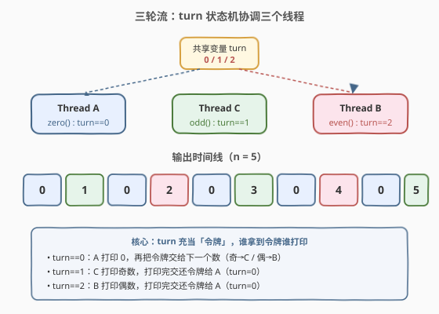
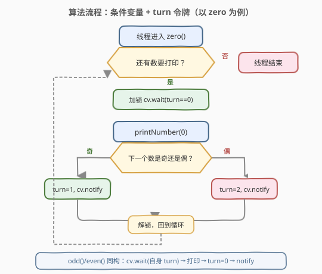
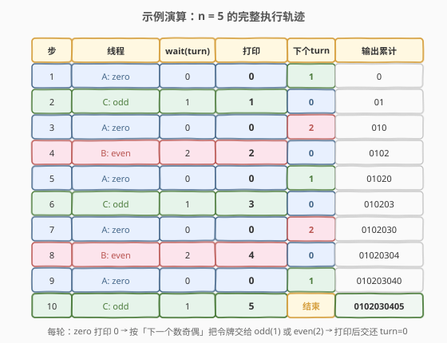

# LeetCode 打印零与奇偶数 题解

## 1. 题目概述

- **标题 / 题号**：打印零与奇偶数（#1116，medium）
- **链接**：https://leetcode.cn/problems/print-zero-even-odd/
- **难度**：中等
- **标签**：多线程、并发、互斥锁、条件变量

**题意**：假设有这么一个类：

```cpp
class ZeroEvenOdd {
  public:
    ZeroEvenOdd(int n) { ... }      // 构造函数
    void zero(printNumber) { ... }  // 仅打印 0
    void even(printNumber) { ... }  // 仅打印偶数
    void odd(printNumber) { ... }   // 仅打印奇数
};
```

相同的 `ZeroEvenOdd` 实例会被传入 **3 个不同线程**：

- **线程 A** 调用 `zero()`，只输出 `0`。
- **线程 B** 调用 `even()`，只输出偶数。
- **线程 C** 调用 `odd()`，只输出奇数。

每个线程都有一个 `printNumber(int x)` 方法用于输出一个整数。请修改上述类的实现，使得前 `2n` 个被输出的整数构成序列 `010203040506...`，即对每个 `1, 2, ..., n`，先输出一个 `0`，再输出这个数本身。

**示例 1**：

```text
输入：n = 2
输出："0102"
说明：三条线程异步执行，其中 zero 调用两次，even 调用一次（输出 2），odd 调用一次（输出 1）。
```

**示例 2**：

```text
输入：n = 5
输出："0102030405"
```

**约束**：

- `1 <= n <= 50`
- 输入整数保证有效，且每个数 `1..n` 恰好被某个线程打印一次，`0` 被打印 `n` 次。

> ⚠️ **关键约束**：输出顺序必须严格为 `0, 1, 0, 2, 0, 3, ...`。三个线程并发执行，调度顺序不可预知，必须用**同步机制**保证每个线程在「不该自己打印时」阻塞等待，在「轮到自己时」被唤醒。

## 2. 解题思路

### 2.1 暴力思路

不加任何同步，让三个线程各自循环打印。问题显而易见：线程调度顺序不确定，`zero` 可能连续打印多个 `0`，`even`/`odd` 可能乱序穿插，无法保证 `0102...` 的交替序列。多线程题的「暴力」往往不是复杂度问题，而是**正确性无法保证**——必须引入同步原语。

### 2.2 核心观察：turn 令牌状态机



输出序列 `0, 1, 0, 2, 0, 3, ...` 呈现严格的**交替模式**：

1. 先打印一个 `0`（`zero` 线程的活）。
2. 再打印一个数 `k`（`k` 为奇则 `odd` 线程，`k` 为偶则 `even` 线程）。
3. `k` 从 `1` 递增到 `n`，每个数都重复「先 0 再 k」。

这天然对应一个**三态状态机**，用一个共享变量 `turn` 作为「令牌」（token）：

| `turn` 值 | 含义           | 谁该干活        |
|-----------|----------------|-----------------|
| `0`       | 该打印 `0` 了   | `zero` 线程     |
| `1`       | 该打印奇数了    | `odd` 线程      |
| `2`       | 该打印偶数了    | `even` 线程     |

**调度规则**：

- `zero` 线程每次打印完 `0` 后，根据「下一个待打印的数 `k` 是奇还是偶」，把令牌交给 `odd`（`turn=1`）或 `even`（`turn=2`）。
- `odd`/`even` 线程每次打印完自己的数后，把令牌交还给 `zero`（`turn=0`）。
- 每个线程在令牌不属于自己时**阻塞等待**，被唤醒后先检查令牌是否轮到自己，是则打印并交接，否则继续等待。

> 💡 **本质**：这是经典的「生产者-消费者」变体——`zero` 是「指挥」，每打印一个 `0` 就指定下一个「消费者」（odd 或 even）出场；消费者消费完再交还指挥权。`turn` 是共享状态，必须用**互斥锁**保护，用**条件变量**在状态变化时唤醒等待者。

### 2.3 算法流程图



以 `zero` 线程为例（`odd`/`even` 同构，只是等待的 `turn` 值和交接目标不同）：

1. 加锁。
2. 若 `turn != 0`，调用 `cv.wait()` 释放锁并阻塞，直到被唤醒且 `turn == 0`。
3. 打印 `0`。
4. 维护计数器 `k`：若 `k` 为奇，设 `turn = 1`；若 `k` 为偶，设 `turn = 2`。
5. `cv.notify_all()` 唤醒所有等待者。
6. 解锁，回到第 1 步处理下一个 `0`（共 `n` 轮）。

`odd`/`even` 线程：等待自己的 `turn` → 打印对应的数 → 设 `turn = 0` → `notify_all` → 进入下一轮。

### 2.4 示例演算

以 `n = 5` 为例，完整的 10 步执行轨迹（步 1-10 依次产出 `0 1 0 2 0 3 0 4 0 5`）：



| 步 | 线程    | wait(turn) | 打印 | 下个 turn | 输出累计     |
|----|---------|------------|------|-----------|--------------|
| 1  | A: zero | 0          | 0    | 1         | 0            |
| 2  | C: odd  | 1          | 1    | 0         | 01           |
| 3  | A: zero | 0          | 0    | 2         | 010          |
| 4  | B: even | 2          | 2    | 0         | 0102         |
| 5  | A: zero | 0          | 0    | 1         | 01020        |
| 6  | C: odd  | 1          | 3    | 0         | 010203       |
| 7  | A: zero | 0          | 0    | 2         | 0102030      |
| 8  | B: even | 2          | 4    | 0         | 01020304     |
| 9  | A: zero | 0          | 0    | 1         | 010203040    |
| 10 | C: odd  | 1          | 5    | 结束      | 0102030405   |

> 💡 注意 `zero` 线程打印 `n` 次 `0`，`odd` 打印 $\lceil n/2 \rceil$ 个奇数，`even` 打印 $\lfloor n/2 \rfloor$ 个偶数。`n=5` 时奇数有 `1,3,5`（3 个），偶数有 `2,4`（2 个）。

## 3. 参考代码

### C++

```cpp
#include <mutex>
#include <condition_variable>

class ZeroEvenOdd {
  private:
    int n;
    int turn = 0;          // 0:zero  1:odd  2:even
    int cur = 0;           // 已打印 0 的次数（下一个要打印的数 = cur+1）
    std::mutex mtx;
    std::condition_variable cv;

  public:
    ZeroEvenOdd(int n) : n(n) {}

    void zero(function<void(int)> printNumber) {
        for (int i = 0; i < n; ++i) {
            std::unique_lock<std::mutex> lk(mtx);
            cv.wait(lk, [&] { return turn == 0; });
            printNumber(0);
            ++cur;
            turn = (cur % 2 == 1) ? 1 : 2;   // 下一个数奇→odd(1)，偶→even(2)
            cv.notify_all();
        }
    }

    void even(function<void(int)> printNumber) {
        for (int x = 2; x <= n; x += 2) {
            std::unique_lock<std::mutex> lk(mtx);
            cv.wait(lk, [&] { return turn == 2; });
            printNumber(x);
            turn = 0;                        // 交还令牌给 zero
            cv.notify_all();
        }
    }

    void odd(function<void(int)> printNumber) {
        for (int x = 1; x <= n; x += 2) {
            std::unique_lock<std::mutex> lk(mtx);
            cv.wait(lk, [&] { return turn == 1; });
            printNumber(x);
            turn = 0;                        // 交还令牌给 zero
            cv.notify_all();
        }
    }
};
```

### Python

```python
import threading


class ZeroEvenOdd:
    def __init__(self, n):
        self.n = n
        self.turn = 0          # 0:zero  1:odd  2:even
        self.cur = 0           # 已打印 0 的次数
        self.cond = threading.Condition()

    def zero(self, printNumber):
        for _ in range(self.n):
            with self.cond:
                self.cond.wait_for(lambda: self.turn == 0)
                printNumber(0)
                self.cur += 1
                self.turn = 1 if self.cur % 2 == 1 else 2
                self.cond.notify_all()

    def even(self, printNumber):
        for x in range(2, self.n + 1, 2):
            with self.cond:
                self.cond.wait_for(lambda: self.turn == 2)
                printNumber(x)
                self.turn = 0
                self.cond.notify_all()

    def odd(self, printNumber):
        for x in range(1, self.n + 1, 2):
            with self.cond:
                self.cond.wait_for(lambda: self.turn == 1)
                printNumber(x)
                self.turn = 0
                self.cond.notify_all()
```

> 💡 **要点**：`wait_for` / `cv.wait(lk, pred)` 是「谓词等待」——内部会自动处理「虚假唤醒」（spurious wakeup）：被唤醒后若谓词仍不满足会继续阻塞，直到 `turn` 真正轮到自己。比起手写 `while (turn != x) cv.wait()` 更不易出错。`notify_all` 而非 `notify_one`，因为每次状态变化可能同时关系到多个等待者，唤醒全部让它们各自重新检查谓词最稳妥。

## 4. 复杂度分析

| 维度 | 复杂度 | 说明 |
|------|--------|------|
| 时间复杂度 | $O(n)$ | 共打印 $2n$ 个数（$n$ 个 `0` + $n$ 个数），每次打印伴随一次加锁/解锁与一次唤醒，均摊 $O(1)$ |
| 空间复杂度 | $O(1)$ | 仅常数个共享变量（`turn`、`cur`）与一个互斥锁/条件变量，不随 `n` 增长 |
| 上下文切换 | $O(n)$ | 每次令牌交接引发一次线程唤醒，最坏情况每次切换一个线程，共约 $2n$ 次调度 |

## 5. 扩展：其他同步原语实现

### 5.1 信号量（Semaphore）方案

不用 `turn` 变量，改用 **3 个信号量**分别代表「能否打印 0 / 奇 / 偶」。初始 `sem_zero = 1`，其余为 `0`。`zero` 打印后按奇偶 `post` 对应的信号量，`odd`/`even` 打印后 `post` 回 `sem_zero`。思路更直观（信号量天然表达「许可」），C++20 起有 `std::counting_semaphore`，Python 可用 `threading.Semaphore`。

### 5.2 `std::promise` / `future` 链式交接

每次交接创建一对 `promise/future`，下一个线程在 `future.get()` 上阻塞。能工作但每轮要分配新的同步对象，开销大，仅作思路拓展。

### 5.3 自旋 + 原子标志

用 `std::atomic<int> turn` 配合 `while` 自旋等待。无锁、低延迟，但在 `n` 很大且线程数多于核数时浪费 CPU，且无法保证公平性（可能饿死某个线程）。仅在临界区极短、线程数 ≤ 核数时考虑。

> ⚠️ **生产环境选择**：条件变量 + 互斥锁是最通用、可移植的方案；信号量语义最贴合本题「许可」模型；自旋仅在极低延迟场景适用。面试中条件变量方案最稳妥，能体现对虚假唤醒、谓词等待的理解。

## 6. 面试要点

1. **为什么用条件变量而不是简单的自旋 `while`？**
   - 自旋会持续占用 CPU 空转，浪费算力且在多线程数场景下可能饿死其他线程。条件变量让等待线程**真正阻塞**（让出 CPU），被 `notify` 唤醒后才恢复，是高效且公平的协作方式。

2. **什么是虚假唤醒？如何应对？**
   - 线程可能在没有收到 `notify` 的情况下被操作系统唤醒（底层优化所致）。应对方式是用**谓词等待**：`cv.wait(lk, pred)` 或 `while (!pred) cv.wait()`，被唤醒后重新检查条件，不满足则继续阻塞。

3. **`notify_all` 和 `notify_one` 该用哪个？**
   - 本题有三个线程在同一条件变量上等待，唤醒的目标不固定（可能是 `odd` 也可能是 `even`）。用 `notify_one` 可能唤醒错误的线程导致无谓的唤醒-再阻塞往返；`notify_all` 唤醒全部，让它们各自用谓词筛选，逻辑更简单稳妥。若用三个独立条件变量则可精准 `notify_one`。

4. **`zero` 怎么知道下一个该交令牌给 odd 还是 even？**
   - 维护已打印 `0` 的次数 `cur`。第 `cur` 次打印 `0` 之后要打印的数是 `cur+1`：若 `cur+1` 为奇（即 `cur` 为偶），交给 `odd`（`turn=1`）；为偶则交给 `even`（`turn=2`）。

5. **能否用三个独立的条件变量减少唤醒范围？**
   - 可以。为 `zero`/`odd`/`even` 各设一个条件变量，每次只 `notify` 目标线程对应的那一个。优点是唤醒更精准、避免惊群；代价是维护三个 `cv` 对象、代码稍繁。功能等价，是优化版本。

## 同类练习题

| # | 题目 | 与本题的关联 |
|---|------|-------------|
| 1114 | [按序打印](https://leetcode.cn/problems/print-in-order/) | 三线程按 first→second→third 顺序执行，最基础的多线程顺序控制，本题的前置练习 |
| 1115 | [交替打印 FooBar](https://leetcode.cn/problems/print-foobar-alternately/) | 两线程交替打印 Foo/Bar，与本题同为「令牌交接」模式，线程更少更易上手 |
| 1117 | [构建 H2O](https://leetcode.cn/problems/building-h2o/) | 两类线程按 2:1 比例产出 H 和 O，多线程配比协调，本题的进阶 |
| 1195 | [交替打印字符串](https://leetcode.cn/problems/fizz-buzz-multithreaded/) | 四线程按 Fizz/Buzz/FizzBuzz/数字协作，三态升级为四态状态机 |
| 1226 | [哲学家进餐](https://leetcode.cn/problems/the-dining-philosophers/) | 五线程竞争共享资源，经典死锁避免问题，对比本题无资源竞争只求顺序 |
