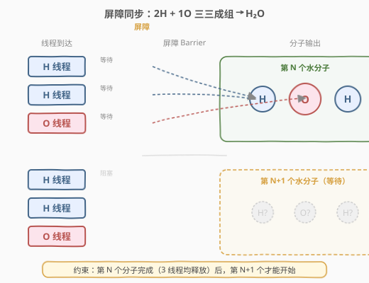
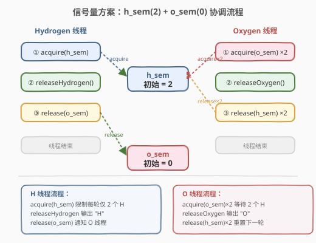
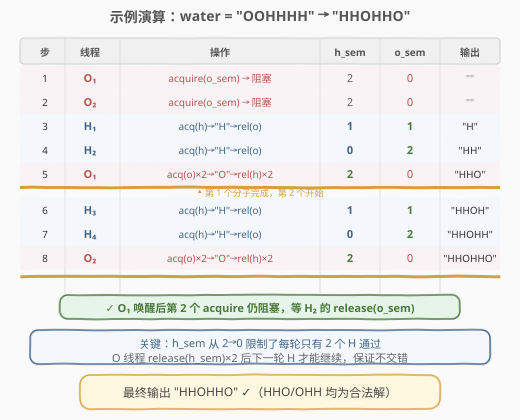

# LeetCode H2O 生成 题解

## 1. 题目概述

- **标题 / 题号**：H2O 生成（#1117，medium）
- **链接**：https://leetcode.cn/problems/building-h2o/
- **难度**：中等
- **标签**：并发、信号量、互斥锁、条件变量

**题意**：有两种线程——**氢线程** `hydrogen` 和**氧线程** `oxygen`，目标是组织这两种线程来产生水分子。

存在一个**屏障（barrier）**，使得每个线程必须等候直到一个完整水分子能够被产生出来。氢和氧线程分别被给予 `releaseHydrogen` 和 `releaseOxygen` 方法来允许它们突破屏障。

**核心规则**：这些线程应该**三三成组**突破屏障，并能立即组合产生一个水分子（2 个 H + 1 个 O）。必须保证产生一个水分子所需线程的结合**发生在下一个水分子产生之前**。

换句话说：

- 如果一个氧线程到达屏障时没有氢线程到达，它必须等候直到两个氢线程到达。
- 如果一个氢线程到达屏障时没有其它线程到达，它必须等候直到一个氧线程和另一个氢线程到达。

**示例 1**：

```text
输入：water = "HOH"
输出："HHO"
解释："HOH" 和 "OHH" 依然都是有效解。
```

**示例 2**：

```text
输入：water = "OOHHHH"
输出："HHOHHO"
解释："HOHHHO"、"OHHHHO"、"HHOHOH" 等依然都是有效解。
```

**约束**：

- $3 \times n = \text{water.length}$
- $1 \leq n \leq 20$
- $\text{water}[i] == \text{'O'}$ 或 $\text{'H'}$
- 输入字符串 `water` 中的 `'H'` 总数将会是 $2n$
- 输入字符串 `water` 中的 `'O'` 总数将会是 $n$

> ⚠️ **关键约束**：同一分子内的 3 个线程输出顺序任意（HHO、HOH、OHH 均合法），但**不同分子之间不能交错**——第 $N$ 个分子的 3 次输出必须全部完成后，第 $N+1$ 个分子才能开始输出。

## 2. 解题思路

### 2.1 暴力思路

用一个全局计数器记录当前分子中已到达的 H 和 O 数量，线程到达时**自旋等待（busy-wait）**直到凑齐 2H+1O，然后输出并重置计数器。

问题：自旋等待浪费 CPU 资源；无锁实现容易出竞态条件；难以保证分子间不交错。

### 2.2 核心观察：信号量屏障



本题的本质是一个**生产者-消费者协调问题**：H 线程是"生产者"（每到达一个就发出信号），O 线程是"消费者"（等待 2 个信号后放行）。

使用两个信号量即可优雅解决：

| 信号量 | 初始值 | 作用 |
|--------|--------|------|
| `h_sem` | 2 | 控制每轮**只有 2 个 H 线程**能通过屏障（第 3 个 H 阻塞） |
| `o_sem` | 0 | O 线程在此等待，直到 2 个 H 线程各发来 1 个信号 |

**Hydrogen 线程流程**：

1. `acquire(h_sem)` —— 取一个 H 许可（第 3 个 H 会阻塞，因为 `h_sem` 已减到 0）
2. `releaseHydrogen()` —— 输出 `"H"`
3. `release(o_sem)` —— 通知 O 线程：一个 H 已就绪

**Oxygen 线程流程**：

1. `acquire(o_sem)` —— 等待第 1 个 H 的信号
2. `acquire(o_sem)` —— 等待第 2 个 H 的信号
3. `releaseOxygen()` —— 输出 `"O"`
4. `release(h_sem)` ×2 —— 重置 H 许可为 2，允许下一轮的 H 线程通过

> 💡 **为什么能保证不交错？** `h_sem` 初始为 2，前 2 个 H 各 acquire 一次后 `h_sem = 0`，第 3 个 H 阻塞。只有 O 线程在输出完成后 `release(h_sem)` 两次（`h_sem` 恢复为 2），下一轮的 H 才能继续。这确保了**当前分子的 O 输出完成后，下一轮的 H 才能开始**。

### 2.3 算法流程图



### 2.4 示例演算

以 `water = "OOHHHH"` 为例，追踪信号量状态变化（一种可能的合法调度）：



| 步骤 | 线程 | 操作 | h_sem | o_sem | 输出 |
|------|------|------|-------|-------|------|
| 1 | O₁ | `acquire(o_sem)` → 阻塞 | 2 | 0 | `""` |
| 2 | O₂ | `acquire(o_sem)` → 阻塞 | 2 | 0 | `""` |
| 3 | H₁ | `acq(h_sem)` → `"H"` → `rel(o_sem)` | 1 | 1 | `"H"` |
| 4 | H₂ | `acq(h_sem)` → `"H"` → `rel(o_sem)` | 0 | 2 | `"HH"` |
| 5 | O₁ | `acq(o_sem)×2` → `"O"` → `rel(h_sem)×2` | 2 | 0 | `"HHO"` |
| 6 | H₃ | `acq(h_sem)` → `"H"` → `rel(o_sem)` | 1 | 1 | `"HHOH"` |
| 7 | H₄ | `acq(h_sem)` → `"H"` → `rel(o_sem)` | 0 | 2 | `"HHOHH"` |
| 8 | O₂ | `acq(o_sem)×2` → `"O"` → `rel(h_sem)×2` | 2 | 0 | `"HHOHHO"` |

> 💡 **注意步骤 5**：O₁ 被步骤 3 的 `release(o_sem)` 唤醒后，第一次 `acquire(o_sem)` 成功（`o_sem` 1→0），但第二次 `acquire(o_sem)` 再次阻塞，直到步骤 4 的 H₂ 执行 `release(o_sem)` 才能继续。这保证了 O 一定等待**恰好 2 个 H** 后才输出。

## 3. 参考代码

### C++

```cpp
#include <mutex>
#include <condition_variable>
#include <functional>

class Semaphore {
private:
    std::mutex mtx;
    std::condition_variable cv;
    int count;
public:
    Semaphore(int n = 0) : count(n) {}

    void acquire() {
        std::unique_lock<std::mutex> lock(mtx);
        cv.wait(lock, [&] { return count > 0; });
        --count;
    }

    void release() {
        std::unique_lock<std::mutex> lock(mtx);
        ++count;
        cv.notify_one();
    }
};

class H2O {
private:
    Semaphore h_sem{2};
    Semaphore o_sem{0};
public:
    H2O() {}

    void hydrogen(std::function<void()> releaseHydrogen) {
        h_sem.acquire();
        releaseHydrogen();
        o_sem.release();
    }

    void oxygen(std::function<void()> releaseOxygen) {
        o_sem.acquire();
        o_sem.acquire();
        releaseOxygen();
        h_sem.release();
        h_sem.release();
    }
};
```

### Python

```python
from threading import Semaphore


class H2O:
    def __init__(self):
        self.h_sem = Semaphore(2)
        self.o_sem = Semaphore(0)

    def hydrogen(self, releaseHydrogen: 'Callable[[], None]') -> None:
        self.h_sem.acquire()
        releaseHydrogen()
        self.o_sem.release()

    def oxygen(self, releaseOxygen: 'Callable[[], None]') -> None:
        self.o_sem.acquire()
        self.o_sem.acquire()
        releaseOxygen()
        self.h_sem.release()
        self.h_sem.release()
```

> 💡 **代码要点**：
> - C++ 在 C++20 之前没有标准信号量，因此用 `mutex` + `condition_variable` 封装一个简易 `Semaphore` 类。若编译环境支持 C++20，可直接用 `std::counting_semaphore<2>` 替代。
> - Python 的 `threading.Semaphore` 是开箱即用的，代码极为简洁。
> - **O 线程两次 `acquire(o_sem)`** 是关键——确保等待恰好 2 个 H 信号后才输出。

## 4. 复杂度分析

| 维度 | 复杂度 | 说明 |
|------|--------|------|
| 时间复杂度 | $O(1)$（每次调用） | 每个线程仅执行常数次 acquire/release 操作 |
| 空间复杂度 | $O(1)$ | 仅两个信号量（计数器），不随输入规模增长 |
| 并发度 | 2H + 1O / 轮 | 每轮最多 2 个 H 并行通过屏障，O 串行放行 |

> ⚠️ 信号量的 acquire/release 本身有锁开销（用户态→内核态切换），但本题 $n \leq 20$，线程数极少，性能不是瓶颈。

## 5. 扩展：互斥锁 + 条件变量

如果不使用信号量，也可以直接用**一个互斥锁 + 一个条件变量 + 一个计数器**解决。核心思路：用计数器 `h` 记录当前分子中已到达的 H 数量，H 线程在 `h < 2` 时才能进入，O 线程在 `h == 2` 时才能进入，O 输出后重置 `h = 0` 开启下一轮。

### C++

```cpp
class H2O {
private:
    std::mutex mtx;
    std::condition_variable cv;
    int h = 0;
public:
    H2O() {}

    void hydrogen(std::function<void()> releaseHydrogen) {
        std::unique_lock<std::mutex> lock(mtx);
        cv.wait(lock, [&] { return h < 2; });
        ++h;
        releaseHydrogen();
        cv.notify_all();
    }

    void oxygen(std::function<void()> releaseOxygen) {
        std::unique_lock<std::mutex> lock(mtx);
        cv.wait(lock, [&] { return h == 2; });
        releaseOxygen();
        h = 0;
        cv.notify_all();
    }
};
```

### Python

```python
from threading import Condition


class H2O:
    def __init__(self):
        self.cond = Condition()
        self.h = 0

    def hydrogen(self, releaseHydrogen: 'Callable[[], None]') -> None:
        with self.cond:
            self.cond.wait_for(lambda: self.h < 2)
            self.h += 1
            releaseHydrogen()
            self.cond.notify_all()

    def oxygen(self, releaseOxygen: 'Callable[[], None]') -> None:
        with self.cond:
            self.cond.wait_for(lambda: self.h == 2)
            releaseOxygen()
            self.h = 0
            self.cond.notify_all()
```

> 💡 **两种方案对比**：
>
> | 维度 | 信号量方案 | 条件变量方案 |
> |------|-----------|-------------|
> | 核心机制 | 两个信号量自动管理许可 | 一个计数器 + 手动谓词等待 |
> | 代码量 | 略多（需封装 Semaphore 类） | 较少（直接用标准库） |
> | 可读性 | 直观映射"2H+1O"语义 | 需理解谓词等待逻辑 |
> | 适用场景 | C++20 / Python（有标准信号量） | C++17 及以下（无需额外封装） |
>
> 两种方案的正确性保证相同：**计数器/信号量在 O 线程输出前不会重置，下一轮 H 线程无法提前进入**。

## 6. 面试要点

1. **为什么需要两个信号量而不是一个？**
   - `h_sem` 控制每轮只有 2 个 H 通过（正向许可），`o_sem` 让 O 等待 2 个 H 信号（反向同步）。一个信号量无法同时表达"限制 H 数量"和"O 等待 H"两个独立条件。

2. **为什么 O 线程要 `release(h_sem)` 两次？**
   - 每轮 `h_sem` 的初始值是 2，被 2 个 H 各 acquire 一次后归零。O 线程负责在分子完成后将 `h_sem` 恢复为 2，供下一轮使用，因此需要 release 两次。

3. **如何保证分子之间不交错？**
   - `h_sem` 从 2 减到 0 后，第 3 个 H 线程阻塞在 `acquire(h_sem)`。只有 O 线程完成输出后执行 `release(h_sem)×2`，下一轮的 H 才能继续。因此第 $N+1$ 个分子的 H 必须等待第 $N$ 个分子的 O 输出完成。

4. **条件变量方案中，为什么 H 线程的谓词是 `h < 2` 而不是 `h < 2 && o < 1`？**
   - 不需要检查 `o`。因为 O 线程的谓词是 `h == 2`，在 O 输出并重置 `h = 0` 之前，`h` 始终 $\leq 2$。H 线程只需保证当前分子 H 不超过 2 个即可，O 的数量由 O 线程自身控制（同一时刻只有一个 O 能进入，因为 `h == 2` 后第一个 O 进入并重置 `h`，第二个 O 必须等下一轮）。

5. **如果改成 H₃O（3 个 H + 1 个 O）怎么办？**
   - 信号量方案：`h_sem` 初始值改为 3，O 线程 `acquire(o_sem)` 三次，`release(h_sem)` 三次。
   - 条件变量方案：H 线程谓词改为 `h < 3`，O 线程谓词改为 `h == 3`。

## 同类练习题

| # | 题目 | 与本题的关联 |
|---|------|-------------|
| 1114 | [按序打印](https://leetcode.cn/problems/print-in-order/) | 最简单的并发协调题，用信号量保证 first→second→third 的执行顺序，本题的入门版 |
| 1115 | [交替打印 FooBar](https://leetcode.cn/problems/print-foobar-alternately/) | 两个线程交替执行，信号量方案的经典应用，与本题的"计数许可"思路互补 |
| 1116 | [打印零与偶奇](https://leetcode.cn/problems/print-zero-even-odd/) | 三线程协调打印，需要两个信号量交替放行，结构更复杂 |
| 1195 | [交替打印字符串](https://leetcode.cn/problems/fizz-buzz-multithreaded/) | 四线程 FizzBuzz，多信号量协调的进阶练习 |
| 1226 | [哲学家进餐](https://leetcode.cn/problems/the-dining-philosophers/) | 经典并发问题，信号量/互斥锁的死锁避免，本题的困难版延伸 |
