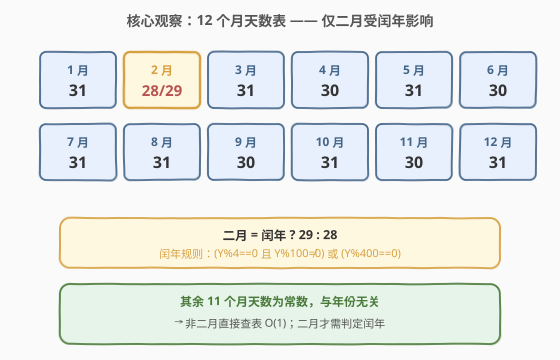
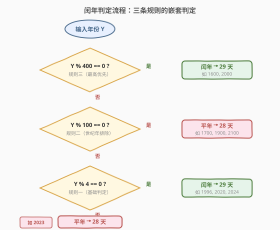
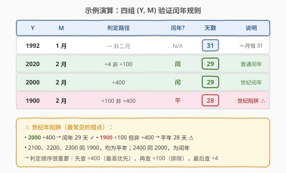

# 一月有多少天

- **题目名称**：一月有多少天
- **链接**：[1118. 一月有多少天](https://leetcode.cn/problems/number-of-days-in-a-month/)
- **难度**：简单
- **标签**：数学

> ⚠️ 本题为 LeetCode **Plus 会员专享题**，非会员无法在平台提交，但题意与解法值得掌握——它是**格里高利历闰年规则**的最小母题，是所有日期计算题（年内第几天、两日期相差天数、星期几）的公共前置知识。

## 1. 题目概述

给定一个年份 $Y$ 和月份 $M$，返回该月有**多少天**。

**示例 1**：

```text
输入：year = 1992, month = 7
输出：31
解释：七月恒为 31 天，与年份无关。
```

**示例 2**：

```text
输入：year = 2000, month = 2
输出：29
解释：2000 能被 400 整除 → 闰年 → 二月 29 天。
```

**示例 3**：

```text
输入：year = 1900, month = 2
输出：28
解释：1900 能被 100 整除但不能被 400 整除 → 平年 → 二月 28 天。
```

**约束条件**：

- $1 \le Y \le 9999$
- $1 \le M \le 12$

> 💡 约束极小，$O(1)$ 直接查表即可。本题的全部考点在于**闰年判定规则**——尤其是「世纪年」陷阱（1900 不是闰年、2000 是闰年）。

---

## 2. 解题思路

### 2.1 暴力思路：查表 + 闰年特判

最直觉的做法是维护一张**每月天数表**：`[31, 28, 31, 30, 31, 30, 31, 31, 30, 31, 30, 31]`。对于非二月的月份，直接返回表中对应值；二月则需判定闰年后在 28 和 29 之间选择。

这道题之所以是「题」而非「常识」，关键在于闰年判定规则容易记错——尤其是**世纪年**（能被 100 整除的年份）的特殊处理。

### 2.2 核心观察：只有二月受闰年影响



关键观察：

- **11 个月天数为常数**：除二月外，每个月的天数在所有年份中都相同，与闰年无关——1/3/5/7/8/10/12 月恒为 31 天，4/6/9/11 月恒为 30 天。
- **二月是唯一变量**：平年 28 天，闰年 29 天。判定二月的实际天数等价于判定该年是否为闰年。

> 💡 **为什么只有二月特殊**：二月是罗马历历史上用于「插入闰日调整年长」的月份（最初只有 28 天），这一传统延续至今。格里高利历规定一个回归年约 365.2425 天，每年多出约 0.2425 天，每 4 年补 1 天（+0.25），但每 100 年扣回 1 天（+0.25−0.01=+0.24），每 400 年再补 1 天（+0.2425），最终 400 年只差 0.03 天，精度足够。所有调整都堆在二月，其余月份不动。

### 2.3 算法流程图：闰年三规则嵌套判定



格里高利历的闰年规则由**三条嵌套规则**组成，判定时按优先级从高到低依次检查：

1. **规则三（最高优先）**：$Y \bmod 400 = 0$ → **闰年**。如 1600、2000、2400。
2. **规则二（世纪排除）**：$Y \bmod 100 = 0$（但非 ÷400）→ **平年**。如 1700、1800、1900、2100。
3. **规则一（基础判定）**：$Y \bmod 4 = 0$（但非 ÷100）→ **闰年**。如 1996、2020、2024。

合并为一个布尔表达式：

$$\text{leap} = (Y \bmod 4 = 0 \;\wedge\; Y \bmod 100 \ne 0) \;\vee\; (Y \bmod 400 = 0)$$

> ⚠️ **世纪年陷阱**：最常见的错误是只记「÷4 就是闰年」，导致 1900 被误判为闰年。正确顺序是**先查 ÷400（闰），再查 ÷100（平），最后查 ÷4（闰）**——即上面的流程图顺序。代码中虽然写成一个布尔表达式，但其短路求值顺序与流程图一致：先判 ÷4 && 非÷100，再判 ÷400 兜底。

### 2.4 示例演算

以四组输入验证闰年规则：



| 年份 | 月份 | 判定路径 | 闰年? | 天数 | 说明 |
|------|------|----------|-------|------|------|
| 1992 | 1 月 | — 非二月 | N/A | 31 | 一月恒 31，无需判闰 |
| 2020 | 2 月 | ÷4 非 ÷100 | 闰 | 29 | 普通闰年 |
| 2000 | 2 月 | ÷400 | 闰 | 29 | 世纪闰年（规则三命中） |
| 1900 | 2 月 | ÷100 非 ÷400 | 平 | 28 | 世纪平年（规则二命中，⚠️ 陷阱） |

验证 1900：$1900 \bmod 400 = 300 \ne 0$（规则三不命中），$1900 \bmod 100 = 0$（规则二命中）→ 平年 → 28 天 ✓

---

## 3. 参考代码

### C++

```cpp
// 一月有多少天.cpp —— 查表 + 闰年特判
// 编译: g++ -O2 -std=c++17 一月有多少天.cpp -o days
class Solution {
public:
    int numberOfDays(int year, int month) {
        int days[] = {31, 28, 31, 30, 31, 30, 31, 31, 30, 31, 30, 31};
        if (month == 2 && isLeapYear(year))
            return 29;
        return days[month - 1];
    }
private:
    bool isLeapYear(int y) {
        return (y % 4 == 0 && y % 100 != 0) || (y % 400 == 0);
    }
};
```

### Python

```python
class Solution:
    def numberOfDays(self, year: int, month: int) -> int:
        days = [31, 28, 31, 30, 31, 30, 31, 31, 30, 31, 30, 31]
        if month == 2 and self._is_leap(year):
            return 29
        return days[month - 1]

    def _is_leap(self, y: int) -> bool:
        return (y % 4 == 0 and y % 100 != 0) or (y % 400 == 0)
```

> 💡 **写法要点**：① `days` 数组以 0 为基——`days[month - 1]` 取第 `month` 月的天数。② 闰年判定单独抽成函数 `_is_leap`，职责清晰、可复用（后续日期题都会用到）。③ `month == 2` 短路在前：非二月直接查表，只有二月才调用闰年判定，避免无谓计算。④ Python 也可用 `calendar.isleap(year)` 标准库，但面试中手写判定更能体现对规则的理解。

---

## 4. 复杂度分析

| 维度 | 查表法 | 说明 |
|------|--------|------|
| **时间** | $O(1)$ | 一次数组访问 + 至多一次闰年判定（3 次取模），常数时间 |
| **空间** | $O(1)$ | 12 元素定长数组，常数空间 |
| **思路复杂度** | 简单 | 查表 + 闰年规则，唯一难点是记住世纪年特例 |

> ⚠️ 时间严格 $O(1)$：无论 $Y$ 多大，闰年判定固定 3 次取模运算，不随输入规模增长。空间为 12 个 `int` 的定长数组（48 字节），可视为常数。

---

## 5. 扩展：无查表公式法 $O(1)$

查表法虽直观，但需维护 12 元素数组。有一个**数学公式**可不依赖查表直接算出非二月的天数——利用「大月」（31 天）与「小月」（30 天）在月份编号上的奇偶规律。

### 5.1 推导

观察大月（31 天）的月份编号：1, 3, 5, 7, 8, 10, 12。规律：

- 1–7 月：**奇数月**为大月（1, 3, 5, 7）
- 8–12 月：**偶数月**为大月（8, 10, 12）

这正是「**拳关节记忆法**」——握拳数关节凸起为大月、凹处为小月，7 月到 8 月之间拐弯，奇偶规律翻转。

用整数运算编码这一规律：令 $m$ 为月份编号（1–12），定义

$$\text{isLong} = \left(\left\lfloor \frac{m + \lfloor m/8 \rfloor}{1} \right\rfloor \bmod 2 = 1\right)$$

其中 $\lfloor m/8 \rfloor$ 在 $m < 8$ 时为 0、$m \ge 8$ 时为 1，恰好编码「7→8 拐弯」。验证：

| $m$ | $\lfloor m/8 \rfloor$ | $m + \lfloor m/8 \rfloor$ | $\bmod\;2$ | 大月? |
|-----|----------------------|--------------------------|-----------|-------|
| 1 | 0 | 1 | 1 | ✓ 31 |
| 2 | 0 | 2 | 0 | ✗（二月） |
| 3 | 0 | 3 | 1 | ✓ 31 |
| 4 | 0 | 4 | 0 | ✗ 30 |
| 5 | 0 | 5 | 1 | ✓ 31 |
| 6 | 0 | 6 | 0 | ✗ 30 |
| 7 | 0 | 7 | 1 | ✓ 31 |
| 8 | 1 | 9 | 1 | ✓ 31 |
| 9 | 1 | 10 | 0 | ✗ 30 |
| 10 | 1 | 11 | 1 | ✓ 31 |
| 11 | 1 | 12 | 0 | ✗ 30 |
| 12 | 1 | 13 | 1 | ✓ 31 |

于是非二月的天数为 $30 + (m + \lfloor m/8 \rfloor) \bmod 2$，二月单独处理。

### 5.2 代码

```python
class Solution:
    def numberOfDays(self, year: int, month: int) -> int:
        if month == 2:
            leap = (year % 4 == 0 and year % 100 != 0) or (year % 400 == 0)
            return 29 if leap else 28
        return 30 + (month + month // 8) % 2
```

```cpp
class Solution {
public:
    int numberOfDays(int year, int month) {
        if (month == 2) {
            bool leap = (year % 4 == 0 && year % 100 != 0) || (year % 400 == 0);
            return leap ? 29 : 28;
        }
        return 30 + (month + month / 8) % 2;
    }
};
```

> 💡 **公式 vs 查表**：公式法省去了数组，但可读性下降——`(month + month / 8) % 2` 不如查表直观。面试中**查表法更稳妥**（不易写错、易解释）；公式法适合作为「还有更紧凑写法」的加分项主动提及。注意 `month / 8` 在 C++ 中是整数除法（`month` 为 `int`），Python 中用 `//`。

---

## 6. 面试要点

1. **闰年判定规则是什么？1900 是闰年吗？**

   > 格里高利历闰年规则：能被 4 整除且不能被 100 整除，**或者**能被 400 整除。1900 虽然能被 4 整除，但也能被 100 整除且不能被 400 整除，所以是**平年**。2000 能被 400 整除，是闰年。这是最常见的面试陷阱题。

2. **为什么 1–7 月奇数月大、8–12 月偶数月大？**

   > 这是拳关节记忆法：握拳从食指关节开始数，凸起为大月（31 天）、凹处为小月。1(凸)3(凸)5(凸)7(凸) 到 7 月后在拳背拐弯，8(凸)10(凸)12(凸) 继续凸起——拐弯导致 7→8 之间奇偶规律翻转。公式中 $\lfloor m/8 \rfloor$ 就是编码这个「拐弯」。

3. **为什么只有二月受闰年影响？**

   > 历史原因：二月最初在罗马历中只有 28 天，是历法调整的「缓冲月」——所有闰日修正都加在二月末。格里高利历每 4 年补 1 天（+0.25 天/年），每 100 年扣 1 天（−0.01），每 400 年再补 1 天（+0.0025），使 400 年总长 146097 天 ≈ 365.2425 天/年，逼近回归年。修正只动二月，其余月份不动。

4. **`isLeapYear` 的布尔表达式，短路求值顺序重要吗？**

   > 代码中 `(y % 4 == 0 && y % 100 != 0) || (y % 400 == 0)` 的短路顺序与流程图判定一致：先判 ÷4 && 非÷100（覆盖大多数情况），不命中再判 ÷400（兜底世纪闰年）。结果正确性与求值顺序无关（逻辑等价），但短路顺序影响效率——÷4 命中率最高，放最前可快速短路。注意 `&&` 优先级高于 `||`，无需额外括号，但加括号可提升可读性。

5. **本题和「一年中的第几天」有什么关系？**

   > [1154. 一年中的第几天](https://leetcode.cn/problems/day-of-the-year/) 需要把某日期在一年中的序号算出来——即累加该月之前所有月份的天数，再加上当月日号。累加时二月的天数必须按闰年正确取值。所以 1118 的「每月天数 + 闰年判定」是 1154 的公共子问题——掌握了 1118 的闰年判定，1154 只是多一层前缀和累加。

> 💡 **一句话总结**：1118 的核心是格里高利历闰年三规则——$(Y\%4{=}0 \wedge Y\%100{\ne}0) \vee Y\%400{=}0$。11 个月天数固定查表，二月按闰年取 28 或 29。世纪年陷阱（1900 平 / 2000 闰）是唯一考点，也是所有日期计算题的共同前置知识。

---

## 7. 同类练习题

- [1154. 一年中的第几天](https://leetcode.cn/problems/day-of-the-year/)：直接复用本题的每月天数表 + 闰年判定，累加前序月份天数 + 当月日号，是 1118 的「前缀和」延伸
- [1185. 一周中的第几天](https://leetcode.cn/problems/day-of-the-week/)：给定日期求星期几，需用蔡勒公式或从已知参考日累加天数差，闰年影响二月天数从而影响累计天数
- [1360. 日期之间隔几天](https://leetcode.cn/problems/number-of-days-between-two-dates/)：求两日期相差天数，需正确处理跨年跨月的闰年二月，1118 的闰年判定是其核心子例程
- [172. 阶乘后的零](https://leetcode.cn/problems/factorial-trailing-zeroes/)（[题解](../0101-0200/172_阶乘后的零.md)）：同为「数学规则降维」——用勒让德公式 $v_5(n!) = \sum \lfloor n/5^i \rfloor$ 替代逐个枚举，与 1118 用闰年规则替代暴力数天数思路同源
