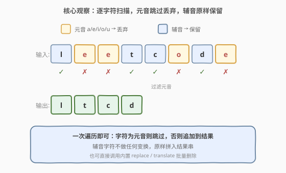
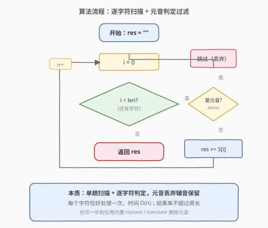
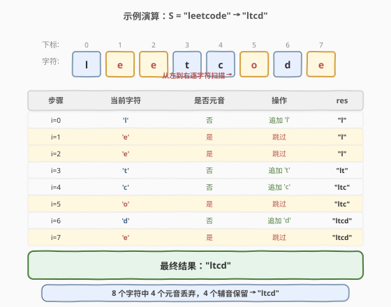

# 删去字符串中的元音

- **题目名称**：删去字符串中的元音
- **链接**：[1119. 删去字符串中的元音](https://leetcode.cn/problems/remove-vowels-from-a-string/)
- **难度**：简单
- **标签**：字符串

## 1. 题目概述

给你一个字符串 `S`，删去其中的所有元音字母（`'a'`、`'e'`、`'i'`、`'o'`、`'u'`），返回删去元音后的新字符串。

**示例 1**：

```text
输入：S = "leetcodeisacommunityforcoders"
输出："ltcdscommntyfrcdrs"
```

**示例 2**：

```text
输入：S = "aeiou"
输出：""
```

**约束条件**：

- `S` 仅由小写英文字母组成
- $1 \le |S| \le 1000$

> 💡 元音字母固定为 5 个 `a/e/i/o/u`，题目保证全小写，无需考虑大小写。本质是一次**过滤扫描**：保留辅音、丢弃元音，结果串长度不超过原串。

---

## 2. 解题思路

### 2.1 暴力思路

最直观的做法：遍历字符串的每个字符，遇到元音就跳过，遇到辅音就追加到结果串。这本身已是 $O(n)$ 的最优解——没有更"暴力"的笨办法可优化，真正的区别只在于"手动遍历过滤"还是"调用内置替换/正则"。

### 2.2 核心观察：逐字符扫描 + 元音判定过滤



这道题的本质是一次**单趟线性扫描 + 条件过滤**，每个字符只被处理一次，判定规则极简——

- 若 `S[i]` ∈ {`a`, `e`, `i`, `o`, `u`}：**跳过**（不追加）
- 否则：向结果串追加 `S[i]`（原样保留）

> 💡 **与 [1108. IP 地址无效化](../1101-1200/1108_IP地址无效化.md) 的对照**：1108 是"1→3 膨胀替换"（`.` 换成 `[.]`），本题是"1→0 收缩删除"（元音丢弃）。两者共享"单趟扫描 + 逐字符判定 + 构建新串"的骨架，区别只在判定后的动作：替换串 vs 跳过。本题结果串只会变短不会变长，无需考虑膨胀带来的回填或扩容问题。

### 2.3 算法流程图



流程是一个标准的 **for 循环 + if-else 分支**：

1. 初始化空字符串 `res`
2. `i` 从 `0` 遍历到 `len(S) - 1`
3. 若 `S[i]` 是元音，什么都不做（跳过）
4. 否则 `res += S[i]`
5. 循环结束后返回 `res`

### 2.4 示例演算

以 `S = "leetcode"` 为例（取示例 1 的前缀，便于观察元音/辅音分布）：



| 步骤 | 当前字符 | 是否元音 | 操作 | `res` 累积 |
|------|----------|----------|------|-----------|
| i=0 | `'l'` | 否 | 追加 `'l'` | `"l"` |
| i=1 | `'e'` | 是 | 跳过 | `"l"` |
| i=2 | `'e'` | 是 | 跳过 | `"l"` |
| i=3 | `'t'` | 否 | 追加 `'t'` | `"lt"` |
| i=4 | `'c'` | 否 | 追加 `'c'` | `"ltc"` |
| i=5 | `'o'` | 是 | 跳过 | `"ltc"` |
| i=6 | `'d'` | 否 | 追加 `'d'` | `"ltcd"` |
| i=7 | `'e'` | 是 | 跳过 | `"ltcd"` |

最终结果 `"ltcd"`。8 个字符中 4 个元音（`e/e/o/e`）被丢弃，4 个辅音（`l/t/c/d`）保留。

---

## 3. 参考代码

### C++（逐字符扫描）

```cpp
class Solution {
  public:
    string removeVowels(string S) {
        string res;
        for (char c : S) {
            if (c != 'a' && c != 'e' && c != 'i' && c != 'o' && c != 'u') {
                res += c;
            }
        }
        return res;
    }
};
```

### Python（生成器 + join）

```python
class Solution:
    def removeVowels(self, S: str) -> str:
        return ''.join(c for c in S if c not in 'aeiou')
```

> ⚠️ **两种写法的取舍**：C++ 手动遍历展示底层逻辑，适合面试白板推演；Python 的生成器 + `join` 是一行惯用写法，底层同样是 $O(n)$ 单趟扫描。也可用 `str.translate` 预建映射表做批量删除，常数因子更优。

---

## 4. 复杂度分析

| 维度 | 复杂度 | 说明 |
|------|--------|------|
| 时间复杂度 | $O(n)$ | $n$ 为字符串长度，每个字符恰好判定一次 |
| 空间复杂度 | $O(n)$ | 结果串最多保留全部字符（全辅音时与原串等长） |

> ⚠️ **空间 $O(n)$ 的含义**：结果串长度 $\le n$，最坏情况（无元音，如 `"bcdfg"`）结果与原串等长；最好情况（全元音，如 `"aeiou"`，即示例 2）结果为空串。按上限 $O(n)$ 估算即可。

---

## 5. 扩展：元音集合的判定优化

上面用 5 个 `!=` 比较判定元音。当待过滤的字符集变大时，逐个比较可读性下降。两种泛化写法：

**查找表**：用一个大小 26 的布尔数组标记元音，$O(1)$ 查询：

```cpp
class Solution {
  public:
    string removeVowels(string S) {
        bool vowel[26] = {};
        vowel['a' - 'a'] = vowel['e' - 'a'] = vowel['i' - 'a']
            = vowel['o' - 'a'] = vowel['u' - 'a'] = true;
        string res;
        for (char c : S) {
            if (!vowel[c - 'a']) res += c;
        }
        return res;
    }
};
```

**位掩码**：把元音集合压缩进一个 26 位的整数，按位查：

```cpp
class Solution {
  public:
    string removeVowels(string S) {
        // a,e,i,o,u 对应 bit 0,4,8,14,20
        unsigned mask = (1u << 0) | (1u << 4) | (1u << 8) | (1u << 14) | (1u << 20);
        string res;
        for (char c : S) {
            if (!((mask >> (c - 'a')) & 1u)) res += c;
        }
        return res;
    }
};
```

> 💡 对仅 5 个元音的固定场景，5 个 `!=` 比较反而最直观，编译器也可能将其优化为一条位运算指令。查找表/位掩码更适合"待过滤集合可变或较大"的泛化场景（如删除所有标点、删除自定义停用字符集）。

---

## 6. 面试要点

1. **元音字母包含哪些？大写算不算？**

   - 本题仅小写，元音为 `a/e/i/o/u`。若题目含大写，需同时判定 `A/E/I/O/U`，或先统一转小写再判定。注意 `y` 在英语中有时作元音，但 LeetCode 本题不算。

2. **结果字符串最长/最短是多少？**

   - 最长 = 原串长度（全是辅音，如 `"bcdfg"`）；最短 = 0（全是元音，如 `"aeiou"`，即示例 2）。空间上按 $O(n)$ 预估即可。

3. **能否用内置 `replace` 或正则？**

   - 可以。Python 可 `re.sub(r'[aeiou]', '', S)`，但对固定 5 字符的删除，`str.translate` 或生成器 `join` 更高效——正则引擎有编译与匹配开销，对"删除固定字面量集合"属杀鸡用牛刀。

4. **C++ 中 `res += c` 会导致频繁扩容吗？**

   - `std::string` 的 `push_back` / `+=` 采用倍增策略，分摊 $O(1)$。若想彻底避免扩容，可先 `res.reserve(S.size())` 预分配上限容量（结果不会超过原长），再遍历追加。

5. **与 1108 IP 地址无效化的异同？**

   - 两者都是"单趟扫描 + 逐字符判定 + 构建新串"。1108 是"1→3 膨胀"（`.` 换成 `[.]`，结果更长），本题是"1→0 收缩"（元音删除，结果更短）。骨架相同，判定后的动作不同——理解这一点即可举一反三到所有"逐字符过滤/替换"类题目。

> 💡 **一句话总结**：1119 是"过滤型"字符串题的模板——单趟扫描，元音跳过辅音保留。与 1108 共享"逐字符判定构建新串"骨架，区别在删除（收缩）vs 替换（膨胀）。

---

## 7. 同类练习题

- [1108. IP 地址无效化](https://leetcode.cn/problems/defanging-an-ip-address/)（[题解](../1101-1200/1108_IP地址无效化.md)）：同享"逐字符扫描 + 条件追加"骨架，本题删除（收缩）vs 1108 替换（膨胀）
- [58. 最后一个单词的长度](https://leetcode.cn/problems/length-of-last-word/)（[题解](../0001-0100/58_最后一个单词的长度.md)）：从右向左扫描跳过尾随空格，同为"扫描 + 跳过特定字符"的过滤思想
- [709. 转换成小写字母](https://leetcode.cn/problems/to-lower-case/)：逐字符扫描 + 条件变换（大小写映射），不调用内置函数手写字符映射
- [917. 仅仅反转字母](https://leetcode.cn/problems/reverse-only-letters/)：双指针 + 字母判定（`isalpha`），过滤与翻转结合，判定字符类别的延伸
- [344. 反转字符串](https://leetcode.cn/problems/reverse-string/)：双指针原地翻转，同为字符串基础操作题，对照"原地修改 vs 构建新串"
