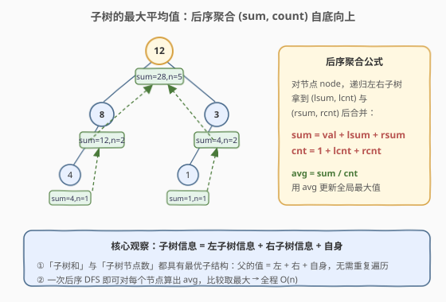
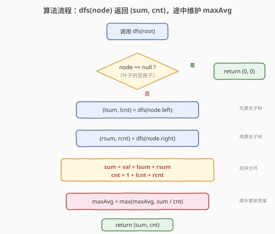
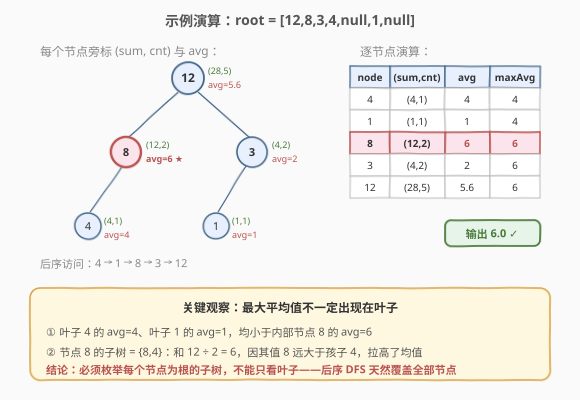

# LeetCode 子树的最大平均值 题解

## 1. 题目概述

- **标题 / 题号**：子树的最大平均值（#1120，medium）
- **链接**：https://leetcode.cn/problems/maximum-average-subtree/
- **难度**：中等
- **标签**：树、二叉树、深度优先搜索、后序遍历

**题意**：给定一棵二叉树的根节点 `root`，返回该树中**任意子树的最大平均值**。

> **子树的定义**：树中任意一个节点**及其所有后代**构成的一棵完整子树。空子树不计入。
> **平均值的定义**：子树中所有节点值之和 ÷ 子树中节点个数。

答案与实际答案误差在 $10^{-5}$ 以内即视为正确。

> ⚠️ 本题为 LeetCode **Plus 会员专享题**，题面描述依据官方题意整理，示例 1 为官方示例，示例 2 为便于理解构造的演示用例。

**示例 1**：

```text
输入：root = [6,1,8]
输出：8.00000

      6
     / \
    1   8
```

三棵子树的平均值分别为：节点 $1$ → $1/1=1$；节点 $8$ → $8/1=8$；节点 $6$（整棵树）→ $(6+1+8)/3=5$。最大值为 $8$。

**示例 2**（演示用例）：

```text
输入：root = [12,8,3,4,null,1,null]
输出：6.00000

        12
       /  \
      8    3
     /    /
    4    1
```

各子树平均值：节点 $4$ → $4$；节点 $1$ → $1$；节点 $8$ → $(8+4)/2=6$；节点 $3$ → $(3+1)/2=2$；节点 $12$（整棵树）→ $(12+8+3+4+1)/5=5.6$。最大值为 $6$，出现在**内部节点 $8$** 而非叶子。

**约束**：

- 树中节点数目范围 $[1, 10^4]$
- $0 \le \text{Node.val} \le 10^5$

> 💡 本题的核心是：**对每个节点都计算「以它为根的子树」的平均值，取最大**。难点不在选哪个节点（要枚举全部），而在如何**高效**地为每个节点算出子树和与节点数——这正是后序 DFS 的用武之地。

## 2. 解题思路

### 2.1 暴力思路：逐节点重新求和

对每个节点，单独遍历一次以其为根的子树，累加求和、数节点数，再算平均值。共 $n$ 个节点，每次遍历 $O(n)$，总复杂度 $O(n^2)$。在 $n=10^4$ 时约为 $10^8$ 量级，边界上偏慢，且存在大量**重复计算**——父节点的子树和其实已经包含了孩子子树和的信息。

### 2.2 核心观察：后序聚合 (sum, count)



**关键洞察**：子树和与子树节点数都具备**最优子结构**——

> 节点 `node` 的子树和 $=$ 左子树和 $+$ 右子树和 $+$ `node.val`
> 节点 `node` 的子树节点数 $=$ 左子树节点数 $+$ 右子树节点数 $+1$

只要在**后序遍历**中让每个 `dfs` 返回 `(sum, count)`，父节点就能用孩子的返回值在 $O(1)$ 内拼出自己的 `sum` 和 `count`，进而算出当前子树的平均值并更新全局最大值。一次 DFS 同时为**所有节点**算出结果，彻底消除重复计算。

> ⚠️ **为什么必须后序？** 因为父的信息依赖孩子的信息（子树和包含孩子子树和）。必须先递归到底部，再自底向上汇总——这正是后序「左→右→根」的天然顺序。

### 2.3 算法流程图



**`dfs(node)` 完整步骤**：

1. **空节点**：返回 `(0, 0)`（和为 0、节点数为 0，注意除法时 count 不会是 0，因为真实节点一定 count ≥ 1）；
2. **递归左**：`(lsum, lcnt) = dfs(node.left)`；
3. **递归右**：`(rsum, rcnt) = dfs(node.right)`；
4. **合并**：`sum = node.val + lsum + rsum`，`cnt = 1 + lcnt + rcnt`；
5. **更新答案**：`ans = max(ans, sum / cnt)`；
6. **返回**：`return (sum, cnt)`——供父节点继续聚合。

> 💡 **空节点返回 `(0,0)` 的安全性**：`cnt` 来自「真实节点 +1」，所以任何真实节点的 `cnt ≥ 1`，`sum / cnt` 永远不会除零。空节点的 `0` 参与父节点求和也不影响正确性。

### 2.4 示例演算

以 `root = [12,8,3,4,null,1,null]` 为例，后序访问顺序为 `4 → 1 → 8 → 3 → 12`：



| 步骤 | 节点 | (sum, cnt) | avg | 全局 maxAvg |
|------|------|------------|-----|-------------|
| ① | 4 | (4, 1) | 4 | 4 |
| ② | 1 | (1, 1) | 1 | 4 |
| ③ | 8 | (12, 2) | **6** | 6 |
| ④ | 3 | (4, 2) | 2 | 6 |
| ⑤ | 12 | (28, 5) | 5.6 | 6 |

> 💡 **观察步骤 ③**：节点 8 的子树 = {8, 4}，和为 12、节点数为 2，平均 6。它**大于**叶子 4 的均值 4，也大于根 12 的均值 5.6。这说明最大平均值可能出现在任意内部节点——**必须枚举全部节点**，后序 DFS 恰好一遍全覆盖。

## 3. 参考代码

### C++

```cpp
class Solution {
public:
    double maximumAverageSubtree(TreeNode* root) {
        double ans = 0.0;
        dfs(root, ans);
        return ans;
    }

    pair<long long, long long> dfs(TreeNode* node, double& ans) {
        if (!node) return {0, 0};
        auto [lsum, lcnt] = dfs(node->left, ans);
        auto [rsum, rcnt] = dfs(node->right, ans);
        long long sum = node->val + lsum + rsum;
        long long cnt = 1 + lcnt + rcnt;
        ans = max(ans, (double)sum / cnt);
        return {sum, cnt};
    }
};
```

### Python

```python
class Solution:
    def maximumAverageSubtree(self, root: Optional[TreeNode]) -> float:
        self.ans = 0.0

        def dfs(node: Optional[TreeNode]) -> tuple[int, int]:
            if not node:
                return (0, 0)
            lsum, lcnt = dfs(node.left)
            rsum, rcnt = dfs(node.right)
            total = node.val + lsum + rsum
            count = 1 + lcnt + rcnt
            self.ans = max(self.ans, total / count)
            return (total, count)

        dfs(root)
        return self.ans
```

> 💡 **实现细节**：① `dfs` 的返回值是 `(sum, cnt)` 元组，父节点直接接收孩子的聚合结果，无需第二次遍历。② 全局 `ans` 用引用/闭包维护，初始化为 `0.0`——由于节点值非负，最小均值不会小于 0。③ C++ 中用 `long long` 存 `sum` 防止溢出：最坏 $n=10^4$ 个节点、每个值 $10^5$，总和高至 $10^9$，`int` 仍能容纳但 `long long` 更稳妥。④ 除法转 `(double)sum / cnt` 提升精度。

## 4. 复杂度分析

| 维度 | 复杂度 | 说明 |
|------|--------|------|
| 时间复杂度 | $O(n)$ | 每个节点只访问一次，合并与更新答案均 $O(1)$ |
| 空间复杂度 | $O(h)$ | 递归栈深度，$h$ 为树高；平衡树 $O(\log n)$，退化链 $O(n)$ |
| 最坏情况 | $O(n)$ 空间 | 树退化为单侧链时递归深度达 $n$ |

> ⚠️ 暴力法 $O(n^2)$ 的根因是对每个节点**重复**遍历其子树。后序聚合把「子树和/节点数」作为返回值向上传递，使得父节点能在 $O(1)$ 复用孩子结果，从 $O(n^2)$ 降到 $O(n)$。

## 5. 扩展：迭代法后序遍历

递归在树极深时（$n=10^4$ 退化为链）有栈溢出风险。可用显式栈模拟后序，难点在于「拿到孩子返回值后再合并」。用 `visited` 标记区分首次入栈与回溯阶段：

```python
class Solution:
    def maximumAverageSubtree(self, root: Optional[TreeNode]) -> float:
        if not root:
            return 0.0
        ans = 0.0
        stack = [(root, False)]
        ret = {}  # id(node) -> (sum, cnt)

        while stack:
            node, visited = stack.pop()
            if visited:
                lsum, lcnt = ret.get(id(node.left), (0, 0))
                rsum, rcnt = ret.get(id(node.right), (0, 0))
                total = node.val + lsum + rsum
                count = 1 + lcnt + rcnt
                ans = max(ans, total / count)
                ret[id(node)] = (total, count)
            else:
                stack.append((node, True))   # 后序：根最后处理
                if node.right:
                    stack.append((node.right, False))
                if node.left:
                    stack.append((node.left, False))
        return ans
```

> 💡 **迭代 vs 递归**：迭代版需手动用 `ret` 字典保存孩子的返回值，逻辑更繁。**面试推荐递归版**——简洁且能体现对「后序返回值聚合」的理解。迭代版仅在树极深、担心栈溢出时才有实际优势。

## 6. 面试要点

1. **为什么用后序遍历，而不是前序或中序？**

   > 因为父节点的子树和/节点数**依赖**孩子的子树和/节点数（父的子树包含孩子的子树）。必须先递归到孩子、拿到孩子的聚合结果，父才能在 $O(1)$ 内算出自己的值。后序「左→右→根」天然满足「先孩子后父亲」的计算顺序，前序/中序都做不到。

2. **空节点为什么返回 `(0, 0)`？会不会除零？**

   > 不会。`cnt` 的计算是 `1 + lcnt + rcnt`，那个 `1` 来自当前真实节点本身。所以任何真实节点的 `cnt ≥ 1`，`sum / cnt` 永远安全。空节点返回 `(0, 0)` 只是为父节点的求和提供「空子树贡献为 0」的边界值，不参与除法。

3. **最大平均值一定出现在叶子吗？**

   > 不一定。示例 2 中最大平均值 6 出现在内部节点 8，而非任何叶子。叶子平均值就是它自身的值；内部节点的平均值是自身与后代值的加权，当节点自身值较大、后代值较小时，内部节点的均值可能超过所有叶子。因此**必须枚举每个节点**，后序 DFS 在合并阶段对每个节点都算一次 avg，天然覆盖全部。

4. **为什么不需要剪枝或提前终止？**

   > 子树平均值没有单调性可利用——一个节点均值大，不意味着它的祖先均值也大或小（祖先均值是更大的加权和，方向不定）。因此无法安全剪枝，必须遍历所有节点。好在后序聚合已经是 $O(n)$ 最优，无需剪枝。

5. **节点值非负这一条件的作用？**

   > 保证全局 `ans` 可初始化为 `0.0`（最小均值不会小于 0）。若节点值可能为负，则 `ans` 应初始化为负无穷，避免「全负树」时返回错误的 0。另外非负值保证了 cnt 越大均值不一定越小，更凸显「必须枚举全部节点」的必要性。

> 💡 **一句话总结**：1120 的灵魂是「**后序返回值聚合 (sum, cnt)**」——`dfs(node)` 递归左右拿到 `(lsum,lcnt)`、`(rsum,rcnt)`，$O(1)$ 拼出 `sum = val+lsum+rsum`、`cnt = 1+lcnt+rcnt`，顺手 `max(ans, sum/cnt)`，一次遍历 $O(n)$ 同时为所有节点算出子树均值。这套「后序返回元组 + 副作用更新答案」是所有树形统计题（子树和、子树最大/最小、子树是否满足某性质）的通用骨架。

## 同类练习题

| # | 题目 | 与本题的关联 |
|---|------|-------------|
| 1373 | [二叉搜索子树的最大键值和](https://leetcode.cn/problems/maximum-sum-bst-in-binary-tree/) | 后序返回 `(min,max,sum,isBST)`，对每个节点判定 BST 合法性并更新最大和，同套「后序返回元组 + 副作用更新答案」骨架 |
| 508 | [出现次数最多的子树元素和](https://leetcode.cn/problems/most-frequent-subtree-sum/) | 后序返回子树和，用哈希表统计频次，同套「后序聚合 sum + 副作用收集」 |
| 543 | [二叉树的直径](https://leetcode.cn/problems/diameter-of-binary-tree/) | 后序返回子树高度，在节点处用「左高+右高」更新直径，同套「后序返回值 + 副作用更新全局最优」 |
| 124 | [二叉树中的最大路径和](https://leetcode.cn/problems/binary-tree-maximum-path-sum/) | 后序返回「以当前节点为端点的最大单链和」，在节点处拼「左+根+右」更新全局答案，同套后序聚合 + 全局更新 |
| 250 | [统计同值子树](https://leetcode.cn/problems/count-univalue-subtrees/)（[题解](../0201-0300/250_统计同值子树.md)） | 后序返回布尔「子树是否同值」并计数，同套「后序返回值 + 副作用计数」模板 |
