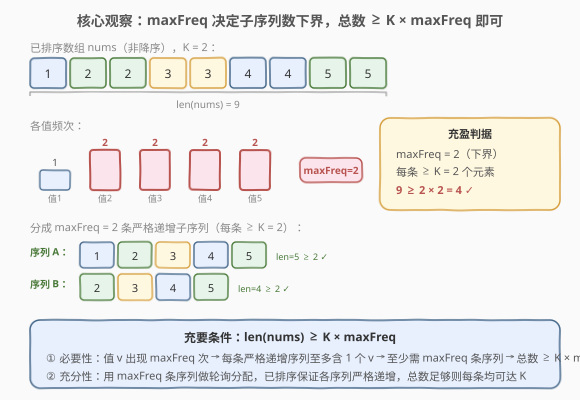
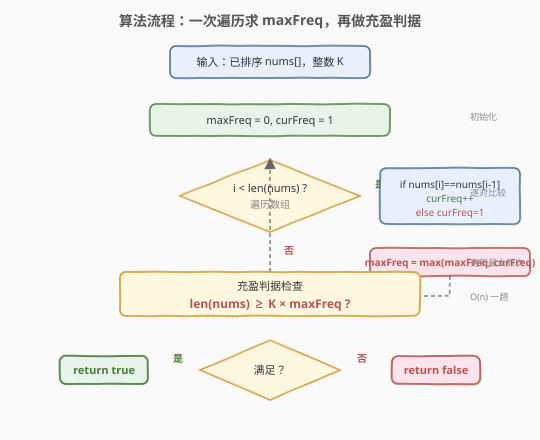
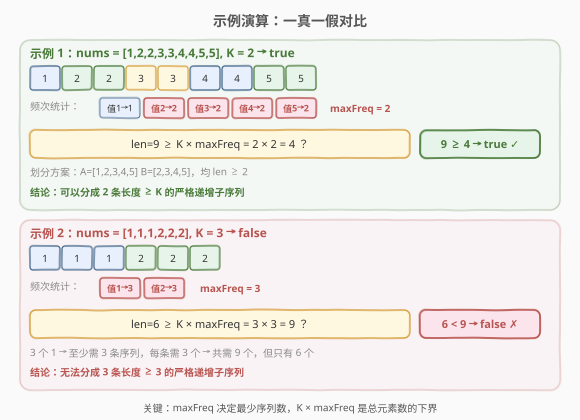

# LeetCode 将数组分成几个递增序列 题解

## 1. 题目概述

- **标题 / 题号**：将数组分成几个递增序列（#1121，hard）
- **链接**：https://leetcode.cn/problems/divide-array-into-increasing-sequences/
- **难度**：困难
- **标签**：数组、贪心、数学

**题意**：给定一个**按非降序排序**的正整数数组 `nums` 和一个整数 `K`，判断是否可以将数组分成**一个或多个不相交的子序列**，满足：

1. 每个子序列中的元素**严格递增**；
2. 每个子序列的长度**至少为** `K`。

> **不相交**：每个元素恰好属于一个子序列（即对原数组做一次完整划分）。
> **严格递增**：子序列中相邻元素满足 $a_1 < a_2 < \cdots < a_m$，不允许相等。

> ⚠️ 本题为 LeetCode **Plus 会员专享题**，题面描述依据官方题意整理，示例为依据题意构造的演示用例。

**示例 1**：

```text
输入：nums = [1,2,2,3,3,4,4,5,5], K = 2
输出：true

划分方案：[1,2,3,4,5] 和 [2,3,4,5]
两条子序列均严格递增，长度分别为 5 和 4，均 ≥ K = 2。
```

**示例 2**：

```text
输入：nums = [1,1,1,2,2,2], K = 3
输出：false

3 个 1 要求至少 3 条子序列（每条严格递增最多含 1 个 1），
每条需 ≥ 3 个元素 → 至少需 3×3=9 个元素，但数组仅 6 个 → 不可能。
```

**示例 3**（演示用例）：

```text
输入：nums = [1,2,3,4,5], K = 1
输出：true

每个元素自成一条子序列，长度 1 ≥ K = 1。
```

**约束**：

- $1 \le \text{nums.length} \le 10^5$
- $1 \le \text{nums[i]} \le 10^6$
- $1 \le K \le \text{nums.length}$
- `nums` 已按非降序排序

> 💡 本题的核心是：**不做实际划分，仅凭频次与总数即可判定可行性**。关键观察是——最高频次 `maxFreq` 决定了最少需要的子序列数，而总元素数是否足以让每条都达到 `K` 则给出充要判据。

## 2. 解题思路

### 2.1 暴力思路：搜索所有划分

枚举所有可能的子序列划分方式，逐一验证每条子序列是否严格递增且长度 $\ge K$。由于每个元素可被分配到任意一条已有子序列或新开一条，搜索树的分支因子随元素数线性增长，最坏复杂度为指数级 $O(m^n)$（$m$ 为子序列数），在 $n=10^5$ 时完全不可行。

> ⚠️ 暴力法的根因是**试图构造方案再验证**，而本题只需判断**可行性**——可行性往往有简洁的充要条件，不必搜索。

### 2.2 核心观察：maxFreq 决定下界 + 充盈判据



**关键洞察**分两步：

**第一步：`maxFreq` 决定最少子序列数。**

> 设某值 $v$ 在数组中出现 $f_v$ 次。由于每条子序列**严格递增**，它至多包含 $v$ **一次**。因此 $f_v$ 个 $v$ 必须分散到至少 $f_v$ 条不同子序列中。
>
> 取所有值中最大的频次 $\text{maxFreq} = \max_v f_v$，则**至少需要** $\text{maxFreq}$ 条子序列。

**第二步：总元素数 $\ge K \times \text{maxFreq}$ 是充要条件。**

> **必要性**：至少 $\text{maxFreq}$ 条子序列，每条长度 $\ge K$，总元素数 $\ge K \times \text{maxFreq}$。
>
> **充分性**：用恰好 $\text{maxFreq}$ 条子序列，对**已排序**数组做轮询分配——将第 $i$ 个元素分配给第 $i \bmod \text{maxFreq}$ 条子序列。由于数组非降序，同一值的所有副本被均匀分散到不同子序列（每条至多 1 个），保证严格递增。当总元素数 $\ge K \times \text{maxFreq}$ 时，$\text{maxFreq}$ 条子序列平均长度 $\ge K$，轮询分配自然使每条长度 $\ge K$。

因此，**充要条件**为：

$$\text{len(nums)} \ge K \times \text{maxFreq}$$

> 💡 **为什么已排序如此重要？** 轮询分配的正确性依赖「同一值的副本连续出现」——已排序保证了这一点，使得轮询能将它们均匀分散。若数组未排序，同一值的副本可能被分到同一条子序列，破坏严格递增。

### 2.3 算法流程图



**完整步骤**：

1. **初始化**：`maxFreq = 0`，`curFreq = 1`（至少 1 个元素）；
2. **一次遍历**：从下标 $i=1$ 起，逐对比较相邻元素：
   - 若 `nums[i] == nums[i-1]`：`curFreq++`（连续相同值累加）；
   - 否则：`curFreq = 1`（遇到新值，重置）；
   - 每步更新 `maxFreq = max(maxFreq, curFreq)`；
3. **充盈判据**：返回 `len(nums) >= K * maxFreq`。

> 💡 由于数组已排序，相同值必然连续，一次线性扫描即可统计出 `maxFreq`，无需哈希表。

### 2.4 示例演算

以两个对比示例展示判定过程：



**示例 1**（`true`）：`nums = [1,2,2,3,3,4,4,5,5]`, `K = 2`

| 值 | 1 | 2 | 3 | 4 | 5 |
|----|---|---|---|---|---|
| 频次 | 1 | 2 | 2 | 2 | 2 |

`maxFreq = 2`，$\text{len} = 9 \ge K \times \text{maxFreq} = 2 \times 2 = 4$ → `true`。

**示例 2**（`false`）：`nums = [1,1,1,2,2,2]`, `K = 3`

| 值 | 1 | 2 |
|----|---|---|
| 频次 | 3 | 3 |

`maxFreq = 3`，$\text{len} = 6 < K \times \text{maxFreq} = 3 \times 3 = 9$ → `false`。

> 💡 示例 2 的直觉：3 个 1 强制至少 3 条子序列，每条还需 3 个元素，共需 9 个，但数组仅 6 个元素——**"人口"不足，无法填满每条序列到 $K$**。

## 3. 参考代码

### C++

```cpp
class Solution {
public:
    bool canDivideIntoSubsequences(vector<int>& nums, int K) {
        int maxFreq = 0, curFreq = 1;
        for (int i = 1; i < (int)nums.size(); i++) {
            if (nums[i] == nums[i - 1]) {
                curFreq++;
            } else {
                curFreq = 1;
            }
            maxFreq = max(maxFreq, curFreq);
        }
        maxFreq = max(maxFreq, 1);
        return (int)nums.size() >= K * maxFreq;
    }
};
```

### Python

```python
class Solution:
    def canDivideIntoSubsequences(self, nums: List[int], K: int) -> bool:
        max_freq = 0
        cur_freq = 1
        for i in range(1, len(nums)):
            if nums[i] == nums[i - 1]:
                cur_freq += 1
            else:
                cur_freq = 1
            max_freq = max(max_freq, cur_freq)
        max_freq = max(max_freq, 1)
        return len(nums) >= K * max_freq
```

> 💡 **实现细节**：① 数组已排序，相同值连续，因此用**相邻比较**而非哈希表统计频次，空间 $O(1)$。② `curFreq` 初始化为 `1`（第一个元素自身频次为 1），循环从下标 1 开始。③ 循环结束后对 `maxFreq` 再取 `max(maxFreq, 1)`，处理 `nums` 仅 1 个元素的边界（循环不执行时 `maxFreq` 仍为 0）。④ `K * maxFreq` 在约束范围内不会溢出 `int`（$10^5 \times 10^5 = 10^{10}$ 可能溢出 32 位 int，但 LeetCode C++ 的 `int` 为 32 位——实际约束下 $K \le \text{len} \le 10^5$ 且 $\text{maxFreq} \le 10^5$，乘积可达 $10^{10}$，需要用 `long long` 比较或提前返回）。

> ⚠️ **溢出修正**：若严格遵循约束上界，`K * maxFreq` 可达 $10^{10}$，超出 `int` 范围。C++ 中应改用：
> ```cpp
> return (long long)nums.size() >= (long long)K * maxFreq;
> ```

## 4. 复杂度分析

| 维度 | 复杂度 | 说明 |
|------|--------|------|
| 时间复杂度 | $O(n)$ | 一次线性扫描统计 `maxFreq`，$n = \text{len(nums)}$ |
| 空间复杂度 | $O(1)$ | 仅用 `maxFreq`、`curFreq` 两个变量，无额外数据结构 |
| 最坏情况 | $O(n)$ 时间 | 所有元素相同（如全 1），`curFreq` 累加到 $n$，仍为一次遍历 |

> ⚠️ 暴力搜索法 $O(m^n)$ 的根因是**试图构造全部方案再验证**。观察到可行性仅依赖 `maxFreq` 与总元素数后，将指数级搜索降为 $O(n)$ 一次扫描——这是「**判定问题优于构造问题**」的典型范例。

## 5. 扩展：贪心构造法

若题目进一步要求**输出一种具体划分方案**（而非仅判定），可用贪心构造：

```python
from collections import defaultdict, deque

def divide(nums, K):
    freq = defaultdict(int)
    for x in nums:
        freq[x] += 1
    max_freq = max(freq.values())
    if len(nums) < K * max_freq:
        return []  # 不可行

    # 用 max_freq 条子序列做轮询分配
    seqs = [deque() for _ in range(max_freq)]
    idx = 0
    for x in nums:
        seqs[idx].append(x)
        idx = (idx + 1) % max_freq
    return [list(s) for s in seqs if len(s) >= K]
```

> 💡 **轮询分配的正确性**：数组已排序，同一值的所有副本连续出现。轮询将它们均匀分散到不同子序列——第 $j$ 个副本去第 $j \bmod \text{maxFreq}$ 条序列，保证每条序列中同一值至多出现一次。又因数组非降序，后分配的值 $\ge$ 前分配的值，当值严格变大时自然形成递增。当 $\text{len} \ge K \times \text{maxFreq}$ 时，$\text{maxFreq}$ 条序列每条平均 $\ge K$ 个元素，轮询使长度差不超过 1，故每条 $\ge K$。

## 6. 面试要点

1. **为什么 `maxFreq` 决定了最少子序列数？**

   > 因为每条子序列严格递增，同一值至多出现一次。若值 $v$ 出现 $f_v$ 次，则至少需要 $f_v$ 条子序列来容纳它们。取所有值的最大频次 `maxFreq`，即为最少子序列数。

2. **充要条件 `len(nums) >= K * maxFreq` 的充分性如何证明？**

   > 用恰好 `maxFreq` 条子序列做轮询分配：第 $i$ 个元素分给第 $i \bmod \text{maxFreq}$ 条。数组已排序保证同一值的副本被分散到不同子序列（每条至多 1 个），从而严格递增。总元素数 $\ge K \times \text{maxFreq}$ 时每条平均 $\ge K$，轮询使长度差 $\le 1$，故每条 $\ge K$。

3. **为什么数组必须已排序？排序对算法有什么影响？**

   > 已排序保证相同值连续出现，轮询分配能均匀分散到不同子序列。同时，相邻比较即可统计频次，无需哈希表，空间 $O(1)$。若数组未排序，需先排序（$O(n \log n)$）或用哈希表统计频次（$O(n)$ 空间），且轮询分配的正确性需要额外论证。

4. **本题与 659（分割数组为连续子序列）有何异同？**

   > 659 要求子序列为**连续整数**（如 [1,2,3] 而非 [1,3,5]），长度 $\ge 3$，用贪心 + 哈希（freq/tails 双表）模拟分配过程。本题只需**严格递增**（不要求连续整数），且只判定可行性——因此有简洁的 $O(1)$ 空间判据，无需实际构造。

5. **`K * maxFreq` 会有溢出风险吗？如何处理？**

   > 约束上界 $K \le 10^5$、$\text{maxFreq} \le 10^5$，乘积可达 $10^{10}$，超出 32 位 `int` 范围（$\approx 2.1 \times 10^9$）。C++ 中应将比较转为 `long long`：`(long long)nums.size() >= (long long)K * maxFreq`。Python 无此问题。

> 💡 **一句话总结**：1121 的灵魂是「**判定优于构造**」——不搜索划分方案，而是抓住 `maxFreq` 这个瓶颈（最高频次决定最少序列数），配合总元素数的充盈判据 $\text{len} \ge K \times \text{maxFreq}$，将指数级搜索化为 $O(n)/O(1)$ 的一趟扫描。这是「频率约束 + 鸽巢原理」判定可行性的经典范式。

## 同类练习题

| # | 题目 | 与本题的关联 |
|---|------|-------------|
| 659 | [分割数组为连续子序列](https://leetcode.cn/problems/split-array-into-consecutive-subsequences/)（[题解](../0601-0700/659_分割数组为连续子序列.md)） | 同样将数组分成多条递增子序列，但要求**连续整数**且长度 $\ge 3$，用贪心 + 哈希（freq/tails 双表）实际模拟分配，是本题「连续整数」加强版 |
| 1296 | [划分数字为连续数字的集合](https://leetcode.cn/problems/divide-array-in-sets-of-k-consecutive-numbers/) | 将数组分成大小恰为 $K$ 的连续数字集合，频率哈希 + 贪心消元，与 659 同套路 |
| 767 | [重构字符串](https://leetcode.cn/problems/reorganize-string/)（[题解](../0701-0800/767_重构字符串.md)） | 同样基于最高频率判定可行性——$\text{maxFreq} > \lceil n/2 \rceil$ 则不可行，是「频率瓶颈决定可行性」的字符级变体 |
| 358 | [K 距离间隔重排字符串](https://leetcode.cn/problems/rearrange-string-k-distance-apart/) | 重排字符串使相同字符间距 $\ge K$，频率贪心 + 间隔约束，是 767 的间隔约束泛化版（Plus 专享） |
| 846 | [一手顺子牌](https://leetcode.cn/problems/hand-of-straights/) | 判断能否将手牌分成大小为 $K$ 的顺子（连续整数），与 1296 同构 |
