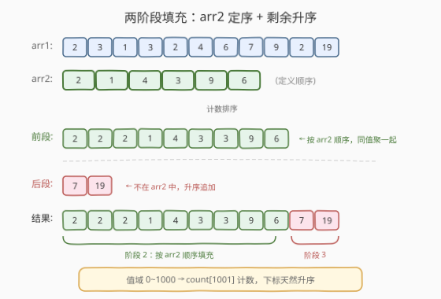
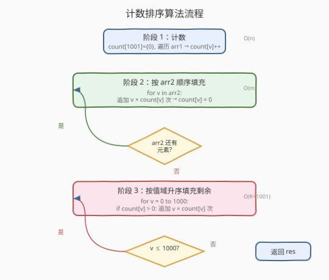
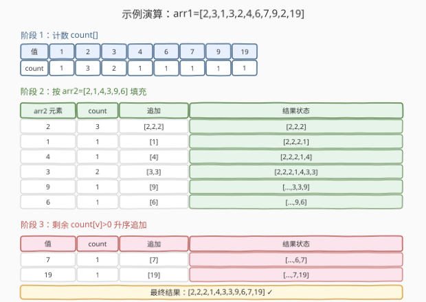

# 数组的相对排序

- **题目名称**：数组的相对排序
- **链接**：[1122. 数组的相对排序](https://leetcode.cn/problems/relative-sort-array/)
- **难度**：简单
- **标签**：数组、哈希表、计数排序

## 1. 题目概述

给定两个数组 `arr1` 和 `arr2`，其中 `arr2` 的元素**互不相同**，且 `arr2` 中的每个元素都出现在 `arr1` 中。要求对 `arr1` 进行排序，使得排序后 `arr1` 中元素的**相对顺序**与 `arr2` 中的顺序一致。**未出现在 `arr2` 中的元素**按**升序**附加在末尾。

**示例 1**：

```text
输入：arr1 = [2,3,1,3,2,4,6,7,9,2,19], arr2 = [2,1,4,3,9,6]
输出：[2,2,2,1,4,3,3,9,6,7,19]
解释：arr2 的顺序是 2→1→4→3→9→6，arr1 中这些元素按此顺序排列
     （2 出现 3 次、1 出现 1 次、4 出现 1 次、3 出现 2 次…），
     7 和 19 不在 arr2 中，升序附加在末尾。
```

**示例 2**：

```text
输入：arr1 = [28,6,22,8,44,17], arr2 = [22,28,8,6]
输出：[22,28,8,6,17,44]
解释：arr2 顺序 22→28→8→6，17 和 44 不在 arr2 中，升序附加。
```

**约束条件**：

- $1 \le \text{arr1.length}, \text{arr2.length} \le 1000$
- $0 \le \text{arr1[i]}, \text{arr2[i]} \le 1000$
- `arr2` 中的元素各不相同
- `arr2` 中的每个元素都出现在 `arr1` 中

> 💡 值域 $0 \sim 1000$ 是关键约束——它使得**计数排序**（用数组代替哈希表）成为最优解法，无需排序即可 $O(1)$ 定位每个值。

---

## 2. 解题思路

### 2.1 暴力思路：排序 + 自定义比较器

最直觉的做法是对 `arr1` 排序，自定义比较函数：若两个元素都在 `arr2` 中，按 `arr2` 中的下标比较；若只有一个在 `arr2` 中，在 `arr2` 中的排前面；若都不在，按数值升序。

为此需先用哈希表记录 `arr2` 中每个元素的下标（值 → 排序优先级），再以此作为比较器排序 `arr1`。

> ⚠️ 此法时间 $O(n \log n + m)$，空间 $O(m)$。能用但**未利用值域 $0 \sim 1000$ 的特性**，非最优。

### 2.2 核心观察：计数排序——两阶段填充



题目本质是一个**自定义排序**，但自定义规则很特殊：

- **前段**：`arr2` 中出现的元素，按 `arr2` 的顺序排，同值元素聚在一起。
- **后段**：不在 `arr2` 中的元素，按数值升序排。

由于值域只有 $0 \sim 1000$，我们可以用**计数数组** `count[1001]` 统计 `arr1` 中每个值的出现次数，然后**两阶段填充**结果数组：

1. **按 `arr2` 顺序填充**：遍历 `arr2`，对于每个值 $v$，将 $v$ 重复 `count[v]` 次追加到结果，然后清零 `count[v]`。
2. **按值升序填充剩余**：从 $0$ 到 $1000$ 遍历，若 `count[v] > 0`，将 $v$ 重复 `count[v]` 次追加到结果。

> 💡 **为什么不用哈希表而用数组？** 值域 $0 \sim 1000$ 恰好映射到数组下标，`count[v]` 直接索引，比哈希表更快（无哈希计算 + 无冲突处理）。第二阶段从 $0$ 升序遍历天然满足"剩余元素升序"的要求，**无需额外排序**。这是计数排序的精髓：**用值域下标天然有序**。

### 2.3 算法流程图



**完整步骤**：

1. **计数**：创建 `count[1001]`（全 0），遍历 `arr1`，对每个值 `v` 执行 `count[v]++`。
2. **按 `arr2` 填充**：遍历 `arr2`，对每个值 `v`，将 `v` 写入结果 `count[v]` 次，然后 `count[v] = 0`（标记已处理）。
3. **填充剩余**：从 $0$ 到 $1000$ 遍历 `count`，若 `count[v] > 0`，将 `v` 写入结果 `count[v]` 次。
4. **返回**结果数组。

> ⚠️ **第二阶段的升序保证**：遍历 `count` 从 $0$ 到 $1000$，下标天然升序，因此剩余元素自动升序排列。清零 `arr2` 中已处理元素的 `count` 后，第二阶段只会碰到不在 `arr2` 中的元素。

### 2.4 示例演算

以 `arr1 = [2,3,1,3,2,4,6,7,9,2,19]`, `arr2 = [2,1,4,3,9,6]` 为例：



**阶段 1：计数**

| 值 | 0 | 1 | 2 | 3 | 4 | 5 | 6 | 7 | 8 | 9 | … | 19 |
|----|---|---|---|---|---|---|---|---|---|---|---|---|
| count | 0 | 1 | 3 | 2 | 1 | 0 | 1 | 1 | 0 | 1 | … | 1 |

**阶段 2：按 `arr2` 顺序填充**

| arr2 元素 | count[v] | 追加到结果 | 结果状态 |
|-----------|----------|-----------|---------|
| 2 | 3 | `[2,2,2]` | `[2,2,2]` |
| 1 | 1 | `[1]` | `[2,2,2,1]` |
| 4 | 1 | `[4]` | `[2,2,2,1,4]` |
| 3 | 2 | `[3,3]` | `[2,2,2,1,4,3,3]` |
| 9 | 1 | `[9]` | `[2,2,2,1,4,3,3,9]` |
| 6 | 1 | `[6]` | `[2,2,2,1,4,3,3,9,6]` |

> 填充后将这些值的 `count` 清零。

**阶段 3：按值域升序填充剩余**

遍历 `count[0..1000]`，`count[v] > 0` 的有：`7(×1)`、`19(×1)`。

| 值 | count[v] | 追加到结果 | 结果状态 |
|----|----------|-----------|---------|
| 7 | 1 | `[7]` | `[…,6,7]` |
| 19 | 1 | `[19]` | `[…,7,19]` |

**最终结果**：`[2,2,2,1,4,3,3,9,6,7,19]` ✓

---

## 3. 参考代码

### 方法一：计数排序（推荐）

### C++

```cpp
class Solution {
public:
    vector<int> relativeSortArray(vector<int>& arr1, vector<int>& arr2) {
        int count[1001] = {0};
        for (int v : arr1)
            count[v]++;

        vector<int> res;
        res.reserve(arr1.size());

        for (int v : arr2)
            while (count[v]-- > 0)
                res.push_back(v);

        for (int v = 0; v <= 1000; v++)
            while (count[v]-- > 0)
                res.push_back(v);

        return res;
    }
};
```

### Python

```python
class Solution:
    def relativeSortArray(self, arr1: List[int], arr2: List[int]) -> List[int]:
        count = [0] * 1001
        for v in arr1:
            count[v] += 1

        res = []
        for v in arr2:
            res.extend([v] * count[v])
            count[v] = 0

        for v in range(1001):
            if count[v] > 0:
                res.extend([v] * count[v])

        return res
```

> 💡 **写法要点**：① C++ 中 `count[1001] = {0}` 一次性初始化全零。② `while (count[v]-- > 0)` 巧妙地递减计数并填充，一步到位。③ Python 用 `res.extend([v] * count[v])` 批量追加，比循环 `append` 更 Pythonic。④ 第二阶段从 $0$ 升序遍历，天然保证剩余元素升序。

### 方法二：哈希表 + 排序（值域无界时的通用方案）

### Python

```python
class Solution:
    def relativeSortArray(self, arr1: List[int], arr2: List[int]) -> List[int]:
        rank = {v: i for i, v in enumerate(arr2)}

        arr1.sort(key=lambda x: (rank.get(x, len(arr2)), x))
        return arr1
```

> 💡 **比较器设计**：`rank.get(x, len(arr2))` 将不在 `arr2` 中的元素赋予最大优先级 `len(arr2)`，使其排到后面；同优先级时按值 `x` 升序。一行代码搞定，但时间 $O(n \log n)$，且未利用值域特性。当值域无界时此法更通用。

---

## 4. 复杂度分析

| 维度 | 方法 | 复杂度 | 说明 |
|------|------|--------|------|
| 时间复杂度 | 计数排序 | $O(n + m + K)$ | 遍历 arr1 计数 $O(n)$、遍历 arr2 填充 $O(m)$、遍历值域 $O(K)$，$K = 1001$ |
| 空间复杂度 | 计数排序 | $O(K)$ | 计数数组大小 $1001$，与输入规模无关 |
| 时间复杂度 | 哈希表+排序 | $O(n \log n + m)$ | 排序 $O(n \log n)$、建哈希表 $O(m)$ |
| 空间复杂度 | 哈希表+排序 | $O(m)$ | 哈希表存 arr2 的 rank 映射 |

> ⚠️ **$K = 1001$ 是常数**：虽然形式上写了 $O(n + m + K)$，但 $K$ 固定为 1001（值域 $0 \sim 1000$），所以实际时间复杂度为 $O(n + m)$。计数排序法在 $n$ 较大时显著优于 $O(n \log n)$ 的排序法。

---

## 5. 扩展：值域无界时的处理

本题值域 $0 \sim 1000$ 使计数数组可行。若值域无界（如元素可为任意整数），则需改用**哈希表**计数：

1. 用 `HashMap<Integer, Integer>` 统计 `arr1` 频率。
2. 遍历 `arr2` 填充并从 map 中删除已处理元素。
3. 对 map 中剩余的 key 排序后依次填充。

```python
from collections import Counter

class Solution:
    def relativeSortArray(self, arr1: List[int], arr2: List[int]) -> List[int]:
        count = Counter(arr1)

        res = []
        for v in arr2:
            res.extend([v] * count[v])
            del count[v]

        for v in sorted(count.keys()):
            res.extend([v] * count[v])

        return res
```

> 💡 此时第三步需显式 `sorted(count.keys())`，时间退化为 $O(n + m + k \log k)$（$k$ 为不在 `arr2` 中的不同值数）。但本题值域有界，计数数组方案更优。

---

## 6. 面试要点

1. **为什么用计数数组而不是哈希表？**

   > 题目约束值域 $0 \sim 1000$，恰好映射到数组下标。数组索引 $O(1)$ 且无哈希开销，比哈希表更快。更重要的是，第二阶段从 $0$ 升序遍历数组天然满足"剩余元素升序"，无需额外排序。

2. **第二阶段为什么不需要排序？**

   > 清零 `arr2` 中已处理元素的 `count` 后，从 $0$ 到 $1000$ 遍历 `count` 数组。由于下标天然升序，遇到 `count[v] > 0` 的值 $v$ 自动按升序追加。这就是计数排序"用值域下标天然有序"的精髓。

3. **计数排序法和自定义比较器排序法的本质区别？**

   > 计数排序法利用值域有界，将排序问题转化为**线性扫描填充**，时间 $O(n + m)$。自定义比较器排序法是对 `arr1` 整体排序，时间 $O(n \log n)$。前者用空间换时间（$O(K)$ 额外空间），后者更通用（值域无界时仍可用）。

4. **如果 `arr2` 中有元素不在 `arr1` 中怎么办？**

   > 题目保证 `arr2` 中每个元素都出现在 `arr1` 中。若不保证，则填充时 `count[v] = 0`，不会追加任何元素，行为正确但可能不符合预期。

5. **`res.reserve(arr1.size())` 的作用？**

   > C++ 中预分配结果数组容量，避免 `push_back` 时多次重新分配内存。虽然不影响正确性，但能提升性能，是 C++ 的常见优化习惯。

> 💡 **一句话总结**：1122 的核心是识别值域有界 $0 \sim 1000$ 这一条件，用计数数组代替哈希表 + 排序，将自定义排序降为 $O(n + m)$ 线性填充。两阶段（按 `arr2` 顺序 + 按值域升序）天然覆盖全部元素，无需额外排序步骤。

---

## 7. 同类练习题

- [56. 合并区间](https://leetcode.cn/problems/merge-intervals/)（[题解](../0001-0100/56_合并区间.md)）：同为数组排序问题，但考察区间合并而非自定义排序顺序
- [215. 数组中的第K个最大元素](https://leetcode.cn/problems/kth-largest-element-in-an-array/)：值域有界时可用计数排序求第 K 大，与本题共享计数排序思想
- [347. 前 K 个高频元素](https://leetcode.cn/problems/top-k-frequent-elements/)：先用哈希表/计数数组统计频率，再按频率排序取 Top-K，与本题的"计数 + 按自定义顺序输出"同构
- [1636. 按照频率将数组升序排序](https://leetcode.cn/problems/sort-array-by-increasing-frequency/)：频率计数 + 自定义排序（频率升序、同频率值降序），与本题的"计数 + 自定义顺序"结构相似
- [912. 排序数组](https://leetcode.cn/problems/sort-an-array/)（[题解](../0901-1000/912_排序数组.md)）：值域有界时可用计数排序 $O(n)$，是本题计数排序思想的母题
