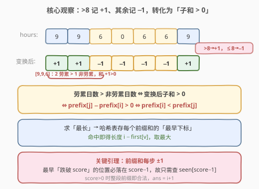
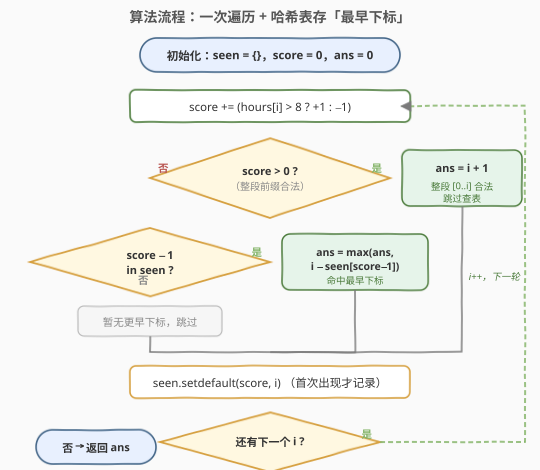
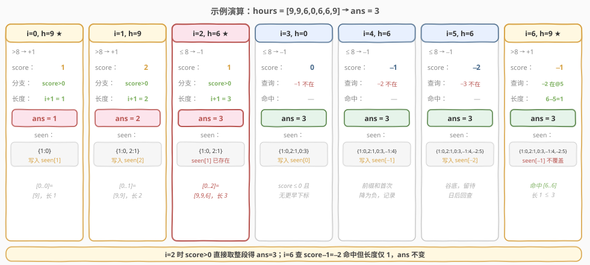

# LeetCode 表现良好的最长时间段 题解

## 1. 题目概述

- **标题 / 题号**：表现良好的最长时间段（#1124，medium）
- **链接**：https://leetcode.cn/problems/longest-well-performing-interval/
- **难度**：中等
- **标签**：数组、哈希表、前缀和

**题意**：给定一份员工每日工作时长列表 `hours`。**劳累日**定义为当天工作时长**严格大于 8 小时**的日期；**非劳累日**为其余日期。一段**表现良好的时间段**是指一个连续区间，其中**劳累日数量严格大于非劳累日数量**。返回表现良好的最长时间段的长度。

**示例 1**：

```text
输入：hours = [9,9,6,0,6,6,9]
输出：3
解释：最长的表现良好时间段是 [9,9,6]，其中 2 个劳累日 > 1 个非劳累日。
```

**示例 2**：

```text
输入：hours = [6,6,6]
输出：0
解释：没有劳累日，不存在满足条件的时间段。
```

**约束**：

- $1 \le \text{hours.length} \le 10^4$
- $0 \le \text{hours[i]} \le 16$

> ⚠️ 注意：求的是「**最长长度**」而非个数；区间必须**连续**；数据规模 $10^4$，要求 $O(n)$ 级别解法，暴力 $O(n^2)$ 在边界上偏慢且有更优做法。

## 2. 解题思路

### 2.1 暴力思路

枚举所有连续区间 `[i, j]`，统计其中劳累日与非劳累日个数，若劳累日严格更多则更新最长长度。两重循环加计数共 $O(n^2)$，在 $n = 10^4$ 时约 $10^8$ 量级，勉强但不够优雅。需要找到「一次扫描就能判断」的增量方法。

### 2.2 核心观察：把 >8 记 +1、其余记 −1，转化为「子和 > 0」



直接数劳累日与非劳累日的差值不好维护，但有一个经典等价转换：**把每个 `>8` 的日子记 `+1`，其余记 `−1`**。这样「一段区间里劳累日数严格大于非劳累日数」就等价于「变换后这段区间的**和严格大于 0**」：

$$
\#\text{劳累} > \#\text{非劳累} \;\Longleftrightarrow\; \sum_{k=i}^{j} \text{val}(\text{hours}[k]) > 0
$$

设 `prefix[j]` 为前 `j` 个元素（变换后）之和，`prefix[0] = 0`，则子数组 `[i, j-1]` 的和为 `prefix[j] - prefix[i]`。要求该和 $> 0$，即：

$$
\text{prefix}[j] - \text{prefix}[i] > 0 \;\Longleftrightarrow\; \text{prefix}[i] < \text{prefix}[j]
$$

> 💡 **关键转化**：问题从「数劳累/非劳累个数」变成「**找两个前缀和满足 `prefix[i] < prefix[j]` 且距离最大**」。这与 [525. 连续数组](../0501-0600/525_连续数组.md) 几乎同构——525 求「相等」(`prefix[i] == prefix[j]`)，本题求「严格小于」(`prefix[i] < prefix[j]`)。一字之差，解法却需要一个新的引理。

#### 关键引理：只需查 `seen[score - 1]`

525 求相等时，哈希表存每个前缀和的最早下标，遇到相同值即可算距离。本题求「严格小于」，似乎要查询「所有比当前 `score` 小的值的最早下标」——朴素做需遍历整个值域。

但前缀和有个关键性质：**每一步只变化 $\pm 1$**。由此推出：

> **引理**：设当前前缀和为 `score`，则「**最早**一个前缀和值 $<$ `score`」的位置，其值**恰好等于 `score − 1`**。

证明很短：设 `m` 是最早满足 `prefix[m] < score` 的下标。由「最早」知 `prefix[m-1] >= score`；又前缀和每步只能 $\pm 1$，要使 `prefix[m] < score` 而 `prefix[m-1] >= score`，唯一可能是 `prefix[m-1] = score` 且 `prefix[m] = score − 1`（下降一步）。故该位置值恰为 `score − 1`。

> 💡 因此**只需在哈希表里查 `score − 1` 这一个键**，拿到的就是「最早小于 `score`」的下标，用它算出的区间一定是最长的。这就是本题能保持 $O(n)$ 的精髓。

> ⚠️ 还有一类情况无需查表：当 `score > 0` 时，`prefix[0] = 0 < score` 直接成立，整段前缀 `[0..i]` 都合法，长度就是 `i + 1`，且它一定是「以 `i` 为右端点」的最长区间（左端点 0 是所有位置里最早的）。所以 `score > 0` 时直接 `ans = i + 1`，跳过查表。

### 2.3 算法流程图



一次遍历即可：

1. 维护哈希表 `seen`，记录每个前缀和**首次出现**的下标（初始为空）；维护 `score = 0`、`ans = 0`。
2. 对每个下标 `i`：`score += (hours[i] > 8 ? +1 : -1)`。
   - 若 `score > 0`：整段 `[0..i]` 合法，`ans = i + 1`（天然最长，无需查表）。
   - 否则若 `score - 1` 在 `seen` 中：`ans = max(ans, i - seen[score - 1])`（引理保证这是以 `i` 为右端点的最长）。
   - 否则：暂无更早下标，跳过。
   - 最后 `seen.setdefault(score, i)`——**首次出现才记录**，已存在绝不覆盖。
3. 遍历结束，`ans` 即答案。

> ⚠️ **与 [525. 连续数组](../0501-0600/525_连续数组.md) 的关键区别**：525 初始化 `{0: -1}` 并查「相等」；本题不初始化 `seen[0]`，而是用 `score > 0` 分支单独处理「从数组开头起算」的情况，其余查 `score − 1`。两题都「只存最早下标、不覆盖」，但查询的键不同——这是 `>` 与 `==` 的本质差异。

### 2.4 示例演算

以 `hours = [9,9,6,0,6,6,9]` 为例（变换后 `[+1,+1,-1,-1,-1,-1,+1]`，答案应为 `3`，对应 `[9,9,6]`）：



| 步骤 | hour | Δ | score | 分支 | ans | seen 动作 |
|------|------|----|-------|------|-----|-----------|
| i=0 | 9 | +1 | 1 | score>0 → 长 1 | 1 | 写入 {1:0} |
| i=1 | 9 | +1 | 2 | score>0 → 长 2 | 2 | 写入 {2:1} |
| i=2 | 6 | −1 | 1 | score>0 → 长 3 | 3 | seen[1] 已存在，不覆盖 |
| i=3 | 0 | −1 | 0 | 查 −1 不在 | 3 | 写入 {0:3} |
| i=4 | 6 | −1 | −1 | 查 −2 不在 | 3 | 写入 {−1:4} |
| i=5 | 6 | −1 | −2 | 查 −3 不在 | 3 | 写入 {−2:5} |
| i=6 | 9 | +1 | −1 | 查 −2 在@5 → 长 1 | 3 | seen[−1] 已存在，不覆盖 |

最终答案 `3`，对应区间 `[0..2] = [9,9,6]`。

> 💡 **看 i=2 与 i=6 两个关键步**：
> - **i=2**：此时 `score=1 > 0`，整段 `[9,9,6]` 的子和为 `+1 > 0`，直接得 `ans = 3`。这是 `score>0` 分支的威力——左端点直接取数组起点 0，无需查表。
> - **i=6**：此时 `score=−1 ≤ 0`，按引理查 `score−1 = −2`，命中 `seen[−2] = 5`，区间 `[6..6]`（仅一个 9）长度 1，不超过现有 `ans`。注意此处即便 `seen[−1]` 已存在也不覆盖——保留最早下标才能在日后取到最长。
>
> 这也说明：**谷底值（如 `−2`）虽然当时算不出答案，但必须记下来**，等前缀和回升时才用得上（i=6 回升到 `−1`，回头查 `−2`）。

## 3. 参考代码

### C++

```cpp
class Solution {
  public:
    int longestWPI(vector<int>& hours) {
        unordered_map<int, int> seen;
        int ans = 0, score = 0;
        for (int i = 0; i < (int)hours.size(); ++i) {
            score += (hours[i] > 8) ? 1 : -1;
            if (score > 0) {
                ans = i + 1;
            } else if (seen.count(score - 1)) {
                ans = max(ans, i - seen[score - 1]);
            }
            if (!seen.count(score)) {
                seen[score] = i;
            }
        }
        return ans;
    }
};
```

### Python

```python
class Solution:
    def longestWPI(self, hours: List[int]) -> int:
        seen = {}
        ans = score = 0
        for i, h in enumerate(hours):
            score += 1 if h > 8 else -1
            if score > 0:
                ans = i + 1
            elif score - 1 in seen:
                ans = max(ans, i - seen[score - 1])
            seen.setdefault(score, i)
        return ans
```

> 💡 **实现细节**：① `seen.setdefault(score, i)` 等价于「仅当 `score` 不存在时写入」，保证存的是最早下标。② `score > 0` 分支直接取 `i + 1` 而非 `max(ans, i+1)`——因为以 `i` 为右端点时，左端点 0 是全局最早，长度 `i+1` 必不小于此前任何答案；用 `max` 也正确但略冗。C++ 版为对称统一仍用 `ans = i + 1`。③ 前缀和取值范围 `[-n, n]`，也可用大小 `2n+1` 的数组（下标偏移 `n`）代替哈希表，常数更低。

## 4. 复杂度分析

| 维度 | 复杂度 | 说明 |
|------|--------|------|
| 时间复杂度 | $O(n)$ | 只遍历数组一次，每次哈希表查询 / 写入均摊 $O(1)$ |
| 空间复杂度 | $O(n)$ | 最坏情况下每个前缀和都不同，哈希表存 $n$ 个键 |

> 💡 本题前缀和取值范围是 $[-n, n]$，可用大小 $2n+1$ 的数组代替哈希表（下标偏移 $n$），把单次操作常数压到更低；但哈希表写法更通用、可读性更好，是面试首选。

## 5. 扩展：与 525 的对比，及「严格小于」的通用解法

同属「前缀和 + 哈希」家族，本题与 [525](../0501-0600/525_连续数组.md) 仅差一个不等号方向，但查询方式截然不同：

| 题目 | 子数组条件 | 前缀和关系 | 哈希表查询 | 依赖性质 |
|------|-----------|-----------|-----------|----------|
| 525. 连续数组 | 和 = 0 | `prefix[i] == prefix[j]` | 查 `score` 本身 | 无需特殊性质 |
| **1124. 良好时间段** | 和 > 0 | `prefix[i] < prefix[j]` | 查 `score − 1` | **前缀和每步 ±1** |

> ⚠️ 若前缀和**不是每步 ±1**（比如变换规则是 `+2/-1` 等非单位步长），引理失效，「查 `score−1`」就不再保证拿到最早下标。此时需用更通用的「**最长坡（Maximum Width Ramp）**」解法：对前缀和数组求「`prefix[i] < prefix[j]` 的最大 `j−i`」——先构造**严格递减的候选左端点栈**（只保留新最小值），再从右向左扫描，对每个 `j` 不断弹栈顶并更新答案（详见 [962. 最大宽度坡](https://leetcode.cn/problems/maximum-width-ramp/)）。本题因 ±1 步长而能简化为单键查询，是更优雅的特例。

## 6. 面试要点

1. **为什么把 >8 记 +1、其余记 −1？**

   > 「劳累日数 > 非劳累日数」直接维护需同时跟踪两个计数器；变换后「严格更多」就退化成「子和 > 0」，再退化成「两端前缀和满足 `prefix[i] < prefix[j]`」，把双变量问题压缩成单变量（前缀和），从而能用哈希表一次扫描求解。这与 525 把 `0` 当 `−1` 是同一思想。

2. **为什么只需查 `seen[score − 1]`，而不是所有小于 `score` 的值？**

   > 因为前缀和每步只变化 $\pm 1$。「最早一个值 $<$ `score`」的位置，其前一个值必 $\ge$ `score`，而要一步跨到 $<$ `score`，唯一可能是从 `score` 降到 `score−1`。故该位置值恰为 `score−1`，查它一个键即可拿到全局最早下标，免去遍历值域。

3. **`score > 0` 时为什么直接 `ans = i + 1`，不用查表？**

   > `prefix[0] = 0 < score` 直接成立，左端点取数组起点 0 是所有可能位置里最早的，因此以 `i` 为右端点的最长区间就是整段 `[0..i]`，长度 `i+1`，必然最优，无需查哈希表。

4. **遇到已存在的前缀和时，为什么不更新哈希表？**

   > 本题求最长长度，相同前缀和的**最早**下标能配出最大区间；若用新下标覆盖，后续再匹配时算出的长度只会更短。这与 525 完全一致——「求最长存最早」。

5. **谷底值（如示例中的 `−2`）当时算不出答案，为什么还要记？**

   > 前缀和会先下降再回升。下降阶段（`score ≤ 0`）暂时查不到更小值，但这些谷底值是日后回升时的「最早小于」下标来源。示例中 `−2` 在 i=5 记录，到 i=6 回升到 `−1` 时回头查 `−2` 才命中。所以**只要首次出现就必须记录**，不论当下是否用得上。

> 💡 **一句话总结**：1124 是 525 的「严格小于」变体——把 `>8` 记 `+1`、其余记 `−1` 后，求「子和 > 0」即「`prefix[i] < prefix[j]` 的最长距离」。利用前缀和每步 $\pm 1$ 的引理，把「查所有更小值」简化为「只查 `score−1`」一个键，配合「只存最早下标、不覆盖」即可一次遍历 $O(n)$ 解决。

## 同类练习题

| # | 题目 | 与本题的关联 |
|---|------|-------------|
| 525 | [连续数组](https://leetcode.cn/problems/contiguous-array/)（[题解](../0501-0600/525_连续数组.md)） | 前缀和 + 哈希的「相等」变体，对比「查 `score`」vs「查 `score−1`」 |
| 560 | [和为 K 的子数组](https://leetcode.cn/problems/subarray-sum-equals-k/) | 前缀和 + 哈希的「计数」变体，哈希表存频次 |
| 962 | [最大宽度坡](https://leetcode.cn/problems/maximum-width-ramp/) | `nums[i] <= nums[j]` 的最长 `j−i`，单调栈通用解法，是 1124 失去 ±1 性质后的推广 |
| 974 | [和可被 K 整除的子数组](https://leetcode.cn/problems/subarray-sums-divisible-by-k/) | 前缀和改为前缀余数，同余即相减为 K 的倍数 |
| 523 | [连续的子数组和](https://leetcode.cn/problems/continuous-subarray-sum/) | 前缀和 + 同余，且要求子数组长度至少为 2 |
