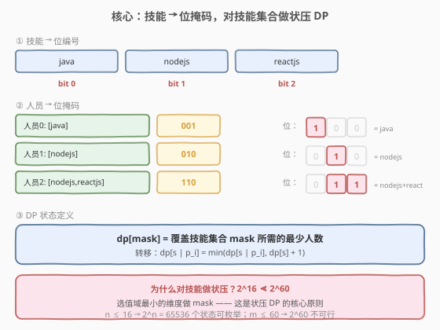
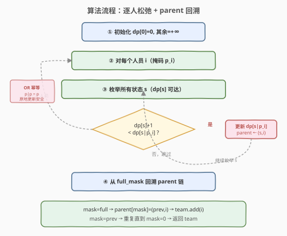
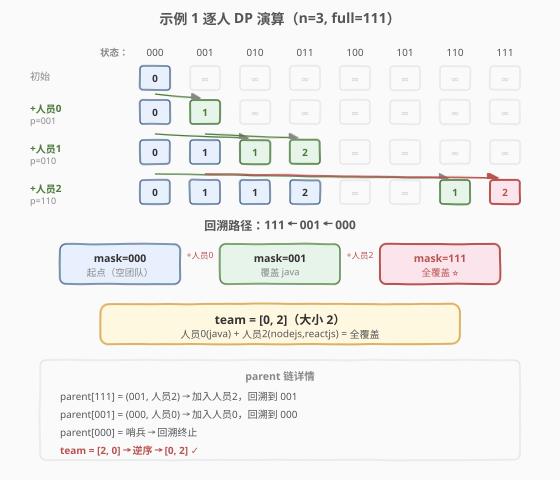

# 最小的必要团队

- **题目名称**：最小的必要团队
- **链接**：[1125. 最小的必要团队](https://leetcode.cn/problems/smallest-sufficient-team/)
- **难度**：困难
- **标签**：位运算、动态规划、状态压缩、贪心

## 1. 题目概述

作为项目经理，你规划了一份需求的技能清单 `req_skills`，并打算从备选人员名单 `people` 中选出些人组成一个「必要团队」——对于 `req_skills` 中列出的**每项技能**，团队中至少有一名成员已经掌握。请你返回**任一**规模最小的必要团队，团队成员用人员编号表示。

**示例 1**：

```text
输入：req_skills = ["java","nodejs","reactjs"],
     people = [["java"],["nodejs"],["nodejs","reactjs"]]
输出：[0,2]

技能编号：java→0, nodejs→1, reactjs→2
人员 0 掌握 java           → 掩码 001
人员 1 掌握 nodejs         → 掩码 010
人员 2 掌握 nodejs,reactjs → 掩码 110
选 {0,2}：001 | 110 = 111（全覆盖），团队大小 2
```

**示例 2**：

```text
输入：req_skills = ["algorithms","math","java","reactjs","csharp","aws"],
     people = [["algorithms","math","java"],["algorithms","math","reactjs"],
               ["java","csharp","aws"],["reactjs","csharp"],["csharp","math"],["aws","java"]]
输出：[1,2]

技能编号：algorithms→0, math→1, java→2, reactjs→3, csharp→4, aws→5
人员 1 掩码 = 001011（algorithms, math, reactjs）
人员 2 掩码 = 110100（java, csharp, aws）
并集 = 111111（全覆盖），团队大小 2
```

**约束条件**：

- $1 \le \text{req\_skills.length} \le 16$
- $1 \le \text{people.length} \le 60$
- $\text{people}[i]$ 中的每个技能是 `req_skills` 中的技能
- 题目数据保证「必要团队」一定存在

> ⚠️ **关键信号**：`req_skills.length ≤ 16` 是**状压 DP**的标志性数据范围——$2^{16} = 65536$ 个状态，恰好落在「可以枚举所有技能子集」的甜区。本题本质是**集合覆盖问题**（NP-Hard），但技能数小使得状压 DP 可行。

---

## 2. 解题思路

### 2.1 暴力思路：枚举人员子集

从 60 个人中枚举所有子集（$2^{60} \approx 10^{18}$），对每个子集检查是否覆盖全部技能，取最小者。显然不可行。

### 2.2 核心观察：对「技能集合」而非「人员集合」做状压 DP

暴力法之所以爆炸，是因为**对人员做子集枚举**（$2^{60}$）。但如果**换一个视角**：不去选「哪些人」，而是去维护「当前已覆盖的技能集合」——技能只有 $\le 16$ 种，对应 $2^{16}$ 个状态，完全可以枚举。



**三步编码**：

1. **技能 → 位编号**：`skill_idx = {skill: i}`，第 `i` 种技能对应第 `i` 位；
2. **人员 → 位掩码**：`person_mask[i]` = 该人员掌握的技能集合的位掩码，即对其技能的 `1 << skill_idx[s]` 做 OR；
3. **DP 状态**：`dp[mask]` = 覆盖技能集合 `mask` 所需的**最少人数**。

> 💡 **为什么对技能做状压而不是对人员？** 因为 $2^{16} \ll 2^{60}$。状压 DP 的关键是选对**压缩维度**——选那个值域最小的维度做 `mask`。本题技能 $\le 16$，人员 $\le 60$，显然压缩技能维度。

### 2.3 状态转移与方案记录

**转移方程**：对每个人员 `i`（掩码 $p_i$），枚举所有已有状态 $s$：

$$\text{dp}[s \mid p_i] = \min\bigl(\text{dp}[s \mid p_i],\;\; \text{dp}[s] + 1\bigr)$$

即「在已覆盖技能 $s$ 的基础上，加入人员 $i$，技能覆盖扩展为 $s \cup p_i$，人数 $+1$」。

**方案还原**：仅记录最少人数不够，还需要输出具体团队。用 `parent[mask] = (prev_mask, person_idx)` 记录每个状态的最优前驱，最终从 `full_mask` 回溯到 `0` 即可还原团队。



**`dp` 与 `parent` 的初始化与终态**：

- `dp[0] = 0`（空团队覆盖空技能集，0 人），其余 `dp[mask] = +∞`；
- `parent[0] = (-1, -1)`（哨兵，回溯终止）；
- 答案：从 `dp[full_mask]` 对应的 `parent` 链回溯。

> ⚠️ **原地更新安全吗？** 处理人员 `i` 时，如果 `dp[s | p_i]` 被更新后又在本轮被读取，是否导致同一人员被「用两次」？——不会。因为 $p_i \mid p_i = p_i$（OR 幂等），重复加入同一人员不改变掩码，而 $\text{dp}[s]+1 > \text{dp}[s]$ 恒成立，所以不可能通过重复使用来改进。

### 2.4 示例演算

以示例 1 为例：`req_skills = ["java","nodejs","reactjs"]`，$n=3$，`full = 111₂ = 7`。



| 步骤 | 人员 | 掩码 $p_i$ | 从状态 $s$ | 新状态 $s \mid p_i$ | dp 更新 | parent 记录 |
|------|------|-----------|-----------|-------------------|---------|------------|
| 初始 | — | — | — | — | `dp[000]=0` | — |
| ① | 0 | 001 | 000 | 001 | `dp[001]=1` | `(000, 0)` |
| ② | 1 | 010 | 000 | 010 | `dp[010]=1` | `(000, 1)` |
| ② | 1 | 010 | 001 | 011 | `dp[011]=2` | `(001, 1)` |
| ③ | 2 | 110 | 000 | 110 | `dp[110]=1` | `(000, 2)` |
| ③ | 2 | 110 | 001 | **111** | `dp[111]=2` | `(001, 2)` |
| ③ | 2 | 110 | 010 | 110 | 无改进（1 < 2） | — |
| ③ | 2 | 110 | 011 | 111 | 无改进（2 = 2） | — |

**回溯**：`111 → (001, 2) → (000, 0) → 停`，团队 = `[2, 0]`（逆序输出即为 `[0, 2]`）。

> 💡 **观察步骤 ③**：人员 2 掩码为 110，从状态 001（仅 java）出发，一步覆盖到 111（全部）。这体现了「**选一个技能多的人收尾**」的直觉，但 DP 保证的是全局最优而非贪心——贪心选技能最多的人不一定最优（可能两人技能高度重叠）。

---

## 3. 参考代码

### Python（字典法，简洁直观）

```python
class Solution:
    def smallestSufficientTeam(self, req_skills: List[str], people: List[List[str]]) -> List[int]:
        n = len(req_skills)
        skill_idx = {s: i for i, s in enumerate(req_skills)}
        full = (1 << n) - 1

        dp = {0: []}  # mask -> team list
        for i, skills in enumerate(people):
            p = 0
            for s in skills:
                p |= 1 << skill_idx[s]
            if p == 0:
                continue
            for mask, team in list(dp.items()):
                new_mask = mask | p
                if new_mask not in dp or len(team) + 1 < len(dp[new_mask]):
                    dp[new_mask] = team + [i]

        return dp[full]
```

### C++（数组法 + parent 回溯，常数更优）

```cpp
class Solution {
public:
    vector<int> smallestSufficientTeam(vector<string>& req_skills,
                                       vector<vector<string>>& people) {
        int n = req_skills.size();
        unordered_map<string, int> skill_idx;
        for (int i = 0; i < n; ++i)
            skill_idx[req_skills[i]] = i;

        int m = people.size();
        vector<int> pmask(m, 0);
        for (int i = 0; i < m; ++i)
            for (string& s : people[i])
                pmask[i] |= 1 << skill_idx[s];

        int full = (1 << n) - 1;
        vector<int> dp(1 << n, INT_MAX);
        vector<pair<int,int>> parent(1 << n, {-1, -1});
        dp[0] = 0;

        for (int i = 0; i < m; ++i) {
            int p = pmask[i];
            if (p == 0) continue;
            for (int s = 0; s <= full; ++s) {
                if (dp[s] == INT_MAX) continue;
                int ns = s | p;
                if (dp[s] + 1 < dp[ns]) {
                    dp[ns] = dp[s] + 1;
                    parent[ns] = {s, i};
                }
            }
        }

        vector<int> team;
        for (int mask = full; mask != 0;) {
            auto [prev, idx] = parent[mask];
            team.push_back(idx);
            mask = prev;
        }
        return team;
    }
};
```

> 💡 **两种写法对比**：Python 字典法只存可达状态，代码极简，适合面试白板；C++ 数组法预分配 $2^n$ 空间，用 `parent` 链回溯避免反复拷贝 `vector`，常数更优。两者思路完全一致——都是「逐人松弛 + 记录最优前驱」。

---

## 4. 复杂度分析

| 维度 | 复杂度 | 说明 |
|------|--------|------|
| 时间复杂度 | $O(m \cdot 2^n)$ | $m$ 个人员，每人枚举 $2^n$ 个技能状态；$n \le 16$ 时 $2^n \le 65536$ |
| 空间复杂度 | $O(2^n)$ | `dp` 数组与 `parent` 数组各 $2^n$；Python 字典法只存可达状态，实际更省 |
| 实际规模 | $60 \times 65536 \approx 3.9 \times 10^6$ | 毫秒级完成 |

> ⚠️ 暴力法 $O(2^m)$ 不可行的根因是 $m=60$ 时 $2^{60} \approx 10^{18}$。状压 DP 的核心优化是**换维**——从「枚举人员子集」转为「枚举技能子集」，利用 $n \ll m$ 把指数从 $m$ 降到 $n$。

---

## 5. 扩展：人员预处理去冗余

某些人员可能是「冗余」的——他们的技能集合是另一个人员的**子集**，此时选子集人员永远不优于选超集人员。预处理可以剪掉这些人，减少 $m$：

```python
# 去冗余：若人员 i 的技能是人员 j 的真子集，且 i 不比 j 更"划算"，则 i 冗余
filtered = []
for i in range(len(people)):
    redundant = False
    for j in range(len(people)):
        if i != j and pmask[i] == (pmask[i] & pmask[j]) and pmask[i] != pmask[j]:
            redundant = True
            break
    if not redundant:
        filtered.append(i)
```

> ⚠️ 注意：若两人技能完全相同（`pmask[i] == pmask[j]`），只保留一个即可。但**不能**简单去掉所有子集——如果人员 $i$ 的技能是 $j$ 的子集，但最终最优解恰好只需要 $i$ 的那部分技能且不需要 $j$ 多出的技能，两者等价（都贡献 1 人），所以去掉子集人员不会影响最优解的大小。预处理只是常数优化，不影响正确性。

---

## 6. 面试要点

1. **为什么对技能做状压而不是对人员？**

   > 状压 DP 的关键是选**值域最小的维度**做 `mask`。技能 $n \le 16$（$2^{16} = 65536$），人员 $m \le 60$（$2^{60} \approx 10^{18}$）。压缩技能维度使状态空间可控，压缩人员维度则完全不可行。

2. **DP 状态为什么不需要额外记录「已选人员集合」？**

   > 因为 `dp[mask]` 存的是「覆盖技能 `mask` 的最少人数」，不关心具体选了谁——同一技能覆盖可以由不同人员组合实现，我们只取最优。方案通过 `parent` 链在回溯时还原，不在状态里显式存储，避免状态爆炸。

3. **原地更新会导致同一人员被选两次吗？**

   > 不会。OR 运算幂等：$p_i \mid p_i = p_i$。重复加入同一人员不改变技能掩码，而 $\text{dp}[s]+1 > \text{dp}[s]$ 恒成立，所以不可能通过重复使用来改进 `dp` 值。这与 0-1 背包「倒序枚举容量」的原因不同——那里是加法（可叠加），这里是 OR（幂等）。

4. **如何保证返回的团队规模最小？**

   > DP 的转移方程取 `min`：`dp[ns] = min(dp[ns], dp[s]+1)`，保证每个状态记录的都是**全局最优**（最少人数）。`parent` 只在 `dp` 被更新时才覆写，所以回溯出的方案对应最优 `dp` 值。

5. **如果要输出所有最优团队而非任一，怎么做？**

   > 将 `parent` 从单链改为多链：`parent[mask]` 存储所有等价前驱的列表。回溯时做 DFS 枚举所有路径。注意最优解可能很多，需按需剪枝或限制输出数量。

> 💡 **一句话总结**：1125 的灵魂是「**对技能集合做状压 DP**」——将 NP-Hard 的集合覆盖问题，利用 $n \le 16$ 的小数据范围，转化为 $O(m \cdot 2^n)$ 的精确 DP。`dp[mask]` 记录覆盖技能集 `mask` 的最少人数，逐人松弛转移，`parent` 链回溯还原方案。这是所有「小范围覆盖/选择」类问题的通用骨架。

---

## 7. 同类练习题

- [691. 贴纸拼词](https://leetcode.cn/problems/stickers-to-spell-word/)：`mask` 表示已拼出的目标字符子集，求最少贴纸数——最值型状压 DP，与本题「最少人员覆盖技能」同构
- [1655. 分配重复整数](https://leetcode.cn/problems/distribute-repeating-integers/)：`mask` 表示已分配的需求子集，判断能否满足所有需求——可行性型状压 DP，承接本题的最值型
- [1799. N 次操作后的最大分数](https://leetcode.cn/problems/maximize-score-after-n-operations/)：`mask` 表示剩余可用数字，成对取数求最大得分——状态设计与本题一致，只是优化目标从「最小」变为「最大」
- [1434. 每个人戴不同帽子的方案数](https://leetcode.cn/problems/number-of-ways-to-wear-different-hats-to-each-other/)：对帽子做状压 `mask` 表示已分配的人集合，求方案数——同样是「选维度做 mask」的思路，从最值型变为计数型
- [526. 优美的排列](https://leetcode.cn/problems/beautiful-arrangement/)（[站内题解](../0501-0600/526_优美的排列.md)）：`mask` 表示已放置数字集合，计数型状压 DP——入门级状压，承接本题的进阶最值型
