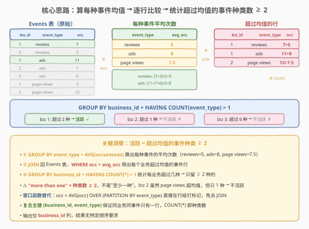
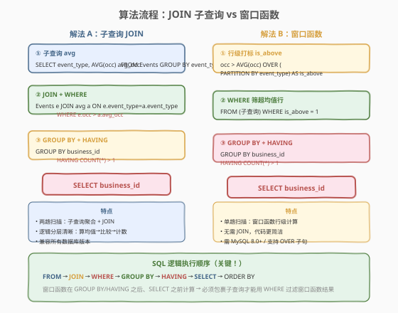
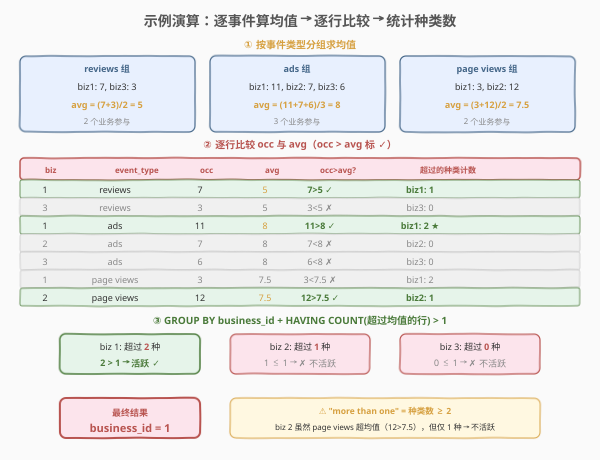

# 查询活跃业务

- **题目名称**：查询活跃业务
- **链接**：[1126. 查询活跃业务](https://leetcode.cn/problems/active-businesses/)
- **难度**：中等
- **标签**：SQL、子查询 JOIN、窗口函数、GROUP BY、HAVING、AVG 聚合、分组均值比较

## 1. 题目概述

给定 `Events` 表，每行记录某个业务（`business_id`）的某类事件（`event_type`）发生的次数（`occurences`）。编写 SQL 查询，找出所有**活跃业务**。

> **活跃业务的定义**：一个业务如果在**多于一种**事件类型上的发生次数**严格大于**该事件类型在所有业务中的平均发生次数，则该业务是活跃的。

**表结构**：

```text
Table: Events
+---------------+---------+
| Column Name   | Type    |
+---------------+---------+
| business_id   | int     |  ← 主键之一
| event_type    | varchar |  ← 主键之一
| occurences    | int     |
+---------------+---------+
```

> 💡 **关键约束**：`(business_id, event_type)` 是复合主键——同一业务对同一事件类型只有一行记录，但**一个业务可以有多种事件类型**（即一个 `business_id` 对应多行）。注意列名 `occurences` 是题目原拼写（少了一个 `r`），SQL 中需保持一致。

**示例 1**：

```text
输入：
Events 表:
+-------------+------------+------------+
| business_id | event_type | occurences |
+-------------+------------+------------+
| 1           | reviews    | 7          |
| 3           | reviews    | 3          |
| 1           | ads        | 11         |
| 2           | ads        | 7          |
| 3           | ads        | 6          |
| 1           | page views | 3          |
| 2           | page views | 12         |
+-------------+------------+------------+

输出：
+-------------+
| business_id |
+-------------+
| 1           |
+-------------+
```

**解释**：

| 事件类型 | 参与业务 | 平均次数 | 超过均值的业务 |
|----------|----------|----------|----------------|
| reviews | biz 1 (7), biz 3 (3) | $(7+3)/2=5$ | biz 1: $7>5$ ✓ |
| ads | biz 1 (11), biz 2 (7), biz 3 (6) | $(11+7+6)/3=8$ | biz 1: $11>8$ ✓ |
| page views | biz 1 (3), biz 2 (12) | $(3+12)/2=7.5$ | biz 2: $12>7.5$ ✓ |

- **biz 1**：在 reviews 和 ads 两种事件上超过均值 → 超过 **2** 种 → **活跃** ✓
- **biz 2**：仅 page views 一种超过均值 → 超过 **1** 种 → 不满足"多于一种" → **不活跃** ✗
- **biz 3**：没有任何事件超过均值 → 超过 **0** 种 → **不活跃** ✗

**约束条件**：

- `Events` 表的复合主键为 `(business_id, event_type)`
- `occurences` 为正整数
- 结果只输出 `business_id` 列，无特定顺序要求

> 💡 本题的核心难点不在"算均值"或"比较大小"，而在**审题**：活跃的定义是"**多于一种**（more than one）"事件超过均值，即超过均值的事件种类数 $\geq 2$——不是"至少一种"。biz 2 虽有一种事件超均值，但仍不活跃。这一"门槛"决定了最终必须用 `HAVING COUNT(*) > 1` 而非 `EXISTS` 或简单 `WHERE`。

---

## 2. 解题思路

### 2.1 暴力思路：逐业务逐事件比较

对每个 `business_id`，遍历其所有事件类型行，逐行判断 `occurences` 是否大于该事件类型的全局均值。若超均值的行数 $\geq 2$，则该业务活跃。

```text
for each business_id:
    exceed_count = 0
    for each (event_type, occurences) of this business:
        avg = AVG(occurences) among all businesses for this event_type
        if occurences > avg:
            exceed_count += 1
    if exceed_count > 1:
        emit business_id
```

但**纯 SQL 没有显式循环语句**——需换成集合式表达。关键转换有两步：

1. **"该事件类型的全局均值"**：这是按 `event_type` 分组的聚合值，需先 `GROUP BY event_type` 算出均值，再与每行比较。
2. **"多于一种"**：需对每个业务统计超均值的行数，再用 `HAVING COUNT(*) > 1` 过滤。

> ⚠️ **均值在哪里算？** 均值是按 `event_type` 分组的，与最终按 `business_id` 分组**不是同一维度**。这正是本题需要子查询或窗口函数的根源——两轮分组无法在一个 `GROUP BY` 中完成。

### 2.2 核心观察：子查询算均值 → JOIN 回原表 → HAVING 计数



**问题拆解为三步**：

**第 1 步：算每种事件类型的平均次数**

$$\text{avg\_occ}(t) = \frac{\sum_{r \in R_t} \text{occurences}(r)}{|R_t|}, \quad R_t = \{r \mid r.\text{event\_type} = t\}$$

用子查询 `SELECT event_type, AVG(occurences) AS avg_occ FROM Events GROUP BY event_type` 得到每类事件的均值表。

**第 2 步：JOIN 回原表，筛出超过均值的行**

将均值表与 `Events` 按 `event_type` JOIN，条件 `e.occurences > a.avg_occ` 筛出每个业务在哪些事件上超过均值。

**第 3 步：按业务分组，HAVING 计数**

对筛选结果按 `business_id` 分组，`HAVING COUNT(*) > 1` 只保留超过均值的事件种类数 $\geq 2$ 的业务。

> 💡 **为什么 `COUNT(*)` 等于"事件种类数"？** 因为复合主键 `(business_id, event_type)` 保证同一业务对同一事件类型只有一行。所以一个业务在筛选结果中的行数 = 它超过均值的事件种类数。`COUNT(*)` 直接就是种类计数，无需 `COUNT(DISTINCT)`。

> ⚠️ **"more than one" = `> 1`，不是 `>= 1`**：这是本题最易错的审题点。biz 2 有 1 种事件（page views）超过均值，`COUNT(*) = 1`，`HAVING COUNT(*) > 1` 判定为不活跃——正确。若误写成 `>= 1`，会把 biz 2 也输出，结果错误。

### 2.3 算法流程图



**解法 A（子查询 JOIN）逻辑执行步骤**：

| 步骤 | 子句 | 作用 |
|------|------|------|
| ① | 子查询 `GROUP BY event_type` + `AVG(occurences)` | 算每种事件类型的平均次数 |
| ② | `JOIN ... ON e.event_type = a.event_type` | 均值表与原表按事件类型拼接 |
| ② | `WHERE e.occurences > a.avg_occ` | 只留超过均值的行 |
| ③ | `GROUP BY business_id` | 按业务分组 |
| ③ | `HAVING COUNT(*) > 1` | 只留超过均值种类 ≥ 2 的业务 |
| ④ | `SELECT business_id` | 输出业务 ID |

**解法 B（窗口函数）替代路径**：

用 `AVG(occurences) OVER (PARTITION BY event_type)` 在行级直接算出同组均值，免去 JOIN。表达式 `occurences > AVG(occurences) OVER (PARTITION BY event_type)` 产生布尔标记 `is_above`，外层 `WHERE is_above = 1` 筛选后再 `GROUP BY + HAVING`。

> 💡 **窗口函数为什么也要包子查询？** 窗口函数在 `GROUP BY`/`HAVING` 之后、`SELECT` 之前计算，是行级操作。`WHERE` 执行时窗口函数尚未计算，所以不能直接写 `WHERE occurences > AVG(...) OVER (...)`。必须先在子查询中算好 `is_above` 标记，外层再 `WHERE` 筛选。

### 2.4 示例演算

以示例数据为例，逐步演示三步执行过程：



**步骤 ①：按事件类型分组求均值**

| 事件类型 | 参与业务的 occurences | 平均次数 |
|----------|----------------------|----------|
| reviews | biz 1: 7, biz 3: 3 | $(7+3)/2 = 5$ |
| ads | biz 1: 11, biz 2: 7, biz 3: 6 | $(11+7+6)/3 = 8$ |
| page views | biz 1: 3, biz 2: 12 | $(3+12)/2 = 7.5$ |

**步骤 ②：逐行比较 occurences 与 avg**

| biz | event_type | occ | avg | occ > avg? | 该业务累计超过种类 |
|-----|------------|-----|-----|-----------|-------------------|
| 1 | reviews | 7 | 5 | $7>5$ ✓ | biz 1: 1 |
| 3 | reviews | 3 | 5 | $3<5$ ✗ | biz 3: 0 |
| 1 | ads | 11 | 8 | $11>8$ ✓ | biz 1: **2** ★ |
| 2 | ads | 7 | 8 | $7<8$ ✗ | biz 2: 0 |
| 3 | ads | 6 | 8 | $6<8$ ✗ | biz 3: 0 |
| 1 | page views | 3 | 7.5 | $3<7.5$ ✗ | biz 1: 2 |
| 2 | page views | 12 | 7.5 | $12>7.5$ ✓ | biz 2: 1 |

**步骤 ③：GROUP BY business_id + HAVING COUNT(*) > 1**

| business_id | 超过均值的事件种类数 | 是否 > 1? | 活跃? |
|-------------|---------------------|-----------|-------|
| 1 | 2（reviews, ads） | $2 > 1$ ✓ | **活跃** ✓ |
| 2 | 1（page views） | $1 \leq 1$ ✗ | 不活跃 ✗ |
| 3 | 0 | $0 \leq 1$ ✗ | 不活跃 ✗ |

最终输出：`business_id = 1`。

> 💡 **观察 biz 2**：它在 page views 上以 12 远超均值 7.5，但只有这**一种**事件超均值。"多于一种"的门槛把它挡在了活跃之外。这揭示了题目定义的严格性——**单点突出不算活跃，必须在多种事件上都表现突出**。

---

## 3. 参考代码

### SQL（解法 A：子查询 JOIN，推荐）

```sql
SELECT business_id
FROM Events e
JOIN (
    SELECT event_type, AVG(occurences) AS avg_occ
    FROM Events
    GROUP BY event_type
) a ON e.event_type = a.event_type
WHERE e.occurences > a.avg_occ
GROUP BY business_id
HAVING COUNT(*) > 1;
```

> 💡 **写法要点**：
> - 子查询 `a` 用 `GROUP BY event_type` + `AVG(occurences)` 算出每种事件类型的平均次数。
> - `JOIN ... ON e.event_type = a.event_type` 把均值拼回每行——每个业务的事件行都带上对应事件类型的均值。
> - `WHERE e.occurences > a.avg_occ` 只留超过均值的行。
> - `GROUP BY business_id` + `HAVING COUNT(*) > 1` 只保留超过均值事件种类数 $\geq 2$ 的业务。
> - 复合主键保证 `COUNT(*)` = 事件种类数，无需 `DISTINCT`。

### SQL（解法 B：窗口函数，更简洁）

```sql
SELECT business_id
FROM (
    SELECT business_id,
           occurences > AVG(occurences) OVER (PARTITION BY event_type) AS is_above
    FROM Events
) t
WHERE is_above = 1
GROUP BY business_id
HAVING COUNT(*) > 1;
```

> 💡 **写法要点**：
> - `AVG(occurences) OVER (PARTITION BY event_type)` 在行级直接算出同事件类型的均值，无需 JOIN。
> - `occurences > ... AS is_above` 产生布尔标记（MySQL 中 TRUE=1, FALSE=0）。
> - 外层 `WHERE is_above = 1` 筛出超均值的行，再 `GROUP BY + HAVING COUNT(*) > 1`。
> - ✓ 比 JOIN 版更简洁，单趟扫描行级计算；但需 MySQL 8.0+ 支持 `OVER` 子句。

### Python（pandas）

```python
import pandas as pd

def active_businesses(events: pd.DataFrame) -> pd.DataFrame:
    avg_per_type = events.groupby('event_type')['occurences'].transform('mean')
    events['is_above'] = events['occurences'] > avg_per_type
    exceed = events[events['is_above']]
    counts = exceed.groupby('business_id').size()
    active = counts[counts > 1].index.tolist()
    return pd.DataFrame({'business_id': active})
```

> 💡 **pandas 对照**：`groupby('event_type')['occurences'].transform('mean')` 对应 SQL 的 `AVG(occurences) OVER (PARTITION BY event_type)`——`.transform('mean')` 把分组均值广播回每行，与窗口函数语义完全一致。`events['occurences'] > avg_per_type` 对应行级比较，`groupby('business_id').size()` 对应 `GROUP BY business_id` + `COUNT(*)`，最后 `counts > 1` 对应 `HAVING COUNT(*) > 1`。

---

## 4. 复杂度分析

| 维度 | 解法 A（子查询 JOIN） | 解法 B（窗口函数） | pandas |
|------|----------------------|-------------------|--------|
| **时间** | $O(n)$ | $O(n)$ | $O(n)$ |
| **空间** | $O(t)$ | $O(n)$ | $O(n)$ |
| **扫描次数** | 2 次（子查询聚合 + JOIN 筛选） | 1 次（行级窗口计算） | 1 次（transform + 筛选） |
| **推荐度** | ✓ **首选**，兼容性好 | ✓ 备选，更简洁 | △ 仅用于离线分析 |

> - $n$ = `Events` 表行数，$t$ = 不同 `event_type` 数（通常很小）
> - 时间 $O(n)$：子查询 `GROUP BY` 单趟哈希聚合 $O(n)$；`JOIN` 按 `event_type` 哈希匹配 $O(n)$；窗口函数 `PARTITION BY` 单趟分区计算 $O(n)$
> - 空间：解法 A 物化均值表 $O(t)$（很小）；解法 B 窗口函数排序缓冲 $O(n)$
> - **解法 A 常数因子略大**（两趟扫描），但 $t$ 很小时均值表极小，JOIN 开销可忽略；解法 B 单趟更优，但需数据库支持窗口函数

> ⚠️ SQL 复杂度取决于**执行计划与索引**：若 `event_type` 有索引，`GROUP BY event_type` 可利用索引有序性避免排序。MySQL 优化器可能将解法 A 的子查询物化后与外层 JOIN 合并为一次扫描。面试中说明"子查询聚合 + JOIN 两趟 $O(n)$，或窗口函数单趟 $O(n)$"即可。

---

## 5. 扩展：HAVING vs EXISTS 的选择策略

### 5.1 "多于一种"的三种表达方式

本题"超过均值的事件种类数 > 1"有三种 SQL 范式：

| 范式 | 写法 | 适用场景 |
|------|------|----------|
| **HAVING COUNT** | `GROUP BY business_id HAVING COUNT(*) > 1` | ✓ 本题推荐，简洁直观 |
| **自连接 EXISTS** | `WHERE EXISTS(子查询1) AND EXISTS(子查询2)` | ✗ 无法泛化"超过 N 种"，写法冗长 |
| **相关子查询** | `WHERE (SELECT COUNT(*) FROM ...) > 1` | △ 可读性差，性能差 |

> 💡 **HAVING COUNT 的优势**：`COUNT(*) > 1` 一步表达"多于一种"，与阈值 N 无关——把 `1` 换成 `2` 就变成"多于两种"。而 EXISTS 需要为每种事件写一个 EXISTS 子句，无法泛化。这是 `HAVING + 聚合` 相对 `EXISTS` 的结构性优势。

### 5.2 从 550/570 到 1126：分组比较的三层进阶

| 题号 | 要求 | 核心范式 | 阈值 |
|------|------|----------|------|
| [550. 游戏玩法分析 IV](https://leetcode.cn/problems/game-play-analysis-iv/) | 首登次日复玩率 | `COUNT(条件) / COUNT(*)` + 日期自连接 | 比率 |
| [570. 至少有 5 名直接下属的经理](https://leetcode.cn/problems/managers-with-at-least-5-direct-reports/) | 分组计数 + 阈值过滤 | `GROUP BY manager_id HAVING COUNT(*) >= 5` | $\geq 5$ |
| **1126** | 超均值事件种类 > 1 | 子查询均值 + JOIN + `HAVING COUNT(*) > 1` | $> 1$ |

> 💡 这三题共享"分组聚合 + 阈值过滤"的骨架。1126 的独特之处在于**两轮分组**（先按 `event_type` 算均值，再按 `business_id` 计数）——均值和计数不在同一分组维度，必须用子查询或窗口函数桥接。

### 5.3 变体：如果把"more than one"改成"at least one"

若题目改为"至少一种事件超过均值即活跃"（`>= 1`），则不需要 `HAVING COUNT`——只需 `SELECT DISTINCT business_id` 从筛选结果中取去重即可：

```sql
SELECT DISTINCT business_id
FROM Events e
JOIN (
    SELECT event_type, AVG(occurences) AS avg_occ
    FROM Events GROUP BY event_type
) a ON e.event_type = a.event_type
WHERE e.occurences > a.avg_occ;
```

> 💡 **`HAVING COUNT > 1` vs `DISTINCT`**：阈值 `> 0`（至少一种）用 `DISTINCT` 去重即可；阈值 `> 1`（多于一种）必须用 `HAVING COUNT` 计数。理解这一区别，所有"分组比较 + 阈值"题都能灵活应对。

---

## 6. 面试要点

1. **"more than one" 到底是 `> 1` 还是 `>= 1`？**

   > 是 `> 1`，即超过均值的事件种类数 $\geq 2$。"more than one" 字面意思就是"多于一种"，1 种不算。示例中 biz 2 有 1 种事件（page views）超均值，但不满足"多于一种"而不活跃。若误用 `HAVING COUNT(*) >= 1`，会把 biz 2 也输出。面试中务必强调这一审题细节——这是本题最大的坑。

2. **为什么 `COUNT(*)` 等于事件种类数，不需要 `COUNT(DISTINCT event_type)`？**

   > 复合主键 `(business_id, event_type)` 保证同一业务对同一事件类型只有一行。在 `WHERE occurences > avg_occ` 筛选后，同一业务的不同行一定对应不同 `event_type`。所以 `COUNT(*)` = `COUNT(DISTINCT event_type)` = 事件种类数。加 `DISTINCT` 不会错但多余。面试答："主键保证无重复，`COUNT(*)` 即种类数"。

3. **子查询 JOIN 和窗口函数两种解法有什么区别？**

   > 子查询 JOIN 需两趟扫描：先 `GROUP BY event_type` 算均值，再 `JOIN` 回原表比较；逻辑分层清晰，兼容所有数据库版本。窗口函数 `AVG(occ) OVER (PARTITION BY event_type)` 在行级直接算均值，单趟扫描完成，代码更简洁；但需 MySQL 8.0+ 支持。两者复杂度均为 $O(n)$，面试中推荐先写子查询 JOIN（兼容性好、易解释），再提窗口函数作为优化。

4. **窗口函数为什么必须包在子查询里？**

   > 窗口函数在 SQL 逻辑执行顺序中位于 `GROUP BY`/`HAVING` 之后、`SELECT` 之前，是行级操作。`WHERE` 子句在窗口函数之前执行，所以不能直接写 `WHERE occurences > AVG(...) OVER (...)`。必须先在子查询中计算 `is_above` 标记，外层再 `WHERE is_above = 1` 筛选。这是所有"窗口函数结果 + 行筛选"题目的通用模式。

5. **两轮分组为什么不能在一个 `GROUP BY` 中完成？**

   > 均值按 `event_type` 分组，最终计数按 `business_id` 分组——两者不是同一维度。一个 `GROUP BY` 只能按一组键聚合，无法同时按 `event_type` 算均值又按 `business_id` 计数。所以必须用子查询（先算均值再 JOIN 回来）或窗口函数（行级算均值不改变分组维度）来桥接两轮分组。这是本题需要子查询/窗口函数的根本原因。

> 💡 **一句话总结**：1126 的灵魂是「**两轮分组 + 阈值计数**」——第一轮按 `event_type` 算 `AVG(occurences)`，JOIN 回原表筛出 `occ > avg` 的行；第二轮按 `business_id` 分组 `HAVING COUNT(*) > 1` 筛出"多于一种"事件超均值的活跃业务。最大审题坑："more than one" = 种类数 $\geq 2$，不是"至少一种"。

---

## 7. 同类练习题

- [570. 至少有 5 名直接下属的经理](https://leetcode.cn/problems/managers-with-at-least-5-direct-reports/)：`GROUP BY manager_id HAVING COUNT(*) >= 5` 分组计数 + 阈值过滤，与 1126 的 `HAVING COUNT(*) > 1` 同骨架，区别仅在阈值与无均值比较
- [550. 游戏玩法分析 IV](https://leetcode.cn/problems/game-play-analysis-iv/)：`COUNT(条件) / COUNT(*)` 分组比率计算 + 日期自连接，与 1126 共享"分组聚合 + 条件筛选"思路，但比较维度是比率而非计数
- [1112. 每位学生的最高成绩](../1101-1200/1112_每位学生的最高成绩.md)：`ROW_NUMBER() OVER (PARTITION BY student_id ORDER BY ...)` 分组取最值行，与 1126 的 `AVG() OVER (PARTITION BY event_type)` 同为窗口函数分组应用，对比"分组取最值"与"分组比均值"
- [184. 部门工资最高的员工](https://leetcode.cn/problems/department-highest-salary/)：`GROUP BY department + MAX(salary)` + JOIN 回原表定位行，与 1126 的"子查询聚合 + JOIN 回原表"同骨架，对比"分组取最值所在行"与"分组均值比较"
- [596. 超过 5 名学生的课](https://leetcode.cn/problems/classes-with-at-least-5-students/)：`GROUP BY class HAVING COUNT(*) >= 5` 单层分组计数 + 阈值，是 1126 去掉均值比较的简化版，适合对照理解 `HAVING COUNT` 骨架
