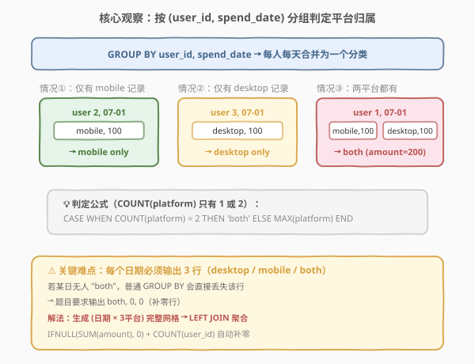
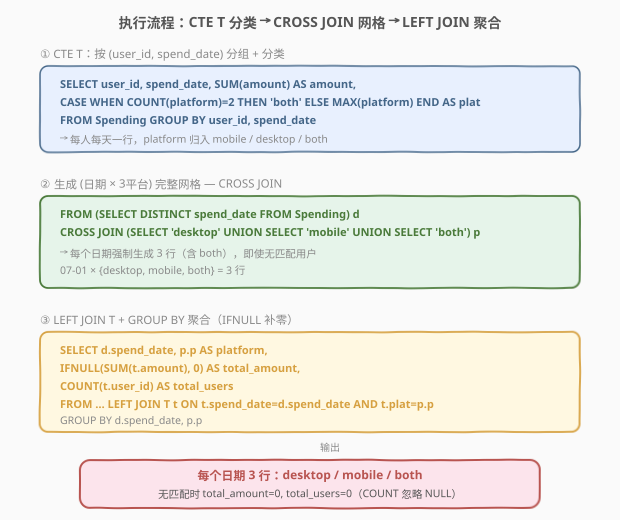
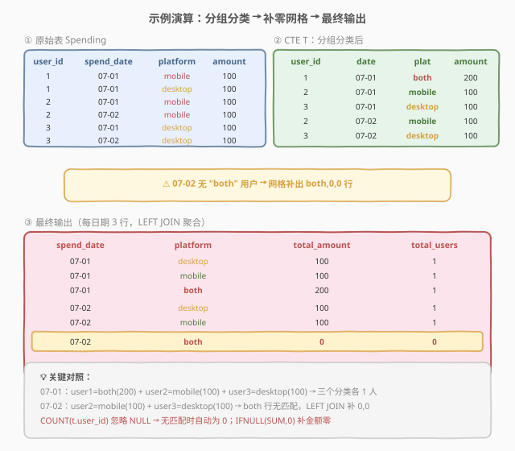

# 用户购买平台

- **题目名称**：用户购买平台
- **链接**：[1127. 用户购买平台](https://leetcode.cn/problems/user-purchase-platform/)
- **难度**：困难
- **标签**：SQL、CTE、GROUP BY、CASE 分类、CROSS JOIN 补网格、LEFT JOIN、IFNULL、COUNT 忽略 NULL

## 1. 题目概述

给定 `Spending` 表，记录用户在购物网站（同时有桌面端和移动端 App）上的消费历史。编写 SQL 查询，统计**每个日期**使用 **mobile only**、**desktop only**、**both**（两端都用）三类平台的**用户总数**与**消费总额**。

**表结构**：

```text
Table: Spending
+-------------+---------+
| Column Name | Type    |
+-------------+---------+
| user_id     | int     |
| spend_date  | date    |
| platform    | enum    |  ← ('desktop', 'mobile')
| amount      | int     |
+-------------+---------+
```

> 💡 **关键约束**：`(user_id, spend_date, platform)` 是复合主键——同一用户同一天在同一平台最多一条记录。但**同一用户同一天可以同时有 desktop 和 mobile 两条记录**（即「both」）。`platform` 是 ENUM，只有 `'desktop'` 和 `'mobile'` 两种取值，因此对 `(user_id, spend_date)` 分组后 `COUNT(platform)` 只能是 1 或 2。

**示例 1**：

```text
输入：
Spending 表:
+---------+------------+----------+--------+
| user_id | spend_date | platform | amount |
+---------+------------+----------+--------+
| 1       | 2019-07-01 | mobile   | 100    |
| 1       | 2019-07-01 | desktop  | 100    |
| 2       | 2019-07-01 | mobile   | 100    |
| 2       | 2019-07-02 | mobile   | 100    |
| 3       | 2019-07-01 | desktop  | 100    |
| 3       | 2019-07-02 | desktop  | 100    |
+---------+------------+----------+--------+

输出：
+------------+----------+--------------+-------------+
| spend_date | platform | total_amount | total_users |
+------------+----------+--------------+-------------+
| 2019-07-01 | desktop  | 100          | 1           |
| 2019-07-01 | mobile   | 100          | 1           |
| 2019-07-01 | both     | 200          | 1           |
| 2019-07-02 | desktop  | 100          | 1           |
| 2019-07-02 | mobile   | 100          | 1           |
| 2019-07-02 | both     | 0            | 0           |
+------------+----------+--------------+-------------+
```

**解释**：

- `2019-07-01`：用户 1 用了 **both**（desktop 100 + mobile 100 = 200），用户 2 用了 **mobile only**（100），用户 3 用了 **desktop only**（100）→ 三个分类各 1 人
- `2019-07-02`：用户 2 用了 **mobile only**（100），用户 3 用了 **desktop only**（100），**无人用 both** → both 行输出 `0, 0`

**约束条件**：

- 复合主键 `(user_id, spend_date, platform)`
- `platform` 取值仅 `'desktop'` / `'mobile'`
- 每个日期必须输出 3 行（`desktop` / `mobile` / `both`），**即使某分类用户数为 0 也要补零行**
- 结果任意顺序

> ⚠️ 本题是「分组分类 + 补零行」的招牌题。难点不在分类逻辑，而在**每个日期强制输出 3 行**——当某日无人使用「both」时，普通 `GROUP BY` 会直接丢失该行，而题目要求输出 `both, 0, 0`。这需要「生成 (日期 × 平台) 完整网格 + LEFT JOIN 聚合」的模式，与 [1097. 游戏玩法分析 V](https://leetcode.cn/problems/game-play-analysis-v/)、[1174. 即时食物配送 II](https://leetcode.cn/problems/immediate-food-delivery-ii/) 的「补缺失行」思路同源。

---

## 2. 解题思路

### 2.1 暴力思路：分三类 UNION ALL

最直觉的思路是分三种情况分别查询再 `UNION ALL`：

```text
查询 A: desktop only 用户 = 同日有 desktop 但无 mobile 的用户
查询 B: mobile only 用户  = 同日有 mobile 但无 desktop 的用户
查询 C: both 用户         = 同日有 desktop 且有 mobile 的用户
对每个查询 GROUP BY spend_date 聚合 → UNION ALL
```

但这个思路有个**致命缺陷**：若某日无人使用「both」，查询 C 在该日期无分组，`UNION ALL` 后该日期会缺 `both` 行——而题目要求输出 `both, 0, 0`。要修补就得给每个查询额外 `LEFT JOIN` 日期表补零，三个子查询都这么搞会非常啰嗦。

> ⚠️ **核心难点转换**：「补零行」不是分类的问题，是**结果集形状**的问题。只要先确定「每日期 × 3 平台」的完整网格，再用 `LEFT JOIN` 把分类后的数据挂上去，`IFNULL` + `COUNT` 自然补零——一个机制解决所有分类的补零，比分三类 `UNION ALL` 优雅得多。

### 2.2 核心观察：CASE 分类 + CROSS JOIN 补网格 + LEFT JOIN 聚合



**问题拆成两步**：

**第一步：分类**——把原始行按 `(user_id, spend_date)` 分组，每人每天合并成一行，判定平台归属：

$$\text{plat}(u, d) = \begin{cases} \text{'both'} & \text{若 } \text{COUNT}(\text{platform}) = 2 \\ \text{MAX}(\text{platform}) & \text{若 } \text{COUNT}(\text{platform}) = 1 \end{cases}$$

- `COUNT(platform) = 2`：该用户当天有 desktop 和 mobile 两条记录 → `both`，金额相加
- `COUNT(platform) = 1`：该用户当天只有一条记录 → 用 `MAX(platform)` 取出那个唯一的平台（`MAX` 在单值时返回该值，兼容 `ONLY_FULL_GROUP_BY`）

> 💡 **为什么用 `MAX(platform)` 而非直接写 `platform`？** 当 `GROUP BY user_id, spend_date` 后，`platform` 不在 `GROUP BY` 中也不在聚合函数中。在 MySQL `ONLY_FULL_GROUP_BY` 模式下会报错。`MAX(platform)` 是合法聚合：`COUNT = 1` 时 `MAX` 返回唯一值，语义等价但语法安全。承接 [1112. 每位学生的最高成绩](1112_每位学生的最高成绩.md) 中 `MAX(grade)` 取分组标量的同类技巧。

**第二步：补网格**——生成 `(每个日期 × {desktop, mobile, both})` 的完整网格，`LEFT JOIN` 分类结果，`GROUP BY` 聚合：

- `CROSS JOIN` 让每个日期强制出现 3 行
- `LEFT JOIN T ON spend_date 和 plat 匹配`：无匹配时 `t.amount` / `t.user_id` 为 NULL
- `IFNULL(SUM(t.amount), 0)`：无匹配时 SUM 为 NULL → 补 0
- `COUNT(t.user_id)`：`COUNT(列)` 忽略 NULL → 无匹配时为 0

> 💡 **`COUNT(*)` vs `COUNT(t.user_id)` 的关键区别**：`COUNT(*)` 统计行数（含 LEFT JOIN 的 NULL 行），会数出 1；`COUNT(t.user_id)` 只统计非 NULL 值，无匹配时为 0。这里必须用 `COUNT(t.user_id)` 才能正确补零——这是所有「LEFT JOIN 补零 + 计数」题的通用陷阱，与 [1097. 游戏玩法分析 V](https://leetcode.cn/problems/game-play-analysis-v/) 同理。

### 2.3 算法流程图



**逻辑执行步骤**：

| 步骤 | 子句 | 作用 |
|------|------|------|
| ① | `CTE T`：`GROUP BY user_id, spend_date` + `CASE` 分类 | 每人每天合并一行，归入 mobile / desktop / both |
| ② | `CROSS JOIN`：去重日期 × {desktop, mobile, both} | 生成完整网格，每日期 3 行 |
| ③ | `LEFT JOIN T`：`ON spend_date, plat` | 挂载分类数据，无匹配为 NULL |
| ④ | `GROUP BY spend_date, platform` | 按日期 × 平台聚合 |
| ⑤ | `IFNULL(SUM(t.amount), 0)` | 金额补零 |
| ⑥ | `COUNT(t.user_id)` | 用户数补零（忽略 NULL） |

> 💡 **CTE 的执行顺序**：`WITH T AS (...)` 先物化分类结果，主查询的 `CROSS JOIN` 生成网格，`LEFT JOIN T` 挂载数据，最后 `GROUP BY + 聚合`。CTE 让「分类」与「补零聚合」解耦——分类逻辑写一次，补零机制对所有 3 个平台统一生效，无需为每个平台单独写补零逻辑。

### 2.4 示例演算

以示例数据为例，观察分类 CTE 与补零网格的协同：



**CTE T 分组分类结果**：

| user_id | spend_date | plat | amount | 说明 |
|---------|------------|------|--------|------|
| 1 | 2019-07-01 | **both** | 200 | desktop 100 + mobile 100，COUNT=2 → both |
| 2 | 2019-07-01 | **mobile** | 100 | 仅 mobile，COUNT=1 → MAX=mobile |
| 3 | 2019-07-01 | **desktop** | 100 | 仅 desktop，COUNT=1 → MAX=desktop |
| 2 | 2019-07-02 | **mobile** | 100 | 仅 mobile |
| 3 | 2019-07-02 | **desktop** | 100 | 仅 desktop |

> ⚠️ **注意 2019-07-02 缺「both」**：CTE T 中 07-02 只有 mobile 和 desktop 两行，无 both。若直接对 T 做 `GROUP BY spend_date, plat`，07-02 只会输出 2 行，丢失 `both, 0, 0`。`CROSS JOIN` 网格保证了 07-02 的 both 行存在，`LEFT JOIN` 匹配不上 → `IFNULL(0)` + `COUNT(NULL)=0`，补出 `both, 0, 0`。

---

## 3. 参考代码

### SQL（解法 A：CTE + CROSS JOIN 网格 + LEFT JOIN，推荐）

```sql
WITH T AS (
    SELECT
        user_id,
        spend_date,
        SUM(amount) AS amount,
        CASE
            WHEN COUNT(platform) = 2 THEN 'both'
            ELSE MAX(platform)
        END AS plat
    FROM Spending
    GROUP BY user_id, spend_date
)
SELECT
    d.spend_date,
    p.p AS platform,
    IFNULL(SUM(t.amount), 0) AS total_amount,
    COUNT(t.user_id) AS total_users
FROM (SELECT DISTINCT spend_date FROM Spending) d
CROSS JOIN (
    SELECT 'desktop' AS p
    UNION
    SELECT 'mobile'
    UNION
    SELECT 'both'
) p
LEFT JOIN T t
    ON t.spend_date = d.spend_date
   AND t.plat = p.p
GROUP BY d.spend_date, p.p;
```

> 💡 **写法要点**：
> - **CTE T**：`GROUP BY user_id, spend_date` 把每人每天合并成一行；`CASE WHEN COUNT(platform) = 2 THEN 'both' ELSE MAX(platform) END` 分类——`MAX(platform)` 兼容 `ONLY_FULL_GROUP_BY`，单值时返回唯一平台。
> - **CROSS JOIN 网格**：`(SELECT DISTINCT spend_date) d CROSS JOIN (3 平台) p` 生成每日期 3 行的完整骨架，这是补零行的关键。
> - **LEFT JOIN + IFNULL + COUNT(user_id)**：无匹配时 `t.amount` 为 NULL → `IFNULL(SUM, 0)` 补金额零；`COUNT(t.user_id)` 忽略 NULL → 补用户数零。⚠️ 必须用 `COUNT(t.user_id)` 而非 `COUNT(*)`。
> - ✓ **最优雅**：分类与补零解耦，一个 LEFT JOIN 机制覆盖所有 3 个平台的补零。

### SQL（解法 B：UNION ALL 三分类 + 日期补零）

```sql
SELECT s.spend_date, 'desktop' AS platform,
       IFNULL(SUM(s.amount), 0) AS total_amount,
       COUNT(s.user_id) AS total_users
FROM (SELECT DISTINCT spend_date FROM Spending) d
CROSS JOIN (SELECT 'desktop' AS p) base
LEFT JOIN Spending s
    ON s.spend_date = d.spend_date
   AND s.platform = 'desktop'
   AND s.user_id NOT IN (
       SELECT user_id FROM Spending s2
       WHERE s2.spend_date = s.spend_date AND s2.platform = 'mobile'
   )
GROUP BY s.spend_date
UNION ALL
SELECT s.spend_date, 'mobile' AS platform,
       IFNULL(SUM(s.amount), 0), COUNT(s.user_id)
FROM (SELECT DISTINCT spend_date FROM Spending) d
CROSS JOIN (SELECT 'mobile' AS p) base
LEFT JOIN Spending s
    ON s.spend_date = d.spend_date
   AND s.platform = 'mobile'
   AND s.user_id NOT IN (
       SELECT user_id FROM Spending s2
       WHERE s2.spend_date = s.spend_date AND s2.platform = 'desktop'
   )
GROUP BY s.spend_date
UNION ALL
SELECT b.spend_date, 'both' AS platform,
       IFNULL(SUM(b.total), 0), COUNT(b.user_id)
FROM (SELECT DISTINCT spend_date FROM Spending) d
CROSS JOIN (SELECT 'both' AS p) base
LEFT JOIN (
    SELECT user_id, spend_date, SUM(amount) AS total
    FROM Spending
    GROUP BY user_id, spend_date
    HAVING COUNT(platform) = 2
) b ON b.spend_date = d.spend_date
GROUP BY b.spend_date;
```

> ⚠️ 解法 B 将三类分别查询再 `UNION ALL`，每个子查询都需 `CROSS JOIN` 日期表补零——三倍啰嗦且 `NOT IN` 子查询效率低。**仅作对比，不推荐**。它的存在恰好反衬解法 A「先分类再统一补零」的优雅：分类一次 + 补零一次，而非补零三次。

### Python（pandas）

```python
import pandas as pd

def user_purchase_platform(spending: pd.DataFrame) -> pd.DataFrame:
    grouped = (
        spending.groupby(['user_id', 'spend_date'], as_index=False)
        .agg(amount=('amount', 'sum'),
             cnt=('platform', 'count'),
             single=('platform', 'max'))
    )
    grouped['platform'] = grouped.apply(
        lambda r: 'both' if r['cnt'] == 2 else r['single'], axis=1
    )

    dates = spending[['spend_date']].drop_duplicates()
    platforms = pd.DataFrame({'platform': ['desktop', 'mobile', 'both']})
    grid = dates.merge(platforms, how='cross')

    result = (
        grid.merge(grouped, on=['spend_date', 'platform'], how='left')
            .groupby(['spend_date', 'platform'], as_index=False)
            .agg(total_amount=('amount', 'sum'),
                 total_users=('user_id', 'count'))
    )
    result['total_amount'] = result['total_amount'].fillna(0).astype(int)
    result['total_users'] = result['total_users'].fillna(0).astype(int)
    return result[['spend_date', 'platform', 'total_amount', 'total_users']]
```

> 💡 **pandas 对照**：`groupby + agg` 对应 CTE T 的分类；`merge(how='cross')` 生成日期 × 平台网格对应 `CROSS JOIN`；`merge(how='left')` 对应 `LEFT JOIN`；`groupby + count`（pandas 的 `count` 默认忽略 NaN）对应 `COUNT(t.user_id)` 忽略 NULL；`fillna(0)` 对应 `IFNULL`。思路与 SQL 解法 A 完全同构。

---

## 4. 复杂度分析

| 维度 | 复杂度 | 说明 |
|------|--------|------|
| **时间（CTE + CROSS JOIN）** | $O(n \log n)$ | CTE T 的 `GROUP BY` 排序 $O(n \log n)$；网格大小 $O(d \cdot 3)$，$d$ = 不同日期数；`LEFT JOIN` 匹配 $O(n)$（主键索引）；最终 `GROUP BY` $O(n \log n)$ |
| **空间** | $O(n + d)$ | CTE T 物化 $O(n)$（每人每天一行，$\le n$ 行）；网格 $O(d)$ |
| **结果行数** | $O(d)$ | 每日期 3 行，共 $3d$ 行 |

> ⚠️ SQL 复杂度取决于**执行计划与索引**：`(user_id, spend_date, platform)` 是主键（MySQL 聚簇索引），`GROUP BY user_id, spend_date` 可利用主键有序性加速分组。`CROSS JOIN` 生成 $3d$ 行（$d$ 通常远小于 $n$），开销可忽略。解法 B 的 `NOT IN` 子查询可能退化为 $O(n^2)$（无索引时），故解法 A 明显更优。面试中说明「主键索引加速分组 + CROSS JOIN 网格仅 $O(d)$ + LEFT JOIN 走索引 $O(n)$」即可。

---

## 5. 扩展：SQL「补零行」的三种范式

本题的核心难点是「结果集每日期必须有 3 行，即使某分类为 0」。这种「补缺失行」在 SQL 中有三种通用范式：

### 5.1 范式对比

| 范式 | 实现 | 适用场景 | 示例 |
|------|------|----------|------|
| **CROSS JOIN 网格** | 去重维度 × 值域表 `CROSS JOIN` → `LEFT JOIN` 数据 | 维度已知且有限 | **1127**（日期 × {desktop,mobile,both}） |
| **递归 CTE 生成序列** | `WITH RECURSIVE` 生成连续日期/数字 | 维度是连续区间 | [1097. 游戏玩法分析 V](https://leetcode.cn/problems/game-play-analysis-v/)（首登后 90 天窗口） |
| **日历表** | 预建的 `calendar` 表 `LEFT JOIN` | 生产环境补全日期 | 数仓报表常用 |

> 💡 **选择口诀**：值域有限且已知 → `CROSS JOIN` 构造值域表（本题）；值域是连续区间（如连续 90 天）→ `WITH RECURSIVE` 生成序列；生产环境 → 直接用预建的日历/维度表。三者本质都是「先确定完整骨架，再 LEFT JOIN 挂数据」。

### 5.2 COUNT(*) vs COUNT(列) 在 LEFT JOIN 补零中的陷阱

| 写法 | LEFT JOIN 无匹配时 | 原因 |
|------|-------------------|------|
| `COUNT(*)` | 返回 **1** | 统计行数，含 NULL 行 |
| `COUNT(t.user_id)` | 返回 **0** | 统计非 NULL 值，忽略 NULL 行 |
| `IFNULL(COUNT(t.user_id), 0)` | 返回 **0** | `COUNT` 已返回 0，`IFNULL` 多余但无害 |

> ⚠️ 本题用 `COUNT(t.user_id)`：LEFT JOIN 无匹配时 `t.user_id` 为 NULL，`COUNT(列)` 忽略 NULL → 正确补 0。若误用 `COUNT(*)`，无匹配的 both 行会数出 1 而非 0。这是「LEFT JOIN 补零 + 计数」最经典的坑。

### 5.3 同类补零题对照

| 题号 | 补零需求 | 范式 | 关键 |
|------|----------|------|------|
| **1127** | 每日期 3 平台行 | CROSS JOIN 值域表 | `COUNT(t.user_id)` 忽略 NULL |
| [1097. 游戏玩法分析 V](https://leetcode.cn/problems/game-play-analysis-v/) | 首登后 90 天窗口补零 | RECURSIVE 生成日期序列 | 安装日对齐 + LEFT JOIN |
| [1174. 即时食物配送 II](https://leetcode.cn/problems/immediate-food-delivery-ii/) | 首次订单即时率 | 分类 + 聚合 | 无需补网格 |
| [1173. 即时食物配送 I](https://leetcode.cn/problems/immediate-food-delivery-i/) | 即时配送百分比 | `ROUND(AVG, 2)` | 布尔均值 |

> 💡 这几题共享「按维度聚合 + 可能补零」的骨架，差异在维度是否需要显式生成：1127 维度是 3 个固定平台（CROSS JOIN 值域表），1097 维度是连续 90 天（RECURSIVE 序列）。理解这两种维度生成方式，所有「补零行」SQL 题都能覆盖。

---

## 6. 面试要点

1. **为什么不能直接对原始表 `GROUP BY spend_date, platform`？**

   - 原始表的 `platform` 列只有 `'desktop'` / `'mobile'`，没有 `'both'`——「both」是按 `(user_id, spend_date)` 聚合后才出现的分类。直接按 `spend_date, platform` 分组只能得到每日期的 mobile 总额和 desktop 总额，无法区分「both 用户」与「单平台用户」，更无法输出 `both` 行。必须先按 `(user_id, spend_date)` 分组分类（CTE T），再按 `(spend_date, plat)` 聚合。

2. **`CASE WHEN COUNT(platform) = 2 THEN 'both' ELSE MAX(platform)` 中 `MAX(platform)` 的作用？**

   - `COUNT(platform) = 1` 时该用户当天只有一个平台记录，需要取出那个平台名。`MAX(platform)` 在单值时返回该值（`MAX('mobile') = 'mobile'`），语义等价于「取唯一值」，但作为聚合函数兼容 MySQL `ONLY_FULL_GROUP_BY` 模式。若直接写裸 `platform`，在 `ONLY_FULL_GROUP_BY` 下会报错——因为 `platform` 不在 `GROUP BY` 中也不在聚合函数中。承接 1112 中 `MAX(grade)` 取分组标量的同类技巧。

3. **为什么用 `COUNT(t.user_id)` 而非 `COUNT(*)`？**

   - `LEFT JOIN` 无匹配时（如 07-02 的 both 行），`t.user_id` 为 NULL。`COUNT(*)` 统计行数（含 NULL 行）会返回 1，而 `COUNT(t.user_id)` 只统计非 NULL 值返回 0——后者才是正确的「无用户」计数。这是「LEFT JOIN 补零 + 计数」最经典的坑，所有补零行计数题都必须用 `COUNT(列)` 而非 `COUNT(*)`。

4. **`CROSS JOIN` 生成网格为什么是必要的？**

   - 题目要求每日期输出 3 行（desktop / mobile / both），即使某分类用户数为 0。若仅对 CTE T 做 `GROUP BY spend_date, plat`，07-02 只有 mobile 和 desktop 两行（无 both 用户），会丢失 `both, 0, 0` 行。`CROSS JOIN` 让每日期强制出现 3 行骨架，`LEFT JOIN` + `IFNULL` 自然补零——一个机制覆盖所有平台，比分三类 `UNION ALL` 各自补零优雅得多。

5. **`both` 用户的 `total_amount` 为什么是两个平台金额之和？**

   - CTE T 中 `GROUP BY user_id, spend_date` + `SUM(amount)` 把该用户当天的所有消费相加。用户 1 在 07-01 有 mobile 100 + desktop 100 = 200，归类 both 后 amount = 200。最终 `SUM(t.amount)` 再把同日所有 both 用户的金额相加。注意 `total_amount` 是「该分类所有用户的金额之和」，不是「用户数 × 单笔金额」——不同用户消费额可能不同。

> 💡 **一句话总结**：1127 是「分组分类 + 补零行」的招牌困难题——核心就两步：①CTE 用 `CASE WHEN COUNT(platform)=2 THEN 'both' ELSE MAX(platform)` 按 `(user_id, spend_date)` 分类；②`CROSS JOIN` 生成 (日期 × 3平台) 网格 + `LEFT JOIN` + `COUNT(t.user_id)` 补零。考点不在分类难度，而在理解「LEFT JOIN 补零必须用 `COUNT(列)` 而非 `COUNT(*)`」以及「CROSS JOIN 网格保证结果集形状」这两条 SQL 补零范式。

---

## 7. 同类练习题

- [1112. 每位学生的最高成绩](../1101-1200/1112_每位学生的最高成绩.md)：同目录前置题——`GROUP BY` + `MAX` 取分组标量的同类技巧，对比 1127 的 `MAX(platform)` 取唯一平台值
- [1097. 游戏玩法分析 V](https://leetcode.cn/problems/game-play-analysis-v/)：补零行同族题——首登后 90 天窗口需 `RECURSIVE CTE` 生成连续日期序列再 `LEFT JOIN`，对比 1127 的 `CROSS JOIN` 生成固定值域网格，理解两种维度生成范式
- [1174. 即时食物配送 II](https://leetcode.cn/problems/immediate-food-delivery-ii/)：分组分类同族题——按客户首次订单判定即时性，`GROUP BY` + 分类聚合，无补零需求但分类思路相通
- [184. 部门工资最高的员工](../0101-0200/184_部门工资最高的员工.md)：分组取最值行母题——`GROUP BY` + `JOIN` 定位行，对比 1127 的「先分组分类再聚合」两阶段模式
- [603. 连续空余座位](https://leetcode.cn/problems/consecutive-available-seats/)：补缺失行变体——用 `JOIN` 配合座位差判定连续性，与 1127 的「生成完整骨架再挂载数据」思路互补
