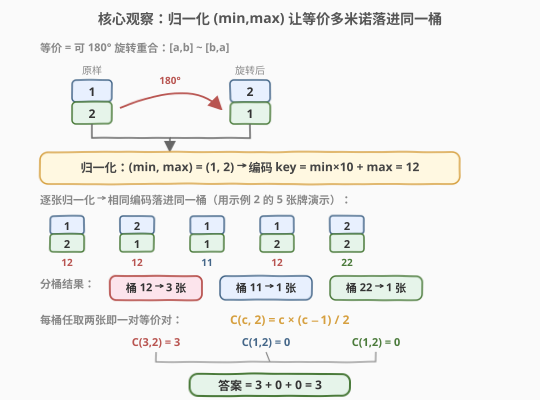
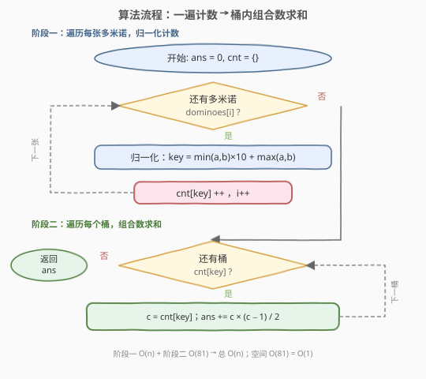
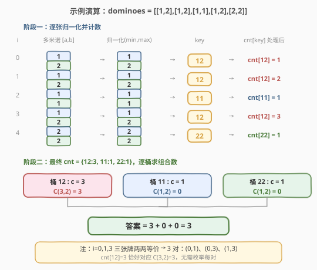

# LeetCode 等价多米诺骨牌对的数量 题解

## 1. 题目概述

- **标题 / 题号**：等价多米诺骨牌对的数量（#1128，easy）
- **链接**：https://leetcode.cn/problems/number-of-equivalent-domino-pairs/
- **难度**：简单
- **标签**：数组、哈希表、计数

**题意**：给你一组多米诺骨牌，其中 `dominoes[i] = [a, b]` 与 `dominoes[j] = [c, d]` **等价**当且仅当 `(a == c 且 b == d)`，或者 `(a == d 且 b == c)`。也就是说，一张多米诺可以旋转 180° 后与另一张重合，就视为等价。

返回满足 `0 <= i < j < dominoes.length` 且 `dominoes[i]` 与 `dominoes[j]` 等价的**对数**。

**示例 1**：

```text
输入：dominoes = [[1,2],[2,1],[3,4],[5,6]]
输出：1
解释：[1,2] 与 [2,1] 等价，构成 1 对。
```

**示例 2**：

```text
输入：dominoes = [[1,2],[1,2],[1,1],[1,2],[2,2]]
输出：3
解释：下标为 0、1、3 的三张牌均为 [1,2]（[2,1] 旋转后也是 [1,2]），
      它们两两等价，共 C(3,2) = 3 对：(0,1)、(0,3)、(1,3)。
```

**约束**：

- `1 <= dominoes.length <= 4 * 10^4`
- `1 <= dominoes[i][j] <= 9`

> 💡 注意数字范围 **1–9** 是本题的关键线索：两个数字组合最多 $9 \times 9 = 81$ 种，编码后可塞进一个极小的哈希表甚至定长数组，空间 $O(1)$。

## 2. 解题思路

### 2.1 暴力思路：双重循环枚举每对

对每对下标 `(i, j)`（`i < j`）判断两张多米诺是否等价：`[a,b]` 与 `[c,d]` 等价当且仅当 `(a==c && b==d) || (a==d && b==c)`。时间 $O(n^2)$，当 $n = 4 \times 10^4$ 时约 $1.6 \times 10^9$ 次比较，**超时**。

问题在于：我们反复在"同一类多米诺"内部两两配对，却每次都从零判断等价性。如果能先把"等价的归到一起"，计数就成了组合数问题。

### 2.2 核心观察：归一化 + 分桶计数



**关键转换**：每张多米诺 `[a, b]` 都归一化为 `(min(a,b), max(a,b))`。这样 `[1,2]` 与 `[2,1]` 都变成 `(1,2)`，等价的多米诺必然落到**同一个桶**里。

> 为什么这样归一化是对的？等价定义是"可旋转重合"，旋转就是把两数交换。`(min, max)` 是交换无关的——无论 `[a,b]` 还是 `[b,a]`，归一化结果相同。因此"归一化后相同" ⇔ "等价"，是个**双射**。

**编码**：由于数字 1–9，可直接编码为整数 `key = min(a,b) * 10 + max(a,b)`，取值范围 11–99，共至多 81 个不同 key。也可用 `(min, max)` 元组作为哈希键。

**计数**：用哈希表统计每个 key 出现的次数 `c`。那么该桶内任取两张都构成一对等价对，对数为组合数：

$$
\binom{c}{2} = \frac{c \cdot (c-1)}{2}
$$

最终答案 = 所有桶的组合数之和。

> 💡 这一步把"数对"问题转化为"组合数"问题：与其枚举每一对，不如数每类有多少个，再用 $C(c,2)$ 一次性算出该类的对数。这是**计数型哈希**的招牌思路（与 [454. 四数相加 II](../0401-0500/454_四数相加II.md)、[2001. 可互换矩形组的数目](https://leetcode.cn/problems/number-of-pairs-of-interchangeable-rectangles/) 同源）。

### 2.3 算法流程图



**完整步骤**：

1. **初始化**：`ans = 0`，哈希表 `cnt` 为空。
2. **阶段一（计数）**：遍历每张多米诺 `[a, b]`：
   - 归一化 `key = min(a,b) * 10 + max(a,b)`（或元组 `(min, max)`）。
   - `cnt[key] += 1`。
3. **阶段二（求和）**：遍历 `cnt` 的每个 key，令 `c = cnt[key]`：
   - `ans += c * (c - 1) / 2`。
4. **返回** `ans`。

> ⚠️ 阶段一与阶段二可合并为**一遍累加**：处理第 `i` 张时，先 `ans += cnt[key]`（它与此前每张同 key 的牌各成一对），再 `cnt[key] += 1`。这样省掉第二次遍历，见方法二。

### 2.4 示例演算

以示例 2 `dominoes = [[1,2],[1,2],[1,1],[1,2],[2,2]]` 为例：



**阶段一（逐张归一化计数）**：

| i | 多米诺 | 归一化 (min,max) | key | cnt[key] 处理后 |
|---|--------|------------------|-----|-----------------|
| 0 | [1,2]  | (1,2)            | 12  | cnt[12] = 1     |
| 1 | [1,2]  | (1,2)            | 12  | cnt[12] = 2     |
| 2 | [1,1]  | (1,1)            | 11  | cnt[11] = 1     |
| 3 | [1,2]  | (1,2)            | 12  | cnt[12] = 3     |
| 4 | [2,2]  | (2,2)            | 22  | cnt[22] = 1     |

**阶段二（逐桶求组合数）**：

| 桶 key | 计数 c | 组合数 C(c,2) |
|--------|--------|---------------|
| 12     | 3      | $3 \times 2 / 2 = 3$ |
| 11     | 1      | 0             |
| 22     | 1      | 0             |

最终 `ans = 3 + 0 + 0 = 3`，与示例一致。桶 12 的 3 张牌（下标 0、1、3）两两配对恰好 3 对：`(0,1)`、`(0,3)`、`(1,3)`。

## 3. 参考代码

### 方法一：哈希计数 + 组合数求和（两遍，直观）

### C++

```cpp
class Solution {
public:
    int numEquivDominoPairs(vector<vector<int>>& dominoes) {
        unordered_map<int, int> cnt;
        for (auto& d : dominoes) {
            int key = min(d[0], d[1]) * 10 + max(d[0], d[1]);
            cnt[key]++;
        }
        int ans = 0;
        for (auto& [key, c] : cnt) {
            ans += c * (c - 1) / 2;
        }
        return ans;
    }
};
```

### Python

```python
class Solution:
    def numEquivDominoPairs(self, dominoes: List[List[int]]) -> int:
        from collections import Counter
        cnt = Counter()
        for a, b in dominoes:
            key = (min(a, b), max(a, b))
            cnt[key] += 1
        return sum(c * (c - 1) // 2 for c in cnt.values())
```

### 方法二：一遍累加（增量计数，推荐）

> 💡 **关键观察**：处理第 `i` 张多米诺时，它与此前**所有同 key 的牌**各构成一对。因此先 `ans += cnt[key]`，再 `cnt[key]++`，一遍即可。数学上等价于 $C(c,2) = \sum_{k=1}^{c-1} k$——每来一张新牌就累加"已有同类的数量"。

### C++

```cpp
class Solution {
public:
    int numEquivDominoPairs(vector<vector<int>>& dominoes) {
        int cnt[100] = {0};   // key 取值 11-99，定长数组即可
        int ans = 0;
        for (auto& d : dominoes) {
            int key = min(d[0], d[1]) * 10 + max(d[0], d[1]);
            ans += cnt[key];  // 与此前每张同类牌各成一对
            cnt[key]++;
        }
        return ans;
    }
};
```

### Python

```python
class Solution:
    def numEquivDominoPairs(self, dominoes: List[List[int]]) -> int:
        cnt = {}
        ans = 0
        for a, b in dominoes:
            key = (min(a, b), max(a, b))
            ans += cnt.get(key, 0)   # 与此前每张同类牌各成一对
            cnt[key] = cnt.get(key, 0) + 1
        return ans
```

> 💡 **C++ 用定长数组 `cnt[100]` 而非 `unordered_map`**：因为数字 1–9，`key = min*10+max` 取值 11–99，数组下标直接命中，比哈希表常数更小。这是"值域小→用数组代替哈希"的常见优化（与 [448. 找到所有数组中消失的数字](../0401-0500/448_找到所有数组中消失的数字.md) 的下标当哈希键同理）。

## 4. 复杂度分析

| 维度 | 方法一（两遍） | 方法二（一遍累加） |
|------|---------------|--------------------|
| **时间** | $O(n)$ | $O(n)$ |
| **空间** | $O(1)$ | $O(1)$ |

> ⚠️ **时间** $O(n)$：阶段一遍历 $n$ 张牌各 $O(1)$；阶段二至多遍历 81 个桶。总计 $O(n)$。方法二合并为单趟遍历，常数更小。
>
> **空间** $O(1)$：无论哈希表还是数组，key 种类至多 $9 \times 9 = 81$ 种，与 $n$ 无关，是常数空间。这是数字范围 1–9 带来的红利。

## 5. 面试要点

1. **为什么归一化用 `(min, max)` 而非排序整个数组？**

   > 每张多米诺只有两个数，`(min, max)` 就是"小数在前、大数在后"，等价于把两个数排个序。旋转就是交换两数，而 `(min, max)` 与交换无关，所以"归一化相同" ⇔ "等价"，是个双射。

2. **为什么答案是 $C(c,2)$ 的和而不是别的？**

   > 题目要数"无序对 $(i,j)$ 且 $i<j$"。一个桶里有 $c$ 张互相等价的牌，从中任取 2 张就是一对，组合数为 $C(c,2) = c(c-1)/2$。不同桶之间不等价，所以各桶独立求和即可。

3. **方法二的"一遍累加"为什么和两遍法结果相同？**

   > 一遍累加在遇到第 $k$ 张同类牌时加上此前已有的 $k-1$ 张，累加和为 $0+1+\dots+(c-1) = c(c-1)/2 = C(c,2)$，与两遍法完全一致。这是"边插入边统计对数"的增量技巧，与 [1. 两数之和](1_两数之和.md) 的"查表再插入"同源。

4. **为什么 C++ 可以用 `cnt[100]` 数组？**

   > 数字范围 1–9，`key = min×10+max` 取值 11–99，不超过 99，故 `int cnt[100]` 足够。数组按下标直接访问，比 `unordered_map` 的哈希开销小，常数更优。

5. **如果数字范围扩大到 1–10^9 还能这么做吗？**

   > 归一化 `(min, max)` 仍然成立，但 key 种类不再有上界，需用 `unordered_map` 或 `map`，空间退化为 $O(\min(n, V))$（$V$ 为不同组合数）。思路不变，只是失去 $O(1)$ 空间。

> 💡 **一句话总结**：1128 的本质是"归一化 → 分桶计数 → 组合数求和"。归一化 `(min,max)` 把等价问题转为同值问题，再用 $C(c,2)$ 一次性算出每类的对数。一遍累加法把两阶段合并，是最优雅的写法。这套"归一化 + 哈希计数 + 组合数"套路可直接迁移到可互换矩形（2001）、相似字符串对（2506）等题。

## 同类练习题

| # | 题目 | 与本题的关联 |
|---|------|-------------|
| 2001 | [可互换矩形组的数目](https://leetcode.cn/problems/number-of-pairs-of-interchangeable-rectangles/) | 完全同构，宽高比用 gcd 化简归一化 + 计数 + $C(c,2)$，1128 的"大数版" |
| 2506 | [统计相似字符串对的数目](https://leetcode.cn/problems/count-pairs-of-similar-strings/) | 字符串按字符集合归一化（位掩码编码）+ 计数对，同"归一化→计数→组对"套路 |
| 1 | [两数之和](https://leetcode.cn/problems/two-sum/)（[题解](../0001-0100/1_两数之和.md)） | 哈希表"先查表再插入"的增量计数思想，方法二与之同源 |
| 454 | [四数相加 II](https://leetcode.cn/problems/4sum-ii/)（[题解](../0401-0500/454_四数相加II.md)） | 分组 + 哈希计数的招牌题，"计数型哈希"同一范式 |
| 1007 | [行相等的最少多米诺旋转](https://leetcode.cn/problems/minimum-domino-rotations-for-equal-grid-row/)（[题解](../1001-1100/1007_行相等的最少多米诺旋转.md)） | 同为多米诺题材，但套路不同（枚举候选值 $O(n)$ 验证），可对比 |
