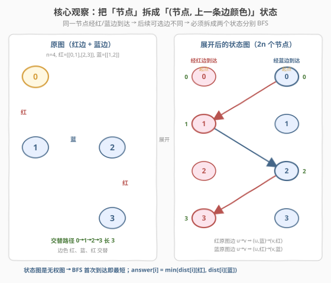
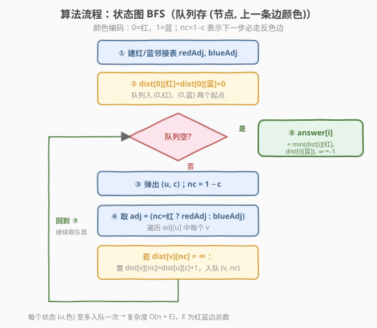
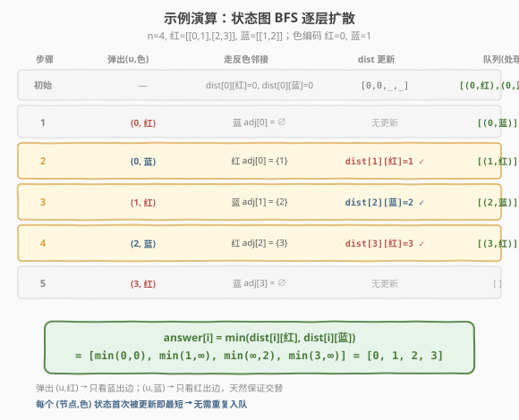

# LeetCode 颜色交替的最短路径 题解

## 1. 题目概述

- **标题 / 题号**：颜色交替的最短路径（#1129，medium）
- **链接**：https://leetcode.cn/problems/shortest-path-with-alternating-colors/
- **难度**：中等
- **标签**：图、广度优先搜索、最短路径、状态图

**题意**：给定一个有 `n` 个节点的**有向图**，节点编号 `0` 到 `n-1`。图中的每条边被染成**红色**或**蓝色**，分别由 `redEdges` 和 `blueEdges` 给出，其中 `redEdges[i] = [u, v]` 表示一条从 `u` 到 `v` 的红色有向边。

要求返回长度为 `n` 的数组 `answer`，其中 `answer[i]` 是从节点 `0` 到节点 `i` 的**颜色交替最短路径**的长度；若不存在这样的路径则为 `-1`。

> **颜色交替**：路径上相邻两条边的颜色不同，即 红→蓝→红→蓝→… 或 蓝→红→蓝→红→… 两种都合法。路径长度定义为**边的条数**。`answer[0] = 0`（起点自身，无需走边）。

**示例 1**：

```text
输入：n = 3, red_edges = [[0,1],[1,2]], blue_edges = []
输出：[0,1,-1]
解释：
  0→0：长度 0
  0→1：红边 0→1，长度 1
  0→2：0→1（红）后只能走蓝边，但无蓝边，无法到达 2 → -1
```

**示例 2**：

```text
输入：n = 3, red_edges = [[0,1]], blue_edges = [[2,1]]
输出：[0,1,-1]
解释：0→1 走红边长 1；节点 2 没有任何入边，无法到达 → -1
```

**示例 3**：

```text
输入：n = 3, red_edges = [[1,0]], blue_edges = [[2,1]]
输出：[0,-1,-1]
解释：从 0 出发没有任何出边（红边 1→0 指向 0 而非从 0 出发），只能到 0 自身
```

**约束**：

- `1 <= n <= 100`
- `0 <= redEdges.length, blueEdges.length <= 400`
- `redEdges[i].length == blueEdges[i].length == 2`
- `0 <= u, v < n`
- 图中可能存在**自环**和**重复边**

> 💡 本题的灵魂在于：到达同一个节点的「上一条边颜色」不同，会决定后续能走哪些边。因此**不能把节点单独当作 BFS 状态**，必须把「(节点, 上一条边颜色)」作为一个整体状态——这是「状态图 BFS」的经典套路。

## 2. 解题思路

### 2.1 暴力思路：为什么普通 BFS 不行？

若忽略颜色交替要求，直接从节点 `0` 做 BFS，每个节点首次被访问时记录最短距离即可。但加上「交替」约束后，**同一个节点**经由红边到达和经由蓝边到达，是**两种不同的情况**——前者下一步只能走蓝边，后者下一步只能走红边。

> ⚠️ 若只记录「节点是否访问过」，会把「经红边到达节点 `u`」和「经蓝边到达节点 `u`」误判为同一种状态，从而错过某些合法的交替路径。例如：经红边到 `u` 后本可继续走红边到 `w`（不合法，需交替），却被错误地标记为已访问，导致后续经蓝边到 `u` 再走红边到 `w` 的合法路径被跳过。

### 2.2 核心观察：状态图 BFS —— 把节点拆成两个状态



**关键洞察**：把每个节点 `u` 拆成两个状态 `(u, 红)`、`(u, 蓝)`，分别表示「上一条边是红色/蓝色到达 `u`」。于是原图变换成一张**状态图**：

> 原图的红色边 `u→v`：要走到 `v` 且最后一条边是红色，必须从「经蓝边到达 `u`」的状态出发（保证与前一条蓝边交替）→ 状态图中的边 `(u, 蓝) → (v, 红)`
>
> 原图的蓝色边 `u→v`：同理 → 状态图中的边 `(u, 红) → (v, 蓝)`

这张状态图有 `2n` 个节点、`E` 条边（`E = |redEdges| + |blueEdges|`），且**无权**（每条边长度 1）。在无权图上求单源最短路，标准武器就是 **BFS**——首次到达某状态的距离即为最短距离。

**起点处理**：节点 `0` 是起点，没有「上一条边」。但第一条边可以是红色也可以是蓝色，因此把 `(0, 红)` 和 `(0, 蓝)` 都作为起点，距离都初始化为 `0`，一起入队。

> 💡 **最终答案**：对节点 `i`，`answer[i] = min(dist[i][红], dist[i][蓝])`——两种到达方式中取较短者；若两者都未被更新（仍为 `∞`），则为 `-1`。`answer[0] = min(0, 0) = 0`。

### 2.3 算法流程图



**完整步骤**：

1. **建邻接表**：`redAdj[u]` 存 `u` 的所有红色出边终点，`blueAdj[u]` 同理；
2. **初始化**：`dist[0][红] = dist[0][蓝] = 0`，其余为 `∞`；队列放入 `(0, 红)` 和 `(0, 蓝)`；
3. **BFS 循环**：弹出 `(u, c)`，计算下一步颜色 `nc = 1 - c`（必须交替）；
4. **遍历反色邻接**：取 `adj = (nc == 红) ? redAdj : blueAdj`，对每个 `v ∈ adj[u]`；
5. **松弛**：若 `dist[v][nc]` 仍为 `∞`（未访问），置 `dist[v][nc] = dist[u][c] + 1`，并入队 `(v, nc)`；
6. **收尾**：`answer[i] = min(dist[i][红], dist[i][蓝])`，`∞` 记为 `-1`。

> ⚠️ **为什么用「`dist[v][nc] == ∞`」而非「`dist[v][nc] > dist[u][c] + 1`」作判据？** 无权图 BFS 中每个状态**首次**被访问时就拿到了最短距离（队列的层序性质保证）。后续再遇到必不更优，故只需判「是否首次」。两种写法等价，前者更直观体现「每个状态至多入队一次」。

### 2.4 示例演算

以 `n = 4, red_edges = [[0,1],[2,3]], blue_edges = [[1,2]]` 为例，这条链 `0→1→2→3` 的边色恰为 红、蓝、红 交替，最短长度 3：



| 步骤 | 弹出 (u, 色) | 走反色邻接 | dist 更新 | 队列（处理后） |
|------|-------------|-----------|----------|----------------|
| 初始 | — | dist[0][红]=0, dist[0][蓝]=0 | — | [(0,红), (0,蓝)] |
| 1 | (0, 红) | 蓝 adj[0] = ∅ | 无 | [(0,蓝)] |
| 2 | (0, 蓝) | 红 adj[0] = {1} | dist[1][红] = 1 | [(1,红)] |
| 3 | (1, 红) | 蓝 adj[1] = {2} | dist[2][蓝] = 2 | [(2,蓝)] |
| 4 | (2, 蓝) | 红 adj[2] = {3} | dist[3][红] = 3 | [(3,红)] |
| 5 | (3, 红) | 蓝 adj[3] = ∅ | 无 | [] |

队列空，`answer = [min(0,0), min(1,∞), min(∞,2), min(3,∞)] = [0, 1, 2, 3]`。

> 💡 **观察步骤 1**：弹出 `(0, 红)` 时蓝邻接为空（本例无蓝出边），但这不影响——因为 `(0, 蓝)` 已在队列中，会走红出边继续推进。两个起点互为补充，覆盖「第一条边为红」和「第一条边为蓝」两种可能。

## 3. 参考代码

### C++

```cpp
class Solution {
public:
    vector<int> shortestAlternatingPaths(int n, vector<vector<int>>& redEdges,
                                         vector<vector<int>>& blueEdges) {
        vector<vector<int>> redAdj(n), blueAdj(n);
        for (auto& e : redEdges)  redAdj[e[0]].push_back(e[1]);
        for (auto& e : blueEdges) blueAdj[e[0]].push_back(e[1]);

        const int INF = INT_MAX / 2;
        // dist[u][c]: 到达 u 且最后一条边颜色为 c 的最短距离（0=红, 1=蓝）
        vector<vector<int>> dist(n, vector<int>(2, INF));
        dist[0][0] = 0;
        dist[0][1] = 0;

        queue<pair<int,int>> q;            // (节点, 上一条边颜色)
        q.push({0, 0});
        q.push({0, 1});

        while (!q.empty()) {
            auto [u, c] = q.front(); q.pop();
            int nc = 1 - c;                // 下一步必须走反色边
            auto& adj = (nc == 0) ? redAdj : blueAdj;
            for (int v : adj[u]) {
                if (dist[v][nc] > dist[u][c] + 1) {
                    dist[v][nc] = dist[u][c] + 1;
                    q.push({v, nc});
                }
            }
        }

        vector<int> ans(n);
        for (int i = 0; i < n; ++i) {
            int d = min(dist[i][0], dist[i][1]);
            ans[i] = (d >= INF) ? -1 : d;
        }
        return ans;
    }
};
```

### Python

```python
class Solution:
    def shortestAlternatingPaths(self, n: int, redEdges: List[List[int]],
                                 blueEdges: List[List[int]]) -> List[int]:
        red_adj = [[] for _ in range(n)]
        blue_adj = [[] for _ in range(n)]
        for u, v in redEdges:
            red_adj[u].append(v)
        for u, v in blueEdges:
            blue_adj[u].append(v)

        INF = float('inf')
        # dist[u][c]: 到达 u 且最后一条边颜色为 c 的最短距离（0=红, 1=蓝）
        dist = [[INF, INF] for _ in range(n)]
        dist[0][0] = 0
        dist[0][1] = 0

        from collections import deque
        q = deque([(0, 0), (0, 1)])       # (节点, 上一条边颜色)
        while q:
            u, c = q.popleft()
            nc = 1 - c                     # 下一步必须走反色边
            adj = red_adj if nc == 0 else blue_adj
            for v in adj[u]:
                if dist[v][nc] > dist[u][c] + 1:
                    dist[v][nc] = dist[u][c] + 1
                    q.append((v, nc))

        return [(-1 if min(d0, d1) == INF else min(d0, d1))
                for d0, d1 in dist]
```

> 💡 **实现细节**：① 颜色编码 `0=红, 1=蓝`，`nc = 1 - c` 一行搞定「取反色」。② 起点入队两个状态 `(0,0)`、`(0,1)`，距离都为 `0`，等价于「第一条边颜色任选」。③ 用 `dist[v][nc] > dist[u][c] + 1` 判松弛，保证每个状态至多入队一次（无权 BFS 首次即最短）。④ 自环和重复边无需特殊处理：自环 `u→u` 会让 `(u, c) → (u, nc)`，若 `(u, nc)` 已访问则跳过，不会死循环；重复边只是 `adj[u]` 里多几个相同 `v`，松弛条件会跳过。

## 4. 复杂度分析

| 维度 | 复杂度 | 说明 |
|------|--------|------|
| 时间复杂度 | $O(n + E)$ | 状态共 $2n$ 个，每个状态处理其出边一次；$E = |\text{redEdges}| + |\text{blueEdges}|$ |
| 空间复杂度 | $O(n + E)$ | 邻接表 $O(E)$、`dist` 数组 $O(n)$、队列最坏 $O(n)$ |

> ⚠️ 本题 $n \le 100$、$E \le 800$，$O(n+E)$ 远在限制之内。状态图 BFS 把「带颜色约束的最短路」转化为「无权图标准 BFS」，是此类问题的最优解法。

## 5. 扩展：用 Dijkstra 统一处理带权交替路径

若本题的边带**权重**（红/蓝边各有代价），交替约束不变，则状态图变为**带权图**——把 BFS 换成 [堆优化 Dijkstra](../0701-0800/743_网络延迟时间.md) 即可：

- 状态仍是 `(节点, 上一条边颜色)`；
- 松弛条件改为 `dist[u][c] + w < dist[v][nc]`，用最小堆选当前距离最小的 `(u, c)`；
- 复杂度 $O(E \log n)$。

这说明「状态图建模」是一种**与底层最短路算法解耦**的通用思路：约束决定状态空间，权值决定用 BFS 还是 Dijkstra。

> 💡 另一种等价写法是把「上一条边颜色」用**进队列的节点编号染色**实现：给节点编号加偏移（红态用 `u`，蓝态用 `u + n`），则状态图就是一张 `2n` 节点的普通图，可直接套用任何标准最短路模板。本质相同，只是把 `(u, c)` 压成了一个整数。

## 6. 面试要点

1. **为什么不能只对节点做 BFS，必须把颜色也纳入状态？**

   > 因为「到达节点 `u` 时上一条边的颜色」决定了下一步能走哪些边（必须走反色）。同一节点经红/蓝边到达是两种不同的可达情形，后续合法路径不同。若合并为一个状态，会错误地把「经红边到 `u`」标记为已访问，从而漏掉「经蓝边到 `u` 再走红边到 `w`」的合法交替路径。

2. **起点 `0` 为什么要入队两个状态 `(0, 红)` 和 `(0, 蓝)`？**

   > 第一条边既可以是红色也可以是蓝色，两种选择对应不同的后续路径。把 `(0, 红)`、`(0, 蓝)` 都以距离 `0` 入队，等价于「假装从一条红/蓝虚拟边到达 `0`」，让 BFS 自然地从两种首边颜色分别推进，无需特判第一条边。

3. **`answer[0]` 为什么是 `0` 而不是 `-1`？**

   > 起点到自身无需走任何边，路径长度为 `0`。代码中 `dist[0][0] = dist[0][1] = 0`，`min` 后仍为 `0`。注意不要因为「没有边到达 `0`」而误判为 `-1`——起点是初始状态，不依赖任何入边。

4. **自环边（如 `0→0` 的红边）会导致死循环吗？**

   > 不会。自环 `u→u` 的红边对应状态转移 `(u, 蓝) → (u, 红)`。BFS 中每个状态至多入队一次（由 `dist` 判重），若 `(u, 红)` 已访问则直接跳过，不会反复入队。重复边同理，只是 `adj[u]` 中出现多个相同 `v`，松弛条件天然过滤。

5. **状态图 BFS 和分层 BFS / 限制步数 BFS 有何联系？**

   > 都是「把额外约束编码进状态」。本题把「上一条边颜色」编码进状态；[787. K 站中转内最便宜的航班](https://leetcode.cn/problems/cheapest-flights-within-k-stops/) 把「已走步数」编码进状态（或用 Bellman-Ford 限制松弛轮数）。核心思想一致：**约束决定状态空间，状态空间展开后套用标准算法**。

> 💡 **一句话总结**：1129 的灵魂是「**状态图 BFS**」——把「(节点, 上一条边颜色)」作为整体状态，原图的红/蓝边映射为状态图的反色转移边，于是在 $2n$ 节点的无权状态图上跑标准 BFS 即得最短交替路径。这套「把约束编码进状态、展开成普通图再套标准算法」的思路，可迁移到所有限制型最短路（带步数限制、带颜色/属性交替、带访问位掩码等）。

## 同类练习题

| # | 题目 | 与本题的关联 |
|---|------|-------------|
| 743 | [网络延迟时间](https://leetcode.cn/problems/network-delay-time/)（[题解](../0701-0800/743_网络延迟时间.md)） | 单源最短路模板，无颜色约束的带权版，对照理解「无权用 BFS、带权用 Dijkstra」的选型 |
| 787 | [K 站中转内最便宜的航班](https://leetcode.cn/problems/cheapest-flights-within-k-stops/) | 把「步数限制」编码进状态的限制型最短路，Bellman-Ford 限制松弛轮数，同套「约束决定状态空间」思想 |
| 994 | [腐烂的橘子](https://leetcode.cn/problems/rotting-oranges/)（[题解](../0901-1000/994_腐烂的橘子.md)） | 无权图多源 BFS 求最短传播时间，对照「状态图 BFS = 普通无权 BFS + 状态扩展」 |
| 864 | [获取所有钥匙的最短路径](https://leetcode.cn/problems/shortest-path-to-get-all-keys/) | 把「已收集钥匙集合（位掩码）」编码进状态的 BFS，状态空间更大的同套路进阶题 |
