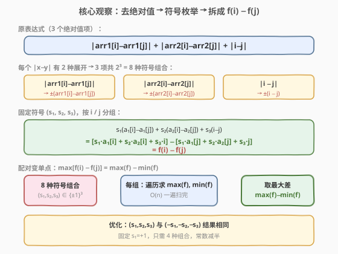
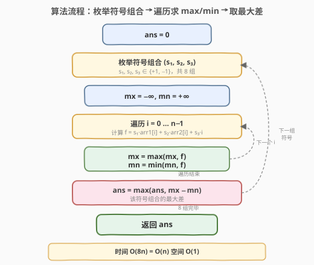

# LeetCode 绝对值表达式的最大值 题解

## 1. 题目概述

- **标题 / 题号**：绝对值表达式的最大值（#1131，medium）
- **链接**：https://leetcode.cn/problems/maximum-of-absolute-value-expression/
- **难度**：中等
- **标签**：数组、数学

**题意**：给你两个长度相等的整数数组 `arr1` 和 `arr2`，返回下面表达式的最大值：

$$|arr1[i] - arr1[j]| + |arr2[i] - arr2[j]| + |i - j|$$

其中下标 `i`，`j` 满足 `0 <= i, j < arr1.length`。

**示例 1**：

```text
输入：arr1 = [1,2,3,4], arr2 = [-1,4,5,6]
输出：13
解释：取 i=3, j=0 时，|4-1| + |6-(-1)| + |3-0| = 3 + 7 + 3 = 13
```

**示例 2**：

```text
输入：arr1 = [1,-2,-5,0,10], arr2 = [0,-2,-1,-7,-4]
输出：20
解释：取 i=4, j=2 时，|10-(-5)| + |(-4)-(-1)| + |4-2| = 15 + 3 + 2 = 20
```

**约束**：

- `2 <= arr1.length == arr2.length <= 40000`
- `-10^6 <= arr1[i], arr2[i] <= 10^6`

> 💡 注意数组长度可达 $4 \times 10^4$，暴力 $O(n^2)$ 会超时（约 $1.6 \times 10^9$ 次运算），需要 $O(n)$ 解法。

## 2. 解题思路

### 2.1 暴力思路：双重循环枚举每对

对每对下标 `(i, j)` 直接计算 `|arr1[i]-arr1[j]| + |arr2[i]-arr2[j]| + |i-j|`，取最大值。时间 $O(n^2)$，当 $n = 4 \times 10^4$ 时约 $1.6 \times 10^9$ 次运算，**超时**。

瓶颈在于绝对值符号把 `i` 和 `j` 耦合在一起——必须同时知道 `i` 和 `j` 的值才能算出每一项。如果能**去掉绝对值**，让表达式拆成"只含 `i`"减"只含 `j`"的形式，就能把配对问题变成单点问题。

### 2.2 核心观察：去绝对值 → 符号枚举 → 拆成 $f(i) - f(j)$



**第一步：去掉绝对值**。对任意 $x, y$，绝对值 $|x - y|$ 只有两种展开：

$$|x - y| = \begin{cases} +(x - y) & \text{若 } x \ge y \\ -(x - y) & \text{若 } x < y \end{cases}$$

三个绝对值项各有两种展开，共 $2^3 = 8$ 种**符号组合** $(s_1, s_2, s_3) \in \{+1, -1\}^3$。

**第二步：拆成 $f(i) - f(j)$**。对固定的符号组合，表达式变为：

$$s_1 \cdot (a_1[i] - a_1[j]) + s_2 \cdot (a_2[i] - a_2[j]) + s_3 \cdot (i - j)$$

按 `i` 和 `j` 重新分组：

$$\underbrace{(s_1 \cdot a_1[i] + s_2 \cdot a_2[i] + s_3 \cdot i)}_{f(i)} - \underbrace{(s_1 \cdot a_1[j] + s_2 \cdot a_2[j] + s_3 \cdot j)}_{f(j)}$$

即 $f(i) - f(j)$，其中 $f(k) = s_1 \cdot arr1[k] + s_2 \cdot arr2[k] + s_3 \cdot k$。

> 💡 **为什么去绝对值是安全的？** 对任意一对 $(i, j)$，原表达式的值恰好等于 8 种符号组合中**正确那种**的展开值（每项选对的符号）。因此 $\max_{i,j} \text{原表达式} = \max_{\text{符号}} \max_{i,j} [f(i) - f(j)]$——先取符号再取配对，顺序可交换。

**第三步：配对变单点**。对固定符号组合，$\max_{i,j} [f(i) - f(j)] = \max(f) - \min(f)$——只需遍历一遍求 $f$ 的最大值和最小值，无需枚举配对。

最终答案 = 8 种符号组合中 $\max(f) - \min(f)$ 的最大值。

> ⚠️ **4 种就够了**：符号组合 $(s_1, s_2, s_3)$ 与 $(-s_1, -s_2, -s_3)$ 给出相反的 $f$，而 $\max(-f) - \min(-f) = \max(f) - \min(f)$，结果相同。因此固定 $s_1 = +1$，只需枚举 4 种组合。下文代码用 8 种（直观），可自行优化为 4 种。

### 2.3 算法流程图



**完整步骤**：

1. **初始化** `ans = 0`。
2. **枚举符号组合**：三重循环 $s_1, s_2, s_3 \in \{+1, -1\}$，共 8 组。
3. **对每组符号**：遍历 $k = 0 \ldots n-1$，计算 $f(k) = s_1 \cdot arr1[k] + s_2 \cdot arr2[k] + s_3 \cdot k$，维护 `mx` 和 `mn`。
4. **更新答案**：`ans = max(ans, mx - mn)`。
5. **返回** `ans`。

### 2.4 示例演算

以示例 1 `arr1 = [1,2,3,4], arr2 = [-1,4,5,6]` 为例，重点看符号组合 $(+,+,+)$：

![示例演算：(+,+,+) 符号组合下 f(k) = arr1[k]+arr2[k]+k，max−min=13](../images/mave_example_walkthrough.svg)

| k | arr1[k] | arr2[k] | k | $f(k) = arr1[k] + arr2[k] + k$ |
|---|---------|---------|---|--------------------------------|
| 0 | 1       | -1      | 0 | $1 + (-1) + 0 = 0$             |
| 1 | 2       | 4       | 1 | $2 + 4 + 1 = 7$                |
| 2 | 3       | 5       | 2 | $3 + 5 + 2 = 10$               |
| 3 | 4       | 6       | 3 | $4 + 6 + 3 = 13$ ← max         |

$\max(f) - \min(f) = 13 - 0 = 13$，与示例一致。此时 $i=3, j=0$，验证：$|4-1| + |6-(-1)| + |3-0| = 3 + 7 + 3 = 13$ ✓。

其余 7 种符号组合的 $\max(f) - \min(f)$ 均 $\le 13$，故最终答案为 13。

> 💡 **几何直觉**：把每个下标 $k$ 看作三维点 $(arr1[k], arr2[k], k)$，原表达式就是两点间的**曼哈顿距离**。求最大曼哈顿距离的通用技巧正是符号枚举——将 $L_1$ 距离转化为 $L_\infty$ 范数：$\max_{i,j} \|P_i - P_j\|_1 = \max_{s \in \{\pm1\}^d} (\max_k s \cdot P_k - \min_k s \cdot P_k)$。

## 3. 参考代码

### 方法一：8 种符号组合枚举（直观）

### C++

```cpp
class Solution {
public:
    int maxAbsValExpr(vector<int>& arr1, vector<int>& arr2) {
        int n = arr1.size();
        int ans = 0;
        for (int s1 : {1, -1}) {
            for (int s2 : {1, -1}) {
                for (int s3 : {1, -1}) {
                    int mx = INT_MIN, mn = INT_MAX;
                    for (int i = 0; i < n; ++i) {
                        int f = s1 * arr1[i] + s2 * arr2[i] + s3 * i;
                        mx = max(mx, f);
                        mn = min(mn, f);
                    }
                    ans = max(ans, mx - mn);
                }
            }
        }
        return ans;
    }
};
```

### Python

```python
class Solution:
    def maxAbsValExpr(self, arr1: List[int], arr2: List[int]) -> int:
        n = len(arr1)
        ans = 0
        for s1 in (1, -1):
            for s2 in (1, -1):
                for s3 in (1, -1):
                    vals = [s1 * arr1[i] + s2 * arr2[i] + s3 * i for i in range(n)]
                    ans = max(ans, max(vals) - min(vals))
        return ans
```

### 方法二：4 种符号组合（优化常数，固定 $s_1 = +1$）

> 💡 **优化原理**：$(s_1, s_2, s_3)$ 与 $(-s_1, -s_2, -s_3)$ 给出相反的 $f$，而 $\max(-f) - \min(-f) = \max(f) - \min(f)$。固定 $s_1 = +1$，4 种组合即可覆盖全部。

### C++

```cpp
class Solution {
public:
    int maxAbsValExpr(vector<int>& arr1, vector<int>& arr2) {
        int n = arr1.size();
        int ans = 0;
        int signs[4][3] = {{1,1,1}, {1,1,-1}, {1,-1,1}, {1,-1,-1}};
        for (auto& s : signs) {
            int mx = INT_MIN, mn = INT_MAX;
            for (int i = 0; i < n; ++i) {
                int f = s[0] * arr1[i] + s[1] * arr2[i] + s[2] * i;
                mx = max(mx, f);
                mn = min(mn, f);
            }
            ans = max(ans, mx - mn);
        }
        return ans;
    }
};
```

### Python

```python
class Solution:
    def maxAbsValExpr(self, arr1: List[int], arr2: List[int]) -> int:
        n = len(arr1)
        ans = 0
        for s2 in (1, -1):
            for s3 in (1, -1):
                vals = [arr1[i] + s2 * arr2[i] + s3 * i for i in range(n)]
                ans = max(ans, max(vals) - min(vals))
        return ans
```

> ⚠️ **注意溢出**：$f(k)$ 的绝对值上界为 $10^6 + 10^6 + 4 \times 10^4 \approx 2.04 \times 10^6$，`int`（$\pm 2.1 \times 10^9$）完全够用，无需 `long long`。

## 4. 复杂度分析

| 维度 | 方法一（8 组合） | 方法二（4 组合） |
|------|-----------------|-----------------|
| **时间** | $O(n)$ | $O(n)$ |
| **空间** | $O(1)$ | $O(1)$ |

> ⚠️ **时间** $O(n)$：共 $8$（或 $4$）种符号组合，每种遍历 $n$ 个元素求 max/min，总计 $8n$（或 $4n$）次运算。$n = 4 \times 10^4$ 时约 $3.2 \times 10^5$（或 $1.6 \times 10^5$）次，远优于暴力的 $1.6 \times 10^9$。
>
> **空间** $O(1)$：只需常数个变量 `mx`、`mn`、`ans`，无需额外数组。Python 方法一用列表推导生成 `vals` 是 $O(n)$ 空间，可改为循环内逐个更新以优化到 $O(1)$。

## 5. 面试要点

1. **为什么去掉绝对值是安全的？**

   > 对任意一对 $(i, j)$，原表达式的值恰好等于 8 种符号组合中正确那种的展开值（每个绝对值项选对正负号）。因此 $\max_{i,j} \text{原表达式} = \max_{\text{符号}} \max_{i,j} [f(i) - f(j)]$，先枚举符号再求最大差，不遗漏也不多算。

2. **为什么能从 $O(n^2)$ 降到 $O(n)$？**

   > 关键在于去掉绝对值后，表达式拆成了 $f(i) - f(j)$ 的形式——`i` 和 `j` 解耦了。对固定符号组合，$\max_{i,j}[f(i)-f(j)] = \max(f) - \min(f)$，一遍遍历即可，无需枚举配对。

3. **为什么 4 种符号组合就够了？**

   > $(s_1, s_2, s_3)$ 与 $(-s_1, -s_2, -s_3)$ 产生的 $f$ 互为相反数，而 $\max(-f) - \min(-f) = -\min(f) + \max(f) = \max(f) - \min(f)$，结果相同。8 种组合两两配对，固定 $s_1 = +1$ 取 4 种即可。

4. **这题的几何意义是什么？**

   > 把每个下标 $k$ 看作三维点 $(arr1[k], arr2[k], k)$，原表达式就是两点的**曼哈顿距离**（$L_1$ 范数）。求最大曼哈顿距离的通用技巧就是符号枚举——把 $L_1$ 距离转化为各方向投影的 $L_\infty$ 范数之差。

5. **如果再加一个绝对值项（四维）怎么办？**

   > 符号组合数从 $2^3 = 8$ 增到 $2^4 = 16$（可减半为 8），时间仍为 $O(n)$。推广到 $d$ 维，符号组合数为 $2^{d-1}$，只要 $d$ 是常数，时间始终 $O(n)$。

> 💡 **一句话总结**：1131 的本质是"去绝对值 → 符号枚举 → 拆成 $f(i) - f(j)$ → $\max(f) - \min(f)$"。把配对问题降维为单点问题，是曼哈顿距离最大化的招牌套路，可推广到任意常数维。

## 同类练习题

| # | 题目 | 与本题的关联 |
|---|------|-------------|
| 1330 | [翻转子数组得到最大的数组值](https://leetcode.cn/problems/reverse-subarray-to-maximize-array-value/) | 同一符号分解技巧，枚举 $2^k$ 种符号组合去绝对值求最大差 |
| 149 | [直线上最多的点数](https://leetcode.cn/problems/max-points-on-a-line/)（[题解](../0101-0200/149_直线上最多的点数.md)） | 同为坐标点对问题，但用 GCD 化简斜率哈希分组，对照不同的点对处理范式 |
| 974 | [和可被 K 整除的子数组](https://leetcode.cn/problems/subarray-sums-divisible-by-k/)（[题解](../0901-1000/974_和可被K整除的子数组.md)） | 同样把 $i,j$ 配对问题转化为对每个下标独立计算 $f(k)$ 再聚合 |
| 525 | [连续数组](https://leetcode.cn/problems/contiguous-array/)（[题解](../0501-0600/525_连续数组.md)） | 同样把配对问题转化为单点变换（前缀和 + 哈希存最早下标） |
