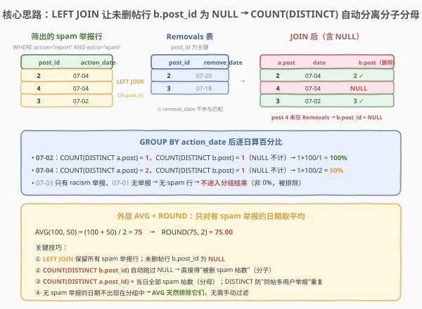
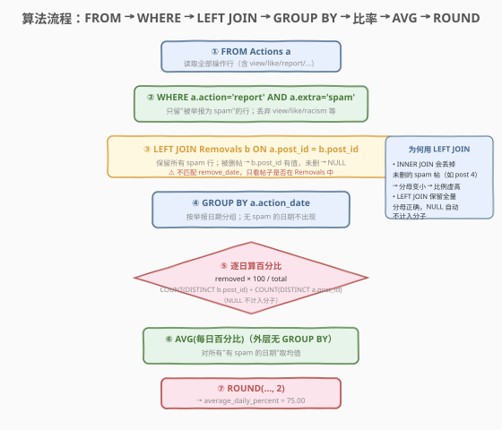
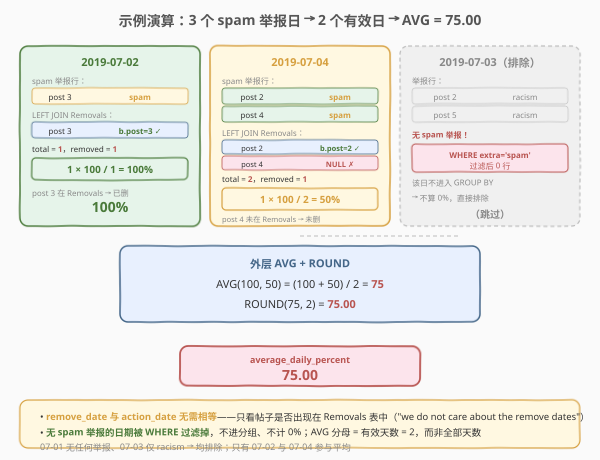

# LeetCode 报告的记录 II 题解

## 1. 题目概述

- **标题 / 题号**：报告的记录 II（#1132，medium）
- **链接**：https://leetcode.cn/problems/reported-posts-ii/
- **难度**：中等
- **标签**：SQL、LEFT JOIN、GROUP BY、COUNT(DISTINCT)、比率聚合、AVG、ROUND

**题意**：给定 `Actions` 表（记录用户对帖子的各类操作）与 `Removals` 表（记录被删除的帖子），编写 SQL 查询，求**每天被举报为 `spam` 的帖子中、最终被删除的占比的日均值**，结果四舍五入到 2 位小数。

> ⚠️ 该题为 **🔒 Plus 会员专享题**。`Actions` 表**无主键**，可能存在重复行；`action` 是 ENUM 类型，`extra` 存放举报原因（如 `'spam'`、`'racism'`），**仅当 `action = 'report'` 时可能非空**，其余情况为 `NULL`。

**表结构**：

```text
Table: Actions
+---------------+---------+
| Column Name   | Type    |
+---------------+---------+
| user_id       | int     |
| post_id       | int     |
| action_date   | date    |
| action        | enum    |  ← ('view','like','reaction','comment','report','share')
| extra         | varchar |  ← 举报原因；action != 'report' 时为 NULL
+---------------+---------+
（无主键，可能有重复行）

Table: Removals
+---------------+---------+
| Column Name   | Type    |
+---------------+---------+
| post_id       | int     |  ← 主键
| remove_date   | date    |
+---------------+---------+
```

> 💡 **关键约束**：`Removals` 表以 `post_id` 为主键——一个帖子最多被删一次。`Actions` 无主键：同一帖子可被**多个不同用户**以 `spam` 举报，产生多行 `post_id` 相同的记录——这正是分子分母都必须用 `COUNT(DISTINCT post_id)` 而非 `COUNT(*)` 的根源。注意题目说明 **"we do not care about the remove dates"**：判断"是否被删"只看帖子是否出现在 `Removals` 表中，**不要求 `remove_date` 与 `action_date` 相等**。

**示例 1**：

```text
输入：
Actions 表
+---------+---------+-------------+--------+--------+
| user_id | post_id | action_date | action | extra  |
+---------+---------+-------------+--------+--------+
| 1       | 1       | 2019-07-01  | view   | null   |
| 1       | 1       | 2019-07-01  | like   | null   |
| 1       | 1       | 2019-07-01  | share  | null   |
| 2       | 2       | 2019-07-04  | view   | null   |
| 2       | 2       | 2019-07-04  | report | spam   |
| 3       | 4       | 2019-07-04  | view   | null   |
| 3       | 4       | 2019-07-04  | report | spam   |
| 4       | 3       | 2019-07-02  | view   | null   |
| 4       | 3       | 2019-07-02  | report | spam   |
| 5       | 2       | 2019-07-03  | view   | null   |
| 5       | 2       | 2019-07-03  | report | racism |
| 5       | 5       | 2019-07-03  | view   | null   |
| 5       | 5       | 2019-07-03  | report | racism |
+---------+---------+-------------+--------+--------+

Removals 表
+---------+-------------+
| post_id | remove_date |
+---------+-------------+
| 2       | 2019-07-20  |
| 3       | 2019-07-18  |
+---------+-------------+

输出：
+-----------------------+
| average_daily_percent |
+-----------------------+
| 75.00                 |
+-----------------------+
```

**解释**：

| 日期 | spam 举报的不同帖子 | 其中被删（在 Removals 中） | 当日百分比 |
|------|---------------------|--------------------------|-----------|
| 2019-07-02 | {3} → 1 | {3} → 1 | $1/1 \times 100 = 100\%$ |
| 2019-07-04 | {2, 4} → 2 | {2} → 1（post 4 未删） | $1/2 \times 100 = 50\%$ |
| 2019-07-03 | —（只有 racism，无 spam） | — | **排除**（不进分组，不算 0%） |
| 2019-07-01 | —（无任何举报） | — | **排除** |

- **平均** $= (100 + 50) / 2 = 75.00$（只对有 spam 举报的 2 天取均值）
- post 3 在 07-02 被举报 spam、在 07-18 被删（日期不同仍算"已删"）；post 4 从未进 `Removals` → 未删

**约束**：

- `Actions` 表无主键，可能包含重复行
- `Removals` 表以 `post_id` 为主键（每个帖子最多一行）
- `action` 为 ENUM；`extra` 为举报原因，仅 `action = 'report'` 时可能非空
- 结果为单个数值 `average_daily_percent`，四舍五入到 2 位小数
- **无 spam 举报的日期不参与平均**（不当作 0% 计入）

> 💡 本题是 [1113. 报告的记录](../1101-1200/1113_报告的记录.md) 的"多表 + 比率聚合"升级版——在 1113 的 `WHERE + GROUP BY + COUNT(DISTINCT)` 三件套基础上，叠加 `LEFT JOIN` 拼接删除信息、用 `COUNT(DISTINCT) / COUNT(DISTINCT)` 算比率、最后 `AVG + ROUND` 聚合为单值。核心难点有二：① 用 `LEFT JOIN`（而非 `INNER JOIN`）保留未删帖以维持正确分母；② 理解"无 spam 的日期被 WHERE 自然排除、不进 AVG 分母"。

## 2. 解题思路

### 2.1 暴力思路：逐日逐帖判定

按 `action_date` 分组，对每一天：收集当天所有 `action='report' AND extra='spam'` 的 `post_id`（去重得到当日 spam 帖集合 $S_d$）；再逐个检查这些 `post_id` 是否出现在 `Removals` 表中，统计被删帖数 $R_d$；当日百分比 $= R_d / |S_d| \times 100$；最后对所有有效日取算术平均并四舍五入。

```text
for each action_date d with spam reports:
    S_d = DISTINCT { post_id | action='report' AND extra='spam' AND action_date=d }
    R_d = | { p in S_d | p in Removals.post_id } |
    percent_d = R_d * 100 / |S_d|
return round( avg(percent_d over all valid d), 2 )
```

但**纯 SQL 没有显式循环**——需换成"集合式"表达。关键转换有三：

1. **"是否被删"**：即 `post_id` 是否在 `Removals` 中。用 `LEFT JOIN` 拼接，匹配上的行 `b.post_id` 有值，未匹配的为 `NULL`。
2. **"被删帖数"**：`COUNT(DISTINCT b.post_id)`——`COUNT` 自动跳过 `NULL`，故只数匹配上的（即被删的）帖子。
3. **"无 spam 日排除"**：`WHERE extra='spam'` 过滤后，无 spam 行的日期根本不进 `GROUP BY` 结果，`AVG` 分母自然不含它们。

> ⚠️ **为何用 `LEFT JOIN` 而非 `INNER JOIN`**：`INNER JOIN` 会丢弃未在 `Removals` 中的 spam 帖（如 post 4）——这些帖子仍是分母的一部分（举报了但没删），丢掉会让分母变小、比例虚高。`LEFT JOIN` 保留全量 spam 行，未删帖行 `b.post_id` 为 `NULL`，既不进分子（`COUNT` 跳过 `NULL`）又留在分母（`COUNT(DISTINCT a.post_id)` 数的是 `Actions` 侧的 `post_id`，非空）。

### 2.2 核心观察：LEFT JOIN + COUNT(DISTINCT) 自动分离分子分母



**关键洞察**：`LEFT JOIN` 后，每个 spam 举报行都带上 `Removals` 侧的 `b.post_id`——被删帖该列有值，未删帖为 `NULL`。于是**同一个 `COUNT(DISTINCT)` 函数作用在不同侧的列上，天然分离出分子与分母**：

- **分母**（当日 spam 帖总数）$= $ `COUNT(DISTINCT a.post_id)` —— 数 `Actions` 侧的 `post_id`，恒非空，含被删与未删
- **分子**（当日被删 spam 帖数）$= $ `COUNT(DISTINCT b.post_id)` —— 数 `Removals` 侧的 `post_id`，`NULL` 被自动跳过，只数被删的

$$\text{percent}(d) = \frac{\big|\text{DISTINCT } b.\text{post\_id}\big|}{\big|\text{DISTINCT } a.\text{post\_id}\big|} \times 100, \quad \text{valid } d \text{ s.t. } \exists \text{ spam report on } d$$

$$\text{average\_daily\_percent} = \text{ROUND}\!\left(\frac{1}{|D|}\sum_{d \in D} \text{percent}(d),\; 2\right), \quad D = \{\text{有 spam 举报的日期}\}$$

> 💡 **三个关键决策**：
> - **`LEFT JOIN` 而非 `INNER JOIN`**：保留未删 spam 帖维持正确分母。这是本题最容易写错的一步。
> - **`COUNT(DISTINCT ...)` 而非 `COUNT(*)`**：`Actions` 无主键，同一帖子可被多用户举报 spam（产生多行同 `post_id`），`COUNT(*)` 会重复计数。分子分母都要 `DISTINCT`。
> - **`remove_date` 不参与 JOIN 条件**：题目明确"不关心删除日期"，只判断帖子是否在 `Removals` 表中。`ON a.post_id = b.post_id` 即可，不加日期匹配。

> ⚠️ **"无 spam 日被排除"是 WHERE 的副作用，不是 AVG 的特性**：`WHERE action='report' AND extra='spam'` 在 `GROUP BY` 之前执行，过滤掉所有非 spam 行；某天若没有任何 spam 举报行，该天根本不会出现在 `GROUP BY action_date` 的结果中——它不是被 `AVG` 跳过，而是从未被生成。所以 `AVG` 的分母是"有 spam 举报的天数"，而非"全部天数"。示例中 07-01（无举报）、07-03（仅 racism）都不进结果，AVG 分母 = 2。

### 2.3 算法流程图



**解法 A（LEFT JOIN + 内嵌比率）逻辑执行步骤**：

| 步骤 | 子句 | 作用 |
|------|------|------|
| ① | `FROM Actions a` | 读取全部操作行（view/like/report/...） |
| ② | `WHERE a.action='report' AND a.extra='spam'` | 只留 spam 举报行；丢弃 view/like/racism 等（顺带排除无 spam 的日期） |
| ③ | `LEFT JOIN Removals b ON a.post_id = b.post_id` | 拼删除信息；被删帖 `b.post_id` 有值，未删帖为 `NULL` |
| ④ | `GROUP BY a.action_date` | 按举报日期分组；只产生有 spam 行的日期组 |
| ⑤ | `COUNT(DISTINCT b.post_id) * 100 / COUNT(DISTINCT a.post_id)` | 逐日算百分比（分子自动跳 `NULL`） |
| ⑥ | 外层 `AVG(每日百分比)` | 对所有有效日取均值（外层无 `GROUP BY`，聚合为单值） |
| ⑦ | `ROUND(..., 2)` | 四舍五入到 2 位小数 |

> ⚠️ **为何外层必须包子查询**：`AVG` 与内层 `GROUP BY action_date` 不能在同一层——内层 `GROUP BY` 后每个日期产出**一行**（当日百分比），若同层再套 `AVG`，会变成"每组对自己的一行取平均"（即原值本身），得到多行而非单值。必须把"逐日百分比"包进子查询，外层**无 `GROUP BY`** 的 `AVG` 才能把多行聚合成一个总均值。

### 2.4 示例演算

以示例 1 数据为例，逐步演示执行过程：



**步骤 ①②：`WHERE action='report' AND extra='spam'`**

从 13 行 Actions 中筛出 3 行 spam 举报：

| post_id | action_date |
|---------|-------------|
| 2 | 2019-07-04 |
| 4 | 2019-07-04 |
| 3 | 2019-07-02 |

> 💡 07-03 的两行举报原因都是 `racism`（非 spam）被排除；07-01 三行都是 view/like/share 被排除——这两天无 spam 行，后续不进分组。

**步骤 ③：`LEFT JOIN Removals b ON a.post_id = b.post_id`**

| a.post_id | action_date | b.post_id（Removals 侧） | 含义 |
|-----------|-------------|-------------------------|------|
| 2 | 07-04 | 2 | post 2 已删 ✓ |
| 4 | 07-04 | NULL | post 4 未删 ✗ |
| 3 | 07-02 | 3 | post 3 已删 ✓ |

> 💡 **post 4 未匹配**：`Removals` 中只有 post 2、post 3，故 post 4 的 `b.post_id` 为 `NULL`。`LEFT JOIN` 保留这一行（分母仍含 post 4），而 `COUNT(DISTINCT b.post_id)` 会跳过它（分子不含 post 4）。

**步骤 ④⑤：`GROUP BY action_date` + 比率**

| 日期 | DISTINCT a.post_id（分母） | DISTINCT b.post_id（分子） | 百分比 |
|------|---------------------------|--------------------------|--------|
| 07-02 | {3} → 1 | {3} → 1 | 1×100/1 = 100% |
| 07-04 | {2, 4} → 2 | {2} → 1（NULL 跳过） | 1×100/2 = 50% |

**步骤 ⑥⑦：`AVG` + `ROUND`**

$$\text{AVG}(100, 50) = \frac{100+50}{2} = 75 \;\xrightarrow{\text{ROUND}(\cdot,2)}\; 75.00$$

> 💡 **分母是 2 而非 4**：只有 07-02、07-04 两天进了分组结果（它们有 spam 行）。07-01、07-03 因 `WHERE` 过滤后 0 行而缺席——AVG 不会把它们当 0% 计入，分母是有效天数 2。若误把无 spam 日当 0%，结果会是 $(100+50+0+0)/4 = 37.5$，错误。

## 3. 参考代码

### SQL（解法 A：LEFT JOIN + 内嵌比率，推荐）

```sql
SELECT ROUND(AVG(removed_percent), 2) AS average_daily_percent
FROM (
    SELECT a.action_date,
           COUNT(DISTINCT a.post_id) AS total_spam,
           COUNT(DISTINCT b.post_id) AS removed_spam,
           COUNT(DISTINCT b.post_id) * 100 / COUNT(DISTINCT a.post_id) AS removed_percent
    FROM Actions a
    LEFT JOIN Removals b ON a.post_id = b.post_id
    WHERE a.action = 'report' AND a.extra = 'spam'
    GROUP BY a.action_date
) t;
```

> 💡 **写法要点**：
> - **`LEFT JOIN`**（非 `INNER JOIN`）：保留未删 spam 帖（如 post 4）维持分母正确；其 `b.post_id` 为 `NULL`。
> - **分子 `COUNT(DISTINCT b.post_id)`**：`COUNT` 自动跳过 `NULL`，只数被删帖；`DISTINCT` 消除"同帖多用户举报"的重复。
> - **分母 `COUNT(DISTINCT a.post_id)`**：数 `Actions` 侧的 `post_id`（恒非空），含被删与未删。
> - **`WHERE` 在 `GROUP BY` 前**：过滤掉非 spam 行，无 spam 日自然不进分组 → `AVG` 分母只含有效日。
> - **外层无 `GROUP BY`** 的 `AVG`：把子查询多行（每日一行）聚合成单值；`ROUND(..., 2)` 收尾。
> - `100 / COUNT(...)` 在 MySQL 中 `/` 恒返回 DECIMAL（非整除截断），无需额外 `100.0`；但跨方言时建议写 `100.0 *` 以防整数除法。

### SQL（解法 B：分子分母分别聚合再 JOIN）

```sql
SELECT ROUND(AVG(IFNULL(r.removed, 0) * 100.0 / s.total), 2) AS average_daily_percent
FROM (
    SELECT action_date, COUNT(DISTINCT post_id) AS total
    FROM Actions
    WHERE action = 'report' AND extra = 'spam'
    GROUP BY action_date
) s
LEFT JOIN (
    SELECT a.action_date, COUNT(DISTINCT a.post_id) AS removed
    FROM Actions a
    JOIN Removals r ON a.post_id = r.post_id
    WHERE a.action = 'report' AND a.extra = 'spam'
    GROUP BY a.action_date
) r ON s.action_date = r.action_date;
```

> 💡 **与解法 A 的区别**：把分子（被删 spam 帖数）与分母（全部 spam 帖数）拆成两个独立子查询，再按 `action_date` JOIN 合并。
> - 子查询 `s`（分母）：对 spam 行按日 `COUNT(DISTINCT post_id)` —— 全部 spam 帖。
> - 子查询 `r`（分子）：用 **`INNER JOIN`** `Removals` 只留被删帖，再按日 `COUNT(DISTINCT)` —— 被删 spam 帖。
> - 外层 `LEFT JOIN s → r`：某天若 0 帖被删，`r.removed` 为 `NULL`，用 `IFNULL(..., 0)` 补 0。
> - 语义完全等价，结构上"分离关注点"更清晰——适合分子分母过滤条件差异大时（如分子额外加 `r.remove_date > a.action_date` 等条件）。本题解法 A 更简洁。

### Python（pandas）

```python
import pandas as pd

def reported_posts_ii(actions: pd.DataFrame, removals: pd.DataFrame) -> pd.DataFrame:
    spam = actions[(actions['action'] == 'report') & (actions['extra'] == 'spam')]
    removed_ids = set(removals['post_id'])
    daily = (spam.groupby('action_date')['post_id']
                  .agg(total=lambda s: s.nunique(),
                       removed=lambda s: s.isin(removed_ids).sum()))
    daily['percent'] = daily['removed'] * 100.0 / daily['total']
    avg = daily['percent'].mean()
    return pd.DataFrame({'average_daily_percent': [round(avg, 2)]})
```

> 💡 **pandas 对照**：布尔掩码对应 SQL `WHERE`；`groupby('action_date')` 对应 `GROUP BY`；`.nunique()` 对应 `COUNT(DISTINCT post_id)`（分母）；`s.isin(removed_ids).sum()` 对应"被删帖数"——`isin` 判定每个帖子是否在 `Removals` 中，`.sum()` 计数（这里对每个 distinct 帖子判一次，等价于 `COUNT(DISTINCT b.post_id)`）。`daily['percent'].mean()` 对应 `AVG`，`.mean()` 天然只对存在的行取平均（无 spam 日不进 `daily`）。

## 4. 复杂度分析

| 维度 | 解法 A（LEFT JOIN + 内嵌比率） | 解法 B（分子分母分别聚合） | pandas |
|------|-------------------------------|--------------------------|--------|
| **时间** | $O(n + m)$ | $O(n + m)$ | $O(n + m)$ |
| **空间** | $O(n)$ | $O(n + d)$ | $O(n)$ |
| **扫描次数** | 1 趟（Actions）+ 1 趟（Removals 哈希探测） | 2 趟 Actions + 1 趟 Removals | 1 趟 |
| **推荐度** | ✓ **首选**，简洁直接 | ✓ 备选，关注点分离 | △ 仅用于离线分析 |

> - $n$ = `Actions` 表行数，$m$ = `Removals` 表行数，$d$ = 不同 `action_date` 数
> - 时间 $O(n + m)$：`WHERE` 过滤 $O(n)$；`LEFT JOIN` 以 `Removals.post_id`（主键）建哈希表 $O(m)$，探测 $O(n)$；`GROUP BY action_date` 哈希聚合 $O(n)$；外层 `AVG` 对 $d$ 行求和 $O(d)$
> - 空间：解法 A 物化子查询 $O(n)$ 行（含 JOIN 后的 `b.post_id` 列）；解法 B 物化两份按日聚合表 $O(d)$（很小），但 JOIN 时需哈希表 $O(d)$
> - **解法 B 常数因子略大**（两趟 Actions 扫描），但 $d$ 很小时聚合表极小，开销可忽略；解法 A 单趟 JOIN 更优
> - SQL 实际复杂度取决于**执行计划与索引**：若 `Removals.post_id` 为主键已有索引，`LEFT JOIN` 走索引探测 $O(\log m)$ 每行；MySQL 优化器可能将子查询与外层合并为一次扫描

## 5. 扩展：从 1113 到 1132 的进阶与变体

### 5.1 1113 → 1132：COUNT(DISTINCT) 三件套的叠加升级

| 维度 | [1113. 报告的记录](../1101-1200/1113_报告的记录.md) | **1132. 报告的记录 II** |
|------|----------------------------------------------------|------------------------|
| 表 | 单表 `Actions` | `Actions` + `Removals`（多表） |
| 过滤 | `WHERE action='report' AND 日期='07-04'` | `WHERE action='report' AND extra='spam'`（不限日期） |
| 分组 | `GROUP BY extra`（按原因） | `GROUP BY action_date`（按日期） |
| 聚合 | `COUNT(DISTINCT post_id)` 单值计数 | `COUNT(DISTINCT b.post_id) / COUNT(DISTINCT a.post_id)` 比率 |
| 输出 | 多行（每个原因一行） | 单值（`AVG` + `ROUND`） |
| 新增技巧 | — | `LEFT JOIN` 保分母、`AVG` 跨日聚合、`ROUND` |

> 💡 1132 在 1113 的"过滤 + 分组 + 去重计数"骨架上叠加了三层：① `LEFT JOIN` 引入第二张表；② 用两个 `COUNT(DISTINCT)` 的**比值**替代单个计数；③ 外层 `AVG + ROUND` 把多行比率聚合成单值。掌握 1113 后，1132 的增量只在"多表拼接"与"比率聚合"两步。

### 5.2 变体：若要求 remove_date 须晚于 action_date

若题目改为"只统计举报**之后**被删的帖子"（`r.remove_date >= a.action_date`），解法 A 的 JOIN 条件加日期约束即可：

```sql
LEFT JOIN Removals b
    ON a.post_id = b.post_id
    AND b.remove_date >= a.action_date
```

> 💡 此时 `b.post_id` 为 `NULL` 的行包含两类：① 帖子从未被删；② 帖子被删但删除日期早于举报日期。`COUNT(DISTINCT b.post_id)` 仍只数"举报后被删"的帖子。这是 `LEFT JOIN` + `COUNT(DISTINCT)` 模式的扩展性体现——分子条件全压在 JOIN 的 `ON` 子句中，外层聚合结构不变。本题原题明确"不关心删除日期"，故 `ON` 只匹配 `post_id`。

### 5.3 比率聚合的通用范式

"分组内某子集占比 + 跨组平均"是 SQL 常见模式，1132 是其典型实例：

$$\text{avg\_ratio} = \text{ROUND}\!\left(\text{AVG}\!\left(\frac{\text{子集计数}}{\text{全集计数}} \times 100\right),\, p\right)$$

通用写法：内层 `GROUP BY` 算每组比率（用 `CASE WHEN` 条件计数或 `LEFT JOIN` 区分子集），外层 `AVG + ROUND` 聚合。关键是**子集与全集的分离方式**——`LEFT JOIN` 用 `NULL` 标记全集减子集，`CASE` 用条件谓词标记，二者等价可互换。

## 6. 面试要点

1. **为什么用 `LEFT JOIN` 而不是 `INNER JOIN`？**

   > `INNER JOIN` 会丢掉未在 `Removals` 表中的 spam 帖（如 post 4 被举报 spam 但从未被删）。这些帖子仍是分母的一部分（"被举报为 spam 的帖子"），丢掉会让分母变小、比例虚高。`LEFT JOIN` 保留全量 spam 行，未删帖行 `b.post_id` 为 `NULL`——`COUNT(DISTINCT b.post_id)` 自动跳过 `NULL`（不进分子），而 `COUNT(DISTINCT a.post_id)` 数的是 `Actions` 侧 `post_id`（非空，进分母）。一句话：`LEFT JOIN` 保分母、`NULL` 排分子。

2. **`remove_date` 要和 `action_date` 匹配吗？**

   > **不需要**。题目明确 "we do not care about the remove dates"——判断"是否被删"只看帖子是否出现在 `Removals` 表中，与删除日期无关。示例中 post 3 在 07-02 被举报、07-18 才被删，仍算"已删"。`ON a.post_id = b.post_id` 即可，不加日期条件。若加 `remove_date = action_date`，会把"举报当天没删但后来删了"的帖子误判为未删，结果错误。

3. **"无 spam 举报的日期"会算作 0% 计入平均吗？**

   > **不会**。`WHERE action='report' AND extra='spam'` 在 `GROUP BY` 之前执行，过滤掉所有非 spam 行；某天若没有任何 spam 举报行，该天根本不出现在 `GROUP BY action_date` 的结果中——它从未被生成，而非被 `AVG` 当 0% 跳过。所以 `AVG` 的分母是"有 spam 举报的天数"。示例中 07-01（无举报）、07-03（仅 racism）都不进结果，AVG = (100+50)/2 = 75，分母是 2 不是 4。若误当 0% 计入会得 37.5，错误。

4. **为什么分子分母都要 `COUNT(DISTINCT post_id)` 而非 `COUNT(*)`？**

   > `Actions` 表无主键，同一帖子可被多个用户以 spam 举报（产生多行同 `post_id`）。`COUNT(*)` 会把每次举报各算一次，重复计数。示例若 post 2 被两人举报 spam，`COUNT(*)` 分母会多算，比例失真。`COUNT(DISTINCT post_id)` 对 `post_id` 去重，得到"不同帖子数"，与题意"被举报为 spam 的帖子"一致。判断公式：问"多少个不同实体"用 `COUNT(DISTINCT)`，问"多少次事件"用 `COUNT(*)`。

5. **为什么外层 `AVG` 不能和内层 `GROUP BY` 写在同一层？**

   > 内层 `GROUP BY action_date` 后每个日期产出**一行**（当日百分比）。若在同一层再套 `AVG`，`AVG` 会在每个分组内对自己那一行取平均——等于原值本身，返回多行（每个日期一行）而非单值。必须把"逐日百分比"包进子查询，外层**不带 `GROUP BY`** 的 `AVG` 才能把多行聚合成一个总均值。这是所有"先分组算比率、再整体取平均"题目的通用结构：两层查询，内层分组算比率，外层无分组取 AVG。

> 💡 **一句话总结**：1132 是「**LEFT JOIN + 双 COUNT(DISTINCT) 比率 + AVG/ROUND**」——`LEFT JOIN` 保留未删 spam 帖维持分母正确，`COUNT(DISTINCT b.post_id)` 自动跳 `NULL` 得分子，`COUNT(DISTINCT a.post_id)` 得分母；`WHERE` 在 `GROUP BY` 前排除无 spam 日，`AVG` 分母只含有效天数。三大易错点：① 必须用 `LEFT JOIN` 非 `INNER JOIN`；② 不匹配 `remove_date`；③ 无 spam 日被排除而非当 0%。

## 同类练习题

| # | 题目 | 与本题的关联 |
|---|------|-------------|
| 1113 | [报告的记录](../1101-1200/1113_报告的记录.md) | 本题的姐妹篇（单表版），`WHERE + GROUP BY + COUNT(DISTINCT)` 三件套入门，1132 在其上叠加 `LEFT JOIN` 与比率聚合，建议先做 1113 |
| 1141 | [查询近 30 天活跃用户数](https://leetcode.cn/problems/user-activity-for-the-past-30-days-i/) | `WHERE activity_date BETWEEN` 日期过滤 + `GROUP BY activity_date` + `COUNT(DISTINCT user_id)`，对比 1132 的"按日去重计数"与"按日算比率" |
| 1173 | [即时食物配送 I](https://leetcode.cn/problems/immediate-food-delivery-ii/) | `ROUND(AVG(order_date = customer_pref_delivery_date) * 100, 2)` 比率百分比 + AVG + ROUND，与 1132 同为"分组比率 + ROUND(AVG)"骨架，但用布尔条件计数替代 LEFT JOIN |
| 1211 | [查询结果质量](https://leetcode.cn/problems/queries-quality-and-percentage/) | `ROUND(AVG(rating / position), 2)` + `ROUND(AVG(rating < 3) * 100, 2)`，分组内比率 + AVG + ROUND，对比 1132 的"跨日比率均值" |
| 1303 | [求团队人数的最大比率](https://leetcode.cn/problems/find-the-team-size/) | `GROUP BY` + 比率计算（虽非百分比，但共享"分组计数 + 比值"骨架，对照理解） |
