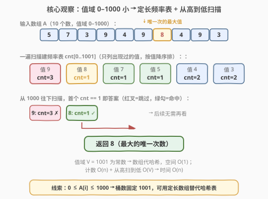
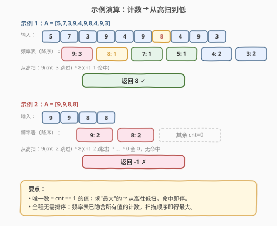

# 最大唯一数

- **题目名称**：最大唯一数
- **链接**：[1133. 最大唯一数](https://leetcode.cn/problems/largest-unique-number/)
- **难度**：简单
- **标签**：数组、哈希表、计数

## 1. 题目概述

给定一个整数数组 `A`，返回其中**只出现一次**的数字里**最大**的那个。如果不存在只出现一次的数字，返回 `-1`。

**示例 1**：

```text
输入：A = [5,7,3,9,4,9,8,4,9,3]
输出：8
解释：只出现一次的数字有 5、7、8，其中最大的是 8。
```

**示例 2**：

```text
输入：A = [9,9,8,8]
输出：-1
解释：每个数字都出现了两次，没有只出现一次的数字。
```

**约束条件**：

- `1 <= A.length <= 2000`
- `0 <= A[i] <= 1000`

> 💡 注意值域 **0–1000** 是本题的关键线索：桶的个数固定为 1001，可以用一个定长数组代替哈希表，空间直接归约成 $O(1)$；并且要求"最大"，从高往低扫到首个 `cnt == 1` 即可，无需排序。

---

## 2. 解题思路

### 2.1 暴力思路：双重循环逐个计数

对每个元素 `A[i]`，再扫一遍整个数组统计它在 `A` 中出现的次数 `c`。若 `c == 1`，用它更新答案的最大值。时间 $O(n^2)$，当 $n = 2000$ 时约 $4 \times 10^6$ 次比较，虽然在本题数据规模下勉强可过，但**完全没必要**——我们反复对同一个值从头数次数，做了大量重复工作。

问题在于：每个值的出现次数是数组的**固有属性**，算一次就够了。如果能先把"每个值出现几次"一次性记下来，后续只需查表。

### 2.2 核心观察：定长频率表 + 从高到低扫描



**两步转换**：

1. **计数**：值域 $0 \le A[i] \le 1000$，开一个长度为 1001 的数组 `cnt`，一遍扫描 `A`，`cnt[x]++`。这一步把"每个值出现几次"在 $O(n)$ 内全部算完。
2. **取最大**：题目要的是"出现一次的数里最大的"。既然 `cnt` 的下标就是值本身，从 `x = 1000` 往下扫到 `0`，**第一个满足 `cnt[x] == 1` 的 `x` 就是答案**——因为下标天然有序，从大到小扫描命中的第一个必然最大。若一路扫完都没命中，返回 `-1`。

> 为什么从高往低扫而不是遍历 `A` 找最大？因为频率表的下标即值、且天然有序。遍历 `A` 找最大唯一次数需要对每个元素再查 `cnt` 并维护 `max`，多一次 $O(n)$；而从高往低扫只需 $O(1001) = O(1)$，且命中即返回、提前剪枝。

> ⚠️ 注意 `cnt[x] == 1` 是**严格等于 1**，不是 `> 0`。出现多次（`cnt >= 2`）的值要跳过，这正是"唯一"二字的含义。

### 2.3 算法流程图


**完整步骤**：

1. **初始化**：`cnt[0..1000] = {0}`。
2. **阶段一（计数）**：遍历每个 `x` in `A`，执行 `cnt[x] += 1`。
3. **阶段二（取最大）**：令 `x` 从 `1000` 递减到 `0`：
   - 若 `cnt[x] == 1`，立即 `return x`。
4. **兜底**：循环正常结束（无一命中），`return -1`。

> 💡 阶段二可提前终止：一旦命中 `cnt[x] == 1` 就返回，后面的更小值无需再看。最坏情况（所有数都出现 $\ge 2$ 次，或唯一值是 0）才扫满 1001 个桶。

### 2.4 示例演算

以示例 1 `A = [5,7,3,9,4,9,8,4,9,3]` 与示例 2 `A = [9,9,8,8]` 为例：



**示例 1**：

- 阶段一计数得到（按值降序列出）：`9→3, 8→1, 7→1, 5→1, 4→2, 3→2`。
- 阶段二从 `1000` 往下扫，跳过所有 `cnt == 0` 的桶，到 `x = 9` 时 `cnt = 3`（跳过），到 `x = 8` 时 `cnt = 1`（命中），返回 `8`。后续 `7、5` 虽也是唯一数，但更小，无需再看。

**示例 2**：

- 计数得到：`9→2, 8→2`，其余桶 `cnt = 0`。
- 从 `1000` 往下扫：`9` 跳过、`8` 跳过、……、`0` 全为 0，无一命中，返回 `-1`。

---

## 3. 参考代码

### 方法一：定长频率表 + 从高到低扫描（推荐）

### C++

```cpp
class Solution {
public:
    int largestUniqueNumber(vector<int>& A) {
        int cnt[1001] = {0};
        for (int x : A) cnt[x]++;
        for (int x = 1000; x >= 0; x--)
            if (cnt[x] == 1) return x;
        return -1;
    }
};
```

### Python

```python
class Solution:
    def largestUniqueNumber(self, A: List[int]) -> int:
        cnt = [0] * 1001
        for x in A:
            cnt[x] += 1
        for x in range(1000, -1, -1):
            if cnt[x] == 1:
                return x
        return -1
```

> 💡 **为什么用定长数组而非 `unordered_map`/`Counter`？** 值域 0–1000，桶数固定 1001，数组下标即值，访问 $O(1)$ 且无哈希常数；从高到低扫还能天然按"值的大小"遍历，省去排序或维护 `max`。这是"值域小 → 用数组代哈希"的常见优化（与 [448. 找到所有数组中消失的数字](../0401-0500/448_找到所有数组中消失的数字.md) 的下标当哈希键同理）。

### 方法二：哈希计数 + 维护最大值（值域无界时的通用写法）

> 当值域没有上界（例如 $A[i]$ 可达 $10^9$）时，定长数组不可用，改用哈希表计数，并在遍历键值时维护"唯一次数的最大值"。

### C++

```cpp
class Solution {
public:
    int largestUniqueNumber(vector<int>& A) {
        unordered_map<int, int> cnt;
        for (int x : A) cnt[x]++;
        int ans = -1;
        for (auto& [x, c] : cnt)
            if (c == 1) ans = max(ans, x);
        return ans;
    }
};
```

### Python

```python
class Solution:
    def largestUniqueNumber(self, A: List[int]) -> int:
        from collections import Counter
        cnt = Counter(A)
        ans = -1
        for x, c in cnt.items():
            if c == 1:
                ans = max(ans, x)
        return ans
```

---

## 4. 复杂度分析

| 维度 | 方法一（定长数组） | 方法二（哈希表） |
|------|-------------------|------------------|
| **时间** | $O(n)$ | $O(n)$ |
| **空间** | $O(1)$ | $O(\min(n, V))$ |

> ⚠️ **时间** $O(n)$：方法一阶段一遍历 $n$ 个元素各 $O(1)$；阶段二扫 1001 个桶，与 $n$ 无关，是常数。方法二一遍计数 $O(n)$ + 遍历哈希表至多 $n$ 个键 $O(n)$，总计 $O(n)$。
>
> **空间**：方法一桶数恒为 1001，与 $n$ 无关，是 $O(1)$（本题值域红利）。方法二哈希表最多存 $\min(n, V)$ 个键，$V$ 为不同值个数；当值域无界时退化为 $O(n)$。

---

## 5. 扩展：排序 + 单遍扫描

若不想开频率表，也可**排序后扫描**：将 `A` 升序排序，则相同值必相邻。一个值"唯一"当且仅当它**既不等于前一个、也不等于后一个**（边界处只看一侧）。从右往左扫（即从大到小），命中的第一个就是答案。

```cpp
class Solution {
public:
    int largestUniqueNumber(vector<int>& A) {
        sort(A.begin(), A.end());
        int n = A.size();
        for (int i = n - 1; i >= 0; i--) {
            bool leftOk  = (i == 0)     || (A[i] != A[i - 1]);
            bool rightOk = (i == n - 1) || (A[i] != A[i + 1]);
            if (leftOk && rightOk) return A[i];
        }
        return -1;
    }
};
```

时间 $O(n \log n)$、空间 $O(\log n)$（排序栈），不如方法一。但思路可作为"无法开大数组、又不愿用哈希"时的折中。

---

## 6. 面试要点

1. **为什么从高往低扫频率表，而不是遍历原数组找最大？**

   > 频率表的下标即值、且天然有序递增。从 `1000` 往下扫命中的第一个 `cnt == 1` 必然是最大的唯一数，且命中即返回、提前剪枝。遍历原数组则需对每个元素查 `cnt` 再维护 `max`，多一趟 $O(n)$，且无法提前终止。

2. **`cnt[x] == 1` 写成 `cnt[x] > 0` 会怎样？**

   > 会把出现多次的值也算进来，答错。例如示例 1 会返回 `9`（出现 3 次）。"唯一"要求**严格出现一次**，必须判 `== 1`。

3. **为什么能用定长数组 `cnt[1001]`？**

   > 约束保证 $0 \le A[i] \le 1000$，值域大小 1001 是常数。数组下标直接当值，访问 $O(1)$ 无哈希开销，空间 $O(1)$。这是"值域小 → 数组代哈希"的招牌优化。

4. **如果值域扩大到 $10^9$ 还能这么做吗？**

   > 定长数组不可用（开 $10^9$ 太大）。改用哈希表计数（方法二），思路不变，空间退化为 $O(n)$；或排序后单遍扫描（第 5 节），时间 $O(n \log n)$、空间 $O(\log n)$。

5. **如果题目改成"出现偶数次的最大值"或"第 k 个唯一数"呢？**

   > 计数这一步不变，只是判定条件从 `== 1` 换成 `c % 2 == 0`，或收集所有唯一数后排序取第 k 大。频率表 + 条件过滤的骨架可复用。

> 💡 **一句话总结**：1133 的本质是"频率计数 + 条件过滤取最值"。值域小 → 定长数组代哈希、空间 $O(1)$；求最大 → 从高往低扫、命中即返。这套"值域→数组 + 逆序扫描取最值"思路可直接迁移到值域受限的计数类问题。

---

## 7. 同类练习题

- [448. 找到所有数组中消失的数字](https://leetcode.cn/problems/find-all-numbers-disappeared-in-an-array/)（[题解](../0401-0500/448_找到所有数组中消失的数字.md)）：值域 $1\sim n$ 用下标当哈希键，同"值域小→数组代哈希"优化
- [697. 数组的度](https://leetcode.cn/problems/degree-of-an-array/)：频率统计 + 记录首尾下标求最短子数组，同为"频率表"基础题
- [136. 只出现一次的数字](https://leetcode.cn/problems/single-number/)：经典的"找唯一"，但用异或（其余均出现两次自动抵消）；1133 出现次数不限且求最大，需计数而非异或
- [287. 寻找重复数](https://leetcode.cn/problems/find-the-duplicate-number/)：值域 $1\sim n$ 找重复，对照"值域小"线索但解法不同（Floyd 判圈 / 二分）
- [442. 数组中重复的数据](https://leetcode.cn/problems/find-all-duplicates-in-an-array/)：值域 $1\sim n$ 用下标取负标记找所有重复值，与 448 同模板
