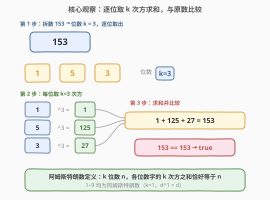
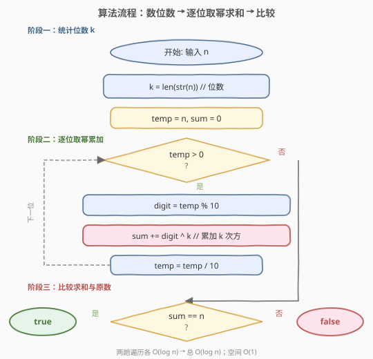
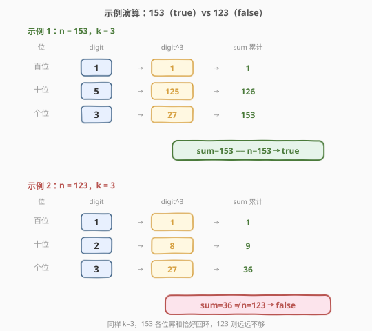

# LeetCode 阿姆斯特朗数 题解

## 1. 题目概述

- **标题 / 题号**：阿姆斯特朗数（#1134，easy）
- **链接**：https://leetcode.cn/problems/armstrong-number/
- **难度**：简单
- **标签**：数学、模拟

**题意**：给你一个整数 `n`，判断它是否为**阿姆斯特朗数**（Armstrong Number，又称**自幂数**）。

一个 $k$ 位整数 `n` 是阿姆斯特朗数，当且仅当它的各位数字的 $k$ 次方之和恰好等于 `n` 本身：

$$
n = d_1^k + d_2^k + \dots + d_k^k
$$

其中 $d_1, d_2, \dots, d_k$ 是 $n$ 的各位数字，$k$ 是 $n$ 的位数。

**示例 1**：

```text
输入：n = 153
输出：true
解释：153 是 3 位数，1^3 + 5^3 + 3^3 = 1 + 125 + 27 = 153，等于原数。
```

**示例 2**：

```text
输入：n = 123
输出：false
解释：123 是 3 位数，1^3 + 2^3 + 3^3 = 1 + 8 + 27 = 36 ≠ 123。
```

**约束**：

- $1 \le n \le 10^8$

> 💡 注意 $n$ 最大为 $10^8 = 100{,}000{,}000$，共 9 位。即使最大位数 $k=9$，每位数字 $0$–$9$ 的 $9$ 次方最大为 $9^9 = 387{,}420{,}489$，$9$ 位全 9 的幂和为 $9 \times 387{,}420{,}489 \approx 3.49 \times 10^9$，仍在 32 位整数范围内（但接近上界，累加时需留意）。本题直接模拟即可，不需要数学优化。

## 2. 解题思路

### 2.1 暴力思路：按定义直接模拟

题目本身就是**定义判定题**：给一个数，按定义算一遍各位数字的 $k$ 次方之和，看等不等于原数。没有更巧妙的数学捷径——阿姆斯特朗数没有已知的简洁判定公式，直接模拟就是最优解。

唯一要注意的是**两阶段结构**：必须先知道位数 $k$（才能确定指数），再去逐位取幂求和。因此需要两趟遍历：第一趟数位数，第二趟累加幂和。

### 2.2 核心观察：两阶段模拟——数位数 → 逐位取幂求和



**关键转换**：

1. **数位数 $k$**：将 `n` 转为字符串取长度，或用循环除以 10 计数。
2. **逐位取幂**：对 `n` 的每一位数字 $d$，计算 $d^k$，累加到 `sum`。
3. **比较**：`sum == n` 则为阿姆斯特朗数。

> 💡 **为什么必须两阶段？** 因为指数 $k$ 依赖总位数，而总位数需要完整扫描一遍才能确定。不能"边取位边算"——在知道 $k$ 之前不知道用什么指数。一旦 $k$ 确定，第二趟逐位取幂就是纯粹的模拟。

> ⚠️ **不要修改原值 `n`**：第二趟需要保留 `n` 用于最终比较，所以取位操作要用临时变量 `temp = n`，否则 `n` 被消费完就丢了原值。

### 2.3 算法流程图



**完整步骤**：

1. **阶段一（数位数）**：令 $k$ 为 $n$ 的十进制位数。实现方式有两种：
   - **字符串法**：`k = len(str(n))`，简洁直观。
   - **循环法**：`temp = n; k = 0; while temp > 0: k += 1; temp //= 10`，无需字符串转换。
2. **阶段二（逐位取幂累加）**：`temp = n, sum = 0`，循环：
   - `digit = temp % 10`（取出个位）
   - `sum += digit ** k`（累加 $k$ 次方）
   - `temp //= 10`（去掉个位）
   - 直到 `temp == 0`。
3. **比较**：返回 `sum == n`。

> 💡 **幂运算的选型**：C++ 中用 `pow(digit, k)` 返回 `double`，需转回 `int`，有浮点精度隐患（`pow` 对大数可能不精确）。更稳妥的做法是手写一个快速幂或简单循环求 `digit^k`。Python 的 `**` 运算符对整数是精确大数运算，无此问题。

### 2.4 示例演算

以示例 1（`n = 153`，true）和示例 2（`n = 123`，false）对比演算：



**示例 1：n = 153，k = 3**

| 位 | digit | $d^3$ | sum 累计 |
|----|-------|-------|----------|
| 百位 | 1 | 1 | 1 |
| 十位 | 5 | 125 | 126 |
| 个位 | 3 | 27 | 153 |

$\text{sum} = 153 = n$ → **true**。

**示例 2：n = 123，k = 3**

| 位 | digit | $d^3$ | sum 累计 |
|----|-------|-------|----------|
| 百位 | 1 | 1 | 1 |
| 十位 | 2 | 8 | 9 |
| 个位 | 3 | 27 | 36 |

$\text{sum} = 36 \ne 123$ → **false**。

> 💡 两个数都是 3 位数（$k=3$），但 153 各位幂和恰好"回环"到自身，123 则远远不够。这就是阿姆斯特朗数的本质——数字的 $k$ 次方和恰好"自洽"。

## 3. 参考代码

### 方法一：字符串数位数 + 模拟取幂

### C++

```cpp
class Solution {
public:
    bool isArmstrong(int n) {
        string s = to_string(n);
        int k = s.size();
        long long sum = 0;
        int temp = n;
        while (temp > 0) {
            int digit = temp % 10;
            long long p = 1;
            for (int i = 0; i < k; i++) p *= digit;  // 手写幂运算，避免浮点
            sum += p;
            temp /= 10;
        }
        return sum == n;
    }
};
```

### Python

```python
class Solution:
    def isArmstrong(self, n: int) -> bool:
        k = len(str(n))
        total = 0
        temp = n
        while temp > 0:
            total += (temp % 10) ** k
            temp //= 10
        return total == n
```

> 💡 **C++ 用 `long long` 存 `sum`**：虽然约束 $n \le 10^8$，幂和最大约 $3.49 \times 10^9$ 超出 `int` 上界（$2.147 \times 10^9$），故用 `long long` 防溢出。Python 无此问题。

### 方法二：纯循环数位数（不转字符串）

> 💡 **何时选方法二？** 当不希望依赖字符串转换、或题目对类型严格时，用循环除 10 数位数同样 $O(\log n)$，无额外开销。

### C++

```cpp
class Solution {
public:
    bool isArmstrong(int n) {
        int k = 0;
        for (int t = n; t > 0; t /= 10) k++;  // 循环数位数
        long long sum = 0;
        for (int t = n; t > 0; t /= 10) {
            int digit = t % 10;
            long long p = 1;
            for (int i = 0; i < k; i++) p *= digit;
            sum += p;
        }
        return sum == n;
    }
};
```

### Python

```python
class Solution:
    def isArmstrong(self, n: int) -> bool:
        k, t = 0, n
        while t > 0:
            k += 1
            t //= 10
        total, t = 0, n
        while t > 0:
            total += (t % 10) ** k
            t //= 10
        return total == n
```

## 4. 复杂度分析

| 维度 | 复杂度 | 说明 |
|------|--------|------|
| **时间** | $O(\log n)$ | 两趟遍历各扫描 $\log_{10} n$ 位，每位的幂运算 $O(k) = O(\log n)$，总计 $O((\log n)^2)$；但 $\log_{10}(10^8) = 9$，实际是常数级 |
| **空间** | $O(1)$ | 仅用几个整型变量，不随 $n$ 增长 |

> ⚠️ 严格说每位的幂运算需 $O(k)$ 次乘法，总时间为 $O(k^2)$。但 $k \le 9$ 是常数，故整体为 $O(1)$ 实际复杂度。若用快速幂可降至 $O(k \log k)$，但 $k \le 9$ 时无必要。

## 5. 扩展：阿姆斯特朗数的数学背景

阿姆斯特朗数按位数有不同俗称：

| 位数 $k$ | 俗称 | 示例 |
|----------|------|------|
| 1 | 无特殊名 | 1, 2, …, 9（全部一位数都是） |
| 3 | **水仙花数**（Narcissistic Number） | 153, 370, 371, 407 |
| 4 | 四叶玫瑰数 | 1634, 8208, 9474 |
| 5 | 五角星数 | 54748, 92727, 93084 |

> 💡 3 位的水仙花数是最常见的面试考点（153）。数学上已证明：$k$ 位阿姆斯特朗数仅有有限个，且当 $k \ge 61$ 时不再存在（因为 $k \times 9^k < 10^{k-1}$，幂和永远达不到 $k$ 位数的最小值）。

## 6. 面试要点

1. **为什么需要两阶段，不能一趟完成？**

   > 指数 $k$ 是总位数，必须先完整数完位数才能确定。取第一位时还不知道总共有几位，也就不知道该用几次方。因此第一阶段数位数、第二阶段取幂求和是必须的。

2. **为什么 C++ 不直接用 `pow(digit, k)`？**

   > `pow` 返回 `double`，涉及浮点运算。虽然本题 $k \le 9$ 时通常不会出错，但浮点幂对大数有精度风险（如 `pow(9, 9)` 可能得到 $387420488.999\ldots$）。手写整数循环乘或快速幂更稳妥，是工程上的好习惯。

3. **`sum` 会溢出吗？用什么类型？**

   > 约束 $n \le 10^8$（9 位），最坏情况 $9 \times 9^9 = 3{,}486{,}784{,}401 > \text{INT\_MAX}$，故 C++ 中 `sum` 必须用 `long long`。Python 整数无上界，无需担心。

4. **所有一位数都是阿姆斯特朗数吗？**

   > 是的。一位数 $d$ 的位数 $k=1$，$d^1 = d$，恒等于自身。所以 1–9 全部返回 `true`。

5. **如果把约束改为 $n \le 10^{18}$，思路变吗？**

   > 思路不变，仍是数位数 + 逐位取幂。但 $k$ 最大到 19，幂和可达 $19 \times 9^{19} \approx 1.16 \times 10^{19}$，C++ 需用 `__int128` 或大整数，Python 则天然支持。算法层面无需改变。

> 💡 **一句话总结**：1134 是一道纯粹的**定义判定模拟题**——按阿姆斯特朗数的定义"数位数 $k$ → 逐位取 $k$ 次方求和 → 比较原数"即可。难点不在算法，而在正确处理两阶段结构与整数溢出。

## 同类练习题

| # | 题目 | 与本题的关联 |
|---|------|-------------|
| 9 | [回文数](https://leetcode.cn/problems/palindrome-number/)（[题解](../0001-0100/9_回文数.md)） | 同样涉及逐位取数，反转一半数字比较，数位操作的基础题 |
| 7 | [整数反转](https://leetcode.cn/problems/reverse-integer/) | 逐位取数 + 反转拼接，数位提取的招牌练习 |
| 258 | [各位相加](https://leetcode.cn/problems/add-digits/)（[题解](../0201-0300/258_各位相加.md)） | 反复数位求和直到一位数，数位操作的进阶（数字根公式） |
| 509 | [斐波那契数](https://leetcode.cn/problems/fibonacci-number/)（[题解](../0501-0600/509_斐波那契数.md)） | 同为简单数学模拟题，按定义递推即可 |
| 507 | [完美数](https://leetcode.cn/problems/perfect-number/) | 按定义枚举真因数求和判定，同样是"定义判定型"模拟题，可对比"按定义验证"的范式 |
