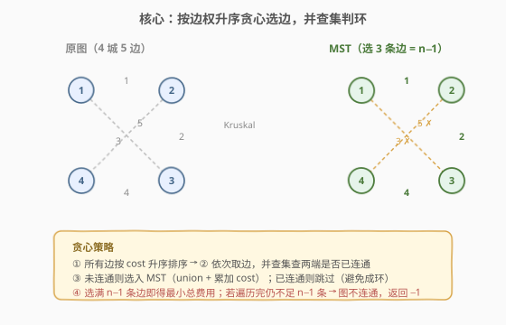
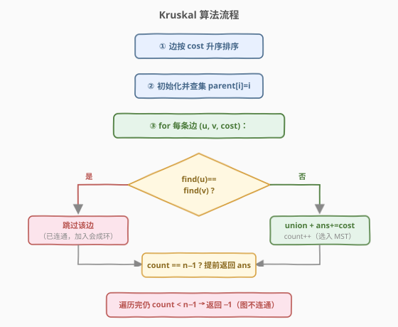
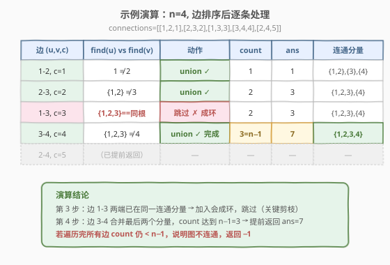

# LeetCode 最低成本联通所有城市 题解

## 1. 题目概述

- **标题 / 题号**：最低成本联通所有城市（#1135，medium）
- **链接**：https://leetcode.cn/problems/connecting-cities-with-minimum-cost/
- **难度**：中等
- **标签**：图、最小生成树、Kruskal、并查集、贪心

**题意**：有 `n` 座城市，编号 `1` 到 `n`。给定一个数组 `connections`，其中 `connections[i] = [u_i, v_i, cost_i]` 表示在城市 `u_i` 与 `v_i` 之间铺设一条管道的费用为 `cost_i`。请返回**联通所有城市所需的最小总费用**；若无法将所有城市联通，返回 `-1`。

本质上：给定一张**带权无向图**（显式给出边），求其**最小生成树（MST）**的权值之和；若图不连通则返回 `-1`。

**示例 1**：

```text
输入：n = 3, connections = [[1,2,5],[1,3,6],[2,3,1]]
输出：6
解释：选 2-3(费用 1) 和 1-2(费用 5)，总费用 1 + 5 = 6 即可联通三城。
```

**示例 2**：

```text
输入：n = 4, connections = [[1,2,3],[3,4,4]]
输出：-1
解释：只有两条边，1-2 把 {1,2} 连通、3-4 把 {3,4} 连通，但两组之间无任何边，
      4 座城无法全部联通，返回 -1。
```

**约束**：

- `1 <= n <= 100`
- `1 <= connections.length <= n * (n - 1) / 2`
- `connections[i].length == 3`
- `1 <= u_i, v_i <= n`，且 `u_i != v_i`
- `0 <= cost_i <= 10^5`
- 不存在重复边

## 2. 解题思路

### 2.1 暴力思路：枚举所有生成树？

`n` 个点的完全图有 $n^{n-2}$ 棵生成树（Cayley 公式）。即便 `n = 6` 也有 $6^4 = 1296$ 棵，`n = 10` 时高达 $10^8$ 棵——逐棵求权值和取最小完全不可行。

> 💡 转换视角：不要枚举生成树，而要**贪心地逐步加边**——把所有边按费用排序，从小到大依次尝试，能用就用、会成环就跳过。这正是 **Kruskal 算法**。本题边是**显式给出**的（稀疏图），Kruskal 是最自然的选择。

### 2.2 核心观察：Kruskal（排序 + 并查集判环）



核心思路：

- 将所有边按 `cost` **升序排序**。
- 依次扫描每条边 `(u, v, cost)`：用**并查集**查 `u`、`v` 是否已在同一连通分量。
  - **不在同一分量** → 选入 MST：`union(u, v)`，累加 `cost`，已选边数 `count++`。
  - **已在同一分量** → 跳过（再加会成环，不符合树的定义）。
- 选满 `n - 1` 条边即可提前返回总费用（`n` 个点的树恰有 `n - 1` 条边）。
- 若遍历完所有边 `count` 仍 `< n - 1`，说明图不连通，返回 `-1`。

> 💡 **贪心正确性（cut property）**：对于图的任意一个割（将顶点分为 $S$ 和 $V \setminus S$），跨割的**最短边**一定属于某棵 MST。Kruskal 按权值升序处理，当一条边 $(u,v)$ 的两端首次被连通时，它正是跨「$u$ 所在分量」与「$v$ 所在分量」这条割的最短边——因此选入不会出错。

> ⚠️ 与 [1584. 连接所有点的最小费用](../1501-1600/1584_连接所有点的最小费用.md) 的区别：1584 是**完全图**（边需由坐标在线计算，$E = n^2$），更适合 Prim 朴素 $O(n^2)$；本题边**显式给出**且通常远少于 $n^2$（稀疏图），Kruskal 的 $O(E \log E)$ 更优且实现更直观。另外本题多一个「图可能不连通 → 返回 −1」的判定。

### 2.3 算法流程图



### 2.4 示例演算

以 `n = 4, connections = [[1,2,1],[2,3,2],[1,3,3],[3,4,4],[2,4,5]]` 为例（5 条边，4 座城，需选 3 条）。

排序后顺序：`1-2(1) → 2-3(2) → 1-3(3) → 3-4(4) → 2-4(5)`。



| 步骤 | 边 (u,v,cost) | find(u) vs find(v) | 动作 | count | ans | 连通分量 |
|------|--------------|--------------------|------|-------|-----|----------|
| 1 | 1-2, c=1 | 1 ≠ 2 | union ✓ | 1 | 1 | {1,2},{3},{4} |
| 2 | 2-3, c=2 | {1,2} ≠ 3 | union ✓ | 2 | 3 | {1,2,3},{4} |
| 3 | 1-3, c=3 | {1,2,3} 同根 | 跳过 ✗ 成环 | 2 | 3 | {1,2,3},{4} |
| 4 | 3-4, c=4 | {1,2,3} ≠ 4 | union ✓ 完成 | 3=n−1 | 7 | {1,2,3,4} |
| 5 | 2-4, c=5 | — | 已提前返回 | — | — | — |

> 💡 **第 3 步是关键**：边 1-3 虽然费用只有 3，但此时 1 与 3 已同属一个分量（经 1-2、2-3 连通），加入会形成环 1-2-3-1，必须跳过——这正是并查集判环的价值。第 4 步选入 3-4 后 `count` 达到 `n−1 = 3`，提前返回 `ans = 7`。

## 3. 参考代码

### 方法：Kruskal + 并查集（路径压缩 + 按秩合并）

### C++

```cpp
class Solution {
  public:
    vector<int> parent, rank_;

    int find(int x) {
        return parent[x] == x ? x : parent[x] = find(parent[x]);
    }

    bool unite(int x, int y) {
        int fx = find(x), fy = find(y);
        if (fx == fy) return false;       // 已同根，合并失败
        if (rank_[fx] < rank_[fy]) swap(fx, fy);
        parent[fy] = fx;
        if (rank_[fx] == rank_[fy]) rank_[fx]++;
        return true;
    }

    int minimumCost(int n, vector<vector<int>>& connections) {
        // 按费用升序排序
        sort(connections.begin(), connections.end(),
             [](const auto& a, const auto& b) { return a[2] < b[2]; });

        parent.resize(n + 1);
        rank_.resize(n + 1, 0);
        iota(parent.begin(), parent.end(), 0);

        int ans = 0, count = 0;
        for (auto& c : connections) {
            int u = c[0], v = c[1], cost = c[2];
            if (unite(u, v)) {            // 两端未连通，选入 MST
                ans += cost;
                if (++count == n - 1) return ans;   // 选满 n-1 条边，提前返回
            }
        }
        return -1;                        // 遍历完仍不足 n-1 条，图不连通
    }
};
```

### Python

```python
class Solution:
    def minimumCost(self, n: int, connections: List[List[int]]) -> int:
        parent = list(range(n + 1))
        rank_ = [0] * (n + 1)

        def find(x: int) -> int:
            while parent[x] != x:
                parent[x] = parent[parent[x]]   # 路径压缩
                x = parent[x]
            return x

        def unite(x: int, y: int) -> bool:
            fx, fy = find(x), find(y)
            if fx == fy:
                return False
            if rank_[fx] < rank_[fy]:
                fx, fy = fy, fx
            parent[fy] = fx
            if rank_[fx] == rank_[fy]:
                rank_[fx] += 1
            return True

        # 按费用升序排序
        connections.sort(key=lambda c: c[2])

        ans = 0
        count = 0
        for u, v, cost in connections:
            if unite(u, v):
                ans += cost
                count += 1
                if count == n - 1:
                    return ans
        return -1
```

> 💡 **并查集两种优化**：① **路径压缩**——`find` 时顺手把节点直挂到根，将后续查询摊还到近似 $O(1)$；② **按秩合并**——矮树挂高树下，控制树高。二者并用后单次操作均摊 $O(\alpha(V))$，其中 $\alpha$ 是反阿克曼函数，对任意实际问题规模可视为常数。与 [684. 冗余连接](../0601-0700/684_冗余连接.md)、[547. 省份数量](../0501-0600/547_省份数量.md) 的并查集模板完全同源，只是这里用 `unite` 的返回值**判定是否选边**。

## 4. 复杂度分析

| 维度 | 复杂度 | 说明 |
|------|--------|------|
| 时间复杂度 | $O(E \log E)$ | 排序 $E$ 条边 $O(E \log E)$；并查集 $E$ 次 `find/unite` 均摊 $O(\alpha(V)) \approx O(1)$，总计 $O(E \cdot \alpha(V))$，被排序主导 |
| 空间复杂度 | $O(V)$ | 并查集 `parent`、`rank_` 数组各 $O(V)$；排序为原地（C++ `sort`）或 $O(E)$ 辅助（Python Timsort） |

> ⚠️ 本题 $n \le 100$、$E \le n(n-1)/2 \approx 4950$，$E \log E \approx 6 \times 10^4$，毫无压力。即便 $n$ 放大到 $10^5$、$E$ 到 $10^5$，Kruskal 也能在 $O(E \log E) \approx 1.7 \times 10^6$ 内通过——这正是稀疏图下 Kruskal 相对朴素 Prim $O(V^2)$ 的优势所在。

## 5. 扩展：为什么不选 Prim？

本题也可用 Prim（堆优化）求解：从任一城市出发，用最小堆维护跨集合边，每轮弹出最小者扩展集合，$n - 1$ 轮后累加即为答案。若某轮堆为空但集合未满 `n`，则图不连通返回 `-1`。

| 维度 | Kruskal（推荐） | 堆优化 Prim |
|------|-----------------|-------------|
| 时间 | $O(E \log E)$ | $O(E \log V)$ |
| 空间 | $O(V)$ | $O(E)$（堆存候选边） |
| 实现 | 排序 + 并查集，逻辑清晰 | 需建邻接表 + 堆懒删除 |
| 不连通判定 | `count < n-1` 自然得出 | 需额外判断「堆空但未选满」 |
| 适用 | **稀疏图、边显式给出** | 稠密图或点距需在线计算 |

> 💡 **本题选 Kruskal 的理由**：① 边已显式给出，排序即可，无需建邻接表；② 「不连通返回 −1」的判定与 `count` 计数天然契合；③ 并查集模板复用性强（684、547 同源）。仅当图是稠密的完全图且边需在线计算时（如 1584），才优先 Prim。

## 6. 面试要点

1. **Kruskal 和 Prim 怎么选？**

   - **Kruskal**（从边出发，排序 + 并查集）：适合**稀疏图**或边显式给出的场景，$O(E \log E)$。
   - **Prim**（从点出发，逐步扩展）：适合**稠密图**（如完全图），朴素 $O(V^2)$、堆优化 $O(E \log V)$。
   - 本题边显式给出且通常稀疏，Kruskal 实现更直观、空间更省。

2. **为什么 Kruskal 的贪心是正确的？**

   - 基于**割性质（cut property）**：对任意割，跨割的最短边必在某棵 MST 中。Kruskal 按权值升序处理，一条边两端首次被连通时，它正是跨当前分量的最短边，选入不会丢失最优性。

3. **如何判断图不连通？**

   - Kruskal 结束后检查已选边数 `count`：若 `count < n - 1`，说明无法选出 $n-1$ 条边构成生成树，图不连通，返回 `-1`。也可在并查集最后统计连通分量个数是否为 1。

4. **并查集的两个优化是什么？为什么一起用？**

   - **路径压缩**：`find` 时把节点直挂到根，降低后续查询深度。
   - **按秩合并**：矮树挂高树下，控制树高增长。
   - 二者并用后单次操作均摊 $O(\alpha(V))$（反阿克曼函数，实际可视为常数），是并查集的标准写法。

5. **提前返回的优化有必要吗？**

   - 有。选满 `n - 1` 条边后即可 `return ans`，避免扫描剩余边——最坏省下 $O(E)$ 次并查集操作。本题数据小差异不大，但在 $E$ 很大时是常数级优化，面试中体现「及时剪枝」意识。

## 同类练习题

| # | 题目 | 与本题的关联 |
|---|------|-------------|
| 1584 | [连接所有点的最小费用](https://leetcode.cn/problems/min-cost-to-connect-all-points/) | 完全图 MST，边由曼哈顿距离在线计算，适合朴素 Prim $O(n^2)$，对照本题稀疏图选 Kruskal |
| 684 | [冗余连接](https://leetcode.cn/problems/redundant-connection/) | 并查集判环母题，Kruskal 中 `unite` 返回 `false` 即同此题判定 |
| 547 | [省份数量](https://leetcode.cn/problems/number-of-provinces/) | 并查集数连通分量，MST 的前置知识，本题不连通判定同源 |
| 1168 | [水资源分配优化](https://leetcode.cn/problems/optimize-water-distribution-in-a-village/) | 虚拟节点 + MST，把「建水站」与「铺管道」统一为 Kruskal 选边 |
| 1489 | [找到最小生成树里的关键边和伪关键边](https://leetcode.cn/problems/find-critical-and-pseudo-critical-edges-in-minimum-spanning-tree/) | MST + 删边判定，Kruskal 进阶 |
