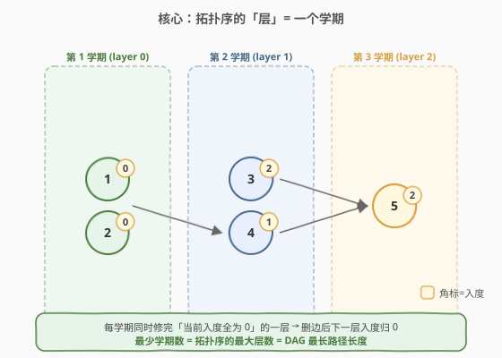
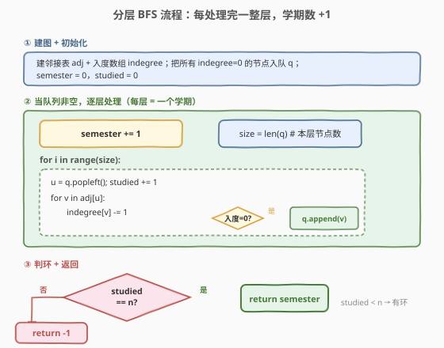
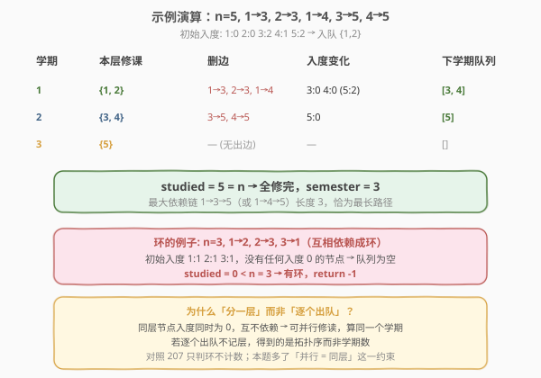

# LeetCode 平行课程 题解

## 1. 题目概述

- **标题 / 题号**：平行课程（#1136，medium）
- **链接**：https://leetcode.cn/problems/parallel-courses/
- **难度**：中等
- **标签**：图、广度优先搜索、拓扑排序、动态规划

**题意**：给定 `n` 门课程，编号 `1` 到 `n`，以及数组 `relations`，其中 `relations[i] = [prevCoursei, nextCoursei]` 表示**必须先修 `prevCoursei` 才能修 `nextCoursei`**。

在一个学期内，你可以修**任意数量**的课程，前提是这些课程的先修课都已在之前的学期修完。求完成全部 `n` 门课程所需的**最少学期数**；若存在循环依赖无法完成，返回 `-1`。

**示例 1**：

```text
输入：n = 3, relations = [[1,3],[2,3]]
输出：2
解释：第 1 学期修课程 1 和 2（无先修，可并行）；第 2 学期修课程 3。
```

**示例 2**：

```text
输入：n = 3, relations = [[1,2],[2,3],[3,1]]
输出：-1
解释：1→2→3→1 形成环，任何课程都无法开始，无解。
```

**约束**：

- `1 <= n <= 5000`
- `1 <= relations.length <= 5000`
- `relations[i].length == 2`
- `1 <= prevCoursei, nextCoursei <= n`，且 `prevCoursei != nextCoursei`
- 所有 `[prevCoursei, nextCoursei]` 互不相同

> 💡 本题是 [207. 课程表](../0201-0300/207_课程表.md) 的进阶：207 只问「能否修完」（判环），本题还要问「最少几个学期」。关键差别在于把 Kahn 拓扑排序从「逐个出队」改为「**按层出队**」——每一层就是可以并行修读的一个学期。

## 2. 解题思路

> ⚠️ **建图方向**：`[prev, next]` 表示先修 `prev` 才能修 `next`，对应有向边 `prev → next`（先修指向后修）。入度统计在 `next` 上：先修课修完后后修课的入度才归零。

### 2.1 暴力思路

模拟选课：每学期扫描所有课程，挑出「先修已全部完成」的全部课程标记完成，学期数 `+1`，重复到某学期无新增为止。每轮扫描 `O(V+E)`，最多 `V` 个学期，总复杂度 `O(V·(V+E))`，能过但浪费——每轮都重新扫描了已完成的边。

优化方向：用**入度数组 + 队列**，把同一时刻入度归零的课程归为「一层」一起处理，避免逐个重复扫描。这就是**分层 Kahn**，复杂度降到 `O(V+E)`。

### 2.2 核心观察：分层拓扑排序 = 最少学期数



关键直觉：

- **入度 = 0 的课程没有先修**，本学期就能修；同学期把它们全部修完（可并行）。
- 修完后删掉这些课程的出边，邻点入度各 `−1`；若某邻点入度因此降到 `0`，说明它的先修全修完了，归入**下一学期**。
- 像剥洋葱一样**一层一层**去掉入度 0 的节点，**层数 = 最少学期数**。
- 若最终完成数 `< n`，剩下的课程互相依赖成环，返回 `-1`。

> 💡 一句话：**最少学期数 = 拓扑序的最大层数 = DAG 中的最长路径长度**（关键路径）。因为最长依赖链上的课程必须严格逐学期修读，无法压缩；而链外的课程总能塞进对应层并行完成。

### 2.3 算法流程图



与 207 的区别只有一处：**每轮 `while` 不是弹出单个节点，而是弹出当前队列里的全部节点（一整层）**，处理完后 `semester += 1`。这样每个学期内并行修完所有「同时就绪」的课程。

### 2.4 示例演算



以 `n = 5`、`relations = [[1,3],[2,3],[1,4],[3,5],[4,5]]`（边 `1→3, 2→3, 1→4, 3→5, 4→5`）为例：

| 学期 | 本层修课 | 删边 | 入度变化 | 下学期队列 | studied |
|------|----------|------|----------|------------|---------|
| 初始 | — | — | 1:0 2:0 3:2 4:1 5:2 | `[1,2]` | 0 |
| 1 | {1, 2} | 1→3, 2→3, 1→4 | 3:0, 4:0 | `[3,4]` | 2 |
| 2 | {3, 4} | 3→5, 4→5 | 5:0 | `[5]` | 4 |
| 3 | {5} | — | — | `[]` | 5 |

`studied = 5 = n`，全修完，`semester = 3`。最长依赖链 `1→3→5`（或 `1→4→5`）长度恰好为 3，印证「层数 = 最长路径」。

> ⚠️ **环的例子**：`n=3, 1→2→3→1`，初始入度 `1:1 2:1 3:1`，没有任何入度 0 的节点，队列为空，`studied=0 < n`，直接返回 `-1`。

## 3. 参考代码

### 方法一：分层 BFS 拓扑排序（推荐）

### C++

```cpp
class Solution {
  public:
    int minimumSemesters(int n, vector<vector<int>>& relations) {
        vector<vector<int>> adj(n + 1);          // 编号 1..n，下标 0 留空
        vector<int> indegree(n + 1, 0);
        for (auto& r : relations) {              // prev -> next
            adj[r[0]].push_back(r[1]);
            indegree[r[1]]++;
        }

        queue<int> q;
        for (int i = 1; i <= n; ++i)
            if (indegree[i] == 0) q.push(i);

        int semester = 0, studied = 0;
        while (!q.empty()) {
            int size = q.size();                 // 本层 = 本学期可修课程数
            for (int i = 0; i < size; ++i) {
                int u = q.front(); q.pop();
                studied++;
                for (int v : adj[u])
                    if (--indegree[v] == 0) q.push(v);
            }
            semester++;                          // 一层处理完，过完一个学期
        }
        return studied == n ? semester : -1;     // 没修完 = 有环
    }
};
```

### Python

```python
from collections import deque

class Solution:
    def minimumSemesters(self, n: int, relations: List[List[int]]) -> int:
        adj = [[] for _ in range(n + 1)]
        indegree = [0] * (n + 1)
        for prev, nxt in relations:              # prev -> next
            adj[prev].append(nxt)
            indegree[nxt] += 1

        q = deque(i for i in range(1, n + 1) if indegree[i] == 0)
        semester = 0
        studied = 0
        while q:
            for _ in range(len(q)):              # 本层 = 本学期全部课程
                u = q.popleft()
                studied += 1
                for v in adj[u]:
                    indegree[v] -= 1
                    if indegree[v] == 0:
                        q.append(v)
            semester += 1
        return semester if studied == n else -1
```

### 方法二：拓扑序 DP 求 DAG 最长路径

由于「最少学期数 = DAG 最长路径长度」，可先做一次普通 Kahn 拓扑排序得到拓扑序，再在拓扑序上做 DP：`dp[v] = max(dp[u]) + 1`（对所有入边 `u→v`）。答案为 `max(dp)`，若有环则拓扑序长度 `< n` 返回 `-1`。

### C++

```cpp
class Solution {
  public:
    int minimumSemesters(int n, vector<vector<int>>& relations) {
        vector<vector<int>> adj(n + 1);
        vector<int> indegree(n + 1, 0);
        for (auto& r : relations) {
            adj[r[0]].push_back(r[1]);
            indegree[r[1]]++;
        }

        queue<int> q;
        for (int i = 1; i <= n; ++i)
            if (indegree[i] == 0) q.push(i);

        vector<int> dp(n + 1, 1);                // dp[i] = 以 i 结尾的最长路径
        int studied = 0;
        while (!q.empty()) {
            int u = q.front(); q.pop();
            studied++;
            for (int v : adj[u]) {
                dp[v] = max(dp[v], dp[u] + 1);
                if (--indegree[v] == 0) q.push(v);
            }
        }
        if (studied < n) return -1;
        return *max_element(dp.begin() + 1, dp.end());
    }
};
```

> 💡 **两种方法对比**：方法一直接按层计数，天然得到「学期数」，最直观；方法二把问题转化为「DAG 最长路径」，思路可迁移到带权关键路径、任务调度等变体。两者复杂度相同，面试首选方法一。

## 4. 复杂度分析

| 维度 | 方法 | 复杂度 | 说明 |
|------|------|--------|------|
| 时间复杂度 | 分层 BFS | $O(V+E)$ | 建图 $O(E)$；每点入队出队各一次 $O(V)$；每条边在删边时访问一次 $O(E)$ |
| 空间复杂度 | 分层 BFS | $O(V+E)$ | 邻接表 $O(V+E)$，入度数组与队列 $O(V)$ |
| 时间复杂度 | 拓扑 DP | $O(V+E)$ | 同上，额外做一遍 DP 松弛，每条边松弛一次 |
| 空间复杂度 | 拓扑 DP | $O(V+E)$ | 邻接表 $O(V+E)$，dp 数组 $O(V)$ |

> ⚠️ 本题 $n$ 上界 5000，递归 DFS 求最长路径也安全；但若规模放到 $10^5$，应改用 BFS 避免栈溢出。

## 5. 扩展：带权关键路径与任务调度

本题是**关键路径方法（CPM）**的无权特例：每门课耗时 1 个学期。若每门课耗时不同（带权），最少完工时间即为 DAG 上的**最长带权路径**，做法仍是拓扑序 DP，只是转移改为 `dp[v] = max(dp[u] + cost[v])`。

这一模型直接对应 [2050. 并行课程 III](https://leetcode.cn/problems/parallel-courses-iii/)：每门课有不同 `time[i]`，同一学期的课程**并行**完成（该学期时长 = 本层 `time` 的最大值），求最早完成所有课程的总时间。解法仍是分层拓扑 + DP，只是 `dp[v] = max(dp[u]) + time[v]`，且同层节点不互相阻塞。

## 6. 面试要点

1. **本题和 207 课程表的区别在哪？**
   - 207 只判环（能否修完），用普通 Kahn 逐个出队即可；本题还要算**最少学期数**，必须**按层**出队，一层 = 一个学期，层数即为答案。

2. **为什么按层出队得到的就是最少学期数？**
   - 同层节点入度同时为 0，互不依赖，可并行修读，理应算同一学期；不同层之间存在先修约束，必须分学期。因此层数 = 不可压缩的最少学期数，等于 DAG 最长路径长度。

3. **如何检测环并返回 -1？**
   - 流程结束后 `studied < n`，说明有节点入度始终未归零、困在环里，返回 `-1`。也可在初始化时若队列为空直接判环。

4. **能否用 DFS 求最长路径？**
   - 可以：对每个未访问节点 DFS，`dp[u] = 1 + max(dp[v])`（`v` 为 `u` 的后继），需配合三色标记判环。但递归深度可达 $V$，大规模数据建议用 BFS。

5. **`relations` 方向怎么建？为什么容易写反？**
   - `[prev, next]` 是「先修 prev 再修 next」，对应 `prev → next`（先修指向后修）。若误建为 `next → prev`，入度会算到先修课上，导致本应先修的课永远进不了队，答案错误。

## 同类练习题

| # | 题目 | 与本题的关联 |
|---|------|-------------|
| 207 | [课程表](https://leetcode.cn/problems/course-schedule/) | 本题的无层数版，只判环能否修完，普通 Kahn 逐个出队 |
| 210 | [课程表 II](https://leetcode.cn/problems/course-schedule-ii/) | Kahn 出队顺序即拓扑序，输出一个合法选课顺序 |
| 2050 | [并行课程 III](https://leetcode.cn/problems/parallel-courses-iii/) | 本题带权版，每门课 `time[i]` 不同，分层拓扑 + DP 求最长带权路径 |
| 329 | [矩阵中的最长递增路径](https://leetcode.cn/problems/longest-increasing-path-in-a-matrix/) | 拓扑排序 + DP 求 DAG 最长路径，思路可迁移 |
| 802 | [找到最终的安全状态](https://leetcode.cn/problems/find-eventual-safe-states/) | 反向图拓扑排序判安全节点，拓扑思想的另一变体 |
