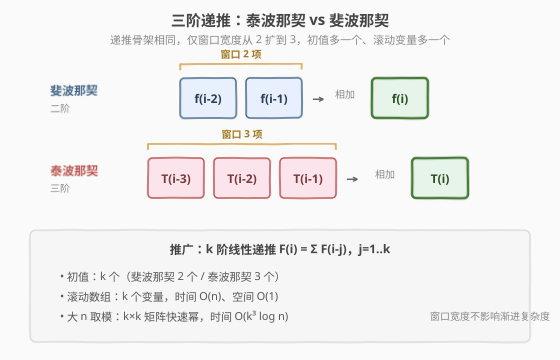
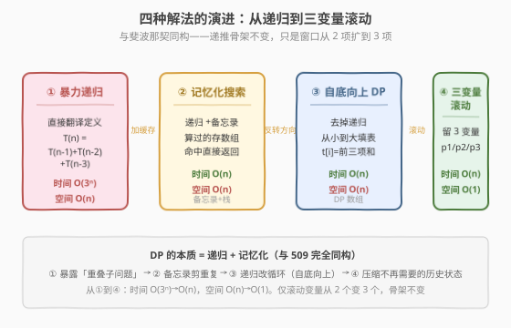
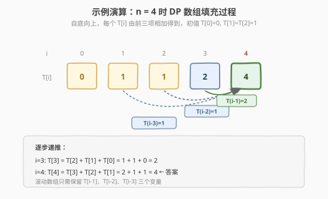

# 第 N 个泰波那契数

- **题目名称**：第 N 个泰波那契数
- **链接**：[1137. 第 N 个泰波那契数](https://leetcode.cn/problems/n-th-tribonacci-number/)
- **难度**：简单
- **标签**：动态规划、递归、记忆化搜索

## 1. 题目概述

泰波那契数列（Tribonacci，记作 `T(n)`）定义如下：

$$T(n) = \begin{cases} 0, & n = 0 \\ 1, & n = 1 \\ 1, & n = 2 \\ T(n-1) + T(n-2) + T(n-3), & n > 2 \end{cases}$$

给定 `n`，返回 `T(n)` 的值。

**示例 1**：

```text
输入：n = 4
输出：4
解释：
T(3) = T(0) + T(1) + T(2) = 0 + 1 + 1 = 2
T(4) = T(1) + T(2) + T(3) = 1 + 1 + 2 = 4
```

**示例 2**：

```text
输入：n = 25
输出：1389537
解释：T(25) = 1389537
```

**约束条件**：

- `0 <= n <= 37`

> 💡 这是 [509. 斐波那契数](../0501-0600/509_斐波那契数.md) 的**三阶递推广版**——把「前 2 项之和」升级成「前 3 项之和」，递推骨架完全相同，仅初值多一个、滚动数组多一个变量。掌握了 509 的「递归 → 记忆化 → 自底向上 → 滚动数组」演化链，本题只需把窗口从 2 扩到 3。

---

## 2. 解题思路

### 2.1 暴力思路：直接翻译定义的递归

把递推式逐字翻译成递归函数：

```text
trib(5)
├── trib(4)
│   ├── trib(3)
│   │   ├── trib(2) = 1
│   │   ├── trib(1) = 1
│   │   └── trib(0) = 0
│   ├── trib(2)            ← 重复！
│   └── trib(1)            ← 重复！
├── trib(3)                ← 重复！
│   ├── trib(2)            ← 重复！
│   ├── trib(1)            ← 重复！
│   └── trib(0)            ← 重复！
└── trib(2)                ← 重复！
```

与斐波那契一样，暴力递归的病灶是**重叠子问题**：每个 `trib(k)` 在多个分支里被反复求解。三阶递推的分支因子是 3，调用总数随 `n` **指数增长**（约 $O(3^n)$，更精确地是 $O(\alpha^n)$，$\alpha \approx 1.839$ 为方程 $x^3=x^2+x+1$ 的最大实根）。`n=37` 时调用次数高达 $10^9$ 量级，**直接超时**。

> ⚠️ 子问题总数只有 `n+1` 个（`T(0)` 到 `T(n)`），却做了指数级的工作——这正是**记忆化搜索**与**动态规划**出场的契机。

### 2.2 核心观察：三阶递推 + 重叠子问题

**关键定义**：设 `T(i)` = 第 `i` 个泰波那契数。

**核心思考**：`T(i)` 由前 3 项唯一确定，且同一子问题被多次求解。每个子问题只需算一次，之后命中缓存直接返回即可。这就是**记忆化搜索**（top-down DP）：



```text
trib(n, memo):
    if n in memo:           // 命中缓存，O(1) 返回
        return memo[n]
    if n == 0: return 0
    if n <= 2: return 1     // T(1)=T(2)=1
    memo[n] = trib(n-1, memo) + trib(n-2, memo) + trib(n-3, memo)
    return memo[n]
```

加了备忘录后，每个 `trib(k)` 只被**真正计算一次**，其余调用都是 `O(1)` 的缓存命中。递归树被「剪」成了线性结构，时间从 $O(3^n)$ 降到 $O(n)$。

> 💡 **DP 的本质就是递归 + 记忆化**。所谓「最优子结构」在这里体现为 `T(n)` 可由 `T(n-1)`、`T(n-2)`、`T(n-3)` 唯一确定；「重叠子问题」体现为同一个 `T(k)` 被多个上层状态依赖。这与 509 完全同构，只是依赖项从 2 个变 3 个。

### 2.3 从自顶向下到自底向上：DP 数组

记忆化搜索是「自顶向下」——从 `T(n)` 出发递归到 base case，回溯时填表。既然填表顺序确定，**何不直接反过来**，从 `T(0)` 往上算？这就是**自底向上 DP**，去掉了递归栈：



**四步法**（所有 DP 题通用）：

1. **状态定义**：`T(i)` = 第 `i` 个泰波那契数
2. **转移方程**：$T(i) = T(i-1) + T(i-2) + T(i-3)$，$i > 2$
3. **初始条件**：$T(0) = 0$，$T(1) = 1$，$T(2) = 1$（比斐波那契多一个初值）
4. **计算顺序**：从 `i=3` 到 `i=n`，**自底向上**

> 💡 **与 509 的关键差异**：① 初值从 2 个变 3 个（`T(0), T(1), T(2)`）；② 循环起点从 `i=2` 变 `i=3`；③ 滚动数组从 2 变量变 3 变量。递推骨架的「形状」未变，只是窗口更宽。

### 2.4 滚动数组优化 + 示例演算

`T(i)` 只依赖 `T(i-1)`、`T(i-2)`、`T(i-3)`，更早的状态（`T(i-4)` 及以前）**不再被引用**——不需要存整个数组，用三个变量滚动即可。

以 `n=4` 为例，看 `T` 数组如何从初值递推到答案：



| i | T(i-3) | T(i-2) | T(i-1) | T(i) = T(i-1)+T(i-2)+T(i-3) | 说明 |
|---|--------|--------|--------|------------------------------|------|
| 0 | — | — | — | 0 | 初值 |
| 1 | — | — | — | 1 | 初值 |
| 2 | — | — | — | 1 | 初值 |
| 3 | T(0)=0 | T(1)=1 | T(2)=1 | 0+1+1=**2** | 三项相加 |
| 4 | T(1)=1 | T(2)=1 | T(3)=2 | 1+1+2=**4** | 答案 |

最终 `T(4) = 4`。滚动数组只需 `p3`（存 `T(i-3)`）、`p2`（存 `T(i-2)`）、`p1`（存 `T(i-1)`）三个变量。

> 💡 **推广规律**：`k` 阶线性递推（`F(i) = Σ_{j=1}^{k} F(i-j)`）的滚动数组需要 `k` 个变量，时间仍 `O(n)`、空间仍 `O(k) = O(1)`。窗口宽度不影响渐进复杂度，只影响常数。

---

## 3. 参考代码

### C++

```cpp
// 第N个泰波那契数.cpp —— 四种解法对比
// 编译: g++ -O2 -std=c++17 第N个泰波那契数.cpp -o trib
#include <vector>
using namespace std;

// 版本 1：暴力递归（O(3ⁿ)，仅作对照，n=37 时调用次数达 10⁹ 量级）
class Solution1 {
  public:
    int tribonacci(int n) {
        if (n == 0) return 0;
        if (n <= 2) return 1;
        return tribonacci(n - 1) + tribonacci(n - 2) + tribonacci(n - 3);
    }
};

// 版本 2：记忆化搜索 / 自顶向下 DP（O(n) 时间，O(n) 空间）
class Solution2 {
  public:
    int tribonacci(int n) {
        vector<int> memo(n + 1, -1);
        return dfs(n, memo);
    }
  private:
    int dfs(int n, vector<int>& memo) {
        if (n == 0) return 0;
        if (n <= 2) return 1;
        if (memo[n] != -1) return memo[n];        // 命中缓存
        return memo[n] = dfs(n - 1, memo) + dfs(n - 2, memo) + dfs(n - 3, memo);
    }
};

// 版本 3：自底向上 DP 数组（O(n) 时间，O(n) 空间）
class Solution3 {
  public:
    int tribonacci(int n) {
        if (n == 0) return 0;
        if (n <= 2) return 1;
        vector<int> t(n + 1);
        t[0] = 0; t[1] = 1; t[2] = 1;
        for (int i = 3; i <= n; ++i)
            t[i] = t[i - 1] + t[i - 2] + t[i - 3];
        return t[n];
    }
};

// 版本 4：滚动数组（O(n) 时间，O(1) 空间，推荐）
class Solution {
  public:
    int tribonacci(int n) {
        if (n == 0) return 0;
        if (n <= 2) return 1;
        int p3 = 0;  // T(0)
        int p2 = 1;  // T(1)
        int p1 = 1;  // T(2)
        for (int i = 3; i <= n; ++i) {
            int cur = p1 + p2 + p3;   // T(i) = T(i-1) + T(i-2) + T(i-3)
            p3 = p2;                  // 滚动：T(i-3) <- T(i-2)
            p2 = p1;                  // 滚动：T(i-2) <- T(i-1)
            p1 = cur;                 // 滚动：T(i-1) <- T(i)
        }
        return p1;
    }
};
```

### Python

```python
class Solution:
    def tribonacci(self, n: int) -> int:
        if n == 0:
            return 0
        if n <= 2:
            return 1
        p3, p2, p1 = 0, 1, 1           # T(0), T(1), T(2)
        for i in range(3, n + 1):
            p3, p2, p1 = p2, p1, p1 + p2 + p3   # 三变量同时滚动
        return p1
```

记忆化搜索版本（Python 的 `functools.cache` 一行搞定）：

```python
from functools import cache

class Solution:
    def tribonacci(self, n: int) -> int:
        @cache
        def dfs(k: int) -> int:
            if k == 0:
                return 0
            if k <= 2:
                return 1
            return dfs(k - 1) + dfs(k - 2) + dfs(k - 3)
        return dfs(n)
```

> 💡 Python 的 `p3, p2, p1 = p2, p1, p1 + p2 + p3` 是**同时赋值**——右边整体求值后再赋给左边，无需临时变量。这是三变量滚动的最简写法，比 C++ 的三行赋值更不易出错。与 [509. 斐波那契数](../0501-0600/509_斐波那契数.md) 的 `a, b = b, a + b` 完全同构，只是多一项。

---

## 4. 复杂度分析

| 维度 | 暴力递归 | 记忆化搜索 | 自底向上 DP | 滚动数组 |
|------|----------|------------|-------------|----------|
| **时间复杂度** | `O(3ⁿ)` | `O(n)` | `O(n)` | `O(n)` |
| **空间复杂度** | `O(n)`（递归栈） | `O(n)`（备忘录+栈） | `O(n)`（DP 数组） | `O(1)` |
| **说明** | 重复计算子问题 | 缓存命中剪枝 | 循环填表无栈开销 | 只保留 3 变量 |
| **最优时间** | — | — | — | `O(log n)`（3×3 矩阵快速幂，见扩展） |

> 💡 本题 `n ≤ 37`，四种解法都能过；面试中推荐**滚动数组**版（版本 4），代码最短、空间最优。`T(37) = 2082876103`，恰好在 `int` 上限（约 $2.1 \times 10^9$）以内，C++ `int` 安全。

---

## 5. 扩展：3×3 矩阵快速幂

递推 $T(i) = T(i-1) + T(i-2) + T(i-3)$ 可写成矩阵形式：

$$\begin{pmatrix} T(i) \\ T(i-1) \\ T(i-2) \end{pmatrix} = \begin{pmatrix} 1 & 1 & 1 \\ 1 & 0 & 0 \\ 0 & 1 & 0 \end{pmatrix} \begin{pmatrix} T(i-1) \\ T(i-2) \\ T(i-3) \end{pmatrix}$$

记 $M = \begin{pmatrix} 1 & 1 & 1 \\ 1 & 0 & 0 \\ 0 & 1 & 0 \end{pmatrix}$，迭代展开得（$n \geq 2$）：

$$\begin{pmatrix} T(n) \\ T(n-1) \\ T(n-2) \end{pmatrix} = M^{\,n-2} \begin{pmatrix} T(2) \\ T(1) \\ T(0) \end{pmatrix} = M^{\,n-2} \begin{pmatrix} 1 \\ 1 \\ 0 \end{pmatrix}$$

矩阵幂用**快速幂**可在 `O(log n)` 内算出（每次矩阵乘法是 $3^3=27$ 次标量乘法，常数极小）。`n=37` 时收益不明显，但当题目把 `n` 放大到 $10^9$ 并要求取模时，这是唯一可行解法。

> 💡 **与 509 矩阵快速幂的对比**：斐波那契用 $2 \times 2$ 矩阵，泰波那契用 $3 \times 3$ 矩阵。一般地，`k` 阶线性递推对应 $k \times k$ 矩阵快速幂，时间 $O(k^3 \log n)$。模板见 [50. Pow(x, n)](../0001-0100/50_Powx_n.md) 的快速幂骨架。

---

## 6. 面试要点

1. **这题和斐波那契（509）有什么关系？**

   - 它是斐波那契的**三阶递推广**：递推式从「前 2 项之和」升级为「前 3 项之和」，初值从 2 个变 3 个，滚动数组从 2 变量变 3 变量。
   - 递推骨架（状态定义 → 转移方程 → 初值 → 计算顺序）完全相同，是检验「线性 DP 模板迁移能力」的最小变体。

2. **滚动数组为什么需要 3 个变量？**

   - `T(i)` 依赖 `T(i-1)`、`T(i-2)`、`T(i-3)` 三项，更早的状态（`T(i-4)` 及以前）不再被引用——这是**无后效性**的体现。
   - 用 `p1`/`p2`/`p3` 三个变量滚动即可。推广：若状态依赖前 `k` 项，滚动数组需 `k` 个变量。

3. **`n=37` 时结果会溢出吗？**

   - `T(37) = 2082876103`，刚好低于 `int` 上限 `2147483647`，C++ `int` 安全（这也是 `n ≤ 37` 约束的来源）。
   - 若题目放宽 `n`，需用 `long long` 或对 $10^9+7$ 取模，并用矩阵快速幂求解。

4. **记忆化搜索和自底向上 DP 该写哪个？**

   - 面试中通常写自底向上滚动数组——代码最短、无栈溢出风险、空间 `O(1)`。
   - 若状态依赖关系复杂、稀疏，记忆化更直观；本题所有子问题都被依赖，两者等价。

5. **如何推广到 k 阶线性递推？**

   - `F(i) = Σ_{j=1}^{k} F(i-j)`：初值 `k` 个，滚动数组 `k` 个变量，时间 `O(n)`、空间 `O(k)`。
   - 进一步可用前缀和优化内层求和，避免时间退化到 `O(nk)`；`n` 极大时用 `k×k` 矩阵快速幂 `O(k^3 log n)`。

> 💡 **一句话总结**：1137 是 509 的三阶版——把窗口从 2 扩到 3，递推骨架不变。它用最小变体验证了「线性 DP 模板的可迁移性」：状态定义、转移方程、初值、计算顺序四步法对任意 `k` 阶线性递推都成立，滚动数组只需把变量数对齐到窗口宽度。

---

## 7. 同类练习题

- [509. 斐波那契数](https://leetcode.cn/problems/fibonacci-number/)（[题解](../0501-0600/509_斐波那契数.md)）：二阶递推原版，滚动数组 2 变量，本题的「母题」
- [70. 爬楼梯](https://leetcode.cn/problems/climbing-stairs/)：同源二阶递推骨架，初值不同（计数 vs 数列）
- [746. 使用最小花费爬楼梯](https://leetcode.cn/problems/min-cost-climbing-stairs/)：把加法改成 `min` + 花付，计数 → 最优化
- [198. 打家劫舍](https://leetcode.cn/problems/house-robber/)：把加法改成 `max`，是「选/不选」类线性 DP 的入门
- [50. Pow(x, n)](https://leetcode.cn/problems/powx-n/)：快速幂模板，是矩阵快速幂求 `O(log n)` 泰波那契的基础
