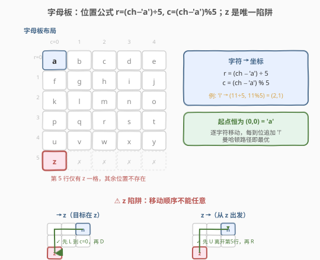
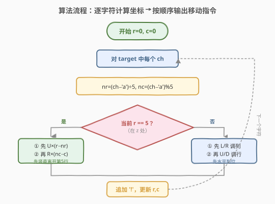
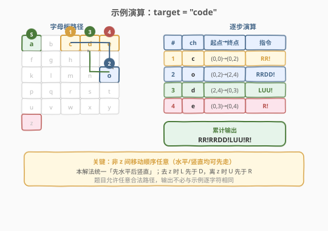

# 字母板上的路径

- **题目名称**：字母板上的路径
- **链接**：[1138. 字母板上的路径](https://leetcode.cn/problems/alphabet-board-path/)
- **难度**：中等
- **标签**：数学、字符串、模拟

## 1. 题目概述

从字母板上的位置 `(0, 0)`（字符 `'a'`）出发，按指令规则行动，返回**最小行动次数**的指令序列，使答案与目标 `target` 相同。

字母板布局如下：

```text
abcde
fghij
klmno
pqrst
uvwxy
z
```

**指令规则**：

- `'U'` / `'D'` / `'L'` / `'R'`：上 / 下 / 左 / 右移一格（方格须存在）
- `'!'`：把当前位置 `(r, c)` 的字符 `board[r][c]` 添加到答案

**示例 1**：

```text
输入：target = "leet"
输出："DDR!UURRR!!DDD!"
```

**示例 2**：

```text
输入：target = "code"
输出："RR!DDRR!UUL!R!"
```

**约束条件**：

- `1 <= target.length <= 100`
- `target` 仅含有小写英文字母

> 💡 本题的本质是**在固定网格上求逐字符移动的曼哈顿路径**。由于板上无障碍物，任意两格之间的最短路径长度就是曼哈顿距离 $|r_1-r_2| + |c_1-c_2|$，所有曼哈顿路径都等长。唯一的陷阱在于 `'z'` 所在的第 5 行**只有 1 个格子**，移动顺序不能完全任意。

---

## 2. 解题思路

### 2.1 暴力思路：BFS 逐字符搜最短路

对 `target` 的每个字符，用 BFS 从当前位置搜索到目标字符的最短路径。但板上**无障碍物**，两格间的最短路径就是曼哈顿距离，任何「先水平后竖直」或「先竖直后水平」的折线路径都最优。BFS 既冗余又无法直接输出路径指令，是大炮打蚊子。

### 2.2 核心观察：位置公式 + z 的移动顺序陷阱



**观察 1：字符位置可直接计算**

字母板的每行恰好 5 个字母（第 5 行除外），因此字符 `ch` 的坐标为：

$$r = \left\lfloor \frac{ch - \text{'a'}}{5} \right\rfloor, \quad c = (ch - \text{'a'}) \bmod 5$$

例如 `'l'`：$11 \div 5 = 2$ 余 $1$，故 `l` 在 $(2, 1)$。无需建表，$O(1)$ 直接算出。

**观察 2：曼哈顿路径即最优**

板上没有障碍，从 $(r_1, c_1)$ 到 $(r_2, c_2)$ 的最短路径长度恒为 $|r_1 - r_2| + |c_1 - c_2|$。只需按行差、列差生成对应数量的 `U/D/L/R` 指令即可。

**观察 3（陷阱）：`z` 在 $(5, 0)$，第 5 行只有 1 格**

第 5 行仅有 `z` 一个格子，$(5, 1)$ 到 $(5, 4)$ 都**不存在**。这导致移动到/离开 `z` 时，水平与竖直的先后顺序受到约束：

| 场景 | 错误顺序 | 正确顺序 | 原因 |
|------|----------|----------|------|
| **去 `z`**（目标在第 5 行） | 先 `D` 后 `L` | 先 `L` 后 `D` | 先 `D` 到第 5 行时若 $c > 0$，会落入不存在的格子 |
| **离 `z`**（起点在第 5 行） | 先 `R` 后 `U` | 先 `U` 后 `R` | 从 $(5, 0)$ 先 `R` 到 $(5, 1)$ 不存在 |

> ⚠️ **关键规则**：当起点或终点涉及 `z`（第 5 行）时，必须保证**进入第 5 行时已在 $c=0$**、**离开第 5 行时先向上走**。其余情况（起点和终点均在第 0–4 行）移动顺序任意，因为第 0–4 行都有完整的 5 列。

**统一策略**：

- **当前不在 `z`**（$r \ne 5$）：先走水平（`L`/`R` 调列），再走竖直（`U`/`D` 调行）。此策略天然满足「去 `z` 时先 `L` 后 `D`」。
- **当前在 `z`**（$r = 5$）：先走竖直（`U` 向上离开第 5 行），再走水平（`L`/`R` 调列）。此策略天然满足「离 `z` 时先 `U` 后 `R`」。

### 2.3 算法流程图



**完整步骤**：

1. **初始化**：`r = 0, c = 0`（起点 `'a'`），结果字符串 `res` 为空
2. **逐字符处理** `target` 中的每个 `ch`：
   - 计算 `nr = (ch - 'a') // 5`，`nc = (ch - 'a') % 5`
   - **若 `r == 5`**（当前在 `z`）：先追加 `'U' * (r - nr)`，再追加水平指令（`'L'` 或 `'R'`）
   - **否则**：先追加水平指令（`'L'` 或 `'R'`），再追加竖直指令（`'U'` 或 `'D'`）
   - 追加 `'!'`
   - 更新 `r, c = nr, nc`
3. **返回** `res`

> 💡 **为什么只判 `r == 5` 而不判目标是否为 `z`？** 因为「去 `z`」的正确顺序（先 `L` 后 `D`）已被「非 `z` 起点先水平后竖直」自然覆盖——水平先走把列调到 0，再竖直向下进入第 5 行。只有「离 `z`」需要特殊处理（先 `U` 后水平），所以只需判起点 `r == 5`。

### 2.4 示例演算

以 `target = "code"` 为例：



| 步骤 | 字符 | 起点 → 终点 | 水平 | 竖直 | 指令 | 累计输出 |
|------|------|------------|------|------|------|----------|
| 1 | `c` | `(0,0) → (0,2)` | `RR` | — | `RR!` | `RR!` |
| 2 | `o` | `(0,2) → (2,4)` | `RR` | `DD` | `RRDD!` | `RR!RRDD!` |
| 3 | `d` | `(2,4) → (0,3)` | `L` | `UU` | `LUU!` | `RR!RRDD!LUU!` |
| 4 | `e` | `(0,3) → (0,4)` | `R` | — | `R!` | `RR!RRDD!LUU!R!` |

最终输出 `"RR!RRDD!LUU!R!"`，拼出 `"code"` ✓。

> 💡 **与示例输出不同？** 题目允许返回**任意**合法路径。示例 2 的输出 `"RR!DDRR!UUL!R!"` 是「先竖直后水平」的写法，本解法统一用「先水平后竖直」，两者都是最短路径，均正确。

---

## 3. 参考代码

### C++

```cpp
class Solution {
public:
    string alphabetBoardPath(string target) {
        int r = 0, c = 0;
        string res;
        for (char ch : target) {
            int nr = (ch - 'a') / 5;
            int nc = (ch - 'a') % 5;
            if (r == 5) {
                res += string(r - nr, 'U');
                res += string(nc - c, 'R');
            } else {
                res += string(c - nc, 'L');
                res += string(nc - c, 'R');
                res += string(r - nr, 'U');
                res += string(nr - r, 'D');
            }
            res += '!';
            r = nr;
            c = nc;
        }
        return res;
    }
};
```

### Python

```python
class Solution:
    def alphabetBoardPath(self, target: str) -> str:
        r, c = 0, 0
        res = []
        for ch in target:
            nr, nc = divmod(ord(ch) - ord('a'), 5)
            if r == 5:                      # 在 z：先 U 离开第 5 行，再水平
                res.append('U' * (r - nr))
                res.append('R' * (nc - c))
            else:                           # 不在 z：先水平，再竖直
                res.append('L' * (c - nc) if c > nc else 'R' * (nc - c))
                res.append('U' * (r - nr) if r > nr else 'D' * (nr - r))
            res.append('!')
            r, c = nr, nc
        return ''.join(res)
```

> 💡 **实现细节**：① C++ 中 `string(n, ch)` 直接生成 `n` 个 `ch`，负数参数会触发未定义行为，故 `r == 5` 分支单独处理（此时 `nc >= c` 恒成立，`nc - c >= 0`）。② Python 用 `divmod` 一步算出行列。③ `string(c - nc, 'L')` 当 `c < nc` 时 `c - nc` 为负，故用三元表达式分流，确保只生成非负数量的字符。

---

## 4. 复杂度分析

| 维度 | 复杂度 | 说明 |
|------|--------|------|
| 时间复杂度 | $O(n)$ | 逐字符处理，每个字符生成 $O(1)$ 条指令（曼哈顿距离常数级，最大 10 步） |
| 空间复杂度 | $O(n)$ | 输出字符串长度与 `target` 同阶（每字符至多 11 个指令字符） |

> ⚠️ $n \le 100$，每个字符最多移动 10 步（`a` 到 `z` 的曼哈顿距离 $5+0=5$，最长是 `a` 到 `y` 的 $4+4=8$ 或 `e` 到 `z` 的 $5+4=9$），输出长度上限约 $100 \times 11 = 1100$，远在限制之内。

---

## 5. 扩展：为什么不能用「统一先 L 再 U 再 R 再 D」？

一种看似优雅的统一策略是：**总是按 `L → U → R → D` 的固定顺序输出**，这样去 `z` 时 `L` 先于 `D`（✓），离 `z` 时 `U` 先于 `R`（✓），看似一举两得。但实际有陷阱：

- 当从 `z` 出发去**左下方**不存在的目标时……实际上所有字母都在 `z` 的上方或同列，所以 `L` 方向从 `z` 出发不会出现。
- 真正的问题在于：从非 `z` 位置出发去非 `z` 位置时，`L → U → R → D` 的固定顺序会绕远路。例如从 `(2, 3)` 到 `(0, 4)`：先 `L` 到 `(2, 0)`（多走了 3 格），再 `U` 到 `(0, 0)`，再 `R` 到 `(0, 4)`——共 7 步，而最优只需 `R + UU` = 3 步。

因此固定顺序不可行，必须根据行差列差的**符号**分别生成对应方向的指令。本文的「非 `z` 先水平后竖直、`z` 先竖直后水平」策略既保证最短，又安全处理 `z`。

> 💡 另一种等价且更简洁的写法：**总是先走水平，再走竖直，但去 `z` 时先 `L` 后 `D`，离 `z` 时先 `U` 后 `R`**。由于去 `z` 时只有 `L` 和 `D`、离 `z` 时只有 `U` 和 `R`，分别对应「水平先（L 属水平）」和「竖直先（U 属竖直）」，与本文策略完全一致。

---

## 6. 面试要点

1. **如何 $O(1)$ 计算字符在板上的坐标？**

   > 每行恰好 5 个字母，故 $r = \lfloor (ch - \text{'a'}) / 5 \rfloor$，$c = (ch - \text{'a'}) \bmod 5$。无需预处理建表。

2. **为什么移动顺序对 `z` 特别？能不能统一先水平后竖直？**

   > 第 5 行只有 `z` 一格，$(5, 1)$ 到 $(5, 4)$ 不存在。去 `z` 时若先 `D` 后 `L`，会在 $c > 0$ 时落入不存在的格子。统一「先水平后竖直」能正确处理去 `z`（先 `L` 到 $c=0$ 再 `D`），但**离 `z`** 时若先 `R` 则从 $(5,0)$ 到 $(5,1)$ 不存在，必须先 `U` 离开第 5 行。故离 `z` 需特判为「先竖直后水平」。

3. **题目说「最小行动次数」，如何保证路径最优？**

   > 板上无障碍，两格间最短路径 = 曼哈顿距离。只要每步都朝目标方向走（不回头），生成的路径长度就是 $|r_1-r_2| + |c_1-c_2|$，天然最优。

4. **输出与示例不同怎么办？**

   > 题目明确说「你可以返回任何达成目标的路径」。只要拼出的字符串正确且路径合法（不经过不存在的格子），任意最短路径都通过。移动顺序的先后不影响最优性。

5. **如果板上有障碍物怎么办？**

   > 则曼哈顿路径不一定可行，需退化到 BFS / Dijkstra 求最短路。本题板上无障碍（只有第 5 行的不完整列），属于「伪障碍」——只需调整顺序即可避开，无需搜索。

> 💡 **一句话总结**：1138 是一道披着路径搜索外衣的**数学模拟题**——字符位置用除/模 $O(1)$ 算出，移动指令按行差列差直接生成，唯一的坑是 `z` 所在第 5 行的不完整列要求「去 `z` 先左后下、离 `z` 先上后右」。$O(n)$ 一遍过，无需搜索。

---

## 7. 同类练习题

- [400. 第 N 位数字](https://leetcode.cn/problems/nth-digit/)：同为「除/模定位」的数学题，按位数分层 $O(\log n)$ 定位第 $n$ 位数字
- [168. Excel 表列名称](https://leetcode.cn/problems/excel-sheet-column-title/)（[题解](../0001-0100/168_Excel表列名称.md)）：1-indexed 进制转换，与本题「字符→坐标」的除模映射同属数学定位类
- [752. 打开转盘锁](https://leetcode.cn/problems/open-the-lock/)：真正的网格/状态空间最短路径 BFS 题，对照理解「无障碍用数学、有障碍用 BFS」的选型
- [79. 单词搜索](https://leetcode.cn/problems/word-search/)（[题解](../0001-0100/79_单词搜索.md)）：网格上的 DFS 回溯路径搜索，对照「固定板上逐字符移动」的搜索型变体
