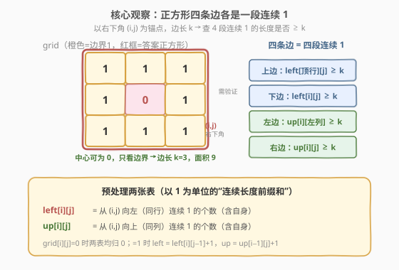
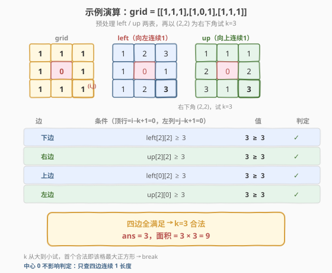

# LeetCode 最大的以 1 为边界的正方形 题解

## 1. 题目概述

- **标题 / 题号**：最大的以 1 为边界的正方形（#1139，medium）
- **链接**：https://leetcode.cn/problems/largest-1-bordered-square/
- **难度**：中等
- **标签**：数组、动态规划、前缀和、矩阵

**题意**：给定一个由若干 `0` 和 `1` 组成的二维网格 `grid`，找出**边界全部由 `1` 组成**的最大**正方形**子网格，并返回该子网格中的**元素数量**（即面积 $=$ 边长 $\times$ 边长）。若不存在，返回 `0`。

> **注意**：只要求「边界」全为 `1`，**内部**可以是 `0`。这是与「最大全 1 正方形」（[221. 最大正方形](https://leetcode.cn/problems/maximal-square/)）的关键区别——后者要求整个正方形全是 `1`。

**示例 1**：

```text
输入：grid = [[1,1,1],[1,0,1],[1,1,1]]
输出：9
解释：整个 3×3 网格的边界全为 1（中心是 0 也合法），面积 = 3×3 = 9。
```

**示例 2**：

```text
输入：grid = [[1,1,0,0]]
输出：1
解释：单个 1 即边长 1 的正方形，面积 1。
```

**约束**：

- `1 <= grid.length <= 100`
- `1 <= grid[0].length <= 100`
- `grid[i][j]` 为 `0` 或 `1`

> 💡 本题的灵魂在于：**正方形的四条边各是一段「连续的 1」**。若能 $O(1)$ 查询任意位置向左/向上的连续 `1` 长度，则枚举每个右下角 + 每个边长 $k$，只需四次比较即可判定一个正方形是否合法。这就是「**连续 1 前缀表**」的典型应用——把区间查询压缩到 $O(1)$。

## 2. 解题思路

### 2.1 暴力思路：枚举所有正方形 + 逐格检查边界

枚举所有可能的正方形（由左上角 $(r,c)$ + 边长 $k$ 决定），对每个正方形遍历其四条边检查是否全为 `1`。

- 正方形个数：$O(m \cdot n \cdot \min(m,n))$；
- 每个正方形检查边界：$O(k)$；
- 总时间 $O(m \cdot n \cdot \min(m,n)^2)$，$m,n \le 100$ 时约 $10^8$，偏慢且写起来繁琐。

### 2.2 核心观察：连续 1 前缀表 —— 四条边 = 四次 $O(1)$ 查询



**关键洞察**：把正方形的**右下角** $(i,j)$ 与**边长** $k$ 作为锚点。则四条边的起止位置完全确定：

| 边 | 位置 | 需要的「连续 1 长度」 |
|------|------|------------------------|
| **下边** | 第 $i$ 行，列 $[j-k+1,\ j]$ | `left[i][j] >= k` |
| **右边** | 第 $j$ 列，行 $[i-k+1,\ i]$ | `up[i][j] >= k` |
| **上边** | 第 $i-k+1$ 行，列 $[j-k+1,\ j]$ | `left[i-k+1][j] >= k` |
| **左边** | 第 $j-k+1$ 列，行 $[i-k+1,\ i]$ | `up[i][j-k+1] >= k` |

其中两张预处理表定义为：

```text
left[i][j] = 从 (i,j) 向左（同行）连续 1 的个数（含自身）
up[i][j]   = 从 (i,j) 向上（同列）连续 1 的个数（含自身）
```

**转移**（与 [304. 二维区域和检索](../0201-0300/304_二维区域和检索-数组不可变.md) 同源的「前缀复用」思想）：

```text
若 grid[i][j] == 0：left[i][j] = 0，up[i][j] = 0
若 grid[i][j] == 1：left[i][j] = left[i][j-1] + 1
                    up[i][j]   = up[i-1][j]   + 1
```

> 💡 **为什么用「右下角 + 边长」而非「左上角 + 边长」做锚点？** 因为 `left[i][j]`、`up[i][j]` 自然地以「**结束于** $(i,j)$」的连续段为语义——右下角恰好是下边、右边的终点，一次查询直接给出这段连续 `1` 的长度。若用左上角作锚点，则需要再预处理「向右/向下」的两张表，多一倍工作量。

> ⚠️ **与 221 最大正方形的区别**：221 要求整块全是 `1`，用 `dp[i][j] = min(左,上,左上)+1` 一步转移；本题只要求边界是 `1`，内部可空，故必须分别校验四条边，不能用单点 `min` 转移。两者共用「以右下角为锚点」的视角，但状态含义不同。

### 2.3 算法流程图


**完整步骤**：

1. **预处理**：双重循环填 `left`、`up` 两表，遇 `0` 归零，遇 `1` 取左/上邻居 `+1`；
2. **初始化** `ans = 0`（记录最大边长）；
3. **枚举右下角** $(i,j)$：若 `grid[i][j] == 0` 直接跳过（右下角必须为 `1`）；
4. **边长 $k$ 递减枚举**：从 $\min(i,j)+1$（该格能撑起的最大可能边长）递减到 `ans+1`（只试比当前答案更大的 $k$，剪枝）；
5. **四边判定**：若 `left[i][j]`、`up[i][j]`、`left[i-k+1][j]`、`up[i][j-k+1]` 四者都 $\ge k$，则 $k$ 合法 → `ans = k`，`break`（该格更大的 $k$ 已试过且失败，更小的不如当前 ans，直接跳到下一格）；
6. **返回** `ans * ans`。

> ⚠️ **剪枝关键**：$k$ 从大到小试 + 下界设为 `ans+1`。一旦命中即 `break`（更大的 $k$ 已经先试过且不合法，故此 $k$ 即该格最大）；下界 `ans+1` 保证只更新能超越当前全局最优的 $k$。两者配合，单格均摊 $O(\min(m,n))$。

### 2.4 示例演算

以 `grid = [[1,1,1],[1,0,1],[1,1,1]]` 为例，预处理得到的 `left`、`up` 两表如下：



**预处理结果**（`grid`、`left`、`up` 并排）：

| grid | left（向左连续 1） | up（向上连续 1） |
|------|------|------|
| $\begin{bmatrix}1&1&1\\1&0&1\\1&1&1\end{bmatrix}$ | $\begin{bmatrix}1&2&3\\1&0&1\\1&2&3\end{bmatrix}$ | $\begin{bmatrix}1&1&1\\2&0&2\\3&1&3\end{bmatrix}$ |

**以右下角 $(2,2)$ 试 $k=3$**（$\min(2,2)+1 = 3$，顶行 $= i-k+1 = 0$，左列 $= j-k+1 = 0$）：

| 边 | 条件 | 值 | 判定 |
|------|------|----|------|
| 下边 | `left[2][2] >= 3` | $3 \ge 3$ | ✓ |
| 右边 | `up[2][2] >= 3` | $3 \ge 3$ | ✓ |
| 上边 | `left[0][2] >= 3` | $3 \ge 3$ | ✓ |
| 左边 | `up[2][0] >= 3` | $3 \ge 3$ | ✓ |

四边全满足 → $k=3$ 合法，`ans = 3`，面积 $= 3 \times 3 = 9$。

> 💡 **观察中心格**：`grid[1][1] = 0`，对应 `left[1][1] = up[1][1] = 0`。但判定 $k=3$ 时根本不查中心格——只查四条边。这正是「只看边界」的体现，也是本题与 221 最大正方形的本质差异。

## 3. 参考代码

### C++

```cpp
class Solution {
public:
    int largest1BorderedSquare(vector<vector<int>>& grid) {
        int m = grid.size(), n = grid[0].size();
        // left[i][j]: (i,j) 向左连续 1 的个数（含自身）
        // up[i][j]:   (i,j) 向上连续 1 的个数（含自身）
        vector<vector<int>> left(m, vector<int>(n, 0));
        vector<vector<int>> up(m, vector<int>(n, 0));

        for (int i = 0; i < m; ++i) {
            for (int j = 0; j < n; ++j) {
                if (grid[i][j]) {
                    left[i][j] = (j == 0 ? 1 : left[i][j - 1] + 1);
                    up[i][j]   = (i == 0 ? 1 : up[i - 1][j] + 1);
                }
            }
        }

        int ans = 0;
        for (int i = 0; i < m; ++i) {
            for (int j = 0; j < n; ++j) {
                if (!grid[i][j]) continue;          // 右下角必须为 1
                // 该格能撑起的最大可能边长
                int maxK = min(i, j) + 1;
                for (int k = maxK; k > ans; --k) {  // 递减 + 只试比 ans 大的
                    if (left[i][j] >= k && up[i][j] >= k &&
                        left[i - k + 1][j] >= k && up[i][j - k + 1] >= k) {
                        ans = k;                    // 命中即该格最大
                        break;
                    }
                }
            }
        }
        return ans * ans;                           // 面积 = 边长平方
    }
};
```

### Python

```python
class Solution:
    def largest1BorderedSquare(self, grid: List[List[int]]) -> int:
        m, n = len(grid), len(grid[0])
        # left[i][j]: (i,j) 向左连续 1 的个数（含自身）
        # up[i][j]:   (i,j) 向上连续 1 的个数（含自身）
        left = [[0] * n for _ in range(m)]
        up = [[0] * n for _ in range(m)]

        for i in range(m):
            for j in range(n):
                if grid[i][j]:
                    left[i][j] = (left[i][j - 1] + 1) if j > 0 else 1
                    up[i][j] = (up[i - 1][j] + 1) if i > 0 else 1

        ans = 0
        for i in range(m):
            for j in range(n):
                if not grid[i][j]:
                    continue                       # 右下角必须为 1
                max_k = min(i, j) + 1              # 该格能撑起的最大可能边长
                for k in range(max_k, ans, -1):    # 递减 + 只试比 ans 大的
                    if (left[i][j] >= k and up[i][j] >= k and
                        left[i - k + 1][j] >= k and up[i][j - k + 1] >= k):
                        ans = k                    # 命中即该格最大
                        break
        return ans * ans                           # 面积 = 边长平方
```

> 💡 **实现细节**：① `left`、`up` 用同一趟双重循环填表，遇 `0` 保持初值 `0`，遇 `1` 取左/上邻居 `+1`（边界处 `i=0` 或 `j=0` 时为 `1`）。② 内层 `k` 循环写成 `for k in range(max_k, ans, -1)`——下界 `ans`（开区间）天然跳过不大于当前答案的 $k$，无需额外判断。③ 命中后 `break`，因为 $k$ 递减，首个合法即该格最大边长。④ 返回 `ans*ans`，题目要的是「元素数量」即面积。

## 4. 复杂度分析

| 维度 | 复杂度 | 说明 |
|------|--------|------|
| 时间复杂度 | $O(m \cdot n \cdot \min(m,n))$ | 预处理 $O(mn)$；枚举右下角 $O(mn)$ 个，每格 $k$ 至多试 $\min(m,n)$ 次，每次 $O(1)$ 判定 |
| 空间复杂度 | $O(m \cdot n)$ | `left`、`up` 两张表各 $O(mn)$ |

> ⚠️ $m,n \le 100$ 时 $\min(m,n) \le 100$，总操作约 $10^6$ 量级，远在限制之内。剪枝（$k$ 递减 + 下界 `ans+1`）使实际运行远快于最坏界。空间上可用滚动数组把 `up` 压到 $O(n)$（`left` 同行内递推天然 $O(n)$），但 $m,n \le 100$ 时无需优化。

## 5. 扩展：用二维前缀和替代连续 1 表

`left`/`up` 表只对「连续段」高效。若把条件放宽为「**边上的 1 总数 $\ge k$**」（允许边上夹 `0`，只要 `1` 够多），则需要真正的**二维前缀和**：预处理 `S[i][j]` = 子矩阵 $(0,0)$ 到 $(i,j)$ 的 `1` 总数，则任意子矩阵的 `1` 数可由四角容斥 $O(1)$ 求出（参见 [304. 二维区域和检索](../0201-0300/304_二维区域和检索-数组不可变.md)）。

```text
sum(矩形 (r1,c1)-(r2,c2)) = S[r2][c2] - S[r1-1][c2] - S[r2][c1-1] + S[r1-1][c1-1]
```

本题要求「边界**全**为 1」（连续无缺口），用 `left`/`up` 连续段表更直接；若改为「边界 1 数量阈值」，则换二维前缀和。两者都是「**预处理把区间查询压到 $O(1)$**」的同一思想。

> 💡 另一种等价写法：仍用二维前缀和判定四条边——分别计算上、下、左、右四条边所在一维区间的 `1` 数，等于 $k$ 即该边全 `1`。但需要四次一维区间和，不如 `left`/`up` 连续段表一次比较来得简洁。

## 6. 面试要点

1. **`left[i][j]` 和 `up[i][j]` 的定义是什么？为什么含「自身」？**

   > `left[i][j]` = 从 $(i,j)$ 向左（同行）连续 `1` 的个数，`up[i][j]` = 向上（同列）连续 `1` 的个数，均含 $(i,j)$ 自身。含自身是因为右下角 $(i,j)$ 本身是正方形的一条边的端点，必须计入；且 `grid[i][j]=0` 时直接归 `0`，语义自洽。

2. **为什么以「右下角 + 边长」作锚点，而不是左上角？**

   > `left`/`up` 表的语义是「**结束于** $(i,j)$ 的连续段长度」，右下角恰是下边、右边的终点，一次查询即得这两边的连续 `1` 长度。若用左上角作锚点，需另预处理「向右/向下」的两张表，工作量翻倍。

3. **判定一个 $k \times k$ 正方形合法需要查哪四个值？**

   > 以右下角 $(i,j)$、边长 $k$ 为例，顶行 $=i-k+1$、左列 $=j-k+1$：① 下边 `left[i][j]`；② 右边 `up[i][j]`；③ 上边 `left[i-k+1][j]`；④ 左边 `up[i][j-k+1]`。四者都 $\ge k$ 即合法。注意上边查的是「顶行的右端点」向左连续 `1`，左边查的是「左列的下端点」向上连续 `1`。

4. **$k$ 为什么从大到小枚举？下界为什么设为 `ans+1`？**

   > 从大到小：首个合法的 $k$ 即该格能撑起的最大边长，直接 `break`，无需再试更小的。下界 `ans+1`：只关心能否超越当前全局最优，不大于 `ans` 的 $k$ 即使命中也无意义，跳过省时。两者配合把单格均摊压到 $O(\min(m,n))$。

5. **本题和 [221. 最大正方形](https://leetcode.cn/problems/maximal-square/) 有什么区别？**

   > 221 要求正方形**整块全为 1**，用 `dp[i][j] = min(dp[i-1][j], dp[i][j-1], dp[i-1][j-1]) + 1` 单点转移即可（最小者决定能撑多大的全 1 方块）。本题只要求**边界全为 1**，内部可空，单点 `min` 转移不再适用，必须分别校验四条边。两者都以右下角为锚点，但状态语义与转移方式不同。

> 💡 **一句话总结**：1139 的灵魂是「**连续 1 前缀表**」——预处理 `left`/`up` 两表把「一段连续 1 的长度」压缩为 $O(1)$ 查询，于是枚举右下角 + 边长 $k$ 后，四条边的合法性只需四次比较。$O(m \cdot n \cdot \min(m,n))$ 时间、$O(mn)$ 空间，剪枝后实测很快。这套「预处理区间信息 + 锚点枚举 + $O(1)$ 判定」的范式，与二维前缀和（304）、最大正方形（221）一脉相承。

## 同类练习题

| # | 题目 | 与本题的关联 |
|---|------|-------------|
| 221 | [最大正方形](https://leetcode.cn/problems/maximal-square/) | 对照题，要求整块全 1，单点 `min` DP 转移，体会「全 1」vs「边界 1」状态语义差异 |
| 304 | [二维区域和检索 - 数组不可变](https://leetcode.cn/problems/range-sum-query-2d-immutable/)（[题解](../0201-0300/304_二维区域和检索-数组不可变.md)） | 二维前缀和模板，四角容斥 $O(1)$ 区间和，同源「预处理压缩查询」思想 |
| 1277 | [统计全为 1 的正方形子矩阵](https://leetcode.cn/problems/count-square-submatrices-with-all-ones/) | 221 的计数版，同样 `min` 转移，统计所有全 1 正方形个数 |
| 1292 | [元素和小于等于阈值的正方形的最大边长](https://leetcode.cn/problems/maximum-side-length-of-a-square-with-sum-less-than-or-equal-to-threshold/) | 二维前缀和 + 枚举边长，$O(1)$ 判定子矩阵和，本题前缀思想的直接延伸 |
