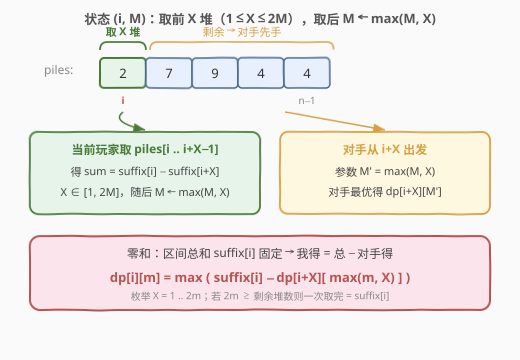
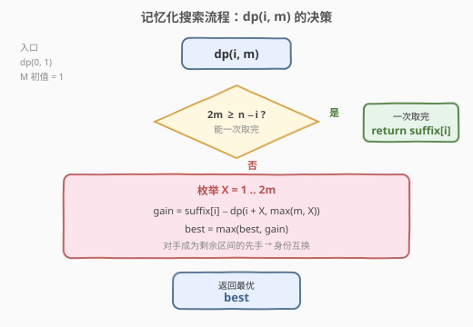
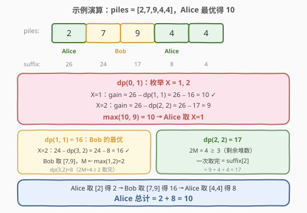

# LeetCode 石子游戏 II 题解

## 1. 题目概述

- **标题 / 题号**：石子游戏 II（#1140，medium）
- **链接**：https://leetcode.cn/problems/stone-game-ii/
- **难度**：中等
- **标签**：数组、数学、动态规划、博弈型 DP、前缀和

**题意**：`piles` 是一排石子堆，每堆有正整数颗。爱丽丝和鲍勃轮流从中拿取，**爱丽丝先手**，初始 `M = 1`。每次当前玩家可以拿走**最前面的** `X` 堆（`1 ≤ X ≤ 2M`），随后将 `M` 更新为 `max(M, X)`。游戏在所有堆被拿完后结束。返回爱丽丝在双方都采取最优策略时能获得的**最大石子数**。

**示例 1**：

```text
输入：piles = [2,7,9,4,4]
输出：10
解释：爱丽丝先拿 1 堆（得 2），M 仍为 1；
      鲍勃拿 2 堆（得 7+9=16），M 更新为 max(1,2)=2；
      爱丽丝拿剩余 2 堆（得 4+4=8），M 更新为 2。
      爱丽丝总计 2+8=10。
```

**示例 2**：

```text
输入：piles = [1,2,3,4,5,100]
输出：104
```

**约束**：

- `1 <= piles.length <= 100`
- `1 <= piles[i] <= 10^4`

> 💡 本题是 [877. 石子游戏](../0801-0900/877_石子游戏.md) 的变体：877 每次只能取**两端之一**，而本题每次只能从**左端**取连续 `X` 堆，且 `X` 的上界 `2M` 会随取法动态增长。核心仍是**博弈型 DP**，但状态从「区间端点」变为「起始位置 + 参数 M」，并借助**后缀和**将零和博弈化简为单变量递推。

## 2. 解题思路

### 2.1 暴力思路

每一步当前玩家可在 `X ∈ [1, 2M]` 中任选一个值拿走前 `X` 堆，随后身份互换、对手在剩余部分继续先手。递归枚举所有分支，复杂度 $O(\prod 2M_i)$，`n = 100` 时必然爆炸。同一状态 `(i, M)` 被反复求解——天然适合记忆化 DP。

### 2.2 核心观察：博弈 DP + 后缀和（零和转化）



**状态定义**：

> `dp[i][m]` = 当前玩家从位置 `i` 出发、参数 `M = m` 时，能获得的**最大石子数**。

注意这里记的是「当前玩家的得分」，而非「爱丽丝的得分」——因为每次递归身份互换，当前玩家即先手。

**关键转化——后缀和实现零和**：从位置 `i` 到末尾的石子总数 `suffix[i]` 是固定的。无论双方怎么分，**先手得分 + 后手得分 = `suffix[i]`**。因此：

- 当前玩家拿 `X` 堆（`piles[i..i+X-1]`），立即获得 `suffix[i] − suffix[i+X]`；
- 剩余 `piles[i+X..]` 交给对手先手，参数变为 `M' = max(m, X)`，对手最优得 `dp[i+X][M']`；
- 当前玩家在剩余部分的得分 = `suffix[i+X] − dp[i+X][M']`（剩余总和减对手所得）；
- 合计：`(suffix[i] − suffix[i+X]) + (suffix[i+X] − dp[i+X][M'])` $=$ `suffix[i] − dp[i+X][max(m, X)]`。

> 💡 **后缀和的威力**：无需分别追踪两人得分，一个 `suffix[i]` 把「当前玩家拿了多少 + 剩余里还能拿多少」一步合并为 `suffix[i] − 对手所得`。这正是零和博弈的紧凑表达——与 877 中「净赚 = 该堆 − 对手净赚」异曲同工，只是 877 按端点转移、本题按 `X` 转移。

**转移方程**：

$$
\text{dp}[i][m] = \max_{1 \le X \le 2m}\bigl(\text{suffix}[i] - \text{dp}[i+X][\max(m,\, X)]\bigr)
$$

**边界**：若 $2m \ge n - i$（一次可取完所有剩余堆），则 $\text{dp}[i][m] = \text{suffix}[i]$。

**答案**：`dp[0][1]`（爱丽丝从位置 0 出发，初始 `M = 1`）。

### 2.3 算法流程图



**完整步骤**：

1. **预处理后缀和** `suffix[i] = suffix[i+1] + piles[i]`，从右向左填充；
2. **记忆化搜索** `dp(i, m)`：
   - 若 `2*m ≥ n − i`：能一次取完，返回 `suffix[i]`；
   - 否则枚举 `X = 1 .. 2m`，计算 `gain = suffix[i] − dp(i+X, max(m, X))`，取最大；
3. **返回** `dp(0, 1)`。

> ⚠️ **M 的取值范围**：`M` 从 1 出发，每次取 `X` 堆后更新为 `max(M, X)`，而 `X ≤ 2M`，故 `M` 最多翻倍增长。一旦 $2M \ge n$（剩余堆数），玩家即可一次取完，不再需要更大的 `M`。因此 $m$ 的有效范围是 $[1, \lceil n/2 \rceil]$，DP 表大小 $O(n^2)$ 足够。

### 2.4 示例演算

以 `piles = [2,7,9,4,4]` 为例，`suffix = [26, 24, 17, 8, 4, 0]`：



| 状态 | 计算 | 结果 |
|------|------|------|
| `dp(3, 2)` | `2M=4 ≥ 2`，取完 | `suffix[3] = 8` |
| `dp(2, 2)` | `2M=4 ≥ 3`，取完 | `suffix[2] = 17` |
| `dp(2, 1)` | `max(17−dp(3,1), 17−dp(4,2)) = max(17−8, 17−4)` | `13` |
| `dp(1, 1)` | `max(24−dp(2,1), 24−dp(3,2)) = max(24−13, 24−8)` | `16` |
| `dp(0, 1)` | `max(26−dp(1,1), 26−dp(2,2)) = max(26−16, 26−17)` | **`10`** |

**最优博弈过程**：

| 轮次 | 玩家 | 位置 `i` | `M` | 取 `X` 堆 | 获得 | `M` 更新 |
|------|------|----------|-----|-----------|------|----------|
| 1 | 爱丽丝 | 0 | 1 | 1 | 2 | max(1,1)=1 |
| 2 | 鲍勃 | 1 | 1 | 2 | 7+9=16 | max(1,2)=2 |
| 3 | 爱丽丝 | 3 | 2 | 2 | 4+4=8 | max(2,2)=2 |

爱丽丝总计 $= 2 + 8 = 10$，鲍勃 $= 16$。

> 💡 **爱丽丝拿的比鲍勃少？** 没错，$10 < 16$。题目问的是「爱丽丝能获得的**最大**石子数」，而非「爱丽丝是否赢」。若爱丽丝第一手取 `X=2`（得 $2+7=9$），则鲍勃从位置 2 出发、`M=2`，一次取完剩余 $9+4+4=17$，爱丽丝仅得 9——更差。所以取 `X=1` 得 10 已是爱丽丝的最优。

## 3. 参考代码

### C++

```cpp
class Solution {
  public:
    int stoneGameII(vector<int>& piles) {
        int n = piles.size();
        vector<int> suffix(n + 1, 0);
        for (int i = n - 1; i >= 0; i--)
            suffix[i] = suffix[i + 1] + piles[i];

        // dp[i][m] = 当前玩家从 piles[i..] 出发、M=m 时能获得的最大石子数
        vector<vector<int>> dp(n + 1, vector<int>(n + 1, 0));
        for (int i = n - 1; i >= 0; i--) {
            for (int m = 1; m <= n; m++) {
                if (2 * m >= n - i) {           // 能一次取完
                    dp[i][m] = suffix[i];
                } else {
                    int best = 0;
                    for (int x = 1; x <= 2 * m; x++) {
                        int nm = max(m, x);
                        best = max(best, suffix[i] - dp[i + x][nm]);
                    }
                    dp[i][m] = best;
                }
            }
        }
        return dp[0][1];
    }
};
```

### Python

```python
class Solution:
    def stoneGameII(self, piles: List[int]) -> int:
        n = len(piles)
        suffix = [0] * (n + 1)
        for i in range(n - 1, -1, -1):
            suffix[i] = suffix[i + 1] + piles[i]

        from functools import cache

        @cache
        def dp(i: int, m: int) -> int:
            if 2 * m >= n - i:               # 能一次取完所有剩余
                return suffix[i]
            best = 0
            for x in range(1, 2 * m + 1):
                gain = suffix[i] - dp(i + x, max(m, x))
                if gain > best:
                    best = gain
            return best

        return dp(0, 1)
```

> 💡 **实现细节**：① 后缀和 `suffix[n] = 0` 作为哨兵，避免边界特判。② 记忆化版本天然只计算可达状态，比底向上的满表更省。③ 底向上 `i` 从右往左扫（`dp[i]` 依赖 `dp[i+x]`，`x ≥ 1`），`m` 任意序（同行内无依赖）。④ `nm = max(m, x)` 可能大于 `n`，但由于此时 `2*nm ≥ n` 必然命中「取完」分支，不会越界——实际有效 `nm ≤ n`。

## 4. 复杂度分析

| 维度 | 复杂度 | 说明 |
|------|--------|------|
| 时间复杂度 | $O(n^3)$ | 状态数 $O(n^2)$（位置 $i$ × 参数 $m$），每个状态枚举 $X$ 至多 $2m \le n$ 次，每次 $O(1)$ 转移；$n \le 100$ 时约 $10^6$ |
| 空间复杂度 | $O(n^2)$ | DP 表 $(n+1) \times (n+1)$；记忆化版本仅存可达状态，实际更省 |

> ⚠️ 严格来说有效状态远少于 $n^2$：`m` 从 1 出发翻倍增长，到 $\lceil n/2 \rceil$ 即可取完。但 $n \le 100$ 时 $O(n^3) = 10^6$ 远在限制内，无需精确优化状态数。

## 5. 扩展：M 增长与贪心的陷阱

**为什么不能贪心？** 直觉上「每次尽可能多拿」似乎最优，但 `M` 会随 `X` 增长——多拿意味着给对手更大的 `M`，对手也能拿更多。例如 `piles = [2,7,9,4,4]`：

- 贪心取 `X=2`（得 9），对手 `M=2` 一次取完剩余 17 → 爱丽丝仅 9；
- 取 `X=1`（得 2），对手 `M=1` 只能取 $\le 2$ 堆 → 爱丽丝最终 10。

**M 的增长上界**：`M` 从 1 开始，每次至多翻倍（`X ≤ 2M` → `M' = max(M, X) ≤ 2M`）。经过 $k$ 步后 $M \le 2^k$。一旦 $2M \ge n$，剩余可一次取完，`M` 不再增长。故 $M$ 的有效最大值约为 $\lceil n/2 \rceil$，DP 表第二维只需开到 $n$。

> 💡 **与 877 的对比**：877 的状态是区间 `[i, j]`（两端取），维度 $O(n^2)$，每状态 $O(1)$ 转移，总 $O(n^2)$；本题的状态是 `(i, M)`，维度 $O(n^2)$，但每状态需枚举 $X$，总 $O(n^3)$。两者共享「零和 + 后缀/前缀和 + 身份互换」的核心思想，差别在于取法决定了状态维度和转移代价。

## 6. 面试要点

1. **为什么 `dp` 定义为「当前玩家的最大得分」而非「爱丽丝的得分」？**

   > 因为每次递归身份互换：当前玩家拿完后，对手成为剩余部分的先手。定义「当前玩家」即先手，递归调用 `dp(i+X, M')` 直接返回对手的先手最优得分，无需额外标记「轮到谁」。零和性质保证了 `当前玩家 = 总和 − 对手`。

2. **后缀和 `suffix[i]` 在转移中起了什么作用？**

   > 它把「当前玩家这一手拿了多少」和「剩余部分还能拿多少」合并为一项。当前玩家拿 `X` 堆得 `suffix[i] − suffix[i+X]`，剩余 `suffix[i+X]` 中对手先手拿走 `dp[i+X][M']`，留给当前玩家的就是 `suffix[i+X] − dp[i+X][M']`。两项相加恰好等于 `suffix[i] − dp[i+X][M']`，`suffix[i+X]` 被消去——这就是零和的代数体现。

3. **`M` 的最大值是多少？DP 表第二维开多大？**

   > `M` 从 1 出发，每次取 `X ≤ 2M` 后更新为 `max(M, X) ≤ 2M`，至多翻倍。一旦 $2M \ge n$（总堆数），任何位置都能一次取完，`M` 不再增长。故有效最大 $M \approx \lceil n/2 \rceil$，第二维开到 $n$ 即可（$n \le 100$）。

4. **为什么不能贪心——每次取尽可能多？**

   > 取 `X` 大 → 立即得更多，但 `M ← max(M, X)` 也更大 → 对手下一轮能取更多。这是「眼前利益 vs 给对手赋能」的博弈权衡，必须枚举所有 `X` 取最优，不能贪心。反例：`piles = [2,7,9,4,4]`，贪心取 2 堆得 9，但对手取完剩余 17，爱丽丝仅 9 < 最优 10。

5. **本题与 [877. 石子游戏](../0801-0900/877_石子游戏.md) 的核心差异是什么？**

   > ① 取法：877 取左或右端单堆，1140 从左端取连续 `X` 堆。② 状态：877 是区间 `[i, j]`（二维），1140 是 `(i, M)`（位置 + 动态参数）。③ 转移代价：877 每状态 $O(1)$（两种取法），1140 每状态 $O(2M)$（枚举 `X`）。④ 共同点：都是零和博弈 DP，用「总和 − 对手所得」化简，身份互换。

> 💡 **一句话总结**：1140 的灵魂是「**后缀和 + 零和转化**」——`dp[i][m] = suffix[i] − min(dp[i+X][max(m,X)])`，把博弈双方的分摊压缩为单变量递推。难点不在 DP 本身，而在理解 `M` 的动态增长如何影响状态空间，以及克制贪心冲动、枚举所有 `X` 取最优。

## 同类练习题

| # | 题目 | 与本题的关联 |
|---|------|-------------|
| 877 | [石子游戏](https://leetcode.cn/problems/stone-game/)（[题解](../0801-0900/877_石子游戏.md)） | 博弈型区间 DP 母模板，取两端单堆，对比本题取左端 `X` 堆 + 动态 `M` 的状态设计差异 |
| 486 | [预测赢家](https://leetcode.cn/problems/predict-the-winner/) | 877 的无特殊约束版（奇数长度、允许平局），同一套区间 DP 框架 |
| 1406 | [石子游戏 III](https://leetcode.cn/problems/stone-game-iii/) | 从「取堆」升级为「取值」（`stoneValue[i]` 可为负），状态退化为 `(i,)` 一维但转移枚举 `X=1,2,3`，对比取法维度变化 |
| 1690 | [石子游戏 VII](https://leetcode.cn/problems/stone-game-vii/) | 拿走一堆后得分由「区间剩余和」决定，转移用 `min` 而非 `max`，仍是博弈型区间 DP |
| 1563 | [石子游戏 V](https://leetcode.cn/problems/stone-game-v/) | 取连续子数组后按较小半段得分，区间 DP + 前缀和，状态切分更复杂 |
