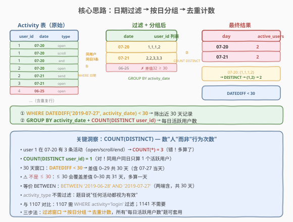
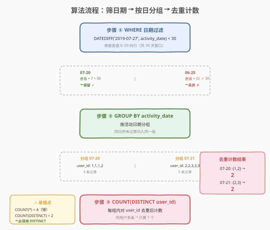
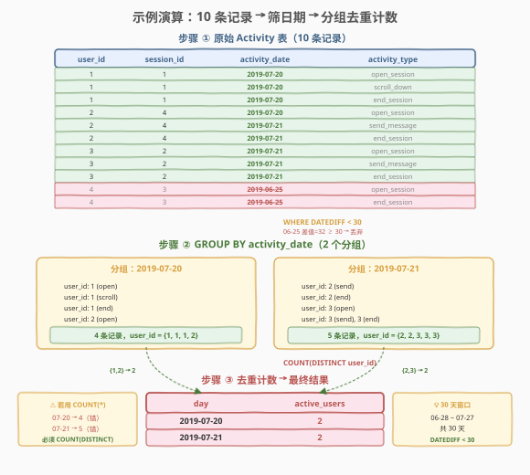

# 查询近30天活跃用户数

- **题目名称**：查询近30天活跃用户数
- **链接**：[1141. 查询近30天活跃用户数](https://leetcode.cn/problems/user-activity-for-the-past-30-days-i/)
- **难度**：简单
- **标签**：SQL、GROUP BY、COUNT(DISTINCT)、日期过滤、DATEDIFF

## 1. 题目概述

给定 `Activity` 表，记录社交媒体网站的用户活动。编写 SQL 查询，统计截至 `2019-07-27`（含当天），近 `30` 天内**每日活跃用户数**。当天只要有一条活动记录，该用户即为活跃用户。

**表结构**：

```text
Table: Activity
+---------------+---------+
| Column Name   | Type    |
+---------------+---------+
| user_id       | int     |
| session_id    | int     |
| activity_date | date    |
| activity_type | enum    |  ← ('open_session','end_session','scroll_down','send_message')
+---------------+---------+
```

> ⚠️ 该表**无主键**，可能存在重复行（同一用户同一天可能有多条不同类型的活动记录）。`activity_type` 是 ENUM 类型，取值包括 `'open_session'`、`'end_session'`、`'scroll_down'`、`'send_message'`。注意每个会话只属于一个用户。

**示例 1**：

```text
输入：
Activity 表
+---------+------------+---------------+---------------+
| user_id | session_id | activity_date | activity_type |
+---------+------------+---------------+---------------+
| 1       | 1          | 2019-07-20    | open_session  |
| 1       | 1          | 2019-07-20    | scroll_down   |
| 1       | 1          | 2019-07-20    | end_session   |
| 2       | 4          | 2019-07-20    | open_session  |
| 2       | 4          | 2019-07-21    | send_message  |
| 2       | 4          | 2019-07-21    | end_session   |
| 3       | 2          | 2019-07-21    | open_session  |
| 3       | 2          | 2019-07-21    | send_message  |
| 3       | 2          | 2019-07-21    | end_session   |
| 4       | 3          | 2019-06-25    | open_session  |
| 4       | 3          | 2019-06-25    | end_session   |
+---------+------------+---------------+---------------+

输出：
+------------+--------------+
| day        | active_users |
+------------+--------------+
| 2019-07-20 | 2            |
| 2019-07-21 | 2            |
+------------+--------------+
```

**解释**：

| activity_date | 活跃用户 | 说明 |
|---------------|---------|------|
| 2019-07-20 | user 1, user 2 → 2 | user 1 有 3 条活动（open/scroll/end），但只算 1 个活跃用户 |
| 2019-07-21 | user 2, user 3 → 2 | user 2 有 2 条、user 3 有 3 条，去重后各算 1 个 |
| 2019-06-25 | —（排除） | 距 07-27 已 32 天，超出 30 天窗口 |

**约束条件**：

- `Activity` 表无主键，可能存在重复行
- 统计窗口：截至 `2019-07-27`（含），近 30 天，即 `2019-06-28` 至 `2019-07-27`
- 任何 `activity_type` 都视为有效活动（不需过滤活动类型）
- 同一用户同一天有多条记录只算 **1 个**活跃用户 → 必须 `COUNT(DISTINCT user_id)`
- 以任意顺序返回结果
- 输出列名：`day`、`active_users`

> 💡 本题是 SQL **"日期过滤 + 去重计数"基础模板**——核心只需三步：① `WHERE` 过滤日期窗口；② `GROUP BY activity_date` 按日分组；③ `COUNT(DISTINCT user_id)` 去重计数。难点不在于逻辑复杂，而在于两个细节：`DISTINCT` 去重（同用户同日多条记录）和 30 天窗口的正确表达（`DATEDIFF < 30`）。

---

## 2. 解题思路

### 2.1 暴力思路：逐日扫描去重

对近 30 天的每一天，遍历 `Activity` 表中该日期的所有行，用集合收集 `user_id`（自动去重），最后返回集合大小。这在过程式语言里是"外层循环 30 天 × 内层扫描全表"的双重循环，时间 $O(30 \times n)$。

但**纯 SQL 没有逐行循环语句**——需要换成"集合式"表达：一次 `GROUP BY activity_date` 就能把所有日期的分组同时算出来，无需逐日循环。

> ⚠️ 过程式思维（"逐天统计活跃用户"）在 SQL 中表达为 `WHERE` 日期过滤 + `GROUP BY activity_date` + `COUNT(DISTINCT user_id)`，这是"过滤 → 分组 → 去重计数"的标准三步法。

### 2.2 核心观察：过滤 + 分组 + 去重计数



**三个关键点**：

1. **日期窗口**："近 30 天截至 2019-07-27（含）"意味着 `activity_date` 落在 `[2019-06-28, 2019-07-27]` 内。用 `DATEDIFF('2019-07-27', activity_date) < 30` 表达——差值 0（当天）到 29（30 天前）共 30 天。⚠️ 是 `< 30` 而非 `<= 30`：`<= 30` 会包含 31 天（差值 0–30）。

2. **`COUNT(DISTINCT user_id)` 而非 `COUNT(*)`**：同一用户同一天可能有多条活动记录（如示例中 user 1 在 07-20 有 open_session、scroll_down、end_session 三条）。`COUNT(*)` 会把 3 条都计入，得到 3 而非 1；`COUNT(DISTINCT user_id)` 先去重再计数，正确得到 1。

3. **`GROUP BY activity_date`**：按日期分组，每个分组即一天的全部活动记录，对该组做 `COUNT(DISTINCT user_id)` 得到当天活跃用户数。

$$\text{active\_users}(\text{day}) = \big|\text{DISTINCT}\;\text{user\_id} \;\big|\;\text{WHERE}\;\text{DATEDIFF}(\text{'2019-07-27'},\;\text{activity\_date}) < 30\;\text{GROUP BY activity\_date}$$

> 💡 **为何不需要过滤 `activity_type`**：题目明确"任何活动都被视为有效活动"，与 1107（需 `WHERE activity = 'login'`）不同。本题的 `activity_type` 列仅作为表结构信息存在，查询中完全不需要引用它。

> ⚠️ **两个易错点**：
> - **`COUNT(*)` vs `COUNT(DISTINCT user_id)`**：表可能包含重复行，同一用户同一天可能有多条记录。`COUNT(*)` 数行数会多算，必须 `COUNT(DISTINCT user_id)` 先去重再数。
> - **30 天窗口的边界**：`DATEDIFF < 30` 表示差值 0–29，共 30 天（含 07-27 当天）。若误写成 `<= 30`，则差值 0–30 共 31 天，多算了一天。等价的 `BETWEEN` 写法是 `BETWEEN '2019-06-28' AND '2019-07-27'`（两端含，共 30 天）。

### 2.3 算法流程图



**完整步骤**：

1. **`WHERE DATEDIFF('2019-07-27', activity_date) < 30`**：从 `Activity` 中筛出近 30 天内的活动记录，丢弃窗口外的行（如示例中 06-25 的 user 4）
2. **`GROUP BY activity_date`**：按活动日期分组，每个分组对应一天的全体活动记录
3. **`COUNT(DISTINCT user_id) AS active_users`**：对每个日期分组，统计不同用户的数量（同用户多条记录只算 1 个）
4. **输出 `activity_date AS day, active_users`**：列名重命名为 `day` 和 `active_users`

> ⚠️ **步骤 1 与步骤 3 的关系**：日期过滤（步骤 1）是行级操作——逐行判断 `activity_date` 是否在窗口内；去重计数（步骤 3）是组级操作——在 `GROUP BY` 形成的每个日期分组内对 `user_id` 去重。两者作用在不同层级，互不干扰。

### 2.4 示例演算

以示例 1 数据为例，观察逐步执行过程：



**步骤 ①：`WHERE DATEDIFF('2019-07-27', activity_date) < 30`**

从 `Activity` 表中筛出近 30 天内的记录，丢弃 06-25 的 2 条（差值 32 ≥ 30）：

| user_id | activity_date | activity_type | DATEDIFF | 保留？ |
|---------|---------------|---------------|----------|--------|
| 1 | 2019-07-20 | open_session | 7 | ✓ |
| 1 | 2019-07-20 | scroll_down | 7 | ✓ |
| 1 | 2019-07-20 | end_session | 7 | ✓ |
| 2 | 2019-07-20 | open_session | 7 | ✓ |
| 2 | 2019-07-21 | send_message | 6 | ✓ |
| 2 | 2019-07-21 | end_session | 6 | ✓ |
| 3 | 2019-07-21 | open_session | 6 | ✓ |
| 3 | 2019-07-21 | send_message | 6 | ✓ |
| 3 | 2019-07-21 | end_session | 6 | ✓ |
| 4 | 2019-06-25 | open_session | 32 | ✗ |
| 4 | 2019-06-25 | end_session | 32 | ✗ |

**步骤 ②：`GROUP BY activity_date`**

按日期分组，得到两个分组：

| 分组 (activity_date) | 包含记录数 | user_id 列表 |
|---------------------|-----------|-------------|
| 2019-07-20 | 4 条 | 1, 1, 1, 2 |
| 2019-07-21 | 5 条 | 2, 2, 3, 3, 3 |

> 💡 注意 07-20 组有 4 条记录但只涉及 2 个用户（user 1 出现 3 次、user 2 出现 1 次），07-21 组有 5 条记录但只涉及 2 个用户（user 2 出现 2 次、user 3 出现 3 次）。这正是 `DISTINCT` 的用武之地。

**步骤 ③：`COUNT(DISTINCT user_id)`**

对每个分组去重计数：

| day | DISTINCT user_id | active_users |
|-----|-----------------|-------------|
| 2019-07-20 | {1, 2} | 2 |
| 2019-07-21 | {2, 3} | 2 |

> 💡 **对比 `COUNT(*)` 的错误结果**：若误用 `COUNT(*)`，07-20 会得到 4（4 条记录）、07-21 会得到 5（5 条记录），远大于真实活跃用户数。`DISTINCT` 是本题的关键——它把"同一用户的多次活动"折叠为一次计数。

最终输出正是示例 1 的结果。

---

## 3. 参考代码

### SQL（解法 A：DATEDIFF，推荐）

```sql
SELECT activity_date AS day,
       COUNT(DISTINCT user_id) AS active_users
FROM Activity
WHERE DATEDIFF('2019-07-27', activity_date) < 30
GROUP BY activity_date;
```

> 💡 **写法要点**：
> - `DATEDIFF('2019-07-27', activity_date)` 返回两个日期相差的天数（前参减后参，非负当前者在后）。`< 30` 保证窗口恰好 30 天（差值 0–29）。
> - `COUNT(DISTINCT user_id)` 先去重再计数，同一用户同一天多条记录只算 1 个。
> - `GROUP BY activity_date` 按日分组，无需 `ORDER BY`（题目允许任意顺序）。
> - 列名用 `AS` 重命名为 `day` 和 `active_users`，匹配题目要求的输出格式。

### SQL（解法 B：BETWEEN 显式日期）

```sql
SELECT activity_date AS day,
       COUNT(DISTINCT user_id) AS active_users
FROM Activity
WHERE activity_date BETWEEN '2019-06-28' AND '2019-07-27'
GROUP BY activity_date;
```

> 💡 **与解法 A 的区别**：不用 `DATEDIFF` 函数，而是直接写出起止日期 `'2019-06-28'` 到 `'2019-07-27'`。`BETWEEN` 两端含等号，共 $27 - 28 + 1 + 31 = 30$ 天（6 月 28–30 日 3 天 + 7 月 1–27 日 27 天 = 30 天）。优点是直观、可读性好；缺点是需要手动计算起始日期（`07-27` 减 29 天 = `06-28`），容易算错。若需动态计算，可用 `DATE_SUB('2019-07-27', INTERVAL 29 DAY)` 替代硬编码。

### SQL（解法 C：DATE_SUB 动态计算起始日）

```sql
SELECT activity_date AS day,
       COUNT(DISTINCT user_id) AS active_users
FROM Activity
WHERE activity_date BETWEEN DATE_SUB('2019-07-27', INTERVAL 29 DAY) AND '2019-07-27'
GROUP BY activity_date;
```

> 💡 **写法要点**：`DATE_SUB('2019-07-27', INTERVAL 29 DAY)` 动态算出 30 天窗口的起始日 `2019-06-28`，避免手动计算。`INTERVAL 29 DAY` 而非 `30 DAY`：因为 `BETWEEN` 含两端，07-27 本身占 1 天，再往前取 29 天凑满 30 天。这种写法在结束日可能变化时（如"截至今天"）更灵活，只需改一个日期参数。

### Python（pandas）

```python
import pandas as pd

def user_activity_for_the_past_30_days_i(activity: pd.DataFrame) -> pd.DataFrame:
    end = pd.Timestamp('2019-07-27')
    start = end - pd.Timedelta(days=29)
    mask = (activity['activity_date'] >= start) & (activity['activity_date'] <= end)
    filtered = activity[mask]
    result = (
        filtered.groupby('activity_date')['user_id']
        .nunique()
        .reset_index()
    )
    result.columns = ['day', 'active_users']
    return result
```

> 💡 **pandas 对照**：`groupby('activity_date')['user_id'].nunique()` 对应 SQL 的 `GROUP BY activity_date, COUNT(DISTINCT user_id)`——`.nunique()` 即"去重计数"，自动忽略重复值。布尔掩码 `>= start & <= end` 对应 `WHERE ... BETWEEN`。注意 `pd.Timedelta(days=29)` 而非 `days=30`：07-27 自身占 1 天，再往前 29 天凑满 30 天窗口。

---

## 4. 复杂度分析

| 维度 | 解法 A（DATEDIFF） | 解法 B（BETWEEN） | 解法 C（DATE_SUB） |
|------|-------------------|-------------------|-------------------|
| **时间** | $O(n)$ | $O(n)$ | $O(n)$ |
| **空间** | $O(d)$ | $O(d)$ | $O(d)$ |
| **扫描次数** | 1 次全表扫描 | 1 次全表扫描 | 1 次全表扫描 |
| **推荐度** | ✓ **首选**，语义清晰 | ✓ 备选，直观 | ✓ 备选，灵活 |

> - $n$ = `Activity` 表行数，$d$ = 窗口内不同日期数（$d \leq 30$）
> - 三种解法时间复杂度相同：一次全表扫描 $O(n)$ + 哈希聚合 $O(n)$（`GROUP BY` + `COUNT(DISTINCT)` 内部用哈希表去重）
> - 空间：`GROUP BY` 需为每个日期维护一个哈希集合存储 `user_id`，总计 $O(d \times u_d)$，其中 $u_d$ 为单日最大不同用户数；粗略记为 $O(d)$（$d \leq 30$ 为常数）
> - 三种解法仅日期过滤的写法不同，性能无实质差异

---

## 5. 扩展：补零与滚动活跃用户

### 5.1 需求变体——补全 30 天所有日期（含 0 活跃日）

本题只输出有活动的日期。若需求变为"输出 30 天窗口内**每一天**的活跃用户数（无活动的日期显示 0）"，则需要生成日期序列再 LEFT JOIN：

```sql
WITH RECURSIVE date_range AS (
    SELECT DATE('2019-06-28') AS d
    UNION ALL
    SELECT DATE_ADD(d, INTERVAL 1 DAY) FROM date_range WHERE d < '2019-07-27'
)
SELECT dr.d AS day,
       COUNT(DISTINCT a.user_id) AS active_users
FROM date_range dr
LEFT JOIN Activity a
    ON a.activity_date = dr.d
    AND DATEDIFF('2019-07-27', a.activity_date) < 30
GROUP BY dr.d;
```

> 💡 **关键变化**：用递归 CTE 生成 `[06-28, 07-27]` 共 30 天的日期序列，再 `LEFT JOIN` 活动表。没有匹配的日期 `user_id` 全为 `NULL`，`COUNT(DISTINCT a.user_id)` 自动计为 0（`COUNT` 忽略 `NULL`）。⚠️ 注意 `LEFT JOIN` 的 `ON` 条件中也要包含日期窗口过滤，否则窗口外的记录可能匹配上。`COUNT(DISTINCT a.user_id)` 而非 `COUNT(*)`——后者会把 `LEFT JOIN` 的 `NULL` 行计为 1。

### 5.2 进阶题：1142 — 近 30 天平均活跃用户数

本题的姐妹题 1142（User Activity for the Past 30 Days II）在同一张 `Activity` 表上，要求统计近 30 天的**平均**活跃用户数（单行单列输出）。思路完全相同——先 `WHERE` 过滤 + `GROUP BY activity_date` + `COUNT(DISTINCT user_id)` 得到每日活跃用户数，再外层套一层 `AVG`：

```sql
SELECT IFNULL(ROUND(AVG(active_users), 2), 0) AS average_active_users
FROM (
    SELECT activity_date AS day, COUNT(DISTINCT user_id) AS active_users
    FROM Activity
    WHERE DATEDIFF('2019-07-27', activity_date) < 30
    GROUP BY activity_date
) t;
```

> 💡 1142 相比 1141 多了两个点：① 外层 `AVG` 求平均；② `IFNULL(..., 0)` 处理窗口内完全无活动记录时 `AVG` 返回 `NULL` 的情况。注意 `AVG` 的分母是**有活动的天数**而非 30——若只有 2 天有活动，则除以 2 而非 30。

---

## 6. 面试要点

1. **为什么用 `COUNT(DISTINCT user_id)` 而非 `COUNT(*)`？**

   > `Activity` 表无主键，同一用户同一天可能有多条活动记录（如 user 1 在 07-20 有 open_session、scroll_down、end_session 三条）。`COUNT(*)` 数行数会得到 3 而非 1，多算了。`COUNT(DISTINCT user_id)` 先对 `user_id` 去重再计数，确保每个用户每天只算 1 个活跃用户。这是"活跃用户数"定义的准确表达——数的是"人"而非"行为次数"。

2. **`DATEDIFF('2019-07-27', activity_date) < 30` 为什么是 `< 30` 而非 `<= 30`？**

   > "近 30 天截至 07-27（含）"意味着窗口为 `[07-27 − 29, 07-27]` 共 30 天。`DATEDIFF` 返回日期差值，07-27 当天差值 0，30 天前（06-28）差值 29。`< 30` 覆盖差值 0–29 共 30 天；`<= 30` 则覆盖差值 0–30 共 31 天，多算一天。等价的 `BETWEEN` 写法是 `BETWEEN '2019-06-28' AND '2019-07-27'`。

3. **为什么不需要过滤 `activity_type`？**

   > 题目明确说"任何活动（open_session、end_session、scroll_down、send_message）都将视为用户在某一天活跃的有效活动"。因此 `activity_type` 列仅作为表结构信息存在，查询中完全不引用。这与 1107（每日新用户统计）不同——1107 需先 `WHERE activity = 'login'` 过滤出登录记录再求首次登录日。

4. **`BETWEEN` 和 `DATEDIFF` 两种写法有什么区别？**

   > 功能完全等价。`BETWEEN '2019-06-28' AND '2019-07-27'` 直观但需手动计算起始日（07-27 减 29 天 = 06-28），容易算错。`DATEDIFF('2019-07-27', activity_date) < 30` 无需计算起始日，语义清晰——"与 07-27 相差不到 30 天"。面试中答："两者等价，优先用 `DATEDIFF` 避免手动计算日期出错；若结束日需动态化，可用 `DATE_SUB` 配合 `BETWEEN`。"

5. **如果表有上亿行，如何优化？**

   > ① 在 `activity_date` 上建索引，`WHERE` 日期过滤可走索引范围扫描，避免全表扫描。② 若 `(activity_date, user_id)` 建联合索引，`GROUP BY activity_date` + `COUNT(DISTINCT user_id)` 可走索引有序扫描 + 松散索引扫描（Loose Index Scan），进一步加速去重。③ 若只需近似值，可用 `HyperLogLog` 估算 `COUNT(DISTINCT)`（如 Redis 的 `PFCOUNT`），以常数级空间估算基数，牺牲精度换性能。

> 💡 **一句话总结**：1141 是 SQL **"日期过滤 + 去重计数"基础模板**——`WHERE DATEDIFF < 30` 过滤 30 天窗口，`GROUP BY activity_date` 按日分组，`COUNT(DISTINCT user_id)` 去重计数。两个易错点：① `DISTINCT` 不可省（同用户同日多条记录只算 1 人）；② `< 30` 而非 `<= 30`（30 天窗口含 07-27 当天，差值 0–29）。记住"过滤窗口 → 按日分组 → 去重计数"三步法，所有"每日活跃用户数"类 SQL 题都能套用。

---

## 7. 同类练习题

- [1142. 近 30 天平均活跃用户数](https://leetcode.cn/problems/user-activity-for-the-past-30-days-ii/)：同一张表的姐妹题，在 1141 基础上外层套 `AVG` 求平均活跃用户数，需 `IFNULL` 处理空表
- [1107. 每日新用户统计](https://leetcode.cn/problems/new-users-daily-count/)（[题解](../1101-1200/1107_每日新用户统计.md)）：同样"按日计数"但需先 `WHERE activity = 'login'` 过滤 + `MIN(date)` 求首次登录日，对比 1141 不过滤活动类型
- [1084. 销售分析 III](https://leetcode.cn/problems/sales-analysis-iii/)：`WHERE sale_date BETWEEN` 日期区间过滤 + `GROUP BY product_id` 聚合，共享"日期过滤 + 分组"骨架
- [1174. 即时食物配送 II](https://leetcode.cn/problems/immediate-food-delivery-ii/)：`MIN(order_date)` 求首次订单日 + 日期过滤，与 1107 同模板的"首次事件"模式
- [511. 游戏玩法分析 I](https://leetcode.cn/problems/game-play-analysis-i/)：`GROUP BY player_id + MIN(event_date)` 求首次登录日期，是 1107 的简化版（无日期区间过滤）
