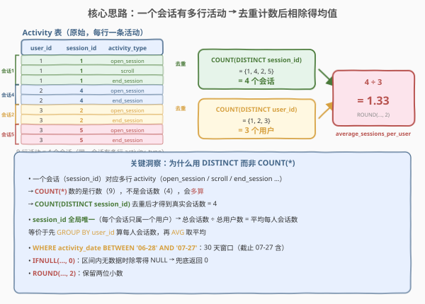
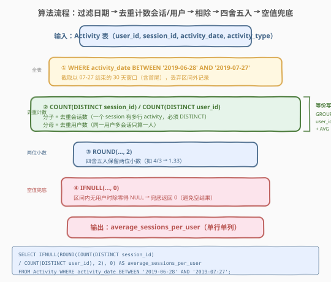
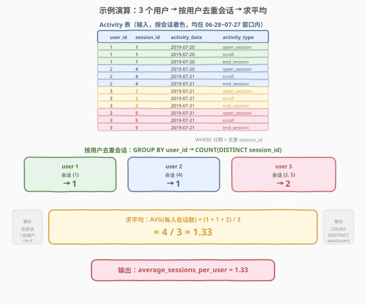

# 过去30天的用户活动 II

- **题目名称**：过去30天的用户活动 II
- **链接**：[1142. 过去30天的用户活动 II](https://leetcode.cn/problems/user-activity-for-the-past-30-days-ii/)
- **难度**：简单
- **标签**：SQL、聚合、COUNT DISTINCT、日期过滤、IFNULL、ROUND

## 1. 题目概述

给定 `Activity` 表，记录用户在会话中的各种活动（打开会话、滚动、结束会话等）。编写 SQL 查询，统计**以 `2019-07-27` 为结束日期的 30 天窗口内**（即 `2019-06-28` 至 `2019-07-27`，含首尾），**平均每个用户有多少个会话**，结果四舍五入保留两位小数。

**表结构**：

```text
Table: Activity
+---------------+---------+
| Column Name   | Type    |
+---------------+---------+
| user_id       | int     |
| session_id    | int     |
| activity_date | date    |
| activity_type | enum    |
+---------------+---------+
```

> ⚠️ 该表**无主键**，可能存在重复行。`activity_type` 是 ENUM 类型，取值包括 `'open_session'`、`'end_session'`、`'scroll'`、`'redirect'`、`'back'`。一个会话（`session_id`）通常对应多行活动记录（从 `open_session` 到 `end_session` 之间的每次操作各占一行）。

**示例 1**：

```text
输入：
Activity 表
+---------+------------+---------------+---------------+
| user_id | session_id | activity_date | activity_type |
+---------+------------+---------------+---------------+
| 1       | 1          | 2019-07-20    | open_session  |
| 1       | 1          | 2019-07-20    | scroll        |
| 1       | 1          | 2019-07-20    | end_session   |
| 2       | 4          | 2019-07-20    | open_session  |
| 2       | 4          | 2019-07-21    | scroll        |
| 2       | 4          | 2019-07-21    | end_session   |
| 3       | 2          | 2019-07-21    | open_session  |
| 3       | 2          | 2019-07-21    | scroll        |
| 3       | 2          | 2019-07-21    | end_session   |
| 3       | 5          | 2019-07-21    | open_session  |
| 3       | 5          | 2019-07-21    | scroll        |
| 3       | 5          | 2019-07-21    | end_session   |
+---------+------------+---------------+---------------+

输出：
+---------------------------+
| average_sessions_per_user |
+---------------------------+
| 1.33                      |
+---------------------------+
```

**解释**：

| user_id | 拥有的 session_id | 会话数 | 说明 |
|---------|-------------------|--------|------|
| 1 | {1} | 1 | 3 行活动属于同一会话 |
| 2 | {4} | 1 | 3 行活动属于同一会话 |
| 3 | {2, 5} | 2 | 两个不同会话，各 3 行活动 |

平均每人会话数 = $(1 + 1 + 2) / 3 = 4 / 3 \approx 1.33$

**约束条件**：

- `Activity` 表无主键，可能存在重复行
- `activity_type` 为 ENUM 类型（`'open_session'`、`'end_session'`、`'scroll'`、`'redirect'`、`'back'`）
- 统计窗口为 `2019-06-28` 至 `2019-07-27`（含首尾，共 30 天）
- 结果四舍五入保留两位小数
- 输出列名：`average_sessions_per_user`（单行单列）
- 若窗口内无任何用户活动，应返回 `0`（而非 `NULL`）

> 💡 本题的核心难点在于：① 一个 `session_id` 对应**多行**活动记录（open/scroll/end…），数会话数必须 `COUNT(DISTINCT session_id)` 而非 `COUNT(*)`；② "平均每人会话数" = 总会话数 ÷ 总用户数，`session_id` 全局唯一时可直接相除；③ 窗口内可能无数据导致除零，需 `IFNULL` 兜底。

---

## 2. 解题思路

### 2.1 暴力思路：逐行计数

最直觉的（错误）想法是直接 `COUNT(*) / COUNT(DISTINCT user_id)`——用总行数除以用户数。但这忽略了**一个会话有多行活动**的事实：示例中 12 行活动只对应 4 个会话，`COUNT(*)` 会把 12 当成会话数，严重多算。

> ⚠️ **最常见的坑**：把"行数"当成"会话数"。一个会话从 `open_session` 到 `end_session` 之间有若干次 `scroll`/`redirect`/`back`，每次操作都是一行记录。必须用 `COUNT(DISTINCT session_id)` 去重，才能得到真实会话数。

### 2.2 核心观察：去重计数后相除



**关键洞察**："平均每人会话数"的数学定义是 $\frac{\text{总会话数}}{\text{总用户数}}$。由于 `session_id` 全局唯一（每个会话只属于一个用户），所以：

$$\text{average\_sessions\_per\_user} = \frac{\text{COUNT}(\text{DISTINCT session\_id})}{\text{COUNT}(\text{DISTINCT user\_id})}$$

这等价于先 `GROUP BY user_id` 算出每人的会话数，再取 `AVG`——两种写法结果相同，但直接相除更简洁。

> 💡 **为何 `DISTINCT` 是关键**：
> - `COUNT(DISTINCT session_id)`：对 `session_id` 去重后计数 → 真实会话数（示例中 {1, 2, 4, 5} = 4）
> - `COUNT(DISTINCT user_id)`：对 `user_id` 去重后计数 → 真实用户数（示例中 {1, 2, 3} = 3）
> - 若误用 `COUNT(*)`：数的是行数（12），而非会话数（4），会得到 $12/3 = 4$ 的错误答案

> ⚠️ **三个易错点**：
> - **必须 `DISTINCT session_id`**：同一会话有多行 activity（open/scroll/end…），`COUNT(*)` 会多算
> - **日期窗口是 30 天**：以 `2019-07-27` 为终点向前推 30 天 = `2019-06-28`（含首尾），不是 `06-30`
> - **`IFNULL` 兜底**：窗口内无用户时 `COUNT(DISTINCT user_id) = 0`，除零得 `NULL`，需兜底返回 `0`

### 2.3 算法流程图



**完整步骤**：

1. **`WHERE activity_date BETWEEN '2019-06-28' AND '2019-07-27'`**：截取 30 天窗口，丢弃区间外记录
2. **`COUNT(DISTINCT session_id) / COUNT(DISTINCT user_id)`**：去重后相除，分子=总会话数，分母=总用户数
3. **`ROUND(..., 2)`**：四舍五入保留两位小数（如 $4/3 \to 1.33$）
4. **`IFNULL(..., 0)`**：窗口内无数据时除零得 `NULL` → 兜底返回 `0`
5. **输出**：`average_sessions_per_user`（单行单列）

> 💡 **步骤顺序**：`WHERE` 先过滤日期 → 对过滤后的行做两个 `COUNT(DISTINCT)` → 相除 → `ROUND` → `IFNULL`。`ROUND` 包裹除法结果，`IFNULL` 包裹 `ROUND` 结果——从内到外依次是除法 → 四舍五入 → 空值兜底。

### 2.4 示例演算

以示例 1 数据为例，观察逐步执行过程：



**步骤 ①：`WHERE activity_date BETWEEN '2019-06-28' AND '2019-07-27'`**

所有 12 行活动的日期均在 `07-20` 和 `07-21`，落在窗口内，无行被过滤。

**步骤 ②：去重计数**

| 聚合 | 去重值 | 结果 |
|------|--------|------|
| `COUNT(DISTINCT session_id)` | {1, 4, 2, 5} | 4 |
| `COUNT(DISTINCT user_id)` | {1, 2, 3} | 3 |

> 💡 **按用户展开**（等价视角）：user 1 → 会话 {1} → 1 个；user 2 → 会话 {4} → 1 个；user 3 → 会话 {2, 5} → 2 个。$\text{AVG} = (1+1+2)/3 = 4/3$，与直接相除结果一致。

**步骤 ③④：相除 + `ROUND` + `IFNULL`**

$$\frac{4}{3} = 1.333\ldots \xrightarrow{\text{ROUND}(\cdot, 2)} 1.33 \xrightarrow{\text{IFNULL}(\cdot, 0)} 1.33$$

最终输出 `average_sessions_per_user = 1.33`。

---

## 3. 参考代码

### SQL（解法 A：直接相除，推荐）

```sql
SELECT IFNULL(ROUND(COUNT(DISTINCT session_id) / COUNT(DISTINCT user_id), 2), 0) AS average_sessions_per_user
FROM Activity
WHERE activity_date BETWEEN '2019-06-28' AND '2019-07-27';
```

> 💡 **写法要点**：
> - `COUNT(DISTINCT session_id)`：对会话 ID 去重计数 = 总会话数（一个会话有多行 activity，必须 DISTINCT）
> - `COUNT(DISTINCT user_id)`：对用户 ID 去重计数 = 总用户数（同一用户多个会话只算一人）
> - 两者相除即为平均每人会话数，前提是 `session_id` 全局唯一（每个会话只属一个用户）
> - `ROUND(..., 2)` 保留两位小数，`IFNULL(..., 0)` 兜底空结果
> - 无 `GROUP BY`：整张过滤后的表作为一个大组，输出单行单列聚合值

### SQL（解法 B：GROUP BY + AVG，更通用）

```sql
SELECT IFNULL(ROUND(AVG(sessions_per_user), 2), 0) AS average_sessions_per_user
FROM (
    SELECT COUNT(DISTINCT session_id) AS sessions_per_user
    FROM Activity
    WHERE activity_date BETWEEN '2019-06-28' AND '2019-07-27'
    GROUP BY user_id
) t;
```

> 💡 **与解法 A 的区别**：内层 `GROUP BY user_id` 先算出每人拥有的会话数（`sessions_per_user`），外层 `AVG` 取平均。这种写法**不依赖 `session_id` 全局唯一**的假设——即使两个用户碰巧有相同 `session_id`，`GROUP BY user_id` 后的 `COUNT(DISTINCT session_id)` 也只在各自组内去重，互不干扰。可读性更强（"每人会话数的平均"语义直观），但多一层子查询。

### SQL（解法 C：LEFT JOIN 日期序列补零，可选）

```sql
SELECT IFNULL(ROUND(COUNT(DISTINCT a.session_id) / COUNT(DISTINCT a.user_id), 2), 0) AS average_sessions_per_user
FROM (
    SELECT DATE_ADD('2019-06-28', INTERVAL seq DAY) AS d
    FROM (SELECT 0 AS seq UNION SELECT 1 UNION SELECT 2 UNION SELECT 3 UNION SELECT 4
          UNION SELECT 5 UNION SELECT 6 UNION SELECT 7 UNION SELECT 8 UNION SELECT 9
          UNION SELECT 10 UNION SELECT 11 UNION SELECT 12 UNION SELECT 13 UNION SELECT 14
          UNION SELECT 15 UNION SELECT 16 UNION SELECT 17 UNION SELECT 18 UNION SELECT 19
          UNION SELECT 20 UNION SELECT 21 UNION SELECT 22 UNION SELECT 23 UNION SELECT 24
          UNION SELECT 25 UNION SELECT 26 UNION SELECT 27 UNION SELECT 28 UNION SELECT 29) days
) dr
LEFT JOIN Activity a ON a.activity_date = dr.d
WHERE a.activity_date IS NOT NULL;
```

> 💡 **写法要点**：用 30 个常量行模拟日期序列，`LEFT JOIN` Activity 表。此写法在本题无实际意义（题目只要求一个标量平均值，不需要逐日补零），仅作为"日期序列生成"技法的演示。实际场景中若需逐日统计可参考此模式。MySQL 8.0+ 可用递归 CTE 更优雅地生成日期序列。

### Python（pandas）

```python
import pandas as pd

def user_activity_for_the_past_30_days_ii(activity: pd.DataFrame) -> pd.DataFrame:
    start = pd.Timestamp('2019-06-28')
    end = pd.Timestamp('2019-07-27')
    mask = (activity['activity_date'] >= start) & (activity['activity_date'] <= end)
    filtered = activity[mask]
    total_sessions = filtered['session_id'].nunique()
    total_users = filtered['user_id'].nunique()
    avg = round(total_sessions / total_users, 2) if total_users > 0 else 0
    return pd.DataFrame({'average_sessions_per_user': [avg]})
```

> 💡 **pandas 对照**：`nunique()` 对应 SQL 的 `COUNT(DISTINCT ...)`；`total_users > 0` 的条件判断对应 `IFNULL` 的除零兜底；`round(..., 2)` 对应 `ROUND(..., 2)`。pandas 中除零会抛异常（而非返回 `NULL`），所以需显式 `if` 判断。

---

## 4. 复杂度分析

| 维度 | 解法 A（直接相除） | 解法 B（GROUP BY + AVG） | 解法 C（LEFT JOIN 日期序列） |
|------|-------------------|-------------------------|---------------------------|
| **时间** | $O(n)$ | $O(n)$ | $O(n)$ |
| **空间** | $O(1)$ | $O(u)$ | $O(n)$ |
| **扫描次数** | 1 次（WHERE + 聚合） | 1 次（WHERE + GROUP BY + AVG） | 1 次（JOIN + 聚合） |
| **推荐度** | ✓ **首选**，简洁高效 | ✓ 备选，语义更通用 | △ 过重，仅演示技法 |

> - $n$ = `Activity` 表行数，$u$ = 不同 `user_id` 数量（$u \leq n$）
> - 解法 A/B：`COUNT(DISTINCT)` 内部用哈希表去重，$O(n)$ 时间；解法 B 额外物化 $u$ 行子查询结果
> - 解法 C：`LEFT JOIN` 30 行常量表与 `Activity`，驱动表小，代价仍在 $O(n)$
> - 空间：解法 A 仅维护两个哈希集合 $O(1)$ 输出；解法 B 子查询物化 $O(u)$ 行

---

## 5. 扩展：两种等价写法的数学证明与适用场景

### 5.1 为什么"直接相除"和"GROUP BY + AVG"结果相同

设窗口内有 $u$ 个用户，第 $i$ 个用户有 $s_i$ 个会话。则：

- **直接相除**：$\frac{\text{COUNT}(\text{DISTINCT session\_id})}{\text{COUNT}(\text{DISTINCT user\_id})} = \frac{\sum_{i=1}^{u} s_i}{u}$（因为 `session_id` 全局唯一，总会话数 = 各用户会话数之和）
- **GROUP BY + AVG**：$\text{AVG}(s_i) = \frac{1}{u}\sum_{i=1}^{u} s_i = \frac{\sum s_i}{u}$

两者数学等价。前提是 **`session_id` 全局唯一**——若两个用户共享同一 `session_id`，则 `COUNT(DISTINCT session_id)` 会把共享会话只算一次，导致分子变小，直接相除的结果偏小。此时只有解法 B（GROUP BY + AVG）正确。

### 5.2 何时该用哪种

| 场景 | 推荐 | 原因 |
|------|------|------|
| `session_id` 全局唯一（本题） | 解法 A | 更简洁，无需子查询 |
| `session_id` 非全局唯一（跨用户可重复） | 解法 B | `GROUP BY user_id` 后组内去重，不跨用户合并 |
| 需要逐用户查看会话数明细 | 解法 B | 内层子查询本身就是"每人会话数"表，可单独取用 |

### 5.3 同类"比率聚合"模式

本题的"总会话数 ÷ 总用户数"是 SQL **比率聚合**的经典模式——分子和分母是两个不同粒度的 `COUNT(DISTINCT)`，相除得比率。同类题目包括：

```sql
-- 泛化模板：平均每实体的关联数
SELECT IFNULL(ROUND(COUNT(DISTINCT item_id) / COUNT(DISTINCT entity_id), 2), 0) AS avg_per_entity
FROM Records
WHERE date BETWEEN 'start' AND 'end';
```

---

## 6. 面试要点

1. **为什么用 `COUNT(DISTINCT session_id)` 而非 `COUNT(*)`？**

   > `Activity` 表中一个会话（`session_id`）对应多行活动记录（`open_session`、`scroll`、`end_session` 等）。`COUNT(*)` 数的是行数（示例中 12 行），而非会话数（4 个）。必须 `COUNT(DISTINCT session_id)` 去重后才能得到真实会话数。这是本题最大的陷阱。

2. **30 天窗口的起止日期是什么？为什么是 `06-28` 而非 `06-30`？**

   > 题目要求"以 `2019-07-27` 为结束日期的 30 天"，即从 `2019-07-27` 向前推 29 天得到 `2019-06-28`（含首尾共 30 天）。若误用 `06-30` 作为起点则只有 28 天，漏掉 `06-28` 和 `06-29` 两天的数据。面试时答："30 天窗口含首尾，`07-27` 减 29 天 = `06-28`，用 `BETWEEN '2019-06-28' AND '2019-07-27'`。"

3. **`IFNULL(..., 0)` 的作用是什么？什么时候会触发？**

   > 当 30 天窗口内没有任何用户活动时，`COUNT(DISTINCT user_id) = 0`，除法 `4/0` 在 MySQL 中返回 `NULL`（而非报错）。`IFNULL` 将 `NULL` 转为 `0`，确保空结果返回 `0` 而非 `NULL`。这是 SQL 中处理"比率聚合除零"的标准兜底手法。

4. **解法 A（直接相除）和解法 B（GROUP BY + AVG）有什么区别？**

   > 数学上两者等价（当 `session_id` 全局唯一时）。解法 A 更简洁——单层查询，两个 `COUNT(DISTINCT)` 相除；解法 B 更通用——内层 `GROUP BY user_id` 算每人会话数，外层 `AVG` 取平均，**不依赖 `session_id` 全局唯一**的假设。若 `session_id` 可能跨用户重复，只有解法 B 正确。面试答："首选解法 A 简洁高效；若 `session_id` 非全局唯一或需要逐用户明细，用解法 B。"

5. **`ROUND(..., 2)` 和 `IFNULL(..., 0)` 的嵌套顺序能反过来吗？**

   > 不能。必须是 `IFNULL(ROUND(..., 0))` 而非 `ROUND(IFNULL(..., 0))`。因为除零产生 `NULL` 发生在 `ROUND` 之前——`ROUND(NULL, 2)` 返回 `NULL`，再被 `IFNULL` 兜底为 `0`。若反过来 `IFNULL` 先执行，除法结果已是 `NULL`，`IFNULL(NULL, 0)` 得 `0`，`ROUND(0, 2)` 得 `0.00`——虽然数值碰巧相同，但语义上 `ROUND` 应作用于"有效数值"，`IFNULL` 应在最外层兜底，顺序不可随意调换。

> 💡 **一句话总结**：1142 是 SQL **"去重计数比率聚合"经典模板**——`COUNT(DISTINCT session_id) / COUNT(DISTINCT user_id)` 求平均每人会话数。三个易错点：① 一个会话有多行 activity，必须 `DISTINCT session_id`（不是 `COUNT(*)`）；② 30 天窗口是 `06-28` 至 `07-27`（含首尾）；③ `IFNULL(..., 0)` 兜底除零空结果。记住"去重计数相除 + ROUND + IFNULL"这条公式，所有"平均每实体的关联数"类 SQL 题都能套用。

---

## 7. 同类练习题

- [1141. 查询近 30 天活跃用户数](https://leetcode.cn/problems/user-activity-for-the-past-30-days-i/)：同一张 `Activity` 表的姐妹题——`WHERE activity_date BETWEEN` 日期过滤 + `GROUP BY activity_date, COUNT(DISTINCT user_id)` 按日去重计数，对比 1142 的"标量比率"与"逐日计数"
- [550. 游戏玩法分析 IV](https://leetcode.cn/problems/game-play-analysis-iv/)：`COUNT(DISTINCT)` 比率聚合——首次登录次日也登录的玩家占比，分子分母都是 `COUNT(DISTINCT player_id)`
- [1174. 即时食物配送 II](https://leetcode.cn/problems/immediate-food-delivery-ii/)：`COUNT` 比率——首次订单即时配送的比例，`SUM(CASE WHEN) / COUNT(DISTINCT)` 的比率聚合模式
- [511. 游戏玩法分析 I](https://leetcode.cn/problems/game-play-analysis-i/)：`GROUP BY player_id + MIN(event_date)` 求每位玩家首次登录日期，是 1142 中"按用户聚合"的简化版（无比率计算）
- [1084. 销售分析 III](https://leetcode.cn/problems/sales-analysis-iii/)：`WHERE date BETWEEN` 过滤区间 + `GROUP BY product_id` 聚合，共享"日期区间过滤 + 分组聚合"的骨架
