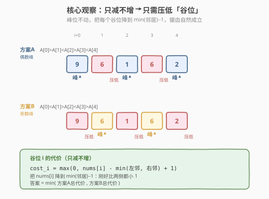
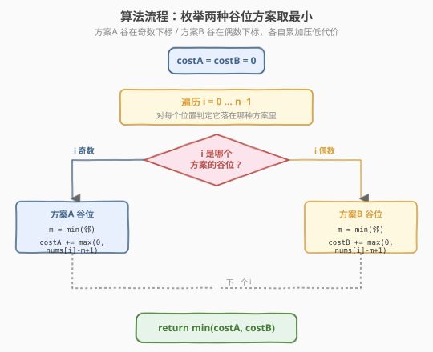
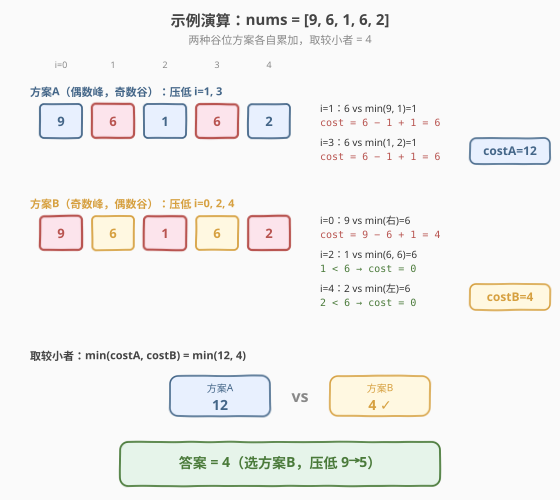

# LeetCode 递减元素使数组呈锯齿状 题解

## 1. 题目概述

- **标题 / 题号**：递减元素使数组呈锯齿状（#1144，medium）
- **链接**：https://leetcode.cn/problems/decrease-elements-to-make-array-zigzag/
- **难度**：中等
- **标签**：贪心、数组

**题意**：给定整数数组 `nums`，每次**操作**从中选择一个元素并**将该元素的值减少 1**。如果满足下列情况之一，则数组 `A` 是**锯齿数组**：

- 每个偶数索引对应的元素都大于相邻元素，即 `A[0] > A[1] < A[2] > A[3] < A[4] > ...`
- 或者，每个奇数索引对应的元素都大于相邻元素，即 `A[0] < A[1] > A[2] < A[3] > A[4] < ...`

返回将 `nums` 转换为锯齿数组所需的**最小操作次数**。

**示例 1**：

```text
输入：nums = [1,2,3]
输出：2
解释：可以把 2 递减到 0（得 [1,0,3]，1>0<3），或把 3 递减到 1（得 [1,2,1]，1<2>1）。
```

**示例 2**：

```text
输入：nums = [9,6,1,6,2]
输出：4
```

**约束**：

- `1 <= nums.length <= 1000`
- `1 <= nums[i] <= 1000`

> 💡 本题的题眼是**「只能减、不能加」**。这一限制把看似需要全局协调的锯齿整形问题，化简成「逐个谷位独立贪心」的局部决策——每个谷位只需和它的两个邻居比大小，互不干扰。属于典型的**枚举两种方案 + 局部贪心**套路。

## 2. 解题思路

### 2.1 暴力思路：枚举每个位置的取值

对每个位置，尝试把它递减到 `1..nums[i]` 之间的所有可能值，再用递归/DP 校验能否形成锯齿。状态空间是 $\prod (nums[i])$，量级远超时限，且「只能减」的约束让暴力更难写对。

### 2.2 核心观察：只减不增 → 只需压低「谷位」



锯齿数组只有两种形态，由**谁当峰**决定：

| 方案 | 峰位（大于邻居） | 谷位（小于邻居） | 锯齿形态 |
|------|-----------------|-----------------|----------|
| **方案A** | 偶数下标 `0,2,4,...` | 奇数下标 `1,3,5,...` | `A[0]>A[1]<A[2]>A[3]<...` |
| **方案B** | 奇数下标 `1,3,5,...` | 偶数下标 `0,2,4,...` | `A[0]<A[1]>A[2]<A[3]>...` |

**关键洞察**：因为**只能减、不能加**，要让某个位置成为「峰」（大于邻居），我们无法抬高它，只能去压低它的邻居；而邻居正是「谷」位。于是两种角色出现了一个漂亮的分离——

- **峰位**：保持不动（减它只会让条件更难满足，徒增代价）；
- **谷位**：把它压到比两侧邻居都小即可，且**每个谷位的决策互相独立**。

> 💡 **为什么谷位互相独立？** 谷位 $i$ 的条件是 `nums[i] < nums[i-1]` 且 `nums[i] < nums[i+1]`。它的两侧邻居都是峰位（不动）。压低谷位 $i$ 不会影响邻居的值，也不会影响其它谷位（谷位之间隔着峰位，不相邻）。所以每个谷位各自贪心取最小代价，加总即为该方案的总代价。

**谷位 $i$ 的代价**：把 `nums[i]` 降到刚好比 `min(左邻, 右邻)` 小 1，即目标值 `min(左邻, 右邻) - 1`：

$$
\text{cost}_i = \max\bigl(0,\ \text{nums}[i] - \min(\text{左邻}, \text{右邻}) + 1\bigr)
$$

- 若 `nums[i]` 本就比两侧邻居都小，`nums[i] - min + 1 ≤ 0`，代价为 0（无需操作）；
- 否则需操作 `nums[i] - min(邻居) + 1` 次，把它降到 `min(邻居) - 1`。

**边界**：首尾谷位只有一个邻居，`min` 只取存在的那一侧。

**答案**：$\min(\text{costA}, \text{costB})$，两种方案取较小。

### 2.3 算法流程图



**完整步骤**：

1. 初始化 `costA = costB = 0`
2. 遍历 `i = 0 … n-1`：
   - 取邻居的最小值 `m = min(nums[i-1], nums[i+1])`（越界则只取存在的一侧）
   - 若 `i` 为奇数 → 它是方案A的谷位：`costA += max(0, nums[i] - m + 1)`
   - 若 `i` 为偶数 → 它是方案B的谷位：`costB += max(0, nums[i] - m + 1)`
3. 返回 `min(costA, costB)`

> ⚠️ **下标从 0 开始**：本题以 0 为偶数下标，与题目定义 `A[0] > A[1] < A[2] > ...` 一致。判断奇偶用 `i & 1` 或 `i % 2`。

### 2.4 示例演算

以 `nums = [9, 6, 1, 6, 2]` 为例：



**方案A（偶数峰，奇数谷，压低 i=1, 3）**：

| 谷位 i | nums[i] | 邻居 | min(邻居) | 代价 |
|--------|---------|------|-----------|------|
| 1 | 6 | 9, 1 | 1 | `6 - 1 + 1 = 6` |
| 3 | 6 | 1, 2 | 1 | `6 - 1 + 1 = 6` |

`costA = 6 + 6 = 12`

**方案B（奇数峰，偶数谷，压低 i=0, 2, 4）**：

| 谷位 i | nums[i] | 邻居 | min(邻居) | 代价 |
|--------|---------|------|-----------|------|
| 0 | 9 | (右)6 | 6 | `9 - 6 + 1 = 4` |
| 2 | 1 | 6, 6 | 6 | `1 < 6 → 0` |
| 4 | 2 | (左)6 | 6 | `2 < 6 → 0` |

`costB = 4 + 0 + 0 = 4`

**答案** = `min(12, 4) = 4`（选方案B，把 `9` 压到 `5`，得 `[5,6,1,6,2]`，满足 `5<6>1<6>2`）。

> 💡 **观察**：方案A 要把两个 `6` 都压到 `0`（代价 12），而方案B 只需压最左的 `9`（代价 4）。两种方案的代价可以差很多，所以必须**都算一遍取最小**，不能凭直觉选。

## 3. 参考代码

### C++

```cpp
// 递减元素使数组呈锯齿状.cpp —— 贪心，枚举两种谷位方案
// 编译: g++ -O2 -std=c++17 递减元素使数组呈锯齿状.cpp -o dz
class Solution {
public:
    int movesToMakeZigzag(vector<int>& nums) {
        int costA = 0, costB = 0;          // A: 奇数谷  B: 偶数谷
        int n = nums.size();
        for (int i = 0; i < n; i++) {
            int left  = (i - 1 >= 0) ? nums[i - 1] : INT_MAX;   // 无左邻视为 +∞
            int right = (i + 1 < n) ? nums[i + 1] : INT_MAX;    // 无右邻视为 +∞
            int m = min(left, right);
            int cost = max(0, nums[i] - m + 1);                 // 压到 m-1 所需次数
            if (i & 1) costA += cost;                           // 奇数下标 → 方案A 谷
            else       costB += cost;                           // 偶数下标 → 方案B 谷
        }
        return min(costA, costB);
    }
};
```

### Python

```python
class Solution:
    def movesToMakeZigzag(self, nums: List[int]) -> int:
        costA = costB = 0                  # A: 奇数谷  B: 偶数谷
        n = len(nums)
        for i in range(n):
            left  = nums[i - 1] if i - 1 >= 0 else float('inf')   # 无左邻视为 +∞
            right = nums[i + 1] if i + 1 < n else float('inf')    # 无右邻视为 +∞
            m = min(left, right)
            cost = max(0, nums[i] - m + 1)                        # 压到 m-1 所需次数
            if i & 1:
                costA += cost                                     # 奇数下标 → 方案A 谷
            else:
                costB += cost                                     # 偶数下标 → 方案B 谷
        return min(costA, costB)
```

> 💡 **实现细节**：① 越界邻居用 `INT_MAX` / `float('inf')` 占位，`min` 时自动被忽略，等价于「只和存在的那一侧比」，免去首尾特判。② `cost = max(0, nums[i] - m + 1)`：`+1` 是因为要**严格小于**（差 1 刚好）。③ 一次遍历同时累加两种方案，无需跑两遍。

## 4. 复杂度分析

| 维度 | 复杂度 | 说明 |
|------|--------|------|
| **时间** | `O(n)` | 单趟遍历，每个位置 `O(1)` 比较与累加 |
| **空间** | `O(1)` | 只用 `costA / costB` 两个累加变量，原地处理 |

> ⚠️ `n ≤ 1000`，`O(n)` 远低于时限。即便 `n` 到 $10^6$ 也轻松通过。

## 5. 扩展：如果允许「加或减」会怎样？

若操作变成「任选元素加 1 或减 1」（双向调整），问题就不再是只压谷位了——峰位也可以抬高，谷位也可以压低，需要在「抬高峰」和「压低谷」之间权衡最小总代价。

此时贪心不再 trivially 独立：抬高一个峰会影响两侧谷位的判定。常见做法转为**DP**：定义 `dp[i][0/1]` 表示位置 `i` 当谷/当峰时的最小代价，按相邻状态转移。本题因「只减不增」的约束，恰好让峰位锁定不动、谷位独立，才退化成 `O(n)` 贪心。

> 💡 这说明**约束方向决定算法结构**：单向操作 → 局部贪心；双向操作 → 状态 DP。审题时先确认「能不能加」。

## 6. 面试要点

1. **为什么峰位不需要动？**

   > 因为只能减。把峰位减小只会让它「大于邻居」的条件更难满足，纯属浪费操作。峰位保持原值，靠压低两侧谷位来满足 `峰 > 谷`。

2. **为什么谷位之间互不影响？**

   > 谷位不相邻——每个谷位两侧都是峰位。压低谷位 $i$ 只改 `nums[i]`，不影响峰位（邻居）的值，也不影响其它谷位（隔着峰位）。所以每个谷位独立贪心，总代价即各谷位代价之和。

3. **代价公式里的 `+1` 是什么含义？**

   > 锯齿要求**严格**大于/小于（`>` / `<`，非 `≥` / `≤`）。把谷位压到 `min(邻居) - 1`，比最小邻居刚好小 1，满足严格小于。所以操作次数 = `nums[i] - (min(邻居) - 1) = nums[i] - min(邻居) + 1`。

4. **为什么必须算两种方案取 min？**

   > 两种方案「谁当峰」不同，谷位集合完全不同，代价可能天差地别（示例中 12 vs 4）。无法预先判断哪种更优，必须都算一遍取较小。这也是「枚举所有可能形态」思想的体现。

5. **首尾位置只有一个邻居怎么处理？**

   > 首位 `i=0` 只有右邻，末位 `i=n-1` 只有左邻。`min` 只取存在的那一侧即可。代码里用 `INT_MAX` / `float('inf')` 占位缺失侧，`min` 自动忽略，免去特判。

> 💡 **一句话总结**：1144 的核心是「只减不增」这一约束把锯齿整形问题化简为「枚举两种谷位方案 + 逐谷位独立贪心」——峰位不动，每个谷位压到 `min(邻居)-1`，代价 `max(0, nums[i]-min(邻居)+1)`，两种方案取最小，`O(n)` 时间 `O(1)` 空间。

## 同类练习题

| # | 题目 | 与本题的关联 |
|---|------|-------------|
| 376 | [摆动序列](https://leetcode.cn/problems/wiggle-subsequence/) | 同样是「峰谷交替」结构，但求最长摆动子序列长度，用贪心/DP 数峰谷个数 |
| 324 | [摆动排序 II](https://leetcode.cn/problems/wiggle-sort-ii/) | 要求重排成 `a<b>c<d>e`，需排序 + 交叉放置，对照本题「只减不增」的约束差异 |
| 280 | [摆动排序](https://leetcode.cn/problems/wiggle-sort/) | 原地调整成摆动数组，一次遍历交换，与本题「压低谷位」思路呼应 |
| 922 | [按奇偶排序数组 II](https://leetcode.cn/problems/sort-array-by-parity-ii/) | 按下标奇偶分组的另一变体，双指针交换 |
