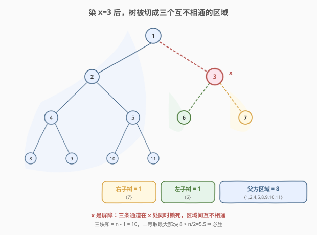
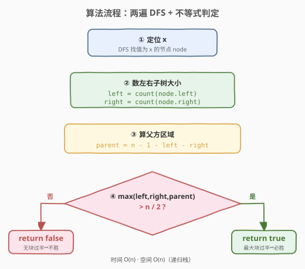
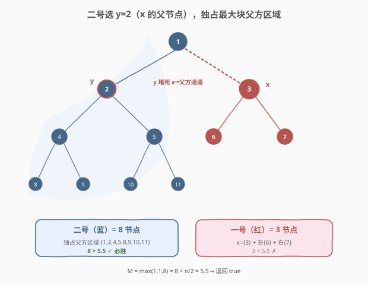

# 二叉树着色游戏

- **题目名称**：二叉树着色游戏
- **链接**：[1145. 二叉树着色游戏](https://leetcode.cn/problems/binary-tree-coloring-game/)
- **难度**：中等
- **标签**：树、二叉树、深度优先搜索、博弈

## 1. 题目概述

两位玩家在一棵 `n` 个节点（`n` 为奇数）的二叉树上着色。节点值 `1..n` 互不相同。

- 一号玩家先选定值 `x`，染红；二号玩家再选定值 `y`（`y ≠ x`），染蓝。
- 之后**轮流**操作（一号先手）：每回合选一个**自己已染色**的节点，把它的某个**未着色邻节点**（左子、右子、父节点）染成自己的颜色。
- 无可染节点则跳过该回合；双方都无法操作时游戏结束。**染色多者胜**。

你是二号玩家，判断是否存在一个 `y` 使你**必胜**，是则返回 `true`。

**示例 1**：

```text
输入：root = [1,2,3,4,5,6,7,8,9,10,11], n = 11, x = 3
输出：true
解释：二号玩家可选 y=2，染蓝后可独占 8 个节点而获胜。
```

**示例 2**：

```text
输入：root = [1,2,3], n = 3, x = 1
输出：false
```

**约束条件**：

- `1 <= x <= n <= 100`
- `n` 是奇数
- 树中所有值互不相同

> 💡 这是一道**树形博弈**题。关键不在模拟下棋过程，而在于看透「染色即切割」——一号染了 `x` 后，整棵树被切成三个互不相通的区域，二号只要堵住最大那块即可独吞。本质是**子树大小计数 + 不等式判定**，O(n) 一遍 DFS 即可。

---

## 2. 解题思路

### 2.1 暴力思路：模拟博弈

枚举二号玩家的每个候选 `y`，对每个 `(x, y)` 用 BFS/DFS 模拟双方轮流染色、统计最终节点数，判断二号是否获胜。一号有最优应对时还需 minimax 搜索。`n ≤ 100` 虽可接受，但实现复杂、常数大，且未抓住题目结构。

### 2.2 核心观察：染色即切割，三选一堵最大块



一号染红 `x` 后，**`x` 成为一道红色屏障**。从 `x` 出发只有三条通往未着色区域的「通道」：

| 区域 | 通道 | 节点来源 |
|------|------|----------|
| **左子树** | `x` 的左子节点 | `x` 左子树全部节点 |
| **右子树** | `x` 的右子节点 | `x` 右子树全部节点 |
| **父方区域** | `x` 的父节点 | 除 `x` 及其两棵子树外的所有节点 |

> 💡 **为什么三个区域互不相通？** 一旦 `x` 被染红，任何人要「跨区域」染色都必须经过 `x`，而 `x` 已着色、不可重复染色，所以三条通道在 `x` 处被同时锁死。二号只要**染掉某条通道入口的邻节点**，一号就再也无法进入该区域；同理二号在该区域内可沿着未被堵死的边自由扩张，**独占整块**。

**二号的最优策略**：选 `x` 的某个邻节点 `y`（左子 / 右子 / 父），染蓝后便独占对应区域。三块大小分别记为 `left`、`right`、`parent = n - 1 - left - right`。二号取最大那块，一号拿到 `x` 加剩下两块。

设三块最大值为 $M = \max(left, right, parent)$，则：

- 二号染色数 = $M$
- 一号染色数 = $n - M$
- 二号获胜 $\iff M > n - M \iff 2M > n \iff M > \dfrac{n}{2}$

由于 $n$ 为奇数，$M > \lfloor n/2 \rfloor$ 即等价于 $M \geq \lceil n/2 \rceil = (n+1)/2$。代码里直接判 `M > n // 2` 即可。

> ⚠️ **二号为什么不选非邻节点？** 若 `y` 不是 `x` 的邻节点，则二号与一号之间至少隔着一条未堵死的通道，一号可能抢先渗入二号想占的区域。选邻节点能**第一时间堵死通道**、确保独占，必然不劣于其它选择。

### 2.3 算法流程图



**完整步骤**：

1. **定位 `x`**：DFS 在树中找到值为 `x` 的节点 `node`。
2. **数子树大小**：分别 DFS 统计 `node->left` 与 `node->right` 的节点数，记 `left`、`right`。
3. **算父方区域**：`parent = n - 1 - left - right`（总数减去 `x` 自身与两棵子树）。
4. **判定**：若 `max(left, right, parent) > n / 2` 返回 `true`，否则 `false`。

### 2.4 示例演算

以示例 1 为例（`n = 11, x = 3`），树形如下：



| 区域 | 节点 | 大小 |
|------|------|------|
| 左子树（`3` 的左子 `6`） | `{6}` | 1 |
| 右子树（`3` 的右子 `7`） | `{7}` | 1 |
| 父方区域 | `{1,2,4,5,8,9,10,11}` | 8 |

- $M = \max(1, 1, 8) = 8$，$n / 2 = 5.5$，$8 > 5.5$ ⇒ 返回 `true`。
- 二号选 $y = 2$（`x=3` 的父节点），独占父方区域 8 个节点；一号仅得 `x=3` 及 `{6,7}` 共 3 个，$8 > 3$ 二号胜。

示例 2（`n = 3, x = 1`，根节点）：`x` 是根，无父方区域，`left = right = 1`，`parent = 0`，$M = 1$，$n/2 = 1.5$，$1 > 1.5$ 不成立 ⇒ 返回 `false`。

---

## 3. 参考代码

### C++

```cpp
// 二叉树着色游戏.cpp —— 子树大小计数 + 不等式判定
// 编译: g++ -O2 -std=c++17 二叉树着色游戏.cpp -o coloring_game
class Solution {
    // 统计以 node 为根的子树节点数
    int count(TreeNode* node) {
        if (!node) return 0;
        return 1 + count(node->left) + count(node->right);
    }
    // 在树中查找值为 x 的节点
    TreeNode* find(TreeNode* root, int x) {
        if (!root || root->val == x) return root;
        TreeNode* l = find(root->left, x);
        if (l) return l;
        return find(root->right, x);
    }
public:
    bool btreeGamePlayMove(TreeNode* root, int n, int x) {
        TreeNode* node = find(root, x);
        int left   = count(node->left);        // x 左子树大小
        int right  = count(node->right);       // x 右子树大小
        int parent = n - 1 - left - right;     // 父方区域大小
        int half = n / 2;                       // 奇数 n：> half 即 > n/2
        return left > half || right > half || parent > half;
    }
};
```

### Python

```python
class Solution:
    def btreeGamePlayMove(self, root: Optional[TreeNode], n: int, x: int) -> bool:
        def count(node):
            if not node:
                return 0
            return 1 + count(node.left) + count(node.right)

        def find(node):
            if not node or node.val == x:
                return node
            return find(node.left) or find(node.right)

        node = find(root)
        left   = count(node.left)          # x 左子树大小
        right  = count(node.right)         # x 右子树大小
        parent = n - 1 - left - right      # 父方区域大小
        half = n // 2                       # 奇数 n：> half 即 > n/2
        return left > half or right > half or parent > half
```

> 💡 **实现细节**：① 只需统计 `x` 的左右子树大小，父方区域由总数反推 `n - 1 - left - right`，无需再向上遍历。② `find` 用短路 `or` 写法简洁——`find(node.left) or find(node.right)`：左子找到（非空）即返回，否则返回右子查找结果。③ 判定用 `> n // 2`：`n` 为奇数，`n // 2 = (n-1)/2`，`M > (n-1)/2` 等价于 `M >= (n+1)/2`，即 `2M > n`，正是二号必胜条件。

---

## 4. 复杂度分析

| 维度 | 复杂度 | 说明 |
|------|--------|------|
| **时间** | `O(n)` | `find` 遍历至多 `n` 个节点；`count` 各遍历 `x` 的左右子树，合计不超过 `n`。整体线性。 |
| **空间** | `O(n)` | 最坏退化成链，递归栈深 `n`；平衡树为 `O(log n)`。 |

> ⚠️ 无需建图、无需模拟博弈，整题只需两遍 DFS。`n ≤ 100` 下完全无压力，即便 `n` 放大到 $10^5$ 也轻松通过。

---

## 5. 扩展：为何二号的最优解必是 `x` 的邻节点

更严格地，设二号染 `y`。二号能染到的节点 = 与 `y` 连通且途中不被一号「截胡」的区域。考虑 `y` 相对 `x` 的位置：

- **`y` 是 `x` 的邻节点**（左子/右子/父）：二号堵死 `x` 通向该方向的唯一通道，**独占整块区域**，且这块区域大小固定、不受一号干扰。
- **`y` 不是 `x` 的邻节点**：则 `x` 到 `y` 路径上至少还有一个中间节点 `m` 未着色。一号先手且能从 `x` 出发抢占 `m`，从而把二号「关」在更小的子区域内。二号所得 $\leq$ 选邻节点时的收益。

因此**选邻节点是二号的占优策略**，问题从「博弈搜索」退化为「三块取最大」，这正是本题妙处。

> 💡 类似「一步切割 + 数子树」的博弈/判定题，套路都在**子树大小**上：先想清染色/操作把树切成哪几块，再比较块大小。可参考 [814. 二叉树剪枝](https://leetcode.cn/problems/binary-tree-pruning/)（按子树是否含 1 切剪）、[508. 出现次数最多的子树元素和](https://leetcode.cn/problems/most-frequent-subtree-sum/)（子树和计数）。

---

## 6. 面试要点

1. **为什么染了 `x` 后树会被切成三个互不相通的区域？**

   > 任何跨区域染色都要经过 `x`，而 `x` 已着色不可重染，三条通道（左子、右子、父）在 `x` 处同时锁死。三个区域只能各自从 `x` 的邻节点向内扩张，互不干扰。

2. **二号为什么一定要选 `x` 的邻节点作为 `y`？**

   > 选邻节点能第一时间堵死对应通道、独占整块区域，收益固定且不受一号干扰。选非邻节点时，`x` 到 `y` 路径上有未着色中间节点，一号先手可抢先占据从而缩小二号地盘。故邻节点是占优策略。

3. **父方区域大小怎么算？为什么不用再向上遍历？**

   > 总数 `n` 已知，`x` 自身占 1，左右子树大小 `left`、`right` 已数出，父方区域 = `n - 1 - left - right`。这是「整体减局部」的常用技巧，避免维护父指针或向上回溯。

4. **判定条件为什么是 `> n // 2` 而不是 `>=`？**

   > 二号胜 $\iff M > n - M \iff 2M > n$。`n` 为奇数，`n // 2 = (n-1)/2`，`M > (n-1)/2` 等价于 `M >= (n+1)/2` 即 `2M >= n+1 > n`。若用 `>= n/2`（即 `>= (n+1)/2`）结果相同，但 `> n//2` 直接对应「严格过半」直觉，且避免浮点。

5. **`n` 是奇数这个条件有什么用？**

   > 奇数保证不会出现 `M = n/2` 的平局；三个区域大小之和 `n-1` 为偶数，但单一区域要么严格过半、要么严格不过半，胜负判定干净。若 `n` 为偶数可能出现平局需额外约定，本题规避了这一歧义。

> 💡 **一句话总结**：1145 把博弈包装成了「数子树」——染 `x` 切三块，二号堵最大块，`max(left, right, parent) > n/2` 即胜。两遍 DFS、O(n) 时间，关键是看穿「染色即切割、邻节点即独占」的博弈本质。

---

## 7. 同类练习题

- [814. 二叉树剪枝](https://leetcode.cn/problems/binary-tree-pruning/)：按子树是否含 1 决定剪除，同样依赖子树 DFS 计数/判定
- [508. 出现次数最多的子树元素和](https://leetcode.cn/problems/most-frequent-subtree-sum/)：后序 DFS 统计子树和并哈希计数，子树大小/求和套路延伸
- [222. 完全二叉树的节点个数](https://leetcode.cn/problems/count-complete-tree-nodes/)（[题解](../0201-0300/222_完全二叉树的节点个数.md)）：数子树节点数的基础题，本题 `count` 函数即其朴素版
- [236. 二叉树的最近公共祖先](https://leetcode.cn/problems/lowest-common-ancestor-of-a-binary-tree/)（[题解](../0201-0300/236_二叉树的最近公共祖先.md)）：树形 DFS 定位节点与区域划分的思维基础
- [310. 最小高度树](https://leetcode.cn/problems/minimum-height-trees/)：树形「找中心」博弈式思维，借助度数/子树大小剥洋葱
