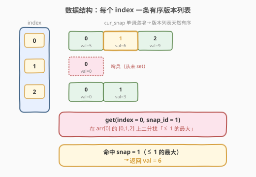
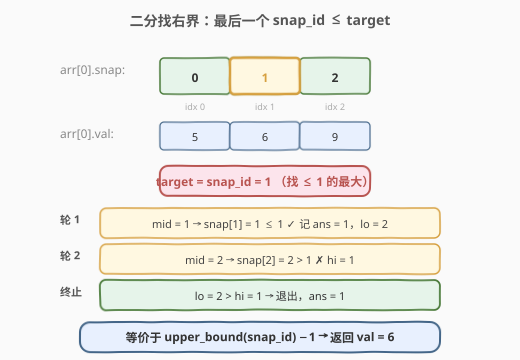
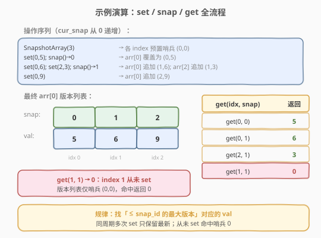

# LeetCode 快照数组 题解

## 1. 题目概述

- **标题 / 题号**：快照数组（#1146，medium）
- **链接**：https://leetcode.cn/problems/snapshot-array/
- **难度**：中等
- **标签**：设计、数组、二分查找

**题意**：实现一个支持「快照」的类数组数据结构 `SnapshotArray`：

- `SnapshotArray(int length)`：初始化长度为 `length` 的数组，**初始时每个元素都为 0**。
- `void set(index, val)`：将下标 `index` 处的元素设为 `val`。
- `int snap()`：拍一张快照，返回快照编号 `snap_id`（快照号 = 调用 `snap()` 的总次数减 1，即从 0 开始）。
- `int get(index, snap_id)`：返回编号为 `snap_id` 的快照中下标 `index` 的值。

**示例 1**：

```text
输入：
["SnapshotArray","set","snap","set","get"]
[[3],[0,5],[],[0,6],[0,0]]
输出：[null,null,0,null,5]

解释：
SnapshotArray snapshotArr = new SnapshotArray(3);   // 长度 3，全 0
snapshotArr.set(0, 5);   // array[0] = 5
snapshotArr.snap();      // 拍快照，返回 snap_id = 0，此时快照 0 = {5, 0, 0}
snapshotArr.set(0, 6);   // array[0] = 6（不影响已拍的快照 0）
snapshotArr.get(0, 0);   // 取快照 0 的 array[0]，返回 5
```

**约束**：

- `1 <= length <= 50000`
- `set`、`snap`、`get` 的总调用次数最多 `50000`。
- `0 <= index < length`
- `0 <= snap_id < 调用 snap() 的总次数`
- `0 <= val <= 10^9`

> 💡 本题是 [981. 基于时间的键值存储](../0901-1000/981_基于时间的键值存储.md) 的姊妹题：`981` 用 `timestamp` 给 `key` 建版本、`get` 二分找 `≤ timestamp` 的最新版本；本题用 `snap_id` 给 `index` 建版本、`get` 二分找 `≤ snap_id` 的最新版本。套路几乎一致，只是把「字符串 key」换成了「整数 index」，并预分配了 `length` 个版本列表。

## 2. 解题思路

### 2.1 暴力思路：每次 snap 拷贝整个数组

最直观的做法是：维护一个「当前数组」`cur`，每次调用 `snap()` 时把 `cur` **整份拷贝**存进一个快照池 `snaps[snap_id] = cur.copy()`。

| 操作 | 复杂度 | 说明 |
|------|--------|------|
| `set` | $O(1)$ | 直接改 `cur[index]` |
| `snap` | $O(\text{length})$ | 拷贝长度为 `length` 的数组 |
| `get` | $O(1)$ | 直接读 `snaps[snap_id][index]` |

`length` 与调用次数都可达 $5 \times 10^4$，最坏 $5 \times 10^4$ 次 `snap` × $5 \times 10^4$ 长度 ≈ $2.5 \times 10^9$ 次拷贝，时间与空间都会爆炸。需要避免「全量拷贝」。

### 2.2 核心观察：稀疏版本列表 + 二分



**关键观察**：大多数 `index` 在大多数快照之间**根本不会被 `set`**——它的值在连续多张快照里保持不变。那么对每个 `index`，我们只需记录「**值发生变化的那些快照**」，而无需为每张快照都存一份。

于是为每个 `index` 维护一个**按 `snap_id` 升序的版本列表**，每条记录 `(snap_id, val)` 表示「从该 `snap_id` 起，此 `index` 的值变为 `val`，直到下一条记录为止」：

- **`set(index, val)`**：在 `index` 的版本列表**末尾追加** `(cur_snap, val)`；若末条记录的 `snap_id` 已是 `cur_snap`（同一快照周期内多次 `set`），则**直接覆盖**末条 `val`，避免重复。$O(1)$ 均摊。
- **`snap()`**：`cur_snap += 1`，返回 `cur_snap - 1`。$O(1)$。
- **`get(index, snap_id)`**：在 `index` 的版本列表上**二分**，找「`snap_id' <= snap_id` 的最大下标」，取出对应 `val`。$O(\log m)$，`m` 为该 `index` 的版本数。

> 💡 **为什么版本列表天然有序？** `cur_snap` 单调递增，`set` 只在末尾追加（或覆盖末条），因此每个 `index` 的版本列表按 `snap_id` 严格递增——这正是二分所需的有序性前提，与 `981` 中「`set` 的时间戳严格递增」完全同理。

> ⚠️ **初始化哨兵**：构造时给每个 `index` 预置一条 `(0, 0)`——表示「快照 0 之前/之时，初始值为 0」。这样即使某 `index` 从未被 `set`，`get` 二分也至少能命中这条哨兵返回 `0`，无需特判空列表。

### 2.3 二分细节：找右边界



`get` 要的不是「是否存在某条 `snap_id' == snap_id`」，而是「`snap_id' <= snap_id` 的最大那条」——经典的**找右边界**，等价于 `upper_bound(snap_id) - 1`：

设 `lo = 0, hi = m - 1, ans = 0`（默认哨兵下标 0）：

- `mid = lo + (hi - lo) / 2`
- 若 `list[mid].snap <= snap_id`：记录 `ans = mid`，继续向右找更大的 → `lo = mid + 1`
- 否则：`list[mid].snap > snap_id`，向左收缩 → `hi = mid - 1`
- 循环结束 `ans` 即为最大合法下标，返回 `list[ans].val`。

> ⚠️ **不是存在性二分**：即使 `snap_id` 不在版本列表里（如版本 `[0,1,2]` 查 `snap_id=1` 命中，但查 `snap_id=1` 时若版本是 `[0,2]`，`1` 不在表中，仍应返回 `snap=0` 那条的值）。因此必须用**边界二分**而非「等于 target」的普通二分。

### 2.4 算法流程图


**完整步骤**：

1. **构造**：`cur_snap = 0`；为每个 `index` 预置版本列表 `[(0, 0)]`（哨兵）。
2. **`set(index, val)`**：
   - 若版本列表末条 `snap == cur_snap` → 覆盖末条 `val`。
   - 否则 → 追加 `(cur_snap, val)`。
3. **`snap()`**：`cur_snap += 1`，返回 `cur_snap - 1`。
4. **`get(index, snap_id)`**：在版本列表上二分找右边界，返回对应 `val`。

### 2.5 示例演算

以一个扩展示例演示（长度 3），全程 `cur_snap` 从 0 开始：



| 操作 | `cur_snap` 变化 | `arr[0]` 版本列表 | 说明 |
|------|----------------|------------------|------|
| `SnapshotArray(3)` | 0 | `[(0,0)]` | 各 index 预置哨兵 `(0,0)` |
| `set(0,5)` | 0 | `[(0,5)]` | 末条 `snap==0==cur_snap`，覆盖 `0→5` |
| `snap()` → 0 | 1 | `[(0,5)]` | 快照 0 定格 `array[0]=5` |
| `set(0,6)` | 1 | `[(0,5),(1,6)]` | 末条 `snap==0≠1`，追加 `(1,6)` |
| `set(2,3)` | 1 | — | `arr[2]` 追加 → `[(0,0),(1,3)]` |
| `snap()` → 1 | 2 | `[(0,5),(1,6)]` | 快照 1 定格 `array[0]=6, array[2]=3` |
| `set(0,9)` | 2 | `[(0,5),(1,6),(2,9)]` | 追加 `(2,9)` |

**查询验证**（在 `cur_snap=2` 之后）：

| 查询 | 二分过程 | 命中 | 返回 |
|------|----------|------|------|
| `get(0, 0)` | `[0,1,2]` 找 `≤0` → idx 0 | `(0,5)` | **5** |
| `get(0, 1)` | `[0,1,2]` 找 `≤1` → idx 1 | `(1,6)` | **6** |
| `get(2, 0)` | `arr[2]=[0,1]` 找 `≤0` → idx 0 | `(0,0)` | **0** |
| `get(2, 1)` | `arr[2]=[0,1]` 找 `≤1` → idx 1 | `(1,3)` | **3** |
| `get(1, 1)` | `arr[1]=[0]` 找 `≤1` → idx 0 | `(0,0)` | **0**（从未 set，命中哨兵）|

> 💡 **`get(1, 1)` 返回 0**：`index=1` 从未被 `set`，版本列表只有哨兵 `(0,0)`，任何 `snap_id ≥ 0` 都命中它返回 0。这正是预置哨兵的意义。

## 3. 参考代码

### C++

```cpp
class SnapshotArray {
    vector<vector<pair<int,int>>> data;   // data[index] = [(snap_id, val)]，按 snap_id 升序
    int cur_snap = 0;
public:
    SnapshotArray(int length) : data(length, {{0, 0}}) {}   // 每个 index 预置哨兵 (0,0)

    void set(int index, int val) {
        auto& v = data[index];
        if (v.back().first == cur_snap)    // 同一快照周期内多次 set：覆盖末条
            v.back().second = val;
        else                               // 新快照周期：追加版本
            v.emplace_back(cur_snap, val);
    }

    int snap() {
        return cur_snap++;                 // 返回当前 snap_id，然后自增
    }

    int get(int index, int snap_id) {
        const auto& v = data[index];
        int lo = 0, hi = (int)v.size() - 1, ans = 0;   // ans 默认 0（哨兵下标）
        while (lo <= hi) {
            int mid = lo + (hi - lo) / 2;
            if (v[mid].first <= snap_id) {             // <= snap_id，记录并向右找更大
                ans = mid;
                lo = mid + 1;
            } else {                                   // > snap_id，向左收缩
                hi = mid - 1;
            }
        }
        return v[ans].second;
    }
};
```

### Python

```python
from bisect import bisect_right


class SnapshotArray:
    def __init__(self, length: int):
        self.cur_snap = 0
        # 每个 index 维护两个平行列表：snap_ids（升序）与 vals
        self.snaps = [[0] for _ in range(length)]   # 哨兵 snap_id = 0
        self.vals  = [[0] for _ in range(length)]   # 哨兵 val = 0

    def set(self, index: int, val: int) -> None:
        if self.snaps[index][-1] == self.cur_snap:  # 同一快照周期：覆盖末条 val
            self.vals[index][-1] = val
        else:                                       # 新快照周期：追加版本
            self.snaps[index].append(self.cur_snap)
            self.vals[index].append(val)

    def snap(self) -> int:
        self.cur_snap += 1
        return self.cur_snap - 1

    def get(self, index: int, snap_id: int) -> int:
        # bisect_right 返回「> snap_id 的第一个下标」，减 1 即 <= snap_id 的最大下标
        i = bisect_right(self.snaps[index], snap_id) - 1
        return self.vals[index][i]
```

> 💡 Python 用标准库 `bisect.bisect_right` 一行搞定找右界；C++ 手写二分更直观可控，也可用 `std::upper_bound` 配 `pair` 比较。两个实现都靠「同周期覆盖末条」保证版本列表 `snap_id` **严格递增**（无重复），让二分语义干净。

## 4. 复杂度分析

| 维度 | 复杂度 | 说明 |
|------|--------|------|
| `set` 时间 | $O(1)$ 均摊 | 末尾追加或覆盖末条，均摊常数时间 |
| `snap` 时间 | $O(1)$ | 仅 `cur_snap += 1`，不拷贝任何数组 |
| `get` 时间 | $O(\log m)$ | `m` 为该 `index` 的版本数；二分每次折半 |
| 总时间 | $O(S + \log m \cdot G)$ | `S` 次 `set` + `G` 次 `get`；最坏 $m \le S$ |
| 空间 | $O(\text{length} + S)$ | 预置 `length` 个哨兵 + 至多 `S` 条版本记录 |

其中调用总数 $\le 5 \times 10^4$，单次 `get` 最多约 $\log_2(5\times10^4) \approx 16$ 次比较，远在时限内。对比暴力 `snap` 的 $O(\text{length})$，本题把快照开销从「按数组长度」降到「按 `set` 次数」——稀疏性越强收益越大。

## 5. 扩展：两种「同周期多次 set」的处理策略

`set` 在同一个 `snap_id` 周期内（两次 `snap()` 之间）可能被对同一 `index` 调用多次。有两种处理：

| 策略 | 做法 | 版本列表特征 | 代价 |
|------|------|-------------|------|
| **覆盖末条**（本文） | 末条 `snap == cur_snap` 时改 `val` | `snap_id` 严格递增、无重复 | `set` 需多一次末条比较 |
| **直接追加** | 不比较，每次 `set` 都 append | `snap_id` 非严格递增、可能有重复 | `get` 二分仍正确（找 `≤ snap_id` 的最右，重复时取最后一条即最新） |

「直接追加」实现更简单（省去末条比较），但版本列表可能更长（同周期 `set` 多少次就多多少条），空间常数略大。「覆盖末条」保证每条 `snap_id` 唯一，列表最紧凑。两者 `get` 的二分语义都不受影响——找的是「`≤ snap_id` 的最右下标」，重复 `snap_id` 时最右那条就是该周期最新值。

> 💡 若题目改为「`get` 要返回某个 `snap_id` 的值，且 `set` 允许指定时间戳（非单调）」，则需退化为平衡树（C++ `map<int,int>`、Java `TreeMap`），与 [981](../0901-1000/981_基于时间的键值存储.md) 第 5 节的「时间戳不递增」变体同处理。

## 6. 面试要点

1. **为什么 `snap()` 可以是 $O(1)$？核心优化是什么？**

   > 暴力做法在 `snap()` 时全量拷贝数组导致 $O(\text{length})$。核心优化是**稀疏版本化**：只在 `set` 时为对应 `index` 追加一条 `(snap_id, val)` 版本记录，`snap()` 只递增计数器不拷贝。把快照开销从「按数组长度」降到「按实际 `set` 次数」。

2. **`get` 的二分找的是哪种边界？为什么不是普通二分？**

   > 找「`snap_id' <= snap_id` 的最大下标」，即右边界，等价于 `upper_bound(snap_id) - 1`。普通二分找「等于 target」，但查询的 `snap_id` 可能不在版本列表中（某 `index` 在该快照周期没被 `set`），此时仍要返回最近的历史版本，故必须用边界二分。

3. **为什么每个 `index` 的版本列表天然有序？**

   > `cur_snap` 单调递增，`set` 只在末尾追加（或覆盖末条），因此版本列表按 `snap_id` 严格递增，满足二分的有序性前提。这与 [981](../0901-1000/981_基于时间的键值存储.md) 中「同一 `key` 的 `set` 时间戳严格递增」同理。

4. **初始化时为什么要预置 `(0, 0)` 哨兵？**

   > 避免对「从未被 `set` 的 `index`」做特判。预置 `(0, 0)` 表示「快照 0 起初始值为 0」，任何 `snap_id >= 0` 的 `get` 都至少能命中这条哨兵返回 0，二分的 `ans` 默认值也有了合法落点。

5. **同一快照周期内对同一 `index` 多次 `set` 怎么办？**

   > 覆盖末条：若版本列表末条 `snap == cur_snap`，直接改其 `val`，不新增条目。这保证 `snap_id` 严格递增无重复，列表最紧凑。即便不覆盖而是直接追加，`get` 的右边界二分仍正确（取最右那条即最新），只是空间常数略大。

> 💡 **一句话总结**：1146 是「稀疏版本化 + 二分」的设计题——每个 `index` 维护按 `snap_id` 升序的 `(snap_id, val)` 版本列表，`set` $O(1)$ 追加，`snap` $O(1)$ 计数，`get` $O(\log m)$ 二分找右界。与 [981](../0901-1000/981_基于时间的键值存储.md) 是同构姊妹题，把 `timestamp` 换成 `snap_id`、`key` 换成 `index` 即可互相迁移。

## 同类练习题

| # | 题目 | 与本题的关联 |
|---|------|-------------|
| 981 | [基于时间的键值存储](https://leetcode.cn/problems/time-based-key-value-store/)（[题解](../0901-1000/981_基于时间的键值存储.md)） | 同构姊妹题，`HashMap<key, 有序版本列表>` + 二分找 `≤ timestamp` 的右界，套路完全一致 |
| 704 | [二分查找](https://leetcode.cn/problems/binary-search/)（[题解](../0701-0800/704_二分查找.md)） | 二分母题，先吃透闭区间模板再迁移到边界二分 |
| 34 | [在排序数组中查找元素的第一个和最后一个位置](https://leetcode.cn/problems/find-first-and-last-position-of-element-in-sorted-array/) | 左 / 右边界二分的标准练习，与本题找右界同构 |
| 35 | [搜索插入位置](https://leetcode.cn/problems/search-insert-position/) | `lower_bound` 语义，对比本题的 `upper_bound - 1` |
| 146 | [LRU 缓存](https://leetcode.cn/problems/lru-cache/)（[题解](../0101-0200/146_LRU缓存.md)） | 设计题经典，对照「哈希 + 另一种结构」的设计范式 |
